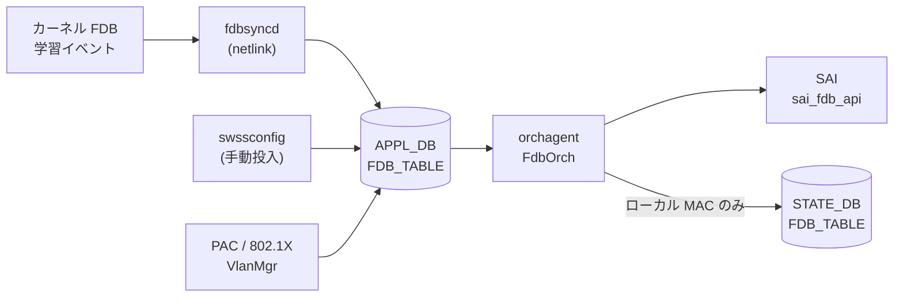

# APPL_DB FDB_TABLE

## 概要

[APPL_DB](../../reference/glossary.md#term-appl_db) の `FDB_TABLE` は**動的学習 MAC エントリ**と**静的プロビジョニング MAC エントリ**の両方を保持する実行時テーブルである[^1]。

CONFIG_DB の `FDB` テーブルが静的エントリの設定ソースであるのに対し、`APPL_DB FDB_TABLE` はカーネルの FDB 学習イベント (`fdbsyncd`) や `swssconfig` 投入、PAC/802.1X 認証 (`VlanMgr`) など複数の書き込み経路を持ち、`orchagent` の `FdbOrch` が SAI FDB エントリへと変換する。

<!-- defaults -->
## コード由来デフォルト

### field: `type`

`fdborch.cpp:770` で `string type = "dynamic";` と初期化される。フィールドが APPL_DB に存在しない場合は `"dynamic"` がデフォルトとして使用される。

```cpp
// sonic-swss/orchagent/fdborch.cpp:769-770
string port = "";
string type = "dynamic";
```

有効値: `"static"` / `"dynamic"` / `"dynamic_local"`（MCLAG ローカル扱い）。

`fdborch.cpp:830` に assert チェックがある:

```cpp
assert(type == "dynamic" || type == "dynamic_local" || type == "static");
```

無効な `type` 値は orchagent プロセスのクラッシュを引き起こす。

### field: `port`

`fdborch.cpp:769` で `string port = "";` と初期化される。フィールドが省略されると空文字のまま `addFdbEntry()` に渡され、ポート解決に失敗して FDB エントリが登録されない。実装上は**必須フィールド**。

### field: `discard`

`fdborch.cpp:775` で `string discard = "false";` と初期化される。PAC/802.1X が設定した MAC エントリの破棄制御に使用する。フィールド不在時は `"false"`（破棄しない）と解釈される。

### VlanMgr (PAC) 側の producer デフォルト

`vlanmgr.cpp:806` での初期値は consumer 側と異なる点に注意:

```cpp
// sonic-swss/cfgmgr/vlanmgr.cpp:806
string port, discard = "false", type = "static";
```

PAC/802.1X 経由の書き込みでは `type` デフォルトが `"static"` となる。

### SAI 型マッピング

| `type` 値 | origin | SAI 型 |
|-----------|--------|--------|
| `"dynamic"` | LEARN / PROVISIONED | `SAI_FDB_ENTRY_TYPE_DYNAMIC` |
| `"static"` | PROVISIONED | `SAI_FDB_ENTRY_TYPE_STATIC` |
| `"dynamic_local"` | MCLAG_ADVERTIZED | `SAI_FDB_ENTRY_TYPE_DYNAMIC`（aging 有効化目的） |
| `"static"` | VXLAN_ADVERTIZED / MCLAG_ADVERTIZED | `SAI_FDB_ENTRY_TYPE_STATIC` |

<!-- /defaults -->

## key 構造

```text
FDB_TABLE:<VlanName>:<MAC>
```

- `<VlanName>`: `Vlan<id>` 形式 (例: `Vlan100`)
- `<MAC>`: MAC アドレス (例: `00:11:22:33:44:55`)

!!! note "APPL_DB key 区切り文字"
    APPL_DB では key 区切り文字がコロン (`:`) であり、CONFIG_DB のパイプ (`|`) とは異なる。

## フィールド一覧

| フィールド | 型 | 必須 | デフォルト | 説明 |
|-----------|----|------|-----------|------|
| `port` | string | 実質必須 | `""` (空) | 送出ポート名 (例: `Ethernet0`, `PortChannel1`) |
| `type` | enum | - | `"dynamic"` | エントリ種別: `"static"` / `"dynamic"` / `"dynamic_local"` |
| `discard` | `"true"` \| `"false"` | - | `"false"` | `"true"` で該当 MAC パケットを破棄 (PAC 用) |

### VXLAN 経由エントリの追加フィールド

`VXLAN_FDB_TABLE` 起源のエントリのみ追加フィールドが付く:

| フィールド | 型 | デフォルト | 説明 |
|-----------|----|-----------|------|
| `remote_vtep` | string (IP) | `""` | リモート VTEP の IP アドレス |
| `esi` | string | `""` | Ethernet Segment Identifier (EVPN) |
| `vni` | uint32 | `0` | VXLAN Network Identifier |

## 書き込み経路

| 書き込み元 | コード箇所 | `type` デフォルト | 備考 |
|-----------|----------|-----------------|------|
| `fdbsyncd` (動的学習) | `fdbsync.cpp` — kernel netlink → APPL_DB 直書き | `"dynamic"` | MAC 学習イベントをリアルタイムに反映 |
| `swssconfig` (手動投入) | `swssconfig -d -j fdb.json` | JSON に依存 | CONFIG_DB `FDB` → `swssconfig` → APPL_DB |
| VlanMgr / PAC | `vlanmgr.cpp:832` | `"static"` | 802.1X 認証後に投入 |
| VXLAN FDB Sync | `fdbsync.cpp:676` | `"dynamic"` | VXLAN_FDB_TABLE 経由 → FdbOrch が統合 |

## 購読者

- **orchagent / FdbOrch**: `APP_FDB_TABLE_NAME` を購読して SAI FDB エントリを作成・削除する (`orchdaemon.cpp:227`)
- STATE_DB `FDB_TABLE` にローカル MAC の `port` / `type` を書き戻す（`fdborch.cpp:1577-1582`）

## データフロー



## 例外条件・特殊挙動

- **`port` 省略時**: `addFdbEntry()` でポート解決が失敗し、エントリが追加されない。エラーログ出力。
- **`type` の assert チェック**: `fdborch.cpp:830` で無効な type 値はプロセスクラッシュを引き起こす。
- **`dynamic_local`**: MCLAG ピアから受信した MAC を aging 対象として扱うための内部値。ユーザーが直接設定することは想定されていない。
- **FDB_ORIGIN と type の組み合わせ**: `{"static", FDB_ORIGIN_LEARN}` は無効な組み合わせとしてコメントされている (`fdborch.h:57`)。

<!-- ordering -->
## 書込み順依存 (Phase B)

`FdbOrch::doTask(Consumer&)` / `addFdbEntry()` / `removeFdbEntry()` (`sonic-swss/orchagent/fdborch.cpp`) を全行精読した結果、以下の順序依存・タイミング依存を検出した。中間ノート: `meta/_intermediate/cdb-flow/appl-fdb-ordering.md`。

### 他テーブル先行必須

| 先行条件 | 理由 | 違反時の挙動 |
|---|---|---|
| PortsOrch `allPortsReady()` | `doTask()` 冒頭の全体ガード | 全 PORT の SAI 作成完了まで FDB_TABLE のイベントは一切処理されず `m_toSync` に滞留（`fdborch.cpp:711-714`） |
| `VLAN|<name>` (= PortsOrch に `Vlan<id>` 登録済み) | `doTask()` で `m_portsOrch->getPort(keys[0], vlan)` により VLAN OID を解決 | SET は `it++` で次周回再試行（**自動ポーリング**）、DEL は `deleteFdbEntryFromSavedFDB()` だけ実行して erase（`fdborch.cpp:739-761`） |
| `PORT|<alias>` の bridge_port 作成完了 | `addFdbEntry()` が `port.m_bridge_port_id != SAI_NULL_OBJECT_ID` を要求 | `saved_fdb_entries[port_name]` に push して保留。PortsOrch observer 経由で replay（`fdborch.cpp:1297-1304`） |
| `VLAN_MEMBER|<vlan>|<port>` | `addFdbEntry()` が `m_portsOrch->isVlanMember()` を要求 | 同上 `saved_fdb_entries` に保留。`updateVlanMember(add=true)` で **自動 replay**（`fdborch.cpp:1240-1275, 1312-1319`） |
| VxlanTunnelOrch / EvpnNvoOrch の tunnel 作成 (`APP_VXLAN_FDB_TABLE` 経路のみ) | `getTunnelPortName(remote_ip)` / `getEVPNVtep()` の解決を要求 | **再試行されず `m_toSync.erase` で破棄**。tunnel を先に作る運用が必須（`fdborch.cpp:832-856`） |

**推奨書込み順序**:

```text
# 1. PortsOrch 初期化完了 (orchagent 起動時に自然満足)
# 2. VLAN
SET CONFIG_DB VLAN|Vlan100
# 3. VLAN メンバーシップ (PORT は CONFIG_DB PORT で先に作成済み前提)
SET CONFIG_DB VLAN_MEMBER|Vlan100|Ethernet0
# 4. (VXLAN MAC を投入する場合) tunnel を先に作成
# 5. FDB エントリ
SET APPL_DB FDB_TABLE:Vlan100:00:11:22:33:44:55  port=Ethernet0  type=static
```

### retry / 自動調停の仕組み

- **doTask 周回再試行**: VLAN 未解決の SET は `m_toSync` に残し続け、`Orch::doTask()` の次回スケジュールで再評価される。VLAN 作成完了まで無限ポーリング。
- **saved_fdb_entries による保留**: PORT 未解決 / VLAN メンバー未満足の SET は `saved_fdb_entries[port_name]` に push して**呼び出し側からは成功扱い** (`return true`) で `m_toSync` から消える。実際の SAI 作成は PortsOrch からの `updateVlanMember()` 通知で `addFdbEntry()` を再実行することで完了する (`fdborch.cpp:39` `m_portsOrch->attach(this)` で observer 登録)。
- **VXLAN 経路は救済なし**: `remote_ip` 未指定 / VTEP 未作成のときは `m_toSync.erase` で**破棄**される。再投入が必要。

### SET 後 DEL の順序依存

| シナリオ | 挙動 | 安全な手順 |
|---|---|---|
| 投入した origin と異なる origin から DEL | `removeFdbEntry()` L1663-1690 で **silently ignored** (MCLAG ピアポート down 時のみ例外で LEARN として削除) | **投入と同じ origin** から DEL する。VXLAN 由来 MAC を直 APPL_DB DEL しても消えない |
| VLAN DEL → FDB DEL の到着逆転 | `doTask()` L742-754 が vlan_id を `keys[0].substr(4)` でパースし `deleteFdbEntryFromSavedFDB()` でクリーンアップ | 自動調停。順序意識不要 |
| `m_entries` に存在しない MAC の DEL (二重 DEL / 学習前 DEL) | `removeFdbEntry()` L1646-1654 で saved_fdb のみクリーンアップして冪等成功 | 安全（冪等） |
| VLAN_MEMBER DEL → FDB は残存？ | `updateVlanMember(add=false)` L1244-1250 で `flushFDBEntries(bridge_port, vlan_oid)` を呼び **当該 VLAN の MAC を一括 flush** | VLAN_MEMBER DEL は FDB DEL を内包。明示 DEL 不要 |

### 入力検証 (fail-fast)

- `doTask()` L830 `assert(type == "dynamic" || type == "dynamic_local" || type == "static")` — 不正な `type` 値は **orchagent プロセスをクラッシュ**させる。Producer 側で値の妥当性を保証すること。

<!-- /ordering -->

<!-- platform -->
## プラットフォーム差 (Phase H)

`fdborch.cpp` 全 1802 行を精読し、SAI capability への依存、MCLAG 連動、multi-asic / VOQ の観点でプラットフォーム差を抽出した。中間ノート: `meta/_intermediate/cdb-flow/appl-fdb-platform.md`。

### 1. SAI capability への依存（capability query なし）

FdbOrch は SAI capability を**事前 query せず**、以下の attr / API を無条件に使う。一部の vendor SAI 実装で未サポートの場合、`create_fdb_entry` / `flush_fdb_entries` が `SAI_STATUS_NOT_SUPPORTED` を返し `handleSaiCreateStatus()` が task_failed を返すパスに入る。

| SAI attr / API | 使用条件 | コード箇所 |
|----|----|----|
| `SAI_FDB_ENTRY_ATTR_ALLOW_MAC_MOVE = true` | origin が VXLAN_ADVERTIZED または MCLAG_ADVERTIZED **かつ** `type == "dynamic"` の MAC を SAI に登録するとき | `fdborch.cpp:1441-1448` |
| `SAI_FDB_ENTRY_ATTR_ALLOW_MAC_MOVE = true`（AGE/MOVE 通知での再投入） | MCLAG remote MAC が aging/move 通知で削除されるのを救済する経路 | `fdborch.cpp:507-509`, `583-585` |
| `SAI_FDB_ENTRY_ATTR_ALLOW_MAC_MOVE = false` への落とし込み | origin が VXLAN_ADVERTIZED から local に切り替わったとき / dynamic から static へ昇格したとき | `fdborch.cpp:1487-1497` |
| `SAI_FDB_FLUSH_ATTR_BRIDGE_PORT_ID` + `SAI_FDB_FLUSH_ATTR_BV_ID` + `SAI_FDB_FLUSH_ATTR_ENTRY_TYPE=DYNAMIC` の 3 attr 同時指定 flush | port down / VLAN_MEMBER 削除 / FDB flush コマンド受信時 | `fdborch.cpp:949-1170` |

### 2. FDB aging の扱い

FDB aging time そのものは **SwitchOrch** が `SAI_SWITCH_ATTR_FDB_AGING_TIME` で一元管理する設計で、FdbOrch は aging 通知 (`SAI_FDB_EVENT_AGED`) を**受信する側**として動作する (`fdborch.cpp:421-545`)。

`dynamic_local`（MCLAG remote を ASIC 上ローカル扱いに格上げした状態）は意図的に `SAI_FDB_ENTRY_TYPE_DYNAMIC` で登録され、コメントに `aging enabled` と明記されている (`fdborch.cpp:1552-1556`)。これにより、ピア由来 MAC でも一定時間トラフィックが無ければ ASIC 側 aging により消える。

**プラットフォーム差の注意**:

- ASIC によっては aging 通知が**個別 MAC 単位で発行されず**、バルク flush 経由でのみ通知される実装がある。
- `dynamic_local` の aging 有効化前提が成立しない vendor SAI では、MCLAG remote MAC が削除されず残る可能性がある。

いずれも fdborch.cpp 側に capability 分岐は無く、ASIC 実装依存。

### 3. MCLAG 連動

| 動作 | 条件 | コード箇所 |
|----|----|----|
| port oper-down 時の自動 FDB flush を**スキップ** | `gMlagOrch->isMlagInterface(port)` が true | `fdborch.cpp:1209-1213` |
| `STATE_DB MCLAG_FDB_TABLE` への書き戻し | origin == `FDB_ORIGIN_MCLAG_ADVERTIZED` の add | `fdborch.cpp:872-878`, `1595-1602` |
| `STATE_DB MCLAG_FDB_TABLE` からの削除 | MCLAG remote の DEL / `dynamic_local` 格上げ / local 学習による origin 切替 | `fdborch.cpp:901-908`, `1606-1612`, `124-129` |
| AGE 通知での MCLAG remote MAC 再投入 | aging 通知が来ても MCLAG origin の場合は `create_fdb_entry` を再実行 | `fdborch.cpp:490-545` |

**MCLAG 非対応プラットフォーム**: `gMlagOrch` 自体は orchagent に常に生成されるが、MCLAG メンバーが登録されない場合 `isMlagInterface()` は常に false を返すだけ。`FDB_ORIGIN_MCLAG_ADVERTIZED` の origin もそもそも発生しない（`APP_MCLAG_FDB_TABLE_NAME` への書き込みが行われない）ため、MCLAG 関連の SAI attr (`ALLOW_MAC_MOVE`) も発行されない。実質 no-op で MCLAG 非対応 ASIC でも機能影響なし。

### 4. multi-asic / VOQ chassis

`fdborch.cpp` 内に `gMySwitchType` / `namespace` / `VOQ` / `chassis` / `fabric` への分岐は**存在しない**（全行 grep 結果 0 hit）。

- **multi-asic プラットフォーム**: orchagent が asic 単位で独立プロセスとして起動するため、FdbOrch も asic ごとに独立して動作する。ASIC 間で FDB を共有・同期する処理は FdbOrch のスコープ外。
- **VOQ chassis**: system-FDB（chassis 全体で MAC を共有する仕組み）は本 Orch ではなく `fpmsyncd` / chassis_app_db 系で処理される。`APPL_DB FDB_TABLE` 自体は asic-local。

### 5. プラットフォーム差サマリ

| 観点 | プラットフォーム差 | コード上の capability 分岐 |
|----|----|----|
| MAC move (`ALLOW_MAC_MOVE`) | vendor SAI で未サポートだと VXLAN/MCLAG dynamic MAC 登録が失敗 | **なし**（無条件 attr 投入） |
| FDB aging 通知 | 通知粒度・aging 対象判定が ASIC 依存 | **なし**（通知前提で記述） |
| FDB flush の 3 attr 同時指定 | vendor SAI で組合せ制約あり得る | **なし** |
| MCLAG（port oper-down / state 書き戻し） | MCLAG 非対応プラットフォームでは実質 no-op | `gMlagOrch->isMlagInterface()` の結果でのみ分岐 |
| multi-asic / VOQ | asic 単位独立、横断同期なし | **なし**（fdborch.cpp は asic-local） |

<!-- /platform -->

## 関連 CONFIG_DB / YANG / CLI

- CONFIG_DB: `FDB`（静的エントリのソース）、`VLAN`、`VLAN_MEMBER`
- CLI: `show mac` (FDB テーブル表示)、`sonic-clear fdb all` (動的エントリクリア)

<!-- cross-refs -->
## 暗黙参照 (cross-table refs)

`APPL_DB FDB_TABLE` は YANG 未定義のため leafref は持たないが、`FdbOrch` (orchagent) が他テーブル / 他 Orch から OID を解決して SAI に渡す**暗黙参照**を多数持つ。コード調査の詳細は `meta/_intermediate/cdb-flow/appl-fdb-cross-refs.md` に記録した。

### 1. VLAN（key の `<VlanName>` — 必須依存）

- **参照先**: CONFIG_DB `VLAN` / APPL_DB `VLAN_TABLE`
- **方向**: 読み取り (`PortsOrch::getPort(VlanName)` → `vlan_oid`)
- **参照元**: `fdborch.cpp:739`（key 分解後の VLAN 解決）, `fdborch.cpp:765`（`entry.bv_id = vlan.m_vlan_info.vlan_oid`）
- **意味**: `Vlan<id>` を SAI `vlan_oid` に解決し、SAI FDB entry の `bv_id` に設定する。VLAN 未作成だと `m_toSync` に保留され、後で VLAN が作成されたタイミングで再試行される。
- **ブロッキング**: `allPortsReady()` が false の間、`doTask()` は全 FDB 処理を停止する (`fdborch.cpp:711` / `fdborch.cpp:927`)。

### 2. PORT / PORTCHANNEL（フィールド `port` — 実質必須）

- **参照先**: `PORT` / `PORTCHANNEL`（および VXLAN tunnel 仮想 port）
- **方向**: 読み取り (`PortsOrch::getPort(alias)` → `m_bridge_port_id`)
- **参照元**: `fdborch.cpp:976`（PORT flush 操作）, `fdborch.cpp:1449`（`SAI_FDB_ENTRY_ATTR_BRIDGE_PORT_ID` 設定）
- **意味**: `port` フィールドを `Port` オブジェクトに解決し、その `bridge_port_id` を SAI FDB entry に渡す。bridge port が未生成だと `addFdbEntry()` が失敗。SAI FDB イベント側でも `getPortByBridgePortId()` で逆解決される (`fdborch.cpp:297` / `340` / `438` / `564` / `698`)。

### 3. VLAN_MEMBER（FDB flush 連動 — 購読）

- **参照先**: `VLAN_MEMBER`（`PortsOrch` 経由）
- **方向**: `SUBJECT_TYPE_VLAN_MEMBER_CHANGE` 購読
- **参照元**: `fdborch.cpp:39`（`m_portsOrch->attach(this)`）, `fdborch.cpp:655`
- **意味**: Port が VLAN から削除されると、その port × vlan に紐づく動的 FDB を SAI flush する。FDB エントリ自体が VLAN_MEMBER を read するわけではなく、`PortsOrch` のサブジェクト通知経由で flush 連動する。

### 4. VXLAN_TUNNEL / VXLAN_EVPN_NVO（VXLAN_ADVERTIZED 起源のみ）

- **参照先**: CONFIG_DB `VXLAN_TUNNEL` / `VXLAN_EVPN_NVO`（`VxlanTunnelOrch` / `EvpnNvoOrch` 管理）
- **方向**: 読み取り (`getTunnelPortName(remote_ip)` / `getEVPNVtep()`)
- **参照元**: `fdborch.cpp:834-857`, `fdborch.cpp:1467` / `1481`（`SAI_FDB_ENTRY_ATTR_ENDPOINT_IP`）
- **意味**: write 元テーブルが `VXLAN_FDB_TABLE` のとき (`origin == FDB_ORIGIN_VXLAN_ADVERTIZED`)、`remote_ip` フィールドからリモート VTEP IP を取得して `VxlanTunnelOrch::getTunnelPortName()` でトンネル port 名に解決。`port` フィールドはこの解決値で上書きされる。DIP-tunnel 非対応モードでは `EvpnNvoOrch::getEVPNVtep()` で SIP tunnel を使用。VTEP / tunnel 未作成だと該当 FDB は `m_toSync` から erase されて無視される。

### 5. STATE_DB FDB_TABLE（ローカル MAC の書き戻し）

- **参照先**: STATE_DB `FDB_TABLE`（`m_fdbStateTable`）
- **方向**: 書き込み
- **参照元**: `fdborch.cpp:131-134`, `fdborch.cpp:1569-1582`
- **意味**: ローカル学習 / 解決された MAC の `port` / `type` を STATE_DB に書き戻し、`show mac` / `fdbshow` CLI の表示ソースとする。MCLAG_ADVERTIZED 起源は除外。

### 6. STATE_DB MCLAG_FDB_TABLE（MCLAG_ADVERTIZED 起源のみ）

- **参照先**: STATE_DB `MCLAG_FDB_TABLE`（`m_mclagFdbStateTable`）
- **方向**: 書き込み / 削除
- **参照元**: `fdborch.cpp:872-878`（追加）, `fdborch.cpp:901-908`（削除）
- **意味**: MCLAG ピアから advertise された MAC を STATE_DB に書き、`mclagsyncd` がピア同期に使う。`dynamic_local` に格上げされたタイミングで state エントリを削除し、broadcast 対象から外す。

### 7. PortsOrch SUBJECT 通知 (`PORT_OPER_STATE_CHANGE` 等)

- **参照先**: `PortsOrch` observer
- **方向**: 購読
- **参照元**: `fdborch.cpp:655-661`
- **意味**: Port oper-down 等の物理層イベントを観察し、該当 port の動的 FDB を SAI flush する。

### 参照関係サマリ

```
APPL_DB FDB_TABLE
  |- [必須]  VLAN.name                       (key の <VlanName> -> vlan_oid)
  |- [必須]  PORT / PORTCHANNEL              (port field -> bridge_port_id)
  |- [購読]  VLAN_MEMBER                     (flush 連動)
  |- [VXLAN] VXLAN_TUNNEL / VXLAN_EVPN_NVO  (VXLAN_ADVERTIZED 起源のみ — port 名置換 / endpoint IP)
  |- [出力]  STATE_DB FDB_TABLE              (ローカル MAC の書き戻し)
  |- [出力]  STATE_DB MCLAG_FDB_TABLE        (MCLAG_ADVERTIZED 起源のみ)
  `- [購読]  PortsOrch SUBJECT_TYPE_*        (Port oper / VLAN member 変化に flush 連動)
```

YANG leafref が存在しないため、これら参照はいずれも実行時にコード経由で解決され、参照先テーブルの作成順序が崩れた場合は該当 FDB エントリが `m_toSync` 保留または erase される。

<!-- /cross-refs -->

## 引用元

[^1]: `sonic-swss-common/common/schema.h:52` — `#define APP_FDB_TABLE_NAME "FDB_TABLE"`. <https://github.com/sonic-net/sonic-swss-common/blob/master/common/schema.h>
