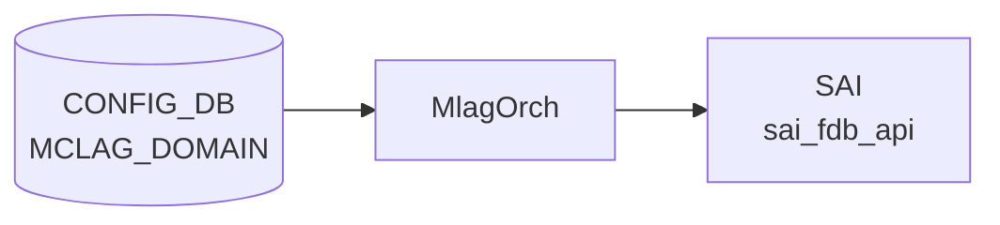

# APPL_DB MCLAG/ICCP 関連テーブル

## 概要

MC-[LAG](../../reference/glossary.md#term-lag) (Multi-Chassis Link Aggregation) の実行時状態は `mclagsyncd` が管理する[^link]。`mclagsyncd` は `iccpd`（ICCP デーモン）から Unix ソケット経由で IPC メッセージを受信し、`ProducerStateTable` 経由で [APPL_DB](../../reference/glossary.md#term-appl_db) に書き込む。

書き込まれるテーブルは 5 種類[^schema]:

| [APPL_DB](../../reference/glossary.md#term-appl_db) テーブル | 目的 |
|----------------|------|
| `MCLAG_FDB_TABLE` | ピア同期 MAC アドレスエントリ |
| `ISOLATION_GROUP_TABLE` | ポート分離グループ（対応プラットフォームのみ） |
| `ACL_TABLE_TABLE` / `ACL_RULE_TABLE` | ポート分離 [ACL](../../reference/glossary.md#term-acl)（非対応プラットフォームのフォールバック） |
| `LAG_TABLE` | [PortChannel](../../reference/glossary.md#term-portchannel) の MAC 学習モード・トラフィック分散制御 |
| `PORT_TABLE` | 物理ポートの MAC 学習モード制御 |
| `INTF_TABLE` | インタフェースの MAC アドレス上書き |

[STATE_DB](../../reference/glossary.md#term-state_db) への書き込み（`MCLAG_TABLE`・`MCLAG_LOCAL_INTF_TABLE`・`MCLAG_REMOTE_INTF_TABLE`）は `mclagsyncd` が直接行うが、本ページでは [APPL_DB](../../reference/glossary.md#term-appl_db) を対象とする。

---

<!-- cdb-mermaid -->
### データフロー (自動生成)



!!! note "凡例"
    CONFIG_DB から SAI までの典型経路を `docs/reference/config-db-orch-map.md` から機械生成したミニ図。詳細・例外は本ページ本文と対応表を参照。
<!-- /cdb-mermaid -->

## MCLAG_FDB_TABLE

### key 構造

```text
MCLAG_FDB_TABLE|Vlan<vid>:<mac>
```

例: `MCLAG_FDB_TABLE|Vlan100:00:01:02:03:04:05`

### フィールド

| フィールド | 型 | 説明 |
|-----------|----|----|
| `port`    | string | MAC エントリが所属するインタフェース名（[PortChannel](../../reference/glossary.md#term-portchannel) 名など） |
| `type`    | string | エントリ種別。`"static"` / `"dynamic"` / `"dynamic_local"` |

`type` の値は `iccpd` が IPC で送る `MCLAG_FDB_TYPE` 列挙値に基づく[^link]:

| 列挙値 | 値 | `type` 文字列 |
|--------|-----|-------------|
| `MCLAG_FDB_TYPE_STATIC` | 1 | `"static"` |
| `MCLAG_FDB_TYPE_DYNAMIC` | 2 | `"dynamic"` |
| `MCLAG_FDB_TYPE_DYNAMIC_LOCAL` | 3 | `"dynamic_local"` |

`dynamic_local` は aging が有効なローカルエントリとして ASIC に書き込む際に使用する。

---

## ISOLATION_GROUP_TABLE

ポート分離（ピアリンク経由ループ防止）に使用する。プラットフォームが `broadcom`・`barefoot`・`centec`・`clounix`・`marvell-prestera`・`marvell-teralynx` のいずれかの場合に書き込まれる[^link]。

### key 構造

```text
ISOLATION_GROUP_TABLE|MCLAG_ISO_GRP
```

キーは `"MCLAG_ISO_GRP"` 固定（1 エントリのみ）。

### フィールド

| フィールド    | 型 | 値 |
|--------------|----|----|
| `DESCRIPTION` | string | `"Isolation group for MCLAG"`（ハードコード） |
| `TYPE`        | string | `"bridge-port"`（ハードコード） |
| `PORTS`       | string | 分離元ポート名（[MCLAG](../../reference/glossary.md#term-mclag) インタフェース） |
| `MEMBERS`     | string | 分離先PortChannel 名（カンマ区切り）。全リモートが down のとき空文字列 |

`MEMBERS` は `Ethernet` で始まるポートが除外された [PortChannel](../../reference/glossary.md#term-portchannel) 名のみが設定される[^link]。ICCP セッションが down で全リモートインタフェースが down の場合は `MEMBERS` を空にしてエントリを保持し、ICCP セッション自体が切断 (`is_iccp_up == false`) の場合はエントリを DEL する。

---

## ACL フォールバック（非対応プラットフォーム）

上記プラットフォーム以外では isolation group の代わりに [ACL](../../reference/glossary.md#term-acl) を使用する[^link]:

### ACL_TABLE_TABLE

| キー | フィールド | 値 |
|------|-----------|---|
| `mclag` | `policy_desc` | `"Mclag egress port isolate acl"` |
| | `type` | `"L3"` |
| | `ports` | 分離元ポート名 |

### ACL_RULE_TABLE

| キー | フィールド | 値 |
|------|-----------|---|
| `mclag:mclag` | `IP_TYPE` | `"ANY"` |
| | `OUT_PORTS` | 分離先 Ethernet ポート名（PortChannel 除外後） |
| | `PACKET_ACTION` | `"DROP"` |

分離先ポートが空（`op_len == 0`）の場合は `ACL_TABLE_TABLE` の `mclag` エントリを DEL する。

---

## LAG_TABLE

### MAC 学習モード

`setPortMacLearnMode()` がポートが PortChannel の場合に LAG_TABLE へ書き込む[^link]:

| フィールド    | 型 | 値 |
|--------------|----|----|
| `learn_mode` | string | `"hardware"` または `"disable"` |

`MCLAG_SUB_OPTION_TYPE_MAC_LEARN_ENABLE` → `"hardware"`、`MCLAG_SUB_OPTION_TYPE_MAC_LEARN_DISABLE` → `"disable"`。

### トラフィック分散制御

`mclagsyncdSetTrafficDisable()` が PortChannel のトラフィック分散を制御する[^link]:

| フィールド        | 型 | 値 |
|-----------------|----|----|
| `traffic_disable` | string | `"true"` または `"false"` |

`MCLAG_MSG_TYPE_SET_TRAFFIC_DIST_DISABLE` → `"true"`（分散無効化）、`ENABLE` → `"false"`。

---

## PORT_TABLE

物理ポートの MAC 学習モード。PortChannel でないポートに `setPortMacLearnMode()` が書き込む[^link]:

| フィールド    | 型 | 値 |
|--------------|----|----|
| `learn_mode` | string | `"hardware"` または `"disable"` |

---

## INTF_TABLE

`setIntfMac()` がインタフェースの MAC アドレスを書き込む[^link]:

| フィールド  | 型 | 説明 |
|------------|----|----|
| `mac_addr` | string | ICCP が決定したシステム MAC アドレス |

ICCP のロール（active / standby）確定後に iccpd が `MCLAG_MSG_TYPE_SET_INTF_MAC` メッセージで通知する。

---

## 書き込み主体・消費者

| 書き込み元 | テーブル | 消費者 |
|-----------|---------|-------|
| `mclagsyncd` | `MCLAG_FDB_TABLE` | `fdborch` ([orchagent](../../reference/glossary.md#term-orchagent)) |
| `mclagsyncd` | `ISOLATION_GROUP_TABLE` | `isolationGroupOrch` |
| `mclagsyncd` | `ACL_TABLE_TABLE` / `ACL_RULE_TABLE` | `aclOrch` |
| `mclagsyncd` | `LAG_TABLE` | `lagOrch` |
| `mclagsyncd` | `PORT_TABLE` | `portOrch` |
| `mclagsyncd` | `INTF_TABLE` | `intfOrch` |

<!-- defaults -->
## フィールドの暗黙デフォルト (Phase A)

以下はコード精読により判明した APPL_DB [MCLAG](../../reference/glossary.md#term-mclag) 関連フィールドのコード由来デフォルト[^link][^schema]。

### MCLAG_FDB_TABLE — フィールドのデフォルトなし

`setFdbEntry()` L465–521 は `port` と `type` の 2 フィールドを必ず明示的に書き込む。省略ロジックは存在しない。

| フィールド | 省略ルール | iccpd 送信側デフォルト |
|-----------|-----------|---------------------|
| `port`    | 省略なし（常に SET） | なし（必須フィールド） |
| `type`    | 省略なし（常に SET） | `"dynamic"` (最頻値) |

### ISOLATION_GROUP_TABLE — DESCRIPTION・TYPE は固定値

```cpp
// mclaglink.cpp L235, L236, L272, L273
fvts.emplace_back("DESCRIPTION", "Isolation group for MCLAG");
fvts.emplace_back("TYPE", "bridge-port");
```

| フィールド    | コード由来デフォルト | 変更可否 |
|--------------|-------------------|---------|
| `DESCRIPTION` | `"Isolation group for MCLAG"` | 不可（ハードコード） |
| `TYPE`        | `"bridge-port"` | 不可（ハードコード） |
| `MEMBERS`     | `""` (空文字列) — リモート全断時 | ICCP up 時は実値 |

### LAG_TABLE.learn_mode — ENABLE/DISABLE の 2 値のみ

```cpp
// mclaglink.cpp L393, L397
if (op_hdr->op_type == MCLAG_SUB_OPTION_TYPE_MAC_LEARN_ENABLE)
    learn_mode = "hardware";
else if (op_hdr->op_type == MCLAG_SUB_OPTION_TYPE_MAC_LEARN_DISABLE)
    learn_mode = "disable";
```

[MCLAG](../../reference/glossary.md#term-mclag) は起動時にリモート側PortChannel の MAC 学習を `"disable"` にし、ICCP セッション確立後は `"hardware"` に戻す。中間状態は存在せず、値は必ず `"hardware"` か `"disable"` のいずれか。

### LAG_TABLE.traffic_disable — ICCP ロール確定前は書き込みなし

```cpp
// mclaglink.cpp L1308, L1310
if (msg_type == MCLAG_MSG_TYPE_SET_TRAFFIC_DIST_DISABLE)
    traffic_dist_disable = "true";
else
    traffic_dist_disable = "false";
```

iccpd からのメッセージがある場合のみ書き込まれる。フィールド不在時の [orchagent](../../reference/glossary.md#term-orchagent) 側デフォルトは `"false"`（分散有効）。

### CONFIG_DB keepalive_interval / session_timeout のデフォルト（iccpd 内）

`MCLAG_DOMAIN` テーブルの `keepalive_interval` / `session_timeout` が省略（空文字列）の場合、mclagsyncd は値 `-1` として iccpd へ送信し、iccpd 内でデフォルト値にフォールバックする[^sched][^csm]:

| [CONFIG_DB](../../reference/glossary.md#term-config_db) フィールド | 省略時の iccpd 内部デフォルト | 定数 |
|--------------------|--------------------------|------|
| `keepalive_interval` | `1` 秒 | `CONNECT_INTERVAL_SEC` (`scheduler.h:40`) |
| `session_timeout`    | `15` 秒 | `HEARTBEAT_TIMEOUT_SEC` (`scheduler.h:42`) |

```cpp
// iccp_csm.c L125-L126
csm->keepalive_time  = CONNECT_INTERVAL_SEC;   // = 1
csm->session_timeout = HEARTBEAT_TIMEOUT_SEC;  // = 15
```

フォールバックは `mlacp_link_handler.c` L3108, L3120, L3137, L3142 で `-1` を検出した際にも同値がセットされる。

<!-- /defaults -->

<!-- constants -->
## ハードコード定数 (Phase E)

`mclagsyncd` および `iccpd` のソースコードから抽出した APPL_DB MCLAG/ICCP 経路に関わる主要ハードコード定数[^link][^sched][^csm][^iccpcsm][^mlacphdl][^iccpsys][^iccpcli][^mclagyang]。詳細スキャン結果は `meta/_intermediate/cdb-flow/appl-mclag-constants.md`。

### MCLAG ドメイン ID / タイマー範囲（YANG）

| 制約 | 値 |
|---|---|
| `MCLAG_DOMAIN.domain_id` 範囲 | `1..4095` (uint16) |
| `MCLAG_DOMAIN.keepalive_interval` | `1..60` 秒、[YANG](../../reference/glossary.md#term-yang) default `1` |
| `MCLAG_DOMAIN.session_timeout` | `1..3600` 秒、[YANG](../../reference/glossary.md#term-yang) default `30` |
| must 制約 | `(keepalive_interval * 3) <= session_timeout` |
| ドメイン数 | `max-elements 1`（同時 1 ドメインのみ） |

### IPC プロトコル（mclag.h）

| 定数 | 値 | 用途 |
|---|---|---|
| `MCLAG_DEFAULT_IP` | `0x7f000006` (`127.0.0.6`) | mclagsyncd IPC listen アドレス（固定） |
| `MCLAG_DEFAULT_PORT` | `2626` | iccpd ↔ mclagsyncd IPC ポート（固定） |
| `MCLAG_MAX_MSG_LEN` | `4096` バイト | IPC メッセージ最大長 |
| `MCLAG_PROTO_VERSION` | `1` | IPC プロトコルバージョン |
| `ICCP_TCP_PORT` | `8888` | iccpd ↔ ピア iccpd TCP セッションポート（固定） |
| `MAX_ACCEPT_CONNETIONS` | `20` | iccpd listen backlog 上限 |
| `ICCP_MLAGSYNCD_RECV_MSG_BUFFER_SIZE` | `1048576` (= 4096 × 256) | iccpd→mclagsyncd 受信バッファ |
| `MCLAG_MEMBER_NAME_STR_LEN` | `2048` | MEMBERS カンマ区切り文字列上限 |

### タイマー定数（iccpd）

| 定数 | 値 | 用途 |
|---|---|---|
| `CONNECT_INTERVAL_SEC` | `1` 秒 | `keepalive_interval` 空時の iccpd 内 fallback |
| `CONNECT_TIMEOUT_MSEC` | `100` ms | ピア接続 socket connect タイムアウト |
| `HEARTBEAT_TIMEOUT_SEC` | `15` 秒 | `session_timeout` 空時の iccpd 内 fallback |
| `TRANSIT_INTERVAL_SEC` | `1` 秒 | 状態遷移ポーリング間隔 |
| `EPOLL_TIMEOUT_MSEC` | `100` ms | iccpd メインループ epoll タイムアウト |
| `MLACP_LOCAL_IF_DOWN_TIMER` | `600` 秒 | ローカル IF down 後の保持タイマー |

[YANG](../../reference/glossary.md#term-yang) default（`30` 秒）と iccpd 内 fallback（`15` 秒）の不一致に注意。CLI 経由設定では YANG default が [CONFIG_DB](../../reference/glossary.md#term-config_db) に書かれるので fallback は発火しない。

### ポート名・文字列長

| 定数 | 値 | 用途 |
|---|---|---|
| `MAX_L_PORT_NAME` | `20` | mclagsyncd / iccpd 内ポート名バッファ長（共通） |
| `ICCP_MAX_PORT_NAME` | `20` | show 表示用 |
| `ICCP_MAX_IP_STR_LEN` / `INET_ADDRSTRLEN` | `16` | IPv4 文字列長 |
| `PORTCHANNEL_PREFIX` | `"PortChannel"` | PortChannel 判定プレフィクス |
| `VLAN_PREFIX` | `"Vlan"` | [VLAN](../../reference/glossary.md#term-vlan) インタフェース名プレフィクス |
| `MAX_BUFSIZE` | `4096` | 汎用バッファ |

### プラットフォーム識別文字列（ISOLATION_GROUP 対応判定）

`mclaglink.h` で定義され、`gMySwitchType` と部分一致比較される 6 つのプラットフォーム。これ以外は [ACL](../../reference/glossary.md#term-acl) フォールバック経路。

| 定数 | 値 |
|---|---|
| `BRCM_PLATFORM_SUBSTRING` | `"broadcom"` |
| `BFN_PLATFORM_SUBSTRING` | `"barefoot"` |
| `CTC_PLATFORM_SUBSTRING` | `"centec"` |
| `CLX_PLATFORM_SUBSTRING` | `"clounix"` |
| `MRVL_PRST_PLATFORM_SUBSTRING` | `"marvell-prestera"` |
| `MRVL_TL_PLATFORM_SUBSTRING` | `"marvell-teralynx"` |

### APPL_DB / STATE_DB 固定文字列リテラル

| 文字列 | 用途 |
|---|---|
| `"active"` / `"standby"` | `STATE_MCLAG_TABLE.role` の 2 値 |
| `"up"` / `"down"` | `oper_status`（ICCP セッション・remote IF） |
| `"hardware"` / `"disable"` | `LAG_TABLE.learn_mode` / `PORT_TABLE.learn_mode` の 2 値 |
| `"true"` / `"false"` | `LAG_TABLE.traffic_disable` |
| `"static"` / `"dynamic"` / `"dynamic_local"` | `MCLAG_FDB_TABLE.type` |
| `"MCLAG_ISO_GRP"` | `ISOLATION_GROUP_TABLE` 唯一の key（1 エントリ固定） |
| `"Isolation group for MCLAG"` | `ISOLATION_GROUP_TABLE.DESCRIPTION` 固定 |
| `"bridge-port"` | `ISOLATION_GROUP_TABLE.TYPE` 固定 |
| `"Mclag egress port isolate acl"` | フォールバック `ACL_TABLE.policy_desc` |
| `"L3"` / `"ANY"` / `"DROP"` | フォールバック ACL の type / IP_TYPE / PACKET_ACTION |
| `"mclag"` / `"mclag:mclag"` | フォールバック ACL_TABLE / ACL_RULE key |

### エラーコード

| 定数 | 値 |
|---|---|
| `MCLAG_ERROR` | `-1` |
| `MCLAG_ERROR_INVALID_TLV` | `-2` |
| `ICCP_NLE_SEQ_MISMATCH` | `-16` |

### 特記事項

1. **IPC エンドポイントはハードコード**: `127.0.0.6:2626` (mclagsyncd) と `:8888` (iccpd ピア間) は再設定不可。
2. **MCLAG ドメインは 1 個のみ**: YANG `max-elements 1` 制約により同時に 1 ドメインしか持てない。`domain_id` は `1..4095` の値だが、設定可能な実体は 1 つ。
3. **`MCLAG_ISO_GRP` は単一キー**: `ISOLATION_GROUP_TABLE` のキーは常に `"MCLAG_ISO_GRP"` の 1 エントリのみで、複数の分離グループは持てない。
4. **ポート名長 20 文字制限**: `MAX_L_PORT_NAME=20` を超えるカスタム命名は IPC で truncate されるおそれあり。
5. **iccpd fallback と YANG default の不一致**: `session_timeout` の YANG default は `30` 秒だが iccpd 内 fallback は `15` 秒。[CONFIG_DB](../../reference/glossary.md#term-config_db) に空値を直書きしたときのみ後者が発火する。

> 中間調査詳細: `meta/_intermediate/cdb-flow/appl-mclag-constants.md`
<!-- /constants -->

<!-- pubsub -->
## Redis 通知メカニズム (Phase G)

### 書き込み側 mclagsyncd の通信構造

`mclagsyncd` は APPL_DB に対しては書き込み専用で、上流イベントを 3 系統から受け取る:

1. **iccpd → mclagsyncd**: Unix ドメインソケット経由の IPC (MCLAG_DEFAULT_PORT = 2626、`mclag.h:56`)
2. **CONFIG_DB → mclagsyncd**: `SubscriberStateTable` で keyspace notification を購読
3. **[STATE_DB](../../reference/glossary.md#term-state_db) → mclagsyncd**: `SubscriberStateTable` で keyspace notification を購読

APPL_DB への書き込みは 7 種類すべて `ProducerStateTable` 経由 (`mclaglink.cpp:1810-1816`)[^link]。書き込みごとに各テーブルの `<TABLE>_CHANNEL@0` チャネルへ PUBLISH される。

### 購読方式: SubscriberStateTable + keyspace PSUBSCRIBE

`mclagsyncd` は CONFIG_DB / STATE_DB の以下のテーブルを `SubscriberStateTable` で購読する。`SubscriberStateTable` は内部で [Redis](../../reference/glossary.md#term-redis) keyspace notification を PSUBSCRIBE する[^link]:

| 購読元 | DB | テーブル | PSUBSCRIBE パターン |
|--------|----|---------|-------------------|
| CONFIG_DB | 4 | `MCLAG` (MCLAG_DOMAIN) | `__keyspace@4__:MCLAG\|*` |
| CONFIG_DB | 4 | `MCLAG_INTERFACE` | `__keyspace@4__:MCLAG_INTERFACE\|*` |
| CONFIG_DB | 4 | `MCLAG_UNIQUE_IP` | `__keyspace@4__:MCLAG_UNIQUE_IP\|*` |
| STATE_DB | 6 | `FDB_TABLE` | `__keyspace@6__:FDB_TABLE\|*` |
| STATE_DB | 6 | `VLAN_MEMBER_TABLE` | `__keyspace@6__:VLAN_MEMBER_TABLE\|*` |

実装位置: `mclagsyncd.cpp:41` (MCLAG_DOMAIN)、`mclaglink.cpp:912-921` (STATE_FDB / STATE_VLAN_MEMBER / MCLAG_INTF / MCLAG_UNIQUE_IP)。

### 主ループ — 永続 blocking select、明示 retry interval なし

`mclagsyncd.cpp:66-110` の主ループはタイムアウト無しの `s.select(&temps)` で永続ブロックする[^link]:

```cpp
while (true) {
    Selectable *temps;
    s.select(&temps);                       // タイムアウト指定なし = UINT_MAX
    if      (temps == mclag.getStateFdbTable())        mclag.processStateFdb(...);
    else if (temps == &mclag_cfg_tbl)                  mclag.processMclagDomainCfg(entries);
    else if (temps == mclag.getMclagIntfCfgTable())    mclag.mclagsyncdSendMclagIfaceCfg(entries);
    else if (temps == mclag.getMclagUniqueCfgTable())  mclag.mclagsyncdSendMclagUniqueIpCfg(entries);
    else if (temps == mclag.getStateVlanMemberTable()) mclag.processStateVlanMember(...);
    else                                                pipeline.flush();
}
```

リトライは IPC 切断時のみで、外側 `while(1)` が `MclagConnectionClosedException` を捕捉し即時 `accept()` を再呼び出しする。**明示的な retry interval / sleep は存在しない**。

### 消費側 orchagent の select タイムアウト

書き込まれた APPL_DB エントリは [orchagent](../../reference/glossary.md#term-orchagent) が [ConsumerStateTable](../../reference/glossary.md#term-consumerstatetable) で消費する (`SELECT_TIMEOUT = 1000` ms、`orchdaemon.cpp:23,959`)[^orch]:

| APPL_DB テーブル | 消費 Orch | バインド箇所 |
|----------------|----------|------------|
| `MCLAG_FDB_TABLE` | `FdbOrch` (`fdborch_pri`) | `orchdaemon.cpp:229`、`fdborch.cpp:724` |
| `ISOLATION_GROUP_TABLE` | `IsolationGroupOrch` | `orchdaemon.cpp:542`、`isolationgrouporch.cpp:68` |
| `LAG_TABLE` / `PORT_TABLE` | `PortsOrch` | （汎用 APPL_DB 経路に相乗り） |
| `INTF_TABLE` | `IntfsOrch` | （汎用 APPL_DB 経路に相乗り） |
| `ACL_TABLE_TABLE` / `ACL_RULE_TABLE` | `AclOrch` | （汎用 APPL_DB 経路に相乗り） |

### iccpd 側タイマー（参考）

iccpd 自身は subscribe ではなく自前のスケジューラで動作する。CONFIG_DB の `keepalive_interval` / `session_timeout` が空のときのみ iccpd 内で `CONNECT_INTERVAL_SEC = 1` 秒・`HEARTBEAT_TIMEOUT_SEC = 15` 秒 にフォールバックする[^sched][^csm]（詳細は上記「フィールドの暗黙デフォルト」節を参照）。

> 中間調査詳細: `meta/_intermediate/cdb-flow/appl-mclag-pubsub.md`
<!-- /pubsub -->

<!-- side-effects -->
## 副次 DB 書込 (Phase F)

APPL_DB MCLAG/ICCP 関連テーブル群 (`MCLAG_FDB_TABLE` / `ISOLATION_GROUP_TABLE` /
`ACL_TABLE_TABLE` / `ACL_RULE_TABLE` / `LAG_TABLE` / `PORT_TABLE` / `INTF_TABLE`) の
書込主体である `mclagsyncd` は、本 APPL_DB 書込に **副次して** [STATE_DB](../../reference/glossary.md#term-state_db)
側にも MCLAG 状態テーブルを書き込む。[COUNTERS_DB](../../reference/glossary.md#term-counters_db) は読取のみで書込は無い[^link]。

| 副次 DB | 書込有無 | 対象テーブル / 根拠 |
|---|---|---|
| STATE_DB | あり | `STATE_MCLAG_TABLE` (`mclaglink.cpp:1357,1412,1460,1503,1733`) / `STATE_MCLAG_LOCAL_INTF_TABLE` (L1520,1533) / `STATE_MCLAG_REMOTE_INTF_TABLE` (L1584,1633) |
| [COUNTERS_DB](../../reference/glossary.md#term-counters_db) | なし (読取のみ) | `p_counters_db->hgetall("COUNTERS_PORT_NAME_MAP")` (`mclaglink.cpp:66`) — OID 解決用、書込呼出 0 件 |
| [ASIC_DB](../../reference/glossary.md#term-asic_db) (直接) | なし | `mclagsyncd` から [SAI](../../reference/glossary.md#term-sai) 呼出無し。APPL_DB 経由で `fdborch` / `isolationGroupOrch` が間接書込 |
| [FLEX_COUNTER_DB](../../reference/glossary.md#term-flex_counter_db) / [LOGLEVEL_DB](../../reference/glossary.md#term-loglevel_db) | なし | `mclagsyncd` 全体で参照 0 件 |
| `iccpd` から直接 | なし | iccpd は `mclagsyncd` への IPC メッセージのみで [Redis](../../reference/glossary.md#term-redis) 直書きコード無し (STATE_DB 参照はコメントのみ) |

### STATE_DB 書込の対応表

| 書込関数 | STATE_DB テーブル | 操作 | 用途 |
|---|---|---|---|
| `mclagsyncdSetIccpState()` | `STATE_MCLAG_TABLE` | `set(<mlag_id>, oper_status)` | ICCP セッション up/down |
| `mclagsyncdSetIccpRole()` | `STATE_MCLAG_TABLE` | `set(<mlag_id>, role, system_mac)` | active / standby ロール |
| `mclagsyncdSetSystemId()` | `STATE_MCLAG_TABLE` | `set(<mlag_id>, system_mac)` | システム MAC 通知 |
| `mclagsyncdDelIccpInfo()` | `STATE_MCLAG_TABLE` | `del(<mlag_id>)` | ICCP 情報削除 |
| `setLocalIfPortIsolate()` | `STATE_MCLAG_LOCAL_INTF_TABLE` | `set(<if>, port_isolate_peer_link)` | ローカル IF のピアリンク分離状態 |
| `deleteLocalIfPortIsolate()` | `STATE_MCLAG_LOCAL_INTF_TABLE` | `del(<if>)` | ローカル IF エントリ削除 |
| `mclagsyncdSetRemoteIfState()` | `STATE_MCLAG_REMOTE_INTF_TABLE` | `set("<id>\|<if>", oper_status)` | リモート IF oper 状態 |
| `mclagsyncdDelRemoteIfInfo()` | `STATE_MCLAG_REMOTE_INTF_TABLE` | `del("<id>\|<if>")` | リモート IF エントリ削除 |

これら STATE_DB エントリは `show mclag brief` / `show mclag interface` などの CLI が
直接読みに行く参照源となる。

詳細スキャン手順と grep 結果は `meta/_intermediate/cdb-flow/appl-mclag-side.md` を参照。
<!-- /side-effects -->

<!-- cross-refs -->
## 暗黙参照テーブル (Phase C)

`mclagsyncd` が APPL_DB に書き込む 7 テーブル (`MCLAG_FDB_TABLE` / `ISOLATION_GROUP_TABLE` /
`ACL_TABLE_TABLE` / `ACL_RULE_TABLE` / `LAG_TABLE` / `PORT_TABLE` / `INTF_TABLE`) は
key 構造やフィールド値として CONFIG_DB の他テーブルのオブジェクト名 ([PORT](port.md) /
[PORTCHANNEL](portchannel.md) / [VLAN](vlan.md) / `MCLAG_DOMAIN` / [FDB](fdb.md) など)
を文字列として保持する。YANG 上の leafref 制約は存在せず、参照は `mclagsyncd` 自身
または下流 orchagent (`fdborch` / `isolationGroupOrch` / `aclOrch` / `lagOrch` /
`portOrch` / `intfOrch`) のコードでのみ表現される[^link]。

| 参照元 (テーブル.key / フィールド) | 参照先テーブル | 参照先キー形式 | 解決主体 | 参照箇所 |
|---|---|---|---|---|
| `MCLAG_FDB_TABLE` key `Vlan<vid>:<mac>` | CONFIG_DB `VLAN` / STATE_DB `FDB_TABLE` | `VLAN\|Vlan<vid>` | iccpd / `fdborch` | `mclaglink.cpp:494` |
| `MCLAG_FDB_TABLE.port` | CONFIG_DB `PORTCHANNEL` / `PORT` | `PORTCHANNEL\|<name>` / `PORT\|Ethernet<N>` | `fdborch` | `mclaglink.cpp:465-521` |
| `ISOLATION_GROUP_TABLE.PORTS` | CONFIG_DB `PORT` | `PORT\|Ethernet<N>` | `isolationGroupOrch` | `mclaglink.cpp:237,274` |
| `ISOLATION_GROUP_TABLE.MEMBERS` | CONFIG_DB `PORTCHANNEL` | `PORTCHANNEL\|PortChannel<N>` | `isolationGroupOrch` | `mclaglink.cpp:258` (Ethernet を除外) |
| `ACL_TABLE_TABLE.mclag.ports` | CONFIG_DB `PORT` | `PORT\|Ethernet<N>` | `aclOrch` | `mclaglink.cpp` ACL 経路 |
| `ACL_RULE_TABLE.mclag:mclag.OUT_PORTS` | CONFIG_DB `PORT` | `PORT\|Ethernet<N>` | `aclOrch` | `mclaglink.cpp:352,367` (PortChannel を除外) |
| `LAG_TABLE` key | CONFIG_DB `PORTCHANNEL` | `PORTCHANNEL\|PortChannel<N>` | `lagOrch` / `portOrch` | `mclaglink.cpp:407` (`PORTCHANNEL_PREFIX` strncmp) |
| `PORT_TABLE` key | CONFIG_DB `PORT` | `PORT\|Ethernet<N>` | `portOrch` | `mclaglink.cpp:416` (else 分岐) |
| `INTF_TABLE` key | CONFIG_DB `INTERFACE` / `VLAN_INTERFACE` / `PORTCHANNEL_INTERFACE` | 同名 IF | `intfOrch` | `mclaglink.cpp:435-461` |
| (購読) CONFIG_DB `MCLAG` (MCLAG_DOMAIN) | CONFIG_DB `MCLAG` | `MCLAG\|<mlag_id>` | iccpd (IPC 経由) | `mclagsyncd.cpp:41`、`mclaglink.cpp:655-892` |
| (購読) CONFIG_DB `MCLAG_INTERFACE` | CONFIG_DB `MCLAG_INTERFACE` | `MCLAG_INTERFACE\|<mlag_id>\|<if>` | iccpd | `mclaglink.cpp:918` |
| (購読) CONFIG_DB `MCLAG_UNIQUE_IP` | CONFIG_DB `MCLAG_UNIQUE_IP` | `MCLAG_UNIQUE_IP\|<vlan_if>` | iccpd | `mclaglink.cpp:921` |
| (購読) STATE_DB `FDB_TABLE` | STATE_DB `FDB_TABLE` | `FDB_TABLE\|Vlan<vid>:<mac>` | `mclagsyncd` 自身 | `mclaglink.cpp:912` |
| (購読) STATE_DB `VLAN_MEMBER_TABLE` | STATE_DB `VLAN_MEMBER_TABLE` | `VLAN_MEMBER_TABLE\|Vlan<vid>\|<member>` | `mclagsyncd` 自身 | `mclaglink.cpp:915,1183-1278` |

### 解決タイミング・除外規則

- `ISOLATION_GROUP_TABLE.MEMBERS` は iccpd から到着するカンマ区切りリストから
  `Ethernet` で始まる名を除外した PortChannel のみが格納される (`mclaglink.cpp:258`)。
  対称に ACL fallback の `ACL_RULE_TABLE.OUT_PORTS` は `PortChannel` を除外した
  Ethernet のみ (`mclaglink.cpp:352`)。
- `LAG_TABLE` / `PORT_TABLE` の振り分けは `learn_port` の prefix が
  `PORTCHANNEL_PREFIX` (`"PortChannel"`) かどうか単独の `strncmp` 判定。[VXLAN](../../reference/glossary.md#term-vxlan) tunnel
  ブランチはコメントアウト済みで実装外。
- `INTF_TABLE` の key は iccpd 通知に従い PORT / PORTCHANNEL_INTERFACE /
  VLAN_INTERFACE いずれの形でも届きうるため、参照先テーブルは複数候補。`intfOrch`
  側で個別に解決される。
- 購読 5 テーブル (`MCLAG` / `MCLAG_INTERFACE` / `MCLAG_UNIQUE_IP` / `FDB_TABLE` /
  `VLAN_MEMBER_TABLE`) は keyspace notification 経由で `SubscriberStateTable` が
  PSUBSCRIBE する (詳細は上記「[Redis](../../reference/glossary.md#term-redis) 通知メカニズム」節を参照)。

### 間接参照

- `MCLAG_FDB_TABLE` → `fdborch` 経由で [SAI](../../reference/glossary.md#term-sai) [FDB](../../reference/glossary.md#term-fdb) エントリ。PORT / PORTCHANNEL の
  オブジェクト ID 解決は `fdborch` 内部で行うため `mclagsyncd` 側追加参照は不要。
- `LAG_TABLE.learn_mode` / `PORT_TABLE.learn_mode` は `portOrch` 経由で [SAI](../../reference/glossary.md#term-sai)
  `SAI_BRIDGE_PORT_ATTR_FDB_LEARNING_MODE` にマップ。
- `INTF_TABLE.mac_addr` は `intfOrch` 経由で kernel netlink + SAI router interface に
  反映される。

> 中間調査詳細: `meta/_intermediate/cdb-flow/appl-mclag-cross-refs.md`
<!-- /cross-refs -->

<!-- failure -->
## 失敗挙動 (Phase D)

APPL_DB MCLAG/ICCP 系テーブルの書込主体である `mclagsyncd` の失敗・retry 分岐を整理する[^link]。

### 失敗パス一覧

| # | トリガー | 発生箇所 | 結果 | retry |
|---|---------|---------|------|-------|
| 1 | ICCP セッション切断 (read EOF) | `readData()` `mclaglink.cpp:1883-1885` → `throw MclagConnectionClosedException` | outer `catch` で `MclagLink` 破棄 → 即 `accept()` 再呼出。書込済 APPL_DB エントリは保持 | あり (無限・即時、sleep 無し) |
| 2 | read システムエラー / 不正メッセージ | `mclaglink.cpp:1886-1887, 1901-1902` → `throw system_error` | `mclagsyncd.cpp:116-120` `catch (const exception&)` → **`return 0`** でデーモン終了 | supervisord による再起動 |
| 3 | iccpd 向け write バッファフル / 失敗 | `mclagsyncdSendFdbEntries` 他 (`mclaglink.cpp:589-594, 617-620, 870-874, 897-900, 1057-1061, 1081-1084, 1150-1154, 1175-1178, 1256-1260, 1280-1283`) | `SWSS_LOG_ERROR` のみで処理続行。iccpd への通知が欠落 | なし (次イベント駆動) |
| 4 | 無効 op_type / 不明 mlag_id | `mclaglink.cpp:1302, 1348, 1363, 1404, 1419, 1452, 1466, 1498, 1575, 1590, 1625, 1639, 1678, 1691, 1725, 1738` | `SWSS_LOG_ERROR("Invalid option type ...")` → `return`。当該メッセージのみスキップ | なし (iccpd 再送待ち) |
| 5 | CONFIG_DB `DEVICE_METADATA.mac` 未取得 | `mclagsyncdFetchSystemMacFromConfigdb` `mclaglink.cpp:127-128` | `SWSS_LOG_ERROR` → `return`。`m_system_mac` 空 | outer loop 次回の再 fetch |
| 6 | `setFdbEntry` で不明 `MCLAG_FDB_TYPE_*` | `mclaglink.cpp:487-492` | `fdb.type=""` のまま APPL_DB に書込 → 下流 `fdborch` で reject | なし |
| 7 | port 未準備 (下流) | `fdborch` 等が `m_portsOrch->getPort()` 失敗 | `task_need_retry`。`mclagsyncd` 側 APPL_DB エントリは残る | あり (orchagent `SELECT_TIMEOUT = 1000` ms 駆動)[^orch] |
| 8 | SAI 書込失敗 (下流) | `isolationGroupOrch` / `fdborch` / `aclOrch` の `handleSaiCreateStatus` 系 | 一時エラーは `task_need_retry`、恒久は `task_failed`。`mclagsyncd` にはフィードバック無し | 下流 orch 依存 |
| 9 | `accept` / `socket` / `bind` / `listen` 失敗 | `mclaglink.cpp:1755-1786, 1853-1854` | `throw system_error` → outer catch で `return 0` | supervisord による再起動 |

### ICCP 切断時の retry 構造

`mclagsyncd.cpp:44-121` の外側 `while(1)` が retry loop を兼ねる:

```cpp
while (1) {
    try {
        Select s;
        MclagLink mclag(&s);             // server socket bind/listen
        mclag.mclagsyncdFetchSystemMacFromConfigdb();
        mclag.accept();                  // iccpd 接続待ち (blocking)
        // ... 内側 select loop ...
    }
    catch (MclagLink::MclagConnectionClosedException &e) {
        cout << "Connection lost, reconnecting..." << endl;  // 即時 retry
    }
    catch (const exception& e) {
        return 0;                                            // デーモン終了
    }
}
```

`MclagConnectionClosedException` のみが retry 可能経路で、**明示的な sleep / backoff は存在しない**[^link]。
TCP 切断直後に `accept()` がブロック復帰し新規接続を待つ。

### write 失敗時の挙動 (iccpd 向け)

`m_connection_socket` への `::write()` が失敗しても `mclagsyncd` は **例外を投げず**、
ログ出力のみで処理を続行する。例:

```cpp
// mclaglink.cpp:589-594
write = ::write(m_connection_socket, infor_start, msg_head->msg_len);
if (write <= 0)
{
    SWSS_LOG_ERROR("mclagsycnd update FDB to ICCPD Buffer full, write to m_connection_socket failed");
}
```

ピアが既に切断していた場合は次回の `readData()` で EOF/EPIPE が検出され、ケース #1 / #2 のフローに合流する。

### SAI 書込失敗 (下流) との分離

`mclagsyncd` 自身は [ASIC_DB](../../reference/glossary.md#term-asic_db) / SAI を直接呼ばず、APPL_DB への一方向 write のみを行う (Phase F 副次 DB 書込節を参照)。
従って SAI 書込失敗は下流 orch (`isolationGroupOrch` / `fdborch` / `aclOrch` / `portsOrch` / `intfsOrch` / `lagOrch`) 側で発生し、
`mclagsyncd` にはフィードバックされない。APPL_DB エントリは下流が `task_failed` でも削除されず残る。

### STATE_DB / ERROR_TABLE への記録

`mclagsyncd` は失敗を `STATE_DB` の `ERROR_*` 系には書き込まない。
`STATE_MCLAG_TABLE` の `oper_status=down` は iccpd からの `MCLAG_MSG_TYPE_SET_ICCP_STATE(down)` 受信時のみ。

確認は `syslog` から:

```bash
docker logs mclag 2>&1 | grep -iE 'invalid|failed|exception|reconnecting'
journalctl -u mclag | grep mclagsyncd
```

> 中間調査詳細: `meta/_intermediate/cdb-flow/appl-mclag-failure.md`
<!-- /failure -->

<!-- platform -->
## プラットフォーム差 (Phase H)

`mclagsyncd` の APPL_DB 書込経路は **ASIC 種別** によって `ISOLATION_GROUP_TABLE` 経路と `ACL_TABLE_TABLE`/`ACL_RULE_TABLE` フォールバック経路に分岐する[^link]。判定材料は CONFIG_DB の `DEVICE_METADATA|localhost.platform` ではなく **`asic_type`** で、`docker-iccpd/iccpd.sh:3` がコンテナ起動時に環境変数 `platform` として export し、`mclaglink.cpp:201` の `getenv("platform")` で読まれる。

### ASIC 別 isolation 経路

| `asic_type` | APPL_DB 書込先 | 下流 SAI オブジェクト |
|---|---|---|
| `broadcom` | `ISOLATION_GROUP_TABLE` | `SAI_OBJECT_TYPE_ISOLATION_GROUP` |
| `barefoot` | `ISOLATION_GROUP_TABLE` | 同上 |
| `centec` | `ISOLATION_GROUP_TABLE` | 同上 |
| `clounix` | `ISOLATION_GROUP_TABLE` | 同上 |
| `marvell-prestera` | `ISOLATION_GROUP_TABLE` | 同上 |
| `marvell-teralynx` | `ISOLATION_GROUP_TABLE` | 同上 |
| `mellanox` / `vs` / その他 | `ACL_TABLE_TABLE`(`mclag`) + `ACL_RULE_TABLE`(`mclag:mclag`) | `SAI_OBJECT_TYPE_ACL_TABLE` (type=L3) + `SAI_OBJECT_TYPE_ACL_ENTRY` (PACKET_ACTION=DROP) |

許可リストは `mclaglink.h:54-59` の 6 つの `*_PLATFORM_SUBSTRING` で固定。新規 ASIC 対応にはコード追加が必要[^link]。

### 経路別の細かい差

- ISOLATION_GROUP 経路では `MEMBERS` から `Ethernet` プレフィクスを除外し PortChannel のみが格納される (`mclaglink.cpp:258`)。
- ACL フォールバック経路では `OUT_PORTS` から `PortChannel` プレフィクスを除外し Ethernet ポートのみが格納される (`mclaglink.cpp:352`)。**分離対象オブジェクトの粒度が ASIC により逆転**する点に注意。
- ISOLATION_GROUP 経路は ICCP セッション up かつリモート全断時に `MEMBERS=""` でエントリを保持するが、ACL フォールバック経路は `OUT_PORTS` 空で `ACL_TABLE_TABLE.mclag` 全体を DEL する (`mclaglink.cpp:311-318`)。
- ACL フォールバック経路では `type=L3` の ACL テーブルを 1 つ消費するため、ハードウェア L3 ACL リソース容量に影響する。

### multi-ASIC (multi-NPU / chassis) 動作

`iccpd` / `mclagsyncd` は **multi-asic を直接サポートしない**:

- `iccpd.service` (`sonic-buildimage/files/build_templates/iccpd.service.j2`) は per-namespace 起動ロジック無しで host 名前空間に 1 インスタンスのみ。デフォルトは `disable` (`sonic_debian_extension.j2:1093-1095`)。
- 設定生成テンプレ `dockers/docker-iccpd/iccpd.j2` は host CONFIG_DB の `MC_LAG` テーブルと `DEVICE_METADATA['localhost']['mac']` のみを参照し `asic0`/`asic1` の per-namespace config を読まない。
- `mclagsyncd` の `DBConnector` 生成は namespace 指定無し (`mclaglink.cpp:1796-1816`)。

結論として T2/chassis などの multi-ASIC プラットフォームで MCLAG を構成しても、front-end ASIC 群への自動伝播は保証外。**single-ASIC platform 上の利用が想定スコープ**である。

### iccpd 側はプラットフォーム非依存

ICCP プロトコル実装 (`sonic-buildimage/src/iccpd/`) には ASIC 識別ロジックが無く、タイマー定数 (`CONNECT_INTERVAL_SEC=1`, `HEARTBEAT_TIMEOUT_SEC=15`, `TRANSIT_INTERVAL_SEC=1`、`scheduler.h:40-43`)・IPC 定数 (`MCLAG_DEFAULT_PORT=2626`, `ICCP_TCP_PORT=8888`) は全プラットフォーム共通[^sched][^iccpcsm]。

### 共通経路 (プラットフォーム差なし)

`MCLAG_FDB_TABLE` / `LAG_TABLE` (`learn_mode` / `traffic_disable`) / `PORT_TABLE.learn_mode` / `INTF_TABLE.mac_addr` の 4 経路は ASIC 分岐を持たず全プラットフォームで同一の書込ロジックが動く (`mclaglink.cpp:380-461,1296-1318`)。

> 中間調査詳細: `meta/_intermediate/cdb-flow/appl-mclag-platform.md`
<!-- /platform -->

<!-- ordering -->
## 書込み順依存 (Phase B)

`mclagsyncd` が APPL_DB に書く 7 テーブルは、上流 (CONFIG_DB の PORT/PORTCHANNEL/[VLAN](../../reference/glossary.md#term-vlan)・iccpd ICCP セッション・ロール確定) との順序関係に強く依存する。CONFIG_DB を直接いじる運用や `swssconfig` 経由 replay で順序が乱れると、`fdborch` の retry ループに乗ったり、`INTF_TABLE.mac_addr` の取りこぼし・`LAG_TABLE.learn_mode` の `"disable"` 残留が発生する[^link]。

### 依存 1: PORT / PORTCHANNEL / VLAN 先行（必須先行・部分自動回復）

```
CONFIG_DB PORT / PORTCHANNEL / VLAN / VLAN_MEMBER  SET  先行
  ↓ (portsOrch.allPortsReady() == true)
APPL_DB MCLAG_FDB_TABLE / ISOLATION_GROUP_TABLE / LAG_TABLE / PORT_TABLE / INTF_TABLE  SET
```

`mclagsyncd` の APPL_DB エントリは key / フィールド値として PORT・PORTCHANNEL・[VLAN](../../reference/glossary.md#term-vlan) 名を文字列で保持する（Phase C 暗黙参照節を参照）。参照先未登録時は下流 orchagent (`fdborch` / `isolationGroupOrch` / `lagOrch` / `portsOrch` / `intfsOrch`) が `getPort()` 等で解決失敗し `task_need_retry` 扱いになる。`SELECT_TIMEOUT = 1000` ms tick で再試行されるが、`mclagsyncd` 自身にはフィードバックされない[^orch]。

**違反時**: 下流側で 1 秒周期の retry ループに入り、最終的に PORT 解決後に消費される。ただし `mclagsyncd` 側の APPL_DB エントリは残ったまま。

### 依存 2: iccpd ICCP セッション up → ロール確定 → `INTF_TABLE.mac_addr`（厳密順）

```
MCLAG_DOMAIN  SET
  ↓
iccpd 起動 + ピア TCP 接続 (ICCP_TCP_PORT=8888)
  ↓
iccpd 内部: MLACP_STATE_EXCHANGE 到達
  ↓
mclagsyncd: MCLAG_MSG_TYPE_SET_ICCP_STATE(up) 受信 → is_iccp_up = true
  ↓
mclagsyncd: MCLAG_MSG_TYPE_SET_ICCP_ROLE 受信 → STATE_MCLAG_TABLE.role 確定
  ↓
mclagsyncd: MCLAG_MSG_TYPE_SET_INTF_MAC 受信 → APPL_DB INTF_TABLE.mac_addr SET
```

iccpd は `MLACP(csm).current_state != MLACP_STATE_EXCHANGE` の間は MAC 同期・isolation 通知の各 send で early-return する（`mlacp_link_handler.c:145, 209, 1202, 1255, 1315` 等）。`mclagsyncd` 側でも `is_iccp_up = is_oper_up` の代入は `mclagsyncdSetIccpState()` 末尾 (`mclaglink.cpp:1355`) でしか起こらない。

**違反時**: ロール確定前に `MCLAG_INTERFACE` を削除すると iccpd 側で MAC 復元送信が抑止され、`INTF_TABLE.mac_addr` のシステム MAC 上書きが取りこぼされる可能性。

### 依存 3: `is_iccp_up` 状態による ISOLATION_GROUP の SET/DEL 分岐

```
is_iccp_up == true  かつ op_len == 0    → MEMBERS="" でエントリ保持 (set)
is_iccp_up == false                     → del("MCLAG_ISO_GRP")
通常時 (op_len > 0)                     → MEMBERS=PortChannel のみ (set)
```

`mclaglink.cpp:233-281` の `is_iccp_up` 分岐は ICCP up 通知 (`mclagsyncdSetIccpState()` L1355) より前に届いた isolation メッセージを「is_iccp_up==false」分岐で DEL 扱いにする。iccpd 側で `SET_ICCP_STATE(up)` → `SET_ISOLATION_GROUP` の順送出が暗黙前提。

**違反時**: 再送・取りこぼし時に `ISOLATION_GROUP_TABLE|MCLAG_ISO_GRP` エントリが瞬間的に消滅する可能性。次の up 通知で復元される。

### 依存 4: `LAG_TABLE.learn_mode` は `"disable" → "hardware"` の厳密遷移

```
MCLAG 起動時:
  iccpd → mclagsyncd: MCLAG_SUB_OPTION_TYPE_MAC_LEARN_DISABLE
    ↓
  APPL_DB LAG_TABLE.learn_mode = "disable"
ICCP セッション確立後:
  iccpd → mclagsyncd: MCLAG_SUB_OPTION_TYPE_MAC_LEARN_ENABLE
    ↓
  APPL_DB LAG_TABLE.learn_mode = "hardware"
```

`mclaglink.cpp:393-407`。中間値（空・別文字列）は生成されない。

**違反時**: ICCP 切断 → 再 EXCHANGE 間は学習が hardware に戻らず、ピア間 MAC 不可視期間が発生。

### 依存 5: `LAG_TABLE.traffic_disable` はロール確定後限定

```
iccpd: MLACP_STATE_EXCHANGE  必須先行
  ↓
mclagsyncd: MCLAG_MSG_TYPE_SET_TRAFFIC_DIST_DISABLE / _ENABLE
  ↓
APPL_DB LAG_TABLE.traffic_disable = "true" / "false"
```

`mclaglink.cpp:1300-1310`。フィールド不在 = `lagOrch` のデフォルト `"false"`（分散有効）。

**違反時**: `traffic_disable=true` 書込み後に PortChannel を削除すると SAI 側に分散無効残骸が残る可能性。

### 依存 6: DEL 順序 — `MCLAG_INTERFACE` → `MCLAG_DOMAIN` → `PORTCHANNEL`（推奨）

```
MCLAG_INTERFACE / MCLAG_UNIQUE_IP  DEL  先行
  ↓
MCLAG_DOMAIN  DEL  （iccpd 切断 → STATE_MCLAG_TABLE auto cleanup）
  ↓
PORTCHANNEL / PORT  DEL
```

APPL_DB の `MCLAG_FDB_TABLE` / `INTF_TABLE.mac_addr` / `LAG_TABLE.learn_mode` は iccpd からの明示 DEL がない限り残る (`mclaglink.cpp:1480-1505`)。`MCLAG_INTERFACE` を残したまま `MCLAG_DOMAIN` を消して直後に `PORTCHANNEL` を消すと、`MCLAG_FDB_TABLE` 残骸が `fdborch` retry に乗り続ける。

**違反時**: `fdborch` 内で `task_need_retry` ループ。orchagent 再起動の replay で消費される。

### 依存 7: `mclagsyncd` 起動時 `DEVICE_METADATA.mac` 先行必須

```
CONFIG_DB DEVICE_METADATA|localhost.mac  SET  先行
  ↓
mclagsyncd 起動 → mclagsyncdFetchSystemMacFromConfigdb() (mclaglink.cpp:127-128)
  ↓
ICCP セッション開始
```

`mac` 空のまま起動した場合 `m_system_mac` 空で続行。outer `while(1)` retry で再 fetch するが、ICCP up 中の場合は再ハンドシェイクまで空伝播。

**違反時**: 初期 ICCP セッションで `system_mac` 空伝播の事故が起きうる。

### 推奨書込み順 / DEL 順

| 操作 | 推奨順 | 根拠 |
|---|---|---|
| MCLAG 構築 | `PORT` → `VLAN` / `VLAN_MEMBER` → `PORTCHANNEL` / `PORTCHANNEL_MEMBER` → `DEVICE_METADATA.mac` → (mclagsyncd 起動) → `MCLAG_DOMAIN` → `MCLAG_INTERFACE` / `MCLAG_UNIQUE_IP` | 依存 1, 2, 7 |
| MCLAG 解体 | `MCLAG_INTERFACE` / `MCLAG_UNIQUE_IP` → `MCLAG_DOMAIN` → `PORTCHANNEL` / `PORT` | 依存 6 |
| `DEVICE_METADATA.mac` 変更 | `mclagsyncd` 停止 → CONFIG_DB 更新 → `mclagsyncd` 再起動 | 依存 7 |

### 自動回復可否

- 依存 1（PORT/PORTCHANNEL/VLAN 先行）: 下流 orchagent の `task_need_retry` で部分自動回復。
- 依存 2-5（ICCP up / ロール確定）: 自動回復は iccpd の再 EXCHANGE 経由のみ。途中で `mclagsyncd` 再起動が走ると全エントリ再生成。
- 依存 6-7（DEL 順 / system_mac）: 自動回復なし。手動再起動または明示 SET が必要。

> 中間調査詳細: `meta/_intermediate/cdb-flow/appl-mclag-ordering.md`
<!-- /ordering -->

## 引用元

[^link]: mclagsyncd 実装: `sonic-swss/mclagsyncd/mclaglink.cpp`, `mclaglink.h`, `mclag.h`. <https://github.com/sonic-net/sonic-swss/blob/4305596156d70e9797e8a881b3d19b46de0bce0d/mclagsyncd/mclaglink.cpp>
[^schema]: テーブル名定数: `sonic-swss-common/common/schema.h`. <https://github.com/sonic-net/sonic-swss-common/blob/158de8d3463ff4b841653f6d57190bb142b80d9c/common/schema.h>
[^sched]: keepalive/timeout 定数: `sonic-buildimage/src/iccpd/include/scheduler.h`. <https://github.com/sonic-net/sonic-buildimage/blob/9ea932ec2e18f35e58268ec2e4456b1d4afd65cd/src/iccpd/include/scheduler.h>
[^csm]: iccpd CSM 初期化: `sonic-buildimage/src/iccpd/src/iccp_csm.c`. <https://github.com/sonic-net/sonic-buildimage/blob/9ea932ec2e18f35e58268ec2e4456b1d4afd65cd/src/iccpd/src/iccp_csm.c>
[^orch]: orchagent 消費側: `sonic-swss/orchagent/orchdaemon.cpp` (`SELECT_TIMEOUT = 1000` ms), `fdborch.cpp`, `isolationgrouporch.cpp`. <https://github.com/sonic-net/sonic-swss/blob/4305596156d70e9797e8a881b3d19b46de0bce0d/orchagent/orchdaemon.cpp>
[^iccpcsm]: iccpd CSM ヘッダ定数 (`ICCP_TCP_PORT`, `MAX_ACCEPT_CONNETIONS`): `sonic-buildimage/src/iccpd/include/iccp_csm.h`. <https://github.com/sonic-net/sonic-buildimage/blob/9ea932ec2e18f35e58268ec2e4456b1d4afd65cd/src/iccpd/include/iccp_csm.h>
[^mlacphdl]: iccpd↔mclagsyncd バッファ定数: `sonic-buildimage/src/iccpd/include/mlacp_link_handler.h`. <https://github.com/sonic-net/sonic-buildimage/blob/9ea932ec2e18f35e58268ec2e4456b1d4afd65cd/src/iccpd/include/mlacp_link_handler.h>
[^iccpsys]: iccpd 共通定数（`PORTCHANNEL_PREFIX` / `VLAN_PREFIX` / `MCLAG_ERROR`）: `sonic-buildimage/src/iccpd/include/system.h`. <https://github.com/sonic-net/sonic-buildimage/blob/9ea932ec2e18f35e58268ec2e4456b1d4afd65cd/src/iccpd/include/system.h>
[^iccpcli]: iccpd CLI キーワード定数: `sonic-buildimage/src/iccpd/include/iccp_cli.h`. <https://github.com/sonic-net/sonic-buildimage/blob/9ea932ec2e18f35e58268ec2e4456b1d4afd65cd/src/iccpd/include/iccp_cli.h>
[^mclagyang]: MCLAG YANG モデル（domain_id / keepalive_interval / session_timeout 範囲）: `sonic-buildimage/src/sonic-yang-models/yang-models/sonic-mclag.yang`. <https://github.com/sonic-net/sonic-buildimage/blob/9ea932ec2e18f35e58268ec2e4456b1d4afd65cd/src/sonic-yang-models/yang-models/sonic-mclag.yang>

<!-- glossary-links-injected: ab1386703095 -->
