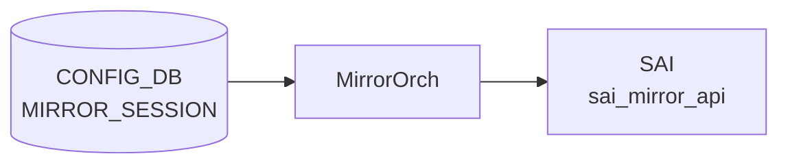

# APPL_DB FIXED_MIRROR_SESSION_TABLE (P4RT)

## 概要

`APPL_DB FIXED_MIRROR_SESSION_TABLE` は [P4RT](../../reference/glossary.md#term-p4rt) ランタイムが書き込む ERSPAN ミラーセッション定義テーブル。
`p4orch` 内の `MirrorSessionManager` が [APPL_DB](../../reference/glossary.md#term-appl_db) を購読し、[SAI](../../reference/glossary.md#term-sai) MIRROR_SESSION オブジェクトに変換する[^1]。

通常の [CONFIG_DB](../../reference/glossary.md#term-config_db) `MIRROR_SESSION` テーブルとは独立したパスであり、[P4RT](../../reference/glossary.md#term-p4rt) 経由のプログラムにのみ利用される。
セッションタイプは常に **ERSPAN (Enhanced Remote SPAN)** に固定され、GRE トンネルパラメータをすべて明示的に指定する必要がある。

<!-- cdb-mermaid -->
### データフロー (自動生成)



!!! note "凡例"
    CONFIG_DB から SAI までの典型経路を `docs/reference/config-db-orch-map.md` から機械生成したミニ図。詳細・例外は本ページ本文と対応表を参照。
<!-- /cdb-mermaid -->

## key 構造

```text
FIXED_MIRROR_SESSION_TABLE|{"match/mirror_session_id":"<id>"}
```

key は JSON 形式でエンコードされる。`<id>` は [P4RT](../../reference/glossary.md#term-p4rt) テーブルのマッチフィールド `mirror_session_id` の値。

## 主要フィールド

| フィールド | 型 | 必須 | 既定 | 説明 |
|-----------|----|------|------|------|
| `action` | string `mirror_as_ipv4_erspan` | yes | - | アクション識別子。固定値のみ受け付ける |
| `param/port` | string (物理ポート名) | yes | - | ミラーパケット送出先の物理ポート |
| `param/src_ip` | ip-address | yes | - | ERSPAN 外側 IP のソース |
| `param/dst_ip` | ip-address | yes | - | ERSPAN 外側 IP の宛先 |
| `param/src_mac` | mac-address | yes | - | ERSPAN 外側イーサネットの送信元 MAC |
| `param/dst_mac` | mac-address | yes | - | ERSPAN 外側イーサネットの宛先 MAC |
| `param/ttl` | hex uint8 | yes | - | ERSPAN 外側 IP の TTL (16 進数文字列) |
| `param/tos` | hex uint8 | yes | - | ERSPAN 外側 IP の TOS ([DSCP](../../reference/glossary.md#term-dscp)+ECN, 16 進数文字列) |

全フィールドが必須。1 つでも欠けると `processAddRequest()` が `SWSS_RC_INVALID_PARAM` を返しセッションは作成されない[^2]。

## 制約

- `param/port` は物理ポート (`Port::Type::PHY`) のみ有効。[VLAN](../../reference/glossary.md#term-vlan) / [PortChannel](../../reference/glossary.md#term-portchannel) は拒否される[^3]。
- `action` は `mirror_as_ipv4_erspan` のみ有効。他の値は `SWSS_RC_INVALID_PARAM`[^4]。
- [APPL_DB](../../reference/glossary.md#term-appl_db) のキー形式は JSON エンコード。パース失敗時は `SWSS_RC_INVALID_PARAM`[^4]。
- 更新時は個別フィールドを部分的に送信できる (`has_*` フラグで管理)。

<!-- defaults -->
## コード由来の暗黙デフォルト (Phase A)

<!-- evidence: sonic-swss/orchagent/p4orch/mirror_session_manager.h L20-21 / mirror_session_manager.cpp prepareSaiAttrs() L120-187 / p4orch_util.h P4MirrorSessionAppDbEntry struct L253-279 -->

| フィールド | APP_DB デフォルト | C++ 実装デフォルト | 種別 | 備考 |
|-----------|-----------------|-------------------|------|------|
| `param/ttl` | **なし (必須)** | `uint8_t ttl = 0` (struct 初期値) | 必須フィールド — デフォルト無効 | `has_ttl=false` のまま ADD 操作を行うと `SWSS_RC_INVALID_PARAM` |
| `param/tos` | **なし (必須)** | `uint8_t tos = 0` (struct 初期値) | 必須フィールド — デフォルト無効 | `has_tos=false` のまま ADD 操作を行うと `SWSS_RC_INVALID_PARAM` |
| `SAI_MIRROR_SESSION_ATTR_IPHDR_VERSION` | (APP_DB フィールドなし) | **`4`** (IPv4 固定) | ハードコード | `MIRROR_SESSION_DEFAULT_IP_HDR_VER = 4` (`mirror_session_manager.h:20`) — IPv6 ヘッダ非対応 |
| `SAI_MIRROR_SESSION_ATTR_GRE_PROTOCOL_TYPE` | (APP_DB フィールドなし) | **`0x88be`** | ハードコード | `GRE_PROTOCOL_ERSPAN = 0x88be` (`mirror_session_manager.h:21`) — 変更不可 |
| `SAI_MIRROR_SESSION_ATTR_TYPE` | (APP_DB フィールドなし) | **`SAI_MIRROR_SESSION_TYPE_ENHANCED_REMOTE`** | ハードコード | セッションタイプは ERSPAN 固定。SPAN は不可 |
| `SAI_MIRROR_SESSION_ATTR_ERSPAN_ENCAPSULATION_TYPE` | (APP_DB フィールドなし) | **`SAI_ERSPAN_ENCAPSULATION_TYPE_MIRROR_L3_GRE_TUNNEL`** | ハードコード | L3 GRE トンネルカプセル化固定 |

### 主要な discrepancy 詳細

**IP ヘッダバージョン固定 = 4 — IPv6 ERSPAN 非対応**:
`prepareSaiAttrs()` では `SAI_MIRROR_SESSION_ATTR_IPHDR_VERSION` に定数 `MIRROR_SESSION_DEFAULT_IP_HDR_VER = 4` を設定する。
`src_ip` / `dst_ip` に IPv6 アドレスを渡しても、[SAI](../../reference/glossary.md#term-sai) には IPv4 ヘッダバージョンが設定されるため動作しない。
P4RT ERSPAN は IPv4 outer ヘッダのみサポート。

**GRE type ハードコード = 0x88be — 設定変更不可**:
`prepareSaiAttrs()` は `SAI_MIRROR_SESSION_ATTR_GRE_PROTOCOL_TYPE` に定数 `GRE_PROTOCOL_ERSPAN = 0x88be` をハードコードする。
APP_DB に gre_type フィールドは存在せず変更できない。[CONFIG_DB](../../reference/glossary.md#term-config_db) `MIRROR_SESSION.gre_type` (Mellanox で `0x8949`) のような platform 分岐もない。

**TOS と TTL は hex 文字列 — 0 は有効な値だが省略不可**:
`deserializeP4MirrorSessionAppDbEntry()` は TOS / TTL を `std::stoul(value, 0, 16)` で 16 進数としてパースする。
`0x00` (= 0) は有効値として受け付けられるが、フィールド自体の省略は `has_ttl=false` / `has_tos=false` のまま ADD を発行することになり `SWSS_RC_INVALID_PARAM` が返る。

<!-- /defaults -->

<!-- constants -->
## ハードコード定数 (Phase E)

<!-- evidence: sonic-swss/orchagent/p4orch/mirror_session_manager.h L20-21 / mirror_session_manager.cpp prepareSaiAttrs() L142-188, deserialize L281-313 / sonic-swss-common/common/schema.h L70 / orchagent/mirrororch.cpp L29, L40-45, L57-77 -->

`FIXED_MIRROR_SESSION_TABLE` を処理する `MirrorSessionManager` は、[SAI](../../reference/glossary.md#term-sai) MIRROR_SESSION 属性のうち **session type / encap type / IP ヘッダバージョン / GRE protocol type / action 識別子 / TOS・TTL のパース基数** を C++ 定数としてハードコードしており、APP_DB / [CONFIG_DB](../../reference/glossary.md#term-config_db) / 環境変数いずれからも上書きできない。CONFIG_DB 経路 (`MirrorOrch`) と異なり、Mellanox 等の platform 分岐も持たない。

### 上書き不可な定数一覧 (P4RT 経路)

| 定数 / リテラル | 値 | 設定先 SAI 属性 (該当時) | 箇所 |
|----------------|----|------------------------|------|
| `MIRROR_SESSION_DEFAULT_IP_HDR_VER` | **`4`** | `SAI_MIRROR_SESSION_ATTR_IPHDR_VERSION` | `mirror_session_manager.h:20` / `.cpp:153-155` |
| `GRE_PROTOCOL_ERSPAN` | **`0x88be`** | `SAI_MIRROR_SESSION_ATTR_GRE_PROTOCOL_TYPE` | `mirror_session_manager.h:21` / `.cpp:183-185` |
| (enum リテラル) `SAI_MIRROR_SESSION_TYPE_ENHANCED_REMOTE` | enum 固定 | `SAI_MIRROR_SESSION_ATTR_TYPE` | `mirror_session_manager.cpp:144-146` |
| (enum リテラル) `SAI_ERSPAN_ENCAPSULATION_TYPE_MIRROR_L3_GRE_TUNNEL` | enum 固定 | `SAI_MIRROR_SESSION_ATTR_ERSPAN_ENCAPSULATION_TYPE` | `mirror_session_manager.cpp:148-150` |
| action 識別子 | **`"mirror_as_ipv4_erspan"`** (他値は `SWSS_RC_INVALID_PARAM`) | — | `mirror_session_manager.cpp:307-313` |
| テーブル名 (`APP_P4RT_MIRROR_SESSION_TABLE_NAME`) | **`"FIXED_MIRROR_SESSION_TABLE"`** | — | `sonic-swss-common/common/schema.h:70` |
| TTL / TOS パース基数 | **`16`** (`std::stoul(value, 0, 16)`) | `SAI_MIRROR_SESSION_ATTR_TTL` / `_TOS` | `mirror_session_manager.cpp:281-305` |

### GRE protocol type — CONFIG_DB との比較

| 経路 | Mellanox (`platform=mellanox*`) | その他のプラットフォーム | 上書き手段 |
|------|--------------------------------|----------------------|----------|
| CONFIG_DB `MIRROR_SESSION` (`MirrorOrch`) | **`0x8949`** (`mirrororch.cpp:65-68`) | **`0x88be`** (`mirrororch.cpp:69-72`) | CLI で `gre_type` 明示指定すれば任意値で上書き可 |
| [APPL_DB](../../reference/glossary.md#term-appl_db) `FIXED_MIRROR_SESSION_TABLE` (P4RT) | **`0x88be` (固定)** | **`0x88be` (固定)** | **上書き不可** (APP_DB に `gre_type` フィールドなし、platform 分岐コードなし) |

→ Mellanox Spectrum 上で P4RT 経由 ERSPAN を使うと SAI に `0x88be` が渡り、CONFIG_DB 経路で期待される `0x8949` と乖離する。詳細は本ページ「プラットフォーム差 (Phase H)」と `meta/_intermediate/cdb-flow/appl-mirror-platform.md` を参照。

### policer 識別子は APPL_DB に存在しない (CONFIG_DB との差異)

CONFIG_DB 経路は `MIRROR_SESSION_POLICER = "policer"` (`mirrororch.cpp:29`) フィールドで `PolicerOrch::getPolicerOid()` を解決し `SAI_MIRROR_SESSION_ATTR_POLICER` を設定する (`mirrororch.cpp:1052-1064`)。一方 P4RT 経路の `P4MirrorSessionAppDbEntry` (`p4orch_util.h:253-279`) は ttl / tos / src_ip / dst_ip / src_mac / dst_mac / port のみを保持し、policer フィールド名や `SAI_MIRROR_SESSION_ATTR_POLICER` 設定は**コード上に存在しない**。

→ P4RT 経由でのレートリミット (policer attach) は**サポート外**。[QoS](../../reference/glossary.md#term-qos) 制御が必要な場合は [ACL](../../reference/glossary.md#term-acl) meter (`acl_rule_manager.cpp::getMeterSaiAttrs`) 側で行う設計。

### UDP port 定数は不在

`FIXED_MIRROR_SESSION_TABLE` の出力は ERSPAN over GRE (`SAI_ERSPAN_ENCAPSULATION_TYPE_MIRROR_L3_GRE_TUNNEL` 固定) であり、UDP encap ([VXLAN](../../reference/glossary.md#term-vxlan)/SFLOW 等) は対象外。`mirror_session_manager.{h,cpp}` 内に UDP destination port のハードコード定数 (例: 4789 / 6343) は**存在しない**。

### DSCP 既定値は P4RT 側では効かない

| 経路 | [DSCP](../../reference/glossary.md#term-dscp) デフォルト | 入力フィールド | 備考 |
|------|---------------|--------------|------|
| CONFIG_DB `MIRROR_SESSION` (`MirrorOrch`) | **`8`** (CS1、`MirrorEntry::dscp(8)`, `mirrororch.cpp:59`) | `dscp` (省略可) | 範囲は `MIRROR_SESSION_DSCP_MIN..MAX = 0..63` (`mirrororch.cpp:40-42`)。`SAI_MIRROR_SESSION_ATTR_TOS = dscp << MIRROR_SESSION_DSCP_SHIFT` (`mirrororch.cpp:1016`) |
| APPL_DB `FIXED_MIRROR_SESSION_TABLE` (P4RT) | (struct 初期値 `tos=0` だが**必須**) | `param/tos` (16 進文字列、TOS バイト全体 = [DSCP](../../reference/glossary.md#term-dscp)+ECN) | `has_tos=false` のまま ADD すると `SWSS_RC_INVALID_PARAM`。デフォルトは実質適用されない |

→ P4RT 経路では DSCP の概念が表に出ず、TOS バイト全体を P4RT controller が組み立てて hex 文字列で渡す責務を負う。

### TTL 既定値も P4RT 側では効かない

| 経路 | TTL デフォルト | 入力フィールド |
|------|--------------|--------------|
| CONFIG_DB `MIRROR_SESSION` (`MirrorOrch`) | **`255`** (`MirrorEntry::ttl(255)`, `mirrororch.cpp:60`) | `ttl` (省略可) |
| APPL_DB `FIXED_MIRROR_SESSION_TABLE` (P4RT) | (struct 初期値 `ttl=0` だが**必須**) | `param/ttl` (16 進文字列) |

### 経路間で乖離するハードコード定数まとめ

| 項目 | CONFIG_DB (`MirrorOrch`) | APPL_DB FIXED (P4RT) | 同一 [ASIC](../../reference/glossary.md#term-asic) 併用時の影響 |
|------|------------------------|---------------------|---------------------|
| GRE protocol type | platform 分岐 (`0x8949` / `0x88be`)、CLI 上書き可 | `0x88be` ハードコード | Mellanox で乖離 |
| IP header version | `src_ip` / `dst_ip` のアドレスファミリで自動判定 | `4` ハードコード | IPv6 outer ヘッダ要求時に乖離 |
| Session type | SPAN / ERSPAN を CONFIG_DB `type` で選択 | ERSPAN ハードコード | SPAN 要求時は P4RT 経路では不可 |
| policer | `policer` フィールドあり | 該当フィールドなし | P4RT 経路では rate limit 不可 |
| DSCP / TTL デフォルト | `8` / `255` (省略時適用) | 必須、struct 初期値 `0` / `0` は実質未使用 | クライアントが明示指定必須 |
| platform env (`getenv("platform")`) 参照 | あり (`mirrororch.cpp:65`) | **なし** | P4RT 経路は platform 非依存だが、その結果 Mellanox 適合性を失う |

詳細スキャンノート: `meta/_intermediate/cdb-flow/appl-mirror-constants.md`

<!-- /constants -->

<!-- ordering -->
## 書込み順依存・タイミング依存 (Phase B)

`FIXED_MIRROR_SESSION_TABLE` は P4RT 経路で `MirrorSessionManager` (`orchagent/p4orch/mirror_session_manager.cpp`) が直接処理する。CONFIG_DB `MIRROR_SESSION` を扱う `MirrorOrch` と異なり、**route/neighbor/fdb の動的解決機構を持たず**、`dst_mac` を APPL_DB フィールドとして直接受け取る fail-fast 設計になっている[^6]。リトライ機構や pending キューがないため、書込み順は P4RT クライアント側で正しく保証する必要がある。

### 1. dst port readiness — PortsOrch::getPort() 先行必須（fail-fast、リトライなし）

```cpp
// mirror_session_manager.cpp:122-136 (prepareSaiAttrs)
swss::Port port;
if (!gPortsOrch->getPort(mirror_session_entry.port, port)) {
  LOG_ERROR_AND_RETURN(ReturnCode(StatusCode::SWSS_RC_NOT_FOUND)
                       << "Failed to get port info for port "
                       << QuotedVar(mirror_session_entry.port));
}
if (port.m_type != Port::Type::PHY) {
  LOG_ERROR_AND_RETURN(ReturnCode(StatusCode::SWSS_RC_INVALID_PARAM)
                       << "Port " << QuotedVar(mirror_session_entry.port)
                       << "'s type " << port.m_type
                       << " is not physical and is invalid as destination "
                          "port for mirror packet.");
}
```

CONFIG_DB 側 `MirrorOrch::doTask()` は `gPortsOrch->allPortsReady()` が false なら `doTask()` 全体を即 return して後で再 drain される (`mirrororch.cpp:1571-1574`) が、`MirrorSessionManager::drain()` には **`allPortsReady()` ガードがない** (`mirror_session_manager.cpp:62-119`)。`m_entries.pop_front()` で即時取り出し、`prepareSaiAttrs()` が `SWSS_RC_NOT_FOUND` を返すと `m_publisher->publish()` で結果通知してそのまま破棄する。

→ 順序依存: `param/port` で指定する物理ポートが PortsOrch に登録済みであること。port 未登録時の SET は `SWSS_RC_NOT_FOUND` で失敗確定し、自動再試行されない（P4RT クライアントが再送する必要がある）。

### 2. PHY 型固定 — LAG / VLAN は SET しても回復不能

`prepareSaiAttrs()` は `port.m_type != Port::Type::PHY` の場合 `SWSS_RC_INVALID_PARAM` を即返す。port の type は同一 alias で変動しないため、後から PHY に切り替わる遷移は存在しない。

→ 順序依存ではなく**設計時の制約**。[LAG](../../reference/glossary.md#term-lag)/[VLAN](../../reference/glossary.md#term-vlan) を `param/port` に指定したエントリは何度再送しても受理されない。

### 3. drain() の head-of-line blocking — エラー発生で同一 drain 内の以降エントリが滞留

```cpp
// mirror_session_manager.cpp:114-118
m_publisher->publish(APP_P4RT_TABLE_NAME, kfvKey(key_op_fvs_tuple),
                     kfvFieldsValues(key_op_fvs_tuple), status,
                     /*replace=*/true);
if (!status.ok()) {
  break;
}
```

`drain()` のメインループは最初の失敗時点で `break` し、残った `m_entries` は `drainWithNotExecuted()` で「未実行」として publisher に返すだけ。同一 P4RT トランザクション内で複数セッションを SET する場合、**先頭エントリの失敗で後続セッションは全て未処理**になる。CONFIG_DB `MirrorOrch::doTask()` (`mirrororch.cpp:1576-1607`) が各エントリを独立に処理するのとは異なる。

→ 順序依存（バッチ内）: P4RT クライアントは port readiness のばらつきがあるバッチを避け、エラーが出たロットは個別再送する。

### 4. ACL_RULE での mirror_session_id 参照 — FIXED_MIRROR_SESSION_TABLE 先行必須

```cpp
// acl_rule_manager.cpp:1403-1419
case SAI_ACL_ENTRY_ATTR_ACTION_MIRROR_INGRESS:
case SAI_ACL_ENTRY_ATTR_ACTION_MIRROR_EGRESS: {
    sai_object_id_t mirror_session_oid;
    std::string key = KeyGenerator::generateMirrorSessionKey(attr_value);
    if (!m_p4OidMapper->getOID(SAI_OBJECT_TYPE_MIRROR_SESSION, key, &mirror_session_oid))
    {
        return ReturnCode(StatusCode::SWSS_RC_NOT_FOUND)
               << "Mirror session " << QuotedVar(attr_value) << " does not exist for "
               << QuotedVar(acl_rule->acl_table_name);
    }
    ...
}
```

P4RT [ACL](../../reference/glossary.md#term-acl) の `AclRuleManager` は mirror アクション処理で `m_p4OidMapper->getOID(SAI_OBJECT_TYPE_MIRROR_SESSION, ...)` を呼び、未登録なら `SWSS_RC_NOT_FOUND` で即失敗する。CONFIG_DB 側 `AclRuleMirror::create()` は `SUBJECT_TYPE_MIRROR_SESSION_CHANGE` 通知（`mirrororch.cpp:1095-1096, 1110-1111`）で後から activate される pending 機構を持つが、**p4orch の `AclRuleManager` には同等の遅延 activate 機構がない**。

→ 順序依存: P4RT クライアントは「`FIXED_MIRROR_SESSION_TABLE` SET → publish 成功確認 → `ACL_*_TABLE` SET（mirror action 付き）」の順で発行すること。

### 5. processUpdateRequest の port 切替 — 新 port も readiness 必須・ref count 移管

`processUpdateRequest()` で `param/port` が変わる場合、`gPortsOrch->getPort(new_port_name, new_port)` を呼び (`mirror_session_manager.cpp:493`)、失敗時は `SWSS_RC_NOT_FOUND` で即返り、SAI 属性更新も ref count 移管も行われず**旧 port が保持される**。成功時のみ `decreasePortRefCount(old)` → `increasePortRefCount(new)` の順で実行 (`mirror_session_manager.cpp:517-518`)。

→ 順序依存: port 切替時は新 port が PortsOrch に登録済みであること。新 port 作成後に UPDATE を発行する。

### 6. policer 先行依存は不在（CONFIG_DB との差異、要注意）

`FIXED_MIRROR_SESSION_TABLE` には **`policer` フィールドが存在しない**。`P4MirrorSessionAppDbEntry` 構造体 (`p4orch_util.h:253-279`) は ttl/tos/src_ip/dst_ip/src_mac/dst_mac/port のみ保持し、`prepareSaiAttrs()` も `SAI_MIRROR_SESSION_ATTR_POLICER` を設定しない (`mirror_session_manager.cpp:122-188`)。

CONFIG_DB 側 `MirrorOrch::createEntry()` (`mirrororch.cpp:432-443`) は `MIRROR_SESSION_POLICER` フィールドに対して `m_policerOrch->policerExists()` をチェックし、未登録なら `task_need_retry` で **POLICER 先行を強制する**が、FIXED_MIRROR_SESSION_TABLE 経路ではこの依存は**ない**。

→ 含意: P4RT で [QoS](../../reference/glossary.md#term-qos) 制御が必要な場合は ACL_RULE の meter (`getMeterSaiAttrs`, `acl_rule_manager.cpp:124-`) 側で行う設計。MIRROR_SESSION への policer attach は P4RT 経路では対象外。

### 7. routeOrch / neighbor / fdb 動的解決は不在（ERSPAN 固定、dst_mac 直接指定）

CONFIG_DB ERSPAN セッションは `m_routeOrch->attach(this, entry.dstIp)` (`mirrororch.cpp:517`) で next hop 解決を待ち、`SUBJECT_TYPE_NEXTHOP_CHANGE` / `NEIGH_CHANGE` / `FDB_CHANGE` / `LAG_MEMBER_CHANGE` 通知で `updateSession()` を回す動的解決機構を持つ (`mirrororch.cpp:160-198, 760-808`)。

P4RT 経路は `param/dst_mac` を **APPL_DB の必須フィールドとして直接受け取る** ため、neighbor / fdb / route の動的解決は行われない。`MirrorSessionManager` は `Observer` ではなく、PortsOrch/NeighOrch/FdbOrch/RouteOrch に attach もしない。

→ 含意: P4RT クライアントは事前に dst MAC を解決して `param/dst_mac` で渡す責務を負う。トポロジ変化で MAC が変わった場合は `FIXED_MIRROR_SESSION_TABLE` の UPDATE を発行し直す必要がある（自動追従しない）。

### 順序依存サマリ

| # | 依存関係 | 方向 | 緩和策 |
|---|----------|------|--------|
| 1 | PORT 初期化 → `FIXED_MIRROR_SESSION_TABLE` SET (`param/port`) | 強制先行（fail-fast、リトライなし） | P4RT クライアント側で再送 |
| 2 | port は PHY 型 | 設計時制約（[LAG](../../reference/glossary.md#term-lag)/[VLAN](../../reference/glossary.md#term-vlan) 不可） | 設計時に PHY を選定 |
| 3 | drain() head-of-line blocking | バッチ内順序注意 | エラー発生ロットは個別再送 |
| 4 | `FIXED_MIRROR_SESSION_TABLE` SET 完了 → ACL_RULE (mirror action) | 強制先行（pending 機構なし） | クライアントが SET 順序を保証 |
| 5 | 新 port PortsOrch 登録済み → UPDATE 発行 | 強制先行 | 新 port 作成後に UPDATE |
| 6 | policer 先行依存は**不在** | (CONFIG_DB との差異) | [QoS](../../reference/glossary.md#term-qos) 制御は [ACL](../../reference/glossary.md#term-acl) meter で |
| 7 | route/neighbor/fdb 動的解決は**不在** | (CONFIG_DB との差異) | クライアント側で `dst_mac` 再解決 |

詳細スキャンノート: `meta/_intermediate/cdb-flow/appl-mirror-ordering.md`

<!-- /ordering -->

<!-- platform -->
## プラットフォーム差 (Phase H)

`FIXED_MIRROR_SESSION_TABLE` を処理する `MirrorSessionManager` は **`getenv("platform")` を一切参照せず**、GRE type / IP header version / encapsulation type / session type をすべて C++ 定数としてハードコードする (`mirror_session_manager.h:20-21`、`mirror_session_manager.cpp::prepareSaiAttrs()`)。
一方 CONFIG_DB 側 `MirrorOrch` は `mirrororch.cpp:65-72` で `platform == MLNX_PLATFORM_SUBSTRING` のときに GRE type を `0x8949` に切り替える等、複数のプラットフォーム / スイッチタイプ分岐を持つ。
このため同一 [ASIC](../../reference/glossary.md#term-asic) 上で CONFIG_DB 経路と P4RT 経路を併用すると、Mellanox 等で **経路によって SAI 属性値が異なる discrepancy** が発生する。

### P4RT 経路 vs CONFIG_DB 経路の capability 差異一覧

| capability | CONFIG_DB MIRROR_SESSION (MirrorOrch) | APPL_DB FIXED_MIRROR_SESSION_TABLE (P4RT) | evidence |
|---|---|---|---|
| **GRE protocol type** | mellanox は `0x8949`、それ以外は `0x88be` (`platform` env で分岐、`gre_type` フィールドで上書き可) | **`0x88be` ハードコード** (上書き不可) | `mirrororch.cpp:57-77` / `mirror_session_manager.h:21` |
| **IP header version** | IPv4 / IPv6 を `src_ip` / `dst_ip` のアドレスファミリで自動判定 | **`4` ハードコード** (IPv6 ERSPAN 不可) | `mirrororch.cpp:1005-1049` / `mirror_session_manager.h:20` |
| **VoQ スイッチ向け monitor_port 差し替え** | `gMySwitchType == "voq"` かつ ERSPAN のとき **recirc port** に強制差し替え | 差し替えなし (`param/port` をそのまま使用) | `mirrororch.cpp:592-598, 961-973, 1193-1205` |
| **VoQ スイッチ向け DST_MAC 差し替え** | `voq` かつ ERSPAN のとき **`gMacAddress`** に差し替え | 差し替えなし (`param/dst_mac` をそのまま使用) | `mirrororch.cpp:609-615, 1037-1044, 1153-1159` |
| **ingress/egress mirror [ASIC](../../reference/glossary.md#term-asic) capability** | bind 前に `SwitchOrch::isPortIngressMirrorSupported()` / `isPortEgressMirrorSupported()` で fail-fast | チェックなし (P4RT はポート bind を行わない) | `mirrororch.cpp:816-826` |
| **SAI mirror_session リソース枯渇チェック** | ADD 前に `sai_object_type_get_availability(SAI_OBJECT_TYPE_MIRROR_SESSION)` を呼ぶ | チェックなし (SAI create 失敗で初めて検出) | `mirrororch.cpp:357-379` |
| **SAI_MIRROR_SESSION_ATTR_TC サポート差** | `queue=0` のとき TC 属性を付加しない (TC 非対応 ASIC への配慮) | TC 属性そのものを APP_DB スキーマに持たず、常に SAI デフォルト | `mirrororch.cpp:931-938` |
| **[Policer](../../reference/glossary.md#term-policer) 連携** | `policer` フィールドで `PolicerOrch::getPolicerOid()` を解決し `SAI_MIRROR_SESSION_ATTR_POLICER` に設定 | **policer フィールド非対応** (連携不可) | `mirrororch.cpp:1052-1064` / `p4orch_util.h::P4MirrorSessionAppDbEntry` |

### プラットフォーム別 GRE type の取り扱い

| プラットフォーム | CONFIG_DB MIRROR_SESSION デフォルト | APPL_DB FIXED_MIRROR_SESSION_TABLE | 同一 ASIC で経路併用時の挙動 |
|----------------|------------------------------------|-----------------------------------|---------------------------|
| mellanox (Spectrum) | `gre_type = 0x8949` | `0x88be` 固定 | **discrepancy あり**: SAI に渡る値が経路で異なる |
| broadcom (XGS / DNX) | `gre_type = 0x88be` | `0x88be` 固定 | 一致 |
| barefoot / cisco-8000 / marvell-* / nephos / clounix / xsight | `gre_type = 0x88be` | `0x88be` 固定 | 一致 |
| (CLI で `gre_type` 明示上書き) | 任意値 | 上書き不可 | 上書き値次第で discrepancy |

### スイッチタイプ別の monitor_port / dst_mac 差し替え

| `DEVICE_METADATA.localhost.switch_type` | CONFIG_DB ERSPAN monitor_port | CONFIG_DB ERSPAN DST_MAC | P4RT FIXED_MIRROR_SESSION |
|---|---|---|---|
| `voq` (分散シャーシ — Cisco 8000 等) | **recirc port** に強制差し替え | **`gMacAddress`** (router MAC) | 差し替えなし。`switch_type=voq` で実用可否は未定義 |
| `switch` (一般スタンドアロン) | `neighborInfo.portId` ([ARP](../../reference/glossary.md#term-arp)/[NDP](../../reference/glossary.md#term-ndp) 解決) | `neighborInfo.mac` | `param/port` / `param/dst_mac` をそのまま使用 |

### Multi-ASIC (namespace) サポート

`MirrorSessionManager` 自体に multi-asic 固有の分岐コードはない。multi-asic シャーシ (Broadcom DNX / Cisco 8000) では asic namespace ごとに [orchagent](../../reference/glossary.md#term-orchagent) と APPL_DB インスタンスが起動するため、P4RT controller 側で asic を選択して APPL_DB に書き込む必要がある。
namespace 間の整合性 (例: 同一 `mirror_session_id` を複数 asic に作成するか) は [orchagent](../../reference/glossary.md#term-orchagent) / SAI レベルでは強制されず、上位 P4RT controller の責務となる[^5]。

### 既知の discrepancy (重要)

- **Mellanox での GRE type 不整合**: P4RT 経由で ERSPAN セッションを作ると `0x88be` が SAI に渡るが、Mellanox Spectrum は通常 `0x8949` を期待する。CONFIG_DB 経路 (`MirrorOrch`) は `platform` env で正しく `0x8949` を選択するため、**Mellanox 上で P4RT ERSPAN を使うとハードウェアが期待しない GRE type で encap される可能性がある**。
- **IPv6 outer ヘッダ非対応**: P4RT 側は IP header version を `4` にハードコードするため、`src_ip` / `dst_ip` に IPv6 を渡しても IPv4 ヘッダバージョンが設定される。CONFIG_DB 側はアドレスファミリで自動判定する。
- **policer 連携の機能差**: CONFIG_DB 経路では `MIRROR_SESSION.policer` で rate limiter を付けられるが、P4RT 経路は policer フィールドそのものが存在せず、ASIC が policer 連携をサポートしていても **P4RT 経由では利用不可**。
- **VoQ シャーシでの monitor_port 不整合**: `switch_type=voq` 環境では CONFIG_DB 経路は ERSPAN の monitor_port を recirc port に差し替えるが、P4RT 経路は差し替えない。**P4RT FIXED_MIRROR_SESSION_TABLE は VoQ シャーシ向けに設計されていない**。

詳細は `meta/_intermediate/cdb-flow/appl-mirror-platform.md` を参照。

<!-- /platform -->

<!-- pubsub -->
## 通信メカニズム (Phase G) — ZMQ 経由の購読

<!-- evidence: sonic-swss/orchagent/p4orch/p4orch.h L46 / p4orch.cpp L36-43, L80, L126-200 / orchagent/orchdaemon.cpp L848-849 / p4orch/mirror_session_manager.cpp L82, L111 -->

`FIXED_MIRROR_SESSION_TABLE` は **通常の redis [ConsumerStateTable](../../reference/glossary.md#term-consumerstatetable) / keyspace 通知パスではなく、専用 ZMQ チャネル経由で配送される**。
これは CONFIG_DB `MIRROR_SESSION` を購読する `MirrorOrch`（`orchagent/mirrororch.cpp` — 通常の `Orch` + `ConsumerStateTable`）とは根本的に異なる通信モデルである[^pubsub-1]。

### 転送経路

| 層 | クラス / 実体 | 役割 |
|----|--------------|------|
| 受信エンドポイント | `swss::ZmqServer` (`m_p4OrchZmqServer`, エンドポイント `m_p4OrchZmqServerEp`) | P4RT クライアントからの ZMQ フレームを受信 |
| Orch 基底 | `P4Orch : public ZmqOrch` | 全 P4RT テーブルを 1 インスタンスで保有。`ZmqOrch(db, tableNames, zmqServer, orderedQueue=true, dbPersistence=false)` で初期化[^pubsub-2] |
| ディスパッチ | `P4Orch::doTask(ConsumerBase &consumer)` | バッチ受信時に `table_name == APP_P4RT_TABLE_NAME` を検証し、`m_p4TableToManagerMap` でテーブル別マネージャに振り分け[^pubsub-3] |
| ハンドラ | `p4orch::MirrorSessionManager` | `APP_P4RT_MIRROR_SESSION_TABLE_NAME` (= `"FIXED_MIRROR_SESSION_TABLE"`) で登録[^pubsub-4] |
| 応答パス | `ResponsePublisher m_publisher("APPL_DB", buffered=true, db_write_thread=true, zmqServer)` | 処理結果ステータスを同じ `ZmqServer` 経由で P4RT に返す[^pubsub-5] |

### redis keyspace ベースとの差異

- `Consumer` / `ConsumerStateTable` の redis SUBSCRIBE / keyspace 通知は **使わない**。トリガは redis イベントではなく ZMQ フレーム受信である。
- そのため `redis-cli psubscribe '__keyspace@*__:FIXED_MIRROR_SESSION_TABLE*'` 等での観測はできない。
- P4RT クライアントは ZMQ ソケットに対して書き込み、[orchagent](../../reference/glossary.md#term-orchagent) 側 `ZmqServer` がキューに積み、`P4Orch::doTask` が同期的にドレインする。
- APPL_DB への書き込みは `ResponsePublisher` 経由で行われるが、これは下流リーダのための副作用であり、購読のトリガではない。

### コンストラクタの構造的証拠

```cpp
// orchagent/p4orch/p4orch.cpp:36-43
P4Orch::P4Orch(swss::DBConnector* db, std::vector<std::string> tableNames,
               ZmqServer* zmqServer, VRFOrch* vrfOrch, CoppOrch* coppOrch)
    : ZmqOrch(db, tableNames, zmqServer, /*orderedQueue=*/true,
              /*dbPersistence=*/false),
      m_zmqServer(zmqServer),
      m_publisher("APPL_DB", /*bool buffered=*/true,
                  /*db_write_thread=*/true, zmqServer)
```

`MirrorOrch`（CONFIG_DB 側）のコンストラクタは `Orch(confDbConnector.first, confDbConnector.second)` を呼ぶだけで `ZmqServer` を一切受け取らない。両経路は構造的に完全に独立している[^pubsub-1]。

[^pubsub-1]: CONFIG_DB 側 `MirrorOrch` の通常 Orch 経路: `orchagent/mirrororch.cpp` L79-110. <https://github.com/sonic-net/sonic-swss/blob/master/orchagent/mirrororch.cpp#L79-L110>
[^pubsub-2]: `P4Orch : public ZmqOrch`: `orchagent/p4orch/p4orch.h` L46. <https://github.com/sonic-net/sonic-swss/blob/master/orchagent/p4orch/p4orch.h#L46>. コンストラクタ: `orchagent/p4orch/p4orch.cpp` L36-43.
[^pubsub-3]: `P4Orch::doTask(ConsumerBase&)` 振り分け: `orchagent/p4orch/p4orch.cpp` L126-200. <https://github.com/sonic-net/sonic-swss/blob/master/orchagent/p4orch/p4orch.cpp#L126-L200>
[^pubsub-4]: ZmqServer 生成と `MirrorSessionManager` 登録: `orchagent/orchdaemon.cpp` L848-849, `orchagent/p4orch/p4orch.cpp` L80.
[^pubsub-5]: 応答 publish: `orchagent/p4orch/mirror_session_manager.cpp` L82, L111.

<!-- /pubsub -->

<!-- side-effects -->
## 副次 DB 書込 (Phase F)

`APPL_DB FIXED_MIRROR_SESSION_TABLE` の SET / DEL に伴う副次 DB 書込は **APPL_STATE_DB への応答 publish 1 経路のみ**。CONFIG_DB 経路 `MirrorOrch` のような `STATE_DB MIRROR_SESSION_TABLE` への status 書込は **発火しない**[^side-1]。

### APPL_STATE_DB — ResponsePublisher 経由のレスポンス

`MirrorSessionManager` 自身は [STATE_DB](../../reference/glossary.md#term-state_db) / [COUNTERS_DB](../../reference/glossary.md#term-counters_db) / [FLEX_COUNTER_DB](../../reference/glossary.md#term-flex_counter_db) に直接書込まない。唯一の副次書込は親 `P4Orch` が保持する `ResponsePublisher m_publisher` 経由の APPL_STATE_DB 応答テーブルへの publish である。

```cpp
// orchagent/p4orch/p4orch.cpp:38-43 (P4Orch constructor)
m_publisher("APPL_DB", /*bool buffered=*/true,
            /*db_write_thread=*/true, zmqServer)
```

```cpp
// orchagent/p4orch/mirror_session_manager.cpp:82, 111
m_publisher->publish(APP_P4RT_TABLE_NAME, kfvKey(key_op_fvs_tuple),
                     kfvFieldsValues(key_op_fvs_tuple), status,
                     /*replace=*/true);
```

| 発火点 | ハンドラ | publish 内容 |
|---|---|---|
| `drain()` 各エントリ処理完了 (`mirror_session_manager.cpp:82`) | processAddRequest / processUpdateRequest / processDeleteRequest 経由 | 元 APPL_DB key + 元 fields + `ReturnCode` (`SWSS_RC_SUCCESS` / `SWSS_RC_INVALID_PARAM` / `SWSS_RC_NOT_FOUND` 等) |
| `drainWithNotExecuted()` 未実行エントリの返却 (`mirror_session_manager.cpp:111`) | drain() head-of-line blocking 後の残エントリ | 同上 + 未実行ステータス |

- 宛先: **APPL_STATE_DB** のレスポンステーブル (`ResponsePublisher` 第 1 引数 `"APPL_DB"` は DBConnector 解決用で、実際の書込は APPL_STATE_DB スキーマに基づく)
- 経路: ZMQ + buffered + 書込専用スレッド (`db_write_thread=true`) で非同期送出
- 用途: P4RT クライアントがセッション作成成否を待つための同期点

### STATE_DB / COUNTERS_DB / FLEX_COUNTER_DB は **対象外**

`mirror_session_manager.h` および `mirror_session_manager.cpp` には `STATE_DB` / `COUNTERS_DB` / `FLEX_COUNTER_DB` を扱う `DBConnector` / `Table` / `FlexCounterManager` メンバが**一切存在しない**。CONFIG_DB 経路 `MirrorOrch` が書く `STATE_DB MIRROR_SESSION_TABLE.status` (`"active"` / `"inactive"`) は P4RT 経路では発火しない。

mirror session 単位の SAI カウンタは P4RT / CONFIG_DB の**どちらの経路でも** [COUNTERS_DB](../../reference/glossary.md#term-counters_db) / [FLEX_COUNTER_DB](../../reference/glossary.md#term-flex_counter_db) に登録されない (mirror 連携カウンタは `ACL_*_TABLE` 側の ACL_COUNTER 経路で扱う)。

### 副次効果としての非 DB 内部状態更新 (参考)

DB 書込ではないが、`MirrorSessionManager` ハンドラは以下のプロセス内データ構造を更新する:

- `m_p4OidMapper->setOID(SAI_OBJECT_TYPE_MIRROR_SESSION, key, oid)` / `eraseOID(...)` — P4Orch 内の P4-key→SAI OID マッパ。`AclRuleManager` の mirror action 解決時に参照される (cf. ordering Phase B §4)
- `gPortsOrch->increasePortRefCount(port)` / `decreasePortRefCount(port)` — UPDATE で port 切替時は old を decrease → new を increase の順 (`mirror_session_manager.cpp:517-518`)

### 経路別の副次 DB 書込サマリ

| 副次 DB | CONFIG_DB `MIRROR_SESSION` (`MirrorOrch`) | APPL_DB `FIXED_MIRROR_SESSION_TABLE` (P4RT) |
|---|---|---|
| [STATE_DB](../../reference/glossary.md#term-state_db) `MIRROR_SESSION_TABLE` | `status` を `"active"` / `"inactive"` で更新 | **書込みなし** |
| APPL_STATE_DB レスポンス | 書込みなし | **`ResponsePublisher` で `ReturnCode` を publish** |
| [COUNTERS_DB](../../reference/glossary.md#term-counters_db) | 書込みなし (session 単位カウンタなし) | 書込みなし |
| [FLEX_COUNTER_DB](../../reference/glossary.md#term-flex_counter_db) | 書込みなし | 書込みなし |

### 副次効果の確認コマンド

```bash
# APPL_STATE_DB のレスポンステーブル (P4RT 応答)
sonic-db-cli APPL_STATE_DB keys 'FIXED_MIRROR_SESSION_TABLE*'

# STATE_DB MIRROR_SESSION_TABLE は P4RT 経路では更新されない (CONFIG_DB 経路のみ)
sonic-db-cli STATE_DB keys 'MIRROR_SESSION_TABLE*'
```

> **証跡**: `P4Orch::m_publisher` 宣言 `orchagent/p4orch/p4orch.cpp:36-43`、`m_publisher->publish(...)` 呼出 `orchagent/p4orch/mirror_session_manager.cpp:82, 111`、[STATE_DB](../../reference/glossary.md#term-state_db) / COUNTERS_DB Table メンバ不在 `orchagent/p4orch/mirror_session_manager.h` 全体、CONFIG_DB 経路 `STATE_DB MIRROR_SESSION_TABLE.status` 書込は `orchagent/mirrororch.cpp` 側の `MirrorOrch::setSessionState()` 経路。詳細分析: `meta/_intermediate/cdb-flow/appl-mirror-side.md`

[^side-1]: `MirrorSessionManager` クラス定義 (`orchagent/p4orch/mirror_session_manager.h`) には STATE_DB / COUNTERS_DB / FLEX_COUNTER_DB を扱う `Table` / `DBConnector` メンバが存在せず、`mirror_session_manager.cpp` も該当 API 呼出を行わない。唯一の副次 DB 書込は親 `P4Orch::m_publisher` (`ResponsePublisher`) 経由の APPL_STATE_DB 応答。<https://github.com/sonic-net/sonic-swss/blob/4305596156d70e9797e8a881b3d19b46de0bce0d/orchagent/p4orch/mirror_session_manager.cpp#L82>

<!-- /side-effects -->

<!-- failure -->
## 失敗挙動 (Phase D)

<!-- evidence: sonic-swss/orchagent/p4orch/mirror_session_manager.cpp drain() L62-119 / deserializeP4MirrorSessionAppDbEntry() L190-323 / processAddRequest() L339-363 / createMirrorSession() L365-397 / processUpdateRequest() L399-480 / setPort() L482-524 / processDeleteRequest() L733-774 / prepareSaiAttrs() L122-188 -->

APPL_DB `FIXED_MIRROR_SESSION_TABLE` の書込主体である `MirrorSessionManager::drain()` / `processAddRequest()` / `processUpdateRequest()` / `processDeleteRequest()` / `deserializeP4MirrorSessionAppDbEntry()` / `prepareSaiAttrs()` (`sonic-swss/orchagent/p4orch/mirror_session_manager.cpp`) を全行精読し、失敗・retry・CRITICAL 経路を抽出した。中間ノート: `meta/_intermediate/cdb-flow/appl-mirror-failure.md`。

CONFIG_DB 側 `MirrorOrch` (`orchagent/mirrororch.cpp`) と比較すると、P4RT 経路は **Orch 共通の `m_toSync` 自動再試行機構を一切使わない fail-fast 設計**であり、port readiness / policer 未準備 / SAI 一時失敗のいずれも自動回復しない。再送責務は P4RT controller 側に集約される[^fail-1]。

### 失敗パス一覧

| # | トリガー | 検出箇所 | 結果 | retry / 救済 |
|---|---------|---------|------|------|
| 1 | APPL_DB key の JSON parse 例外 | `deserializeP4MirrorSessionAppDbEntry()` `mirror_session_manager.cpp:199-205` | `SWSS_RC_INVALID_PARAM`。`drain()` で publish 後 `break` | なし |
| 2 | `action != "mirror_as_ipv4_erspan"` | 同 L307-313 | `SWSS_RC_INVALID_PARAM` | なし |
| 3 | 未知フィールド (`controller_metadata` 以外) | 同 L315-319 | `SWSS_RC_INVALID_PARAM` | なし |
| 4 | `param/src_ip` / `dst_ip` パース失敗 (`swss::IpAddress` 例外) | 同 L229-253 | `SWSS_RC_INVALID_PARAM` | なし |
| 5 | `param/src_mac` / `dst_mac` パース失敗 | 同 L255-279 | `SWSS_RC_INVALID_PARAM` | なし |
| 6 | `param/ttl` / `tos` パース失敗 (`std::stoul(value, 0, 16)` 例外) | 同 L281-305 | `SWSS_RC_INVALID_PARAM` | なし |
| 7 | **`param/port` が PortsOrch 未登録**（port readiness 不足） | `deserializeP4MirrorSessionAppDbEntry()` L213-218、`prepareSaiAttrs()` L122-129 | `SWSS_RC_NOT_FOUND`。drain `break`。CONFIG_DB 側 `allPortsReady()` ガード相当が**存在しない**ため即失敗確定 | **なし** (P4RT クライアントが再送)。`m_toSync` 滞留は P4RT 経路では起きない |
| 8 | `param/port` が非 PHY ([LAG](../../reference/glossary.md#term-lag) / VLAN) | 同 L219-225、L130-136 | `SWSS_RC_INVALID_PARAM` | なし (設計時制約。alias で port 種別固定) |
| 9 | ADD 時の必須フィールド不足 (`has_*` のいずれか false) | `processAddRequest()` L344-360 | `SWSS_RC_INVALID_PARAM`。`createMirrorSession()` 未呼出 | なし |
| 10 | ADD 時に OID マッパに同 key 既存 (内部不整合) | `createMirrorSession()` L370-375 | `RETURN_INTERNAL_ERROR_AND_RAISE_CRITICAL`。**CRITICAL state 通知** | なし (criticald 経由で orchagent restart) |
| 11 | **SAI `create_mirror_session()` 失敗** | `createMirrorSession()` L381-384 | `CHECK_ERROR_AND_LOG_AND_RETURN` で `SWSS_LOG_ERROR` + ReturnCode 変換 return。ref count / OID マッパ / 内部テーブルは未更新 | **なし** (Orch 共通 `handleSaiCreateStatus` の `task_need_retry` 経路は使われない) |
| 12 | UPDATE 時 `existing_mirror_session_entry == nullptr` または OID マッパに無い | `processUpdateRequest()` L406-415 | `RETURN_INTERNAL_ERROR_AND_RAISE_CRITICAL` | なし |
| 13 | UPDATE 中間で SAI set 失敗 (port/src_ip/dst_ip/src_mac/dst_mac/ttl/tos のいずれか) | `processUpdateRequest()` L422-465 + 各 `set*()` の `CHECK_ERROR_AND_LOG_AND_RETURN` | `update_fail_in_middle = true` で残り SET スキップ。**`setMirrorSessionEntry(before_update, ...)` で前状態に rollback** (L467-477) | rollback あり |
| 14 | UPDATE rollback 自体が失敗 | `processUpdateRequest()` L469-476 | `SWSS_RAISE_CRITICAL_STATE("Failed to recover ...")`。**SAI と内部キャッシュが乖離した不整合状態で継続** | なし (運用介入が必要) |
| 15 | UPDATE で新 port が PortsOrch 未登録 | `setPort()` L492-497 | `SWSS_RC_NOT_FOUND`。SAI 属性更新も ref count 移管も行わず**旧 port を保持** | なし (新 port 作成後に UPDATE 再送) |
| 16 | UPDATE で新 port が非 PHY | `setPort()` L498-504 | `SWSS_RC_INVALID_PARAM` | なし |
| 17 | UPDATE 系 SAI `set_mirror_session_attribute()` 失敗 | 各 `set*()` の `CHECK_ERROR_AND_LOG_AND_RETURN` (L511, L541, L567, L593, L619, L644, L669) | ReturnCode 変換 return → #13 の rollback 経路に合流 | rollback あり |
| 18 | DEL で内部テーブルに該当 key なし | `processDeleteRequest()` L737-743 | `SWSS_RC_NOT_FOUND`。**冪等成功扱いではなく失敗** (CONFIG_DB `MirrorOrch::deleteEntry()` の `SWSS_LOG_NOTICE` 成功扱いと対照的) | なし |
| 19 | DEL で `m_p4OidMapper->getRefCount()` 失敗 | 同 L746-751 | `RETURN_INTERNAL_ERROR_AND_RAISE_CRITICAL` | なし |
| 20 | **DEL で ref_count > 0**（ACL_RULE 等から参照中） | 同 L752-757 | `SWSS_RC_IN_USE`。SAI 削除も内部テーブル削除も行わない | なし (参照側 ACL_RULE 先削除が必要) |
| 21 | DEL で SAI `remove_mirror_session()` 失敗 | 同 L760-762 | `CHECK_ERROR_AND_LOG_AND_RETURN` で ReturnCode return。ref count / OID マッパ / 内部テーブル**未削除のまま** | なし |
| 22 | drain 中の不明 op (SET/DEL 以外) | `drain()` L106-109 | `SWSS_RC_INVALID_PARAM` | なし |
| 23 | drain ロット内のエントリエラー (上記いずれか) | `drain()` L111-116 | publish 後 **`break`** で当該 drain ループを抜ける。残り `m_entries` は `drainWithNotExecuted()` で「未実行」として publisher に返却 | なし (head-of-line blocking) |

### CONFIG_DB MirrorOrch との救済機構の差異

| 救済機構 | CONFIG_DB MirrorOrch | P4RT MirrorSessionManager |
|---|---|---|
| `allPortsReady()` 前置 | あり (`mirrororch.cpp:1567-1574`、PORT 初期化完了まで `doTask()` 全体スキップ) | **なし** (即 `SWSS_RC_NOT_FOUND`) |
| `task_need_retry` による `m_toSync` 残置 | あり (一時 SAI エラー等は次周回再試行) | **なし** (drain で `break`、未実行は publisher 通知のみ) |
| NEXTHOP/NEIGH/[FDB](../../reference/glossary.md#term-fdb) 解決待ち retry | あり (`mirrororch.cpp:160-198, 760-808`、`SUBJECT_TYPE_*_CHANGE` observer で `updateSession()`) | **なし** (`dst_mac` 直接受領の fail-fast) |
| [Policer](../../reference/glossary.md#term-policer) 未準備時の `task_need_retry` | あり (`mirrororch.cpp:432-443`、POLICER 先行強制) | **なし** (policer フィールド自体が APPL_DB に無い) |
| SAI mirror_session リソース availability チェック | あり (`mirrororch.cpp:357-379`、ADD 前に `sai_object_type_get_availability`) | **なし** (SAI create 失敗で初めて検出) |
| ingress/egress mirror ASIC capability チェック | あり (`mirrororch.cpp:816-826`、`SwitchOrch::isPortIngressMirrorSupported()` で fail-fast) | **なし** (P4RT は session 単体作成のみ、bind は ACL_RULE 側) |

つまり port readiness / policer 準備 / SAI 可用性 / neighbor 解決といった**動的な前提条件未充足を P4RT 経路は recover できず**、すべて P4RT controller 側の再送責務になる。

### SAI 失敗の共通ハンドリング (`CHECK_ERROR_AND_LOG_AND_RETURN`)

`mirror_session_manager.cpp` の SAI 呼出は全て `CHECK_ERROR_AND_LOG_AND_RETURN` マクロ経由で status を ReturnCode に変換し、`SWSS_LOG_ERROR` を出して呼出元へ return する。Orch 基底の `handleSaiCreateStatus` / `handleSaiSetStatus` / `handleSaiRemoveStatus`（`task_need_retry` を返すパス）は**使われていない**。SAI が一時的に `SAI_STATUS_NOT_EXECUTED` 等を返しても自動再試行されず、`m_publisher->publish()` でエラー status を P4RT に返して終わる。

### drain head-of-line blocking

```cpp
// mirror_session_manager.cpp:62-119  (要約)
while (!m_entries.empty()) {
    auto key_op_fvs_tuple = m_entries.front();
    m_entries.pop_front();
    ...
    m_publisher->publish(APP_P4RT_TABLE_NAME, ..., status, /*replace=*/true);
    if (!status.ok()) { break; }   // 最初の失敗で抜ける
}
drainWithNotExecuted();             // 残りは「未実行」publish のみ
```

同一 drain ロット内で N 個の `FIXED_MIRROR_SESSION_TABLE` SET をバッチ投入し、k 番目で失敗すると (k+1)〜N 番目は**実行されず**、未実行 publish が返るだけ。CONFIG_DB 側 `MirrorOrch::doTask()` (`mirrororch.cpp:1576-1607`) が各エントリを独立に `it++` で進めるのと異なり、**P4RT は順序保証 (`orderedQueue=true`) と引換えに head-of-line blocking を選択**している。

### CRITICAL state を引き起こすパス

| パス | 箇所 | 影響 |
|---|---|---|
| ADD 時に既に OID マッパに同 key | `createMirrorSession()` L370-375 | `RETURN_INTERNAL_ERROR_AND_RAISE_CRITICAL` |
| UPDATE で `existing_mirror_session_entry == nullptr` / OID マッパ不在 | `processUpdateRequest()` L406-415 | 同上 |
| UPDATE 中間失敗からの rollback 失敗 | 同 L469-476 | `SWSS_RAISE_CRITICAL_STATE`。SAI と内部キャッシュ乖離 |
| DEL で `getRefCount()` 失敗 | `processDeleteRequest()` L746-751 | `RETURN_INTERNAL_ERROR_AND_RAISE_CRITICAL` |

いずれも内部不整合の検出。発生時は criticald が orchagent restart を発火させる前提。

### 観測手段

```bash
# 失敗ログ抽出
docker logs swss 2>&1 | grep -iE 'MirrorSessionManager|FIXED_MIRROR_SESSION|Failed to (create|remove|set) (mirror|new) '

# CRITICAL state
docker logs swss 2>&1 | grep -iE 'CRITICAL|RaiseCritical|Failed to recover mirror session'

# ASIC_DB 側の整合性
redis-cli -n 1 KEYS 'ASIC_STATE:SAI_OBJECT_TYPE_MIRROR_SESSION*'
```

`MirrorSessionManager` は STATE_DB に独自エラーテーブルを書かない。失敗の参照点は syslog と P4RT 応答 status のみ。

[^fail-1]: `MirrorSessionManager::drain()` / `processAddRequest` / `processUpdateRequest` / `processDeleteRequest` の fail-fast 設計: `orchagent/p4orch/mirror_session_manager.cpp` L62-774. <https://github.com/sonic-net/sonic-swss/blob/4305596156d70e9797e8a881b3d19b46de0bce0d/orchagent/p4orch/mirror_session_manager.cpp#L62-L774>. CONFIG_DB 側 `MirrorOrch::doTask()` の `allPortsReady` 前置と `task_need_retry` 経路は `orchagent/mirrororch.cpp` L1567-1611 / L160-198 / L432-443 / L760-808 を参照。

<!-- /failure -->

<!-- cross-refs -->
## 暗黙参照テーブル (Phase C)

`FIXED_MIRROR_SESSION_TABLE` は P4RT 専用 APPL_DB テーブルで [YANG](../../reference/glossary.md#term-yang) モデルを持たない。以下はすべて実装レベルの暗黙参照。
CONFIG_DB 側 `MIRROR_SESSION` (`MirrorOrch`) との **差異 (= P4RT 経路に存在しない依存)** を負の evidence として明示する。

| 参照先テーブル / リソース | 参照方向 | 条件 | 参照元 evidence |
|--------------------------|---------|------|----------------|
| `PORT\|<alias>` (`param/port`) | OID 解決 + refcount（必須） | 常時。`gPortsOrch->getPort()` で解決、物理ポート (PHY) のみ受理。LAG/VLAN は `SWSS_RC_INVALID_PARAM`、未登録は `SWSS_RC_NOT_FOUND` で fail-fast | `mirror_session_manager.cpp` L125 (ADD 解決), L214 (deserialize 時の確認), L387 (`increasePortRefCount` ADD), L493 (UPDATE 新 port 解決), L518 (`increasePortRefCount` UPDATE) |
| `NEXTHOP` / `NEIGH` / `ROUTE_TABLE` | **参照なし（CONFIG_DB との差異）** | — | `mirror_session_manager.cpp` 全文に `m_neighOrch` / `m_routeOrch` / `m_fdbOrch` 参照は 0 件。`Observer` 継承もなし。`param/dst_mac` を APPL_DB で直接受領する fail-fast 設計（対比: `mirrororch.cpp` L93-95, L517, L656-732 が動的解決機構を持つ） |
| `POLICER` | **参照なし（CONFIG_DB との差異）** | — | `P4MirrorSessionAppDbEntry` (`p4orch_util.h` L253-279) に `policer` フィールドなし。`prepareSaiAttrs()` (`mirror_session_manager.cpp` L122-188) で `SAI_MIRROR_SESSION_ATTR_POLICER` を設定する箇所なし（対比: `mirrororch.cpp` L434-441, L1055 が `policerExists()` + `getPolicerOid()` で POLICER 先行を強制） |
| `ACL_RULE`（P4RT、被参照） | refcount 監視（削除拒否） | P4RT `ACL_RULE` が `mirror_session_id` を参照中の場合、`processDeleteRequest()` は `SWSS_RC_IN_USE` で削除拒否 | `mirror_session_manager.cpp` L752-757 (`getRefCount()`), `p4orch/acl_rule_manager.cpp` L1403-1419 (ACL_RULE 側の `m_p4OidMapper->getOID(SAI_OBJECT_TYPE_MIRROR_SESSION, ...)` 解決) |

!!! note "neighbor / fdb / route 動的解決の不在"
    CONFIG_DB ERSPAN は `dstIp` から `RouteOrch::attach()` で next-hop 解決を待ち、`NEIGH_CHANGE` / `FDB_CHANGE` / `NEXTHOP_CHANGE` / `LAG_MEMBER_CHANGE` の各 `SUBJECT_TYPE_*` 通知で `updateSession()` を回す動的解決機構を持つ (`mirrororch.cpp` L160-198, L760-808)。
    P4RT 経路は同等機構を**持たず**、`param/dst_mac` を直接受領する。トポロジ変化で MAC や next-hop が変わっても自動追従しないため、P4RT controller 側で UPDATE を発行する責務がある。

!!! note "POLICER 連携の不在"
    CONFIG_DB `MIRROR_SESSION.policer` は `PolicerOrch::getPolicerOid()` を SAI 属性 `SAI_MIRROR_SESSION_ATTR_POLICER` に設定し、未登録時は `task_need_retry` で POLICER 先行を強制する。
    P4RT `FIXED_MIRROR_SESSION_TABLE` は APPL_DB スキーマレベルで `policer` フィールドを持たず、SAI POLICER attach も行わない。QoS 制御が必要な場合は P4RT ACL_RULE の meter (`p4orch/acl_rule_manager.cpp::getMeterSaiAttrs`) 側で実施する設計。

!!! warning "ACL_RULE → MIRROR_SESSION の SET 順序"
    P4RT `AclRuleManager` の mirror アクション処理 (`acl_rule_manager.cpp` L1403-1419) は CONFIG_DB `AclRuleMirror` のような遅延 activate 機構を持たない。
    `FIXED_MIRROR_SESSION_TABLE` SET の publish 成功確認 → ACL_RULE SET（mirror action 付き）の順で発行すること。逆順では ACL_RULE 側が `SWSS_RC_NOT_FOUND` で即失敗する。

詳細スキャンノート: `meta/_intermediate/cdb-flow/appl-mirror-cross-refs.md`

<!-- /cross-refs -->

## 購読者

- `p4orch` 内の `MirrorSessionManager` (`orchagent/p4orch/mirror_session_manager.cpp`)。`P4Orch::doTask(ConsumerBase&)` から ZMQ 経由で配送される
- CONFIG_DB `MIRROR_SESSION` テーブルの `MirrorOrch` とは独立した別経路（redis [ConsumerStateTable](../../reference/glossary.md#term-consumerstatetable) ベース）

## 関連リファレンス

- [CONFIG_DB MIRROR_SESSION](./mirror-session.md) — 通常の SPAN/ERSPAN セッション設定 (CLI 経由)
- P4RT: `APP_P4RT_MIRROR_SESSION_TABLE_NAME = "FIXED_MIRROR_SESSION_TABLE"` (`sonic-swss-common/common/schema.h:70`)

## 確認コマンド

```bash
# APPL_DB の FIXED_MIRROR_SESSION_TABLE を確認
sonic-db-cli APPL_DB keys 'FIXED_MIRROR_SESSION_TABLE*'
sonic-db-cli APPL_DB hgetall 'FIXED_MIRROR_SESSION_TABLE|{"match/mirror_session_id":"my_session"}'
```

## 引用元

[^1]: `MirrorSessionManager` 説明: `orchagent/p4orch/mirror_session_manager.h` L69-70. <https://github.com/sonic-net/sonic-swss/blob/4305596156d70e9797e8a881b3d19b46de0bce0d/orchagent/p4orch/mirror_session_manager.h#L69-L70>
[^2]: `processAddRequest()` の必須フィールドチェック: `orchagent/p4orch/mirror_session_manager.cpp` L339-363. <https://github.com/sonic-net/sonic-swss/blob/4305596156d70e9797e8a881b3d19b46de0bce0d/orchagent/p4orch/mirror_session_manager.cpp#L339-L363>
[^3]: 物理ポート制約: `orchagent/p4orch/mirror_session_manager.cpp` L124-135. <https://github.com/sonic-net/sonic-swss/blob/4305596156d70e9797e8a881b3d19b46de0bce0d/orchagent/p4orch/mirror_session_manager.cpp#L124-L135>
[^4]: `deserializeP4MirrorSessionAppDbEntry()`: `orchagent/p4orch/mirror_session_manager.cpp` L190-323. <https://github.com/sonic-net/sonic-swss/blob/4305596156d70e9797e8a881b3d19b46de0bce0d/orchagent/p4orch/mirror_session_manager.cpp#L190-L323>
[^5]: `MirrorEntry::MirrorEntry()` での GRE type platform 分岐: `orchagent/mirrororch.cpp` L57-77. <https://github.com/sonic-net/sonic-swss/blob/4305596156d70e9797e8a881b3d19b46de0bce0d/orchagent/mirrororch.cpp#L57-L77>
[^6]: `MirrorSessionManager::drain()` と `prepareSaiAttrs()` の書込み順依存: `orchagent/p4orch/mirror_session_manager.cpp` L62-188. CONFIG_DB 経路の `MirrorOrch::doTask()` (`orchagent/mirrororch.cpp` L1567-1611) と動的解決機構 (L160-198, L760-808) との対比は `meta/_intermediate/cdb-flow/appl-mirror-ordering.md` を参照。 <https://github.com/sonic-net/sonic-swss/blob/4305596156d70e9797e8a881b3d19b46de0bce0d/orchagent/p4orch/mirror_session_manager.cpp#L62-L188>

<!-- glossary-links-injected: de5c60afbfa6 -->
