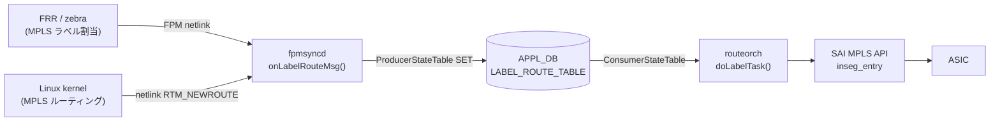

# LABEL_ROUTE_TABLE (APPL_DB)

## 概要

`APPL_DB:LABEL_ROUTE_TABLE` は MPLS **incoming-label ルート**（inseg エントリ）を保持するテーブル。
`fpmsyncd` がカーネルの netlink メッセージ（`RTM_NEWROUTE` / `RTM_DELROUTE`、アドレスファミリ MPLS）を
受信すると `LabelRouteTableFieldValueTupleWrapper` を通じて書き込む。
`routeorch` の `doLabelTask()` がこのテーブルを購読し、SAI `inseg_entry` を作成・更新・削除する。

<!-- cdb-mermaid -->
### データフロー


<!-- /cdb-mermaid -->

## key 構造

```text
LABEL_ROUTE_TABLE|<incoming-label>
LABEL_ROUTE_TABLE|<vrf-name>:<incoming-label>
```

- `<incoming-label>`: 受信 MPLS ラベル値（uint32）
- `<vrf-name>`: VRF 名（非デフォルト VRF の場合。現在 fpmsyncd は非デフォルト VRF の MPLS ルートを `SWSS_LOG_INFO` のみ出力してスキップする）

## フィールド

| フィールド | 型 | デフォルト | 説明 |
|-----------|----|-----------|------|
| `nexthop` | string | `""` (省略) | outgoing ゲートウェイ IP アドレスのカンマ区切りリスト。ECMP 時は複数エントリをカンマで並べる |
| `ifname` | string | `""` (省略) | 出力インタフェース名のカンマ区切りリスト。`nexthop` と要素数を一致させる必要がある |
| `mpls_nh` | string | `""` (省略) | outgoing MPLS ラベル操作のカンマ区切りリスト。`push<N>` / `swap<N>` / `na`（IP 転送）の形式 |
| `mpls_pop` | string | `""` (省略、fpmsyncd は常に `"1"` を書く) | 受信ラベルを pop する段数。SAI `SAI_INSEG_ENTRY_ATTR_NUM_OF_POP` にマップされる |
| `blackhole` | boolean string | `"false"` (省略) | `"true"` のとき `SAI_PACKET_ACTION_DROP` を設定するブラックホールルート |
| `protocol` | string | `""` (省略) | ルート起源プロトコル名。Linux rt_protos 由来（例: `"bgp"`, `"zebra"`, `"static"`）。省略時は routeorch が無視 |
| `weight` | string | `""` (省略) | ECMP ネクストホップ重みのカンマ区切りリスト。省略時は均等分散 |
| `nexthop_group` | string | `""` (省略) | NhgOrch が管理する NHG インデックス。指定時は `nexthop`/`ifname` と排他 |

<!-- defaults -->
### コード由来デフォルトの根拠

#### `protocol` — デフォルト `""` (省略)

`LabelRouteTableFieldValueTupleWrapper` の初期値は `string()`（空文字列）。
非 ZMQ パスでは非空のときのみ fvVector に追加される:

```cpp
// sonic-swss fpmsyncd/routesync.h:144
string protocol = string();

// fpmsyncd/routesync.cpp:1073-1075
if (protocol != string()) {
    fvVector.push_back(FieldValueTuple("protocol", protocol.c_str()));
}
```

`onLabelRouteMsg()` では `getProtocolString(rtnl_route_get_protocol(route_obj))` で
Linux rt_protos 名（例: `"bgp"`, `"zebra"`, `"static"`）に変換してセットする。
省略時は routeorch 側で無視（`SAI_INSEG_ENTRY_ATTR_` へのマップなし）。

#### `nexthop` — デフォルト `""` (省略)

```cpp
// sonic-swss fpmsyncd/routesync.h:146
string nexthop = string();

// fpmsyncd/routesync.cpp:2726
fvw.nexthop = std::move(gw_list);
```

`getNextHopList()` がカーネル netlink の nexthop から GW IP リストを構築する。
非 ZMQ パスでは空のとき省略:

```cpp
// fpmsyncd/routesync.cpp:1079-1081
if (nexthop != string()) {
    fvVector.push_back(FieldValueTuple("nexthop", nexthop.c_str()));
}
```

#### `blackhole` — デフォルト `"false"`

`LabelRouteTableFieldValueTupleWrapper` の初期値として `string("false")` が宣言され、
`"false"` に一致する場合は fvVector に追加しない（非 ZMQ パス）:

```cpp
// sonic-swss fpmsyncd/routesync.h:145
string blackhole = string("false");

// fpmsyncd/routesync.cpp:1076-1078
if (blackhole != string("false")) {
    fvVector.push_back(FieldValueTuple("blackhole", blackhole.c_str()));
}
```

`RTN_BLACKHOLE` タイプのルートのみ `fvw.blackhole = "true"` にセットされる
(`routesync.cpp:2693`)。

#### `mpls_pop` — fpmsyncd は常に `"1"` を書く

`onLabelRouteMsg()` は RTN_UNICAST ルートで必ず `mpls_pop = "1"` をセットする:

```cpp
// fpmsyncd/routesync.cpp:2728
fvw.mpls_pop = "1";
```

ただし `LabelRouteTableFieldValueTupleWrapper` の初期値は `string()`（空）なので、
外部から手動で書き込む場合は省略可能（routeorch 側の `pop_count` は uint8_t のゼロ初期化
により 0 = ラベル pop なし）。

#### `mpls_nh` — outgoing ラベルが存在する場合のみ書かれる

```cpp
// fpmsyncd/routesync.cpp:2729-2732
if (!mpls_list.empty())
{
    fvw.mpls_nh = std::move(mpls_list);
}
```

空のときは省略。routeorch 側では `"na"` 要素を IP 転送（MPLS ラベルなし）として扱う:

```cpp
// orchagent/mplsrouteorch.cpp:244
if (!mpls_nhv.empty() && mpls_nhv[i] != "na")
{
    nhg_str += mpls_nhv[i] + LABELSTACK_DELIMITER;
}
```

#### `ifname` — 省略時はルートをスキップ

`ifname` が空かつ非 blackhole の場合、routeorch はルートを無効として消費する:

```cpp
// orchagent/mplsrouteorch.cpp:193-197
if (alsv.size() == 0 && !blackhole)
{
    SWSS_LOG_WARN("Skip the route %s, for it has an empty ifname field.", key.c_str());
    it = consumer.m_toSync.erase(it);
    continue;
}
```
<!-- /defaults -->

## 制約・注意事項

- 非デフォルト VRF の MPLS ルートは現在 fpmsyncd がスキップする（`SWSS_LOG_INFO` のみ）
- `nexthop_group` と `nexthop`/`ifname` の同時指定はエラー (`SWSS_LOG_ERROR`)
- `mpls_pop` は SAI の `SAI_INSEG_ENTRY_ATTR_NUM_OF_POP` に直接マップ。0 の場合はラベル pop なし
- `mpls_nh` の `push<N>` は SAI_OUTSEG_TYPE_PUSH、`swap<N>` は SAI_OUTSEG_TYPE_SWAP として解釈される

## 購読者

- `routeorch::doLabelTask()` (`sonic-swss/orchagent/mplsrouteorch.cpp`): SAI `inseg_entry` の作成・更新・削除

## 書き込み元

- `fpmsyncd::RouteSync::onLabelRouteMsg()` (`sonic-swss/fpmsyncd/routesync.cpp`): カーネル netlink MPLS ルート受信時
