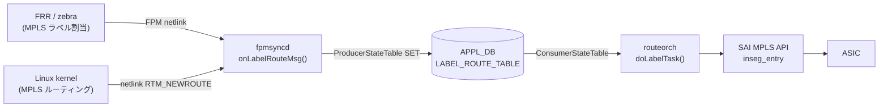

# LABEL_ROUTE_TABLE (APPL_DB)

## 概要

`APPL_DB:LABEL_ROUTE_TABLE` は [MPLS](../../reference/glossary.md#term-mpls) **incoming-label ルート**（inseg エントリ）を保持するテーブル。
`fpmsyncd` がカーネルの netlink メッセージ（`RTM_NEWROUTE` / `RTM_DELROUTE`、アドレスファミリ [MPLS](../../reference/glossary.md#term-mpls)）を
受信すると `LabelRouteTableFieldValueTupleWrapper` を通じて書き込む。
`routeorch` の `doLabelTask()` がこのテーブルを購読し、[SAI](../../reference/glossary.md#term-sai) `inseg_entry` を作成・更新・削除する。

<!-- cdb-mermaid -->
### データフロー


<!-- /cdb-mermaid -->

## key 構造

```text
LABEL_ROUTE_TABLE|<incoming-label>
LABEL_ROUTE_TABLE|<vrf-name>:<incoming-label>
```

- `<incoming-label>`: 受信 [MPLS](../../reference/glossary.md#term-mpls) ラベル値（uint32）
- `<vrf-name>`: [VRF](../../reference/glossary.md#term-vrf) 名（非デフォルト [VRF](../../reference/glossary.md#term-vrf) の場合。現在 [fpmsyncd](../../reference/glossary.md#term-fpmsyncd) は非デフォルト [VRF](../../reference/glossary.md#term-vrf) の MPLS ルートを `SWSS_LOG_INFO` のみ出力してスキップする）

## フィールド

| フィールド | 型 | デフォルト | 説明 |
|-----------|----|-----------|------|
| `nexthop` | string | `""` (省略) | outgoing ゲートウェイ IP アドレスのカンマ区切りリスト。[ECMP](../../reference/glossary.md#term-ecmp) 時は複数エントリをカンマで並べる |
| `ifname` | string | `""` (省略) | 出力インタフェース名のカンマ区切りリスト。`nexthop` と要素数を一致させる必要がある |
| `mpls_nh` | string | `""` (省略) | outgoing MPLS ラベル操作のカンマ区切りリスト。`push<N>` / `swap<N>` / `na`（IP 転送）の形式 |
| `mpls_pop` | string | `""` (省略、[fpmsyncd](../../reference/glossary.md#term-fpmsyncd) は常に `"1"` を書く) | 受信ラベルを pop する段数。[SAI](../../reference/glossary.md#term-sai) `SAI_INSEG_ENTRY_ATTR_NUM_OF_POP` にマップされる |
| `blackhole` | boolean string | `"false"` (省略) | `"true"` のとき `SAI_PACKET_ACTION_DROP` を設定するブラックホールルート |
| `protocol` | string | `""` (省略) | ルート起源プロトコル名。Linux rt_protos 由来（例: `"bgp"`, `"zebra"`, `"static"`）。省略時は routeorch が無視 |
| `weight` | string | `""` (省略) | [ECMP](../../reference/glossary.md#term-ecmp) ネクストホップ重みのカンマ区切りリスト。省略時は均等分散 |
| `nexthop_group` | string | `""` (省略) | NhgOrch が管理する NHG インデックス。指定時は `nexthop`/`ifname` と排他 |

<!-- defaults -->
### コード由来デフォルトの根拠

#### `protocol` — デフォルト `""` (省略)

`LabelRouteTableFieldValueTupleWrapper` の初期値は `string()`（空文字列）。
非 ZMQ パスでは非空のときのみ fvVector に追加される:

```cpp
// sonic-swss fpmsyncd/routesync.h:144
string protocol = string();

// fpmsyncd/routesync.cpp:1073-1075
if (protocol != string()) {
    fvVector.push_back(FieldValueTuple("protocol", protocol.c_str()));
}
```

`onLabelRouteMsg()` では `getProtocolString(rtnl_route_get_protocol(route_obj))` で
Linux rt_protos 名（例: `"bgp"`, `"zebra"`, `"static"`）に変換してセットする。
省略時は routeorch 側で無視（`SAI_INSEG_ENTRY_ATTR_` へのマップなし）。

#### `nexthop` — デフォルト `""` (省略)

```cpp
// sonic-swss fpmsyncd/routesync.h:146
string nexthop = string();

// fpmsyncd/routesync.cpp:2726
fvw.nexthop = std::move(gw_list);
```

`getNextHopList()` がカーネル netlink の nexthop から GW IP リストを構築する。
非 ZMQ パスでは空のとき省略:

```cpp
// fpmsyncd/routesync.cpp:1079-1081
if (nexthop != string()) {
    fvVector.push_back(FieldValueTuple("nexthop", nexthop.c_str()));
}
```

#### `blackhole` — デフォルト `"false"`

`LabelRouteTableFieldValueTupleWrapper` の初期値として `string("false")` が宣言され、
`"false"` に一致する場合は fvVector に追加しない（非 ZMQ パス）:

```cpp
// sonic-swss fpmsyncd/routesync.h:145
string blackhole = string("false");

// fpmsyncd/routesync.cpp:1076-1078
if (blackhole != string("false")) {
    fvVector.push_back(FieldValueTuple("blackhole", blackhole.c_str()));
}
```

`RTN_BLACKHOLE` タイプのルートのみ `fvw.blackhole = "true"` にセットされる
(`routesync.cpp:2693`)。

#### `mpls_pop` — fpmsyncd は常に `"1"` を書く

`onLabelRouteMsg()` は RTN_UNICAST ルートで必ず `mpls_pop = "1"` をセットする:

```cpp
// fpmsyncd/routesync.cpp:2728
fvw.mpls_pop = "1";
```

ただし `LabelRouteTableFieldValueTupleWrapper` の初期値は `string()`（空）なので、
外部から手動で書き込む場合は省略可能（routeorch 側の `pop_count` は uint8_t のゼロ初期化
により 0 = ラベル pop なし）。

#### `mpls_nh` — outgoing ラベルが存在する場合のみ書かれる

```cpp
// fpmsyncd/routesync.cpp:2729-2732
if (!mpls_list.empty())
{
    fvw.mpls_nh = std::move(mpls_list);
}
```

空のときは省略。routeorch 側では `"na"` 要素を IP 転送（MPLS ラベルなし）として扱う:

```cpp
// orchagent/mplsrouteorch.cpp:244
if (!mpls_nhv.empty() && mpls_nhv[i] != "na")
{
    nhg_str += mpls_nhv[i] + LABELSTACK_DELIMITER;
}
```

#### `ifname` — 省略時はルートをスキップ

`ifname` が空かつ非 blackhole の場合、routeorch はルートを無効として消費する:

```cpp
// orchagent/mplsrouteorch.cpp:193-197
if (alsv.size() == 0 && !blackhole)
{
    SWSS_LOG_WARN("Skip the route %s, for it has an empty ifname field.", key.c_str());
    it = consumer.m_toSync.erase(it);
    continue;
}
```
<!-- /defaults -->

## 制約・注意事項

- 非デフォルト VRF の MPLS ルートは現在 [fpmsyncd](../../reference/glossary.md#term-fpmsyncd) がスキップする（`SWSS_LOG_INFO` のみ）
- `nexthop_group` と `nexthop`/`ifname` の同時指定はエラー (`SWSS_LOG_ERROR`)
- `mpls_pop` は [SAI](../../reference/glossary.md#term-sai) の `SAI_INSEG_ENTRY_ATTR_NUM_OF_POP` に直接マップ。0 の場合はラベル pop なし
- `mpls_nh` の `push<N>` は SAI_OUTSEG_TYPE_PUSH、`swap<N>` は SAI_OUTSEG_TYPE_SWAP として解釈される

## 購読者

- `routeorch::doLabelTask()` (`sonic-swss/orchagent/mplsrouteorch.cpp`): SAI `inseg_entry` の作成・更新・削除

## 書き込み元

- `fpmsyncd::RouteSync::onLabelRouteMsg()` (`sonic-swss/fpmsyncd/routesync.cpp`): カーネル netlink MPLS ルート受信時

<!-- side-effects -->
## 副次 DB 書込

[APPL_DB](../../reference/glossary.md#term-appl_db) `LABEL_ROUTE_TABLE` の SET / DEL に対して、`routeorch::doLabelTask()`
(`orchagent/mplsrouteorch.cpp`) および `nhgorch` の MPLS NH 経路 (`isLabeled()` 分岐) は
**[STATE_DB](../../reference/glossary.md#term-state_db) / [COUNTERS_DB](../../reference/glossary.md#term-counters_db) / APPL_STATE_DB への副次書き込みを一切行わない**。
副作用は SAI `inseg_entry` および MPLS NH (SAI `next_hop`) オブジェクトの [ASIC](../../reference/glossary.md#term-asic) 反映に閉じる。

| 副次 DB | 書込有無 | 根拠 |
|---|---|---|
| [STATE_DB](../../reference/glossary.md#term-state_db) | なし | `mplsrouteorch.cpp` / `nhgorch.cpp` に `m_stateDb` / `STATE_DB` 参照なし。`routeorch.cpp:294` の `m_stateDefaultRouteTb->set()` は IPv4/IPv6 デフォルトルート (`APP_ROUTE_TABLE_NAME`) 経路でのみ呼ばれ、`doTask` (`routeorch.cpp:618`) は `APP_LABEL_ROUTE_TABLE_NAME` のとき `doLabelTask` 呼出後 `return;` するため MPLS 経路には波及しない |
| [COUNTERS_DB](../../reference/glossary.md#term-counters_db) | なし | `mplsrouteorch.cpp` / `nhgorch.cpp` に `FlexCounter` / `COUNTERS_DB` 参照なし。SAI `inseg_entry` 用カウンタは未統合 |
| APPL_STATE_DB | なし | `routeorch.cpp:3201` の `m_publisher.publish(APP_ROUTE_TABLE_NAME, ...)` は `ROUTE_TABLE` キー固定で、`LABEL_ROUTE_TABLE` に対する APPL_STATE_DB ミラーは存在しない |

詳細な走査ログは `meta/_intermediate/cdb-flow/appl-mpls-route-side.md` を参照。
<!-- /side-effects -->

<!-- platform -->
## プラットフォーム差 (Phase H)

`mplsrouteorch.cpp` / `nhgorch.cpp` / `routeorch.cpp` / `saihelper.cpp` / `crmorch.cpp` の MPLS 経路を全文走査した結果、[APPL_DB](../../reference/glossary.md#term-appl_db) `LABEL_ROUTE_TABLE` の [orchagent](../../reference/glossary.md#term-orchagent) 処理はコミュニティ master 上で **コード上プラットフォーム非依存**である。実質的な差は SAI ベンダー実装側（`inseg_entry` サポートの有無、`sai_object_type_get_availability` の精度）に閉じ、[CONFIG_DB](../../reference/glossary.md#term-config_db) / [APPL_DB](../../reference/glossary.md#term-appl_db) スキーマ・キー構造には現れない。

| 観点 | 差の有無 | 根拠 | ソース |
|---|---|---|---|
| SAI MPLS inseg_entry capability の runtime 問い合わせ | **なし** | `sai_query_attribute_capability` / `sai_object_type_query` for INSEG が `mplsrouteorch.cpp` / `nhgorch.cpp` に 0 件。`SAI_API_MPLS` は `saihelper.cpp:220` で起動時に一括 `sai_api_query()` され、runtime での有効/無効判定パスは存在しない | `saihelper.cpp:220,284` |
| inseg_entry 非サポート [ASIC](../../reference/glossary.md#term-asic) での挙動 | **差あり (SAI 層)** | `gLabelRouteBulker.create_entry()` が `SAI_STATUS_NOT_SUPPORTED` を返した場合、`handleSaiSetStatus(SAI_API_MPLS, status)` に委譲され retry 永続。[CONFIG_DB](../../reference/glossary.md#term-config_db) によるガード・無効化スイッチは実装なし | `mplsrouteorch.cpp:742,781,794,835` |
| `SAI_SWITCH_ATTR_AVAILABLE_*` による MPLS 上限取得 | **なし** | `CRM_MPLS_INSEG` / `CRM_MPLS_NEXTHOP` は `crmResSaiAvailAttrMap` に**エントリなし**。`sai_object_type_get_availability(SAI_OBJECT_TYPE_INSEG_ENTRY, ...)` 汎用パスで取得するため、精度はベンダー SAI 実装に依存 | `crmorch.cpp:113,801,854` |
| switch type voq/chassis/fabric 分岐 (MPLS inseg 直接) | **なし** | `mplsrouteorch.cpp` / `nhgorch.cpp` に `gMySwitchType` / `voq` / `chassis` / `fabric` 参照 0 件 | — |
| voq による NHG 上限クランプの副次的影響 | **差あり (間接)** | voq 環境では `routeorch.cpp:109` で `maxEcmpGroupSize` が 128 にクランプされ、`doLabelTask` の NHG 上限チェック (`mplsrouteorch.cpp:310-316`) に波及。MPLS [ECMP](../../reference/glossary.md#term-ecmp) NHG の最大メンバー数が 128 に制限される | `routeorch.cpp:109`, `mplsrouteorch.cpp:310-316` |
| [VOQ](../../reference/glossary.md#term-voq) Chassis inter-[ASIC](../../reference/glossary.md#term-asic) MPLS 転送 | **なし ([orchagent](../../reference/glossary.md#term-orchagent) 外)** | 各ラインカードが独立した `swss` コンテナを持ち `doLabelTask` を独立実行。inter-ASIC MPLS forwarding は SAI / ASIC ファブリック層の責務で [orchagent](../../reference/glossary.md#term-orchagent) には可視でない | — |
| multi-asic namespace 特殊化 | **なし** | `mplsrouteorch.cpp` / `nhgorch.cpp` / `onLabelRouteMsg()` に `namespace` / `asic_id` 参照 0 件。各 asic-namespace は独立 swss コンテナで同一ロジックを実行 | — |
| VRF 制限 (プラットフォーム非依存) | **あり** | `fpmsyncd/routesync.cpp:2674-2681` で非デフォルト VRF (`master_index != 0`) は `SWSS_LOG_INFO("Unsupported Non-default VRF")` のみでスキップ。ASIC タイプとは無関係な fpmsyncd 全体の制約 | `routesync.cpp:2674-2681` |

詳細な走査ログは `meta/_intermediate/cdb-flow/mpls-platform.md` および `meta/_intermediate/cdb-flow/appl-mpls-route-platform.md` を参照。
<!-- /platform -->

<!-- cross-refs -->
## 暗黙参照 — Phase C (cross-table refs)

> **調査根拠**: `mplsrouteorch.cpp`, `nhgorch.cpp`, `routeorch.cpp` の MPLS 経路を全行精読 (2026-05-15)
> 詳細証跡: `meta/_intermediate/cdb-flow/appl-mpls-route-cross-refs.md`

`APPL_DB:LABEL_ROUTE_TABLE` は [YANG](../../reference/glossary.md#term-yang) モデルを持たないが、`routeorch::doLabelTask()` および `NhgOrch` の MPLS NH 分岐 (`isLabeled()`) を介して以下のオブジェクト/テーブルを実行時に暗黙参照する。

| 参照先 | DB / Orch | 参照方向 | [YANG](../../reference/glossary.md#term-yang) leafref | 実装上の必須度 | 証拠 |
|---|---|---|---|---|---|
| NextHop (IP / MPLS) | NeighOrch → SAI `next_hop` | 実行時参照 | なし | 必須 | mplsrouteorch.cpp:514-540, nhgorch.cpp:544-585 |
| NEIGH ([ARP](../../reference/glossary.md#term-arp)/[NDP](../../reference/glossary.md#term-ndp)) | APPL_DB `NEIGH_TABLE` / kernel | 解決前提・未解決時は retry | なし | 必須 (非 intf NH) | mplsrouteorch.cpp:520, 538, 559 |
| INTF (Router Interface) | IntfsOrch → SAI `router_interface` | 実行時参照 | なし | 必須 (intf NH) | mplsrouteorch.cpp:503, 707; nhgorch.cpp:542 |
| NHG (NhgOrch / CbfNhgOrch) | APPL_DB `NEXT_HOP_GROUP_TABLE` | 実行時参照 (`nexthop_group` 指定時) | なし | 条件付き必須 | mplsrouteorch.cpp:157-170, 256-267, 483-490 |
| VRF | VrfOrch (`CONFIG_DB:VRF`) | 実行時参照 (`Vrf<name>:` キー時) | なし | 条件付き必須 | mplsrouteorch.cpp:107-118, 474, 957 |

### NEXTHOP / NEIGH — neighbor 解決連動の retry

`addLabelRoute()` は非 intf NH について `m_neighOrch->hasNextHop()` / `getNextHopId()` で SAI NH OID を引き、未存在かつ MPLS NH の場合は IP neighbor 解決済みなら `m_neighOrch->addNextHop(ctx)` で MPLS NH を新規生成する (`mplsrouteorch.cpp:514-527`)。[ARP](../../reference/glossary.md#term-arp)/[NDP](../../reference/glossary.md#term-ndp) 未解決時は `resolveNeighbor()` を発火して `return false`（retry サイクル）。NHG メンバ生成 (`nhgorch.cpp:563-585`) も同じパターンで NeighOrch 経由で解決を待つ。

### INTF — directly connected NH の前提

`nexthop.isIntfNextHop()` の場合は `m_intfsOrch->getRouterIntfsId(nexthop.alias)` で [RIF](../../reference/glossary.md#term-rif) OID を取得し、`SAI_NULL_OBJECT_ID` のときは retry (`mplsrouteorch.cpp:503-510, 707-723`)。[RIF](../../reference/glossary.md#term-rif) が出来上がるまで inseg は ASIC に反映されない。

### NHG — NhgOrch / CbfNhgOrch 二段参照

`nexthop_group=<index>` を指定したエントリは `getNhg(nhg_index)` (NhgOrch / CbfNhgOrch 双方) で `NhgBase` を取得し `nhg_key` を確定する。`nexthop_group` と `nexthop`/`ifname` の同時指定は LOG_ERROR で即 drop (`mplsrouteorch.cpp:165-170`)。NHG 未存在時は `++it` retry、Post で `out_of_range` を `catch` した場合も retry (`mplsrouteorch.cpp:483-490, 686-689`)。

### VRF — `<vrf-name>:<label>` プレフィックス

キーが `VRF_PREFIX`（`"Vrf"`）で始まるとき `m_vrfOrch->isVRFexists()` + `getVRFid()` で SAI VRF OID を取得 (`mplsrouteorch.cpp:107-118`)。**現状 fpmsyncd は非デフォルト VRF の MPLS ルートを生成しない** (`routesync.cpp:2674-2681`) ため、本暗黙参照は手動 APPL_DB 書込・サードパーティ [FPM](../../reference/glossary.md#term-fpm) クライアント経由でのみ顕在化する。

### SAI 参照

- `inseg_entry` (`SAI_OBJECT_TYPE_INSEG_ENTRY`): label / num_of_pop / packet_action / next_hop_id を設定
- `next_hop` / `next_hop_group` / `router_interface`: NeighOrch / NhgOrch / IntfsOrch 経由で間接利用

### YANG leafref

APPL_DB は [YANG](../../reference/glossary.md#term-yang) 非対応のため leafref は **存在しない**。本セクションの参照はすべて C++ 実装上の暗黙依存。

<!-- /cross-refs -->

<!-- failure -->
## 失敗挙動マトリクス (Phase D)

ソース: `sonic-net/sonic-swss/orchagent/mplsrouteorch.cpp`, `orchagent/nhgorch.cpp`

### SET (`doLabelTask` / `addLabelRoute` / `addLabelRoutePost`) における失敗・retry 経路

| 失敗条件 | 検出箇所 | 結果 | ログ出力 | evidence |
|---|---|---|---|---|
| `nexthop_group` と `nexthop`/`ifname` の同時指定 | `doLabelTask()` L165-171 | エントリを `m_toSync` から **erase** (drop)・retry なし | LOG_ERROR ("Route %s has both nexthop_group and ips/aliases") | `mplsrouteorch.cpp:167-170` |
| `ifname` が空かつ非 blackhole | `doLabelTask()` L193-198 | エントリを **erase** (drop)・retry なし | LOG_WARN ("Skip the route ... empty ifname field.") | `mplsrouteorch.cpp:195-197` |
| `op` が `SET_COMMAND` / `DEL_COMMAND` 以外 | `doLabelTask()` L327-330 | LOG_ERROR | LOG_ERROR ("Unknown operation type %s") | `mplsrouteorch.cpp:329` |
| `nexthop_group` 指定だが NhgOrch に該当 NHG なし (doLabelTask) | `doLabelTask()` L256-267 | LOG_ERROR・`++it` で **retry** | LOG_ERROR ("Next hop group %s does not exist") | `mplsrouteorch.cpp:262-266` |
| `nexthop_group` 指定で NHG が `addLabelRoute` 内で消失 | `addLabelRoute()` L481-490 `catch(out_of_range)` | `return false` → **retry** | LOG_WARN ("Next hop group key %s does not exist") | `mplsrouteorch.cpp:486-490` |
| 単一 NH が intf NH で [RIF](../../reference/glossary.md#term-rif) 未作成 | `addLabelRoute()` L502-510 | `return false` → **retry** | LOG_INFO ("Failed to get next hop %s for %u") | `mplsrouteorch.cpp:505-510` |
| 単一 NH の IP neighbor 未解決 | `addLabelRoute()` L534-540 | `resolveNeighbor()` 発火後 `return false` → **retry** | LOG_INFO ("Failed to get next hop %s for %u") | `mplsrouteorch.cpp:536-540` |
| MPLS NH の `addNextHop()` 失敗 | `addLabelRoute()` L523-531 | `return false` → **retry** | (NeighOrch 側) | `mplsrouteorch.cpp:528-531` |
| ECMP NHG (`getSize() > 1`) で `addNextHopGroup` 失敗 | `addLabelRoute()` L550-583 | 未解決メンバごとに `resolveNeighbor()` 発火・`addTempLabelRoute()` で一時ルート登録・`return false` → **retry** | LOG_INFO ("Failed to get next hop ... resolving neighbor") | `mplsrouteorch.cpp:550-583` |
| `gLabelRouteBulker.create_entry` が `SAI_STATUS_ITEM_ALREADY_EXISTS` | `addLabelRoute()` L628-633 | `return false` → **retry** | LOG_ERROR ("Failed to create label route %u with next hop(s) %s") | `mplsrouteorch.cpp:628-633` |
| Post: `object_statuses` 空 (bulker 前で異常) | `addLabelRoutePost()` L677-681 | `return false` → **retry** | なし | `mplsrouteorch.cpp:677-681` |
| Post: NhgOrch/CbfNhgOrch から NHG が消失 | `addLabelRoutePost()` L687-694 | `return false` → **retry** | LOG_WARN ("Failed to get next hop group with index %s") | `mplsrouteorch.cpp:689-693` |
| Post: 単一 NH が RIF/Neighbor で消失 | `addLabelRoutePost()` L704-724 | `return false` → **retry** | LOG_INFO ("Failed to get next hop %s for label %u") | `mplsrouteorch.cpp:707-723` |
| Post: ECMP NHG が消失 → 一時ルートで再 Post | `addLabelRoutePost()` L727-735 | `addLabelRoutePost(ctx, tmp_next_hop)` 再帰呼出後 `return false` → **retry** | なし | `mplsrouteorch.cpp:729-735` |
| Post: SAI `create_entry` 失敗 (新規) | `addLabelRoutePost()` L742-752 | NHG > 1 のとき `removeNextHopGroup()` で巻き戻し・`return false` → **retry** | LOG_ERROR ("Failed to create label %u with next hop(s) %s") | `mplsrouteorch.cpp:742-752` |
| Post: SAI `set` (PACKET_ACTION/NEXT_HOP_ID/blackhole) 失敗 | `addLabelRoutePost()` L777-840 | `handleSaiSetStatus(SAI_API_MPLS, status)` → `task_success` 以外なら `parseHandleSaiStatusFailure` で **retry / abort** 振り分け | LOG_ERROR ("Failed to set label %u with ...") | `mplsrouteorch.cpp:777-840` |

### DEL (`removeLabelRoute` / `removeLabelRoutePost`) における失敗・retry 経路

| 失敗条件 | 検出箇所 | 結果 | ログ出力 | evidence |
|---|---|---|---|---|
| VRF に対応する route table が存在しない | `removeLabelRoute()` L859-864 | `return true` → erase (silent success) | LOG_INFO ("Failed to find route table, ...") | `mplsrouteorch.cpp:860-864` |
| 該当 label の inseg エントリが存在しない | `removeLabelRoute()` L872-877 | `return true` → erase (silent success) | LOG_INFO ("Failed to find inseg entry, ...") | `mplsrouteorch.cpp:872-877` |
| Post: `object_statuses` 空 (bulker 前で異常) | `removeLabelRoutePost()` L896-900 | `return false` → **retry** | なし | `mplsrouteorch.cpp:896-900` |
| Post: SAI `remove_entry` 失敗 | `removeLabelRoutePost()` L906-915 | `handleSaiRemoveStatus(SAI_API_MPLS, status)` で **retry / abort** 振り分け | LOG_ERROR ("Failed to remove label:%u") | `mplsrouteorch.cpp:907-915` |

### nhgorch (MPLS NH `isLabeled()` 分岐) における失敗経路

| 失敗条件 | 検出箇所 | 結果 | ログ出力 | evidence |
|---|---|---|---|---|
| `isLabeled() && isNeighborResolved` で `gNeighOrch->addNextHop(ctx)` 失敗 | `NextHopGroupMember::createSaiObject()` L563-570 | `nh_id` は `SAI_NULL_OBJECT_ID` のまま返却 → 上位で **retry** | (NeighOrch 側) | `nhgorch.cpp:563-570` |
| MPLS NH 同期時、neighbor 未解決 | `createSaiObject()` else L571-587 | `resolveNeighbor()` 発火・`nh_id = SAI_NULL_OBJECT_ID` → 上位 **retry** | LOG_INFO ("Failed to get next hop %s, resolving neighbor") | `nhgorch.cpp:583-585` |
| NHG 全体の SAI create 失敗 | `NextHopGroup::sync()` L784 付近 | LOG_ERROR・`return false` → **retry** | LOG_ERROR ("Failed to create next hop group %s, rv:%d") | `nhgorch.cpp:782-786` |
| MPLS NH メンバの SAI create 失敗 | `NextHopGroup::sync()` L975 付近 | LOG_ERROR・`return false` → **retry** | LOG_ERROR ("Failed to create next hop group %s's member %s") | `nhgorch.cpp:975` |
| MPLS NH メンバ interface down | `NextHopGroup::sync()` L949 付近 | LOG_WARN・メンバ除外 (NHG は他メンバで継続) | LOG_WARN ("Skip next hop %s ..., interface is down") | `nhgorch.cpp:949` |
| MPLS NH ref_count 0 で destructor | `~NextHopGroupMember()` L677-682 | `removeMplsNextHop()` で NeighOrch から MPLS NH 除去 | なし | `nhgorch.cpp:677-682` |

### 補足

- **retry vs drop**: `doLabelTask` のループは `addLabelRoute` / `removeLabelRoute` が `true` を返したときのみ `m_toSync.erase(it)`。`false` 戻り値は `++it` で次サイクル **retry**。入力バリデーション失敗 (両方指定・ifname 空) のみ即 erase される。
- **bulker による非同期確定**: `addLabelRoute` 正常パスの末尾も `return false` (L664)。これは bulker 登録のみの段階で、確定は `addLabelRoutePost` が `m_syncdLabelRoutes` 反映と `gCrmOrch->incCrmResUsedCounter(CRM_MPLS_INSEG)` 実行で行う。
- **neighbor 解決連動**: retry 経路の多くは `m_neighOrch->resolveNeighbor()` を呼ぶため空回りせず、[ARP](../../reference/glossary.md#term-arp)/[NDP](../../reference/glossary.md#term-ndp) 解決後の次サイクルで成功する。
- **一時ルート**: ECMP NHG が一部メンバ未解決で作成不能な場合、`addTempLabelRoute()` で解決済み単独 NH を指す一時 inseg を登録し、全メンバ解決後の retry サイクルで本来の NHG に置換される。
- **`handleSaiSetStatus` / `handleSaiRemoveStatus`** は SAI ステータスから `task_success` / `task_need_retry` / `task_failed` を導出する OrchAgent 共通ハンドラで、MPLS では `SAI_API_MPLS` を渡す。

詳細な走査ログは `meta/_intermediate/cdb-flow/appl-mpls-route-failure.md` を参照。
<!-- /failure -->

<!-- constants -->
## ハードコード定数 (Phase E)

`mplsrouteorch` / `nhgorch` MPLS 経路 / `CrmOrch` MPLS resource から抽出した APPL_DB `LABEL_ROUTE_TABLE` 経路に関わる主要ハードコード定数。詳細スキャン結果は `meta/_intermediate/cdb-flow/appl-mpls-route-constants.md` および `meta/_intermediate/cdb-flow/mpls-constants.md`。

### APPL_DB テーブル名マクロ（`schema.h`）

| マクロ | 値 | 行 |
|---|---|---|
| `APP_LABEL_ROUTE_TABLE_NAME` | `"LABEL_ROUTE_TABLE"` | `sonic-swss-common/common/schema.h:48` |

`routeorch::doTask` で `getTableName() == APP_LABEL_ROUTE_TABLE_NAME` のとき `doLabelTask` に分岐し、その後 `return;`（IPv4/IPv6 経路と排他）。

### MPLS label 値範囲（`label.h`）

| マクロ | 値 | 行 | 用途 |
|---|---|---|---|
| `LABEL_VALUE_MIN` | `0` | `label.h:15` | `to_uint<uint32_t>` 変換時の下限 |
| `LABEL_VALUE_MAX` | `0xFFFFF` (1048575) | `label.h:16` | 同上の上限。20-bit MPLS label space (RFC 3032) |
| `LABEL_DELIMITER` | `'/'` | `label.h:14` | label stack 区切り（`<label0>/<label1>/.../<labelN>`） |

`LabelStack(const std::string&)` コンストラクタ（`label.h:47-49`）で `tokenize(str.substr(4), LABEL_DELIMITER)` 後、各要素を `to_uint<uint32_t>(i, LABEL_VALUE_MIN, LABEL_VALUE_MAX)` で変換。範囲外はパース時に例外。

### MPLS outseg type 文字列リテラル（`label.h`）

`LabelStack(const std::string&)` コンストラクタ（L23-50）と `to_string()`（L84-108）でハードコード:

| 文字列 | SAI 値 | 行 |
|---|---|---|
| `"swap"` | `SAI_OUTSEG_TYPE_SWAP` | `label.h:33-35, 91-93` |
| `"push"` | `SAI_OUTSEG_TYPE_PUSH` | `label.h:37-39, 95-97` |

デフォルトコンストラクタは `SAI_OUTSEG_TYPE_SWAP` 初期化（L24）。`str.find("swap") == 0` / `str.find("push") == 0` で prefix 判定し、続く 4 文字以降を label stack としてパース。

### key 区切り・プレフィクスマクロ（`nexthopkey.h`）

| マクロ | 値 | 行 | 用途 |
|---|---|---|---|
| `LABELSTACK_DELIMITER` | `'+'` | `nexthopkey.h:17` | `<labelstack>+<ip>@<intf>` の MPLS / 非 MPLS 区切り（`mplsrouteorch.cpp:246`, `nexthopkey.h:186, 216`） |
| `NH_DELIMITER` | `'@'` | `nexthopkey.h:18` | nexthop IP と intf alias の区切り（`mplsrouteorch.cpp:248`） |
| `NHG_DELIMITER` | `','` | `nexthopkey.h:19` | ECMP NH カンマ区切り |
| `VRF_PREFIX` | `"Vrf"` | `nexthopkey.h:20` | non-default VRF key 判定 |

### APPL_DB フィールド名・値リテラル（`mplsrouteorch.cpp`）

`doLabelTask()` の fv ループ（L143-160）でハードコード文字列をフィールド名として比較:

| 文字列 | 行 | 用途 |
|---|---|---|
| `"mpls_nh"` | 145 | outgoing MPLS ラベル操作リスト |
| `"mpls_pop"` | 148 | pop 段数 |
| `"blackhole"` | 151 | `fvValue(i) == "true"` でブラックホール扱い |
| `"weight"` | 154 | ECMP ネクストホップ重み |
| `"nexthop_group"` | 157 | NhgOrch NHG インデックス |
| `"true"` | 152 | `blackhole` の値判定（boolean string） |
| `"na"` | `mplsrouteorch.cpp:244`, `nhgorch.cpp:230` | MPLS NH リスト要素が `"na"` のとき IP 転送（ラベルなし）扱いで `nhg_str` 構築から除外 |

### SAI INSEG ENTRY 属性（`mplsrouteorch.cpp`）

`addLabelRoutePost()` で INSEG entry 作成時に使用される SAI 属性 ID:

| SAI 属性 | 行 | 値の出処 |
|---|---|---|
| `SAI_INSEG_ENTRY_ATTR_PACKET_ACTION` | L612, L640 | `SAI_PACKET_ACTION_FORWARD`（デフォルト、L625 コメント）/ `SAI_PACKET_ACTION_DROP`（blackhole） |
| `SAI_INSEG_ENTRY_ATTR_NEXT_HOP_ID` | L617, L656 | NHG / 単一 NH SAI object id |
| `SAI_INSEG_ENTRY_ATTR_NUM_OF_POP` | L621 | APPL_DB `mpls_pop` field を直接 map（デフォルト 0 = pop なし） |

`SAI_API_MPLS` は SAI status ハンドラ呼び出し（`handleSaiSetStatus` / `handleSaiRemoveStatus`）の引数として L781, L794, L835, L910 で参照。

### CRM resource ↔ SAI / 文字列マップ（`crmorch.cpp`）

MPLS 経路は `CRM_MPLS_INSEG` と `CRM_MPLS_NEXTHOP` の 2 リソースに連動。`addLabelRoutePost` 成功時 `incCrmResUsedCounter(CRM_MPLS_INSEG)`（`mplsrouteorch.cpp:754`）、`removeLabelRoutePost` 成功時 `dec...`（L917）。

| マップ | 行 | 内容 |
|---|---|---|
| `crmResTypeNameMap` | L46-47 | `CRM_MPLS_INSEG→"MPLS_INSEG"`, `CRM_MPLS_NEXTHOP→"MPLS_NEXTHOP"` |
| `crmResSaiObjAttrMap` | L113-114 | `CRM_MPLS_INSEG→SAI_OBJECT_TYPE_INSEG_ENTRY`, `CRM_MPLS_NEXTHOP→SAI_OBJECT_TYPE_NEXT_HOP` |

注: MPLS 系は IPv4/IPv6 route と異なり `crmResSaiAvailAttrMap`（`SAI_SWITCH_ATTR_AVAILABLE_*`）に該当エントリ**なし**。`available` は `sai_object_type_get_availability(SAI_OBJECT_TYPE_INSEG_ENTRY / NEXT_HOP)` で取得（`crmorch.cpp:904-908`）するため、精度はベンダ SAI 実装依存。

### CRM threshold / counter 文字列キー

[CONFIG_DB](../../reference/glossary.md#term-config_db) `CRM` / [COUNTERS_DB](../../reference/glossary.md#term-counters_db) `CRM:STATS` のフィールド名はすべてハードコード文字列（`crmorch.cpp`）:

| 文字列 | 行 | 用途 |
|---|---|---|
| `"mpls_inseg_threshold_type"` / `"mpls_nexthop_threshold_type"` | 179-180 | CONFIG_DB threshold 種別 |
| `"mpls_inseg_low_threshold"` / `"mpls_nexthop_low_threshold"` | 225-226 | CONFIG_DB low 閾値 |
| `"mpls_inseg_high_threshold"` / `"mpls_nexthop_high_threshold"` | 271-272 | CONFIG_DB high 閾値 |
| `"crm_stats_mpls_inseg_available"` / `"crm_stats_mpls_nexthop_available"` | 324-325 | COUNTERS_DB available 値（SAI availability クエリ結果） |
| `"crm_stats_mpls_inseg_used"` / `"crm_stats_mpls_nexthop_used"` | 370-371 | COUNTERS_DB used 値（`mplsrouteorch.cpp:754/917` で inc/dec） |
<!-- /constants -->

<!-- ordering -->
## 書込み順依存・タイミング依存 (Phase B)

APPL_DB `LABEL_ROUTE_TABLE` は `fpmsyncd::RouteSync::onLabelRouteMsg()` が書き、`RouteOrch::doLabelTask()`
(`mplsrouteorch.cpp:34-417`) と `NhgOrch` の MPLS NH 分岐 (`nhgorch.cpp` `isLabeled()`)
が購読する。bulker (`gLabelRouteBulker`) による SET の遅延適用、未解決依存 (NHG / IntfsOrch RIF /
NeighOrch / VrfOrch) の `m_toSync` 残置 polling、ECMP の `addTempLabelRoute` 縮退、`m_resync` プロトコル、
warm reboot 連動を踏まえて整理する[^mplsrorch][^mplsnhgorch][^mplsorderingmem].

### 1. PortsOrch readiness ガード (NhgOrch 経由のみ)

```cpp
// nhgorch.cpp:41-44 — NhgOrch::doTask 冒頭
if (!gPortsOrch->allPortsReady())
{
    return;
}
```

`doLabelTask` 自身には直接の `allPortsReady` ガードはないが、`nexthop_group=<idx>` 経路は
NhgOrch の `m_syncdNextHopGroups` を必要とするため連鎖的に PortsOrch 完了が前提となる。
intf NH パスも `m_intfsOrch->getRouterIntfsId(alias)` (`mplsrouteorch.cpp:503,707`) が
`SAI_NULL_OBJECT_ID` を返すと `addLabelRoute` / `addLabelRoutePost` で `return false` 残置になる。

→ 順序依存: `PORT` → `INTERFACE` 系 RIF → `LABEL_ROUTE_TABLE`。

### 2. VRF 先行ガード (VRF-aware key)

```cpp
// mplsrouteorch.cpp:107-119
if (!key.compare(0, strlen(VRF_PREFIX), VRF_PREFIX))
{
    size_t found = key.find(':');
    string vrf_name = key.substr(0, found);

    if (!m_vrfOrch->isVRFexists(vrf_name))
    {
        it++;
        continue;
    }
    vrf_id = m_vrfOrch->getVRFid(vrf_name);
    label = to_uint<uint32_t>(key.substr(found+1));
}
```

VrfOrch 未登録ならログなしで `it++` 残置 → VrfOrch が `CONFIG_DB:VRF` を消化するまで毎ループ retry。
ただし現状の **fpmsyncd は非デフォルト VRF の MPLS ルートをそもそも書かない**
(`routesync.cpp:2674-2681`、`SWSS_LOG_INFO("Unsupported Non-default VRF")` のみ)。
この doLabelTask の VRF 残置パスは「外部から手書きで `LABEL_ROUTE_TABLE|Vrf...:` を書いた場合」のみ顕在化する。

### 3. NHG 先行ガード (`nexthop_group` フィールド指定)

```cpp
// mplsrouteorch.cpp:255-267 (doLabelTask)
try
{
    const NhgBase& nh_group = getNhg(nhg_index);
    ctx.nhg = nh_group.getNhgKey();
    ctx.using_temp_nhg = nh_group.isTemp();
}
catch (const std::out_of_range& e)
{
    SWSS_LOG_ERROR("Next hop group %s does not exist", nhg_index.c_str());
    ++it;
    continue;
}
```

`addLabelRoute` 内にも race 対策の二重チェックがあり、NHG が消失していれば `return false` 残置
(`mplsrouteorch.cpp:481-491`)。NhgOrch は項 1 の `allPortsReady` ガードを持つため、PortsOrch 完了が連鎖的な前提。

→ 順序依存: `nexthop_group=<idx>` 経路は `NEXTHOP_GROUP_TABLE|<idx>` の NhgOrch 反映が先行必須。

### 4. NeighOrch 先行 — single NH

```cpp
// mplsrouteorch.cpp:514-540 (addLabelRoute, single NH)
if (m_neighOrch->hasNextHop(nexthop))
{
    ...
}
else
{
    SWSS_LOG_INFO("Failed to get next hop %s for %u, resolving neighbor", ...);
    m_neighOrch->resolveNeighbor(nexthop);
    return false;
}
```

`resolveNeighbor` で ARP/ND をキックして `return false` → `m_toSync` 残置。`NEIGH_TABLE` 反映後の次サイクルで成立。

→ 順序依存: 各 nexthop IP の `NEIGH_TABLE` 解決が先行必須。

### 5. NeighOrch 先行 — ECMP (`addTempLabelRoute` 縮退)

```cpp
// mplsrouteorch.cpp:547-583 (addLabelRoute, ECMP)
if (!hasNextHopGroup(nextHops))
{
    ...
    for (auto it_nh = nextHops.getNextHops().begin(); ...)
    {
        if (!m_neighOrch->hasNextHop(nextHop))
        {
            SWSS_LOG_INFO("Failed to get next hop %s ... resolving neighbor", ...);
            m_neighOrch->resolveNeighbor(nextHop);
        }
    }
    ...
    addTempLabelRoute(ctx, nextHops);
    return false;
}
```

未解決 NH を `resolveNeighbor` でキックしつつ、`addTempLabelRoute` (`mplsrouteorch.cpp:420-`) が
**解決済み単独 NH を指すサブセット一時 inseg** を ASIC に install。元 ECMP は m_toSync 残置 →
全 NH 解決後の次サイクルで本来の NHG に置換される。IP route 版 `addTempRoute` と同等の縮退ロジックを MPLS で複製。

→ 順序依存（縮退あり）: 全 NH の NEIGH 解決が本来の ECMP 成立の前提。1 個以上解決済みなら部分縮退で疎通維持。

### 6. RIF 先行 — intf NH

```cpp
// mplsrouteorch.cpp:501-510 (addLabelRoute)
next_hop_id = m_intfsOrch->getRouterIntfsId(nexthop.alias);
if (next_hop_id == SAI_NULL_OBJECT_ID)
{
    SWSS_LOG_INFO("Failed to get next hop %s for %u", ...);
    return false;
}
```

`addLabelRoutePost` (`mplsrouteorch.cpp:705-714`) にも同型ガード。RIF 未作成なら `return false` で残置 →
`INTERFACE`/`VLAN_INTERFACE`/`PORTCHANNEL_INTERFACE` 反映後に成立。

→ 順序依存: intf NH を含む MPLS ルートは IntfsOrch RIF 作成が先行必須。

### 7. SRv6 PIC / RetryCache — MPLS では未使用

`routeorch.cpp:192` の `createRetryCache(APP_ROUTE_TABLE_NAME);` は IP route 用で、
`APP_LABEL_ROUTE_TABLE_NAME` に対する `createRetryCache` 呼出はない。`mplsrouteorch.cpp` 内に
`RETRY_CST_*` / `contextIdExists` / `pic_context_id` 参照は 0 件。
→ MPLS は明示 RetryCache を持たず、未成立は基本 `m_toSync` 残置 polling で吸収する。

### 8. doLabelTask 内 bulk drain 順序

`RouteOrch::doLabelTask` は SET / DEL を以下の固定順で処理する:

1. **`resync` プロトコル** (`mplsrouteorch.cpp:63-95`): `key == "resync"` の SET で `m_syncdLabelRoutes`
   全件を `DEL_COMMAND` として self-enqueue し `m_resync=true` にする。`m_resync=true` の間は
   受信 op を `it++` 残置で待機し、`resync` complete (SET 以外) で flush。CLI / 上位ツールが
   全 `LABEL_ROUTE_TABLE` を一括置換するためのフック (warm reboot で fpmsyncd が打つ運用ではない)。
2. **SET / DEL ループ** (`mplsrouteorch.cpp:100-330`): `addLabelRoute` / `removeLabelRoute` は
   `gLabelRouteBulker.create_entry()` / `set_entry_attribute()` / `remove_entry()`
   (`mplsrouteorch.cpp:627,644,652,661,882`) で bulker に積むのみで ASIC 反映なし。
   正常パス末尾も `return false` (項 12)。
3. **NHG 上限近傍での早期 break** (`mplsrouteorch.cpp:313-316`):

   ```cpp
   if (m_nextHopGroupCount + NhgOrch::getSyncedNhgCount() >= m_maxNextHopGroupCount &&
       gLabelRouteBulker.removing_entries_count() > 0)
   {
       break;
   }
   ```

   SET ループを途中で抜けて bulker flush へ進み、NHG 解放を促す。
4. **`gLabelRouteBulker.flush()`** (`mplsrouteorch.cpp:335`) — SET / DEL を一括 ASIC 反映。
5. **post-process ループ** (`mplsrouteorch.cpp:340-406`): `addLabelRoutePost` / `removeLabelRoutePost`
   を呼び、`m_syncdLabelRoutes` 更新と [CRM](../../reference/glossary.md#term-crm) (`CRM_MPLS_INSEG`) 反映を行う。失敗時は `it_prev++` で再評価。
6. **NHG ref-count 整理** (`mplsrouteorch.cpp:408-415`): `m_bulkNhgReducedRefCnt` 巡回で参照数 0 の NHG を
   `removeNextHopGroup`。

bulker 内重複検出: 同 doLabelTask 内で同 label を 2 回 create しようとすると
`SAI_STATUS_ITEM_ALREADY_EXISTS` が即時返り `ERROR` + `return false`
(`mplsrouteorch.cpp:628-633`、retry なしで次サイクル評価)。
注: IP route 版にある `m_publisher.flush()` (APPL_STATE_DB 通知) は **MPLS では存在しない**
(`mplsrouteorch.cpp` 内 `m_publisher` 参照 0 件)。Phase B Side-effects と整合。

→ タイミング依存: 同一 doLabelTask バッチ内の順序は固定。[ConsumerStateTable](../../reference/glossary.md#term-consumerstatetable) 側で SET/DEL が
merge されるため、バッチ間では最後の op のみが orchagent に届く。

### 9. nhgorch 側: MPLS NH の遅延作成 (`isLabeled()` 分岐)

```cpp
// nhgorch.cpp:563-570 (NextHopGroupMember::createSaiObject)
else if (isLabeled() && gNeighOrch->isNeighborResolved(m_key))
{
    NeighborContext ctx = NeighborContext(m_key);
    if (gNeighOrch->addNextHop(ctx))
    {
        nh_id = gNeighOrch->getNextHopId(m_key);
    }
}
```

MPLS NH は **基底 IP neighbor が解決済になってから初めて** NeighOrch 経由で派生 NH を作成する。
未解決なら `resolveNeighbor` 経路 (`nhgorch.cpp:583-585`) に落ち、`nh_id = SAI_NULL_OBJECT_ID` のまま
返却 → 上位で retry。ref_count が 0 になった MPLS NH は `~NextHopGroupMember()` (`nhgorch.cpp:677-682`)
で `removeMplsNextHop()` され、NeighOrch から除去される。

→ 順序依存: MPLS NH (`push<N>`/`swap<N>`) は基底 IP の `NEIGH_TABLE` 反映が先行必須。
create/remove は NhgOrch / RouteOrch 双方が観るが、SAI 反映は NeighOrch API に委譲される。

### 10. SAI race / set 系 handle

```cpp
// mplsrouteorch.cpp:777-840 (addLabelRoutePost)
status = *it_status++;
if (status != SAI_STATUS_SUCCESS)
{
    SWSS_LOG_ERROR("Failed to set label %u with next hop(s) %s", ...);
    task_process_status handle_status = handleSaiSetStatus(SAI_API_MPLS, status);
    if (handle_status != task_success)
    {
        return parseHandleSaiStatusFailure(handle_status);
    }
}
```

IP route 版にある `SAI_STATUS_ITEM_NOT_FOUND` 専用補正 (DualToR tunnel route race) は MPLS には存在しない
（MPLS 経路は DualToR tunnel 経由で書かれない）。SAI status は一律
`handleSaiSetStatus(SAI_API_MPLS, ...)` / `handleSaiRemoveStatus(SAI_API_MPLS, ...)`
(`mplsrouteorch.cpp:907-915`) に委譲され、`task_need_retry` / `task_failed` のいずれかに振り分けられる
（Phase D で整理）。

### 11. Warm reboot 順序

`mplsrouteorch.cpp` / `nhgorch.cpp` 内に `warm` / `reconcile` / `WarmStart` の文字列は 0 件。warm reboot
時の MPLS 経路順序は **fpmsyncd 側 + 通常起動順序** に依存する:

- fpmsyncd は `WarmStartHelper::checkAndStart()` で warm-restart モードに入り、[FRR](../../reference/glossary.md#term-frr) 再接続後に
  再 push される経路を restoration timer / eoiuHoldTimer 満了まで集約する (`fpmsyncd.cpp:153-172`、
  IP route と共通)。
- ただし `WarmStartHelper` 系の差分計算は **IP route テーブル前提**で組まれており、`onLabelRouteMsg()`
  は通常 SET として doLabelTask に届く。MPLS 経路の warm reconcile は IP route ほど精緻ではない。
- doLabelTask 側は項 8 の `resync` プロトコルで cold-restart 用の wholesale 置換に対応するが、
  fpmsyncd は warm reboot 時に `resync` を打つ運用ではない。

→ 順序依存: warm reboot 時の MPLS 経路は PortsOrch → IntfsOrch → NeighOrch → NhgOrch → RouteOrch の
通常起動順序に依存し、未成立な依存があれば項 4-6 の retry / 項 5 の `addTempLabelRoute` 縮退が
連発するため reconcile 時間に影響する。

### 12. bulker 確定の遅延 (正常パスも `return false`)

`addLabelRoute` の正常パス末尾 (`mplsrouteorch.cpp:664` 付近) も `return false` で `m_toSync` 残置のまま
bulker flush を待つ。確定は項 8 の post-process ループで `addLabelRoutePost` が `m_syncdLabelRoutes`
反映 + `gCrmOrch->incCrmResUsedCounter(CRM_MPLS_INSEG)` を実行して `m_toSync.erase` する。

→ タイミング依存: 正常書込みでも 1 サイクル分の遅延（bulker 経由）が乗る。

### 影響範囲のまとめ

| 順序関係 | 必須先行 | 不成立時の挙動 |
|---|---|---|
| NHG 経路 (`nexthop_group`) | PortsOrch readiness (NhgOrch 経由) | `NhgOrch::doTask` 早期 return |
| 非デフォルト VRF label | VrfOrch (`CONFIG_DB:VRF`) | `it++` 残置 (fpmsyncd は通常書かない) |
| `nexthop_group` 指定 | NhgOrch (`NEXTHOP_GROUP_TABLE`) | `ERROR` + `++it` |
| intf NH | IntfsOrch RIF (`INTERFACE` 系) | `return false` 残置 |
| single NH | NeighOrch (`NEIGH_TABLE`) | `resolveNeighbor` + 残置 |
| ECMP | 全 NH の NEIGH 解決 | `addTempLabelRoute` サブセット install + 残置 |
| MPLS NH (`push`/`swap`) | 基底 IP `NEIGH_TABLE` 解決 → NhgOrch `isLabeled` 分岐 | retry |
| ASIC NHG 上限 | NHG 解放 | bulker 早期 break + `addTempLabelRoute` |
| 同一バッチ内重複 create | bulker flush 完了 | `SAI_STATUS_ITEM_ALREADY_EXISTS` で `return false` |
| warm reboot | fpmsyncd `WarmStartHelper` + 通常起動順 | 通常 SET フロー (MPLS 専用 reconcile 差分なし) |

詳細な grep 証跡は `meta/_intermediate/cdb-flow/appl-mpls-route-ordering.md` を参照[^mplsorderingmem].

[^mplsrorch]: `sonic-net/sonic-swss` `orchagent/mplsrouteorch.cpp` (`RouteOrch::doLabelTask` / `addLabelRoute` / `addLabelRoutePost` / `addTempLabelRoute` / `removeLabelRoute*`)
[^mplsnhgorch]: `sonic-net/sonic-swss` `orchagent/nhgorch.cpp` (`NextHopGroupMember::createSaiObject` `isLabeled()` 分岐 / `~NextHopGroupMember` の `removeMplsNextHop`)
[^mplsorderingmem]: 順序依存スキャンの中間メモ: `meta/_intermediate/cdb-flow/appl-mpls-route-ordering.md`
<!-- /ordering -->

<!-- pubsub -->
## 通信メカニズム (Phase G)

### Redis 購読方式

APPL_DB `LABEL_ROUTE_TABLE` の購読者は `orchagent` 内の `RouteOrch::doLabelTask()` 一本。`RouteOrch` は `ZmqOrch` を継承し (`routeorch.cpp:44`)、`orchdaemon.cpp:327-337` で `APP_ROUTE_TABLE_NAME` と `APP_LABEL_ROUTE_TABLE_NAME` を `routeorch_pri = 5` で登録する。

`ZmqOrch::addConsumer` は APPL_DB / DPU_APPL_DB を対象に、`zmqServer` の有無で executor 種別を切り替える:

```cpp
// sonic-swss/orchagent/zmqorch.cpp:59-72
if (db->getDbId() == APPL_DB || db->getDbId() == DPU_APPL_DB)
{
    if (zmqServer != nullptr)
        addExecutor(new ZmqConsumer(new ZmqConsumerStateTable(db, tableName, *zmqServer, gBatchSize, pri, dbPersistence), this, tableName, orderedQueue));
    else
        addExecutor(new Consumer(new ConsumerStateTable(db, tableName, gBatchSize, pri), this, tableName));
}
```

`zmqServer` は `ORCH_NORTHBOND_ROUTE_ZMQ_ENABLED` feature の状態で決まり、**デフォルト無効**（`get_feature_status(..., false)`、`orchdaemon.cpp:334`）。したがって標準構成では **`swss::ConsumerStateTable`**（APPL_DB channel ベース PUBLISH/SUBSCRIBE）で購読される。CONFIG_DB / [STATE_DB](../../reference/glossary.md#term-state_db) に使う `SubscriberStateTable`（keyspace 通知 `__keyspace@<dbId>__:*`）は **APPL_DB 経路では使用しない**。

| 購読者 | 購読 API | 購読テーブル | バッチ | 優先度 |
|---|---|---|---|---|
| `orchagent` (`RouteOrch::doLabelTask`) | `swss::ConsumerStateTable` (default) / `swss::ZmqConsumerStateTable` (feature 有効時) | `LABEL_ROUTE_TABLE` | `gBatchSize` (default 128) | 5 (`routeorch_pri`) |

`gBatchSize` は `main.cpp:459` で `DEFAULT_BATCH_SIZE = 128` に初期化され、`orchagent -b <n>` (`main.cpp:478`) で上書き可能。書込み側 `fpmsyncd::RouteSync::onLabelRouteMsg()` は `ProducerStateTable::set(<label>, fvs)` で `_LABEL_ROUTE_TABLE:<label>` を `HSET` し、`LABEL_ROUTE_TABLE_CHANNEL@<dbId>` に `PUBLISH "G"` を発行する。TTL は使用されない。

### channel PUBLISH → ハンドラ呼び出しの流れ

```
fpmsyncd::RouteSync::onLabelRouteMsg()    (kernel netlink RTM_NEWROUTE / family=MPLS 起因)
  ↓ ProducerStateTable::set(<label>, fvs)
APPL_DB: HSET "_LABEL_ROUTE_TABLE:<label>" <fields>
  ↓ Redis PUBLISH "LABEL_ROUTE_TABLE_CHANNEL@0" "G"
OrchDaemon main loop: m_select->select(&s, SELECT_TIMEOUT=1000ms)
  ↓ Consumer::execute() → ConsumerStateTable::pops()  (max gBatchSize)
RouteOrch::doTask(consumer)
  ↓ table_name == APP_LABEL_ROUTE_TABLE_NAME で分岐 (routeorch.cpp:616-619) → return;
RouteOrch::doLabelTask(consumer)          (mplsrouteorch.cpp:34-417)
  ↓ addLabelRoute / removeLabelRoute を gLabelRouteBulker に登録 → flush() で一括反映
SAI: sai_mpls_api->create_inseg_entry / set_inseg_entry_attribute / remove_inseg_entry
```

- `SELECT_TIMEOUT = 1000 ms` (`orchdaemon.cpp:22-23`)。channel PUBLISH 発生時は即時 wake up し、未受信時も 1 秒ごとに retry / bulker drain が回る。
- `RouteOrch::doTask` は `APP_LABEL_ROUTE_TABLE_NAME` を検出すると `doLabelTask(consumer); return;` するため、IP route 用の `m_publisher.flush()` (`routeorch.cpp:1231`) には到達しない。
- 同一 select サイクル内で複数 `LABEL_ROUTE_TABLE|<label>` の `SET` / `DEL` が発生しても `ConsumerStateTable` 側で **同一 key は最後の op のみに集約**される (`routeorch.cpp:1088-1090` のコメント "consolidated by [ConsumerStateTable](../../reference/glossary.md#term-consumerstatetable)" と整合)。

### ResponsePublisher (APPL_STATE_DB) は不在

| 観点 | IP route (`APP_ROUTE_TABLE_NAME`) | MPLS route (`APP_LABEL_ROUTE_TABLE_NAME`) |
|---|---|---|
| `m_publisher.publish(...)` | あり (`routeorch.cpp:3185-3201`、`publishRouteState()`) | **なし** |
| `m_publisher.flush()` | あり (`routeorch.cpp:1231`) | **なし**（`doLabelTask` から到達しない） |
| APPL_STATE_DB ミラー | `APP_ROUTE_TABLE_NAME` 固定キー | なし |

`mplsrouteorch.cpp` / `nhgorch.cpp` には `m_publisher` / `ResponsePublisher` / `APPL_STATE_DB` 参照が **0 件**。MPLS パスは ack channel を持たず、`fpmsyncd` 側にも APPL_STATE_DB 経由のフィードバック経路は実装されていない（Phase B Side-effects と整合）。

### サービス再起動トリガー

なし。`LABEL_ROUTE_TABLE` の SET/DEL は同一 orchagent プロセス内の `doLabelTask` で SAI `inseg_entry` のライブ操作 (`create_inseg_entry` / `remove_inseg_entry`) に変換される。systemd unit 再起動・サービス reload は伴わない。

### ZMQ 経路（feature 有効時のみ）

`ORCH_NORTHBOND_ROUTE_ZMQ_ENABLED` feature が有効なら `ZmqConsumerStateTable` が `LABEL_ROUTE_TABLE` を ZMQ TCP socket 経由（[Redis](../../reference/glossary.md#term-redis) をバイパス）で受信する。ハンドラ (`doLabelTask`) は共通で、APPL_DB 上のデータも `dbPersistence` 引数に従って永続化される。デフォルトでは無効なので、標準フローは [Redis](../../reference/glossary.md#term-redis) channel PUBLISH 経路。

> **Evidence**: `sonic-swss/orchagent/orchdaemon.cpp:22-23, 315-337` (`SELECT_TIMEOUT` / `route_tables` / ZMQ feature 切替 / `RouteOrch` 生成)、`sonic-swss/orchagent/routeorch.cpp:40-58, 614-619, 1088-1090, 1231, 3185-3201` (`ZmqOrch` 継承コンストラクタ / `doTask` 分岐 / `publishRouteState` は IP route 固定)、`sonic-swss/orchagent/zmqorch.cpp:41-72` (`ZmqOrch::addConsumer` の DB ID / `zmqServer` 分岐)、`sonic-swss/orchagent/mplsrouteorch.cpp:34-417` (`doLabelTask` / bulker / `m_publisher` 参照 0 件)、`sonic-swss/orchagent/main.cpp:59-60, 459, 478` (`DEFAULT_BATCH_SIZE = 128` / `-b` オプション)、`sonic-swss/fpmsyncd/routesync.cpp:2674-2732` (`onLabelRouteMsg` の `ProducerStateTable::set`)、`sonic-swss-common/common/schema.h:48` (`APP_LABEL_ROUTE_TABLE_NAME`); 詳細分析 `meta/_intermediate/cdb-flow/appl-mpls-route-pubsub.md`
<!-- /pubsub -->

<!-- glossary-links-injected: 5510b1e3c75d -->
