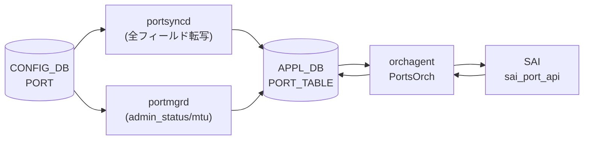

# APPL_DB PORT_TABLE

## 概要

`APPL_DB PORT_TABLE` は物理ポートの実効設定と運用状態を保持する [APPL_DB](../../reference/glossary.md#term-appl_db) テーブル。
CONFIG_DB `PORT` テーブルとは別物であり、以下の 3 つのプロセスが書き込む[^1][^2][^3]:

1. **portsyncd** — 起動時に CONFIG_DB `PORT` テーブルの全フィールドを APPL_DB に転写する
2. **portmgrd** — CONFIG_DB の変更を監視し、`admin_status` / `mtu` の変更を APPL_DB に反映する。初回書き込み時はコード由来のデフォルト値を補完する
3. **orchagent (PortsOrch)** — SAI から通知を受けた `oper_status` / `flap_count` / `last_up_time` / `last_down_time` を書き戻す



## key 構造

```text
PORT_TABLE:<port_name>
```

`<port_name>` は `Ethernet<N>` 形式の物理ポート名。

## フィールド一覧

| フィールド | 型 | 書き込み元 | デフォルト | 説明 |
|-----------|----|-----------|-----------|------|
| `admin_status` | `up`/`down` | portsyncd / portmgrd | `"down"` ※1 | 管理状態 |
| `mtu` | uint (68..9216) | portsyncd / portmgrd | `"9100"` ※2 | MTU [byte] |
| `speed` | uint [Mbps] | portsyncd | CONFIG_DB の値 | ポート速度 |
| `lanes` | string | portsyncd | CONFIG_DB の値 | ハードウェアレーン番号 |
| `alias` | string | portsyncd | CONFIG_DB の値 | ポート別名 |
| `index` | uint | portsyncd | CONFIG_DB の値 | フロントパネルポートインデックス |
| `description` | string | portsyncd | CONFIG_DB の値 | ユーザ定義説明 |
| `fec` | `rs`/`fc`/`none`/`auto` | portsyncd | CONFIG_DB の値 | FEC モード |
| `autoneg` | `on`/`off` | portsyncd | CONFIG_DB の値 | オートネゴシエーション |
| `link_training` | `on`/`off` | portsyncd | CONFIG_DB の値 | リンクトレーニング |
| `adv_speeds` | uint list | portsyncd | CONFIG_DB の値 | 広告速度 |
| `interface_type` | string | portsyncd | CONFIG_DB の値 | インタフェースタイプ |
| `pfc_asym` | `on`/`off` | portsyncd | CONFIG_DB の値 | 非対称 PFC |
| `tpid` | hex string | portsyncd | CONFIG_DB の値 | TPID |
| `subport` | uint | portsyncd | CONFIG_DB の値 | breakout サブポート番号 |
| `oper_status` | `up`/`down` | orchagent | `"down"` ※3 | 実効運用状態 |
| `flap_count` | uint64 | orchagent | (フラップ発生後) | ポートフラップ累積回数 |
| `last_down_time` | string (UTC) | orchagent | (フラップ発生後) | 最後に DOWN した時刻 |
| `last_up_time` | string (UTC) | orchagent | (フラップ発生後) | 最後に UP した時刻 |
| `system_oper_status` | `up`/`down` | orchagent | (Gearbox 環境のみ) | Gearbox system side oper status |
| `line_oper_status` | `up`/`down` | orchagent | (Gearbox 環境のみ) | Gearbox line side oper status |

> ※1, ※2, ※3 は「コード由来の暗黙デフォルト」参照

## 購読者

- **orchagent (PortsOrch)**: `PORT_TABLE` を `SubscriberStateTable` / `Table` で読み取り、SAI に反映する。PortsOrch は `PORT_TABLE` の oper_status / flap_count を書き戻す唯一のプロセス
- **linkmgrd**: `mux_cable` フラグを含むポートを検索するために読み込む
- 各種 orchs: IntfsOrch / BufferOrch 等が PORT_TABLE の `oper_status` 変化を受けて副次処理を実行

<!-- defaults -->
## コード由来の暗黙デフォルト (Phase A)

> **注記**: YANG `default` 指定がない APPL_DB フィールドでも、portmgrd / orchagent がコード内でデフォルト値を注入する。以下は実装精読から検出した暗黙デフォルトと挙動。

### admin_status

- **portmgr.h:14** `#define DEFAULT_ADMIN_STATUS_STR "down"` でハードコード
- portmgrd が初回 SET 時（ポートが `m_portList` に未登録）に CONFIG_DB に `admin_status` フィールドが存在しなければ `"down"` を APPL_DB に書き込む (`portmgr.cpp:175`)
- 初回 SET ではまず CONFIG_DB の値で上書きし、CONFIG_DB に値がない場合のみデフォルトが使われる (`portmgr.cpp:186-198`)
- portsyncd は CONFIG_DB PORT テーブルの `admin_status` をそのまま転写するが、CONFIG_DB に値がない場合は転写されない

**暗黙デフォルト**: `"down"` (portmgrd が CONFIG_DB に admin_status がないときに注入)

### mtu

- **portmgr.h:15** `#define DEFAULT_MTU_STR "9100"` でハードコード
- portmgrd 初回 SET 時に CONFIG_DB に `mtu` フィールドがなければ **"9100"** を APPL_DB に注入 (`portmgr.cpp:176`)
- port.h には `DEFAULT_MTU 1492` という別の定数も存在する。これは orchagent 内部の Port struct の初期値であり (`port.h:194`)、SAI デフォルト MTU (1514) から ethernet header/FCS 22 bytes を引いた値。APPL_DB に書かれる portmgrd のデフォルト `9100` とは別物であり混同に注意
- portmgrd が SAI に渡す際には `mtu` 値に 22 bytes を加算する (ethernet header + FCS 対応、portsorch 内)

**暗黙デフォルト**: `"9100"` (portmgrd fallback; CONFIG_DB に mtu フィールドがない場合)

### oper_status

- orchagent (PortsOrch) がポート初期化時に `m_portTable->hset(port.m_alias, "oper_status", "down")` を書き込む (`portsorch.cpp:6643`)
- SAI から port oper status 変化通知を受信したとき、`updateDbPortOperStatus()` が `"up"` または `"down"` に更新 (`portsorch.cpp:3928`)
- warmboot 時は `m_portTable->get()` で既存値を読み戻し、`"up"` なら `SAI_PORT_OPER_STATUS_UP` として m_oper_status を初期化 (`portsorch.cpp:6617-6647`)
- `SAI_PORT_OPER_STATUS_UNKNOWN` は `oper_status_strings` マップに定義されていないため、該当状態を受信すると `std::out_of_range` 例外が発生する可能性がある

**暗黙デフォルト**: `"down"` (orchagent がポート初期化時に書き込む値)

### flap_count

- Port struct の `m_flap_count = 0` が初期値 (`port.h:235`)
- フラップ発生前は APPL_DB に `flap_count` フィールドが存在しない
- ポートフラップ発生時に `updateDbPortFlapCount()` が累積カウンタを APPL_DB に書き込む (`portsorch.cpp:3867-3870`)
- warmboot 時は既存の flap_count を読み戻して継続 (`portsorch.cpp:6655-6656`)

**暗黙デフォルト**: 初期書き込みなし (フラップ発生後に初めて存在する)

### last_down_time / last_up_time

- `updateDbPortFlapCount()` 内でポートが DOWN/UP になった時刻を `"%a %b %d %H:%M:%S %Y"` (UTC) 形式で記録 (`portsorch.cpp:3878, 3887`)
- フラップ発生前は APPL_DB に該当フィールドが存在しない

**暗黙デフォルト**: 存在しない (フラップ初回発生で初期化)

### system_oper_status / line_oper_status (Gearbox 専用)

- `updateGearboxPortOperStatus()` が gearbox 環境 (`isGearboxEnabled()` が true) でのみ書き込む (`portsorch.cpp:11220-11261`)
- gearbox 未使用の通常環境では APPL_DB にこれらのフィールドは書かれない

**暗黙デフォルト**: gearbox 未使用時は存在しない

### speed / fec / lanes 等 (portsyncd パススルー)

- portsyncd は CONFIG_DB PORT テーブルの全フィールドを APPL_DB にそのままコピーする (`portsyncd.cpp:196-208`)
- `speed` / `fec` / `lanes` / `alias` 等のデフォルト値は CONFIG_DB 側 (sonic-port.yang / port_config.ini) が決定する
- orchagent の `updateDbPortOperSpeed()` / `updateDbPortOperFec()` は **STATE_DB** (m_portStateTable) に書くため APPL_DB の値は変わらない

**暗黙デフォルト**: CONFIG_DB の値をそのままパススルー

<!-- /defaults -->

<!-- side-effects -->
## 副次 DB 書込 (Phase F)

> **注記**: PortsOrch は APPL_DB `PORT_TABLE` を購読し、SAI を呼び出すと同時に複数の関連 DB に副次書き込みを行う。以下は `sonic-swss/orchagent/portsorch.cpp` の精読から検出した副次書込[^4]。詳細な操作行・コード行番号は [`meta/_intermediate/cdb-flow/appl-port-table-side.md`](https://github.com/aoki-taquan/sonic-unofficial-docs/blob/main/meta/_intermediate/cdb-flow/appl-port-table-side.md) を参照。

### 副次書込サマリ

| 副次書込先 DB | テーブル / キー | 書き込み内容 | 主なトリガ |
|---|---|---|---|
| STATE_DB | `PORT_TABLE:<alias>` | `supported_speeds`, `supported_fecs`, `host_tx_ready`, `speed`, `fec`, `rmt_adv_speeds`, `link_training_status`, `phy_ctrl_unreliable_los` | ポート初期化、admin/AN/LT 更新、SAI からの oper 通知 |
| STATE_DB | `BUFFER_MAX_PARAM_TABLE:<alias>` | `max_headroom_size`, `max_priority_groups`, `max_queues` | ポート初期化 (`addPort`) / 削除 (`deInitPort`) |
| APPL_DB | `PORT_TABLE:<alias>` (自テーブル書き戻し) | `oper_status`, `flap_count`, `last_up_time`, `last_down_time`, `system_oper_status`, `line_oper_status` | SAI port_oper_status_notification 受信時、warmboot 初期化、Gearbox port poll |
| COUNTERS_DB | `COUNTERS_PORT_NAME_MAP` / `COUNTERS_LAG_NAME_MAP` / `COUNTERS_SYSTEM_PORT_NAME_MAP` | `<alias> → <port OID>` マップ | `initializePort()`, `addLag()`, voq sysport 初期化 |
| COUNTERS_DB | `COUNTERS_QUEUE_NAME_MAP` / `COUNTERS_QUEUE_PORT_MAP` / `COUNTERS_QUEUE_INDEX_MAP` / `COUNTERS_QUEUE_TYPE_MAP` | queue OID → 名前 / port / index / type | `generateQueueMapPerPort()` |
| COUNTERS_DB | `COUNTERS_PG_NAME_MAP` / `COUNTERS_PG_PORT_MAP` / `COUNTERS_PG_INDEX_MAP` | priority group OID → 名前 / port / index | `generatePriorityGroupMapPerPort()` |
| COUNTERS_DB (gb) | `COUNTERS_PORT_NAME_MAP` (`COUNTERS_GB_DB`) | `<alias>_system` / `<alias>_line` → gb port OID | Gearbox 初期化 (Gearbox 環境のみ) |
| FLEX_COUNTER_DB | `PORT_STAT_COUNTER:<oid>` / `PORT_BUFFER_DROP_STAT:<oid>` / `PORT_SERDES_STAT_COUNTER:<serdes_oid>` / `QUEUE_STAT_COUNTER:<oid>` / `QUEUE_WATERMARK_STAT_COUNTER:<oid>` / `PG_WATERMARK_STAT_COUNTER:<oid>` / `PG_DROP_STAT_COUNTER:<oid>` / `WRED_ECN_QUEUE_STAT_COUNTER:<oid>` | flex counter ポーリング登録 (`COUNTER_ID_LIST` 等) | `FlexCounterOrch` で各 counter group が有効な場合、ポート / queue / PG 初期化時 |
| ASIC_DB | `ASIC_STATE:SAI_OBJECT_TYPE_PORT:<oid>` 等 | port / lag / queue / PG のオブジェクト属性 | SAI 呼び出し経由で syncd が書き込む (chain) |

### 主要な書込関数

- **`initPortSupportedSpeeds()`** / **`initPortCapFec()`** (`portsorch.cpp:3160-3173, 3300-3320`): SAI から取得した能力情報を STATE_DB `PORT_TABLE` に書く
- **`initHostTxReadyState()`** / **`setHostTxReady()`** (`portsorch.cpp:2186-2274`): admin_status の遷移に追従して STATE_DB に `host_tx_ready` を書く
- **`updateDbPortOperStatus()`** (`portsorch.cpp:3920-3930`): SAI からの oper status 通知を APPL_DB `PORT_TABLE` に書き戻す
- **`updateDbPortOperSpeed()`** / **`updateDbPortOperFec()`** (`portsorch.cpp:9850-9870`): 運用 speed/fec を STATE_DB `PORT_TABLE` に書き戻す（APPL_DB ではない点に注意）
- **`updateDbPortFlapCount()`** (`portsorch.cpp:3865-3890`): フラップ発生時に APPL_DB `PORT_TABLE` の `flap_count` / `last_up_time` / `last_down_time` を更新
- **`updateGearboxPortOperStatus()`** (`portsorch.cpp:11220-11260`): Gearbox system/line side oper を APPL_DB に書き戻し
- **`initializePort()` / `deInitPort()`** (`portsorch.cpp:4118, 4312`): COUNTERS_DB `COUNTERS_PORT_NAME_MAP` の登録／解除
- **`addLag()` / `removeLag()`** (`portsorch.cpp:8022, 8095`): COUNTERS_DB `COUNTERS_LAG_NAME_MAP` の登録／解除
- **`generateQueueMapPerPort()` / `generatePriorityGroupMapPerPort()`** (`portsorch.cpp:8749-8752, 8882-8884`): COUNTERS_DB の queue / PG マップ登録
- **`addQueueFlexCounters*` / `addPriorityGroupFlexCounters*` / `addWredQueueFlexCounters*`** (`portsorch.cpp:8730-8745, 8924-8938`): FLEX_COUNTER_DB へのポーリング登録

### スコープ外（書き込まない DB）

- **CONFIG_DB**: PortsOrch は APPL_DB consumer であり、CONFIG_DB へは書き込まない（CONFIG_DB 側は portmgrd / sonic-cfggen / db_migrator が書き込む）
- **ASIC_DB**: orchagent は SAI API を呼ぶだけで、ASIC_DB への直接書込は syncd が行う（SAI → syncd → ASIC_DB のチェーン）

<!-- /side-effects -->

<!-- ordering -->
## 書込み順依存 (Phase B)

`PortsOrch` は APPL_DB `PORT_TABLE` に対する一連の書込みを「`PortConfigDone` → bulk port create → 個別属性適用 → `PortInitDone`」の段階遷移として処理する。さらに speed / FEC / autoneg / interface_type など SAI が admin-up 中に変更を許さない属性については **admin-down 前置 → 属性適用 → admin-status restore** の 3 ステップを内部で再現する[^portorder]。

### 1. PortConfigDone → bulk create → PortInitDone の 3 段階遷移

portsyncd は CONFIG_DB の `PORT` テーブルを APPL_DB `PORT_TABLE` に転写するとき、以下の順で 3 種類のキーを書く:

1. `PORT_TABLE:<alias>` を全ポート分書く（並列可）
2. `PORT_TABLE:PortConfigDone` に `count` フィールドを書く (`portsorch.cpp:4345` で `m_portTable->hget("PortConfigDone","count",value)`)
3. `PORT_TABLE:PortInitDone` を書く (`portsorch.cpp:4613-4626`)

PortsOrch 側の挙動:

| イベント | 動作 | evidence |
|---|---|---|
| `PortConfigDone` 受信 | CONFIG_DB の `PORT` テーブルからレーンを集めて `addPortBulk()` + `initPortsBulk()` を一括実行、`m_portConfigState = PORT_CONFIG_DONE` に遷移 | `portsorch.cpp:4744-4752` |
| 個別 `PORT_TABLE:<alias>` (PortConfigDone 前) | `taskMap` に保留 (`continue`)、PortConfigDone 受信後に再評価 | `portsorch.cpp:4772-4777` |
| 個別 `PORT_TABLE:<alias>` (PortConfigDone 後) | breakout 等で追加されたポートを個別に `addPortBulk` で作成 | `portsorch.cpp:4754-4771` |
| `PortInitDone` 受信 | `addSystemPorts()` を 1 回だけ実行、`m_initDone = true` に遷移 | `portsorch.cpp:4613-4626` |

`isConfigDone()` (`PORT_CONFIG_DONE` 状態のみで判定) と `isInitDone()` (`m_initDone && m_pendingPortSet.empty()` の合算) は他 orch のゲートに使われる (`bufferorch.cpp:2079-2091` 等)。

順序違反は `taskMap` で永続保留されるため最終的には収束するが、PortConfigDone より前に `PortInitDone` を書くと `m_initDone` が立っても本ポート処理がまだ走らないため `isInitDone()` は `m_pendingPortSet` のせいで false のままになる。

### 2. gBufferOrch->isPortReady() ゲート (BUFFER_PG/QUEUE bind 完了が前提)

`portsorch.cpp:4779-4789`: 各ポートの本設定 (autoneg / speed / FEC / MTU / TPID / serdes / admin_status) に進む前に `gBufferOrch->isPortReady(alias)` を確認し、false なら `m_pendingPortSet.emplace(alias)` で保留する。BufferOrch 側 (`bufferorch.cpp:254-275`) は `BUFFER_PG` / `BUFFER_QUEUE` の SAI bind 完了で `m_ready_list[port]=true` に更新する。

→ **BUFFER_PG / BUFFER_QUEUE の SAI bind 完了 → PortsOrch のポート属性適用** の順序が硬い前提。違反時は当該ポートだけ `m_pendingPortSet` に積まれ続け、`isInitDone()` も false のまま後段全 orch が止まる。

### 3. speed / FEC / autoneg / interface_type / adv_speeds の admin-down 前置

SAI ベンダ実装はポートが admin up 中の属性変更を reject することがあるため、PortsOrch は次の属性について `setPortAdminStatus(p, false)` を内部で前置する:

| 属性 | admin-down 条件 | evidence |
|---|---|---|
| `autoneg` | `p.m_admin_state_up` (常時) | `portsorch.cpp:4824-4839` |
| `speed` | `p.m_admin_state_up && !p.m_autoneg` (autoneg OFF 時のみ) | `portsorch.cpp:5035-5050` |
| `adv_speeds` | `p.m_admin_state_up && p.m_autoneg` (autoneg ON 時のみ) | `portsorch.cpp:5084-5099` |
| `interface_type` | `p.m_admin_state_up && !p.m_autoneg` | `portsorch.cpp:5136-5151` |
| `adv_interface_types` | `p.m_admin_state_up && p.m_autoneg` | `portsorch.cpp:5207-5222` |
| `fec` | `p.m_admin_state_up` (常時) | `portsorch.cpp:5339-5354` |

属性適用完了後 `portsorch.cpp:5499-5511` の「`Last step set port admin status`」セクションで `admin_status` を元値に restore する (`Restore admin status if the port was brought down` コメント)。

→ 外部から見る APPL_DB `admin_status` フィールドは変化しないが、SAI レイヤでは一時的に DOWN を経由する。書込側は「admin_status と speed/FEC を同一 hset で投入してよい」「最終 admin_status は守られる」が契約。

### 4. setPortAdminStatus と STATE_DB host_tx_ready の同期順

`portsorch.cpp:2196-2256` の `setPortAdminStatus()`:

| 遷移方向 | host_tx_ready 書き込みタイミング | 行 |
|---|---|---|
| admin **down** (state=false) | SAI `SAI_PORT_ATTR_ADMIN_STATE` を叩く**前**に `setHostTxReady(port, "false")` | L2202 (コメント L2219 「Update the host_tx_ready to false before setting admin_state, when admin state is false」) |
| admin **up** (state=true) | SAI 呼び出し**成功後**に `setHostTxReady(port, "true")` | L2256 |
| SAI 失敗 (どの方向でも) | host_tx_ready を `"false"` に書き戻し | L2222, L2236, L2248 |

ポート初期化時 (L6723) と SAI からの host_tx_ready 通知 (L9724) でも同様に STATE_DB を更新する。

→ **admin down 方向は host_tx_ready の DOWN 反映が先**（光モジュール側 TX を止めてから admin を落とす）、**admin up 方向は SAI 成功確認後**（ハードのリンク準備完了後に host_tx_ready を立てる）。

### 5. warm reboot — APPL_DB スナップショットの完全性が必須

`portsorch.cpp:4338-4395` `bake()`: warm restart 起動時、PortsOrch は APPL_DB `PORT_TABLE` を以下の条件で検証する。

| 検証項目 | 失敗時 | evidence |
|---|---|---|
| `PortConfigDone:count` の存在 | `cleanPortTable()` で APPL_DB 一掃 → cold start fallback | `portsorch.cpp:4345, 4357-4361` |
| `PortInitDone` キーの存在 | 同上 | `portsorch.cpp:4350, 4357-4361` |
| `count` の値と APPL_DB のポートキー数 (`keys.size() - 2`) の一致 | invalid 扱い → cold start fallback | `portsorch.cpp:4364-4374` |

検証通過後、残った全ポートキーを `m_pendingPortSet` に積み (`portsorch.cpp:4376-4384`)、各ポートが BUFFER ready + 属性再適用を完了するまで `isInitDone()` は false のままになる。

oper_status / flap_count は warm 時に既存値を読み戻して継続する (`portsorch.cpp:6617-6647` / `6655-6656`)。`m_isWarmRestoreStage` (`portsorch.cpp:753` でコンストラクタ初期化、`6428` で `false` 化) を境にして cold path の `oper_status="down"` 初期書き込み (L6643) や `cleanPortTable()` (L4076) はスキップされる。

→ **portsyncd が `PortConfigDone` / `PortInitDone` / count 一致を APPL_DB に書き終えてから orchagent を再起動**。順序違反は即 cold start フォールバックで warmboot 失敗扱いになる。

### まとめ: 外部書込側の順序契約

| 順序 | 操作 | 違反時 |
|---|---|---|
| 1 | 全ポートの `PORT_TABLE:<alias>` を書く (順不同可) | `PortConfigDone` 前なら保留 |
| 2 | `PORT_TABLE:PortConfigDone` (`count`) を書く | `m_portConfigState` が上がらず保留が続く |
| 3 | BufferOrch が `BUFFER_PG` / `BUFFER_QUEUE` を SAI bind し `isPortReady=true` になる | ポート属性適用が `m_pendingPortSet` で保留 |
| 4 | `PORT_TABLE:PortInitDone` を書く | `m_initDone=false` のまま、後段全 orch が止まる |
| 5 | warmboot 時: APPL_DB に `PortConfigDone` / `PortInitDone` / count 一致を残してから orchagent 再起動 | `cleanPortTable()` で APPL_DB 全削除 → cold start fallback |

orchagent 内部では、admin-down 前置・属性適用・admin restore は `PortsOrch::doTask()` が自動再現するので、書込側は「admin_status と速度系属性を同時に書いてよい」「個別 hset で逐次投入してもよい」のいずれでも構わない。

### 詳細

行番号付きの完全スキャンノート・grep カバレッジは中間ファイル参照:

- `meta/_intermediate/cdb-flow/appl-port-table-ordering.md`

> **証跡**: `portsorch.cpp` の `m_portConfigState` / `PORT_CONFIG_DONE` (9 hit)、`m_initDone` / `PortInitDone` (5 hit)、`m_isWarmRestoreStage` / `WarmStart::isWarmStart` (3 hit)、`gBufferOrch->isPortReady` (1 hit)、`setPortAdminStatus(p, false)` を含む `Bring port down before applying` 系コメント (6 hit) を全件確認。

[^portorder]: orchagent portsorch.cpp (Phase B 順序依存): <https://github.com/sonic-net/sonic-swss/blob/4305596156d70e9797e8a881b3d19b46de0bce0d/orchagent/portsorch.cpp>

<!-- /ordering -->

<!-- failure -->
## 失敗・retry 分岐 (Phase D)

> **注記**: orchagent (PortsOrch) が APPL_DB `PORT_TABLE` を購読して SAI に反映する際、
> 入力値の不正や SAI 失敗を 3 系統 (`task_success` / `task_need_retry` / `task_failed`) で扱う。
> 詳細・コード行は [`meta/_intermediate/cdb-flow/appl-port-table-failure.md`](https://github.com/aoki-taquan/sonic-unofficial-docs/blob/main/meta/_intermediate/cdb-flow/appl-port-table-failure.md) を参照[^5]。

### 永久失敗 (タスクを erase、retry なし)

| 検出箇所 | 条件 | ログ |
|----------|------|------|
| `portsorch.cpp:5023` | `isSpeedSupported()==false` (STATE_DB `supported_speeds` リスト不一致) | `SWSS_LOG_ERROR("Unsupported port %s speed %u", ...)` |
| `portsorch.cpp:5317` | auto FEC 指定だが platform が `SAI_PORT_ATTR_AUTO_NEG_FEC_MODE_OVERRIDE` 非対応 | `SWSS_LOG_ERROR("Auto FEC mode is not supported")` |
| `portsorch.cpp:5323` | `isFecModeSupported()==false` (STATE_DB `supported_fecs` リスト不一致) | `SWSS_LOG_ERROR("Unsupported port %s FEC mode %s", ...)` |
| `portsorch.cpp:3715` | `setPortLinkTraining()` で `port.m_type != Port::PHY` | (`task_failed` を返す) |
| `setPort*()` 全般 | `handleSaiSetStatus()` が `task_failed` を返す (`SAI_STATUS_INSUFFICIENT_RESOURCES` 系以外の SAI エラー) | `SWSS_LOG_ERROR("Failed to set port %s ..., ...")` |

- いずれも `doPortTask()` 側で `it = taskMap.erase(it); continue;` され、再試行されない
- APPL_DB `PORT_TABLE:<alias>` 上のフィールドはそのまま残る一方、Port struct / SAI には反映されないため **APPL_DB と SAI の値が乖離** する状態が発生し得る

### 一時失敗 (タスクを残し次回 `doTask()` で retry)

| 検出箇所 | 条件 | 動作 |
|----------|------|------|
| `portsorch.cpp:5038, 5087, 5139, 5210, 5342` | speed / adv_speeds / interface_type / adv_interface_types / fec 変更前に `setPortAdminStatus(p, false)` が失敗 | `it++; continue;` で retry |
| `portsorch.cpp:5362` | `setPortFec()` が `bool false` を返す (SAI `set_port_attribute(FEC_MODE)` 失敗) | `it++; continue;` で retry |
| `setPort*()` 全般 | `handleSaiSetStatus()` が `task_need_retry` (`SAI_STATUS_INSUFFICIENT_RESOURCES` / `TABLE_FULL` / `NO_MEMORY` / `NV_STORAGE_FULL`) を返す | `it++; continue;` で retry |

### admin transition (内部副作用)

speed / adv_speeds / interface_type / adv_interface_types / fec を変更する際、
ポートが admin up かつ条件 (autoneg off など) を満たすと PortsOrch は一旦 admin を DOWN にし、属性変更後に元の admin 状態を復元する設計だが、復元処理は別のタスクサイクル
(`m_portList[p.m_alias] = p` で `m_admin_state_up = false` を記録) に委ねられる。
このため変更途中で orchagent がクラッシュ・再起動すると、APPL_DB は admin up のまま実 SAI ポートは admin down に取り残される可能性がある。

### oper / flap 系は失敗に非同期

`set_port_attribute` 失敗とは独立に、`updateDbPortOperStatus()` (`portsorch.cpp:3920-3930`)
および `updateDbPortFlapCount()` (`portsorch.cpp:3865-3890`) は SAI からの
`port_oper_status_notification` で APPL_DB の `oper_status` / `flap_count` /
`last_up_time` / `last_down_time` を更新し続ける。すなわち管理面 (admin/speed/fec) の
SET が失敗してもデータ面の運用表示は最新値を反映する。

<!-- /failure -->

## CONFIG_DB PORT との対応

| 側面 | CONFIG_DB PORT | APPL_DB PORT_TABLE |
|------|---------------|-------------------|
| 書き込み元 | CLI / sonic-cfggen / db_migrator | portsyncd / portmgrd / orchagent |
| 主な用途 | 設定の永続化 | orchagent への設定伝達 + 運用状態の公開 |
| oper_status | なし | あり (orchagent が SAI から書き戻す) |
| flap_count | なし | あり (orchagent が書き込む) |
| last_up/down_time | なし | あり (orchagent が書き込む) |

## 確認コマンド

```bash
# APPL_DB PORT_TABLE を直接参照
sonic-db-cli APPL_DB hgetall 'PORT_TABLE:Ethernet0'

# 全ポートの oper_status を確認
show interfaces status

# APPL_DB と CONFIG_DB の差分確認
sonic-db-cli APPL_DB hget 'PORT_TABLE:Ethernet0' oper_status
sonic-db-cli CONFIG_DB hget 'PORT|Ethernet0' admin_status
```

## 関連リファレンス

- CONFIG_DB: [`PORT テーブル`](./port.md)
- CLI: `show interfaces status`、`config interface`

## 引用元

[^1]: portsyncd portsyncd.cpp: <https://github.com/sonic-net/sonic-swss/blob/4305596156d70e9797e8a881b3d19b46de0bce0d/portsyncd/portsyncd.cpp>
[^2]: portmgrd portmgr.h, portmgr.cpp: <https://github.com/sonic-net/sonic-swss/blob/4305596156d70e9797e8a881b3d19b46de0bce0d/cfgmgr/portmgr.h>
[^3]: orchagent portsorch.cpp: <https://github.com/sonic-net/sonic-swss/blob/4305596156d70e9797e8a881b3d19b46de0bce0d/orchagent/portsorch.cpp>
[^4]: orchagent portsorch.cpp (副次 DB 書込): <https://github.com/sonic-net/sonic-swss/blob/4305596156d70e9797e8a881b3d19b46de0bce0d/orchagent/portsorch.cpp> および <https://github.com/sonic-net/sonic-swss-common/blob/158de8d3463ff4b841653f6d57190bb142b80d9c/common/schema.h>
[^5]: orchagent portsorch.cpp `doPortTask()` / `setPort*` 系失敗分岐 (Phase D): <https://github.com/sonic-net/sonic-swss/blob/4305596156d70e9797e8a881b3d19b46de0bce0d/orchagent/portsorch.cpp> および `handleSaiSetStatus()`: <https://github.com/sonic-net/sonic-swss/blob/4305596156d70e9797e8a881b3d19b46de0bce0d/orchagent/saihelper.cpp>
