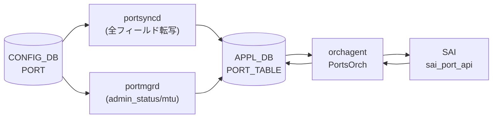

# APPL_DB PORT_TABLE

## 概要

`APPL_DB PORT_TABLE` は物理ポートの実効設定と運用状態を保持する [APPL_DB](../../reference/glossary.md#term-appl_db) テーブル。
CONFIG_DB `PORT` テーブルとは別物であり、以下の 3 つのプロセスが書き込む[^1][^2][^3]:

1. **portsyncd** — 起動時に CONFIG_DB `PORT` テーブルの全フィールドを APPL_DB に転写する
2. **portmgrd** — CONFIG_DB の変更を監視し、`admin_status` / `mtu` の変更を APPL_DB に反映する。初回書き込み時はコード由来のデフォルト値を補完する
3. **orchagent (PortsOrch)** — SAI から通知を受けた `oper_status` / `flap_count` / `last_up_time` / `last_down_time` を書き戻す



## key 構造

```text
PORT_TABLE:<port_name>
```

`<port_name>` は `Ethernet<N>` 形式の物理ポート名。

## フィールド一覧

| フィールド | 型 | 書き込み元 | デフォルト | 説明 |
|-----------|----|-----------|-----------|------|
| `admin_status` | `up`/`down` | portsyncd / portmgrd | `"down"` ※1 | 管理状態 |
| `mtu` | uint (68..9216) | portsyncd / portmgrd | `"9100"` ※2 | MTU [byte] |
| `speed` | uint [Mbps] | portsyncd | CONFIG_DB の値 | ポート速度 |
| `lanes` | string | portsyncd | CONFIG_DB の値 | ハードウェアレーン番号 |
| `alias` | string | portsyncd | CONFIG_DB の値 | ポート別名 |
| `index` | uint | portsyncd | CONFIG_DB の値 | フロントパネルポートインデックス |
| `description` | string | portsyncd | CONFIG_DB の値 | ユーザ定義説明 |
| `fec` | `rs`/`fc`/`none`/`auto` | portsyncd | CONFIG_DB の値 | FEC モード |
| `autoneg` | `on`/`off` | portsyncd | CONFIG_DB の値 | オートネゴシエーション |
| `link_training` | `on`/`off` | portsyncd | CONFIG_DB の値 | リンクトレーニング |
| `adv_speeds` | uint list | portsyncd | CONFIG_DB の値 | 広告速度 |
| `interface_type` | string | portsyncd | CONFIG_DB の値 | インタフェースタイプ |
| `pfc_asym` | `on`/`off` | portsyncd | CONFIG_DB の値 | 非対称 PFC |
| `tpid` | hex string | portsyncd | CONFIG_DB の値 | TPID |
| `subport` | uint | portsyncd | CONFIG_DB の値 | breakout サブポート番号 |
| `oper_status` | `up`/`down` | orchagent | `"down"` ※3 | 実効運用状態 |
| `flap_count` | uint64 | orchagent | (フラップ発生後) | ポートフラップ累積回数 |
| `last_down_time` | string (UTC) | orchagent | (フラップ発生後) | 最後に DOWN した時刻 |
| `last_up_time` | string (UTC) | orchagent | (フラップ発生後) | 最後に UP した時刻 |
| `system_oper_status` | `up`/`down` | orchagent | (Gearbox 環境のみ) | Gearbox system side oper status |
| `line_oper_status` | `up`/`down` | orchagent | (Gearbox 環境のみ) | Gearbox line side oper status |

> ※1, ※2, ※3 は「コード由来の暗黙デフォルト」参照

## 購読者

- **orchagent (PortsOrch)**: `PORT_TABLE` を `SubscriberStateTable` / `Table` で読み取り、SAI に反映する。PortsOrch は `PORT_TABLE` の oper_status / flap_count を書き戻す唯一のプロセス
- **linkmgrd**: `mux_cable` フラグを含むポートを検索するために読み込む
- 各種 orchs: IntfsOrch / BufferOrch 等が PORT_TABLE の `oper_status` 変化を受けて副次処理を実行

<!-- defaults -->
## コード由来の暗黙デフォルト (Phase A)

> **注記**: YANG `default` 指定がない APPL_DB フィールドでも、portmgrd / orchagent がコード内でデフォルト値を注入する。以下は実装精読から検出した暗黙デフォルトと挙動。

### admin_status

- **portmgr.h:14** `#define DEFAULT_ADMIN_STATUS_STR "down"` でハードコード
- portmgrd が初回 SET 時（ポートが `m_portList` に未登録）に CONFIG_DB に `admin_status` フィールドが存在しなければ `"down"` を APPL_DB に書き込む (`portmgr.cpp:175`)
- 初回 SET ではまず CONFIG_DB の値で上書きし、CONFIG_DB に値がない場合のみデフォルトが使われる (`portmgr.cpp:186-198`)
- portsyncd は CONFIG_DB PORT テーブルの `admin_status` をそのまま転写するが、CONFIG_DB に値がない場合は転写されない

**暗黙デフォルト**: `"down"` (portmgrd が CONFIG_DB に admin_status がないときに注入)

### mtu

- **portmgr.h:15** `#define DEFAULT_MTU_STR "9100"` でハードコード
- portmgrd 初回 SET 時に CONFIG_DB に `mtu` フィールドがなければ **"9100"** を APPL_DB に注入 (`portmgr.cpp:176`)
- port.h には `DEFAULT_MTU 1492` という別の定数も存在する。これは orchagent 内部の Port struct の初期値であり (`port.h:194`)、SAI デフォルト MTU (1514) から ethernet header/FCS 22 bytes を引いた値。APPL_DB に書かれる portmgrd のデフォルト `9100` とは別物であり混同に注意
- portmgrd が SAI に渡す際には `mtu` 値に 22 bytes を加算する (ethernet header + FCS 対応、portsorch 内)

**暗黙デフォルト**: `"9100"` (portmgrd fallback; CONFIG_DB に mtu フィールドがない場合)

### oper_status

- orchagent (PortsOrch) がポート初期化時に `m_portTable->hset(port.m_alias, "oper_status", "down")` を書き込む (`portsorch.cpp:6643`)
- SAI から port oper status 変化通知を受信したとき、`updateDbPortOperStatus()` が `"up"` または `"down"` に更新 (`portsorch.cpp:3928`)
- warmboot 時は `m_portTable->get()` で既存値を読み戻し、`"up"` なら `SAI_PORT_OPER_STATUS_UP` として m_oper_status を初期化 (`portsorch.cpp:6617-6647`)
- `SAI_PORT_OPER_STATUS_UNKNOWN` は `oper_status_strings` マップに定義されていないため、該当状態を受信すると `std::out_of_range` 例外が発生する可能性がある

**暗黙デフォルト**: `"down"` (orchagent がポート初期化時に書き込む値)

### flap_count

- Port struct の `m_flap_count = 0` が初期値 (`port.h:235`)
- フラップ発生前は APPL_DB に `flap_count` フィールドが存在しない
- ポートフラップ発生時に `updateDbPortFlapCount()` が累積カウンタを APPL_DB に書き込む (`portsorch.cpp:3867-3870`)
- warmboot 時は既存の flap_count を読み戻して継続 (`portsorch.cpp:6655-6656`)

**暗黙デフォルト**: 初期書き込みなし (フラップ発生後に初めて存在する)

### last_down_time / last_up_time

- `updateDbPortFlapCount()` 内でポートが DOWN/UP になった時刻を `"%a %b %d %H:%M:%S %Y"` (UTC) 形式で記録 (`portsorch.cpp:3878, 3887`)
- フラップ発生前は APPL_DB に該当フィールドが存在しない

**暗黙デフォルト**: 存在しない (フラップ初回発生で初期化)

### system_oper_status / line_oper_status (Gearbox 専用)

- `updateGearboxPortOperStatus()` が gearbox 環境 (`isGearboxEnabled()` が true) でのみ書き込む (`portsorch.cpp:11220-11261`)
- gearbox 未使用の通常環境では APPL_DB にこれらのフィールドは書かれない

**暗黙デフォルト**: gearbox 未使用時は存在しない

### speed / fec / lanes 等 (portsyncd パススルー)

- portsyncd は CONFIG_DB PORT テーブルの全フィールドを APPL_DB にそのままコピーする (`portsyncd.cpp:196-208`)
- `speed` / `fec` / `lanes` / `alias` 等のデフォルト値は CONFIG_DB 側 (sonic-port.yang / port_config.ini) が決定する
- orchagent の `updateDbPortOperSpeed()` / `updateDbPortOperFec()` は **STATE_DB** (m_portStateTable) に書くため APPL_DB の値は変わらない

**暗黙デフォルト**: CONFIG_DB の値をそのままパススルー

<!-- /defaults -->

<!-- side-effects -->
## 副次 DB 書込 (Phase F)

> **注記**: PortsOrch は APPL_DB `PORT_TABLE` を購読し、SAI を呼び出すと同時に複数の関連 DB に副次書き込みを行う。以下は `sonic-swss/orchagent/portsorch.cpp` の精読から検出した副次書込[^4]。詳細な操作行・コード行番号は [`meta/_intermediate/cdb-flow/appl-port-table-side.md`](https://github.com/aoki-taquan/sonic-unofficial-docs/blob/main/meta/_intermediate/cdb-flow/appl-port-table-side.md) を参照。

### 副次書込サマリ

| 副次書込先 DB | テーブル / キー | 書き込み内容 | 主なトリガ |
|---|---|---|---|
| STATE_DB | `PORT_TABLE:<alias>` | `supported_speeds`, `supported_fecs`, `host_tx_ready`, `speed`, `fec`, `rmt_adv_speeds`, `link_training_status`, `phy_ctrl_unreliable_los` | ポート初期化、admin/AN/LT 更新、SAI からの oper 通知 |
| STATE_DB | `BUFFER_MAX_PARAM_TABLE:<alias>` | `max_headroom_size`, `max_priority_groups`, `max_queues` | ポート初期化 (`addPort`) / 削除 (`deInitPort`) |
| APPL_DB | `PORT_TABLE:<alias>` (自テーブル書き戻し) | `oper_status`, `flap_count`, `last_up_time`, `last_down_time`, `system_oper_status`, `line_oper_status` | SAI port_oper_status_notification 受信時、warmboot 初期化、Gearbox port poll |
| COUNTERS_DB | `COUNTERS_PORT_NAME_MAP` / `COUNTERS_LAG_NAME_MAP` / `COUNTERS_SYSTEM_PORT_NAME_MAP` | `<alias> → <port OID>` マップ | `initializePort()`, `addLag()`, voq sysport 初期化 |
| COUNTERS_DB | `COUNTERS_QUEUE_NAME_MAP` / `COUNTERS_QUEUE_PORT_MAP` / `COUNTERS_QUEUE_INDEX_MAP` / `COUNTERS_QUEUE_TYPE_MAP` | queue OID → 名前 / port / index / type | `generateQueueMapPerPort()` |
| COUNTERS_DB | `COUNTERS_PG_NAME_MAP` / `COUNTERS_PG_PORT_MAP` / `COUNTERS_PG_INDEX_MAP` | priority group OID → 名前 / port / index | `generatePriorityGroupMapPerPort()` |
| COUNTERS_DB (gb) | `COUNTERS_PORT_NAME_MAP` (`COUNTERS_GB_DB`) | `<alias>_system` / `<alias>_line` → gb port OID | Gearbox 初期化 (Gearbox 環境のみ) |
| FLEX_COUNTER_DB | `PORT_STAT_COUNTER:<oid>` / `PORT_BUFFER_DROP_STAT:<oid>` / `PORT_SERDES_STAT_COUNTER:<serdes_oid>` / `QUEUE_STAT_COUNTER:<oid>` / `QUEUE_WATERMARK_STAT_COUNTER:<oid>` / `PG_WATERMARK_STAT_COUNTER:<oid>` / `PG_DROP_STAT_COUNTER:<oid>` / `WRED_ECN_QUEUE_STAT_COUNTER:<oid>` | flex counter ポーリング登録 (`COUNTER_ID_LIST` 等) | `FlexCounterOrch` で各 counter group が有効な場合、ポート / queue / PG 初期化時 |
| ASIC_DB | `ASIC_STATE:SAI_OBJECT_TYPE_PORT:<oid>` 等 | port / lag / queue / PG のオブジェクト属性 | SAI 呼び出し経由で syncd が書き込む (chain) |

### 主要な書込関数

- **`initPortSupportedSpeeds()`** / **`initPortCapFec()`** (`portsorch.cpp:3160-3173, 3300-3320`): SAI から取得した能力情報を STATE_DB `PORT_TABLE` に書く
- **`initHostTxReadyState()`** / **`setHostTxReady()`** (`portsorch.cpp:2186-2274`): admin_status の遷移に追従して STATE_DB に `host_tx_ready` を書く
- **`updateDbPortOperStatus()`** (`portsorch.cpp:3920-3930`): SAI からの oper status 通知を APPL_DB `PORT_TABLE` に書き戻す
- **`updateDbPortOperSpeed()`** / **`updateDbPortOperFec()`** (`portsorch.cpp:9850-9870`): 運用 speed/fec を STATE_DB `PORT_TABLE` に書き戻す（APPL_DB ではない点に注意）
- **`updateDbPortFlapCount()`** (`portsorch.cpp:3865-3890`): フラップ発生時に APPL_DB `PORT_TABLE` の `flap_count` / `last_up_time` / `last_down_time` を更新
- **`updateGearboxPortOperStatus()`** (`portsorch.cpp:11220-11260`): Gearbox system/line side oper を APPL_DB に書き戻し
- **`initializePort()` / `deInitPort()`** (`portsorch.cpp:4118, 4312`): COUNTERS_DB `COUNTERS_PORT_NAME_MAP` の登録／解除
- **`addLag()` / `removeLag()`** (`portsorch.cpp:8022, 8095`): COUNTERS_DB `COUNTERS_LAG_NAME_MAP` の登録／解除
- **`generateQueueMapPerPort()` / `generatePriorityGroupMapPerPort()`** (`portsorch.cpp:8749-8752, 8882-8884`): COUNTERS_DB の queue / PG マップ登録
- **`addQueueFlexCounters*` / `addPriorityGroupFlexCounters*` / `addWredQueueFlexCounters*`** (`portsorch.cpp:8730-8745, 8924-8938`): FLEX_COUNTER_DB へのポーリング登録

### スコープ外（書き込まない DB）

- **CONFIG_DB**: PortsOrch は APPL_DB consumer であり、CONFIG_DB へは書き込まない（CONFIG_DB 側は portmgrd / sonic-cfggen / db_migrator が書き込む）
- **ASIC_DB**: orchagent は SAI API を呼ぶだけで、ASIC_DB への直接書込は syncd が行う（SAI → syncd → ASIC_DB のチェーン）

<!-- /side-effects -->

## CONFIG_DB PORT との対応

| 側面 | CONFIG_DB PORT | APPL_DB PORT_TABLE |
|------|---------------|-------------------|
| 書き込み元 | CLI / sonic-cfggen / db_migrator | portsyncd / portmgrd / orchagent |
| 主な用途 | 設定の永続化 | orchagent への設定伝達 + 運用状態の公開 |
| oper_status | なし | あり (orchagent が SAI から書き戻す) |
| flap_count | なし | あり (orchagent が書き込む) |
| last_up/down_time | なし | あり (orchagent が書き込む) |

## 確認コマンド

```bash
# APPL_DB PORT_TABLE を直接参照
sonic-db-cli APPL_DB hgetall 'PORT_TABLE:Ethernet0'

# 全ポートの oper_status を確認
show interfaces status

# APPL_DB と CONFIG_DB の差分確認
sonic-db-cli APPL_DB hget 'PORT_TABLE:Ethernet0' oper_status
sonic-db-cli CONFIG_DB hget 'PORT|Ethernet0' admin_status
```

## 関連リファレンス

- CONFIG_DB: [`PORT テーブル`](./port.md)
- CLI: `show interfaces status`、`config interface`

## 引用元

[^1]: portsyncd portsyncd.cpp: <https://github.com/sonic-net/sonic-swss/blob/4305596156d70e9797e8a881b3d19b46de0bce0d/portsyncd/portsyncd.cpp>
[^2]: portmgrd portmgr.h, portmgr.cpp: <https://github.com/sonic-net/sonic-swss/blob/4305596156d70e9797e8a881b3d19b46de0bce0d/cfgmgr/portmgr.h>
[^3]: orchagent portsorch.cpp: <https://github.com/sonic-net/sonic-swss/blob/4305596156d70e9797e8a881b3d19b46de0bce0d/orchagent/portsorch.cpp>
[^4]: orchagent portsorch.cpp (副次 DB 書込): <https://github.com/sonic-net/sonic-swss/blob/4305596156d70e9797e8a881b3d19b46de0bce0d/orchagent/portsorch.cpp> および <https://github.com/sonic-net/sonic-swss-common/blob/158de8d3463ff4b841653f6d57190bb142b80d9c/common/schema.h>
