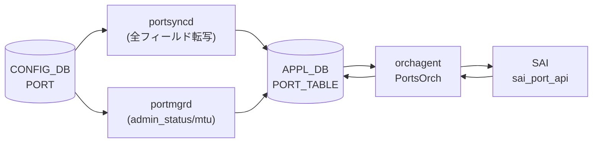
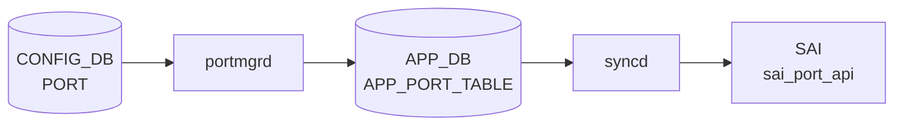

# APPL_DB PORT_TABLE

## 概要

`APPL_DB PORT_TABLE` は物理ポートの実効設定と運用状態を保持する [APPL_DB](../../reference/glossary.md#term-appl_db) テーブル。
[CONFIG_DB](../../reference/glossary.md#term-config_db) `PORT` テーブルとは別物であり、以下の 3 つのプロセスが書き込む[^1][^2][^3]:

1. **[portsyncd](../../reference/glossary.md#term-portsyncd)** — 起動時に [CONFIG_DB](../../reference/glossary.md#term-config_db) `PORT` テーブルの全フィールドを [APPL_DB](../../reference/glossary.md#term-appl_db) に転写する
2. **[portmgrd](../../reference/glossary.md#term-portmgrd)** — [CONFIG_DB](../../reference/glossary.md#term-config_db) の変更を監視し、`admin_status` / `mtu` の変更を [APPL_DB](../../reference/glossary.md#term-appl_db) に反映する。初回書き込み時はコード由来のデフォルト値を補完する
3. **[orchagent](../../reference/glossary.md#term-orchagent) (PortsOrch)** — [SAI](../../reference/glossary.md#term-sai) から通知を受けた `oper_status` / `flap_count` / `last_up_time` / `last_down_time` を書き戻す



<!-- cdb-mermaid -->
### データフロー (自動生成)



!!! note "凡例"
    CONFIG_DB から SAI までの典型経路を `docs/reference/config-db-orch-map.md` から機械生成したミニ図。詳細・例外は本ページ本文と対応表を参照。
<!-- /cdb-mermaid -->

## key 構造

```text
PORT_TABLE:<port_name>
```

`<port_name>` は `Ethernet<N>` 形式の物理ポート名。

## フィールド一覧

| フィールド | 型 | 書き込み元 | デフォルト | 説明 |
|-----------|----|-----------|-----------|------|
| `admin_status` | `up`/`down` | [portsyncd](../../reference/glossary.md#term-portsyncd) / [portmgrd](../../reference/glossary.md#term-portmgrd) | `"down"` ※1 | 管理状態 |
| `mtu` | uint (68..9216) | [portsyncd](../../reference/glossary.md#term-portsyncd) / [portmgrd](../../reference/glossary.md#term-portmgrd) | `"9100"` ※2 | MTU [byte] |
| `speed` | uint [Mbps] | portsyncd | CONFIG_DB の値 | ポート速度 |
| `lanes` | string | portsyncd | CONFIG_DB の値 | ハードウェアレーン番号 |
| `alias` | string | portsyncd | CONFIG_DB の値 | ポート別名 |
| `index` | uint | portsyncd | CONFIG_DB の値 | フロントパネルポートインデックス |
| `description` | string | portsyncd | CONFIG_DB の値 | ユーザ定義説明 |
| `fec` | `rs`/`fc`/`none`/`auto` | portsyncd | CONFIG_DB の値 | FEC モード |
| `autoneg` | `on`/`off` | portsyncd | CONFIG_DB の値 | オートネゴシエーション |
| `link_training` | `on`/`off` | portsyncd | CONFIG_DB の値 | リンクトレーニング |
| `adv_speeds` | uint list | portsyncd | CONFIG_DB の値 | 広告速度 |
| `interface_type` | string | portsyncd | CONFIG_DB の値 | インタフェースタイプ |
| `pfc_asym` | `on`/`off` | portsyncd | CONFIG_DB の値 | 非対称 [PFC](../../reference/glossary.md#term-pfc) |
| `tpid` | hex string | portsyncd | CONFIG_DB の値 | TPID |
| `subport` | uint | portsyncd | CONFIG_DB の値 | breakout サブポート番号 |
| `oper_status` | `up`/`down` | [orchagent](../../reference/glossary.md#term-orchagent) | `"down"` ※3 | 実効運用状態 |
| `flap_count` | uint64 | [orchagent](../../reference/glossary.md#term-orchagent) | (フラップ発生後) | ポートフラップ累積回数 |
| `last_down_time` | string (UTC) | orchagent | (フラップ発生後) | 最後に DOWN した時刻 |
| `last_up_time` | string (UTC) | orchagent | (フラップ発生後) | 最後に UP した時刻 |
| `system_oper_status` | `up`/`down` | orchagent | (Gearbox 環境のみ) | Gearbox system side oper status |
| `line_oper_status` | `up`/`down` | orchagent | (Gearbox 環境のみ) | Gearbox line side oper status |

> ※1, ※2, ※3 は「コード由来の暗黙デフォルト」参照

## 購読者

- **orchagent (PortsOrch)**: `PORT_TABLE` を `SubscriberStateTable` / `Table` で読み取り、[SAI](../../reference/glossary.md#term-sai) に反映する。PortsOrch は `PORT_TABLE` の oper_status / flap_count を書き戻す唯一のプロセス
- **[linkmgrd](../../reference/glossary.md#term-linkmgrd)**: `mux_cable` フラグを含むポートを検索するために読み込む
- 各種 orchs: IntfsOrch / BufferOrch 等が PORT_TABLE の `oper_status` 変化を受けて副次処理を実行

<!-- defaults -->
## コード由来の暗黙デフォルト (Phase A)

> **注記**: [YANG](../../reference/glossary.md#term-yang) `default` 指定がない APPL_DB フィールドでも、portmgrd / orchagent がコード内でデフォルト値を注入する。以下は実装精読から検出した暗黙デフォルトと挙動。

### admin_status

- **portmgr.h:14** `#define DEFAULT_ADMIN_STATUS_STR "down"` でハードコード
- portmgrd が初回 SET 時（ポートが `m_portList` に未登録）に CONFIG_DB に `admin_status` フィールドが存在しなければ `"down"` を APPL_DB に書き込む (`portmgr.cpp:175`)
- 初回 SET ではまず CONFIG_DB の値で上書きし、CONFIG_DB に値がない場合のみデフォルトが使われる (`portmgr.cpp:186-198`)
- portsyncd は CONFIG_DB PORT テーブルの `admin_status` をそのまま転写するが、CONFIG_DB に値がない場合は転写されない

**暗黙デフォルト**: `"down"` (portmgrd が CONFIG_DB に admin_status がないときに注入)

### mtu

- **portmgr.h:15** `#define DEFAULT_MTU_STR "9100"` でハードコード
- portmgrd 初回 SET 時に CONFIG_DB に `mtu` フィールドがなければ **"9100"** を APPL_DB に注入 (`portmgr.cpp:176`)
- port.h には `DEFAULT_MTU 1492` という別の定数も存在する。これは orchagent 内部の Port struct の初期値であり (`port.h:194`)、[SAI](../../reference/glossary.md#term-sai) デフォルト MTU (1514) から ethernet header/FCS 22 bytes を引いた値。APPL_DB に書かれる portmgrd のデフォルト `9100` とは別物であり混同に注意
- portmgrd が SAI に渡す際には `mtu` 値に 22 bytes を加算する (ethernet header + FCS 対応、portsorch 内)

**暗黙デフォルト**: `"9100"` (portmgrd fallback; CONFIG_DB に mtu フィールドがない場合)

### oper_status

- orchagent (PortsOrch) がポート初期化時に `m_portTable->hset(port.m_alias, "oper_status", "down")` を書き込む (`portsorch.cpp:6643`)
- SAI から port oper status 変化通知を受信したとき、`updateDbPortOperStatus()` が `"up"` または `"down"` に更新 (`portsorch.cpp:3928`)
- warmboot 時は `m_portTable->get()` で既存値を読み戻し、`"up"` なら `SAI_PORT_OPER_STATUS_UP` として m_oper_status を初期化 (`portsorch.cpp:6617-6647`)
- `SAI_PORT_OPER_STATUS_UNKNOWN` は `oper_status_strings` マップに定義されていないため、該当状態を受信すると `std::out_of_range` 例外が発生する可能性がある

**暗黙デフォルト**: `"down"` (orchagent がポート初期化時に書き込む値)

### flap_count

- Port struct の `m_flap_count = 0` が初期値 (`port.h:235`)
- フラップ発生前は APPL_DB に `flap_count` フィールドが存在しない
- ポートフラップ発生時に `updateDbPortFlapCount()` が累積カウンタを APPL_DB に書き込む (`portsorch.cpp:3867-3870`)
- warmboot 時は既存の flap_count を読み戻して継続 (`portsorch.cpp:6655-6656`)

**暗黙デフォルト**: 初期書き込みなし (フラップ発生後に初めて存在する)

### last_down_time / last_up_time

- `updateDbPortFlapCount()` 内でポートが DOWN/UP になった時刻を `"%a %b %d %H:%M:%S %Y"` (UTC) 形式で記録 (`portsorch.cpp:3878, 3887`)
- フラップ発生前は APPL_DB に該当フィールドが存在しない

**暗黙デフォルト**: 存在しない (フラップ初回発生で初期化)

### system_oper_status / line_oper_status (Gearbox 専用)

- `updateGearboxPortOperStatus()` が gearbox 環境 (`isGearboxEnabled()` が true) でのみ書き込む (`portsorch.cpp:11220-11261`)
- gearbox 未使用の通常環境では APPL_DB にこれらのフィールドは書かれない

**暗黙デフォルト**: gearbox 未使用時は存在しない

### speed / fec / lanes 等 (portsyncd パススルー)

- portsyncd は CONFIG_DB PORT テーブルの全フィールドを APPL_DB にそのままコピーする (`portsyncd.cpp:196-208`)
- `speed` / `fec` / `lanes` / `alias` 等のデフォルト値は CONFIG_DB 側 (sonic-port.yang / [port_config.ini](../../reference/glossary.md#term-port-config-ini)) が決定する
- orchagent の `updateDbPortOperSpeed()` / `updateDbPortOperFec()` は **[STATE_DB](../../reference/glossary.md#term-state_db)** (m_portStateTable) に書くため APPL_DB の値は変わらない

**暗黙デフォルト**: CONFIG_DB の値をそのままパススルー

<!-- /defaults -->

<!-- platform -->
## プラットフォーム差 (Phase H)

`APPL_DB PORT_TABLE` の **フィールド集合と書き込み挙動** は 3 つの軸でプラットフォーム/構成依存する: (1) SAI `sai_query_attribute_capability` の結果、(2) `device.metadata` の `switch_type` (`gMySwitchType`)、(3) `platform` 環境変数の Mellanox 判定。`speed` / `fec` 等のフィールド値そのものは portsyncd パススルーなので CONFIG_DB と同じだが、**SAI 適用可否・[STATE_DB](../../reference/glossary.md#term-state_db) 派生値・追加フィールド有無** が差分として現れる。

### 識別キー

| 識別 | 取得元 | 値の例 |
|------|--------|--------|
| `gMySwitchType` | `device.metadata` の `switch_type` (`portsorch.cpp:69`) | `"switch"` (既定) / `"voq"` ([VOQ](../../reference/glossary.md#term-voq) chassis) / `"dpu"` ([SmartSwitch](../../reference/glossary.md#term-smartswitch) [DPU](../../reference/glossary.md#term-dpu)) |
| `gMyAsicName` | namespace 名 (`portsorch.cpp:72`) | `"asic0"` `"asic1"` 等 (multi-asic / [VOQ](../../reference/glossary.md#term-voq)) |
| `platform` env | `getenv("platform")` (`portsorch.cpp:691`) | `"mellanox"` 部分一致で `isMlnxPlatform()` true |
| Gearbox 有無 | `gearbox_config.json` の有無 (`isGearboxEnabled()`) | line-side PHY 搭載 ASIC のみ true |

### SAI capability 差異一覧

| capability | 取得 | 結果 false 時の効果 | evidence |
|---|---|---|---|
| `SAI_PORT_ATTR_AUTO_NEG_FEC_MODE_OVERRIDE` | `sai_query_attribute_capability` (`portsorch.cpp:989-1000`) | `fec_override_sup = false` → autoneg fec override 反映なし | `portsorch.cpp:987, 989` |
| `SAI_PORT_ATTR_OPER_PORT_FEC_MODE` | `sai_query_attribute_capability` (`portsorch.cpp:1001-1010`) | `oper_fec_sup = false` → [STATE_DB](../../reference/glossary.md#term-state_db) に `oper_fec` 書かれず | `portsorch.cpp:1001` |
| `SAI_PORT_ATTR_SUPPORTED_SPEED` | `get_port_attribute` (`portsorch.cpp:3122-3158`) | `supported_speeds = ""` → STATE_DB 空 / speed バリデーション skip ("Unable to validate speed ... Not supported by platform" WARN) | `portsorch.cpp:3146` |
| `SAI_PORT_ATTR_SUPPORTED_FEC_MODE` | `get_port_attribute` (`portsorch.cpp:3225-3265`) | `m_portSupportedFecModes[...].supported = false` → `isFecModeSupported()` 常に true (FEC バリデーション無効化) | `portsorch.cpp:3245-3260` |
| `SAI_PORT_ATTR_SUPPORTED_AUTO_NEG_MODE` | `get_port_attribute` (`portsorch.cpp:3179-3196`) | `port.m_cap_an = 1` フォールバック (互換性維持コメントあり) | `portsorch.cpp:3189-3191` |
| `SAI_PORT_ATTR_SUPPORTED_LINK_TRAINING_MODE` | **照会されず** (TODO) | `m_cap_lt = 1` 固定 → 非対応 ASIC で `link_training` を投げると SAI エラー | `portsorch.cpp:3197-3205` |

### `gMySwitchType` 別挙動

| 軸 | `switch` (既定) | `voq` ([VOQ](../../reference/glossary.md#term-voq) chassis) | `dpu` |
|----|----------------|---------------------|-------|
| FEC override / oper FEC capability 照会 | yes | yes | **no** (`portsorch.cpp:987`) |
| `initializePortBufferMaximumParameters` | yes | yes | **no** (`portsorch.cpp:6449`) |
| default [VLAN](../../reference/glossary.md#term-vlan) / bridge port 削除 | no | **yes** (`portsorch.cpp:1496-1499`) | no |
| `system_lag_alias = host\|asic\|lag` キー形式 | no | **yes** (`portsorch.cpp:7972`) | no |
| `voqSyncAddLag` / `voqSyncDelLag` / `voqSyncLagMember` | no | **yes** (`portsorch.cpp:8039, 8116, 8213, 8261`) | no |
| `SYSTEM_PORT_ATTR_QOS_NUMBER_OF_VOQS` 取得 | no | **yes** (`portsorch.cpp:6543-6580`) | no |
| VOQ queue counter 強制 enable | no | **yes** (`portsorch.cpp:8485, 8510`) | no |
| `gIntfsOrch->voqSyncIntfState` で asic 跨ぎ intf 状態同期 | no | **yes** (`portsorch.cpp:9841`) | no |

### multi-asic / VOQ chassis での APPL_DB 配置

`APPL_DB PORT_TABLE` は **各 asic namespace の独立した APPL_DB** に書かれる。chassis 全体で port を一覧する集約テーブルは APPL_DB には存在しない（必要なら `CHASSIS_APP_DB` を別経路で参照）。VOQ chassis のみ `system_lag` / `SYSTEM_PORT` を経由して asic 間 [LAG](../../reference/glossary.md#term-lag) / 状態同期が走り、[LAG](../../reference/glossary.md#term-lag) alias key が `"<hostname>|<asicname>|<lag>"` 形式に変わる。

### Mellanox 固有分岐

`isMlnxPlatform()` (`portsorch.cpp:689-704`) は `getenv("platform")` を `"mellanox"` で `strstr` 判定。`portsorch.cpp:6362-6379` のコメント「distribution-only mode is not supported on Mellanox platform」に従い、[LAG](../../reference/glossary.md#term-lag) member の collection / distribution toggle 順序を強制する。`PORT_TABLE` 自体のフィールド集合は不変だが、LAG メンバー化時の APPL_DB 遷移順序が変わる。

### Gearbox 専用フィールド

`system_oper_status` / `line_oper_status` は `isGearboxEnabled()` true の環境（line-side PHY 搭載 ASIC）でのみ書かれる。詳細は上記 Phase A 「コード由来の暗黙デフォルト」セクション参照。

!!! warning "DPU では FEC override / oper FEC が照会されない"
    `gMySwitchType == "dpu"` の環境では `SAI_PORT_ATTR_AUTO_NEG_FEC_MODE_OVERRIDE` / `SAI_PORT_ATTR_OPER_PORT_FEC_MODE` を一切照会しない (`portsorch.cpp:987`)。STATE_DB の `oper_fec` は空のまま、CONFIG_DB に `fec` を設定しても autoneg override 経路は動かない。

!!! warning "LT capability の固定値フォールバック"
    `initPortCapLinkTraining()` は SAI 照会を実装しておらず常に `m_cap_lt = 1` で WARN を出す (`portsorch.cpp:3197-3205`)。LT 非対応 ASIC で `link_training=on` を設定すると SAI 適用時に失敗するが、APPL_DB `PORT_TABLE` の `link_training` 値はそのまま残る。

!!! note "VOQ chassis では default VLAN が削除される"
    `gMySwitchType == "voq"` の環境では `createPortBulk` 完了直後に `removeDefaultVlanMembers()` + `removeDefaultBridgePorts()` が走る (`portsorch.cpp:1496-1499`)。port が bridge port を持たない VOQ 設計のため、`PORT_TABLE` の `oper_status` UP 時に bridge port 経由の派生処理（FDB 等）が走らない点に注意。

!!! note "APPL_DB は asic namespace ごとに分離"
    multi-asic / VOQ chassis では `APPL_DB PORT_TABLE` は各 asic namespace に独立して存在する。`sonic-db-cli -n asic0 APPL_DB hgetall ...` のように namespace 指定で参照すること。chassis 全体で port を一覧するには `show interfaces status` を line card 単位で実行するか、`CHASSIS_APP_DB` を参照する。

<!-- /platform -->

<!-- constants -->
## ハードコード定数 (Phase E)

> **注記**: APPL_DB `PORT_TABLE` の各フィールドの許容値・デフォルト・範囲は、コード内のマップや `#define` でハードコードされている。[YANG](../../reference/glossary.md#term-yang) / sonic-port.yang の制約と一致するものもあれば、コード固有のもの (gearbox 用の縮小 enum 等) もある。詳細表と参照行は [`meta/_intermediate/cdb-flow/appl-port-table-constants.md`](https://github.com/aoki-taquan/sonic-unofficial-docs/blob/main/meta/_intermediate/cdb-flow/appl-port-table-constants.md) を参照。

### admin_status / oper_status

- `cfgmgr/portmgr.h:14` `#define DEFAULT_ADMIN_STATUS_STR "down"` — portmgrd が CONFIG_DB に `admin_status` が無いとき APPL_DB に注入する既定値
- `orchagent/portsorch.h:48-55` `oper_status_strings` マップ: `SAI_PORT_OPER_STATUS_{UNKNOWN, UP, DOWN, TESTING, NOT_PRESENT}` ↔ `"unknown"` / `"up"` / `"down"` / `"testing"` / `"not present"`
- 逆向き `string_oper_status` (`portsorch.h:57-64`) も同 5 値を持つため、`SAI_PORT_OPER_STATUS_UNKNOWN` を含めて warmboot 復元時に例外にならない
- `cfgmgr/porthlpr.cpp:43-47` `portStatusMap`: `admin_status` は `"up"` / `"down"` 2 値固定 (それ以外は porthlpr がパース拒否)

### mtu

- `cfgmgr/portmgr.h:15` `#define DEFAULT_MTU_STR "9100"` — portmgrd の APPL_DB 注入既定値
- `orchagent/port.h:27` `#define DEFAULT_MTU 1492` — orchagent 内 `Port::m_mtu` の初期値 (SAI default 1514 − header/FCS 22)。APPL_DB に書かれる `"9100"` とは別物
- `orchagent/portsorch.cpp:79` `#define DEFAULT_SYSTEM_PORT_MTU 9100` — VOQ system port 初期化用
- `orchagent/port/porthlpr.cpp:34-35` MTU 範囲 `[68, 9216]` (`minPortMtu` / `maxPortMtu`)

### speed

- `orchagent/port/porthlpr.cpp:31-32` 速度範囲 `[1, 1600000]` Mbps (`minPortSpeed` / `maxPortSpeed`)
- 上限は 1.6 Tbps クラスの将来拡張に対応する

### fec / fec override

- `orchagent/port/porthlpr.cpp:77-83` `portFecMap`: `"none"` / `"rs"` / `"fc"` / `"auto"` → `SAI_PORT_FEC_MODE_{NONE, RS, FC, NONE}`
- `porthlpr.cpp:92-98` `portFecOverrideMap`: `"none"/"rs"/"fc"` で明示指定 (`true`)、`"auto"` のみ SAI への明示設定を抑止 (`false`)
- `porthlpr.cpp:85-90` 逆向きマップ `portFecRevMap` は `"auto"` を含まず 3 値のみ (STATE_DB 書き戻し用)

### autoneg / link_training / pfc_asym

- 3 フィールドとも APPL_DB の値は `"on"` / `"off"` 2 値固定
- `orchagent/portsorch.cpp:174-178` `autoneg_mode_map`: `"on"` → `1`, `"off"` → `0`
- `porthlpr.cpp:37-41` `portModeMap`: `"on"` / `"off"` → `true` / `false`
- `porthlpr.cpp:100-104` `portPfcAsymMap`: `"on"` → `SAI_PORT_PRIORITY_FLOW_CONTROL_MODE_SEPARATE`, `"off"` → `..._COMBINED`

### interface_type

- `orchagent/port/porthlpr.cpp:49-75` `portInterfaceTypeMap` は **24 種類**: `none, cr, cr2, cr4, cr8, sr, sr2, sr4, sr8, lr, lr4, lr8, kr, kr4, kr8, caui, gmii, sfi, xlaui, kr2, caui4, xaui, xfi, xgmii`
- `orchagent/portsorch.cpp:195-210` の `interface_type_map` は Gearbox 専用で **13 種類のみ** (`none, cr, cr4, cr8, sr, sr4, sr8, lr, lr4, lr8, kr, kr4, kr8`)
- **通常ポートと gearbox 内部ポートで許容値が異なる**点に注意

### role (内部ポート識別子)

- `orchagent/port.h:158-165` `Port::Role` enum: `Ext` / `Int` / `Inb` / `Rec` / `Dpc`
  - `Ext` = 外部 (フロントパネル) ポート
  - `Int` = 内部ポート
  - `Inb` = inband ポート (CPU 経由)
  - `Rec` = recirculation ポート
  - `Dpc` = [SmartSwitch](../../reference/glossary.md#term-smartswitch) [DPU](../../reference/glossary.md#term-dpu) Connect Port
- `porthlpr.cpp:116-123` `portRoleMap` で 5 値以外を拒否

### Port::Type (APPL_DB には書かれない内部分類)

- `orchagent/port.h:145-156`: `CPU, PHY, MGMT, LOOPBACK, VLAN, LAG, TUNNEL, SUBPORT, SYSTEM, UNKNOWN`
- `PORT_TABLE` のエントリは原則 `Type::PHY`、`PORTCHANNEL_TABLE` 経由が `LAG`、VOQ/Gearbox で `SYSTEM`
- PortsOrch のハンドラ分岐で多用される (`portsorch.cpp:2953, 2972, 2990, 3037, 3920, 4122` 等)

### Gearbox 命名 prefix

- `orchagent/port/porthlpr.cpp:28-29`:
  - `GB_LINE_PREFIX = "gb_line_"`
  - `GB_SYSTEM_PREFIX = "gb_system_"`
- Gearbox port 用の STATE_DB / [COUNTERS_DB](../../reference/glossary.md#term-counters_db) エントリ名に付与される

<!-- /constants -->

<!-- side-effects -->
## 副次 DB 書込 (Phase F)

> **注記**: PortsOrch は APPL_DB `PORT_TABLE` を購読し、SAI を呼び出すと同時に複数の関連 DB に副次書き込みを行う。以下は `sonic-swss/orchagent/portsorch.cpp` の精読から検出した副次書込[^4]。詳細な操作行・コード行番号は [`meta/_intermediate/cdb-flow/appl-port-table-side.md`](https://github.com/aoki-taquan/sonic-unofficial-docs/blob/main/meta/_intermediate/cdb-flow/appl-port-table-side.md) を参照。

### 副次書込サマリ

| 副次書込先 DB | テーブル / キー | 書き込み内容 | 主なトリガ |
|---|---|---|---|
| STATE_DB | `PORT_TABLE:<alias>` | `supported_speeds`, `supported_fecs`, `host_tx_ready`, `speed`, `fec`, `rmt_adv_speeds`, `link_training_status`, `phy_ctrl_unreliable_los` | ポート初期化、admin/AN/LT 更新、SAI からの oper 通知 |
| STATE_DB | `BUFFER_MAX_PARAM_TABLE:<alias>` | `max_headroom_size`, `max_priority_groups`, `max_queues` | ポート初期化 (`addPort`) / 削除 (`deInitPort`) |
| APPL_DB | `PORT_TABLE:<alias>` (自テーブル書き戻し) | `oper_status`, `flap_count`, `last_up_time`, `last_down_time`, `system_oper_status`, `line_oper_status` | SAI port_oper_status_notification 受信時、warmboot 初期化、Gearbox port poll |
| [COUNTERS_DB](../../reference/glossary.md#term-counters_db) | `COUNTERS_PORT_NAME_MAP` / `COUNTERS_LAG_NAME_MAP` / `COUNTERS_SYSTEM_PORT_NAME_MAP` | `<alias> → <port OID>` マップ | `initializePort()`, `addLag()`, voq sysport 初期化 |
| [COUNTERS_DB](../../reference/glossary.md#term-counters_db) | `COUNTERS_QUEUE_NAME_MAP` / `COUNTERS_QUEUE_PORT_MAP` / `COUNTERS_QUEUE_INDEX_MAP` / `COUNTERS_QUEUE_TYPE_MAP` | queue OID → 名前 / port / index / type | `generateQueueMapPerPort()` |
| COUNTERS_DB | `COUNTERS_PG_NAME_MAP` / `COUNTERS_PG_PORT_MAP` / `COUNTERS_PG_INDEX_MAP` | priority group OID → 名前 / port / index | `generatePriorityGroupMapPerPort()` |
| COUNTERS_DB (gb) | `COUNTERS_PORT_NAME_MAP` (`COUNTERS_GB_DB`) | `<alias>_system` / `<alias>_line` → gb port OID | Gearbox 初期化 (Gearbox 環境のみ) |
| [FLEX_COUNTER_DB](../../reference/glossary.md#term-flex_counter_db) | `PORT_STAT_COUNTER:<oid>` / `PORT_BUFFER_DROP_STAT:<oid>` / `PORT_SERDES_STAT_COUNTER:<serdes_oid>` / `QUEUE_STAT_COUNTER:<oid>` / `QUEUE_WATERMARK_STAT_COUNTER:<oid>` / `PG_WATERMARK_STAT_COUNTER:<oid>` / `PG_DROP_STAT_COUNTER:<oid>` / `WRED_ECN_QUEUE_STAT_COUNTER:<oid>` | flex counter ポーリング登録 (`COUNTER_ID_LIST` 等) | `FlexCounterOrch` で各 counter group が有効な場合、ポート / queue / PG 初期化時 |
| [ASIC_DB](../../reference/glossary.md#term-asic_db) | `ASIC_STATE:SAI_OBJECT_TYPE_PORT:<oid>` 等 | port / lag / queue / PG のオブジェクト属性 | SAI 呼び出し経由で [syncd](../../reference/glossary.md#term-syncd) が書き込む (chain) |

### 主要な書込関数

- **`initPortSupportedSpeeds()`** / **`initPortCapFec()`** (`portsorch.cpp:3160-3173, 3300-3320`): SAI から取得した能力情報を STATE_DB `PORT_TABLE` に書く
- **`initHostTxReadyState()`** / **`setHostTxReady()`** (`portsorch.cpp:2186-2274`): admin_status の遷移に追従して STATE_DB に `host_tx_ready` を書く
- **`updateDbPortOperStatus()`** (`portsorch.cpp:3920-3930`): SAI からの oper status 通知を APPL_DB `PORT_TABLE` に書き戻す
- **`updateDbPortOperSpeed()`** / **`updateDbPortOperFec()`** (`portsorch.cpp:9850-9870`): 運用 speed/fec を STATE_DB `PORT_TABLE` に書き戻す（APPL_DB ではない点に注意）
- **`updateDbPortFlapCount()`** (`portsorch.cpp:3865-3890`): フラップ発生時に APPL_DB `PORT_TABLE` の `flap_count` / `last_up_time` / `last_down_time` を更新
- **`updateGearboxPortOperStatus()`** (`portsorch.cpp:11220-11260`): Gearbox system/line side oper を APPL_DB に書き戻し
- **`initializePort()` / `deInitPort()`** (`portsorch.cpp:4118, 4312`): COUNTERS_DB `COUNTERS_PORT_NAME_MAP` の登録／解除
- **`addLag()` / `removeLag()`** (`portsorch.cpp:8022, 8095`): COUNTERS_DB `COUNTERS_LAG_NAME_MAP` の登録／解除
- **`generateQueueMapPerPort()` / `generatePriorityGroupMapPerPort()`** (`portsorch.cpp:8749-8752, 8882-8884`): COUNTERS_DB の queue / PG マップ登録
- **`addQueueFlexCounters*` / `addPriorityGroupFlexCounters*` / `addWredQueueFlexCounters*`** (`portsorch.cpp:8730-8745, 8924-8938`): [FLEX_COUNTER_DB](../../reference/glossary.md#term-flex_counter_db) へのポーリング登録

### スコープ外（書き込まない DB）

- **CONFIG_DB**: PortsOrch は APPL_DB consumer であり、CONFIG_DB へは書き込まない（CONFIG_DB 側は portmgrd / [sonic-cfggen](../../reference/glossary.md#term-sonic-cfggen) / db_migrator が書き込む）
- **[ASIC_DB](../../reference/glossary.md#term-asic_db)**: orchagent は SAI API を呼ぶだけで、[ASIC_DB](../../reference/glossary.md#term-asic_db) への直接書込は [syncd](../../reference/glossary.md#term-syncd) が行う（SAI → [syncd](../../reference/glossary.md#term-syncd) → ASIC_DB のチェーン）

<!-- /side-effects -->

<!-- ordering -->
## 書込み順依存 (Phase B)

`PortsOrch` は APPL_DB `PORT_TABLE` に対する一連の書込みを「`PortConfigDone` → bulk port create → 個別属性適用 → `PortInitDone`」の段階遷移として処理する。さらに speed / FEC / autoneg / interface_type など SAI が admin-up 中に変更を許さない属性については **admin-down 前置 → 属性適用 → admin-status restore** の 3 ステップを内部で再現する[^portorder]。

### 1. PortConfigDone → bulk create → PortInitDone の 3 段階遷移

portsyncd は CONFIG_DB の `PORT` テーブルを APPL_DB `PORT_TABLE` に転写するとき、以下の順で 3 種類のキーを書く:

1. `PORT_TABLE:<alias>` を全ポート分書く（並列可）
2. `PORT_TABLE:PortConfigDone` に `count` フィールドを書く (`portsorch.cpp:4345` で `m_portTable->hget("PortConfigDone","count",value)`)
3. `PORT_TABLE:PortInitDone` を書く (`portsorch.cpp:4613-4626`)

PortsOrch 側の挙動:

| イベント | 動作 | evidence |
|---|---|---|
| `PortConfigDone` 受信 | CONFIG_DB の `PORT` テーブルからレーンを集めて `addPortBulk()` + `initPortsBulk()` を一括実行、`m_portConfigState = PORT_CONFIG_DONE` に遷移 | `portsorch.cpp:4744-4752` |
| 個別 `PORT_TABLE:<alias>` (PortConfigDone 前) | `taskMap` に保留 (`continue`)、PortConfigDone 受信後に再評価 | `portsorch.cpp:4772-4777` |
| 個別 `PORT_TABLE:<alias>` (PortConfigDone 後) | breakout 等で追加されたポートを個別に `addPortBulk` で作成 | `portsorch.cpp:4754-4771` |
| `PortInitDone` 受信 | `addSystemPorts()` を 1 回だけ実行、`m_initDone = true` に遷移 | `portsorch.cpp:4613-4626` |

`isConfigDone()` (`PORT_CONFIG_DONE` 状態のみで判定) と `isInitDone()` (`m_initDone && m_pendingPortSet.empty()` の合算) は他 orch のゲートに使われる (`bufferorch.cpp:2079-2091` 等)。

順序違反は `taskMap` で永続保留されるため最終的には収束するが、PortConfigDone より前に `PortInitDone` を書くと `m_initDone` が立っても本ポート処理がまだ走らないため `isInitDone()` は `m_pendingPortSet` のせいで false のままになる。

### 2. gBufferOrch->isPortReady() ゲート (BUFFER_PG/QUEUE bind 完了が前提)

`portsorch.cpp:4779-4789`: 各ポートの本設定 (autoneg / speed / FEC / MTU / TPID / serdes / admin_status) に進む前に `gBufferOrch->isPortReady(alias)` を確認し、false なら `m_pendingPortSet.emplace(alias)` で保留する。BufferOrch 側 (`bufferorch.cpp:254-275`) は `BUFFER_PG` / `BUFFER_QUEUE` の SAI bind 完了で `m_ready_list[port]=true` に更新する。

→ **[BUFFER_PG](../../reference/glossary.md#term-buffer-pg) / BUFFER_QUEUE の SAI bind 完了 → PortsOrch のポート属性適用** の順序が硬い前提。違反時は当該ポートだけ `m_pendingPortSet` に積まれ続け、`isInitDone()` も false のまま後段全 orch が止まる。

### 3. speed / FEC / autoneg / interface_type / adv_speeds の admin-down 前置

SAI ベンダ実装はポートが admin up 中の属性変更を reject することがあるため、PortsOrch は次の属性について `setPortAdminStatus(p, false)` を内部で前置する:

| 属性 | admin-down 条件 | evidence |
|---|---|---|
| `autoneg` | `p.m_admin_state_up` (常時) | `portsorch.cpp:4824-4839` |
| `speed` | `p.m_admin_state_up && !p.m_autoneg` (autoneg OFF 時のみ) | `portsorch.cpp:5035-5050` |
| `adv_speeds` | `p.m_admin_state_up && p.m_autoneg` (autoneg ON 時のみ) | `portsorch.cpp:5084-5099` |
| `interface_type` | `p.m_admin_state_up && !p.m_autoneg` | `portsorch.cpp:5136-5151` |
| `adv_interface_types` | `p.m_admin_state_up && p.m_autoneg` | `portsorch.cpp:5207-5222` |
| `fec` | `p.m_admin_state_up` (常時) | `portsorch.cpp:5339-5354` |

属性適用完了後 `portsorch.cpp:5499-5511` の「`Last step set port admin status`」セクションで `admin_status` を元値に restore する (`Restore admin status if the port was brought down` コメント)。

→ 外部から見る APPL_DB `admin_status` フィールドは変化しないが、SAI レイヤでは一時的に DOWN を経由する。書込側は「admin_status と speed/FEC を同一 hset で投入してよい」「最終 admin_status は守られる」が契約。

### 4. setPortAdminStatus と STATE_DB host_tx_ready の同期順

`portsorch.cpp:2196-2256` の `setPortAdminStatus()`:

| 遷移方向 | host_tx_ready 書き込みタイミング | 行 |
|---|---|---|
| admin **down** (state=false) | SAI `SAI_PORT_ATTR_ADMIN_STATE` を叩く**前**に `setHostTxReady(port, "false")` | L2202 (コメント L2219 「Update the host_tx_ready to false before setting admin_state, when admin state is false」) |
| admin **up** (state=true) | SAI 呼び出し**成功後**に `setHostTxReady(port, "true")` | L2256 |
| SAI 失敗 (どの方向でも) | host_tx_ready を `"false"` に書き戻し | L2222, L2236, L2248 |

ポート初期化時 (L6723) と SAI からの host_tx_ready 通知 (L9724) でも同様に STATE_DB を更新する。

→ **admin down 方向は host_tx_ready の DOWN 反映が先**（光モジュール側 TX を止めてから admin を落とす）、**admin up 方向は SAI 成功確認後**（ハードのリンク準備完了後に host_tx_ready を立てる）。

### 5. warm reboot — APPL_DB スナップショットの完全性が必須

`portsorch.cpp:4338-4395` `bake()`: warm restart 起動時、PortsOrch は APPL_DB `PORT_TABLE` を以下の条件で検証する。

| 検証項目 | 失敗時 | evidence |
|---|---|---|
| `PortConfigDone:count` の存在 | `cleanPortTable()` で APPL_DB 一掃 → cold start fallback | `portsorch.cpp:4345, 4357-4361` |
| `PortInitDone` キーの存在 | 同上 | `portsorch.cpp:4350, 4357-4361` |
| `count` の値と APPL_DB のポートキー数 (`keys.size() - 2`) の一致 | invalid 扱い → cold start fallback | `portsorch.cpp:4364-4374` |

検証通過後、残った全ポートキーを `m_pendingPortSet` に積み (`portsorch.cpp:4376-4384`)、各ポートが BUFFER ready + 属性再適用を完了するまで `isInitDone()` は false のままになる。

oper_status / flap_count は warm 時に既存値を読み戻して継続する (`portsorch.cpp:6617-6647` / `6655-6656`)。`m_isWarmRestoreStage` (`portsorch.cpp:753` でコンストラクタ初期化、`6428` で `false` 化) を境にして cold path の `oper_status="down"` 初期書き込み (L6643) や `cleanPortTable()` (L4076) はスキップされる。

→ **portsyncd が `PortConfigDone` / `PortInitDone` / count 一致を APPL_DB に書き終えてから orchagent を再起動**。順序違反は即 cold start フォールバックで warmboot 失敗扱いになる。

### まとめ: 外部書込側の順序契約

| 順序 | 操作 | 違反時 |
|---|---|---|
| 1 | 全ポートの `PORT_TABLE:<alias>` を書く (順不同可) | `PortConfigDone` 前なら保留 |
| 2 | `PORT_TABLE:PortConfigDone` (`count`) を書く | `m_portConfigState` が上がらず保留が続く |
| 3 | BufferOrch が `BUFFER_PG` / `BUFFER_QUEUE` を SAI bind し `isPortReady=true` になる | ポート属性適用が `m_pendingPortSet` で保留 |
| 4 | `PORT_TABLE:PortInitDone` を書く | `m_initDone=false` のまま、後段全 orch が止まる |
| 5 | warmboot 時: APPL_DB に `PortConfigDone` / `PortInitDone` / count 一致を残してから orchagent 再起動 | `cleanPortTable()` で APPL_DB 全削除 → cold start fallback |

orchagent 内部では、admin-down 前置・属性適用・admin restore は `PortsOrch::doTask()` が自動再現するので、書込側は「admin_status と速度系属性を同時に書いてよい」「個別 hset で逐次投入してもよい」のいずれでも構わない。

### 詳細

行番号付きの完全スキャンノート・grep カバレッジは中間ファイル参照:

- `meta/_intermediate/cdb-flow/appl-port-table-ordering.md`

> **証跡**: `portsorch.cpp` の `m_portConfigState` / `PORT_CONFIG_DONE` (9 hit)、`m_initDone` / `PortInitDone` (5 hit)、`m_isWarmRestoreStage` / `WarmStart::isWarmStart` (3 hit)、`gBufferOrch->isPortReady` (1 hit)、`setPortAdminStatus(p, false)` を含む `Bring port down before applying` 系コメント (6 hit) を全件確認。

[^portorder]: orchagent portsorch.cpp (Phase B 順序依存): <https://github.com/sonic-net/sonic-swss/blob/4305596156d70e9797e8a881b3d19b46de0bce0d/orchagent/portsorch.cpp>

<!-- /ordering -->

<!-- cross-refs -->
## 暗黙参照テーブル (Phase C)

APPL_DB の `PORT_TABLE` を `PortsOrch` が処理する際に、SAI OID 解決・依存ゲート・関連リソース列挙のために間接的に読み出す関連テーブル / Orch / DB を列挙する。`PortsOrch` は CONFIG_DB `PORT` を**直接購読しない**（portsyncd 経由で APPL_DB に転写される）ため、CONFIG_DB 側 `PORT` は Direction A 入力として扱い、本ブロックには含めない。スキャン詳細は [`meta/_intermediate/cdb-flow/appl-port-table-cross-refs.md`](https://github.com/aoki-taquan/sonic-unofficial-docs/blob/main/meta/_intermediate/cdb-flow/appl-port-table-cross-refs.md) を参照。

### CONFIG_DB / APPL_DB BUFFER 設定（port-ready ゲート）

| 参照先 | 参照方向 | 条件 | 参照元 evidence |
|--------|---------|------|----------------|
| APPL_DB `BUFFER_PG_TABLE` / `BUFFER_QUEUE_TABLE` (buffer 反映状態) | `gBufferOrch->isPortReady(alias)` 経由のゲート — 必須 | port SET 処理時、buffer 未反映なら `m_pendingPortSet` に保留し再試行 | `portsorch.cpp` L4779-4790, extern `gBufferOrch` L62 |

### QUEUE / Priority Group OID 解決（COUNTERS_DB マップ生成の前提）

| 参照先 | 参照方向 | 条件 | 参照元 evidence |
|--------|---------|------|----------------|
| Port struct `port.m_queue_ids[]` (SAI `SAI_PORT_ATTR_QOS_QUEUE_LIST` 経由) | port 内 queue OID リストの解決 | `generateQueueMapPerPort()` 実行時、COUNTERS_DB queue マップ構築前提 | `portsorch.cpp` L3626 (`getQueueTypeAndIndex`), L8391-8446 |
| Port struct `port.m_priority_group_ids[]` (SAI `SAI_PORT_ATTR_PRIORITY_GROUP_LIST` 経由) | PG OID リストの解決 | `generatePriorityGroupMapPerPort()` 実行時 | `portsorch.cpp` L8858-8884 |
| [FLEX_COUNTER_DB](../../reference/glossary.md#term-flex_counter_db) — `QUEUE_STAT_COUNTER` / `QUEUE_WATERMARK_STAT_COUNTER` / `PG_WATERMARK_STAT_COUNTER` / `PG_DROP_STAT_COUNTER` | flex counter 動的登録 | VoQ スイッチまたは該当 counter 群が有効な場合 | `portsorch.cpp` L4213-4242, L8505-8515, L872-892 |

### `_GEARBOX_TABLE` (APPL_DB internal)

| 参照先 | 参照方向 | 条件 | 参照元 evidence |
|--------|---------|------|----------------|
| APPL_DB `_GEARBOX_TABLE` (key prefix で隔離された internal table) | `GearboxUtils::isGearboxEnabled()` 経由で読み出し、`m_gearboxPhyMap` 等を構築 | platform に gearbox 定義がある場合のみ | `portsorch.cpp` L775, L10374-10390 |
| `_GEARBOX_TABLE` への書き戻し (`phy:<id>:ports:<index>`) | 書込（参照後の更新） | gearbox 環境で SAI 速度設定後 | `portsorch.cpp` L3421-3422 |

### APPL_DB `SYSTEM_PORT_TABLE` (VoQ チャシス)

| 参照先 | 参照方向 | 条件 | 参照元 evidence |
|--------|---------|------|----------------|
| APPL_DB `SYSTEM_PORT_TABLE` (`APP_SYSTEM_PORT_TABLE_NAME`) | `m_systemPortTable->get(alias, fv)` で sysport config を取得 | VoQ チャシス構成（`gMySwitchType != "dpu"`）、SystemPort 列挙時 | `portsorch.cpp` L772, L10766, L11029-11038 |
| SAI `SAI_SWITCH_ATTR_SYSTEM_PORT_LIST` ↔ APPL_DB `SYSTEM_PORT_TABLE` 突合 | `getSystemPorts()` / `addSystemPorts()` | 物理 PORT 初期化完了後 (PortInitDone 受信時) | `portsorch.cpp` L1047, L4620, L10766-10864 |
| `gIntfsOrch->isLocalSystemPortIntf(alias)` | local sysport 判定（oper speed の STATE_DB 振り分け） | VoQ チャシスのみ | `portsorch.cpp` L9839 |

### portsyncd / portmgrd 由来の前提ゲート

| 参照先 | 参照方向 | 条件 | 参照元 evidence |
|--------|---------|------|----------------|
| portsyncd 由来 `PortConfigDone` / `PortInitDone` notification | 初期化ゲート — 必須 | `m_initDone` / `m_portConfigState` が揃うまで `PORT_TABLE` の SET 通常処理は走らない | `portsorch.cpp` L4620, L1238 (`getPortConfigState`) |
| CONFIG_DB `DEVICE_METADATA.localhost.switch_type` (`gMySwitchType`) | 分岐条件 (voq / dpu / 通常) | sysport 列挙・queue counter 強制有効化などの分岐 | `portsorch.cpp` L1043-1047, L8505-8515 |

> CONFIG_DB `PORT` 自体・CONFIG_DB `BUFFER_*` 群は **Direction A 入力**（portsyncd / buffermgrd 中継）として扱い、本ブロックには含めない。CONFIG_DB 側の cross-refs は `port.md` / `appl-buffer.md` で扱う。

<!-- /cross-refs -->

<!-- failure -->
## 失敗・retry 分岐 (Phase D)

> **注記**: orchagent (PortsOrch) が APPL_DB `PORT_TABLE` を購読して SAI に反映する際、
> 入力値の不正や SAI 失敗を 3 系統 (`task_success` / `task_need_retry` / `task_failed`) で扱う。
> 詳細・コード行は [`meta/_intermediate/cdb-flow/appl-port-table-failure.md`](https://github.com/aoki-taquan/sonic-unofficial-docs/blob/main/meta/_intermediate/cdb-flow/appl-port-table-failure.md) を参照[^5]。

### 永久失敗 (タスクを erase、retry なし)

| 検出箇所 | 条件 | ログ |
|----------|------|------|
| `portsorch.cpp:5023` | `isSpeedSupported()==false` (STATE_DB `supported_speeds` リスト不一致) | `SWSS_LOG_ERROR("Unsupported port %s speed %u", ...)` |
| `portsorch.cpp:5317` | auto FEC 指定だが platform が `SAI_PORT_ATTR_AUTO_NEG_FEC_MODE_OVERRIDE` 非対応 | `SWSS_LOG_ERROR("Auto FEC mode is not supported")` |
| `portsorch.cpp:5323` | `isFecModeSupported()==false` (STATE_DB `supported_fecs` リスト不一致) | `SWSS_LOG_ERROR("Unsupported port %s FEC mode %s", ...)` |
| `portsorch.cpp:3715` | `setPortLinkTraining()` で `port.m_type != Port::PHY` | (`task_failed` を返す) |
| `setPort*()` 全般 | `handleSaiSetStatus()` が `task_failed` を返す (`SAI_STATUS_INSUFFICIENT_RESOURCES` 系以外の SAI エラー) | `SWSS_LOG_ERROR("Failed to set port %s ..., ...")` |

- いずれも `doPortTask()` 側で `it = taskMap.erase(it); continue;` され、再試行されない
- APPL_DB `PORT_TABLE:<alias>` 上のフィールドはそのまま残る一方、Port struct / SAI には反映されないため **APPL_DB と SAI の値が乖離** する状態が発生し得る

### 一時失敗 (タスクを残し次回 `doTask()` で retry)

| 検出箇所 | 条件 | 動作 |
|----------|------|------|
| `portsorch.cpp:5038, 5087, 5139, 5210, 5342` | speed / adv_speeds / interface_type / adv_interface_types / fec 変更前に `setPortAdminStatus(p, false)` が失敗 | `it++; continue;` で retry |
| `portsorch.cpp:5362` | `setPortFec()` が `bool false` を返す (SAI `set_port_attribute(FEC_MODE)` 失敗) | `it++; continue;` で retry |
| `setPort*()` 全般 | `handleSaiSetStatus()` が `task_need_retry` (`SAI_STATUS_INSUFFICIENT_RESOURCES` / `TABLE_FULL` / `NO_MEMORY` / `NV_STORAGE_FULL`) を返す | `it++; continue;` で retry |

### admin transition (内部副作用)

speed / adv_speeds / interface_type / adv_interface_types / fec を変更する際、
ポートが admin up かつ条件 (autoneg off など) を満たすと PortsOrch は一旦 admin を DOWN にし、属性変更後に元の admin 状態を復元する設計だが、復元処理は別のタスクサイクル
(`m_portList[p.m_alias] = p` で `m_admin_state_up = false` を記録) に委ねられる。
このため変更途中で orchagent がクラッシュ・再起動すると、APPL_DB は admin up のまま実 SAI ポートは admin down に取り残される可能性がある。

### oper / flap 系は失敗に非同期

`set_port_attribute` 失敗とは独立に、`updateDbPortOperStatus()` (`portsorch.cpp:3920-3930`)
および `updateDbPortFlapCount()` (`portsorch.cpp:3865-3890`) は SAI からの
`port_oper_status_notification` で APPL_DB の `oper_status` / `flap_count` /
`last_up_time` / `last_down_time` を更新し続ける。すなわち管理面 (admin/speed/fec) の
SET が失敗してもデータ面の運用表示は最新値を反映する。

<!-- /failure -->

<!-- pubsub -->
## 通信メカニズム (Phase G)

> **注記**: APPL_DB `PORT_TABLE` は `PortsOrch` が **`ConsumerStateTable`** で購読する（CONFIG_DB / STATE_DB のような keyspace 通知ベースの `SubscriberStateTable` ではない）。producer の `portsyncd` / `portmgrd` が `ProducerStateTable` で KEY_SET に key を push し、Lua スクリプトが [Redis](../../reference/glossary.md#term-redis) `PUBLISH` を叩く。詳細・行番号は [`meta/_intermediate/cdb-flow/appl-port-table-pubsub.md`](https://github.com/aoki-taquan/sonic-unofficial-docs/blob/main/meta/_intermediate/cdb-flow/appl-port-table-pubsub.md) を参照[^pubsub]。

### 購読 API 種別と batch 設定

| 項目 | 値 | evidence |
|------|----|----------|
| consumer 種別 | `ConsumerStateTable` (channel + KEY_SET ベース) | `orch.cpp:1185-1196` の `Orch::addConsumer()` で APPL_DB は else 側分岐 |
| pop batch サイズ | `gBatchSize` (default **128**、`orchagent -b <N>` で可変、`0` で 30000 cap) | `main.cpp:95-105, 459, 478` / `orch.cpp:17, 913` |
| [Redis](../../reference/glossary.md#term-redis) channel | `getChannelName(<APPL_DB id>)` — **DB 単位 1 channel** (テーブル単位ではない) | `producerstatetable.cpp:104-108` Lua `PUBLISH KEYS[1] ARGV[1]` |
| 通知 payload | 固定文字列 `"G"` (差分は SPOP `_PORT_TABLE_KEY_SET` + HGETALL で取得) | 同上 |
| TTL | なし (APPL_DB は永続) | — |
| `PORT_TABLE` の priority | **45** (`portsorch_base_pri (=40) + 5`) | `orchdaemon.cpp:215-218` |

`Orch::addConsumer()` (`orch.cpp:1185-1196`) は DB ID が `CONFIG_DB` / `STATE_DB` / `CHASSIS_APP_DB` のときのみ `SubscriberStateTable` を使い、それ以外（APPL_DB を含む）では `ConsumerStateTable` を使う。`PORT_TABLE` は APPL_DB なので後者経路。

```cpp
// orchagent/orchdaemon.cpp:215-232
const int portsorch_base_pri = 40;
vector<table_name_with_pri_t> ports_tables = {
    { APP_PORT_TABLE_NAME,             portsorch_base_pri + 5 },  // 45
    { APP_SEND_TO_INGRESS_PORT_TABLE_NAME, portsorch_base_pri + 5 },
    { APP_VLAN_TABLE_NAME,             portsorch_base_pri + 2 },
    { APP_VLAN_MEMBER_TABLE_NAME,      portsorch_base_pri     },
    { APP_LAG_TABLE_NAME,              portsorch_base_pri + 4 },
    { APP_LAG_MEMBER_TABLE_NAME,       portsorch_base_pri     },
};
gPortsOrch = new PortsOrch(m_applDb, m_stateDb, ports_tables, m_chassisAppDb);
```

`PORT_TABLE` の priority 45 は LAG_MEMBER / VLAN_MEMBER (40) より高く、同 cycle 内で PORT 系 SET が先に処理される（同 `doTask()` 内の `tableOrder` `{PORT, LAG, LAG_MEMBER, VLAN, VLAN_MEMBER}` (`portsorch.cpp:6467`) と整合）。

### PortConfigDone / PortInitDone トリガ — 専用 channel ではなく PORT_TABLE 内の sentinel key

`PortConfigDone` / `PortInitDone` は **`PORT_TABLE` 内の予約 key**であって、専用 channel や `NotificationProducer` ではない。portsyncd は通常の `ProducerStateTable::set()` でこれらの key を書き、orchagent は通常の `consumer.pops()` で受け取った `KeyOpFieldsValuesTuple` の `key` を文字列比較して検出する。

```cpp
// portsyncd/portsyncd.cpp:71, 134, 171-176
ProducerStateTable p(&appl_db, APP_PORT_TABLE_NAME);
p.set("PortInitDone", attrs);                              // L134
static void notifyPortConfigDone(ProducerStateTable &p) {  // L171
    FieldValueTuple finish_notice("count", to_string(g_portSet.size()));
    p.set("PortConfigDone", { finish_notice });
}
```

```cpp
// orchagent/portsorch.cpp:4585-4626 (PortsOrch::doPortTask)
if (key == "PortConfigDone") {
    setPortConfigState(PORT_CONFIG_RECEIVED);
    it = taskMap.begin();   // 保留中タスクを先頭から再評価
    continue;
}
if (key == "PortInitDone") {
    if (!m_initDone) { addSystemPorts(); m_initDone = true; }
    it = taskMap.erase(it);
    continue;
}
```

`PortConfigDone` 受信前に届いた個別 `PORT_TABLE:<alias>` SET は `taskMap` に保留され (`portsorch.cpp:4772-4777`)、`PortConfigDone` 受信時に `it = taskMap.begin()` で先頭から再評価される。これにより「producer (portsyncd) は順不同で `PORT_TABLE:<alias>` を全件書いてから最後に `PortConfigDone` を書く」という契約が成立する（順序詳細は Phase B を参照）。

### orchagent 自書き戻しは PUBLISH しない（自己ループ回避）

`PortsOrch` は SAI 通知由来の `oper_status` / `flap_count` / `last_*_time` / Gearbox 状態を書き戻すために `m_portTable` を **`Table`（`ProducerStateTable` ではない素の Table）** として保持する:

```cpp
// orchagent/portsorch.cpp:770
m_portTable = unique_ptr<Table>(new Table(db, APP_PORT_TABLE_NAME));
// portsorch.cpp:3890, 3930, 6643, 6656, 11244, 11259
m_portTable->set(port.m_alias, tuples);
m_portTable->hset(port.m_alias, "oper_status", "down");
m_portTable->hset(port.m_alias, "flap_count", flapCount);
```

`Table::hset` は `_PORT_TABLE_KEY_SET` を更新せず [Redis](../../reference/glossary.md#term-redis) の `PUBLISH` も発火しないため、orchagent 自身の `ConsumerStateTable` はこれらを検出しない。これは「自分の通知を自分で拾うループ」を回避する設計。逆に `portsyncd` / `portmgrd` の書き込みは `ProducerStateTable::set()` 経由で KEY_SET 投入 + PUBLISH を伴うため、orchagent consumer が次の `select()` cycle で即時拾う。

### warm-restart 時の `addExistingData()`

`bake()` で APPL_DB の整合性検証（`PortConfigDone:count` と `PortInitDone` の存在）を通過した後、`addExistingData(m_portTable.get())` (`portsorch.cpp:4386`) が APPL_DB に残っている全 `PORT_TABLE:*` キーを `m_toSync` に投入してから通常の `doTask()` ループに入る。warm 時は `ConsumerStateTable` 経由の通知を待たずに既存スナップショットをそのまま consumer の保留キューに流し込む形になる。

### 追加 consumer（参考）

| 追加購読 | DB | 種別 | 条件 | evidence |
|---|---|---|---|---|
| `STATE_TRANSCEIVER_INFO_TABLE` | STATE_DB | `SubscriberStateTable` | 常時 | `portsorch.cpp:984` |
| CHASSIS_APP_DB system port table x2 | CHASSIS_APP_DB | `SubscriberStateTable` | VOQ chassis (`gMySwitchType == "voq"`) のみ | `portsorch.cpp:1086, 1091` |

これらは `PORT_TABLE` 本体とは別 consumer。`PortsOrch::doTask(Consumer&)` (`portsorch.cpp:6498-6520`) で `table_name` 別に分岐ディスパッチされる。

[^pubsub]: orchagent portsorch.cpp (Phase G 通信メカニズム): <https://github.com/sonic-net/sonic-swss/blob/4305596156d70e9797e8a881b3d19b46de0bce0d/orchagent/portsorch.cpp> および orch.cpp `Orch::addConsumer`: <https://github.com/sonic-net/sonic-swss/blob/4305596156d70e9797e8a881b3d19b46de0bce0d/orchagent/orch.cpp> / [sonic-swss-common](../../reference/glossary.md#term-sonic-swss-common): <https://github.com/sonic-net/sonic-swss-common/blob/158de8d3463ff4b841653f6d57190bb142b80d9c/common/producerstatetable.cpp>

<!-- /pubsub -->

## CONFIG_DB PORT との対応

| 側面 | CONFIG_DB PORT | APPL_DB PORT_TABLE |
|------|---------------|-------------------|
| 書き込み元 | CLI / [sonic-cfggen](../../reference/glossary.md#term-sonic-cfggen) / db_migrator | portsyncd / portmgrd / orchagent |
| 主な用途 | 設定の永続化 | orchagent への設定伝達 + 運用状態の公開 |
| oper_status | なし | あり (orchagent が SAI から書き戻す) |
| flap_count | なし | あり (orchagent が書き込む) |
| last_up/down_time | なし | あり (orchagent が書き込む) |

## 確認コマンド

```bash
# APPL_DB PORT_TABLE を直接参照
sonic-db-cli APPL_DB hgetall 'PORT_TABLE:Ethernet0'

# 全ポートの oper_status を確認
show interfaces status

# APPL_DB と CONFIG_DB の差分確認
sonic-db-cli APPL_DB hget 'PORT_TABLE:Ethernet0' oper_status
sonic-db-cli CONFIG_DB hget 'PORT|Ethernet0' admin_status
```

## 関連リファレンス

- CONFIG_DB: [`PORT テーブル`](./port.md)
- CLI: `show interfaces status`、`config interface`

## 引用元

[^1]: portsyncd portsyncd.cpp: <https://github.com/sonic-net/sonic-swss/blob/4305596156d70e9797e8a881b3d19b46de0bce0d/portsyncd/portsyncd.cpp>
[^2]: portmgrd portmgr.h, portmgr.cpp: <https://github.com/sonic-net/sonic-swss/blob/4305596156d70e9797e8a881b3d19b46de0bce0d/cfgmgr/portmgr.h>
[^3]: orchagent portsorch.cpp: <https://github.com/sonic-net/sonic-swss/blob/4305596156d70e9797e8a881b3d19b46de0bce0d/orchagent/portsorch.cpp>
[^4]: orchagent portsorch.cpp (副次 DB 書込): <https://github.com/sonic-net/sonic-swss/blob/4305596156d70e9797e8a881b3d19b46de0bce0d/orchagent/portsorch.cpp> および <https://github.com/sonic-net/sonic-swss-common/blob/158de8d3463ff4b841653f6d57190bb142b80d9c/common/schema.h>
[^5]: orchagent portsorch.cpp `doPortTask()` / `setPort*` 系失敗分岐 (Phase D): <https://github.com/sonic-net/sonic-swss/blob/4305596156d70e9797e8a881b3d19b46de0bce0d/orchagent/portsorch.cpp> および `handleSaiSetStatus()`: <https://github.com/sonic-net/sonic-swss/blob/4305596156d70e9797e8a881b3d19b46de0bce0d/orchagent/saihelper.cpp>

<!-- glossary-links-injected: ed1765ad1ba0 -->
