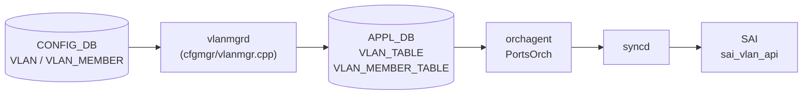

# APPL_DB VLAN_TABLE / VLAN_MEMBER_TABLE テーブル

## 概要

`VLAN_TABLE` および `VLAN_MEMBER_TABLE` は [APPL_DB](../../reference/glossary.md#term-appl_db) 上に存在する中間テーブル。`vlanmgrd`（sonic-swss/cfgmgr/vlanmgr.cpp）が [CONFIG_DB](../../reference/glossary.md#term-config_db) の `VLAN` / `VLAN_MEMBER` テーブルを購読し、変換・補完を加えて書き込む。`orchagent` 内の `PortsOrch` がこれらのテーブルを購読し、`sai_vlan_api` を通じてハードウェア VLAN を生成する[^vlanmgr][^portsorch]。

テーブル名の定数は `schema.h` で次のように定義されている[^schema]:

```
APP_VLAN_TABLE_NAME        = "VLAN_TABLE"
APP_VLAN_MEMBER_TABLE_NAME = "VLAN_MEMBER_TABLE"
```

## データフロー



## key 構造

### VLAN_TABLE

```text
VLAN_TABLE|<vlan_name>
```

`<vlan_name>` は `Vlan<id>` 形式（例: `Vlan100`）。`Vlan` プレフィクスがない場合 vlanmgrd はエントリを破棄する。

### VLAN_MEMBER_TABLE

```text
VLAN_MEMBER_TABLE|<vlan_name>|<port_alias>
```

`<port_alias>` は `Ethernet0` や `PortChannel1` 形式。

## VLAN_TABLE フィールド一覧

| フィールド | 型 | APPL_DB での扱い | 説明 |
|-----------|----|----------------|------|
| `admin_status` | string (`up`/`down`) | 常に存在 | CONFIG_DB 省略時は `"up"` が自動補完される |
| `mtu` | string (数値) | 常に存在 | CONFIG_DB 省略時は `"9100"` が補完される |
| `mac` | string (MAC アドレス) | 常に存在 | CONFIG_DB 省略時はスイッチ MAC (`gMacAddress`) が補完される |
| `host_ifname` | string | 常に存在（省略時は空文字列） | ホストインタフェース名。空文字列の場合 portsorch は `createVlanHostIntf()` をスキップする |

## VLAN_MEMBER_TABLE フィールド一覧

| フィールド | 型 | APPL_DB での扱い | 説明 |
|-----------|----|----------------|------|
| `tagging_mode` | string (`tagged`/`untagged`/`priority_tagged`) | CONFIG_DB のフィールドをそのまま転送 | CONFIG_DB 省略時は vlanmgrd が `"untagged"` で補完。portsorch も同じく `"untagged"` fallback |
| `dynamic` | string (`yes`) | PAC 経路のみ注入 | YANG 定義なし・CONFIG_DB 非存在の隠しフィールド。`doVlanPacVlanMemberTask()` が PAC 制御メンバにのみ挿入する |

<!-- defaults -->
## コード由来の暗黙デフォルト

### VLAN_TABLE

| フィールド | YANG default | コード実装デフォルト | 出典 |
|-----------|-------------|---------------------|------|
| `admin_status` | なし | `"up"` — `fvVector` が空の場合（admin_status 省略時）に自動挿入 | vlanmgr.cpp:421-426 |
| `mtu` | なし | `"9100"` (`DEFAULT_MTU_STR`) — CONFIG_DB 省略時の変数初期化値がそのまま APPL_DB に書かれる | vlanmgr.cpp:19,357,428 |
| `mac` | なし | `gMacAddress`（スイッチ MAC）— CONFIG_DB 省略時の変数初期化値がそのまま APPL_DB に書かれる | vlanmgr.cpp:358,431 |
| `host_ifname` | なし | `""` (空文字列) — CONFIG_DB に `host_ifname` フィールドが存在しない場合は空文字列が書かれる | vlanmgr.cpp:359,434 |

### VLAN_MEMBER_TABLE

| フィールド | YANG default | コード実装デフォルト | 出典 |
|-----------|-------------|---------------------|------|
| `tagging_mode` | なし（YANG では mandatory） | `"untagged"` — vlanmgrd (L648) と portsorch (L5916) が独立に fallback。CONFIG_DB に不在の場合は二重補完が発生する | vlanmgr.cpp:648, portsorch.cpp:5916 |
| `tagging_mode` (`members@` 経路) | - | `"untagged"` ハードコード — CONFIG_DB `VLAN.members@` フィールド経由の minigraph 互換経路では常に `"untagged"` が注入される | vlanmgr.cpp:573 |
| `tagging_mode` (PAC 経路) | - | `"untagged"` ハードコード — PAC 制御による VLAN_MEMBER は `doVlanPacVlanMemberTask()` が `"untagged"` 固定で設定する | vlanmgr.cpp:873 |
| `dynamic` | なし | PAC 経路のみ `"yes"` を注入 — 通常 CLI / minigraph 経路では存在しない隠しフィールド | vlanmgr.cpp:887 |

### 注記

- **`mac` の書き込み順依存**: `gMacAddress` が未初期化（スイッチ MAC 未確定）の間、vlanmgrd は `isVlanMacOk()` チェック (L316-L321) で全 VLAN タスクを保留する。
- **`mtu` の silent drop**: `mtu` は APPL_DB に書かれるが、portsorch は mtu 更新を `setRouterIntfsMtu()` 経由で処理するのみで、ホスト netdev (`ip link set Vlan<N> mtu`) への適用は vlanmgr.cpp:401-406 の TODO コメント通り未実装。
- **`tagging_mode` の二重補完**: vlanmgrd が CONFIG_DB の raw フィールドをそのまま転送するため (vlanmgr.cpp:672)、`tagging_mode` が CONFIG_DB に存在しない場合は APPL_DB にも書かれない。portsorch が受信側で再度 `"untagged"` に fallback する。
- **`priority_tagged` の bridge/SAI 乖離**: `priority_tagged` は vlanmgr.cpp:238 で `bridge vlan add ... pvid untagged`（`untagged` と同一）として処理されるが、portsorch は SAI では `SAI_VLAN_TAGGING_MODE_PRIORITY_TAGGED` と区別する。ホスト転送と ASIC 転送で動作が乖離する。
<!-- /defaults -->

<!-- side-effects -->
## 副次 DB 書込（STATE_DB / COUNTERS_DB / FLEX_COUNTER_DB）

`APPL_DB|VLAN_TABLE` / `APPL_DB|VLAN_MEMBER_TABLE` の SET / DEL 時、vlanmgrd は同一トランザクションで `STATE_DB` 上の対応エントリも更新する。`COUNTERS_DB` および `FLEX_COUNTER_DB` への副次書込みは **存在しない**（SAI VLAN counter は master ブランチ未実装）。

### STATE_DB

`VlanMgr` コンストラクタ (vlanmgr.cpp:24-32) が保持する `m_stateVlanTable` / `m_stateVlanMemberTable` 経由で書込まれる。

| STATE_DB key | 書込み箇所 | フィールド | トリガ |
|--------------|------------|----------|--------|
| `VLAN_TABLE\|Vlan<id>` | vlanmgr.cpp:443 (SET) / 463 (DEL) | `state="ok"` 固定 | `doVlanTask()` SET/DEL 成功時 |
| `VLAN_MEMBER_TABLE\|Vlan<id>\|<port>` | vlanmgr.cpp:677 / 698 | `state="ok"` 固定 | `doVlanMemberTask()` (通常 `VLAN_MEMBER` 経路) |
| `VLAN_MEMBER_TABLE\|Vlan<id>\|<port>` | vlanmgr.cpp:950 / 973 | `state="ok"` 固定 | `addPortToVlan()` / `removePortFromVlan()` (`VLAN.members@` 経由) |
| `VLAN_MEMBER_TABLE\|Vlan<id>\|<port>` | vlanmgr.cpp:894 / 907 | `state="ok"` (+ `dynamic="yes"` が混入する実装) | `doVlanPacVlanMemberTask()` (PAC 経路) |

`state` フィールドは常に `"ok"` 固定で、失敗パスは APPL_DB 自体を書かないため STATE_DB にも痕跡を残さない。これらのエントリは **vlanmgrd 内部の冪等チェック専用** (`isVlanStateOk()` vlanmgr.cpp:521-523, `isVlanMemberStateOk()` vlanmgr.cpp:535-537) で、ホスト netdev (`Vlan<N>` / bridge member) が作成済みかを判定するためにのみ使われる。`orchagent` / `portsorch` はこれらの STATE_DB エントリを購読しない（APPL_DB 側を直接 `ConsumerStateTable` で購読する）。

PAC 経路 (vlanmgr.cpp:894) では state vector ではなく APPL_DB 用 vector を流用しているため、`dynamic="yes"` が STATE_DB エントリにも書き込まれる実装の cleanup 抜けが見える。読み手側 (`isVlanMemberStateOk` は値ではなく key 存在のみを見る) には影響しないが、STATE_DB を dump した際の混入要因。

### COUNTERS_DB

`vlanmgr.cpp` は `COUNTERS_DB` の `DBConnector` を保持しない。`portsorch.cpp` は `m_counter_db` を持つが用途は `COUNTERS_PORT_NAME_MAP` / `COUNTERS_QUEUE_NAME_MAP` / `COUNTERS_PG_NAME_MAP` 等 **物理ポート単位** に限定され (portsorch.cpp:758-785)、`addVlan()` / `addVlanMember()` 経路では COUNTERS_DB に何も書込まない。SAI 仕様上 `SAI_VLAN_STAT_*` は存在するが、SONiC master は `COUNTERS_VLAN_NAME_MAP` を実装していない。

### FLEX_COUNTER_DB

`portsorch.cpp` の `FlexCounterManager` インスタンス (portsorch.cpp:727-739: `port_stat_manager` / `queue_stat_manager` / `pg_watermark_manager` ほか) はいずれも物理ポート / queue / priority-group スコープで、VLAN 単位の `FlexCounterManager` は存在しない。`APPL_DB|VLAN_TABLE` SET の連鎖で `FLEX_COUNTER_DB` への書込みは発火しない。

副次書込みの evidence は `meta/_intermediate/cdb-flow/appl-vlan-side.md` を参照。
<!-- /side-effects -->

<!-- platform -->
## プラットフォーム差

APPL_DB `VLAN_TABLE` / `VLAN_MEMBER_TABLE` 自体のスキーマ・暗黙デフォルトはすべてのプラットフォームで同一。`vlanmgrd` (`cfgmgr/vlanmgr.cpp` / `cfgmgr/vlanmgrd.cpp`) に `platform` / `asic_type` / `MLNX_PLATFORM_SUBSTRING` / `is_multi_npu` / `chassis` 参照は一切ない（`grep` で `using namespace std/swss` 以外 0 ヒット）。書き込み経路は ASIC ベンダー非依存[^vlanmgr]。

ただし**購読側の `PortsOrch` には SAI capability 依存の分岐**が存在する[^portsorch]:

| 分岐点 | SAI 問い合わせ | 未対応 ASIC での挙動 |
|-------|---------------|---------------------|
| VLAN flood control 切替 | `sai_query_attribute_enum_values_capability(SAI_OBJECT_TYPE_VLAN, SAI_VLAN_ATTR_{UNKNOWN_UNICAST,BROADCAST}_FLOOD_CONTROL_TYPE)` (portsorch.cpp:900-932) | `uuc_sup_flood_control_type` / `bc_sup_flood_control_type` 空集合。`SAI_VLAN_FLOOD_CONTROL_TYPE_ALL` 固定で `COMBINED` への切替が抑止される (portsorch.cpp:7605-7641, 7781-7849) |
| `end_point_ip` 付き VLAN_MEMBER (EVPN VxLAN flood group) | 同上で `SAI_VLAN_FLOOD_CONTROL_TYPE_COMBINED` capability 必須 | `addVlanMember()` が `Flood group with end point ip is not supported` で失敗 (portsorch.cpp:7517-7524) |
| VLAN host interface TX queue | `gSwitchOrch->querySwitchCapability(SAI_OBJECT_TYPE_HOSTIF, SAI_HOSTIF_ATTR_QUEUE)` (portsorch.cpp:933-940) | `m_supportsHostIfTxQueue=false` でホスト IF TX queue 設定が無効化（VLAN テーブル自体には影響しない） |

### MLNX (Nvidia) 限定の port stat plugin

`isMlnxPlatform()` (portsorch.cpp:689-698, 環境変数 `platform` 文字列マッチ) が true の場合のみ `SAI_PORT_STAT_TRIM_PACKETS` を含む custom Lua plugin (`nvdaPortTrimSha`) が port stat collector に追加される (portsorch.cpp:858-865)。VLAN テーブル書き込みには無関係で、counter 系の差分。

### multi-asic / VOQ chassis

`vlanmgrd` および `portsorch` は asic namespace 内のコンテナ (`swss@<asicN>`) で起動し、その namespace の CONFIG_DB / APPL_DB のみを購読・書込みする。`VLAN_TABLE` / `VLAN_MEMBER_TABLE` は asic ごとにローカルで、chassis-wide 統合経路（`CHASSIS_APP_DB`）は VLAN には存在しない（`CHASSIS_APP_DB` 連携は SYSTEM_PORT / SYSTEM_NEIGH 系のみ）。

詳細は `meta/_intermediate/cdb-flow/appl-vlan-platform.md` を参照。
<!-- /platform -->

<!-- failure -->
## 書込失敗・retry 分岐

VLAN_TABLE / VLAN_MEMBER_TABLE への書込みは複数経路で失敗し得る。一時失敗は retry、形式異常は即破棄という二段構えで、層ごとに判定基準が異なる[^vlanmgr][^portsorch]。

### vlanmgrd 側

| 失敗ケース | コード | 挙動 |
|-----------|-------|-----|
| `gMacAddress` 未確定 (スイッチ MAC 未到達) | `vlanmgr.cpp:316-322` (`isVlanMacOk`) | `doVlanTask()` 冒頭で即 return。`m_toSync` は erase されず次 tick で再評価（暗黙の retry） |
| VLAN_MEMBER の port / LAG / VLAN が未準備 | `vlanmgr.cpp:642-647` (`isMemberStateOk` / `isVlanStateOk`) | `it++; continue;` で retry。コメント `Other than the case of member port/lag is not ready, no retry will be performed` (`L711`) |
| `addHostVlanMember()` の `bridge vlan add` が PortChannel で失敗 | `vlanmgr.cpp:258-269` | LAG (`PortChannel*`) は race 想定で `return false` → 外側で retry。`Ethernet*` の場合は `EXEC_WITH_ERROR_THROW` で再実行し、2 度目失敗で例外伝播（catch なし） |
| `setHostVlanMac()` の `bridge down → set mac → bridge up` 中間失敗 | `vlanmgr.cpp:198-231` | 例外伝播。Bridge が down のまま残留しデータプレーン断の可能性 |
| key 形式不正 (`Vlan` プレフィクスなし / 非数値) | `vlanmgr.cpp:334-346`, `L605-621` | `SWSS_LOG_ERROR` + `erase(it)` で即破棄、retry なし。APPL_DB には何も書かれない |
| 不正 `tagging_mode` 値 | `vlanmgr.cpp:658-665` | `erase(it)` で即破棄 |

### portsorch (PortsOrch) 側

| 失敗ケース | コード | 挙動 |
|-----------|-------|-----|
| `addVlan()` の `sai_vlan_api->create_vlan()` 失敗 | `portsorch.cpp:7392-7402` | `handleSaiCreateStatus(SAI_API_VLAN, status)` で SAI ステータス分類。retryable なら外側 `it++; continue;` で retry、非 retryable なら erase |
| VLAN_TABLE DEL: FDB / ref count / メンバ / VNI / host_intf 残存 | `portsorch.cpp:7427-7461` | `removeVlan()` が `return false` → 外側 (`L5844-5847`) で `it++` retry。fdborch / intfsorch / vxlanorch の削除待ち |
| VLAN_MEMBER: PORT / VLAN 未取得 | `portsorch.cpp:5900-5912` | `getPort()` 失敗で `it++; continue;` retry |
| VLAN_MEMBER: 不正 `tagging_mode` | `portsorch.cpp:5924-5931` | `SWSS_LOG_ERROR` + `erase(it)` で即破棄 |
| VLAN_MEMBER: `addBridgePort()` の `sai_bridge_api->create_bridge_port()` 失敗 | `portsorch.cpp:7258-7268` | `handleSaiCreateStatus(SAI_API_BRIDGE, status)` 経由で retry / failure 判定 |
| VLAN_MEMBER: `addVlanMember()` の `sai_vlan_api->create_vlan_member()` 失敗 | `portsorch.cpp:7553-7563` | 同上 (`SAI_API_VLAN`) |
| VLAN_MEMBER: `end_point_ip` 指定 + `SAI_VLAN_FLOOD_CONTROL_TYPE_COMBINED` capability 不在 | `portsorch.cpp:7515-7524` | `Flood group with end point ip is not supported` を吐き `return false`。外側で永続的に retry（前進せず stuck） |
| VLAN_MEMBER: untagged 時の `setPortPvid()` 失敗 | `portsorch.cpp:7568-7574` | `return false` → 外側で retry |
| VLAN_TABLE: `createVlanHostIntf()` 失敗 | `portsorch.cpp:5822-5828` | コメント `No need to fail` の通り retry せず erase。VLAN 本体は成功扱い |

### retry セマンティクスの違い

- 一時失敗 (PORT/LAG/VLAN 未準備、SAI retryable、bridge port race) は `it++; continue;` で `m_toSync` に残し次 tick で再試行。
- 永続失敗 (key 形式不正、不正 tagging_mode、`Unknown operation`) は `erase(it)` で破棄。CONFIG_DB 側の不正エントリは検出されず残る（silent drop）。
- 形式上 retryable だが永続 stuck になるケース: `end_point_ip` capability 不在の VLAN_MEMBER。capability は switch 初期化時に確定するため自然解消しない。

詳細な分岐・呼び出し順は `meta/_intermediate/cdb-flow/appl-vlan-failure.md` を参照。
<!-- /failure -->

## 書き込み主体

| 書き込み元 | 対象テーブル | 経路 |
|-----------|------------|------|
| `vlanmgrd` (doVlanTask) | `VLAN_TABLE` | CONFIG_DB `VLAN` 購読 → 補完 → APPL_DB |
| `vlanmgrd` (doVlanMemberTask) | `VLAN_MEMBER_TABLE` | CONFIG_DB `VLAN_MEMBER` 購読 → APPL_DB |
| `vlanmgrd` (processUntaggedVlanMembers) | `VLAN_MEMBER_TABLE` | CONFIG_DB `VLAN.members@` 経由の minigraph 互換経路 |
| `vlanmgrd` (doVlanPacVlanMemberTask) | `VLAN_MEMBER_TABLE` | PAC 制御経路（`dynamic="yes"` フィールド付き） |

## 購読者

- `orchagent` / `PortsOrch`: `VLAN_TABLE` および `VLAN_MEMBER_TABLE` を `ConsumerStateTable` で購読。`sai_vlan_api->create_vlan()` および `sai_vlan_api->create_vlan_member()` でハードウェアに反映する (portsorch.cpp:6470-6527)。
- warm-restart 時: `addExistingData(APP_VLAN_TABLE_NAME)` / `addExistingData(APP_VLAN_MEMBER_TABLE_NAME)` で既存エントリを再処理する (portsorch.cpp:4389-4390)。

## 引用元

[^vlanmgr]: `sonic-swss/cfgmgr/vlanmgr.cpp` <https://github.com/sonic-net/sonic-swss/blob/master/cfgmgr/vlanmgr.cpp>
[^portsorch]: `sonic-swss/orchagent/portsorch.cpp` <https://github.com/sonic-net/sonic-swss/blob/master/orchagent/portsorch.cpp>
[^schema]: `sonic-swss-common/common/schema.h` <https://github.com/sonic-net/sonic-swss-common/blob/master/common/schema.h>

## 関連ページ

- [CONFIG_DB: VLAN](vlan.md)
- [CONFIG_DB: VLAN_MEMBER](vlan-member.md)
- [CLI: config vlan](../cli/config-vlan.md)
- [CLI: show vlan](../cli/show-vlan.md)
