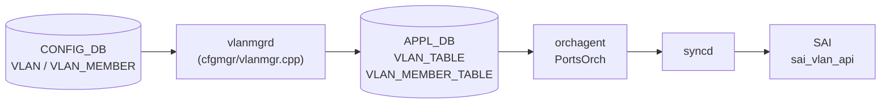

# APPL_DB VLAN_TABLE / VLAN_MEMBER_TABLE テーブル

## 概要

`VLAN_TABLE` および `VLAN_MEMBER_TABLE` は [APPL_DB](../../reference/glossary.md#term-appl_db) 上に存在する中間テーブル。`vlanmgrd`（sonic-swss/cfgmgr/vlanmgr.cpp）が [CONFIG_DB](../../reference/glossary.md#term-config_db) の `VLAN` / `VLAN_MEMBER` テーブルを購読し、変換・補完を加えて書き込む。`orchagent` 内の `PortsOrch` がこれらのテーブルを購読し、`sai_vlan_api` を通じてハードウェア VLAN を生成する[^vlanmgr][^portsorch]。

テーブル名の定数は `schema.h` で次のように定義されている[^schema]:

```
APP_VLAN_TABLE_NAME        = "VLAN_TABLE"
APP_VLAN_MEMBER_TABLE_NAME = "VLAN_MEMBER_TABLE"
```

## データフロー



## key 構造

### VLAN_TABLE

```text
VLAN_TABLE|<vlan_name>
```

`<vlan_name>` は `Vlan<id>` 形式（例: `Vlan100`）。`Vlan` プレフィクスがない場合 vlanmgrd はエントリを破棄する。

### VLAN_MEMBER_TABLE

```text
VLAN_MEMBER_TABLE|<vlan_name>|<port_alias>
```

`<port_alias>` は `Ethernet0` や `PortChannel1` 形式。

## VLAN_TABLE フィールド一覧

| フィールド | 型 | APPL_DB での扱い | 説明 |
|-----------|----|----------------|------|
| `admin_status` | string (`up`/`down`) | 常に存在 | CONFIG_DB 省略時は `"up"` が自動補完される |
| `mtu` | string (数値) | 常に存在 | CONFIG_DB 省略時は `"9100"` が補完される |
| `mac` | string (MAC アドレス) | 常に存在 | CONFIG_DB 省略時はスイッチ MAC (`gMacAddress`) が補完される |
| `host_ifname` | string | 常に存在（省略時は空文字列） | ホストインタフェース名。空文字列の場合 portsorch は `createVlanHostIntf()` をスキップする |

## VLAN_MEMBER_TABLE フィールド一覧

| フィールド | 型 | APPL_DB での扱い | 説明 |
|-----------|----|----------------|------|
| `tagging_mode` | string (`tagged`/`untagged`/`priority_tagged`) | CONFIG_DB のフィールドをそのまま転送 | CONFIG_DB 省略時は vlanmgrd が `"untagged"` で補完。portsorch も同じく `"untagged"` fallback |
| `dynamic` | string (`yes`) | PAC 経路のみ注入 | YANG 定義なし・CONFIG_DB 非存在の隠しフィールド。`doVlanPacVlanMemberTask()` が PAC 制御メンバにのみ挿入する |

<!-- defaults -->
## コード由来の暗黙デフォルト

### VLAN_TABLE

| フィールド | YANG default | コード実装デフォルト | 出典 |
|-----------|-------------|---------------------|------|
| `admin_status` | なし | `"up"` — `fvVector` が空の場合（admin_status 省略時）に自動挿入 | vlanmgr.cpp:421-426 |
| `mtu` | なし | `"9100"` (`DEFAULT_MTU_STR`) — CONFIG_DB 省略時の変数初期化値がそのまま APPL_DB に書かれる | vlanmgr.cpp:19,357,428 |
| `mac` | なし | `gMacAddress`（スイッチ MAC）— CONFIG_DB 省略時の変数初期化値がそのまま APPL_DB に書かれる | vlanmgr.cpp:358,431 |
| `host_ifname` | なし | `""` (空文字列) — CONFIG_DB に `host_ifname` フィールドが存在しない場合は空文字列が書かれる | vlanmgr.cpp:359,434 |

### VLAN_MEMBER_TABLE

| フィールド | YANG default | コード実装デフォルト | 出典 |
|-----------|-------------|---------------------|------|
| `tagging_mode` | なし（YANG では mandatory） | `"untagged"` — vlanmgrd (L648) と portsorch (L5916) が独立に fallback。CONFIG_DB に不在の場合は二重補完が発生する | vlanmgr.cpp:648, portsorch.cpp:5916 |
| `tagging_mode` (`members@` 経路) | - | `"untagged"` ハードコード — CONFIG_DB `VLAN.members@` フィールド経由の minigraph 互換経路では常に `"untagged"` が注入される | vlanmgr.cpp:573 |
| `tagging_mode` (PAC 経路) | - | `"untagged"` ハードコード — PAC 制御による VLAN_MEMBER は `doVlanPacVlanMemberTask()` が `"untagged"` 固定で設定する | vlanmgr.cpp:873 |
| `dynamic` | なし | PAC 経路のみ `"yes"` を注入 — 通常 CLI / minigraph 経路では存在しない隠しフィールド | vlanmgr.cpp:887 |

### 注記

- **`mac` の書き込み順依存**: `gMacAddress` が未初期化（スイッチ MAC 未確定）の間、vlanmgrd は `isVlanMacOk()` チェック (L316-L321) で全 VLAN タスクを保留する。
- **`mtu` の silent drop**: `mtu` は APPL_DB に書かれるが、portsorch は mtu 更新を `setRouterIntfsMtu()` 経由で処理するのみで、ホスト netdev (`ip link set Vlan<N> mtu`) への適用は vlanmgr.cpp:401-406 の TODO コメント通り未実装。
- **`tagging_mode` の二重補完**: vlanmgrd が CONFIG_DB の raw フィールドをそのまま転送するため (vlanmgr.cpp:672)、`tagging_mode` が CONFIG_DB に存在しない場合は APPL_DB にも書かれない。portsorch が受信側で再度 `"untagged"` に fallback する。
- **`priority_tagged` の bridge/SAI 乖離**: `priority_tagged` は vlanmgr.cpp:238 で `bridge vlan add ... pvid untagged`（`untagged` と同一）として処理されるが、portsorch は SAI では `SAI_VLAN_TAGGING_MODE_PRIORITY_TAGGED` と区別する。ホスト転送と ASIC 転送で動作が乖離する。
<!-- /defaults -->

## 書き込み主体

| 書き込み元 | 対象テーブル | 経路 |
|-----------|------------|------|
| `vlanmgrd` (doVlanTask) | `VLAN_TABLE` | CONFIG_DB `VLAN` 購読 → 補完 → APPL_DB |
| `vlanmgrd` (doVlanMemberTask) | `VLAN_MEMBER_TABLE` | CONFIG_DB `VLAN_MEMBER` 購読 → APPL_DB |
| `vlanmgrd` (processUntaggedVlanMembers) | `VLAN_MEMBER_TABLE` | CONFIG_DB `VLAN.members@` 経由の minigraph 互換経路 |
| `vlanmgrd` (doVlanPacVlanMemberTask) | `VLAN_MEMBER_TABLE` | PAC 制御経路（`dynamic="yes"` フィールド付き） |

## 購読者

- `orchagent` / `PortsOrch`: `VLAN_TABLE` および `VLAN_MEMBER_TABLE` を `ConsumerStateTable` で購読。`sai_vlan_api->create_vlan()` および `sai_vlan_api->create_vlan_member()` でハードウェアに反映する (portsorch.cpp:6470-6527)。
- warm-restart 時: `addExistingData(APP_VLAN_TABLE_NAME)` / `addExistingData(APP_VLAN_MEMBER_TABLE_NAME)` で既存エントリを再処理する (portsorch.cpp:4389-4390)。

## 引用元

[^vlanmgr]: `sonic-swss/cfgmgr/vlanmgr.cpp` <https://github.com/sonic-net/sonic-swss/blob/master/cfgmgr/vlanmgr.cpp>
[^portsorch]: `sonic-swss/orchagent/portsorch.cpp` <https://github.com/sonic-net/sonic-swss/blob/master/orchagent/portsorch.cpp>
[^schema]: `sonic-swss-common/common/schema.h` <https://github.com/sonic-net/sonic-swss-common/blob/master/common/schema.h>

## 関連ページ

- [CONFIG_DB: VLAN](vlan.md)
- [CONFIG_DB: VLAN_MEMBER](vlan-member.md)
- [CLI: config vlan](../cli/config-vlan.md)
- [CLI: show vlan](../cli/show-vlan.md)
