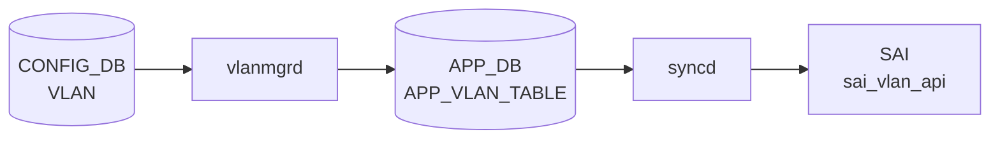
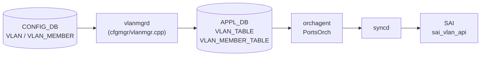

# APPL_DB VLAN_TABLE / VLAN_MEMBER_TABLE テーブル

## 概要

`VLAN_TABLE` および `VLAN_MEMBER_TABLE` は [APPL_DB](../../reference/glossary.md#term-appl_db) 上に存在する中間テーブル。`vlanmgrd`（[sonic-swss](../../reference/glossary.md#term-sonic-swss)/cfgmgr/vlanmgr.cpp）が [CONFIG_DB](../../reference/glossary.md#term-config_db) の `VLAN` / `VLAN_MEMBER` テーブルを購読し、変換・補完を加えて書き込む。`orchagent` 内の `PortsOrch` がこれらのテーブルを購読し、`sai_vlan_api` を通じてハードウェア [VLAN](../../reference/glossary.md#term-vlan) を生成する[^vlanmgr][^portsorch]。

テーブル名の定数は `schema.h` で次のように定義されている[^schema]:

```
APP_VLAN_TABLE_NAME        = "VLAN_TABLE"
APP_VLAN_MEMBER_TABLE_NAME = "VLAN_MEMBER_TABLE"
```

<!-- cdb-mermaid -->
### データフロー (自動生成)



!!! note "凡例"
    CONFIG_DB から SAI までの典型経路を `docs/reference/config-db-orch-map.md` から機械生成したミニ図。詳細・例外は本ページ本文と対応表を参照。
<!-- /cdb-mermaid -->

## 詳細データフロー



## key 構造

### VLAN_TABLE

```text
VLAN_TABLE|<vlan_name>
```

`<vlan_name>` は `Vlan<id>` 形式（例: `Vlan100`）。`Vlan` プレフィクスがない場合 [vlanmgrd](../../reference/glossary.md#term-vlanmgrd) はエントリを破棄する。

### VLAN_MEMBER_TABLE

```text
VLAN_MEMBER_TABLE|<vlan_name>|<port_alias>
```

`<port_alias>` は `Ethernet0` や `PortChannel1` 形式。

## VLAN_TABLE フィールド一覧

| フィールド | 型 | [APPL_DB](../../reference/glossary.md#term-appl_db) での扱い | 説明 |
|-----------|----|----------------|------|
| `admin_status` | string (`up`/`down`) | 常に存在 | [CONFIG_DB](../../reference/glossary.md#term-config_db) 省略時は `"up"` が自動補完される |
| `mtu` | string (数値) | 常に存在 | [CONFIG_DB](../../reference/glossary.md#term-config_db) 省略時は `"9100"` が補完される |
| `mac` | string (MAC アドレス) | 常に存在 | CONFIG_DB 省略時はスイッチ MAC (`gMacAddress`) が補完される |
| `host_ifname` | string | 常に存在（省略時は空文字列） | ホストインタフェース名。空文字列の場合 [portsorch](../../reference/glossary.md#term-portsorch) は `createVlanHostIntf()` をスキップする |

## VLAN_MEMBER_TABLE フィールド一覧

| フィールド | 型 | [APPL_DB](../../reference/glossary.md#term-appl_db) での扱い | 説明 |
|-----------|----|----------------|------|
| `tagging_mode` | string (`tagged`/`untagged`/`priority_tagged`) | CONFIG_DB のフィールドをそのまま転送 | CONFIG_DB 省略時は [vlanmgrd](../../reference/glossary.md#term-vlanmgrd) が `"untagged"` で補完。[portsorch](../../reference/glossary.md#term-portsorch) も同じく `"untagged"` fallback |
| `dynamic` | string (`yes`) | PAC 経路のみ注入 | [YANG](../../reference/glossary.md#term-yang) 定義なし・CONFIG_DB 非存在の隠しフィールド。`doVlanPacVlanMemberTask()` が PAC 制御メンバにのみ挿入する |

<!-- constants -->
## ハードコード定数 (Phase E)

APPL_DB `VLAN_TABLE` / `VLAN_MEMBER_TABLE` の書込み元 (`cfgmgr/vlanmgr.cpp`) と購読側 (`orchagent/portsorch.cpp` [VLAN](../../reference/glossary.md#term-vlan) 経路) に存在する `#define` / [SAI](../../reference/glossary.md#term-sai) enum 由来のハードコード定数を列挙する。

### テーブル名定数（schema.h）

| 定数 | 値 | ソース |
|---|---|---|
| `APP_VLAN_TABLE_NAME` | `"VLAN_TABLE"` | `schema.h:41` |
| `APP_VLAN_MEMBER_TABLE_NAME` | `"VLAN_MEMBER_TABLE"` | `schema.h:42` |

### vlanmgr.cpp `#define` 定数

| 定数 | 値 | 用途 | ソース |
|---|---|---|---|
| `DOT1Q_BRIDGE_NAME` | `"Bridge"` | Linux dot1q ブリッジデバイス名（`ip link add Bridge ... type bridge` 固定） | `vlanmgr.cpp:15` |
| `VLAN_PREFIX` | `"Vlan"` | `VLAN_TABLE` key の必須プレフィクス。`Vlan<id>` 形式以外は破棄 | `vlanmgr.cpp:16,128-130` |
| `LAG_PREFIX` | `"PortChannel"` | [LAG](../../reference/glossary.md#term-lag) ポート判定用プレフィクス | `vlanmgr.cpp:17` |
| `DEFAULT_VLAN_ID` | `"1"` (文字列) | Bridge 初期化時に `bridge vlan del vid 1 dev Bridge self` で IEEE 802.1Q デフォルト [VLAN](../../reference/glossary.md#term-vlan) を削除 | `vlanmgr.cpp:18,98` |
| `DEFAULT_MTU_STR` | `"9100"` | `VLAN_TABLE.mtu` 省略時の APPL_DB 注入値および Bridge MTU 初期値 | `vlanmgr.cpp:19,96,357,428` |
| `VLAN_HLEN` | `4` | IEEE 802.1Q ヘッダ長 — 定義のみで参照箇所なし（dead define） | `vlanmgr.cpp:20` |

### Linux bridge 設定リテラル

| リテラル | 値 | 用途 | ソース |
|---|---|---|---|
| `vlan_filtering` | `1` | `ip link set Bridge type bridge vlan_filtering 1` 固定 | `vlanmgr.cpp:110` |
| `no_linklocal_learn` | `1` | `ip link set Bridge type bridge no_linklocal_learn 1` 固定 | `vlanmgr.cpp:114` |
| `arp_evict_nocarrier` | `0` | VLAN IF 作成直後に `/proc/sys/net/ipv4/conf/Vlan<id>/arp_evict_nocarrier` へ `0` を書込み | `vlanmgr.cpp:139` |

これら 3 設定は VLAN 作成時に常時適用され、[ASIC](../../reference/glossary.md#term-asic) ベンダー非依存・全プラットフォーム共通。

### portsorch.cpp `#define` 定数（VLAN 経路）

| 定数 | 値 | 用途 | ソース |
|---|---|---|---|
| `VLAN_PREFIX` | `"Vlan"` | `strncmp(key, "Vlan", 4)` で `VLAN_TABLE` key を検査、`vlan_alias` 組立 | `portsorch.cpp:80,5744,5755,5869,5893` |
| `DEFAULT_VLAN_ID` | `1` (int) | デフォルト VLAN ID（vlanmgr の文字列版と別定義） | `portsorch.cpp:81` |
| `MAX_VALID_VLAN_ID` | `4094` | サブインタフェース VLAN ID 上限チェック | `portsorch.cpp:82,2016` |

### SAI 関連デフォルト（addVlan / addVlanMember）

| [SAI](../../reference/glossary.md#term-sai) 属性 / enum | 値 | 用途 | ソース |
|---|---|---|---|
| `SAI_VLAN_ATTR_VLAN_ID` | key から抽出 | `create_vlan()` 必須引数 | `portsorch.cpp:7389` |
| `uuc_flood_type` / `bc_flood_type` 初期値 | `SAI_VLAN_FLOOD_CONTROL_TYPE_ALL` | `addVlan()` の PortsOrch 内部状態初期化 | `portsorch.cpp:7409-7410` |
| UUC/BC flood control フォールバック | `SAI_VLAN_FLOOD_CONTROL_TYPE_ALL` | [SAI](../../reference/glossary.md#term-sai) capability 未対応時に `COMBINED` 切替を抑止 | `portsorch.cpp:7800,7814,7835,7849` |
| `tagging_mode` enum 初期化 | `SAI_VLAN_TAGGING_MODE_TAGGED` | `addVlanMember()` 内 SAI enum 変数の C++ 初期化値 | `portsorch.cpp:7540` |
| `"untagged"` → SAI | `SAI_VLAN_TAGGING_MODE_UNTAGGED` | 文字列→enum マッピング | `portsorch.cpp:7543` |
| `"tagged"` → SAI | `SAI_VLAN_TAGGING_MODE_TAGGED` | 同上 | `portsorch.cpp:7545` |
| `"priority_tagged"` → SAI | `SAI_VLAN_TAGGING_MODE_PRIORITY_TAGGED` | 同上 | `portsorch.cpp:7547` |
| `SAI_SWITCH_ATTR_DEFAULT_VLAN_ID` | switch 起動時に SAI のデフォルト VLAN OID を取得 → `m_defaultVlan_ObjId` 保持 | switch 初期化 | `portsorch.cpp:1019` |

### VLAN ID 範囲（YANG ↔ コード）

| 制約 | 値 | 出典 |
|---|---|---|
| [YANG](../../reference/glossary.md#term-yang) `VLAN.vlanid` range | `2..4094` | `sonic-vlan.yang` |
| [YANG](../../reference/glossary.md#term-yang) `VLAN.name` pattern | `Vlan(2..4095)` 形式 | `sonic-vlan.yang` |
| [portsorch](../../reference/glossary.md#term-portsorch) サブ IF 上限 | `MAX_VALID_VLAN_ID = 4094` | `portsorch.cpp:82,2016` |
| vlanmgr 数値下限/上限チェック | なし（`Vlan` プレフィクス検査のみ） | `vlanmgr.cpp:128-130` |

YANG では `2..4094` だが vlanmgr 側に数値範囲チェックなし。`Vlan1` は YANG pattern で弾かれ CONFIG_DB に到達できない設計に依存している。

### 定数サマリ

| カテゴリ | 定数 | 値 | 種別 |
|---|---|---|---|
| テーブル名 | `APP_VLAN_TABLE_NAME` / `APP_VLAN_MEMBER_TABLE_NAME` | `"VLAN_TABLE"` / `"VLAN_MEMBER_TABLE"` | `#define` (schema.h) |
| name prefix | `VLAN_PREFIX` | `"Vlan"` | `#define` (vlanmgr / portsorch 両方) |
| Linux bridge 名 | `DOT1Q_BRIDGE_NAME` | `"Bridge"` | `#define` (vlanmgr) |
| デフォルト VLAN | `DEFAULT_VLAN_ID` | `"1"` (string) / `1` (int) | `#define` 二重定義 |
| VLAN ID 上限 | `MAX_VALID_VLAN_ID` | `4094` | `#define` (portsorch) |
| MTU default | `DEFAULT_MTU_STR` | `"9100"` | `#define` (vlanmgr) |
| SAI flood default | `SAI_VLAN_FLOOD_CONTROL_TYPE_ALL` | enum | 初期化 / capability fallback |
| SAI tagging fallback | `SAI_VLAN_TAGGING_MODE_TAGGED` | enum | C++ 変数初期化 |

### 二重定義と非対称の注記

1. **`DEFAULT_VLAN_ID` の二重定義**: vlanmgr `"1"` (string) と portsorch `1` (int) が別 `#define`。用途が異なるため実害なし。
2. **`VLAN_PREFIX` の重複定義 + 長さ依存**: vlanmgr / portsorch でそれぞれ `"Vlan"` を `#define`。`strncmp(key, VLAN_PREFIX, 4)` がリテラル長 4 に依存しており、プレフィクス変更時は検査ロジックも要修正。
3. **`tagging_mode` fallback の文字列/enum 非対称**: 文字列 fallback `"untagged"`（vlanmgr / portsorch とも）と SAI enum 初期化 `SAI_VLAN_TAGGING_MODE_TAGGED` が非対称。ただし文字列確定→enum マッピングの順序で上書きされるため実発火上は不整合なし。
4. **`DEFAULT_MTU_STR = "9100"` と YANG `mtu range 1..9216`**: コード default 9100 は YANG 範囲内。Jumbo frame 最大 9216 まで設定可能だが、デフォルトは 9100 固定。
5. **タイマー定数なし**: vlanmgr / portsorch VLAN 経路に sleep / usleep / timeout 定数は一切存在せず、member port/[LAG](../../reference/glossary.md#term-lag) 未 ready 時は次 select サイクルでの retry のみ。

> **証跡**: テーブル名 `schema.h:41-42`、vlanmgr `#define` `vlanmgr.cpp:15-20`、Linux bridge リテラル `vlanmgr.cpp:96-139`、portsorch `#define` `portsorch.cpp:80-82`、`MAX_VALID_VLAN_ID` 検査 `portsorch.cpp:2016`、SAI 属性 `portsorch.cpp:1019,7389,7409-7410,7540-7547,7800-7849`。詳細分析 `meta/_intermediate/cdb-flow/appl-vlan-constants.md`
<!-- /constants -->

<!-- defaults -->
## コード由来の暗黙デフォルト

### VLAN_TABLE

| フィールド | YANG default | コード実装デフォルト | 出典 |
|-----------|-------------|---------------------|------|
| `admin_status` | なし | `"up"` — `fvVector` が空の場合（admin_status 省略時）に自動挿入 | vlanmgr.cpp:421-426 |
| `mtu` | なし | `"9100"` (`DEFAULT_MTU_STR`) — CONFIG_DB 省略時の変数初期化値がそのまま APPL_DB に書かれる | vlanmgr.cpp:19,357,428 |
| `mac` | なし | `gMacAddress`（スイッチ MAC）— CONFIG_DB 省略時の変数初期化値がそのまま APPL_DB に書かれる | vlanmgr.cpp:358,431 |
| `host_ifname` | なし | `""` (空文字列) — CONFIG_DB に `host_ifname` フィールドが存在しない場合は空文字列が書かれる | vlanmgr.cpp:359,434 |

### VLAN_MEMBER_TABLE

| フィールド | YANG default | コード実装デフォルト | 出典 |
|-----------|-------------|---------------------|------|
| `tagging_mode` | なし（YANG では mandatory） | `"untagged"` — [vlanmgrd](../../reference/glossary.md#term-vlanmgrd) (L648) と portsorch (L5916) が独立に fallback。CONFIG_DB に不在の場合は二重補完が発生する | vlanmgr.cpp:648, portsorch.cpp:5916 |
| `tagging_mode` (`members@` 経路) | - | `"untagged"` ハードコード — CONFIG_DB `VLAN.members@` フィールド経由の minigraph 互換経路では常に `"untagged"` が注入される | vlanmgr.cpp:573 |
| `tagging_mode` (PAC 経路) | - | `"untagged"` ハードコード — PAC 制御による VLAN_MEMBER は `doVlanPacVlanMemberTask()` が `"untagged"` 固定で設定する | vlanmgr.cpp:873 |
| `dynamic` | なし | PAC 経路のみ `"yes"` を注入 — 通常 CLI / minigraph 経路では存在しない隠しフィールド | vlanmgr.cpp:887 |

### 注記

- **`mac` の書き込み順依存**: `gMacAddress` が未初期化（スイッチ MAC 未確定）の間、vlanmgrd は `isVlanMacOk()` チェック (L316-L321) で全 VLAN タスクを保留する。
- **`mtu` の silent drop**: `mtu` は APPL_DB に書かれるが、portsorch は mtu 更新を `setRouterIntfsMtu()` 経由で処理するのみで、ホスト netdev (`ip link set Vlan<N> mtu`) への適用は vlanmgr.cpp:401-406 の TODO コメント通り未実装。
- **`tagging_mode` の二重補完**: vlanmgrd が CONFIG_DB の raw フィールドをそのまま転送するため (vlanmgr.cpp:672)、`tagging_mode` が CONFIG_DB に存在しない場合は APPL_DB にも書かれない。portsorch が受信側で再度 `"untagged"` に fallback する。
- **`priority_tagged` の bridge/SAI 乖離**: `priority_tagged` は vlanmgr.cpp:238 で `bridge vlan add ... pvid untagged`（`untagged` と同一）として処理されるが、portsorch は SAI では `SAI_VLAN_TAGGING_MODE_PRIORITY_TAGGED` と区別する。ホスト転送と [ASIC](../../reference/glossary.md#term-asic) 転送で動作が乖離する。
<!-- /defaults -->

<!-- ordering -->
## 書込み順依存 (Phase B)

> **調査根拠**: `cfgmgr/vlanmgr.cpp`, `orchagent/portsorch.cpp` 全行精読 (2026-05-15)  
> 詳細証跡: `meta/_intermediate/cdb-flow/appl-vlan-ordering.md`

### 他テーブル先行必須 (CONFIG_DB → APPL_DB 段)

`vlanmgrd::doVlanMemberTask()` は [STATE_DB](../../reference/glossary.md#term-state_db) 経由で先行テーブルの完了を確認するまで CONFIG_DB `VLAN_MEMBER` を APPL_DB に書かない (`vlanmgr.cpp:642`)。違反時は `SWSS_LOG_DEBUG("not ready, delaying")` のみで `m_toSync` に保留され、外部からはエラーなしの無反応に見える。

| 先行 | 理由 | 違反時挙動 |
|---|---|---|
| `DEVICE_METADATA\|localhost.mac` 確定 (`gMacAddress`) | `doVlanTask()` 入口で `isVlanMacOk()` 失敗時に全 VLAN_TABLE タスクを early return で保留 | `VLAN_TABLE` 自体が書かれず、連鎖して `VLAN_MEMBER` も `isVlanStateOk()` で弾かれる (`vlanmgr.cpp:311-322`) |
| `VLAN\|Vlan<id>` → [STATE_DB](../../reference/glossary.md#term-state_db) `VLAN_TABLE` `state=ok` | `isVlanStateOk(vlan_alias)` で [STATE_DB](../../reference/glossary.md#term-state_db) 確認 | `VLAN_MEMBER` が `m_toSync` に retain。APPL_DB に書かれない (`vlanmgr.cpp:517-531, 642`) |
| `PORT\|Ethernet<N>` → STATE_DB `PORT_TABLE` `state` フィールド | `isMemberStateOk(port_alias)` で STATE_DB 確認。`state` 欠落でも未準備扱い | 同上 retain (`vlanmgr.cpp:491-515, 642`) |
| `PORTCHANNEL\|PortChannel<N>` → STATE_DB `LAG_TABLE` | [LAG](../../reference/glossary.md#term-lag) メンバ時は `LAG_TABLE` の存在チェック | 同上 retain (`vlanmgr.cpp:495-502`) |

### APPL_DB → SAI 段 (portsorch)

`PortsOrch::doVlanMemberTask()` (`portsorch.cpp:5857-`) は以下順序条件で SAI を呼ぶ:

| 条件 | 出典 | 違反時挙動 |
|---|---|---|
| APPL_DB `VLAN_TABLE` が先に処理されて `m_portList[vlan_alias]` 登録済 | `portsorch.cpp:5896-5905` | `getPort(vlan_alias, vlan)` 失敗で `it++` retain。Debug ビルドでは L5896 assert で abort |
| PORT/LAG が PortsOrch に既知 (`m_portList[port_alias]`) | `portsorch.cpp:5907-5912` | `it++` retain |
| `addBridgePort(port) && addVlanMember(...)` の 2 段順序 (短絡評価で bridge port 先) | `portsorch.cpp:5940` | bridge port 失敗時は VLAN member 作成せず retain |
| L3 化されていない (`port.m_rif_id == 0`) | `portsorch.cpp:7198-7202` | `addBridgePort` 拒否。`VLAN_MEMBER` と `INTERFACE` (L3) は同 port で排他 |

### doTask 内テーブル順 (同一サイクル)

`PortsOrch::doTask()` (`portsorch.cpp:6464-6479`) は consumer drain を以下固定順で呼ぶため、同一 sync サイクル内でも PORT → LAG → LAG_MEMBER → VLAN → VLAN_MEMBER の順序が保証される:

```
APP_PORT_TABLE → APP_LAG_TABLE → APP_LAG_MEMBER_TABLE
              → APP_VLAN_TABLE → APP_VLAN_MEMBER_TABLE
```

### bridge / netdev コマンド順

`vlanmgrd` が発行する Linux bridge コマンドにも順序がある:

| 操作 | コマンド順 | 出典 |
|---|---|---|
| VLAN 追加 | `bridge vlan add vid <id> dev Bridge self` → `ip link add link Bridge name Vlan<id> ... type vlan id <id>` | `vlanmgr.cpp:123-135` |
| VLAN 削除 | `ip link del Vlan<id>` → `bridge vlan del vid <id> dev Bridge self` | `vlanmgr.cpp:150-160` |
| VLAN_MEMBER 追加 | `ip link set <port> master Bridge` → `bridge vlan del vid 1 dev <port>` → `bridge vlan add vid <id> dev <port> [pvid untagged]` | `vlanmgr.cpp:243-251` |

### 推奨書込み順序

```
# 1. DEVICE_METADATA.localhost.mac    (gMacAddress 確定)
# 2. PORT|EthernetN                   (STATE_DB.PORT_TABLE state=ok 待ち)
# 3. (任意) PORTCHANNEL / PORTCHANNEL_MEMBER
# 4. VLAN|VlanN                       (STATE_DB.VLAN_TABLE state=ok 待ち)
# 5. VLAN_MEMBER|VlanN|EthernetN
# 6. (任意) VLAN_INTERFACE|VlanN      (L3 化。VLAN_MEMBER が同 port にあると排他)
```

削除は逆順: VLAN_INTERFACE → VLAN_MEMBER → VLAN → PORT。

### SET 後 DEL の順序依存

| シナリオ | 問題 | 安全な手順 |
|---|---|---|
| `VLAN` をいきなり DEL (メンバー残存) | `vlanmgrd` は `removeHostVlan()` で `ip link del Vlan<id>` を実行 (`vlanmgr.cpp:456-470`)。kernel は配下 netdev を自動デタッチするが、APPL_DB `VLAN_MEMBER_TABLE` のエントリは個別 DEL されない限り残存し、portsorch 側で stale 状態になる | 先に `VLAN_MEMBER` を全て DEL してから `VLAN` を DEL |
| `VLAN_MEMBER` DEL 後の bridge port 削除 | `PortsOrch::doVlanMemberTask()` DEL 経路は `removeVlanMember()` 成功 + `getBridgePortReferenceCount(port)==0` のときのみ `removeBridgePort()` を呼ぶ (逆順) | 同一 port を含む全 VLAN_MEMBER を DEL するまで bridge port は残る (これは自動。手動操作不要) |
| `INTERFACE` 化済み port に VLAN_MEMBER を SET | `addBridgePort()` が `m_rif_id != 0` で `Cannot create bridge port, interface ... is a router port` 警告して拒否 (`portsorch.cpp:7198-7202`) | 先に `INTERFACE` (L3) 設定を解除してから VLAN_MEMBER を SET |

### warm reboot

- **vlanmgrd**: `WarmStart::isWarmStart()` 時 (`vlanmgr.cpp:41-75`) は CONFIG_DB から全 VLAN/VLAN_MEMBER キーを `m_vlanReplay` / `m_vlanMemberReplay` にキャッシュし、`ip link show Bridge` が成功する限り **Linux `Bridge` netdev・配下 VLAN netdev を破壊再作成しない**。docker warm restart 直後で STATE_DB に `state=ok` が残るが `m_vlans` 集合が空のケースは `addHostVlan()` をスキップして集合のみ補正 (`vlanmgr.cpp:371-378`) し二重作成を防ぐ。replay 集合が空になると `setWarmStartState("vlanmgrd", REPLAYED→RECONCILED)` を 2 段で発行 (`vlanmgr.cpp:479-488, 714-723`)。
- **portsorch**: `bake()` で `addExistingData(APP_VLAN_TABLE_NAME)` → `addExistingData(APP_VLAN_MEMBER_TABLE_NAME)` を **この順** で呼び (`portsorch.cpp:4389-4390`)、APPL_DB に残っていた既存エントリを `m_toSync` に再注入する。`m_isWarmRestoreStage` (`portsorch.cpp:753, 6428`) は warm 完了で `onWarmBootEnd()` (`portsorch.cpp:6424-6443`) が false に落とす。SAI 側の既存 VLAN/bridge port オブジェクトとの突き合わせ運用なので、cold boot 時と異なり SAI 再作成は走らない。

> **Evidence**: [sonic-swss](../../reference/glossary.md#term-sonic-swss) `cfgmgr/vlanmgr.cpp:41-75,123-160,233-322,371-488,491-531,642,667-700,714-723`; `orchagent/portsorch.cpp:753,4389-4390,5857-5965,5896,5907,5940,6424-6479,7189-7202`
<!-- /ordering -->

<!-- side-effects -->
## 副次 DB 書込（STATE_DB / COUNTERS_DB / FLEX_COUNTER_DB）

`APPL_DB|VLAN_TABLE` / `APPL_DB|VLAN_MEMBER_TABLE` の SET / DEL 時、vlanmgrd は同一トランザクションで `STATE_DB` 上の対応エントリも更新する。`COUNTERS_DB` および `FLEX_COUNTER_DB` への副次書込みは **存在しない**（SAI VLAN counter は master ブランチ未実装）。

### STATE_DB

`VlanMgr` コンストラクタ (vlanmgr.cpp:24-32) が保持する `m_stateVlanTable` / `m_stateVlanMemberTable` 経由で書込まれる。

| STATE_DB key | 書込み箇所 | フィールド | トリガ |
|--------------|------------|----------|--------|
| `VLAN_TABLE\|Vlan<id>` | vlanmgr.cpp:443 (SET) / 463 (DEL) | `state="ok"` 固定 | `doVlanTask()` SET/DEL 成功時 |
| `VLAN_MEMBER_TABLE\|Vlan<id>\|<port>` | vlanmgr.cpp:677 / 698 | `state="ok"` 固定 | `doVlanMemberTask()` (通常 `VLAN_MEMBER` 経路) |
| `VLAN_MEMBER_TABLE\|Vlan<id>\|<port>` | vlanmgr.cpp:950 / 973 | `state="ok"` 固定 | `addPortToVlan()` / `removePortFromVlan()` (`VLAN.members@` 経由) |
| `VLAN_MEMBER_TABLE\|Vlan<id>\|<port>` | vlanmgr.cpp:894 / 907 | `state="ok"` (+ `dynamic="yes"` が混入する実装) | `doVlanPacVlanMemberTask()` (PAC 経路) |

`state` フィールドは常に `"ok"` 固定で、失敗パスは APPL_DB 自体を書かないため STATE_DB にも痕跡を残さない。これらのエントリは **vlanmgrd 内部の冪等チェック専用** (`isVlanStateOk()` vlanmgr.cpp:521-523, `isVlanMemberStateOk()` vlanmgr.cpp:535-537) で、ホスト netdev (`Vlan<N>` / bridge member) が作成済みかを判定するためにのみ使われる。`orchagent` / `portsorch` はこれらの STATE_DB エントリを購読しない（APPL_DB 側を直接 `ConsumerStateTable` で購読する）。

PAC 経路 (vlanmgr.cpp:894) では state vector ではなく APPL_DB 用 vector を流用しているため、`dynamic="yes"` が STATE_DB エントリにも書き込まれる実装の cleanup 抜けが見える。読み手側 (`isVlanMemberStateOk` は値ではなく key 存在のみを見る) には影響しないが、STATE_DB を dump した際の混入要因。

### COUNTERS_DB

`vlanmgr.cpp` は `COUNTERS_DB` の `DBConnector` を保持しない。`portsorch.cpp` は `m_counter_db` を持つが用途は `COUNTERS_PORT_NAME_MAP` / `COUNTERS_QUEUE_NAME_MAP` / `COUNTERS_PG_NAME_MAP` 等 **物理ポート単位** に限定され (portsorch.cpp:758-785)、`addVlan()` / `addVlanMember()` 経路では [COUNTERS_DB](../../reference/glossary.md#term-counters_db) に何も書込まない。SAI 仕様上 `SAI_VLAN_STAT_*` は存在するが、[SONiC](../../reference/glossary.md#term-sonic) master は `COUNTERS_VLAN_NAME_MAP` を実装していない。

### FLEX_COUNTER_DB

`portsorch.cpp` の `FlexCounterManager` インスタンス (portsorch.cpp:727-739: `port_stat_manager` / `queue_stat_manager` / `pg_watermark_manager` ほか) はいずれも物理ポート / queue / priority-group スコープで、VLAN 単位の `FlexCounterManager` は存在しない。`APPL_DB|VLAN_TABLE` SET の連鎖で `FLEX_COUNTER_DB` への書込みは発火しない。

副次書込みの evidence は `meta/_intermediate/cdb-flow/appl-vlan-side.md` を参照。
<!-- /side-effects -->

<!-- platform -->
## プラットフォーム差

APPL_DB `VLAN_TABLE` / `VLAN_MEMBER_TABLE` 自体のスキーマ・暗黙デフォルトはすべてのプラットフォームで同一。`vlanmgrd` (`cfgmgr/vlanmgr.cpp` / `cfgmgr/vlanmgrd.cpp`) に `platform` / `asic_type` / `MLNX_PLATFORM_SUBSTRING` / `is_multi_npu` / `chassis` 参照は一切ない（`grep` で `using namespace std/swss` 以外 0 ヒット）。書き込み経路は [ASIC](../../reference/glossary.md#term-asic) ベンダー非依存[^vlanmgr]。

ただし**購読側の `PortsOrch` には SAI capability 依存の分岐**が存在する[^portsorch]:

| 分岐点 | SAI 問い合わせ | 未対応 ASIC での挙動 |
|-------|---------------|---------------------|
| VLAN flood control 切替 | `sai_query_attribute_enum_values_capability(SAI_OBJECT_TYPE_VLAN, SAI_VLAN_ATTR_{UNKNOWN_UNICAST,BROADCAST}_FLOOD_CONTROL_TYPE)` (portsorch.cpp:900-932) | `uuc_sup_flood_control_type` / `bc_sup_flood_control_type` 空集合。`SAI_VLAN_FLOOD_CONTROL_TYPE_ALL` 固定で `COMBINED` への切替が抑止される (portsorch.cpp:7605-7641, 7781-7849) |
| `end_point_ip` 付き VLAN_MEMBER ([EVPN](../../reference/glossary.md#term-evpn) VxLAN flood group) | 同上で `SAI_VLAN_FLOOD_CONTROL_TYPE_COMBINED` capability 必須 | `addVlanMember()` が `Flood group with end point ip is not supported` で失敗 (portsorch.cpp:7517-7524) |
| VLAN host interface TX queue | `gSwitchOrch->querySwitchCapability(SAI_OBJECT_TYPE_HOSTIF, SAI_HOSTIF_ATTR_QUEUE)` (portsorch.cpp:933-940) | `m_supportsHostIfTxQueue=false` でホスト IF TX queue 設定が無効化（VLAN テーブル自体には影響しない） |

### MLNX (Nvidia) 限定の port stat plugin

`isMlnxPlatform()` (portsorch.cpp:689-698, 環境変数 `platform` 文字列マッチ) が true の場合のみ `SAI_PORT_STAT_TRIM_PACKETS` を含む custom Lua plugin (`nvdaPortTrimSha`) が port stat collector に追加される (portsorch.cpp:858-865)。VLAN テーブル書き込みには無関係で、counter 系の差分。

### multi-asic / VOQ chassis

`vlanmgrd` および `portsorch` は asic namespace 内のコンテナ (`swss@<asicN>`) で起動し、その namespace の CONFIG_DB / APPL_DB のみを購読・書込みする。`VLAN_TABLE` / `VLAN_MEMBER_TABLE` は asic ごとにローカルで、chassis-wide 統合経路（`CHASSIS_APP_DB`）は VLAN には存在しない（`CHASSIS_APP_DB` 連携は SYSTEM_PORT / SYSTEM_NEIGH 系のみ）。

詳細は `meta/_intermediate/cdb-flow/appl-vlan-platform.md` を参照。
<!-- /platform -->

<!-- failure -->
## 書込失敗・retry 分岐

VLAN_TABLE / VLAN_MEMBER_TABLE への書込みは複数経路で失敗し得る。一時失敗は retry、形式異常は即破棄という二段構えで、層ごとに判定基準が異なる[^vlanmgr][^portsorch]。

### vlanmgrd 側

| 失敗ケース | コード | 挙動 |
|-----------|-------|-----|
| `gMacAddress` 未確定 (スイッチ MAC 未到達) | `vlanmgr.cpp:316-322` (`isVlanMacOk`) | `doVlanTask()` 冒頭で即 return。`m_toSync` は erase されず次 tick で再評価（暗黙の retry） |
| VLAN_MEMBER の port / LAG / VLAN が未準備 | `vlanmgr.cpp:642-647` (`isMemberStateOk` / `isVlanStateOk`) | `it++; continue;` で retry。コメント `Other than the case of member port/lag is not ready, no retry will be performed` (`L711`) |
| `addHostVlanMember()` の `bridge vlan add` が [PortChannel](../../reference/glossary.md#term-portchannel) で失敗 | `vlanmgr.cpp:258-269` | LAG (`PortChannel*`) は race 想定で `return false` → 外側で retry。`Ethernet*` の場合は `EXEC_WITH_ERROR_THROW` で再実行し、2 度目失敗で例外伝播（catch なし） |
| `setHostVlanMac()` の `bridge down → set mac → bridge up` 中間失敗 | `vlanmgr.cpp:198-231` | 例外伝播。Bridge が down のまま残留しデータプレーン断の可能性 |
| key 形式不正 (`Vlan` プレフィクスなし / 非数値) | `vlanmgr.cpp:334-346`, `L605-621` | `SWSS_LOG_ERROR` + `erase(it)` で即破棄、retry なし。APPL_DB には何も書かれない |
| 不正 `tagging_mode` 値 | `vlanmgr.cpp:658-665` | `erase(it)` で即破棄 |

### portsorch (PortsOrch) 側

| 失敗ケース | コード | 挙動 |
|-----------|-------|-----|
| `addVlan()` の `sai_vlan_api->create_vlan()` 失敗 | `portsorch.cpp:7392-7402` | `handleSaiCreateStatus(SAI_API_VLAN, status)` で SAI ステータス分類。retryable なら外側 `it++; continue;` で retry、非 retryable なら erase |
| VLAN_TABLE DEL: [FDB](../../reference/glossary.md#term-fdb) / ref count / メンバ / VNI / host_intf 残存 | `portsorch.cpp:7427-7461` | `removeVlan()` が `return false` → 外側 (`L5844-5847`) で `it++` retry。fdborch / [intfsorch](../../reference/glossary.md#term-intfsorch) / vxlanorch の削除待ち |
| VLAN_MEMBER: PORT / VLAN 未取得 | `portsorch.cpp:5900-5912` | `getPort()` 失敗で `it++; continue;` retry |
| VLAN_MEMBER: 不正 `tagging_mode` | `portsorch.cpp:5924-5931` | `SWSS_LOG_ERROR` + `erase(it)` で即破棄 |
| VLAN_MEMBER: `addBridgePort()` の `sai_bridge_api->create_bridge_port()` 失敗 | `portsorch.cpp:7258-7268` | `handleSaiCreateStatus(SAI_API_BRIDGE, status)` 経由で retry / failure 判定 |
| VLAN_MEMBER: `addVlanMember()` の `sai_vlan_api->create_vlan_member()` 失敗 | `portsorch.cpp:7553-7563` | 同上 (`SAI_API_VLAN`) |
| VLAN_MEMBER: `end_point_ip` 指定 + `SAI_VLAN_FLOOD_CONTROL_TYPE_COMBINED` capability 不在 | `portsorch.cpp:7515-7524` | `Flood group with end point ip is not supported` を吐き `return false`。外側で永続的に retry（前進せず stuck） |
| VLAN_MEMBER: untagged 時の `setPortPvid()` 失敗 | `portsorch.cpp:7568-7574` | `return false` → 外側で retry |
| VLAN_TABLE: `createVlanHostIntf()` 失敗 | `portsorch.cpp:5822-5828` | コメント `No need to fail` の通り retry せず erase。VLAN 本体は成功扱い |

### retry セマンティクスの違い

- 一時失敗 (PORT/LAG/VLAN 未準備、SAI retryable、bridge port race) は `it++; continue;` で `m_toSync` に残し次 tick で再試行。
- 永続失敗 (key 形式不正、不正 tagging_mode、`Unknown operation`) は `erase(it)` で破棄。CONFIG_DB 側の不正エントリは検出されず残る（silent drop）。
- 形式上 retryable だが永続 stuck になるケース: `end_point_ip` capability 不在の VLAN_MEMBER。capability は switch 初期化時に確定するため自然解消しない。

詳細な分岐・呼び出し順は `meta/_intermediate/cdb-flow/appl-vlan-failure.md` を参照。
<!-- /failure -->

<!-- cross-refs -->
## 暗黙参照テーブル (cross-refs)

APPL_DB `VLAN_TABLE` / `VLAN_MEMBER_TABLE` は YANG 未定義のため、明示的な leafref は存在しない。
しかしコード上、`vlanmgrd` および `PortsOrch::doVlanMemberTask()` 経路で以下のテーブル / リソースに
暗黙依存する。

### 参照関係マップ

| 参照元 | 参照先テーブル / リソース | 解決経路 | 失敗時挙動 |
|--------|---------------------------|----------|------------|
| `VLAN_MEMBER_TABLE\|Vlan<id>\|EthernetN` | `APPL_DB\|PORT_TABLE` / `STATE_DB\|PORT_TABLE` | `PortsOrch::getPort(alias)` / `VlanMgr::isMemberStateOk` (`vlanmgr.cpp:486-510`, `portsorch.cpp:5898-5912`) | `it++` で無限ポーリング再試行（PortsOrch）／ APPL_DB 書込み保留（vlanmgrd） |
| `VLAN_MEMBER_TABLE\|Vlan<id>\|PortChannelN` | `STATE_DB\|LAG_TABLE` (`m_stateLagTable`) | `VlanMgr::isMemberStateOk` (`vlanmgr.cpp:495`) ＋ `Port::LAG` OID 解決 (`portsorch.cpp:2049, 2627`) | LAG 未確立中は書込保留。bridge コマンド失敗時は LAG 削除レース判定で retry スキップ (`vlanmgr.cpp:260-272`) |
| `VLAN_MEMBER_TABLE` フィールド `end_point_ip` | VxlanTunnelOrch + `vlan.m_vlan_info.l2mc_group_id` | `PortsOrch::addVlanMember` → `addVlanFloodGroups` (`portsorch.cpp:7511-7740`) | SAI capability 不足時 `Flood group with end point ip is not supported` で失敗 |
| `doVlanPacFdbTask` (`VLAN_TABLE` 確立後) | `APPL_DB\|FDB_TABLE` (`m_appFdbTableProducer`) | `vlanmgr.cpp:776-841` (key=`Vlan<id>:<MAC>`) | `m_vlans.count(vlan_name)` 未登録なら [FDB](../../reference/glossary.md#term-fdb) 注入保留 (`vlanmgr.cpp:806-811`) |
| `VLAN_MEMBER_TABLE` SET → `STATE_DB\|VLAN_MEMBER_TABLE` 連鎖 | mclagsyncd 購読 (`STATE_VLAN_MEMBER_TABLE_NAME`, `mclaglink.cpp:915`) | `SubscriberStateTable` 経由で [MCLAG](../../reference/glossary.md#term-mclag) peer へ伝播。[ASIC_DB](../../reference/glossary.md#term-asic_db) `SAI_OBJECT_TYPE_VLAN` 経由で BVID→VID 逆引き (`mclaglink.cpp:101-112`) | mclagsyncd は APPL_DB を直接購読しない（間接依存） |

### 順序依存

- `VLAN_TABLE` SET が先行しない VLAN_MEMBER は portsorch 側で `getPort(vlan_alias)` 失敗で保留される (`portsorch.cpp:5900-5905`)。
- `VLAN_TABLE` 確立後でないと `doVlanPacFdbTask` の [FDB](../../reference/glossary.md#term-fdb) 注入は `m_vlans.count()` ガードで保留される。
- `end_point_ip` 付き VLAN_MEMBER は L2MC group OID (`vlan.m_vlan_info.l2mc_group_id`) が VLAN 作成時に確立されている必要があり、対応する VxLAN remote [VTEP](../../reference/glossary.md#term-vtep) は VxlanTunnelOrch 経由で別途解決される。

### MCLAG との関係

`mclagsyncd` (`mclaglink.cpp`) は APPL_DB `VLAN_TABLE` / `VLAN_MEMBER_TABLE` を **直接購読しない**。
代わりに `STATE_DB|VLAN_MEMBER_TABLE` (vlanmgrd が APPL_DB 書込と同時に書く state="ok" エントリ) を
購読することで [MCLAG](../../reference/glossary.md#term-mclag) peer 同期をトリガする。`portsorch.cpp` には `mclag` / `MCLAG` 識別子の
直接参照は存在しない。

詳細な evidence は `meta/_intermediate/cdb-flow/appl-vlan-cross-refs.md` を参照。
<!-- /cross-refs -->

<!-- pubsub -->
## 通信メカニズム (Phase G)

### Redis 購読方式

APPL_DB の `VLAN_TABLE` / `VLAN_MEMBER_TABLE` への変更通知は、`PortsOrch` が **`swss::ConsumerStateTable`** (channel ベース PUBLISH/SUBSCRIBE) で購読する。`Orch::addConsumer()` は DB ID で分岐し、CONFIG_DB / STATE_DB / CHASSIS_APP_DB 以外（= APPL_DB）には `ConsumerStateTable` を割り当てる (`orch.cpp:1186-1196`)。VLAN 系 APPL_DB テーブルでは **keyspace 通知 (`__keyspace@<dbId>__:...`) は使わない** — channel ベースの `<TABLE>_CHANNEL@<dbId>` PUBLISH/SUBSCRIBE プロトコルが使われる。

```cpp
// orch.cpp:1186-1196 (抜粋)
void Orch::addConsumer(DBConnector *db, string tableName, int pri)
{
    if (db->getDbId() == CONFIG_DB || db->getDbId() == STATE_DB || db->getDbId() == CHASSIS_APP_DB)
        addExecutor(new Consumer(new SubscriberStateTable(db, tableName, ..., pri), this, tableName));
    else
        addExecutor(new Consumer(new ConsumerStateTable(db, tableName, gBatchSize, pri), this, tableName));
}
```

`orchdaemon.cpp:217-224` で `ports_tables` に `APP_VLAN_TABLE_NAME` / `APP_VLAN_MEMBER_TABLE_NAME` が登録され、`PortsOrch` コンストラクタ経由で `addConsumer()` に渡される。APPL_DB の DB ID は CONFIG_DB / STATE_DB / CHASSIS_APP_DB のいずれでもないため、`ConsumerStateTable` 経路が選択される。

| 購読者 | 購読 API | 購読テーブル | 優先度 | バッチ |
|--------|---------|--------------|--------|--------|
| `orchagent` (`PortsOrch`) | `swss::ConsumerStateTable` | `VLAN_TABLE` | `portsorch_base_pri + 2` = 42 (`orchdaemon.cpp:220`) | `gBatchSize` (default 128) |
| `orchagent` (`PortsOrch`) | 同上 | `VLAN_MEMBER_TABLE` | `portsorch_base_pri` = 40 (`orchdaemon.cpp:221`) | 同上 |

`gBatchSize` は `orchagent/main.cpp` で `DEFAULT_BATCH_SIZE = 128` に初期化され、`orchagent -b <n>` オプションで上書き可能。書き込み側 `vlanmgrd` は `cfgmgr/vlanmgr.h:22` で `ProducerStateTable m_appVlanTableProducer, m_appVlanMemberTableProducer;` を保持し、`vlanmgr.cpp:33-34` で `APP_VLAN_TABLE_NAME` / `APP_VLAN_MEMBER_TABLE_NAME` 宛にバインドする。`ProducerStateTable::set()` 内部で `_<TABLE>` ハッシュ + `<TABLE>_CHANNEL@<dbId>` への `PUBLISH` が発行される。TTL は使用されない。

### channel PUBLISH → ハンドラ呼び出しの流れ

```
vlanmgrd (cfgmgr/vlanmgr.cpp)
  ↓ m_appVlanTableProducer.set(vlan_name, fvVector)
APPL_DB: HSET "_VLAN_TABLE:Vlan100" admin_status up mtu 9100 ...
  ↓ Redis PUBLISH "VLAN_TABLE_CHANNEL@0" "G"
OrchDaemon main loop: m_select->select(&s, SELECT_TIMEOUT)
  ↓ Consumer::execute() → ConsumerStateTable::pops()
PortsOrch::doTask()  (portsorch.cpp:6464-6489)
  ↓ tableOrder で固定順 drain (PORT → LAG → LAG_MEMBER → VLAN → VLAN_MEMBER)
PortsOrch::doTask(Consumer&)  (portsorch.cpp:6492-6526)
  ↓ table_name で分岐
doVlanTask(consumer) / doVlanMemberTask(consumer)
  ↓
SAI: sai_vlan_api->create_vlan() / create_vlan_member()
```

- `PortsOrch::doTask()` (`portsorch.cpp:6464-6489`) は consumer drain を **固定順** `APP_PORT_TABLE → APP_LAG_TABLE → APP_LAG_MEMBER_TABLE → APP_VLAN_TABLE → APP_VLAN_MEMBER_TABLE` で呼ぶため、同一 select サイクル内でも VLAN_TABLE の処理が VLAN_MEMBER_TABLE より必ず先行する。
- `PortsOrch::doTask(Consumer&)` (`portsorch.cpp:6492-6526`) では `if (!allPortsReady()) return;` ガードがあり (`portsorch.cpp:6513-6517`)、初期化未完了の間 VLAN 経路は一切呼ばれず `m_toSync` で保留される。
- 書き込み側（`vlanmgrd`）と購読側（`PortsOrch`）は別プロセスのため、PUBLISH/SUBSCRIBE は [Redis](../../reference/glossary.md#term-redis) を介した IPC として動作する。

### リトライキャッシュ・retry セマンティクス

VLAN 経路には `createRetryCache()` のような明示的 retry キャッシュは存在しない（[ACL](../../reference/glossary.md#term-acl) 系と異なる）。代わりに `Consumer::m_toSync` に保留された未処理エントリが次の select サイクルで再評価される、Orch 基底クラスの汎用 retry に依存する。一時失敗（`PORT`/`LAG`/`VLAN` 未準備、SAI retryable）は `it++; continue;` で `m_toSync` 残置、永続失敗（key 形式不正・不正 `tagging_mode`）は `erase(it)` で破棄される（詳細は本ページ「書込失敗・retry 分岐」セクション参照）。

### サービス再起動トリガー

なし。`PortsOrch` は同一 [orchagent](../../reference/glossary.md#term-orchagent) プロセス内のハンドラであり、APPL_DB エントリの追加/削除は SAI VLAN オブジェクトのライブ操作 (`sai_vlan_api->create_vlan` / `remove_vlan` / `create_vlan_member` / `remove_vlan_member`) のみで反映され、プロセス再起動・サービス restart を伴わない。warm-restart 時は `addExistingData(APP_VLAN_TABLE_NAME)` / `addExistingData(APP_VLAN_MEMBER_TABLE_NAME)` (`portsorch.cpp:4389-4390`) で既存エントリを `m_toSync` に再注入する。

> **Evidence**: `sonic-swss/orchagent/orchdaemon.cpp:215-224` (ports_tables 登録)、`sonic-swss/orchagent/orch.cpp:1186-1196` (`Orch::addConsumer()` DB ID 分岐 → [ConsumerStateTable](../../reference/glossary.md#term-consumerstatetable) 選択)、`sonic-swss/orchagent/portsorch.cpp:4389-4390,6464-6526` (warm bake / doTask fixed-order drain / 分岐)、`sonic-swss/cfgmgr/vlanmgr.h:22-23`, `sonic-swss/cfgmgr/vlanmgr.cpp:33-34` (`ProducerStateTable` バインド)、`sonic-swss-common/common/schema.h:41-42` (テーブル名定数); 詳細分析 `meta/_intermediate/cdb-flow/appl-vlan-pubsub.md`
<!-- /pubsub -->

## 書き込み主体

| 書き込み元 | 対象テーブル | 経路 |
|-----------|------------|------|
| `vlanmgrd` (doVlanTask) | `VLAN_TABLE` | CONFIG_DB `VLAN` 購読 → 補完 → APPL_DB |
| `vlanmgrd` (doVlanMemberTask) | `VLAN_MEMBER_TABLE` | CONFIG_DB `VLAN_MEMBER` 購読 → APPL_DB |
| `vlanmgrd` (processUntaggedVlanMembers) | `VLAN_MEMBER_TABLE` | CONFIG_DB `VLAN.members@` 経由の minigraph 互換経路 |
| `vlanmgrd` (doVlanPacVlanMemberTask) | `VLAN_MEMBER_TABLE` | PAC 制御経路（`dynamic="yes"` フィールド付き） |

## 購読者

- `orchagent` / `PortsOrch`: `VLAN_TABLE` および `VLAN_MEMBER_TABLE` を `ConsumerStateTable` で購読。`sai_vlan_api->create_vlan()` および `sai_vlan_api->create_vlan_member()` でハードウェアに反映する (portsorch.cpp:6470-6527)。
- warm-restart 時: `addExistingData(APP_VLAN_TABLE_NAME)` / `addExistingData(APP_VLAN_MEMBER_TABLE_NAME)` で既存エントリを再処理する (portsorch.cpp:4389-4390)。

## 引用元

[^vlanmgr]: `sonic-swss/cfgmgr/vlanmgr.cpp` <https://github.com/sonic-net/sonic-swss/blob/master/cfgmgr/vlanmgr.cpp>
[^portsorch]: `sonic-swss/orchagent/portsorch.cpp` <https://github.com/sonic-net/sonic-swss/blob/master/orchagent/portsorch.cpp>
[^schema]: `sonic-swss-common/common/schema.h` <https://github.com/sonic-net/sonic-swss-common/blob/master/common/schema.h>

## 関連ページ

- [CONFIG_DB: VLAN](vlan.md)
- [CONFIG_DB: VLAN_MEMBER](vlan-member.md)
- [CLI: config vlan](../cli/config-vlan.md)
- [CLI: show vlan](../cli/show-vlan.md)

<!-- glossary-links-injected: 87ac702c4a9d -->
