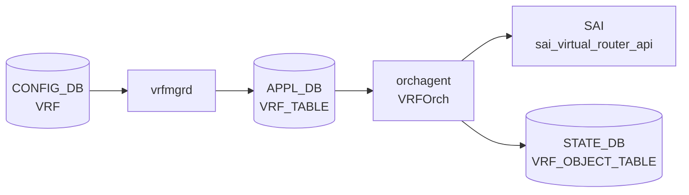

# APPL_DB VRF_TABLE テーブル

## 概要

`VRF_TABLE` は [APPL_DB](../../reference/glossary.md#term-appl_db) 上に存在する VRF エントリテーブル。`vrfmgrd` が CONFIG_DB `VRF` テーブルを購読し、Linux VRF デバイス (`ip vrf add`) を作成した後に `APP_VRF_TABLE_NAME = "VRF_TABLE"` へ pass-through 書き込みを行う[^vrfmgr]。`orchagent` 内の `VRFOrch` がこのテーブルを購読し、`sai_virtual_router_api->create_virtual_router()` を通じてハードウェア VRF (SAI Virtual Router) を生成する[^vrforch]。テーブル名定数は `schema.h:80` で `APP_VRF_TABLE_NAME = "VRF_TABLE"` と定義される[^schema]。

## key 構造

```text
VRF_TABLE|<vrfName>
```

`<vrfName>` は CONFIG_DB の `VRF` key と同一。YANG `sonic-vrf.yang` のパターン制約 `Vrf[a-zA-Z0-9_-]+` を満たす文字列（例: `VrfRed`）および `mgmt` が書き込まれる。

## フィールド一覧

| フィールド | 型 | 必須 | 説明 |
|-----------|----|------|------|
| `fallback` | boolean | - | CONFIG_DB から pass-through。orchagent で **silent drop** (dead field) |
| `vni` | uint32 | - | L3 VNI マッピング。`0` = なし |
| `v4` | boolean | - | IPv4 admin state (YANG 未定義・VNET 経由のみ) |
| `v6` | boolean | - | IPv6 admin state (YANG 未定義・VNET 経由のみ) |
| `src_mac` | MAC address | - | Virtual Router の送信元 MAC (YANG 未定義) |
| `ttl_action` | packet action | - | TTL=1 パケットの処理 (YANG 未定義) |
| `ip_opt_action` | packet action | - | IP オプション付きパケットの処理 (YANG 未定義) |
| `l3_mc_action` | packet action | - | L3 マルチキャスト unknown の処理 (YANG 未定義) |
| `mgmtVrfEnabled` | boolean | - | orchagent で **explicit ignore** |
| `in_band_mgmt_enabled` | boolean | - | orchagent で **explicit ignore** |

## 書き込み主体

- `vrfmgrd`: CONFIG_DB `VRF` のフィールドを `kfvFieldsValues(t)` でそのまま転送する (`vrfmgr.cpp:303`)。フィールドの追加・補完・変換は行わない。

## 購読者

- `orchagent` / `VRFOrch`: `VRF_TABLE` を `SubscriberStateTable` で購読。`sai_virtual_router_api->create_virtual_router()` または `set_virtual_router_attribute()` を呼ぶ。成功後 `STATE_VRF_OBJECT_TABLE|<vrfName>` に `state=ok` を書き込む[^vrforch]。

<!-- cdb-mermaid -->
### データフロー (自動生成)



!!! note "凡例"
    CONFIG_DB → APPL_DB → SAI の典型経路。vrfmgrd が APPL_DB 書き込み主体。
<!-- /cdb-mermaid -->

## 制約

- `vni` を一度設定した VRF に別の VNI を設定しようとすると `VRFOrch::updateVrfVNIMap` が `"VRF is already mapped to vni"` エラーを返す。一旦 `vni=0` にリセットが必要[^vrforch]。
- `ref_count > 0`（インタフェース・ルートが参照中）の VRF は削除できない (`vrforch.cpp:169-170`)。
- VRF 削除時は `STATE_VRF_OBJECT_TABLE` のエントリも削除される (`m_stateVrfObjectTable.del`、vrforch.cpp:193)。

## 引用元

[^vrfmgr]: `sonic-swss/cfgmgr/vrfmgr.cpp`. <https://github.com/sonic-net/sonic-swss/blob/4305596156d70e9797e8a881b3d19b46de0bce0d/cfgmgr/vrfmgr.cpp>
[^vrforch]: `sonic-swss/orchagent/vrforch.cpp`. <https://github.com/sonic-net/sonic-swss/blob/4305596156d70e9797e8a881b3d19b46de0bce0d/orchagent/vrforch.cpp>
[^schema]: `sonic-swss-common/common/schema.h`. <https://github.com/sonic-net/sonic-swss-common/blob/158de8d3463ff4b841653f6d57190bb142b80d9c/common/schema.h>

<!-- defaults -->
## フィールドの暗黙デフォルト・コード由来挙動 (Phase A)

> 調査日 2026-05-15。ソース: `sonic-swss/orchagent/vrforch.cpp`、`vrforch.h`、`cfgmgr/vrfmgr.cpp`、`sonic-swss-common/common/schema.h`

### vrfmgrd の pass-through 挙動

`vrfmgrd` (`vrfmgr.cpp:303`) は CONFIG_DB フィールドを加工せずそのまま APP_DB へ転送する。フィールド省略はそのまま省略として `VRFOrch` に届く。

```cpp
m_appVrfTableProducer.set(vrfName, kfvFieldsValues(t));
```

### `vni` — コード由来デフォルト `0`

`VRFOrch::addOperation` の先頭で `uint32_t vni = 0` と初期化される (`vrforch.cpp:30`)。フィールド省略時または明示的 `vni=0` の場合、`vni != 0` 条件が成立せず `updateVrfVNIMap()` は呼ばれない。VNI マッピングなしが暗黙デフォルト。

```cpp
uint32_t vni = 0;                              // vrforch.cpp:30
...
else if (name == "vni")
{
    vni = static_cast<uint32_t>(request.getAttrUint(name));
    continue;  // SAI attrs には追加しない
}
...
if (vni != 0)
{
    error = updateVrfVNIMap(vrf_name, vni);    // VNI マッピング処理
}
```

### `v4` / `v6` — SAI デフォルト依存 (YANG 未定義)

フィールドが存在する場合は `SAI_VIRTUAL_ROUTER_ATTR_ADMIN_V4_STATE` / `ADMIN_V6_STATE` に変換されるが、CONFIG_DB `sonic-vrf.yang` に定義がなく通常の `config vrf add` では書き込まれない。省略時は SAI attrs に追加されないため SAI/ASIC 実装のデフォルト値が使用される。VNET テーブル経由で直接書き込む場合にのみ機能する残存コード。

### `src_mac` — 省略時はスイッチ MAC を SAI が使用 (YANG 未定義)

フィールドが存在する場合は `SAI_VIRTUAL_ROUTER_ATTR_SRC_MAC_ADDRESS` に変換。省略時は SAI 側がスイッチのデフォルト MAC を適用する。YANG 未定義・通常経路では書き込まれない。

### `ttl_action` / `ip_opt_action` / `l3_mc_action` — 省略時は SAI デフォルト (YANG 未定義)

| フィールド | SAI 属性 | 省略時の挙動 |
|-----------|---------|------------|
| `ttl_action` | `VIOLATION_TTL1_PACKET_ACTION` | SAI デフォルト（通常 `TRAP`） |
| `ip_opt_action` | `VIOLATION_IP_OPTIONS_PACKET_ACTION` | SAI デフォルト |
| `l3_mc_action` | `UNKNOWN_L3_MULTICAST_PACKET_ACTION` | SAI デフォルト |

いずれも `request.getAttrPacketAction(name)` で SAI attrs に変換されるが、YANG 未定義のため通常 APP_DB に書き込まれない。

### `mgmtVrfEnabled` / `in_band_mgmt_enabled` — explicit ignore

`VRFOrch` はこれらのフィールドを明示的に読み飛ばす。SAI 属性への変換も STATE_DB への書き込みも行わない。

```cpp
// vrforch.cpp:74-78
else if ((name == "mgmtVrfEnabled") || (name == "in_band_mgmt_enabled"))
{
    SWSS_LOG_INFO("MGMT VRF field: %s ignored", name.c_str());
    continue;
}
```

### `fallback` — dead field (silent drop at orchagent)

`vrforch.h:34` で `{ "fallback", REQ_T_BOOL }` として宣言されているが、`VRFOrch::addOperation` のすべての if/else チェーンに `"fallback"` の分岐が存在しない。結果として `else` ブランチに落ち `SWSS_LOG_ERROR("Logic error: Unknown attribute: %s")` が出力されてフィールドが破棄される。

- `vrfmgrd` は `fallback` を pass-through するため APP_DB には届く
- `VRFOrch` がそれを silent drop → **SAI・Linux カーネル・FRR のいずれにも影響しない**
- `fallback=true` を CONFIG_DB に設定してもデフォルト VRF へのフォールバックは機能しない
- これは **dead field** であり YANG `default false` のみが有効な設定状態

### STATE_DB 書き戻し

`VRFOrch` は VRF 作成・更新成功後に `STATE_VRF_OBJECT_TABLE|<vrfName>` へ `state=ok` を書き込む (`vrforch.cpp:120, 150`)。この state は `vrfmgrd::isVrfObjExist()` による削除タイミング制御に使用される。

<!-- /defaults -->

<!-- ordering -->
## 書込み順依存 (Phase B)

> 調査証跡: `meta/_intermediate/cdb-flow/appl-vrf-ordering.md`

### SET 時の先行必須テーブル / 状態

| 先行テーブル / 状態 | 理由 | ソース |
|---|---|---|
| `MGMT_VRF_CONFIG` の Linux mgmt VRF 作成 (`hostcfgd` 側) | `vrfmgrd::setLink` は `vrfName == "mgmt"` の場合 `ip link add` を呼ばず `MGMT_VRF_TABLE_ID = 6000` を予約するだけ。`hostcfgd` が先に Linux mgmt VRF を作っていない状態で書くと SAI Virtual Router は作成されるが Linux 側 netdev と不整合になる | `vrfmgr.cpp:13-16, 73-84, 164-201` |
| `VXLAN_EVPN_NVO` (`vni != 0` の場合) | `updateVrfVNIMap` が `EvpnNvoOrch::getEVPNVtep()` を必須で参照。VTEP 未作成だと `false` 返却で `addOperation` 失敗、SAI VR は create 済みなのに `STATE_VRF_OBJECT_TABLE` と VNI map が抜ける半作成状態が残る | `vrforch.cpp:225-230` |
| `VXLAN_TUNNEL_MAP` (VLAN-VNI map) (`vni != 0` の場合) | `VxlanTunnelOrch::getVlanMappedToVni(vni)` が 0 のとき `updateL3VniStatus` が呼ばれず L3 VNI は半設定状態のまま保留される | `vrforch.cpp:233-241` |

!!! warning "mgmt VRF は二系統の同期が必要"
    `mgmt` VRF は `hostcfgd` (Linux mgmt VRF netdev) と `vrfmgrd` (`MGMT_VRF_CONFIG` 経由で APPL_DB `VRF_TABLE|mgmt`) の **二系統** で構成される。`vrfmgrd::doTask` は `mgmtVrfEnabled == true` かつ `in_band_mgmt_enabled == true` の両条件が揃わない限り `op` を `DEL_COMMAND` に書き換える (`vrfmgr.cpp:228-271`)。orchagent 側 `VRFOrch::addOperation` も `mgmtVrfEnabled` / `in_band_mgmt_enabled` フィールドを explicit ignore する (`vrforch.cpp:74-78`) ため、これらフィールドは SAI には絶対に到達しない。

!!! warning "EVPN VTEP 先行は dead-letter 化しない"
    `vni != 0` の VRF を `VXLAN_EVPN_NVO` 先行なしで書くと、SAI Virtual Router は create 成功するが (`vrforch.cpp:93-110`)、`updateVrfVNIMap` が `false` を返して `addOperation` が `false` で抜けるため `STATE_VRF_OBJECT_TABLE|<vrf>` が `ok` にならない。後から `VXLAN_EVPN_NVO` を投入すれば次 tick の update パス (`vrforch.cpp:123-152`) が成功し復旧する。半作成状態は一時的だが、その間 `vrfmgrd::isVrfObjExist()` は `false` を返す。

### VRF と VNET の独立性

`vrfmgrd` は CONFIG_DB の `VRF` / `MGMT_VRF_CONFIG` / `VNET` を購読し、それぞれ別 producer で APPL_DB に書く (`vrfmgr.cpp:22-26`):

| CONFIG_DB | APPL_DB 行先 | 受信側 orchagent |
|---|---|---|
| `VRF` | `VRF_TABLE` (`m_appVrfTableProducer`) | `VRFOrch` |
| `MGMT_VRF_CONFIG` | `VRF_TABLE` (`vrfName = "mgmt"` に固定) | `VRFOrch` (両フラグを ignore) |
| `VNET` | `VNET_TABLE` (`m_appVnetTableProducer`) | `VnetOrch` (`VRFOrch` ではない) |

`VRF` と `VNET` は **APPL_DB 上で別テーブル / 別 producer / 別 orchagent ハンドラ**であり、両者の書込順に依存関係はない。ただし Linux netdev table id (`VRF_TABLE_START..VRF_TABLE_END = 1001..5097`) は **共有プール**で、命名規則 (VNET は `Vnet_*`) により実際の衝突は回避される。

なお `VRFOrch::addOperation` の `v4` / `v6` / `src_mac` / `*_action` 系フィールドは `VnetOrch` 経由で APPL_DB `VRF_TABLE` を直書きする非標準経路でのみ意味を持つ（YANG `sonic-vrf.yang` 未定義のため通常 `config vrf add` 経路では書かれない）。

### DEL 時の順序制約

| 順序制約 | 理由 | ソース |
|---|---|---|
| インタフェース / ルート → VRF の順 | `vrf_table_[vrf_name].ref_count > 0` の間 `delOperation` は `return false`（リトライキュー残置）。`STATE_VRF_OBJECT_TABLE|<vrf>` が消えず、`vrfmgrd::delLink` の Linux netdev 削除も走らない | `vrforch.cpp:169-170`、`vrfmgr.cpp:312-360` |
| SAI remove → STATE_DB DEL → vrfmgrd delLink | `VRFOrch::delOperation` は最後に `m_stateVrfObjectTable.del` を呼ぶ (`vrforch.cpp:193`)。`vrfmgrd` 側は `isVrfObjExist()` が `false` を返すまで Linux netdev 削除を遅延（コメント `Delay delLink until vrf object deleted in orchagent`） | `vrforch.cpp:172-193`、`vrfmgr.cpp:312-360` |
| `mgmt` VRF は Linux netdev 削除なし | `vrfmgr.cpp:73-76, 146-152` で `vrfName == "mgmt"` のとき table id だけ recycle し、`ip link del` は呼ばない | `vrfmgr.cpp:73-76, 146-152` |

### 起動時シーケンス（典型）

```
hostcfgd が mgmt VRF netdev を構成（mgmt のみ）
  ↓
EvpnNvoOrch が VXLAN_EVPN_NVO 受信 → source VTEP 確立（L3 VNI を使う場合のみ）
  ↓
VxlanTunnelOrch が VLAN-VNI map を構築（L3 VNI のデータプレーン反映が必要な場合）
  ↓
vrfmgrd が CONFIG_DB VRF / MGMT_VRF_CONFIG を受信
  → Linux VRF netdev 作成（mgmt 以外）
  → APPL_DB VRF_TABLE に pass-through
  ↓
VRFOrch が SAI Virtual Router create → updateVrfVNIMap → STATE_VRF_OBJECT_TABLE|<vrf>=ok
```

実運用では `config vrf add Vrfxxx` が `VRF` テーブルのみを書く（VNI 未設定）ため、EVPN VTEP / VLAN-VNI map 依存は L3 VNI 機能を使う場合のみ。

<!-- /ordering -->

<!-- side-effects -->
## 副次 DB 書込 (Phase F)

APPL_DB `VRF_TABLE` への SET/DEL は、`orchagent` 内の `VRFOrch` (`vrforch.cpp`) を経由して以下の副次書込みを発火させる。`VRFOrch` 自身が保持する swss `Table` ハンドルは `m_stateVrfObjectTable` ただ 1 つで (`vrforch.h:54, 182`)、それ以外の DB 直接書込は存在しない。

### 直接 — STATE_DB `VRF_OBJECT_TABLE`

| トリガ (APPL_DB SET/DEL 由来) | コード位置 | 書込内容 |
|---|---|---|
| 新規 `VRF_TABLE\|<vrfName>` SET → SAI create 成功 | `vrforch.cpp:120` | `m_stateVrfObjectTable.hset(vrfName, "state", "ok")` |
| 既存 `VRF_TABLE\|<vrfName>` SET (更新) → SAI set 成功 | `vrforch.cpp:150` | `m_stateVrfObjectTable.hset(vrfName, "state", "ok")` |
| `VRF_TABLE\|<vrfName>` DEL → SAI remove 成功 | `vrforch.cpp:193` | `m_stateVrfObjectTable.del(vrfName)` |

テーブル名定数は `STATE_VRF_OBJECT_TABLE_NAME = "VRF_OBJECT_TABLE"` (`sonic-swss-common/common/schema.h`)。コンストラクタで `stateDb` と `stateTableName` が `orchdaemon.cpp` から注入される (`vrforch.h:52-56`)。購読側は `vrfmgrd::isVrfObjExist()` が VRF 削除タイミング制御に利用する (`cfgmgr/vrfmgr.cpp`)。

### 間接 — COUNTERS_DB / FLEX_COUNTER_DB (条件付き)

`addOperation` の create 直後 (`vrforch.cpp:110`) と `delOperation` の SAI remove 直後 (`vrforch.cpp:184`) で、`gFlowCounterRouteOrch->onAddVR(router_id)` / `onRemoveVR(router_id)` が呼ばれる。これは `FlowCounterRouteOrch` (`orchagent/flex_counter/flowcounterrouteorch.cpp`) が保持する以下の DB ハンドルへ副次書込みを発火し得る:

| DB | テーブル | 用途 |
|---|---|---|
| COUNTERS_DB | `COUNTERS_ROUTE_NAME_MAP` (`mPrefixToCounterTable`) | route prefix → counter OID マップ |
| COUNTERS_DB | `COUNTERS_ROUTE_TO_PATTERN_MAP` (`mPrefixToPatternTable`) | route prefix → 適用パターン名マップ |
| FLEX_COUNTER_DB | `ROUTE_FLOW_COUNTER_FLEX_COUNTER_GROUP` (`mRouteFlowCounterMgr`) | poller group / interval 登録 |

ただし `FlowCounterRouteOrch::onAddVR` (`flowcounterrouteorch.cpp:401-432`) は

1. `mRouteFlowCounterSupported == false` の場合は即 return（プラットフォーム側 capability で決まる）、
2. CONFIG_DB `FLOW_COUNTER_ROUTE_PATTERN_TABLE` に当該 `vrf_name` を含む `RoutePattern` が登録済みの場合に限り `createRouteFlowCounterByPattern()` を呼ぶ、

という二重ガードで保護されており、通常運用（ROUTE フローカウンタ機能未使用）では VRF_TABLE への SET/DEL は COUNTERS_DB / FLEX_COUNTER_DB に**何も書かない**。

### その他 DB

| 副次 DB | 書込有無 | 根拠 |
|---|---|---|
| APPL_DB (他テーブルへの fan-out) | なし | `VRFOrch` は `Orch2(appDb, appTableName, ...)` で `APP_VRF_TABLE_NAME` を購読するのみ。`appDb` への producer hand を持たない (`vrforch.h:52-56`) |
| ASIC_DB (VRFOrch 直接) | なし | `sai_virtual_router_api->create_virtual_router()` 呼出により syncd 経由で ASIC_DB に流れるのは SAI 通常経路。`VRFOrch` 自身は ASIC_DB Table ハンドルを保持しない |
| LOGLEVEL_DB | なし | `vrforch.cpp` 全文に LOGLEVEL_DB 参照 0 件 |
| Notification channel | なし | `vrforch.cpp` に `NotificationProducer` / `publish()` の呼出なし |

### VNET_TABLE 経路について

本ページは APPL_DB `VRF_TABLE` スコープ。同じ APPL_DB 上の `VNET_TABLE` は `VnetOrch` (`vnetorch.cpp`) が処理し、`STATE_VNET_RT_TUNNEL_TABLE` / `STATE_ADVERTISE_NETWORK_TABLE` 等への副次書込みを発火させるが、これは別ハンドラの責務のため本ページの対象外。

詳細スキャン手順・grep 結果は `meta/_intermediate/cdb-flow/appl-vrf-side.md` を参照。
<!-- /side-effects -->

<!-- platform -->
## プラットフォーム / SAI Capability 差異 (Phase H)

APPL_DB `VRF_TABLE` のスキーマ自体はプラットフォーム共通だが、`VRFOrch::addOperation` が SAI Virtual Router に渡す拡張属性 4 種 (`src_mac` / `ttl_action` / `ip_opt_action` / `l3_mc_action`) は SAI 任意属性であり、ASIC SAI 実装と VS/VPP シムで挙動が異なる。さらに `vni != 0` の L3 VNI マッピングは EVPN VTEP 事前作成を必須とする。

### VRF / VNET capability 4 属性

`vrforch.cpp:48-67` の if/else チェーンで以下のとおり SAI 属性へ無条件変換され、capability チェック・fallback はない。SAI が `SAI_STATUS_NOT_SUPPORTED` を返した場合は `task_failed` で APPL_DB エントリが再試行キューに残る。

| APPL_DB フィールド | SAI 属性 | 実装状況 |
|--------------------|---------|---------|
| `src_mac` | `SAI_VIRTUAL_ROUTER_ATTR_SRC_MAC_ADDRESS` | 主要 ASIC 必須属性。VS / VPP も受理 (no-op) |
| `ttl_action` | `SAI_VIRTUAL_ROUTER_ATTR_VIOLATION_TTL1_PACKET_ACTION` | SAI 任意。Broadcom / Mellanox / Cisco silicon-one OK。古い SDK / VPP は `NOT_SUPPORTED` の可能性 |
| `ip_opt_action` | `SAI_VIRTUAL_ROUTER_ATTR_VIOLATION_IP_OPTIONS_PACKET_ACTION` | 同上 |
| `l3_mc_action` | `SAI_VIRTUAL_ROUTER_ATTR_UNKNOWN_L3_MULTICAST_PACKET_ACTION` | L3 マルチキャスト未対応 ASIC / VS / VPP では `NOT_SUPPORTED` の可能性 |

YANG `sonic-vrf.yang` には 4 属性のいずれも定義がない（`vni` / `fallback` / `description` のみ）ため、`config vrf add` 経由では書き込まれない。`VNET` テーブル経由で `vnetorch` が APPL_DB `VRF_TABLE` を直書きする非標準経路でのみ capability 差が顕在化する。

### VS (`libsaivs`)

`SAI_OBJECT_TYPE_VIRTUAL_ROUTER` の create/remove は内部 map 操作のみで、4 属性すべて SUCCESS で受理する。実 ASIC が無いため packet action / src_mac は no-op。

### VPP (`libsaivpp` / `sonic-sairedis/vslib/vpp`)

`SwitchVpp.cpp:1183-1187` で VRF remove は `removeVrf()` (`SwitchVppRif.cpp:1940-1955`) に分岐し、`m_switchConfig->m_useTapDevice == true` のとき `vpp_del_ip_vrf()` で VPP データプレーン側の VRF も同期削除する。`vpp_add_ip_vrf()` (`SwitchVppRif.cpp:1387-1419`) は `ip_vrf_add(vrf_id, "vrf_<n>", false)` で VPP VRF を作成し、`vpp_ip_flow_hash_set()` で 5-tuple ハッシュ (`SRC_IP|DST_IP|SRC_PORT|DST_PORT|PROTO`) を固定設定する:

```cpp
// SwitchVppRif.cpp:1407-1418
std::string vrf_name = "vrf_" + vrf_id;
if (!vrf_id || ip_vrf_add(vrf_id, vrf_name.c_str(), false) == 0) {
    vrf_objMap[objectId] = std::make_shared<IpVrfInfo>(objectId, vrf_id, vrf_name, false);
    uint32_t hash_mask = VPP_IP_API_FLOW_HASH_SRC_IP | VPP_IP_API_FLOW_HASH_DST_IP |
        VPP_IP_API_FLOW_HASH_SRC_PORT | VPP_IP_API_FLOW_HASH_DST_PORT |
        VPP_IP_API_FLOW_HASH_PROTO;
    int ret = vpp_ip_flow_hash_set(vrf_id, hash_mask, AF_INET);
}
```

VPP では VRF ハッシュマスクは APPL_DB / SAI 側から制御不可で 5-tuple 固定。4 capability 属性は VS と同じく no-op。

### EVPN VTEP 依存（`vni != 0` の前提条件）

`vni != 0` を指定して L3 VNI を VRF にマップする場合、`VRFOrch::updateVrfVNIMap` (`vrforch.cpp:225-230`) は `EvpnNvoOrch::getEVPNVtep()` で **CONFIG_DB `VXLAN_EVPN_NVO` 経由で作成済みの source VTEP** を取得することを必須とする:

```cpp
// vrforch.cpp:225-230
auto evpn_vtep_ptr = evpn_orch->getEVPNVtep();
if(!evpn_vtep_ptr)
{
    SWSS_LOG_NOTICE("updateVrfVNIMap unable to find EVPN VTEP");
    return false;
}
```

VTEP 未設定で `vni > 0` の VRF エントリを APPL_DB に書くと VRFOrch は failure 復路で抜け、`STATE_VRF_OBJECT_TABLE|<vrfName>` の `state=ok` 書き込みも `vrf_vni_map_table_[vrf_name] = vni` も発生しない。さらに `VxlanTunnelOrch::getVlanMappedToVni(vni)` が 0 を返す場合（VLAN-VNI map 未投入）、`updateL3VniStatus()` は呼ばれず L3 VNI は半設定状態となる。

### プラットフォーム影響まとめ

| 観点 | Broadcom DNX / XGS | Mellanox | Cisco silicon-one | VS | VPP |
|------|--------------------|----------|--------------------|----|-----|
| `src_mac` SAI 属性 | OK | OK | OK | OK (no-op) | OK (no-op) |
| `ttl_action` / `ip_opt_action` | OK | OK | OK | OK (no-op) | OK (no-op) |
| `l3_mc_action` | OK (一部 SKU) | OK | OK | OK (no-op) | OK (no-op) |
| `vni` (L3 VNI) 実データプレーン転送 | DNX OK / XGS 一部 | OK | OK | dummy | dummy |
| EVPN VTEP 事前作成必須 | あり | あり | あり | あり (受理のみ) | あり (受理のみ) |
| VRF 削除時の外部同期 | 不要 | 不要 | 不要 | 不要 | `m_useTapDevice=true` のみ VPP に伝搬 |

詳細根拠は `meta/_intermediate/cdb-flow/appl-vrf-platform.md` を参照。
<!-- /platform -->

## 関連ページ

- [CONFIG_DB VRF テーブル](./vrf.md)
- [STATE_DB VRF テーブル](./state-vrf.md)
- [APPL_DB ROUTE_TABLE](./appl-db-route.md)
- [HLD: VRF サポート](../../routing/sonic-vrf-support-design-spec-draft.md)
