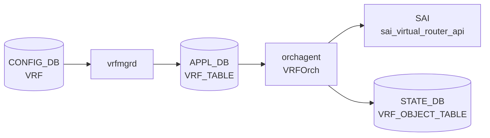

# APPL_DB VRF_TABLE テーブル

## 概要

`VRF_TABLE` は [APPL_DB](../../reference/glossary.md#term-appl_db) 上に存在する VRF エントリテーブル。`vrfmgrd` が CONFIG_DB `VRF` テーブルを購読し、Linux VRF デバイス (`ip vrf add`) を作成した後に `APP_VRF_TABLE_NAME = "VRF_TABLE"` へ pass-through 書き込みを行う[^vrfmgr]。`orchagent` 内の `VRFOrch` がこのテーブルを購読し、`sai_virtual_router_api->create_virtual_router()` を通じてハードウェア VRF (SAI Virtual Router) を生成する[^vrforch]。テーブル名定数は `schema.h:80` で `APP_VRF_TABLE_NAME = "VRF_TABLE"` と定義される[^schema]。

## key 構造

```text
VRF_TABLE|<vrfName>
```

`<vrfName>` は CONFIG_DB の `VRF` key と同一。YANG `sonic-vrf.yang` のパターン制約 `Vrf[a-zA-Z0-9_-]+` を満たす文字列（例: `VrfRed`）および `mgmt` が書き込まれる。

## フィールド一覧

| フィールド | 型 | 必須 | 説明 |
|-----------|----|------|------|
| `fallback` | boolean | - | CONFIG_DB から pass-through。orchagent で **silent drop** (dead field) |
| `vni` | uint32 | - | L3 VNI マッピング。`0` = なし |
| `v4` | boolean | - | IPv4 admin state (YANG 未定義・VNET 経由のみ) |
| `v6` | boolean | - | IPv6 admin state (YANG 未定義・VNET 経由のみ) |
| `src_mac` | MAC address | - | Virtual Router の送信元 MAC (YANG 未定義) |
| `ttl_action` | packet action | - | TTL=1 パケットの処理 (YANG 未定義) |
| `ip_opt_action` | packet action | - | IP オプション付きパケットの処理 (YANG 未定義) |
| `l3_mc_action` | packet action | - | L3 マルチキャスト unknown の処理 (YANG 未定義) |
| `mgmtVrfEnabled` | boolean | - | orchagent で **explicit ignore** |
| `in_band_mgmt_enabled` | boolean | - | orchagent で **explicit ignore** |

## 書き込み主体

- `vrfmgrd`: CONFIG_DB `VRF` のフィールドを `kfvFieldsValues(t)` でそのまま転送する (`vrfmgr.cpp:303`)。フィールドの追加・補完・変換は行わない。

## 購読者

- `orchagent` / `VRFOrch`: `VRF_TABLE` を `SubscriberStateTable` で購読。`sai_virtual_router_api->create_virtual_router()` または `set_virtual_router_attribute()` を呼ぶ。成功後 `STATE_VRF_OBJECT_TABLE|<vrfName>` に `state=ok` を書き込む[^vrforch]。

<!-- cdb-mermaid -->
### データフロー (自動生成)



!!! note "凡例"
    CONFIG_DB → APPL_DB → SAI の典型経路。vrfmgrd が APPL_DB 書き込み主体。
<!-- /cdb-mermaid -->

## 制約

- `vni` を一度設定した VRF に別の VNI を設定しようとすると `VRFOrch::updateVrfVNIMap` が `"VRF is already mapped to vni"` エラーを返す。一旦 `vni=0` にリセットが必要[^vrforch]。
- `ref_count > 0`（インタフェース・ルートが参照中）の VRF は削除できない (`vrforch.cpp:169-170`)。
- VRF 削除時は `STATE_VRF_OBJECT_TABLE` のエントリも削除される (`m_stateVrfObjectTable.del`、vrforch.cpp:193)。

## 引用元

[^vrfmgr]: `sonic-swss/cfgmgr/vrfmgr.cpp`. <https://github.com/sonic-net/sonic-swss/blob/4305596156d70e9797e8a881b3d19b46de0bce0d/cfgmgr/vrfmgr.cpp>
[^vrforch]: `sonic-swss/orchagent/vrforch.cpp`. <https://github.com/sonic-net/sonic-swss/blob/4305596156d70e9797e8a881b3d19b46de0bce0d/orchagent/vrforch.cpp>
[^schema]: `sonic-swss-common/common/schema.h`. <https://github.com/sonic-net/sonic-swss-common/blob/158de8d3463ff4b841653f6d57190bb142b80d9c/common/schema.h>

<!-- defaults -->
## フィールドの暗黙デフォルト・コード由来挙動 (Phase A)

> 調査日 2026-05-15。ソース: `sonic-swss/orchagent/vrforch.cpp`、`vrforch.h`、`cfgmgr/vrfmgr.cpp`、`sonic-swss-common/common/schema.h`

### vrfmgrd の pass-through 挙動

`vrfmgrd` (`vrfmgr.cpp:303`) は CONFIG_DB フィールドを加工せずそのまま APP_DB へ転送する。フィールド省略はそのまま省略として `VRFOrch` に届く。

```cpp
m_appVrfTableProducer.set(vrfName, kfvFieldsValues(t));
```

### `vni` — コード由来デフォルト `0`

`VRFOrch::addOperation` の先頭で `uint32_t vni = 0` と初期化される (`vrforch.cpp:30`)。フィールド省略時または明示的 `vni=0` の場合、`vni != 0` 条件が成立せず `updateVrfVNIMap()` は呼ばれない。VNI マッピングなしが暗黙デフォルト。

```cpp
uint32_t vni = 0;                              // vrforch.cpp:30
...
else if (name == "vni")
{
    vni = static_cast<uint32_t>(request.getAttrUint(name));
    continue;  // SAI attrs には追加しない
}
...
if (vni != 0)
{
    error = updateVrfVNIMap(vrf_name, vni);    // VNI マッピング処理
}
```

### `v4` / `v6` — SAI デフォルト依存 (YANG 未定義)

フィールドが存在する場合は `SAI_VIRTUAL_ROUTER_ATTR_ADMIN_V4_STATE` / `ADMIN_V6_STATE` に変換されるが、CONFIG_DB `sonic-vrf.yang` に定義がなく通常の `config vrf add` では書き込まれない。省略時は SAI attrs に追加されないため SAI/ASIC 実装のデフォルト値が使用される。VNET テーブル経由で直接書き込む場合にのみ機能する残存コード。

### `src_mac` — 省略時はスイッチ MAC を SAI が使用 (YANG 未定義)

フィールドが存在する場合は `SAI_VIRTUAL_ROUTER_ATTR_SRC_MAC_ADDRESS` に変換。省略時は SAI 側がスイッチのデフォルト MAC を適用する。YANG 未定義・通常経路では書き込まれない。

### `ttl_action` / `ip_opt_action` / `l3_mc_action` — 省略時は SAI デフォルト (YANG 未定義)

| フィールド | SAI 属性 | 省略時の挙動 |
|-----------|---------|------------|
| `ttl_action` | `VIOLATION_TTL1_PACKET_ACTION` | SAI デフォルト（通常 `TRAP`） |
| `ip_opt_action` | `VIOLATION_IP_OPTIONS_PACKET_ACTION` | SAI デフォルト |
| `l3_mc_action` | `UNKNOWN_L3_MULTICAST_PACKET_ACTION` | SAI デフォルト |

いずれも `request.getAttrPacketAction(name)` で SAI attrs に変換されるが、YANG 未定義のため通常 APP_DB に書き込まれない。

### `mgmtVrfEnabled` / `in_band_mgmt_enabled` — explicit ignore

`VRFOrch` はこれらのフィールドを明示的に読み飛ばす。SAI 属性への変換も STATE_DB への書き込みも行わない。

```cpp
// vrforch.cpp:74-78
else if ((name == "mgmtVrfEnabled") || (name == "in_band_mgmt_enabled"))
{
    SWSS_LOG_INFO("MGMT VRF field: %s ignored", name.c_str());
    continue;
}
```

### `fallback` — dead field (silent drop at orchagent)

`vrforch.h:34` で `{ "fallback", REQ_T_BOOL }` として宣言されているが、`VRFOrch::addOperation` のすべての if/else チェーンに `"fallback"` の分岐が存在しない。結果として `else` ブランチに落ち `SWSS_LOG_ERROR("Logic error: Unknown attribute: %s")` が出力されてフィールドが破棄される。

- `vrfmgrd` は `fallback` を pass-through するため APP_DB には届く
- `VRFOrch` がそれを silent drop → **SAI・Linux カーネル・FRR のいずれにも影響しない**
- `fallback=true` を CONFIG_DB に設定してもデフォルト VRF へのフォールバックは機能しない
- これは **dead field** であり YANG `default false` のみが有効な設定状態

### STATE_DB 書き戻し

`VRFOrch` は VRF 作成・更新成功後に `STATE_VRF_OBJECT_TABLE|<vrfName>` へ `state=ok` を書き込む (`vrforch.cpp:120, 150`)。この state は `vrfmgrd::isVrfObjExist()` による削除タイミング制御に使用される。

<!-- /defaults -->

<!-- platform -->
## プラットフォーム / SAI Capability 差異 (Phase H)

APPL_DB `VRF_TABLE` のスキーマ自体はプラットフォーム共通だが、`VRFOrch::addOperation` が SAI Virtual Router に渡す拡張属性 4 種 (`src_mac` / `ttl_action` / `ip_opt_action` / `l3_mc_action`) は SAI 任意属性であり、ASIC SAI 実装と VS/VPP シムで挙動が異なる。さらに `vni != 0` の L3 VNI マッピングは EVPN VTEP 事前作成を必須とする。

### VRF / VNET capability 4 属性

`vrforch.cpp:48-67` の if/else チェーンで以下のとおり SAI 属性へ無条件変換され、capability チェック・fallback はない。SAI が `SAI_STATUS_NOT_SUPPORTED` を返した場合は `task_failed` で APPL_DB エントリが再試行キューに残る。

| APPL_DB フィールド | SAI 属性 | 実装状況 |
|--------------------|---------|---------|
| `src_mac` | `SAI_VIRTUAL_ROUTER_ATTR_SRC_MAC_ADDRESS` | 主要 ASIC 必須属性。VS / VPP も受理 (no-op) |
| `ttl_action` | `SAI_VIRTUAL_ROUTER_ATTR_VIOLATION_TTL1_PACKET_ACTION` | SAI 任意。Broadcom / Mellanox / Cisco silicon-one OK。古い SDK / VPP は `NOT_SUPPORTED` の可能性 |
| `ip_opt_action` | `SAI_VIRTUAL_ROUTER_ATTR_VIOLATION_IP_OPTIONS_PACKET_ACTION` | 同上 |
| `l3_mc_action` | `SAI_VIRTUAL_ROUTER_ATTR_UNKNOWN_L3_MULTICAST_PACKET_ACTION` | L3 マルチキャスト未対応 ASIC / VS / VPP では `NOT_SUPPORTED` の可能性 |

YANG `sonic-vrf.yang` には 4 属性のいずれも定義がない（`vni` / `fallback` / `description` のみ）ため、`config vrf add` 経由では書き込まれない。`VNET` テーブル経由で `vnetorch` が APPL_DB `VRF_TABLE` を直書きする非標準経路でのみ capability 差が顕在化する。

### VS (`libsaivs`)

`SAI_OBJECT_TYPE_VIRTUAL_ROUTER` の create/remove は内部 map 操作のみで、4 属性すべて SUCCESS で受理する。実 ASIC が無いため packet action / src_mac は no-op。

### VPP (`libsaivpp` / `sonic-sairedis/vslib/vpp`)

`SwitchVpp.cpp:1183-1187` で VRF remove は `removeVrf()` (`SwitchVppRif.cpp:1940-1955`) に分岐し、`m_switchConfig->m_useTapDevice == true` のとき `vpp_del_ip_vrf()` で VPP データプレーン側の VRF も同期削除する。`vpp_add_ip_vrf()` (`SwitchVppRif.cpp:1387-1419`) は `ip_vrf_add(vrf_id, "vrf_<n>", false)` で VPP VRF を作成し、`vpp_ip_flow_hash_set()` で 5-tuple ハッシュ (`SRC_IP|DST_IP|SRC_PORT|DST_PORT|PROTO`) を固定設定する。VPP では VRF ハッシュマスクは APPL_DB / SAI 側から制御不可で 5-tuple 固定。4 capability 属性は VS と同じく no-op。

### EVPN VTEP 依存（`vni != 0` の前提条件）

`vni != 0` を指定して L3 VNI を VRF にマップする場合、`VRFOrch::updateVrfVNIMap` (`vrforch.cpp:225-230`) は `EvpnNvoOrch::getEVPNVtep()` で **CONFIG_DB `VXLAN_EVPN_NVO` 経由で作成済みの source VTEP** を取得することを必須とする。VTEP 未設定で `vni > 0` の VRF エントリを APPL_DB に書くと VRFOrch は failure 復路で抜け、`STATE_VRF_OBJECT_TABLE|<vrfName>` の `state=ok` 書き込みも `vrf_vni_map_table_[vrf_name] = vni` も発生しない。さらに `VxlanTunnelOrch::getVlanMappedToVni(vni)` が 0 を返す場合（VLAN-VNI map 未投入）、`updateL3VniStatus()` は呼ばれず L3 VNI は半設定状態となる。

### プラットフォーム影響まとめ

| 観点 | Broadcom DNX / XGS | Mellanox | Cisco silicon-one | VS | VPP |
|------|--------------------|----------|--------------------|----|-----|
| `src_mac` SAI 属性 | OK | OK | OK | OK (no-op) | OK (no-op) |
| `ttl_action` / `ip_opt_action` | OK | OK | OK | OK (no-op) | OK (no-op) |
| `l3_mc_action` | OK (一部 SKU) | OK | OK | OK (no-op) | OK (no-op) |
| `vni` (L3 VNI) 実データプレーン転送 | DNX OK / XGS 一部 | OK | OK | dummy | dummy |
| EVPN VTEP 事前作成必須 | あり | あり | あり | あり (受理のみ) | あり (受理のみ) |
| VRF 削除時の外部同期 | 不要 | 不要 | 不要 | 不要 | `m_useTapDevice=true` のみ VPP に伝搬 |

詳細根拠は `meta/_intermediate/cdb-flow/appl-vrf-platform.md` を参照。
<!-- /platform -->

## 関連ページ

- [CONFIG_DB VRF テーブル](./vrf.md)
- [STATE_DB VRF テーブル](./state-vrf.md)
- [APPL_DB ROUTE_TABLE](./appl-db-route.md)
- [HLD: VRF サポート](../../routing/sonic-vrf-support-design-spec-draft.md)
