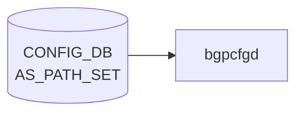

# AS_PATH_SET テーブル

## 概要

[BGP](../../reference/glossary.md#term-bgp) の AS path access-list を [CONFIG_DB](../../reference/glossary.md#term-config_db) に持たせるテーブル[^1]。`sonic-routing-policy-sets.yang` の `AS_PATH_SET` コンテナで定義され、`ROUTE_MAP` の `match as-path` 等から参照される。

<!-- cdb-mermaid -->
### データフロー (自動生成)



!!! note "凡例"
    CONFIG_DB から SAI までの典型経路を `docs/reference/config-db-orch-map.md` から機械生成したミニ図。詳細・例外は本ページ本文と対応表を参照。
<!-- /cdb-mermaid -->

## key 構造

```text
AS_PATH_SET|<name>
```

## フィールド

| フィールド | 型 | 説明 |
|-----------|----|------|
| `name` | string | AS path access-list 名（key） |
| `action` | enum `permit` / `deny` | リストの action |
| `as_path_set_member` | leaf-list string (ordered-by user) | AS path 正規表現の集合。順序維持 |

## 制約

- `as_path_set_member` は `ordered-by user`。ユーザ指定順を維持する
- メンバは正規表現文字列（[FRR](../../reference/glossary.md#term-frr) `bgp as-path access-list` の regex 構文）

## 購読者

- `frr-mgmt-framework`: [BGP](../../reference/glossary.md#term-bgp) AS path access-list として [FRR](../../reference/glossary.md#term-frr) (`bgpd`) に反映

## 関連 CONFIG_DB / YANG / CLI

- 関連 [CONFIG_DB](../../reference/glossary.md#term-config_db): [`COMMUNITY_SET`](./community-set.md)、[`PREFIX_SET`](./prefix-set.md)、`ROUTE_MAP`
- 関連 [YANG](../../reference/glossary.md#term-yang): `sonic-routing-policy-sets`
- 関連 CLI: なし（`config_db.json` 投入）

<!-- cdb-exceptions -->
## 例外条件・特殊挙動

| 条件 | 挙動 |
|------|------|
| `as_path_set_member` が空リストまたは DEL | 既存の `bgp as-path access-list <name>` を全削除してから再作成 |
| `args` 不足（内部チェック） | None を返し FRR push をスキップ |
| FRR コマンド実行失敗 | syslog ERR & continue、再試行なし |
| 存在しないセット名への DEL | `pop(name, None)` で KeyError なし |
| `as_path_set_member` の正規表現値不正 | frrcfgd 側では未検証、FRR 側がエラーを返す |
| 更新操作 | 差分追加ではなく常に全置換（先に既存全削除） |

<!-- evidence: sonic-net/sonic-buildimage/src/sonic-frr-mgmt-framework/frrcfgd/frrcfgd.py:1009L -->
<!-- /cdb-exceptions -->

<!-- value-behavior -->
## 値依存挙動マトリクス

### `action` (enum)

| 値 | FRR 生成コマンド | 効果 | evidence |
|---|---|---|---|
| `permit` | `bgp as-path access-list <name> permit <regex>` | AS path が regex に一致したプレフィックスを許可 | `bgpcfgd/managers_as_path.py:56; sonic-routing-policy-sets.yang:permit` |
| `deny` | `bgp as-path access-list <name> deny <regex>` | AS path が regex に一致したプレフィックスを拒否 | `sonic-routing-policy-sets.yang:deny` |

### フリーフォームフィールド

- `as_path_set_member` (leaf-list string) — FRR AS path 正規表現文字列。`ordered-by user` で登録順が評価順になる。値自体は freeform (FRR 側が構文検証)
- 更新時は差分ではなく全削除後に全再作成 (`bgpcfgd/managers_as_path.py:65`)
<!-- /value-behavior -->

<!-- defaults -->
## コード由来の暗黙デフォルト

YANG `default` 文が存在しないフィールドでもコードが暗黙の値を強制する場合がある。以下は全行精読による per-field 調査結果。

| フィールド | YANG default | コード実効デフォルト | パターン | 根拠 |
|-----------|-------------|-------------------|---------|------|
| `name` | なし（key） | なし（必須） | — | `frrcfgd.py:2999` key から直取得 |
| `action` | なし | **常に `permit`（フィールド無視）** | hardcode literal | `bgpd.conf.db.j2:16`; `frrcfgd.py:1018` |
| `as_path_set_member` | なし | 省略/空 → FRR push なし | `.get(..., None)` + `len > 0` guard | `frrcfgd.py:1016,2251,3005`; `bgpd.conf.db.j2:14` |

### `action` フィールドの実装乖離

`action`（`permit` / `deny`）は YANG スキーマに定義されているが、**両コンシューマで完全に無視されている**:

- `bgpd.conf.db.j2:16` — `bgp as-path access-list {{key}} permit {{path}}` と `permit` をテンプレートにハードコード。`action` キーを参照しない
- `frrcfgd.py:1018` — `'{} permit {}'.format(as_set_name, asn)` で `permit` をハードコード。`action` を key_map に含まない（`aspath_set_key_map` 参照）

結果として `action: deny` を CONFIG_DB に投入しても FRR には `bgp as-path access-list <name> permit <regex>` が発行される。`deny` として機能させることはできない（コード変更が必要）。

### `as_path_set_member` の空リスト挙動

- キーが存在しない場合: `frrcfgd.py:2251` `if 'as_path_set_member' in entry:` ガード → `as_path_set_list` に未登録
- 空リスト (`[]`) の場合: `frrcfgd.py:1016` `len(args[1]) > 0` ガード → FRR コマンド未発行
- DEL 操作時: 既存 access-list を `no bgp as-path access-list <name>` で全削除してから再作成（`frrcfgd.py:1015`）
<!-- /defaults -->

<!-- constants -->
## ハードコード定数 (Phase E)

`bgpcfgd` (`AsPathMgr`) と `frrcfgd` (sonic-frr-mgmt-framework) の両経路を全行精読して抽出した、AS_PATH_SET 処理に埋め込まれた固定リテラル・定数。SONiC レイヤには **regex 長やエントリ数の上限値は一切定義されていない**（FRR `bgpd` 内部の天井に委譲）。

### action enum（YANG `routing-policy-action-type`）と実装乖離

| enum 値 | 出典 | 実装上の扱い |
|---|---|---|
| `permit` | `sonic-routing-policy-sets.yang:30` | 両 consumer で**唯一発行されるリテラル**としてハードコード |
| `deny` | `sonic-routing-policy-sets.yang:33` | コード経路が存在せず**完全無視**（DISCREPANCY） |

- `bgpd.conf.db.j2:16` — `bgp as-path access-list {{key}} permit {{path}}` (リテラル `permit`)
- `frrcfgd.py:1018` — `'{} permit {}'.format(as_set_name, asn)` (リテラル `permit`)

### FRR コマンドテンプレート（文字列リテラル）

| 用途 | リテラル | ソース |
|---|---|---|
| frrcfgd ADD (key_map) | `bgp as-path access-list {} permit {}` | `frrcfgd.py:1977` |
| j2 経路 ADD | `bgp as-path access-list {{key}} permit {{path}}` | `bgpd.conf.db.j2:16` |
| 全削除 (pre-update) | `no bgp as-path access-list <name>` | `frrcfgd.py:1015` |
| AsPathMgr ADD | `bgp as-path access-list T2_GROUP_ASNS permit _<asn>_` | `managers_as_path.py:56` |
| AsPathMgr DEL | `no bgp as-path access-list T2_GROUP_ASNS` | `managers_as_path.py:52,65` |

### AsPathMgr (bgpcfgd) のハードコード識別子

`AsPathMgr` は AS_PATH_SET テーブルではなく `DEVICE_METADATA[localhost].t2_group_asns` を購読し、**固定名 `T2_GROUP_ASNS` で 1 本だけ** access-list を生成する別経路を持つ。

| 定数 | 値 | 役割 | ソース |
|---|---|---|---|
| `T2_GROUP_ASNS` | `"T2_GROUP_ASNS"` | AsPathMgr が生成する固定 access-list 名 | `managers_as_path.py:7` |
| key フィルタ | 文字列 `"localhost"` 直比較 | DEVICE_METADATA の特定 key のみ処理 | `managers_as_path.py:31,61` |
| 内部キー名 | 文字列 `"t2_group_asns"` 直比較 | data dict 抽出時の固定キー | `managers_as_path.py:35` |
| ASN 区切り | `","` | `t2_group_asns` 値の split 区切り | `managers_as_path.py:40` |
| ASN regex 埋込パターン | `_<asn>_` | FRR 正規表現として ASN を境界付きで埋める | `managers_as_path.py:56` |
| 再同期用 regex | `r"bgp as-path access-list T2_GROUP_ASNS seq \d+ permit _(\d+)_"` | FRR 既存設定を読み戻す固定 regex | `managers_as_path.py:43` |

### frrcfgd 経路のガード・バインド定数

| 項目 | 値 | 役割 | ソース |
|---|---|---|---|
| daemon バインド | `'bgpd'` | AS_PATH_SET は bgpd のみへ送信 | `frrcfgd.py:96` |
| 必須引数下限 | `len(args) < 2` で None 返却 | 不足時 FRR push 抑止 | `frrcfgd.py:1010-1011` |
| 空リストガード | `len(args[1]) > 0` | 空メンバ時 ADD 発行抑止 | `frrcfgd.py:1016` |
| 初期スキャン条件 | `'as_path_set_member' in entry` | startup 時、メンバキー持ち entry のみ登録 | `frrcfgd.py:2251` |

### SONiC レイヤに存在しない上限

| 項目 | SONiC 側上限 | 備考 |
|---|---|---|
| `name` 長 | **なし** | YANG `string`（length 制約なし） |
| `as_path_set_member` 長（regex 文字列） | **なし** | YANG `string`（length 制約なし）、FRR `bgpd` 内部上限のみ |
| メンバ数 (entry 数 / leaf-list 要素数) | **なし** | `aspath_set_key_map` / `as_path_set_list` は dict 無制限 |
| AS_PATH_SET エントリ総数 | **なし** | 上記同様 |

> regex 上限・entry 上限を SONiC コード内で探したが**該当する定数は存在しない**。長大 regex は FRR `bgpd` の内部パーサ上限と `vtysh` レスポンス遅延として運用上現れる。

### 特記事項

1. `action: deny` は YANG では定義済みだが両 consumer で `permit` がハードコードされ、`deny` を発行する経路がコード上**存在しない**。
2. UPDATE 時は「先に `no bgp as-path access-list <name>` で全削除 → 再 ADD」シーケンス。差分追加はせず常に全置換（`frrcfgd.py:1015-1019`）。短時間ながら access-list 不在の窓が空く。
3. AsPathMgr の再同期 regex (`managers_as_path.py:43`) は FRR `show running` の出力フォーマット（`seq <数> permit _<asn>_`）に強く依存。FRR バージョン差で破綻し得る脆い実装。

<!-- evidence: managers_as_path.py:7,31,35,40,43,52,56,61,65; frrcfgd.py:96,1009-1020,1977,2251; bgpd.conf.db.j2:11-20; sonic-routing-policy-sets.yang:28-39,217-240 -->

> **スキャン証跡**: `managers_as_path.py` 全 67 行、`frrcfgd.py` AS_PATH_SET 関連箇所、`bgpd.conf.db.j2`、`sonic-routing-policy-sets.yang` action enum 定義部すべて読了。中間ファイル: `meta/_intermediate/cdb-flow/as-path-set-constants.md`
<!-- /constants -->

<!-- platform -->
## プラットフォーム差 (Phase H)

**プラットフォーム差なし**: AS_PATH_SET は FRR (`bgpd`) 制御プレーン上の AS path access-list で SAI 非経由。ASIC 種別 (Broadcom / Mellanox / Marvell / Innovium / VPP)・VOQ chassis / chassis-packet・multi-asic namespace・ベンダー image_config のいずれにも分岐コードは存在しない。

| 観点 | 結果 | 根拠 |
|------|------|------|
| ASIC 種別 | 影響なし | SAI 非経由 (FRR `bgpd` 内部 access-list)。orchagent / syncd 経由なし |
| multi-asic (`asicN` namespace) | 各 namespace 独立・同一ロジック | `frrcfgd` は per-namespace 起動。AS_PATH_SET ハンドラ (`frrcfgd.py:1009-1020, 2998-3011`) に namespace 分岐なし |
| `switch_type` (voq / chassis-packet) | 影響なし | `managers_as_path.py` 全 67 行・`frrcfgd.py` AS_PATH_SET ハンドラ部を `platform\|asic\|switch_type\|chassis\|sub_role\|namespace\|vendor` で grep して 0 ヒット |
| `sub_role` (FrontEnd / BackEnd) | 影響なし | 同上で参照 0 |
| `DEVICE_METADATA.type` / `subtype` | **AsPathMgr (T2_GROUP_ASNS 固定経路) の登録 gate のみ** — AS_PATH_SET テーブル自身には影響しない | `bgpcfgd/main.py:122-130` (`SpineRouter`+`UpstreamLC` または `UpperSpineRouter` のみ AsPathMgr 起動) |
| ベンダー固有 hook | なし | `files/image_config/` / `files/build_templates/` を `as.?path.?set\|aspath_set` で grep して 0 ヒット |
| テンプレート内分岐 (`bgpd.conf.db.j2`) | プラットフォーム条件なし | L11-20 AS_PATH_SET ブロックに `` 0 |

注意: `DEVICE_METADATA.type` / `subtype` は HW プラットフォームではなく **論理トポロジー role** で、`AsPathMgr` (T2_GROUP_ASNS 経路) の起動可否のみを左右する。ユーザが `AS_PATH_SET|<name>` を CONFIG_DB に直接入れる経路は role に関わらず常時 `frrcfgd` 経由で FRR に反映される。

詳細根拠は `meta/_intermediate/cdb-flow/as-path-set-platform.md` を参照。
<!-- /platform -->

<!-- ref-triangle:start -->

## 関連リファレンス

- [YANG](../../reference/glossary.md#term-yang): `sonic-routing-policy-sets`

<!-- ref-triangle:end -->

## 引用元

[^1]: [YANG](../../reference/glossary.md#term-yang) 定義: `sonic-routing-policy-sets.yang`. <https://github.com/sonic-net/sonic-buildimage/blob/9ea932ec2e18f35e58268ec2e4456b1d4afd65cd/src/sonic-yang-models/yang-models/sonic-routing-policy-sets.yang>

<!-- ops-hint -->
## 運用ヒント

### 典型値

- key 形式: `AS_PATH_SET|<name>` (例: `AS_PATH_SET|UPSTREAM_FILTER`)。
- `action`: `permit` / `deny`。
- `as_path_set_member`: 正規表現文字列のリスト (例 `^65001_`, `_65000$`)。

### よくある誤設定

- [FRR](../../reference/glossary.md#term-frr) 形式と Cisco/Quagga 形式の AS path regex を混在させて意図と異なるマッチになる。
- `as_path_set_member` の順序が結果に影響することを忘れる (`ordered-by user`、上から評価)。

### 確認コマンド

```bash
sonic-db-cli CONFIG_DB keys 'AS_PATH_SET|*'
vtysh -c "show ip as-path-access-list"
```
<!-- /ops-hint -->


<!-- runtime-trace -->
## 実コンテナ動作トレース

### 段階 1 — Consumer 登録

`bgpcfgd` (`sonic-bgpcfgd`) が CONFIG_DB の `AS_PATH_SET` テーブルを購読する。

`bgpcfgd` は `ConfigDBConnector.listen()` で `BGP_PEER_RANGE`/`BGP_GLOBALS` 等と合わせて購読。

### 段階 2 — CFG→APPL 翻訳

なし (FRR vtysh コマンドで直接 BGP デーモンに注入)

### 段階 3 — APPL→SAI

なし (SAI 非経由 — FRR プロセス内部で AS-path フィルタとして使用)

### 段階 4 — タイミングと副作用

**適用タイミング**: CONFIG_DB 変化を `bgpcfgd` が検知後、FRR `vtysh -c` コマンドを発行。FRR BGP デーモンは即時反映。

**副作用**: FRR プロセスへの設定注入のみ。既存 BGP セッションには次回 UPDATE 送信時または policy soft-clear 実施時に適用。
<!-- /runtime-trace -->

<!-- entry-points -->
## 書き込み入り口 (Direction A)

対象テーブル: `AS_PATH_SET`

### CLI
- `config route-map as-path-set add <name> <pattern>`
- `config route-map as-path-set delete <name>`
  - ソース: `sonic-utilities/config/main.py (route-map グループ)`

### minigraph / sonic-cfggen
- なし

### REST / gNMI (sonic-mgmt-common)
- sonic-mgmt-common translib でルーティングポリシー OpenConfig モデル経由の書き込みが可能

### db_migrator
- なし

### ビルド時デフォルト (init_cfg / j2 テンプレート)
- なし

### ハードコードデフォルト
- なし

### ランタイム注入 (デーモン自動書き込み)
- なし
<!-- /entry-points -->

<!-- side-effects -->
## 副次 DB 書込 (Phase F)

CONFIG_DB `AS_PATH_SET` テーブルの変更に伴って主購読者 `frrcfgd` (`sonic-frr-mgmt-framework`) および補助購読経路 `AsPathMgr` (`sonic-bgpcfgd`) が副次的に書き込む DB エントリは **存在しない**。副作用はすべて [FRR](../../reference/glossary.md#term-frr) `bgpd` プロセスへの vtysh コマンド送出に閉じる。

| 副次 DB | 書込有無 | 根拠 |
|---|---|---|
| APPL_DB | なし | `frrcfgd.py` の `swsscommon` import は `ConfigDBConnector` のみ。`hdl_aspath_set` (`frrcfgd.py:1009-1020`) は `cmd_str.format(...)` で FRR vtysh コマンド文字列を返すだけで `ProducerStateTable` / `Table` を生成しない |
| STATE_DB | なし | `frrcfgd.py` 全体および `managers_as_path.py:1-67` に `STATE_DB` / `state_db` 参照 0 件 |
| COUNTERS_DB | なし | 同上、`COUNTERS_DB` 参照 0 件。AS path access-list は FRR `bgpd` プロセス内のフィルタで SONiC レイヤに統計テーブルを持たない |
| その他 (ASIC_DB / FLEX_COUNTER_DB / LOGLEVEL_DB) | なし | SAI 非経由 (段階 3 トレース参照)。`sonic-swss/` 内に `AS_PATH_SET` を購読する mgrd/orchagent は存在しない |

主購読者 2 経路の主作用はいずれも FRR デーモンへの `bgp as-path access-list <name> permit <regex>` / `no bgp as-path access-list <name>` の vtysh 送出のみ (`frrcfgd.py:1015-1019` / `managers_as_path.py:52,56,65`)。`AsPathMgr.set_handler` は `cfg_mgr.update()` で FRR running-config を読み戻すが (`managers_as_path.py:45-49`)、これは FRR テキスト config の読み出しであって DB 書込ではない。起動時 Jinja2 (`bgpd.conf.db.j2:11-20`) も `/etc/frr/bgpd.conf` 系のテキストファイルを生成するのみ。

詳細スキャン手順と grep 結果は `meta/_intermediate/cdb-flow/as-path-set-side.md` を参照。
<!-- /side-effects -->

<!-- glossary-links-injected: 3c93d6c0b6a4 -->
