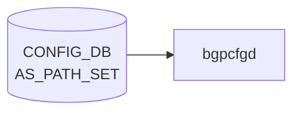

# AS_PATH_SET テーブル

## 概要

[BGP](../../reference/glossary.md#term-bgp) の AS path access-list を [CONFIG_DB](../../reference/glossary.md#term-config_db) に持たせるテーブル[^1]。`sonic-routing-policy-sets.yang` の `AS_PATH_SET` コンテナで定義され、`ROUTE_MAP` の `match as-path` 等から参照される。

<!-- cdb-mermaid -->
### データフロー (自動生成)



!!! note "凡例"
    CONFIG_DB から SAI までの典型経路を `docs/reference/config-db-orch-map.md` から機械生成したミニ図。詳細・例外は本ページ本文と対応表を参照。
<!-- /cdb-mermaid -->

## key 構造

```text
AS_PATH_SET|<name>
```

## フィールド

| フィールド | 型 | 説明 |
|-----------|----|------|
| `name` | string | AS path access-list 名（key） |
| `action` | enum `permit` / `deny` | リストの action |
| `as_path_set_member` | leaf-list string (ordered-by user) | AS path 正規表現の集合。順序維持 |

## 制約

- `as_path_set_member` は `ordered-by user`。ユーザ指定順を維持する
- メンバは正規表現文字列（[FRR](../../reference/glossary.md#term-frr) `bgp as-path access-list` の regex 構文）

## 購読者

- `frr-mgmt-framework`: [BGP](../../reference/glossary.md#term-bgp) AS path access-list として [FRR](../../reference/glossary.md#term-frr) (`bgpd`) に反映

## 関連 CONFIG_DB / YANG / CLI

- 関連 [CONFIG_DB](../../reference/glossary.md#term-config_db): [`COMMUNITY_SET`](./community-set.md)、[`PREFIX_SET`](./prefix-set.md)、`ROUTE_MAP`
- 関連 [YANG](../../reference/glossary.md#term-yang): `sonic-routing-policy-sets`
- 関連 CLI: なし（`config_db.json` 投入）

<!-- cdb-exceptions -->
## 例外条件・特殊挙動

| 条件 | 挙動 |
|------|------|
| `as_path_set_member` が空リストまたは DEL | 既存の `bgp as-path access-list <name>` を全削除してから再作成 |
| `args` 不足（内部チェック） | None を返し FRR push をスキップ |
| FRR コマンド実行失敗 | syslog ERR & continue、再試行なし |
| 存在しないセット名への DEL | `pop(name, None)` で KeyError なし |
| `as_path_set_member` の正規表現値不正 | frrcfgd 側では未検証、FRR 側がエラーを返す |
| 更新操作 | 差分追加ではなく常に全置換（先に既存全削除） |

<!-- evidence: sonic-net/sonic-buildimage/src/sonic-frr-mgmt-framework/frrcfgd/frrcfgd.py:1009L -->
<!-- /cdb-exceptions -->

<!-- value-behavior -->
## 値依存挙動マトリクス

### `action` (enum)

| 値 | FRR 生成コマンド | 効果 | evidence |
|---|---|---|---|
| `permit` | `bgp as-path access-list <name> permit <regex>` | AS path が regex に一致したプレフィックスを許可 | `bgpcfgd/managers_as_path.py:56; sonic-routing-policy-sets.yang:permit` |
| `deny` | `bgp as-path access-list <name> deny <regex>` | AS path が regex に一致したプレフィックスを拒否 | `sonic-routing-policy-sets.yang:deny` |

### フリーフォームフィールド

- `as_path_set_member` (leaf-list string) — FRR AS path 正規表現文字列。`ordered-by user` で登録順が評価順になる。値自体は freeform (FRR 側が構文検証)
- 更新時は差分ではなく全削除後に全再作成 (`bgpcfgd/managers_as_path.py:65`)
<!-- /value-behavior -->

<!-- ref-triangle:start -->

## 関連リファレンス

- [YANG](../../reference/glossary.md#term-yang): `sonic-routing-policy-sets`

<!-- ref-triangle:end -->

## 引用元

[^1]: [YANG](../../reference/glossary.md#term-yang) 定義: `sonic-routing-policy-sets.yang`. <https://github.com/sonic-net/sonic-buildimage/blob/9ea932ec2e18f35e58268ec2e4456b1d4afd65cd/src/sonic-yang-models/yang-models/sonic-routing-policy-sets.yang>

<!-- ops-hint -->
## 運用ヒント

### 典型値

- key 形式: `AS_PATH_SET|<name>` (例: `AS_PATH_SET|UPSTREAM_FILTER`)。
- `action`: `permit` / `deny`。
- `as_path_set_member`: 正規表現文字列のリスト (例 `^65001_`, `_65000$`)。

### よくある誤設定

- [FRR](../../reference/glossary.md#term-frr) 形式と Cisco/Quagga 形式の AS path regex を混在させて意図と異なるマッチになる。
- `as_path_set_member` の順序が結果に影響することを忘れる (`ordered-by user`、上から評価)。

### 確認コマンド

```bash
sonic-db-cli CONFIG_DB keys 'AS_PATH_SET|*'
vtysh -c "show ip as-path-access-list"
```
<!-- /ops-hint -->

<!-- glossary-links-injected: 3c93d6c0b6a4 -->
