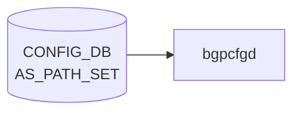

# AS_PATH_SET テーブル

## 概要

[BGP](../../reference/glossary.md#term-bgp) の AS path access-list を [CONFIG_DB](../../reference/glossary.md#term-config_db) に持たせるテーブル[^1]。`sonic-routing-policy-sets.yang` の `AS_PATH_SET` コンテナで定義され、`ROUTE_MAP` の `match as-path` 等から参照される。

<!-- cdb-mermaid -->
### データフロー (自動生成)



!!! note "凡例"
    CONFIG_DB から SAI までの典型経路を `docs/reference/config-db-orch-map.md` から機械生成したミニ図。詳細・例外は本ページ本文と対応表を参照。
<!-- /cdb-mermaid -->

## key 構造

```text
AS_PATH_SET|<name>
```

## フィールド

| フィールド | 型 | 説明 |
|-----------|----|------|
| `name` | string | AS path access-list 名（key） |
| `action` | enum `permit` / `deny` | リストの action |
| `as_path_set_member` | leaf-list string (ordered-by user) | AS path 正規表現の集合。順序維持 |

## 制約

- `as_path_set_member` は `ordered-by user`。ユーザ指定順を維持する
- メンバは正規表現文字列（[FRR](../../reference/glossary.md#term-frr) `bgp as-path access-list` の regex 構文）

## 購読者

- `frr-mgmt-framework`: [BGP](../../reference/glossary.md#term-bgp) AS path access-list として [FRR](../../reference/glossary.md#term-frr) (`bgpd`) に反映

## 関連 CONFIG_DB / YANG / CLI

- 関連 [CONFIG_DB](../../reference/glossary.md#term-config_db): [`COMMUNITY_SET`](./community-set.md)、[`PREFIX_SET`](./prefix-set.md)、`ROUTE_MAP`
- 関連 [YANG](../../reference/glossary.md#term-yang): `sonic-routing-policy-sets`
- 関連 CLI: なし（`config_db.json` 投入）

<!-- cdb-exceptions -->
## 例外条件・特殊挙動

| 条件 | 挙動 |
|------|------|
| `as_path_set_member` が空リストまたは DEL | 既存の `bgp as-path access-list <name>` を全削除してから再作成 |
| `args` 不足（内部チェック） | None を返し FRR push をスキップ |
| FRR コマンド実行失敗 | syslog ERR & continue、再試行なし |
| 存在しないセット名への DEL | `pop(name, None)` で KeyError なし |
| `as_path_set_member` の正規表現値不正 | frrcfgd 側では未検証、FRR 側がエラーを返す |
| 更新操作 | 差分追加ではなく常に全置換（先に既存全削除） |

<!-- evidence: sonic-net/sonic-buildimage/src/sonic-frr-mgmt-framework/frrcfgd/frrcfgd.py:1009L -->
<!-- /cdb-exceptions -->

<!-- value-behavior -->
## 値依存挙動マトリクス

### `action` (enum)

| 値 | FRR 生成コマンド | 効果 | evidence |
|---|---|---|---|
| `permit` | `bgp as-path access-list <name> permit <regex>` | AS path が regex に一致したプレフィックスを許可 | `bgpcfgd/managers_as_path.py:56; sonic-routing-policy-sets.yang:permit` |
| `deny` | `bgp as-path access-list <name> deny <regex>` | AS path が regex に一致したプレフィックスを拒否 | `sonic-routing-policy-sets.yang:deny` |

### フリーフォームフィールド

- `as_path_set_member` (leaf-list string) — FRR AS path 正規表現文字列。`ordered-by user` で登録順が評価順になる。値自体は freeform (FRR 側が構文検証)
- 更新時は差分ではなく全削除後に全再作成 (`bgpcfgd/managers_as_path.py:65`)
<!-- /value-behavior -->

<!-- defaults -->
## コード由来の暗黙デフォルト

YANG `default` 文が存在しないフィールドでもコードが暗黙の値を強制する場合がある。以下は全行精読による per-field 調査結果。

| フィールド | YANG default | コード実効デフォルト | パターン | 根拠 |
|-----------|-------------|-------------------|---------|------|
| `name` | なし（key） | なし（必須） | — | `frrcfgd.py:2999` key から直取得 |
| `action` | なし | **常に `permit`（フィールド無視）** | hardcode literal | `bgpd.conf.db.j2:16`; `frrcfgd.py:1018` |
| `as_path_set_member` | なし | 省略/空 → FRR push なし | `.get(..., None)` + `len > 0` guard | `frrcfgd.py:1016,2251,3005`; `bgpd.conf.db.j2:14` |

### `action` フィールドの実装乖離

`action`（`permit` / `deny`）は YANG スキーマに定義されているが、**両コンシューマで完全に無視されている**:

- `bgpd.conf.db.j2:16` — `bgp as-path access-list {{key}} permit {{path}}` と `permit` をテンプレートにハードコード。`action` キーを参照しない
- `frrcfgd.py:1018` — `'{} permit {}'.format(as_set_name, asn)` で `permit` をハードコード。`action` を key_map に含まない（`aspath_set_key_map` 参照）

結果として `action: deny` を CONFIG_DB に投入しても FRR には `bgp as-path access-list <name> permit <regex>` が発行される。`deny` として機能させることはできない（コード変更が必要）。

### `as_path_set_member` の空リスト挙動

- キーが存在しない場合: `frrcfgd.py:2251` `if 'as_path_set_member' in entry:` ガード → `as_path_set_list` に未登録
- 空リスト (`[]`) の場合: `frrcfgd.py:1016` `len(args[1]) > 0` ガード → FRR コマンド未発行
- DEL 操作時: 既存 access-list を `no bgp as-path access-list <name>` で全削除してから再作成（`frrcfgd.py:1015`）
<!-- /defaults -->

<!-- constants -->
## ハードコード定数 (Phase E)

`bgpcfgd` (`AsPathMgr`) と `frrcfgd` (sonic-frr-mgmt-framework) の両経路を全行精読して抽出した、AS_PATH_SET 処理に埋め込まれた固定リテラル・定数。SONiC レイヤには **regex 長やエントリ数の上限値は一切定義されていない**（FRR `bgpd` 内部の天井に委譲）。

### action enum（YANG `routing-policy-action-type`）と実装乖離

| enum 値 | 出典 | 実装上の扱い |
|---|---|---|
| `permit` | `sonic-routing-policy-sets.yang:30` | 両 consumer で**唯一発行されるリテラル**としてハードコード |
| `deny` | `sonic-routing-policy-sets.yang:33` | コード経路が存在せず**完全無視**（DISCREPANCY） |

- `bgpd.conf.db.j2:16` — `bgp as-path access-list {{key}} permit {{path}}` (リテラル `permit`)
- `frrcfgd.py:1018` — `'{} permit {}'.format(as_set_name, asn)` (リテラル `permit`)

### FRR コマンドテンプレート（文字列リテラル）

| 用途 | リテラル | ソース |
|---|---|---|
| frrcfgd ADD (key_map) | `bgp as-path access-list {} permit {}` | `frrcfgd.py:1977` |
| j2 経路 ADD | `bgp as-path access-list {{key}} permit {{path}}` | `bgpd.conf.db.j2:16` |
| 全削除 (pre-update) | `no bgp as-path access-list <name>` | `frrcfgd.py:1015` |
| AsPathMgr ADD | `bgp as-path access-list T2_GROUP_ASNS permit _<asn>_` | `managers_as_path.py:56` |
| AsPathMgr DEL | `no bgp as-path access-list T2_GROUP_ASNS` | `managers_as_path.py:52,65` |

### AsPathMgr (bgpcfgd) のハードコード識別子

`AsPathMgr` は AS_PATH_SET テーブルではなく `DEVICE_METADATA[localhost].t2_group_asns` を購読し、**固定名 `T2_GROUP_ASNS` で 1 本だけ** access-list を生成する別経路を持つ。

| 定数 | 値 | 役割 | ソース |
|---|---|---|---|
| `T2_GROUP_ASNS` | `"T2_GROUP_ASNS"` | AsPathMgr が生成する固定 access-list 名 | `managers_as_path.py:7` |
| key フィルタ | 文字列 `"localhost"` 直比較 | DEVICE_METADATA の特定 key のみ処理 | `managers_as_path.py:31,61` |
| 内部キー名 | 文字列 `"t2_group_asns"` 直比較 | data dict 抽出時の固定キー | `managers_as_path.py:35` |
| ASN 区切り | `","` | `t2_group_asns` 値の split 区切り | `managers_as_path.py:40` |
| ASN regex 埋込パターン | `_<asn>_` | FRR 正規表現として ASN を境界付きで埋める | `managers_as_path.py:56` |
| 再同期用 regex | `r"bgp as-path access-list T2_GROUP_ASNS seq \d+ permit _(\d+)_"` | FRR 既存設定を読み戻す固定 regex | `managers_as_path.py:43` |

### frrcfgd 経路のガード・バインド定数

| 項目 | 値 | 役割 | ソース |
|---|---|---|---|
| daemon バインド | `'bgpd'` | AS_PATH_SET は bgpd のみへ送信 | `frrcfgd.py:96` |
| 必須引数下限 | `len(args) < 2` で None 返却 | 不足時 FRR push 抑止 | `frrcfgd.py:1010-1011` |
| 空リストガード | `len(args[1]) > 0` | 空メンバ時 ADD 発行抑止 | `frrcfgd.py:1016` |
| 初期スキャン条件 | `'as_path_set_member' in entry` | startup 時、メンバキー持ち entry のみ登録 | `frrcfgd.py:2251` |

### SONiC レイヤに存在しない上限

| 項目 | SONiC 側上限 | 備考 |
|---|---|---|
| `name` 長 | **なし** | YANG `string`（length 制約なし） |
| `as_path_set_member` 長（regex 文字列） | **なし** | YANG `string`（length 制約なし）、FRR `bgpd` 内部上限のみ |
| メンバ数 (entry 数 / leaf-list 要素数) | **なし** | `aspath_set_key_map` / `as_path_set_list` は dict 無制限 |
| AS_PATH_SET エントリ総数 | **なし** | 上記同様 |

> regex 上限・entry 上限を SONiC コード内で探したが**該当する定数は存在しない**。長大 regex は FRR `bgpd` の内部パーサ上限と `vtysh` レスポンス遅延として運用上現れる。

### 特記事項

1. `action: deny` は YANG では定義済みだが両 consumer で `permit` がハードコードされ、`deny` を発行する経路がコード上**存在しない**。
2. UPDATE 時は「先に `no bgp as-path access-list <name>` で全削除 → 再 ADD」シーケンス。差分追加はせず常に全置換（`frrcfgd.py:1015-1019`）。短時間ながら access-list 不在の窓が空く。
3. AsPathMgr の再同期 regex (`managers_as_path.py:43`) は FRR `show running` の出力フォーマット（`seq <数> permit _<asn>_`）に強く依存。FRR バージョン差で破綻し得る脆い実装。

<!-- evidence: managers_as_path.py:7,31,35,40,43,52,56,61,65; frrcfgd.py:96,1009-1020,1977,2251; bgpd.conf.db.j2:11-20; sonic-routing-policy-sets.yang:28-39,217-240 -->

> **スキャン証跡**: `managers_as_path.py` 全 67 行、`frrcfgd.py` AS_PATH_SET 関連箇所、`bgpd.conf.db.j2`、`sonic-routing-policy-sets.yang` action enum 定義部すべて読了。中間ファイル: `meta/_intermediate/cdb-flow/as-path-set-constants.md`
<!-- /constants -->

<!-- cross-refs -->
## 暗黙参照 — `AS_PATH_SET` 経路が前提・連動する関連 CONFIG_DB テーブル (Phase C)

`AS_PATH_SET` には 2 つの独立した consumer 経路 (`frrcfgd` 本体 / `bgpcfgd` の `AsPathMgr`) があり、それぞれ別テーブルを入り口・前提として利用する。`AS_PATH_SET` を単体で見ると見えない依存関係を以下に列挙する。

### 別経路の購読入り口 (bgpcfgd `AsPathMgr` 専用)

`bgpcfgd` の `AsPathMgr` は **`AS_PATH_SET` テーブルを購読しない**。代わりに `DEVICE_METADATA` を購読し、`localhost.t2_group_asns` leaf-list から固定名 `T2_GROUP_ASNS` の AS path access-list を独立に生成する (`bgpcfgd/main.py:129` で `AsPathMgr(common_objs, "CONFIG_DB", "DEVICE_METADATA")`)。

| テーブル / フィールド | 参照タイミング | 用途 | evidence |
|---|---|---|---|
| [`DEVICE_METADATA`](device-metadata.md) (`localhost.t2_group_asns`) | `AsPathMgr.set_handler()` / `del_handler()` で subscribe | `localhost` 行の `t2_group_asns` をカンマ split し、`bgp as-path access-list T2_GROUP_ASNS permit _<asn>_` を発行 | bgpcfgd/managers_as_path.py:31,35,40,56,61; bgpcfgd/main.py:129; sonic-device_metadata.yang:330 |

> **名前衝突に注意**: `AS_PATH_SET|T2_GROUP_ASNS` 行を CONFIG_DB に投入すると、`frrcfgd` 経路 (`AS_PATH_SET` 購読) と `AsPathMgr` 経路 (`DEVICE_METADATA.t2_group_asns` 購読) が **同じ FRR access-list 名** へ書き込む。UPDATE 時の「先に `no bgp as-path access-list <name>` で全削除 → 再 ADD」シーケンス (`frrcfgd.py:1015-1019`) と `AsPathMgr` の差分追記 (`managers_as_path.py:51-57`) が競合し得る。固定名 `T2_GROUP_ASNS` は **予約名** として扱い `AS_PATH_SET` テーブルで使用しないのが安全。

### 同一テーブルマップ上の消費者 (frrcfgd 共有)

`AS_PATH_SET` は登録だけでは BGP UPDATE フィルタとして効果を持たず、`ROUTE_MAP` の `match as-path <name>` から名前参照されて初めて成立する。frrcfgd は `AS_PATH_SET` と `ROUTE_MAP` を **同一 `tbl_to_key_map` / 同一 `bgp_table_handler_common`** で処理する。

| テーブル / フィールド | 参照箇所 | 用途 | evidence |
|---|---|---|---|
| `ROUTE_MAP` (`match_as_path`) | `route_map_key_map` の `match_as_path` 行 | `[bgpd]{no:no-prefix}match as-path {}` で AS_PATH_SET の `name` (key) を文字列リテラル参照 | frrcfgd.py:86,1940,2113,2205-2211 |

> **参照整合性チェックは無い**: frrcfgd / FRR どちらも `ROUTE_MAP.match_as_path` の値が `AS_PATH_SET` の `name` と一致するかを検証しない。AS_PATH_SET 削除後も `ROUTE_MAP` に古い名前が残ると、FRR 側で「未定義 access-list 参照」となり、UPDATE 評価時の match が事実上ヒットしない挙動になる。

### bgpd プロセス前提 (グローバル daemon バインド)

`AS_PATH_SET` ハンドラ (`hdl_aspath_set`) は `BGP_GLOBALS` を直接読み出さないが、生成される FRR コマンド (`bgp as-path access-list ...`) は **`bgpd` プロセスのグローバルコンフィグ** に投入され、`BGP_GLOBALS` で BGP インスタンスが起動している前提でしか実効性を持たない。

| テーブル | 参照箇所 | 用途 | evidence |
|---|---|---|---|
| `BGP_GLOBALS` | `frrcfgd.py:2175` `get_table('BGP_GLOBALS')` + `frrcfgd.py:2296` `bgp_global_handler` subscribe | bgpd プロセスへのグローバル設定。`AS_PATH_SET` は `frrcfgd.py:96` で同じく `['bgpd']` バインドのため bgpd 起動前提を共有 | frrcfgd.py:81,96,2175,2296 |

> bgpd が起動していない (BGP_GLOBALS 空) 環境でも `bgp as-path access-list` 自体は FRR の vtysh に受理されるが、参照側の BGP UPDATE 評価が走らないため access-list は無効化された状態になる。

### 範囲外 (誤解されやすい隣接テーブル)

- [`COMMUNITY_SET`](./community-set.md) / [`PREFIX_SET`](./prefix-set.md) / `AS_PATH_LIST` (= `BGP_COMMUNITY_LIST`): いずれも `sonic-routing-policy-sets.yang` 配下の兄弟テーブル。`ROUTE_MAP` から並列に参照されるが、`AS_PATH_SET` ハンドラ (`hdl_aspath_set` — frrcfgd.py:1009-1020) からは読み出さない。本ページ冒頭の `関連 CONFIG_DB` に留め、Phase C には含めない。
- `BGP_GLOBALS_AF` / `BGP_GLOBALS_LISTEN_PREFIX` / `BGP_NEIGHBOR` などの BGP 派生テーブル: `tbl_to_key_map` を共有するが `AS_PATH_SET` 経路は触らない。`BGP_GLOBALS` で代表させ個別記載しない。
- `DEVICE_METADATA.localhost.hostname` / `localhost.bgp_asn`: 同じ `DEVICE_METADATA` テーブルだが `AsPathMgr` は `t2_group_asns` のみ参照 (`managers_as_path.py:35`)。

詳細スキャン手順と grep 結果は `meta/_intermediate/cdb-flow/as-path-set-cross-refs.md` を参照。
<!-- /cross-refs -->

<!-- failure -->
## 失敗挙動マトリクス (Phase D)

ソース: `sonic-bgpcfgd/bgpcfgd/managers_as_path.py` (AsPathMgr, `DEVICE_METADATA.localhost.t2_group_asns` 経路) と `sonic-frr-mgmt-framework/frrcfgd/frrcfgd.py` (AS_PATH_SET テーブル経路) の 2 経路を全行精読。retry セマンティクスは `bgpcfgd/manager.py` と `frrcfgd.py` ループに依存。

### bgpcfgd 経路 (AsPathMgr — 固定名 T2_GROUP_ASNS)

| 失敗条件 | 検出箇所 | 結果 | ログ | retry |
|---|---|---|---|---|
| `key != "localhost"` | `managers_as_path.py:31,61` | silent drop (`return True`) | なし | なし |
| `data` に `t2_group_asns` キーなし | `managers_as_path.py:34-37` | `new_asns=set()` → 既存 ASN を **全削除**として処理 | `log_info` 削除毎 | n/a |
| `t2_group_asns=""` (空文字) | `managers_as_path.py:40` | `"".split(",")` → `[""]` で `permit __` を push、FRR 側構文エラー | `log_info` ADD | F3 経由 LOG_ERR |
| 再同期 regex (`bgp as-path access-list T2_GROUP_ASNS seq \d+ permit _(\d+)_`) マッチなし | `managers_as_path.py:43-49` | `old_asns={}` → 既存削除フェーズ skip → FRR 側に重複残存 (silent leak) | なし | なし |
| `cfg_mgr.update()` の vtysh `show running-config` 失敗 | `frr.py:33-38` | `log_crit` & 空文字列返却。`get_text()` 空で既存削除全 skip | LOG_CRIT | なし |
| `commit()` 段階で `vtysh -f` 失敗 (FRR daemon 不在等) | `frr.py:43-55` | `log_err` 出力、tempfile (`g_debug=False` 時のみ削除) 残存可能性。**`set_handler` は push の戻り値しか見ないため成功扱い** | LOG_ERR | なし |
| `set_handler` 構造的 retry 不在 | `managers_as_path.py:58, 66` | 常に `return True`。`Manager.handler` の `set_queue` には載らない (`manager.py:43-46`) | — | **retry なし(構造的)** |

### frrcfgd 経路 (AS_PATH_SET テーブル)

| 失敗条件 | 検出箇所 | 結果 | ログ | retry |
|---|---|---|---|---|
| `args` 2 要素未満 (`name` / member list 欠落) | `frrcfgd.py:1010-1011` | `return None` → 上位で `'failed to get upd cmd from value'` LOG_ERR、FRR 送信なし | LOG_ERR | なし |
| `as_path_set_member` 空リスト (`len(args[1]) == 0`) | `frrcfgd.py:1016` | OP_DELETE 以外で `no bgp as-path access-list <name>` のみ実行、ADD ループ skip → **silent な全消去** | なし | n/a |
| OP_DELETE で `as_set_name` が `as_path_set_list` 未登録 | `frrcfgd.py:1014` | cmd_list 空 → vtysh 呼び出しなし (silent skip) | なし | n/a |
| startup スキャン時 `'as_path_set_member' in entry` False | `frrcfgd.py:2251` | `as_path_set_list` 未登録 → 後続 DEL も silent skip | なし | n/a |
| FRR コマンド (`permit <regex>`) rc != 0 — regex 構文不正等 | `frrcfgd.py:763-766` | `'failed running FRR command: <cmd>'` LOG_ERR & **同 SET 内の残りコマンドを break で打ち切り**。`STAT_SUCC` 未付与 | LOG_ERR | なし (再 SET 必要) |
| bgpd socket 接続失敗 (初期化フェーズ) | `frrcfgd.py:185-198` | 100ms 間隔で **最大 100 回 (≒10 秒) リトライ**後 `RuntimeError` | LOG_ERR + raise | **あり (100 回)** |
| bgpd socket 接続失敗 (main_loop 中) | `frrcfgd.py:194` | `not main_loop` 条件で **即座に諦め** | LOG_ERR | なし |
| bgpd への send / recv 失敗 (実行中切断) | `frrcfgd.py:263-271, 363-365` | `socket writing failed` / `failed to send command to frr daemon` LOG_ERR → `run_vtysh_command` False → 上位で break | LOG_ERR | なし |
| bgpd 応答 ret_code != 0 (enable / vtysh) | `frrcfgd.py:212-215, 356` | `enable command failed: ret_code=%d` / `failed running VTYSH command` LOG_ERR | LOG_ERR | なし |
| `ignore_fail=True` 指定の vtysh コマンド | `frrcfgd.py:47-60, 759-762` | rc != 0 でも LOG_ERR 抑止し silent 成功扱い。AS_PATH_SET の hdl は tuple 返さないため通常該当せず | なし | n/a |
| `action: deny` 指定 | `frrcfgd.py:1018`, `bgpd.conf.db.j2:16` | `permit` ハードコードで **silent override**。`action` キーは読まれない | なし | n/a (DISCREPANCY) |

### retry 設計まとめ

- **AsPathMgr (bgpcfgd)**: `set_handler` が常に True を返すため、CONFIG_DB 監視ループからの自動再投入は **完全に存在しない**。`commit()` 失敗は LOG_ERR のみで永久に未反映。
- **frrcfgd**: 個別 vtysh コマンド rc != 0 時は同 SET 内を break で打ち切るのみ。失敗 entry は `STAT_SUCC` に昇格せず、次回フルスキャン (`frrcfgd` 再起動 / 再 SET) で再評価。**自動 retry は FRR daemon 接続のみ (起動時 100 回 / ≒10 秒)**。
- どちらの経路も「永続化された失敗」を検知する telemetry がなく、運用上は `vtysh -c "show ip as-path-access-list"` と CONFIG_DB の照合が唯一の検出手段。

### silent drop / silent override 分類

| 種別 | 該当ケース | 影響 |
|---|---|---|
| silent drop (ログなし・無反映) | 非 `localhost` key, OP_DELETE で未登録名, member 欠落 entry, 再同期 regex 非マッチによる残骸 | CONFIG_DB と FRR 状態の乖離 |
| silent override | `action: deny` → `permit` に変換 (Phase E DISCREPANCY 再掲) | YANG 上の意味と動作が乖離 |
| LOG_ERR + 後段 skip | `args` 不足, FRR コマンド rc != 0, socket send/recv 失敗, enable ret_code != 0, regex 不正 | syslog 監視必須 |
| LOG_CRIT | `vtysh show running-config` 失敗 (`FRR.get_config`) | bgpcfgd 全 Manager に波及 |

<!-- evidence: managers_as_path.py:7,30-66; config.py:17-63; frr.py:33-55; manager.py:34-65; frrcfgd.py:47-60,185-198,263-271,354-365,1009-1020,2251,746,753-773 -->

> **スキャン証跡**: `managers_as_path.py` 全 67 行、`config.py` ConfigMgr 全体、`frr.py` get_config/write、`manager.py` handler/on_deps_change、`frrcfgd.py` の `g_run_command` / bgpd socket client / `run_command` / `hdl_aspath_set` / startup スキャン箇所すべて読了。中間ファイル: `meta/_intermediate/cdb-flow/as-path-set-failure.md`
<!-- /failure -->

<!-- platform -->
## プラットフォーム差 (Phase H)

**プラットフォーム差なし**: AS_PATH_SET は FRR (`bgpd`) 制御プレーン上の AS path access-list で SAI 非経由。ASIC 種別 (Broadcom / Mellanox / Marvell / Innovium / VPP)・VOQ chassis / chassis-packet・multi-asic namespace・ベンダー image_config のいずれにも分岐コードは存在しない。

| 観点 | 結果 | 根拠 |
|------|------|------|
| ASIC 種別 | 影響なし | SAI 非経由 (FRR `bgpd` 内部 access-list)。orchagent / syncd 経由なし |
| multi-asic (`asicN` namespace) | 各 namespace 独立・同一ロジック | `frrcfgd` は per-namespace 起動。AS_PATH_SET ハンドラ (`frrcfgd.py:1009-1020, 2998-3011`) に namespace 分岐なし |
| `switch_type` (voq / chassis-packet) | 影響なし | `managers_as_path.py` 全 67 行・`frrcfgd.py` AS_PATH_SET ハンドラ部を `platform\|asic\|switch_type\|chassis\|sub_role\|namespace\|vendor` で grep して 0 ヒット |
| `sub_role` (FrontEnd / BackEnd) | 影響なし | 同上で参照 0 |
| `DEVICE_METADATA.type` / `subtype` | **AsPathMgr (T2_GROUP_ASNS 固定経路) の登録 gate のみ** — AS_PATH_SET テーブル自身には影響しない | `bgpcfgd/main.py:122-130` (`SpineRouter`+`UpstreamLC` または `UpperSpineRouter` のみ AsPathMgr 起動) |
| ベンダー固有 hook | なし | `files/image_config/` / `files/build_templates/` を `as.?path.?set\|aspath_set` で grep して 0 ヒット |
| テンプレート内分岐 (`bgpd.conf.db.j2`) | プラットフォーム条件なし | L11-20 AS_PATH_SET ブロックに `` 0 |

注意: `DEVICE_METADATA.type` / `subtype` は HW プラットフォームではなく **論理トポロジー role** で、`AsPathMgr` (T2_GROUP_ASNS 経路) の起動可否のみを左右する。ユーザが `AS_PATH_SET|<name>` を CONFIG_DB に直接入れる経路は role に関わらず常時 `frrcfgd` 経由で FRR に反映される。

詳細根拠は `meta/_intermediate/cdb-flow/as-path-set-platform.md` を参照。
<!-- /platform -->

<!-- pubsub -->
## 通信メカニズム (Phase G)

### Redis 購読方式

`AS_PATH_SET` テーブルへの変更通知は **`frrcfgd` (sonic-frr-mgmt-framework) のみ** が受信する。`frrcfgd` は `ConfigDBConnector` を継承した独自 `ExtConfigDBConnector.subscribe()` + `listen()` で **Redis keyspace 通知 (PSUBSCRIBE `__keyspace@<dbId>__:*`)** を購読する。`swsscommon.SubscriberStateTable` (channel ベース PUBLISH/SUBSCRIBE) は frrcfgd 経路では使用しない。CONFIG_DB は永続前提のため TTL は設定されない。

補助経路として `bgpcfgd` の `AsPathMgr` が存在するが、こちらは `AS_PATH_SET` ではなく `DEVICE_METADATA` を **`swsscommon.SubscriberStateTable`** (channel ベース) 経由で購読し、`localhost.t2_group_asns` の値を読んで固定名 `T2_GROUP_ASNS` の access-list を生成する別経路 (Phase E `<!-- constants -->` 参照)。

| 購読者 | 対象テーブル | 購読 API | 通信方式 | ハンドラ |
|--------|------------|---------|---------|---------|
| `frrcfgd` | `AS_PATH_SET` | `ExtConfigDBConnector.subscribe()` + `listen()` (keyspace 通知) | Redis `PSUBSCRIBE __keyspace@<dbId>__:*` | `bgp_table_handler_common` → `hdl_aspath_set` |
| `bgpcfgd` `AsPathMgr` (条件付き) | `DEVICE_METADATA` (補助) | `swsscommon.SubscriberStateTable` + `Select` (channel ベース) | Redis channel PUBLISH/SUBSCRIBE | `AsPathMgr.set_handler` / `del_handler` |

`orchagent` / `syncd` 等 APPL_DB/ASIC_DB レイヤは `AS_PATH_SET` を購読しない (SAI 非経由、`<!-- side-effects -->` 参照)。AsPathMgr は `DEVICE_METADATA[localhost]` の `type` (`SpineRouter`+`subtype=UpstreamLC` または `UpperSpineRouter`) でのみ bgpcfgd 起動時に登録される (`main.py:122-130`)。

### keyspace 通知 → ハンドラ呼び出しの流れ (frrcfgd 経路)

```
config route-map as-path-set add UPSTREAM_FILTER _65000_
  ↓ HSET "AS_PATH_SET|UPSTREAM_FILTER" as_path_set_member@... "_65000_"
Redis keyspace PUBLISH "__keyspace@4__:AS_PATH_SET|UPSTREAM_FILTER" "hset"
  ↓ ExtConfigDBConnector.listen_thread() がパターンマッチ
sub_msg_handler() → client.hgetall("AS_PATH_SET|UPSTREAM_FILTER")  ← 通知後に値を再取得
raw_to_typed() で leaf-list を Python list 化
  ↓ _ConfigDBConnector__fire("AS_PATH_SET", "UPSTREAM_FILTER", data)
bgp_table_handler_common(table, key, data)
  ↓ aspath_set_key_map → hdl_aspath_set()
  ↓ vtysh -c "no bgp as-path access-list UPSTREAM_FILTER"   ← 先に全削除
  ↓ vtysh -c "bgp as-path access-list UPSTREAM_FILTER permit _65000_"
```

- keyspace 通知のペイロードは操作名 (`hset`/`del` 等) のみ。フィールド値は `client.hgetall(key)` で再取得 (`frrcfgd.py:1527-1528`)。
- `data is None ? DEL : SET` の 2 値判定 (`ConfigDBConnector` 標準動作)。`HDEL` / `HSET` の Redis 操作種別自体は区別しない。
- `listen_thread` は専用スレッドで動作 (`frrcfgd.py:1551`)。テーブルハンドラはすべて同スレッド内で逐次実行され、内部キュー `bgp_message` 経由で `__update_bgp` に直列化される。
- 起動時は `subscribe_all()` (`frrcfgd.py:2359-2361`) 開始前に `config_db.get_table('AS_PATH_SET')` で一括スナップショットを取得し `as_path_set_member` キーを持つ entry のみ初期登録 (`frrcfgd.py:2249-2253`)。

### channel 通知 → ハンドラ呼び出しの流れ (AsPathMgr 経路)

```
config device-metadata localhost t2_group_asns 65001,65002
  ↓ HSET "DEVICE_METADATA|localhost" t2_group_asns "65001,65002"
Redis channel PUBLISH (SubscriberStateTable 内部)
  ↓ Runner.selector.select(1000ms) で起床
subscriber.pop() → (key="localhost", op=SET, fvs={t2_group_asns:"65001,65002"})
  ↓ Manager.handler → AsPathMgr.set_handler("localhost", {t2_group_asns:...})
  ↓ cfg_mgr.update() で FRR running-config を読み戻し regex 差分計算
  ↓ vtysh -c "bgp as-path access-list T2_GROUP_ASNS permit _<asn>_"  (新規分)
  ↓ vtysh -c "no bgp as-path access-list T2_GROUP_ASNS seq <n> permit _<asn>_"  (不要分)
```

- `key != "localhost"` の入力は即 return (`managers_as_path.py:31, 61`)。実効入力は `DEVICE_METADATA|localhost` のみ。
- `Runner` メインループはシングルスレッド (`runner.py:54-73`)。各 manager handler はメインスレッドで逐次実行され、ループ末尾で `cfg_manager.commit()` をまとめて発行する (`runner.py:71`)。

### サービス再起動トリガー

| 契機 | 操作 | コード |
|------|------|--------|
| `AS_PATH_SET` 変更 (frrcfgd 経路) | FRR `bgpd` への vtysh `(no )bgp as-path access-list <name> permit <regex>` 送出のみ。`bgpd` プロセス restart **なし** | `frrcfgd.py:1015-1019` |
| `DEVICE_METADATA.t2_group_asns` 変更 (AsPathMgr 経路) | FRR `bgpd` への vtysh コマンド送出のみ。プロセス restart なし | `managers_as_path.py:52, 56, 65` |
| `DEVICE_METADATA.type` / `subtype` 変更 | `AsPathMgr` の登録は bgpcfgd 起動時に 1 回確定。 ランタイム変更で manager 追加・削除はされない | `bgpcfgd/main.py:122-130` |

vtysh コマンド送出のみで BGP セッション自体は再起動されない。既存セッションへの反映は次回 UPDATE 送信時または `clear bgp ... soft in/out` 実施時。

> **Evidence**: `sonic-frr-mgmt-framework/frrcfgd/frrcfgd.py:96, 1009-1020, 1506-1555, 1977, 2116, 2249-2253, 2315, 2359-2361` (keyspace listen / subscribe / hdl_aspath_set / 起動スナップショット)、`sonic-bgpcfgd/bgpcfgd/runner.py:23-73` (`SubscriberStateTable` ループ)、`sonic-bgpcfgd/bgpcfgd/main.py:122-130` (`AsPathMgr` 登録 gate)、`sonic-bgpcfgd/bgpcfgd/managers_as_path.py:30-66` (`set_handler`/`del_handler`); 詳細分析 `meta/_intermediate/cdb-flow/as-path-set-pubsub.md`
<!-- /pubsub -->

<!-- ref-triangle:start -->

## 関連リファレンス

- [YANG](../../reference/glossary.md#term-yang): `sonic-routing-policy-sets`

<!-- ref-triangle:end -->

## 引用元

[^1]: [YANG](../../reference/glossary.md#term-yang) 定義: `sonic-routing-policy-sets.yang`. <https://github.com/sonic-net/sonic-buildimage/blob/9ea932ec2e18f35e58268ec2e4456b1d4afd65cd/src/sonic-yang-models/yang-models/sonic-routing-policy-sets.yang>

<!-- ops-hint -->
## 運用ヒント

### 典型値

- key 形式: `AS_PATH_SET|<name>` (例: `AS_PATH_SET|UPSTREAM_FILTER`)。
- `action`: `permit` / `deny`。
- `as_path_set_member`: 正規表現文字列のリスト (例 `^65001_`, `_65000$`)。

### よくある誤設定

- [FRR](../../reference/glossary.md#term-frr) 形式と Cisco/Quagga 形式の AS path regex を混在させて意図と異なるマッチになる。
- `as_path_set_member` の順序が結果に影響することを忘れる (`ordered-by user`、上から評価)。

### 確認コマンド

```bash
sonic-db-cli CONFIG_DB keys 'AS_PATH_SET|*'
vtysh -c "show ip as-path-access-list"
```
<!-- /ops-hint -->


<!-- ordering -->
## 書込み順依存 (Phase B)

`AS_PATH_SET` テーブルは leafref 参照元 (`ROUTE_MAP.match_as_path`)・bgpd デーモン起動順・別経路 (`AsPathMgr`) の固定名予約という 3 系統の順序依存を持つ。`bgpcfgd` (`AsPathMgr` / `managers_as_path.py:7-66`) と `frrcfgd` (`frrcfgd.py:96, 1009-1020, 2248-2253, 3005-3011`) の全行精読と `bgpd.conf.db.j2:6-20`、`sonic-route-map.yang:263-268` のクロス読みで抽出。

### 強制順序（破ると不整合・silent skip）

| # | 順序 | 依存元 | 破った場合の挙動 |
|---|------|--------|----------------|
| 1 | `AS_PATH_SET|<name>` SET → `ROUTE_MAP|...` の `match_as_path:<name>` SET | leafref (`sonic-route-map.yang:263-268`) + `frrcfgd.py:1940` `match as-path {}` テンプレ | YANG 経路: validation reject。直書き経路: FRR 上で未定義 access-list 参照となり ROUTE_MAP は silent unmatch |
| 5 | DEVICE_METADATA.type/subtype 設定 → `bgpcfgd` 再起動 → `AsPathMgr` 起動 → `DEVICE_METADATA.t2_group_asns` SET | `bgpcfgd/main.py:122-130` の起動 gate | type/subtype を後から変えても bgpcfgd を再起動しない限り AsPathMgr は (起動しない / 止まらない) |

### 起動順（実装で吸収される一過性の窓）

| # | 順序 | 依存元 | 吸収機構 |
|---|------|--------|---------|
| 3 | bgpd 起動時テンプレで `route_map.j2` (L9) → `AS_PATH_SET` ブロック (L11-20) の順 | `bgpd.conf.db.j2:6-20` | bgpd 内部の遅延解決。起動直後の極短時間のみ ROUTE_MAP `match as-path` が unmatch |
| 4 | `bgpd` 起動完了 → `frrcfgd` の AS_PATH_SET ハンドラ呼出 | `frrcfgd.py:96` (`'AS_PATH_SET': ['bgpd']`) | supervisord 起動順 + `frrcfgd.py:2248-2253` の init キャッシュで再送 |

### UPDATE 時の全置換シーケンス（差分追加なし）

`hdl_aspath_set()` (`frrcfgd.py:1009-1020`) は SET / UPDATE / DEL いずれでも:

1. 既存登録があれば `no bgp as-path access-list <name>` (L1014-1015)
2. 続けて全メンバを `permit <regex>` で再追加 (L1016-1019)

同一 `configure terminal` セッション内で発行されるが行単位で評価されるため、両ステップの間に bgpd の policy 評価が走ると一時的に access-list 不在 → ROUTE_MAP match 不成立。

### 運用ルール

| # | ルール | 根拠 |
|---|--------|------|
| 6 | `AS_PATH_SET|T2_GROUP_ASNS` という名前は予約 (`AsPathMgr` が独占) | `managers_as_path.py:7, 43, 52, 56, 65` — frrcfgd 経路と AsPathMgr 経路が同名 access-list を取り合い不安定化 |
| 7 | DEL は `ROUTE_MAP.match_as_path` を先に → `AS_PATH_SET|<name>` を後 | `frrcfgd.py:3008-3009` の `no bgp as-path access-list <name>` 発行後、ROUTE_MAP `match_as_path` は silent skip 状態で残る |

### 順序依存サマリ

| # | 依存関係 | 区分 | 緩和策 |
|---|----------|------|--------|
| 1 | AS_PATH_SET SET → ROUTE_MAP `match_as_path` SET | 強制先行 | 順序遵守 |
| 2 | UPDATE は全 no → 全 permit | 実装挙動（差分追加不可） | メンテ窓で実施 |
| 3 | bgpd 起動: route_map.j2 → AS_PATH_SET レンダリング順 | 一過性窓（自然解消） | 運用無視可 |
| 4 | bgpd 起動完了 → frrcfgd ハンドラ | supervisord + init キャッシュで吸収 | なし |
| 5 | DEVICE_METADATA.type/subtype → bgpcfgd 再起動 → AsPathMgr 起動 | 強制先行（gate） | type/subtype 変更後 bgpcfgd 再起動 |
| 6 | `T2_GROUP_ASNS` 名は予約 | 運用ルール | ユーザ AS_PATH_SET 名から除外 |
| 7 | DEL: ROUTE_MAP match_as_path 先 → AS_PATH_SET 後 | 推奨 | 逆順でも DB 整合性は壊れない |

<!-- evidence: managers_as_path.py:7,30-66; main.py:122-130; frrcfgd.py:96,1009-1020,1940,2248-2253,3005-3011; bgpd.conf.db.j2:6-20; sonic-route-map.yang:263-268 -->

> 詳細根拠は `meta/_intermediate/cdb-flow/as-path-set-ordering.md` を参照
<!-- /ordering -->

<!-- runtime-trace -->
## 実コンテナ動作トレース

### 段階 1 — Consumer 登録

`frrcfgd` (`sonic-frr-mgmt-framework`) が `ConfigDBConnector` の keyspace 通知で CONFIG_DB の `AS_PATH_SET` テーブルを購読する。`bgpcfgd` は `AS_PATH_SET` を購読しない（`DEVICE_METADATA` を別経路で購読し `localhost.t2_group_asns` から固定名 `T2_GROUP_ASNS` の access-list を生成する）。

### 段階 2 — CFG→APPL 翻訳

なし (FRR vtysh コマンドで直接 BGP デーモンに注入)

### 段階 3 — APPL→SAI

なし (SAI 非経由 — FRR プロセス内部で AS-path フィルタとして使用)

### 段階 4 — タイミングと副作用

**適用タイミング**: CONFIG_DB 変化を `bgpcfgd` が検知後、FRR `vtysh -c` コマンドを発行。FRR BGP デーモンは即時反映。

**副作用**: FRR プロセスへの設定注入のみ。既存 BGP セッションには次回 UPDATE 送信時または policy soft-clear 実施時に適用。
<!-- /runtime-trace -->

<!-- entry-points -->
## 書き込み入り口 (Direction A)

対象テーブル: `AS_PATH_SET`

### CLI
- `config route-map as-path-set add <name> <pattern>`
- `config route-map as-path-set delete <name>`
  - ソース: `sonic-utilities/config/main.py (route-map グループ)`

### minigraph / sonic-cfggen
- なし

### REST / gNMI (sonic-mgmt-common)
- sonic-mgmt-common translib でルーティングポリシー OpenConfig モデル経由の書き込みが可能

### db_migrator
- なし

### ビルド時デフォルト (init_cfg / j2 テンプレート)
- なし

### ハードコードデフォルト
- なし

### ランタイム注入 (デーモン自動書き込み)
- なし
<!-- /entry-points -->

<!-- side-effects -->
## 副次 DB 書込 (Phase F)

CONFIG_DB `AS_PATH_SET` テーブルの変更に伴って主購読者 `frrcfgd` (`sonic-frr-mgmt-framework`) および補助購読経路 `AsPathMgr` (`sonic-bgpcfgd`) が副次的に書き込む DB エントリは **存在しない**。副作用はすべて [FRR](../../reference/glossary.md#term-frr) `bgpd` プロセスへの vtysh コマンド送出に閉じる。

| 副次 DB | 書込有無 | 根拠 |
|---|---|---|
| APPL_DB | なし | `frrcfgd.py` の `swsscommon` import は `ConfigDBConnector` のみ。`hdl_aspath_set` (`frrcfgd.py:1009-1020`) は `cmd_str.format(...)` で FRR vtysh コマンド文字列を返すだけで `ProducerStateTable` / `Table` を生成しない |
| STATE_DB | なし | `frrcfgd.py` 全体および `managers_as_path.py:1-67` に `STATE_DB` / `state_db` 参照 0 件 |
| COUNTERS_DB | なし | 同上、`COUNTERS_DB` 参照 0 件。AS path access-list は FRR `bgpd` プロセス内のフィルタで SONiC レイヤに統計テーブルを持たない |
| その他 (ASIC_DB / FLEX_COUNTER_DB / LOGLEVEL_DB) | なし | SAI 非経由 (段階 3 トレース参照)。`sonic-swss/` 内に `AS_PATH_SET` を購読する mgrd/orchagent は存在しない |

主購読者 2 経路の主作用はいずれも FRR デーモンへの `bgp as-path access-list <name> permit <regex>` / `no bgp as-path access-list <name>` の vtysh 送出のみ (`frrcfgd.py:1015-1019` / `managers_as_path.py:52,56,65`)。`AsPathMgr.set_handler` は `cfg_mgr.update()` で FRR running-config を読み戻すが (`managers_as_path.py:45-49`)、これは FRR テキスト config の読み出しであって DB 書込ではない。起動時 Jinja2 (`bgpd.conf.db.j2:11-20`) も `/etc/frr/bgpd.conf` 系のテキストファイルを生成するのみ。

詳細スキャン手順と grep 結果は `meta/_intermediate/cdb-flow/as-path-set-side.md` を参照。
<!-- /side-effects -->

<!-- glossary-links-injected: 3c93d6c0b6a4 -->
