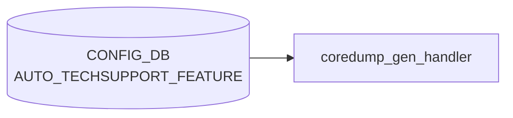

# AUTO_TECHSUPPORT_FEATURE テーブル

## 概要

`AUTO_TECHSUPPORT` (GLOBAL) で定義したイベント駆動 techsupport の挙動を、`FEATURE` (docker) 単位でオーバーライドするテーブル[^1]。`coredump-compress`/`techsupport-cleanup` パイプラインを実行する `coredump_gen_handler` (`docker-database` 内 `monit` 経由) が参照し、対象 docker でクラッシュ (core-dump) が発生したときに当該 feature の `state` と `rate_limit_interval` を見て techsupport を起動する。

<!-- cdb-mermaid -->
### データフロー (自動生成)



!!! note "凡例"
    CONFIG_DB から SAI までの典型経路を `docs/reference/config-db-orch-map.md` から機械生成したミニ図。詳細・例外は本ページ本文と対応表を参照。
<!-- /cdb-mermaid -->

## key 構造

```text
AUTO_TECHSUPPORT_FEATURE|<feature_name>
```

`<feature_name>` は `FEATURE` テーブルの `name` に対応する文字列 (1..255 chars)。[YANG](../../reference/glossary.md#term-yang) では `TODO: Leafref once the FEATURE YANG is added` コメントが残っており、現状は単純文字列 (leafref 未指定)[^1]。

## フィールド

| フィールド | 型 | デフォルト | 説明 |
|-----------|----|-----------|------|
| `state` | `enabled`/`disabled` (`stypes:admin_mode`) | なし (YANG); install 時 `disabled` または GLOBAL 継承 | この feature でクラッシュした際の techsupport 起動可否 |
| `available_mem_threshold` | decimal (0.0..99.99) | `10.0` (YANG + install 時); 欠落時は実行時 `0.0` へ fallback | メモリ使用率しきい値。0 で無効化 |
| `rate_limit_interval` | uint16 (秒) | なし (YANG); install 時 `600`; 欠落時は実行時 `0.0` へ fallback | この feature の rate-limit。0 で明示的に無効化 |

GLOBAL 側にある `max_techsupport_limit` / `max_core_limit` / `since` はここには存在せず、グローバル設定がそのまま適用される。

## 制約

- `available_mem_threshold` は `decimal-repr` typedef (fraction-digits 2、range 0.0..99.99)
- list 名は `AUTO_TECHSUPPORT_FEATURE_LIST`、container 名は `AUTO_TECHSUPPORT_FEATURE`

## 購読者

- `coredump_gen_handler` (`sonic-buildimage/files/scripts/coredump-compress` ハンドラ): core-dump イベントで [CONFIG_DB](../../reference/glossary.md#term-config_db) を参照し、対応する feature の state/rate_limit_interval を評価して techsupport を起動

## 関連 CONFIG_DB / YANG / CLI

- 関連 [CONFIG_DB](../../reference/glossary.md#term-config_db): [`AUTO_TECHSUPPORT`](auto-techsupport.md), [`FEATURE`](feature.md)
- 関連 CLI: `config auto-techsupport-feature update <feature> --state ... --rate-limit-interval ...`
- 関連 [YANG](../../reference/glossary.md#term-yang): `sonic-auto_techsupport`

<!-- cdb-exceptions -->
## 例外条件・特殊挙動

| 条件 | 挙動 |
|------|------|
| feature エントリが存在しない | `available_mem_threshold` を 0% (デフォルト) とみなし、コンテナメモリチェックをスキップ |
| `available_mem_threshold` が float 変換不可 | `MemoryCheckerException` 発生、techsupport 起動せず `EXIT_FAILURE` |
| feature 名がコンテナ名と不一致 | `startswith` で前方一致のため、完全一致不要。ただし誤 feature 名だとチェックがスキップされる |
| `AUTO_TECHSUPPORT\|GLOBAL` が不在 | パッケージインストール時に AUTO_TECHSUPPORT_FEATURE エントリが自動作成されない |
| `state` フィールド未設定 | パッケージインストール時はデフォルト `disabled` で登録 |

<!-- evidence: sonic-net/sonic-utilities/scripts/memory_threshold_check.py:118L -->
<!-- /cdb-exceptions -->

<!-- value-behavior -->
## 値依存挙動マトリクス

### `state` (enum `enabled`/`disabled`)

| 値 | 効果 | evidence |
|---|---|---|
| `enabled` | この feature のコアダンプ発生時に `invoke_ts_command_rate_limited` を呼び出し techsupport を起動 | `sonic-utilities/scripts/coredump_gen_handler.py:55` |
| `disabled` | techsupport 起動をスキップ。syslog NOTICE を出力して終了 | `sonic-utilities/scripts/coredump_gen_handler.py:55-56` |

### フリーフォームフィールド

- `rate_limit_interval` (uint16): `0` で無効化、`>0` で連続起動を抑制 (秒数)
- `available_mem_threshold` (decimal 0.0..99.99): `0.0` でメモリチェック無効

### 複合条件

- `AUTO_TECHSUPPORT|GLOBAL` の `state=disabled` の場合、本 feature エントリの `state` に関わらず全機能停止 (`coredump_gen_handler.py:17`)
- `state=enabled` でも、`AUTO_TECHSUPPORT|GLOBAL.available_mem_threshold` と本エントリの `available_mem_threshold` が両方評価される
<!-- /value-behavior -->

<!-- ref-triangle:start -->

## 関連リファレンス

- [YANG](../../reference/glossary.md#term-yang): `sonic-auto_techsupport`
- CLI: `config auto-techsupport-feature`

<!-- ref-triangle:end -->

## 引用元

[^1]: `src/sonic-yang-models/yang-models/sonic-auto_techsupport.yang` (container `AUTO_TECHSUPPORT_FEATURE` / list `AUTO_TECHSUPPORT_FEATURE_LIST`). <https://github.com/sonic-net/sonic-buildimage/blob/9ea932ec2e18f35e58268ec2e4456b1d4afd65cd/src/sonic-yang-models/yang-models/sonic-auto_techsupport.yang>

## 関連ページ
- [CONFIG_DB: AUTO_TECHSUPPORT](auto-techsupport.md)
- [CONFIG_DB: FEATURE](feature.md)
- [HLD: Event-Driven Tech-Support & CoreDump Mgmt](../../system/event-driven-techsupport-invocation-coredump-mgmt.md)

<!-- ops-hint -->
## 運用ヒント

### 典型値

- key 形式: `AUTO_TECHSUPPORT_FEATURE|<feature>` (例 `AUTO_TECHSUPPORT_FEATURE|swss`)。
- `state`: `enabled` / `disabled`、`rate_limit_interval`: `600` 秒程度が一般的。
- `available_mem_threshold`: デフォルト `10.0` (%)。

### よくある誤設定

- 存在しない `<feature>` 名を指定 (FEATURE テーブルに無い docker 名)。techsupport が起動しない。
- `rate_limit_interval=0` を意図せず設定し、core dump 連発で techsupport が暴走する。

### 確認コマンド

```bash
sonic-db-cli CONFIG_DB keys 'AUTO_TECHSUPPORT_FEATURE|*'
show auto-techsupport feature
ls -lh /var/dump/
```
<!-- /ops-hint -->


<!-- runtime-trace -->
## 実コンテナ動作トレース

### 段階 1 — Consumer 登録

`auto_techsupport_handler` (`sonic-host-services`) が CONFIG_DB の `AUTO_TECHSUPPORT_FEATURE` テーブルを購読する。

`auto_techsupport_handler` は `hostcfgd` 内部のサブハンドラとして動作。

### 段階 2 — CFG→APPL 翻訳

なし (APPL_DB 中継なし)

### 段階 3 — APPL→SAI

なし (SAI 非経由 — syslog 監視・techsupport 生成をトリガー)

### 段階 4 — タイミングと副作用

**適用タイミング**: CONFIG_DB の `AUTO_TECHSUPPORT_FEATURE` エントリ変化を検知次第即時反映。次回 core dump または syslog イベント発生時から新設定が有効。

**副作用**: `techsupport` の自動生成をフィーチャー単位で ON/OFF。過去の coredump イベントには遡及しない。
<!-- /runtime-trace -->

<!-- entry-points -->
## 書き込み入り口 (Direction A)

対象テーブル: `AUTO_TECHSUPPORT_FEATURE`

### CLI
- `config auto-techsupport feature enable/disable <feature>`
- `config auto-techsupport feature rate-limit-interval <feature> <secs>`
- `config auto-techsupport feature available-mem-threshold <feature> <pct>`
  - ソース: `sonic-utilities/config/plugins/auto_techsupport.py`

### minigraph / sonic-cfggen
- なし

### REST / gNMI (sonic-mgmt-common)
- なし (対応 OpenConfig/SONiC YANG transformer なし)

### db_migrator
- なし

### ビルド時デフォルト (init_cfg / j2 テンプレート)
- `init_cfg.json.j2` の `AUTO_TECHSUPPORT_FEATURE` セクションでデフォルト feature リスト (bgp, swss, syncd 等) が注入される

### ハードコードデフォルト
- なし

### ランタイム注入 (デーモン自動書き込み)
- なし
<!-- /entry-points -->

<!-- defaults -->
## フィールド暗黙デフォルト (Phase A コード由来)

YANG 宣言デフォルトに加え、Python コードが持つ fallback を per-field で記録する。

### `state`

| 段階 | 値 | ソース |
|------|---|-------|
| DB 書き込み時 (パッケージ install) | `disabled` (AUTO_TECHSUPPORT\|GLOBAL 不在時) / GLOBAL の `state` 値を引き継ぎ | `sonic_package_manager/service_creator/feature.py:22-26,159-197` |
| 実行時 fallback (フィールド不在) | `None` → `!= "enabled"` 比較でスキップ扱い = `disabled` と同等 | `scripts/coredump_gen_handler.py:55` |

`infer_auto_ts_capability()` が `AUTO_TECHSUPPORT|GLOBAL.state` を読み、値が空なら `(False, "disabled")` を返す。`False` の場合、`AUTO_TECHSUPPORT_FEATURE` エントリ自体が作成されない (`feature.py:185-186`)。

### `available_mem_threshold`

| 段階 | 値 | ソース |
|------|---|-------|
| YANG default | `10.0` | `sonic-auto_techsupport.yang:114` |
| DB 書き込み時 (パッケージ install / ビルド) | `"10.0"` | `feature.py:26`; `init_cfg.json.j2` AUTO_TECHSUPPORT_FEATURE ブロック |
| 実行時 fallback (フィールド欠落) | `0.0` → メモリチェック無効 | `memory_threshold_check.py:28` (`DEFAULT_MEMORY_AVAILABLE_FEATURE_THRESHOLD = 0`) |

`Config.parse_value_from_db()` (memory_threshold_check.py:148-156) が `config.get("available_mem_threshold")` で falsy 値を得た場合に `0.0` を返す。float 変換失敗は `MemoryCheckerException` を raise し techsupport を起動しない。

### `rate_limit_interval`

| 段階 | 値 | ソース |
|------|---|-------|
| YANG default | なし (宣言なし) | `sonic-auto_techsupport.yang` |
| DB 書き込み時 (パッケージ install / ビルド) | `"600"` (秒) | `feature.py:25`; `init_cfg.json.j2` |
| 実行時 fallback (空文字 / フィールド欠落) | `0.0` → rate-limit 無効 (連続実行を許可) | `auto_techsupport_helper.py:328-331` (`except ValueError: container_cooloff = 0.0`) |

書き込み時 default (`600`) と実行時 fallback (`0.0`) が**乖離**している。フィールドが意図せず消えた場合、rate-limit 無効で動作する点に注意。
<!-- /defaults -->

<!-- platform -->
## プラットフォーム差 (Phase H)

**プラットフォーム差なし**: AUTO_TECHSUPPORT_FEATURE は host 単位で適用され、ASIC 種別・multi-asic / VOQ chassis 構成・ベンダーに依らない。

| 観点 | 結果 | 根拠 |
|------|------|------|
| ASIC 種別 (Broadcom / Mellanox / Marvell / Innovium / Cisco) | 影響なし | SAI 非経由 (runtime-trace 段階 3 参照)。`coredump_gen_handler.py` (82 行) / `techsupport_cleanup.py` (59 行) を `platform\|asic\|chassis\|namespace\|vendor` で grep して 0 ヒット |
| multi-asic (`is_multi_npu() == True`) | 影響なし | `SonicV2Connector(use_unix_socket_path=True)` で host CONFIG_DB のみ参照、`asicN` namespace を iterate しない。container 名の asic suffix (`swss0`/`syncd1` 等) は feature 名との `startswith` 前方一致で吸収 |
| VOQ chassis (supervisor + line card) | 各 host で独立適用 | chassisdb (REDIS_CHASSIS_SERVER) 非参照。各 line card host で独立にローカル CONFIG_DB を見てローカル `/var/dump/` に techsupport を生成。chassis 全体集中機構なし |
| namespace (asic0..asicN) | 影響なし | `coredump_gen_handler.py` / `techsupport_cleanup.py` / `auto_techsupport_helper.py` のいずれにも namespace 引数なし。すべて host namespace の `unix:///var/run/redis/redis.sock` に接続 |
| ベンダー固有 hook | なし | `AUTO_TECHSUPPORT_FEATURE` schema / handler に vendor 分岐なし。`generate_dump` 内の `show platform summary` 等 vendor 依存コマンドは別 entity (本テーブル field 解釈には影響しない) |
| init_cfg / build template | 分岐なし | `init_cfg.json.j2` の AUTO_TECHSUPPORT_FEATURE ブロックは `` のみで platform 条件式なし |

詳細根拠と grep ログは `meta/_intermediate/cdb-flow/auto-techsupport-feature-platform.md` を参照。
<!-- /platform -->

<!-- pubsub -->
## 通信メカニズム (Phase G)

### Redis 購読方式

`AUTO_TECHSUPPORT_FEATURE` テーブルには**常駐 subscriber が存在しない**。`ConfigDBConnector.subscribe()` / `ConfigDBConnector.listen()` / `SubscriberStateTable` / `NotificationConsumer` のいずれの経路でも本テーブルを購読しているプロセスは確認できない。代わりに、外部イベントで起動される一発実行スクリプトが必要なフィールドを **同期 `HGET` / `HGETALL`** で取りに行く方式が採用されている。

| 消費者 | 起動方式 | DB アクセス API | Redis primitive |
|--------|---------|----------------|-----------------|
| `coredump_gen_handler.py` | kernel `core_pattern` → `coredump-compress` (パイプ受け) → `setsid` でバックグラウンド起動 | `SonicV2Connector.get()` | `HGET` (state / rate_limit_interval を都度取得) |
| `techsupport_cleanup.py` | `generate_dump` の cleanup フック | `SonicV2Connector.get()` | `HGET` (GLOBAL のみ参照、FEATURE は読まない) |
| `memory_threshold_check.py` | `coredump_gen_handler` から起動 / `monit` 周期 | `ConfigDBConnector.get_table()` | `HGETALL` (全 feature を一括スナップショット) |
| `hostcfgd` | 常駐 daemon | — | **購読しない** (`scripts/hostcfgd:2468-2528` に AUTO_TECHSUPPORT 系の `subscribe()` 呼び出しなし) |
| `featured` | 常駐 daemon | — | **購読しない** (FEATURE テーブルは購読するが AUTO_TECHSUPPORT_FEATURE は触らない) |

### トリガ経路 (coredump_gen_handler)

```
プロセスクラッシュ → kernel core_dump
  ↓ kernel.core_pattern=|/usr/local/bin/coredump-compress %e %t %p %P
/usr/local/bin/coredump-compress  (bash)
  ↓ /bin/gzip -1 - > /var/core/<prefix>core.gz
  ↓ setsid python3 coredump_gen_handler.py <core.gz> <container_name> &
coredump_gen_handler.py
  ├─ db = SonicV2Connector(use_unix_socket_path=True); db.connect(CFG_DB/STATE_DB)
  ├─ HGET "AUTO_TECHSUPPORT|GLOBAL"            state                  (= "enabled" 確認)
  ├─ HGET "AUTO_TECHSUPPORT_FEATURE|<feat>"    state                  (= "enabled" 確認)
  └─ invoke_ts_command_rate_limited()
       ├─ HGET "AUTO_TECHSUPPORT|GLOBAL"            rate_limit_interval
       ├─ HGET "AUTO_TECHSUPPORT_FEATURE|<feat>"    rate_limit_interval
       ├─ verify_rate_limit_intervals (STATE_DB の前回 dump timestamp と比較)
       └─ /usr/local/bin/generate_dump  → 完了後 techsupport_cleanup.py
```

### 重要な特性

- **設定変更は即時反映されない**。CLI で `state` や `rate_limit_interval` を変更しても、次回 core dump 発生 (= 次回 `coredump_gen_handler.py` 起動) まで旧値の影響範囲は残らないものの、reload は次イベント時の HGET で行われる (eventual reload)。
- **常駐 Python プロセスなし**。core dump イベント時のみ `setsid` でバックグラウンド一発起動 → 終了するため CPU/メモリの常時消費はゼロ。
- keyspace 通知 (`__keyspace@<dbId>__:AUTO_TECHSUPPORT_FEATURE|*`) は Redis 側では発行されるが、購読クライアントが存在しないため捨てられる。
- `techsupport_cleanup.py` は AUTO_TECHSUPPORT_FEATURE を参照せず、GLOBAL の `state` と `max_techsupport_limit` のみで cleanup 判定を行う。
- rate-limit 状態は CONFIG_DB ではなく `STATE_DB` の `AUTO_TECHSUPPORT_DUMP_INFO_TABLE` (前回 dump の timestamp) に保管される。

!!! warning "本文 `<!-- runtime-trace -->` ブロックとの差異"
    本文の段階 1 に「`auto_techsupport_handler` が `hostcfgd` 内部のサブハンドラとして `AUTO_TECHSUPPORT_FEATURE` を購読する」旨の記述があるが、`sonic-host-services/scripts/hostcfgd:2468-2528` を実コード grep した範囲では AUTO_TECHSUPPORT / AUTO_TECHSUPPORT_FEATURE への `subscribe()` 呼び出しは確認できない。実装は hostcfgd と独立した kernel `core_pattern` → `coredump-compress` → `coredump_gen_handler.py` のパイプライン (本ページの Phase G 分析)。次回 verifier 巡回で本文修正候補。

> **Evidence**: `sonic-utilities/scripts/coredump_gen_handler.py:1-82`; `sonic-utilities/scripts/techsupport_cleanup.py:1-59`; `sonic-utilities/utilities_common/auto_techsupport_helper.py:300-338`; `sonic-utilities/scripts/coredump-compress:1-35`; `sonic-buildimage/files/image_config/sysctl/90-sonic.conf:45`; `sonic-host-services/scripts/hostcfgd:2468-2528`; 詳細分析 `meta/_intermediate/cdb-flow/auto-techsupport-feature-pubsub.md`
<!-- /pubsub -->

<!-- side-effects -->
## 副次 DB 書込 (Phase F)

> 詳細証跡: `meta/_intermediate/cdb-flow/auto-techsupport-feature-side.md`

`AUTO_TECHSUPPORT_FEATURE` テーブル自体は常駐 subscriber を持たないが、関連スクリプト (`coredump_gen_handler.py` / `techsupport_cleanup.py`) が core dump および techsupport 生成イベントを起点に **STATE_DB `AUTO_TECHSUPPORT_DUMP_INFO`** へ書込みを行う。CONFIG_DB / APPL_DB / COUNTERS_DB / ASIC_DB への副次書込みは存在しない。

### core dump 発生 → techsupport 生成成功時 — STATE_DB へ SET

経路: `coredump_gen_handler.py` → `invoke_ts_command_rate_limited()` → `write_to_state_db()`。AUTO_TECHSUPPORT\|GLOBAL.state と AUTO_TECHSUPPORT_FEATURE\|<feat>.state がともに `enabled` かつ rate-limit を満たした場合のみ発火。

| 対象 DB / テーブル | キー | フィールド | 値 |
|------------------|------|----------|----|
| STATE_DB / `AUTO_TECHSUPPORT_DUMP_INFO` | `<dump-name>` (例 `sonic_dump_DUT_20260515_123456`) | `timestamp` | `int(time.time())` (Unix epoch 秒、文字列化) |
| STATE_DB / `AUTO_TECHSUPPORT_DUMP_INFO` | 同上 | `event_type` | `core` または `memory` |
| STATE_DB / `AUTO_TECHSUPPORT_DUMP_INFO` | 同上 | `core_dump` | core dump ファイル名 (`event_type=core` 時のみ) |
| STATE_DB / `AUTO_TECHSUPPORT_DUMP_INFO` | 同上 | `container` | feature/docker 名 (例 `swss`) |

### techsupport rotate 時 — STATE_DB から DELETE

経路: `generate_dump` 完了 → `techsupport_cleanup.py` → `clean_state_db_entries()`。AUTO_TECHSUPPORT\|GLOBAL.state=`enabled` かつ `max_techsupport_limit>0` のときのみ、`/var/dump/` 配下を最古順で削除した結果に対応する STATE_DB エントリを 1:1 で除去する。**本処理は AUTO_TECHSUPPORT_FEATURE を参照しない** (GLOBAL の値のみ評価)。

| 対象 DB / テーブル | 操作 | キー |
|------------------|------|------|
| STATE_DB / `AUTO_TECHSUPPORT_DUMP_INFO` | `delete` | rotate された techsupport dump 名 |

### 非該当 (副次書込なし)

- CONFIG_DB: 両 script とも `db.get` のみで参照、書込みなし
- APPL_DB / COUNTERS_DB / FLEX_COUNTER_DB / ASIC_DB: 接続自体なし (`db.connect` は `CFG_DB` と `STATE_DB` のみ)
- SAI 呼出: なし (techsupport は OS レベルの diagnostic 収集に閉じる)
- Notification / Pub/Sub: なし (`SonicV2Connector` の素の `set`/`delete` のみで、keyspace 通知の購読クライアント不在)

<!-- 証跡: sonic-utilities/scripts/coredump_gen_handler.py:69-78; sonic-utilities/scripts/techsupport_cleanup.py:13-18,52-55; sonic-utilities/utilities_common/auto_techsupport_helper.py:43-60,302-338 -->
<!-- /side-effects -->

<!-- constants -->
## ハードコード定数 (Phase E)

`AUTO_TECHSUPPORT_FEATURE` を消費する Python パイプライン (`coredump_gen_handler.py` / `techsupport_cleanup.py` / `memory_threshold_check.py` / 共通ヘルパ `auto_techsupport_helper.py`) と、パッケージ install 時の初期値を担う `feature.py` に存在する CONFIG_DB に格納されないハードコード定数の一覧。

### 1. ファイルシステムパス / パターン (`auto_techsupport_helper.py:33-39`)

| 定数 | 値 | 用途 | evidence |
|-----|-----|------|---------|
| `CORE_DUMP_DIR` | `/var/core` | core dump 保存ディレクトリ。`coredump-compress` の gzip 出力先と handler の容量集計対象 | `sonic-utilities/utilities_common/auto_techsupport_helper.py:33`; `sonic-utilities/scripts/coredump-compress:21` |
| `CORE_DUMP_PTRN` | `*.core.gz` | core dump cleanup 対象の glob | `sonic-utilities/utilities_common/auto_techsupport_helper.py:34` |
| `TS_DIR` | `/var/dump` | techsupport tarball 保存先 | `sonic-utilities/utilities_common/auto_techsupport_helper.py:36` |
| `TS_ROOT` / `TS_PTRN` / `TS_PTRN_GLOB` | `sonic_dump_*` / `sonic_dump_.*tar.*` / `sonic_dump_*tar*` | techsupport tarball 検出パターン (cleanup / 既存 dump 一覧) | `sonic-utilities/utilities_common/auto_techsupport_helper.py:37-39` |

### 2. CONFIG_DB / STATE_DB キー定数 (`auto_techsupport_helper.py:42-67`)

| 定数 | 値 | evidence |
|-----|-----|---------|
| `AUTO_TS` | `AUTO_TECHSUPPORT\|GLOBAL` | `sonic-utilities/utilities_common/auto_techsupport_helper.py:46` |
| `FEATURE` | `AUTO_TECHSUPPORT_FEATURE\|{}` (format テンプレ) | `sonic-utilities/utilities_common/auto_techsupport_helper.py:54` |
| `CFG_STATE` / `COOLOFF` / `CFG_MAX_TS` / `CFG_CORE_USAGE` / `CFG_SINCE` | `state` / `rate_limit_interval` / `max_techsupport_limit` / `max_core_limit` / `since` | `sonic-utilities/utilities_common/auto_techsupport_helper.py:47-51` |
| `TS_MAP` | `AUTO_TECHSUPPORT_DUMP_INFO` (STATE_DB 上の dump 記録テーブル) | `sonic-utilities/utilities_common/auto_techsupport_helper.py:60` |
| `EVENT_TYPE_CORE` / `EVENT_TYPE_MEMORY` | `core` / `memory` | `sonic-utilities/utilities_common/auto_techsupport_helper.py:66-67` |

### 3. タイミング・しきい値・終了コード (`auto_techsupport_helper.py:69-84`)

| 定数 | 値 | 用途 | evidence |
|-----|-----|------|---------|
| `TIME_BUF` | `20` 秒 | `verify_recent_file_creation()` の判定窓。core 生成と handler 起動のラグ吸収 | `sonic-utilities/utilities_common/auto_techsupport_helper.py:69,115` |
| `SINCE_DEFAULT` | `"2 days ago"` | `CFG_SINCE` が `date -d` で解釈不能/欠落時の `show techsupport --since` fallback | `sonic-utilities/utilities_common/auto_techsupport_helper.py:70,216,220` |
| `TS_GLOBAL_TIMEOUT` | `"60"` (文字列) | `show techsupport --global-timeout` 引数。CONFIG_DB から上書き不可 | `sonic-utilities/utilities_common/auto_techsupport_helper.py:71,235` |
| `EXT_LOCKFAIL` / `EXT_RETRY` / `EXT_SUCCESS` | `2` / `4` / `0` | `generate_dump` 終了コード分岐 | `sonic-utilities/utilities_common/auto_techsupport_helper.py:81-83` |
| `MAX_RETRY_LIMIT` | `2` | `EXT_RETRY` 時の最大再試行回数 | `sonic-utilities/utilities_common/auto_techsupport_helper.py:84,242` |

### 4. メモリしきい値デフォルト (`memory_threshold_check.py:10-30`)

| 定数 | 値 | 用途 | evidence |
|-----|-----|------|---------|
| `DEFAULT_MEMORY_AVAILABLE_THRESHOLD` | `10` (%) | `AUTO_TECHSUPPORT\|GLOBAL.available_mem_threshold` 欠落時のホスト全体 fallback | `sonic-utilities/scripts/memory_threshold_check.py:24` |
| `DEFAULT_MEMORY_AVAILABLE_MIN_THRESHOLD` | `200` (MB) | ホスト全体の絶対最小 free memory しきい値 (% しきい値と AND 評価) | `sonic-utilities/scripts/memory_threshold_check.py:26` |
| `DEFAULT_MEMORY_AVAILABLE_FEATURE_THRESHOLD` | `0` (%) | `AUTO_TECHSUPPORT_FEATURE.<feat>.available_mem_threshold` 欠落時 fallback。`0` でメモリチェック無効 | `sonic-utilities/scripts/memory_threshold_check.py:28` |
| `MB_TO_KB_MULTIPLIER` | `1024` | メモリ量単位換算 | `sonic-utilities/scripts/memory_threshold_check.py:30` |
| `EXIT_THRESHOLD_CROSSED` | `2` | メモリしきい値超過時の終了コード (techsupport 起動経路) | `sonic-utilities/scripts/memory_threshold_check.py:12` |

> GLOBAL fallback (`10` %) と FEATURE fallback (`0` %) が**乖離**。通常運用では `init_cfg.json.j2` / `feature.py` が install 時に `"10.0"` を書き込むため発生しないが、CLI で feature の `available_mem_threshold` を削除するとメモリチェックが当該 feature 単位で無効化される。

### 5. パッケージ install 時デフォルト (`feature.py:22-26`)

| フィールド | install 時値 | 用途 | evidence |
|-----------|-------------|------|---------|
| `state` | `'disabled'` | `sonic-package-manager install` 時、`AUTO_TECHSUPPORT\|GLOBAL` 不在ならこの値で `AUTO_TECHSUPPORT_FEATURE` エントリ作成 (GLOBAL 存在時はその値を継承) | `sonic-utilities/sonic_package_manager/service_creator/feature.py:23,159-197` |
| `rate_limit_interval` | `'600'` (秒) | install 時 cool-off 初期値 (10 分) | `sonic-utilities/sonic_package_manager/service_creator/feature.py:24` |
| `available_mem_threshold` | `'10.0'` (%) | install 時メモリしきい値初期値 | `sonic-utilities/sonic_package_manager/service_creator/feature.py:25` |

> install 時 default (`rate_limit_interval=600`) と実行時 fallback (`auto_techsupport_helper.py:328-331` の `except ValueError: container_cooloff = 0.0`) が乖離。フィールドが消えると rate-limit 無効で動作。

### 6. coredump-compress 出力パス (bash; `scripts/coredump-compress`)

| パス | 用途 | evidence |
|------|------|---------|
| `/var/core/${PREFIX}core.gz` | kernel `core_pattern` から渡された core を gzip 圧縮して書き出す固定出力先 | `sonic-utilities/scripts/coredump-compress:21` |
| `/usr/local/bin/coredump_gen_handler.py` | `setsid` でバックグラウンド起動される handler の固定パス | `sonic-utilities/scripts/coredump-compress:32` |
| `/tmp/coredump_gen_handler.log` | handler の stdout/stderr 集約先 (毎回 truncate) | `sonic-utilities/scripts/coredump-compress:31-32` |

kernel `core_pattern` 側 (`sonic-buildimage/files/image_config/sysctl/90-sonic.conf:45`) で `|/usr/local/bin/coredump-compress %e %t %p %P` が固定。`/var/core` を変更する場合は coredump-compress と `auto_techsupport_helper.py` の両方の書き換えが必要。

### 7. 重要な特性

- **`coredump_gen_handler.py` 単体は定数を持たない**: `from utilities_common.auto_techsupport_helper import *` で全定数を取り込む。Phase E の実体は `auto_techsupport_helper.py`。
- **`techsupport_cleanup.py` は `TS_DIR` / `CFG_MAX_TS` のみ参照**: `AUTO_TECHSUPPORT_FEATURE` テーブルは見ず、GLOBAL の `state` と `max_techsupport_limit` だけで cleanup 判定。
- **`TS_GLOBAL_TIMEOUT="60"` は CONFIG_DB から上書き不可**: 長時間 techsupport を必要とする運用ではソース改変が要る。
- **`TIME_BUF=20` 秒**: handler 起動時に `find_new_core_files()` で「直近 20 秒以内」の `*.core.gz` のみを対象にして二重起動を避ける。

> **Evidence**: `sonic-utilities/utilities_common/auto_techsupport_helper.py:1-84`; `sonic-utilities/scripts/coredump_gen_handler.py:1-82`; `sonic-utilities/scripts/techsupport_cleanup.py:1-59`; `sonic-utilities/scripts/memory_threshold_check.py:1-30`; `sonic-utilities/sonic_package_manager/service_creator/feature.py:22-26`; `sonic-utilities/scripts/coredump-compress:1-35`; 詳細分析 `meta/_intermediate/cdb-flow/auto-techsupport-feature-constants.md`
<!-- /constants -->

<!-- cross-refs -->
## 暗黙参照 — `coredump_gen_handler` パイプラインが読み出す関連テーブル (Phase C)

`AUTO_TECHSUPPORT_FEATURE|<feat>` 単独では techsupport 起動可否は決定しない。`coredump_gen_handler.py` / `techsupport_cleanup.py` および共通ヘルパ `auto_techsupport_helper.py` は kernel `core_pattern` で起動されたあと、`AUTO_TECHSUPPORT|GLOBAL` を必ず先に評価し、さらに `FEATURE` テーブルの docker 名空間と STATE_DB 上の `AUTO_TECHSUPPORT_DUMP_INFO` を組み合わせて per-feature rate-limit を判定する。

### グローバル共依存 — [`AUTO_TECHSUPPORT`](auto-techsupport.md) (key `GLOBAL`)

`AUTO_TECHSUPPORT_FEATURE` 側の `state` / `rate_limit_interval` / `available_mem_threshold` は、GLOBAL の同名フィールドが**先に**評価されたうえで AND 条件として効く。GLOBAL.state が `disabled` なら FEATURE エントリの値に関わらず techsupport は起動しない。

| 参照箇所 | API | フィールド | 用途 | evidence |
|---|---|---|---|---|
| `handle_coredump_cleanup` | `db.get(CFG_DB, AUTO_TS, CFG_STATE)` | `state` | core dump cleanup 全体の ON/OFF | `coredump_gen_handler.py:17` |
| `handle_coredump_cleanup` | `db.get(CFG_DB, AUTO_TS, CFG_CORE_USAGE)` | `max_core_limit` | `/var/core` 容量しきい値 | `coredump_gen_handler.py:22` |
| `CriticalProcCoreDumpHandle.handle_core_dump_creation_event` | `db.get(CFG_DB, AUTO_TS, CFG_STATE)` | `state` | FEATURE 評価前のグローバルゲート | `coredump_gen_handler.py:47` |
| `handle_techsupport_creation_event` | `db.get(CFG_DB, AUTO_TS, CFG_STATE/CFG_MAX_TS)` | `state` / `max_techsupport_limit` | techsupport cleanup の ON/OFF と `/var/dump` 容量しきい値 | `techsupport_cleanup.py:27,32` |
| `invoke_ts_command_rate_limited` | `db.get(CFG_DB, AUTO_TS, COOLOFF)` | `rate_limit_interval` | グローバル cool-off (per-feature 値と並列評価) | `auto_techsupport_helper.py:315` |
| `get_since_arg` | `db.get(CFG_DB, AUTO_TS, CFG_SINCE)` | `since` | `show techsupport --since` 引数 | `auto_techsupport_helper.py:214` |
| `MemoryChecker` | `cfg_db.get_table(AUTO_TECHSUPPORT)` | host 全体しきい値 | host 全体 memory チェック | `memory_threshold_check.py:117` |

定数: `AUTO_TS = "AUTO_TECHSUPPORT|GLOBAL"` (`auto_techsupport_helper.py:46`)。

### 暗黙 leafref — [`FEATURE`](feature.md) (docker テーブル)

`AUTO_TECHSUPPORT_FEATURE` の key (`<feature_name>`) は `FEATURE` テーブルの `name` (docker 名) と同じ文字列空間を共有する。YANG コメントに `TODO: Leafref once the FEATURE YANG is added` とあり型レベルの強制はないが、handler は kernel から渡された `args.container` をそのまま `AUTO_TECHSUPPORT_FEATURE|{}` の key として組み立てる。

| 参照箇所 | 形式 | 用途 | evidence |
|---|---|---|---|
| `CriticalProcCoreDumpHandle.handle_core_dump_creation_event` | `FEATURE_KEY = FEATURE.format(self.container)` | kernel 由来の container 名を AUTO_TECHSUPPORT_FEATURE key に変換 | `coredump_gen_handler.py:54-55` |
| `invoke_ts_command_rate_limited` | `db.get(CFG_DB, FEATURE.format(container), COOLOFF)` | per-feature rate-limit 値の取得 | `auto_techsupport_helper.py:317-319` |
| `MemoryChecker` | `cfg_db.get_table(AUTO_TECHSUPPORT_FEATURE)` + `startswith` 前方一致 | 全 feature の `available_mem_threshold` を一括取得しコンテナ名でルックアップ | `memory_threshold_check.py:118,144` |

`trim_masic_suffix()` (`coredump_gen_handler.py:52`) で `swss0` → `swss` 等の masic suffix を剥がしてから FEATURE key を組み立てるため、AUTO_TECHSUPPORT_FEATURE のキーは masic suffix なしの形式 (= `FEATURE` テーブルと同形) で書く必要がある。`FEATURE` テーブル側の YANG が leafref を提供しないため、誤 docker 名を書いてもエラーにならず**該当エントリが黙って無視される** (handler 側は `db.get` で空値が返り `!= "enabled"` 判定で skip 扱い)。

### STATE_DB 連動 — `AUTO_TECHSUPPORT_DUMP_INFO` (STATE_DB)

per-feature `rate_limit_interval` の経過判定は CONFIG_DB 値だけでは決まらず、STATE_DB の前回 dump timestamp と現在時刻の差で判定される。techsupport 完了時に書き込み、cleanup 時に同期削除される。

| 参照箇所 | API | キー | 用途 | evidence |
|---|---|---|---|---|
| `get_ts_map` | `db.keys(STATE_DB, TS_MAP+"*")` + `get_all` | `AUTO_TECHSUPPORT_DUMP_INFO\|<dump_name>` | container 別の前回 dump 時刻一覧を再構成 | `auto_techsupport_helper.py:260-279` |
| `verify_rate_limit_intervals` | (`get_ts_map` 経由) | 同上 | per-feature cool-off 経過判定 | `auto_techsupport_helper.py:292-298` |
| `write_to_state_db` | `db.set(STATE_DB, key, ...)` | 同上 | techsupport 完了時に timestamp / event_type / container を書き込み | `auto_techsupport_helper.py:302-310` |
| `clean_state_db_entries` | `db.delete(STATE_DB, TS_MAP + "\|" + name)` | 同上 | tarball cleanup と同期して entry を削除 | `techsupport_cleanup.py:13-18` |

定数: `TS_MAP = "AUTO_TECHSUPPORT_DUMP_INFO"` (`auto_techsupport_helper.py:60`)。

### 範囲外 (誤解されやすい隣接)

- **`hostcfgd` / `featured` daemon**: `<!-- pubsub -->` 解析の通り、`AUTO_TECHSUPPORT_FEATURE` を `subscribe()` する常駐プロセスは存在しない。`hostcfgd` register_callbacks に AUTO_TECHSUPPORT 系の購読呼び出しなし、`featured` も `FEATURE` のみ購読し本テーブルには触らない。
- **`DEVICE_METADATA`**: `coredump_gen_handler.py` / `techsupport_cleanup.py` / `memory_threshold_check.py` / `auto_techsupport_helper.py` を `DEVICE_METADATA` で grep して 0 ヒット。multi-asic 判定や hostname 解決は本パイプラインに存在しない。
- **`CORE_DUMP_NAME_TO_CONTAINER_MAP`**: 現行 sonic-utilities master のコード上に該当 CONFIG_DB / STATE_DB テーブルは存在しない (`grep -rn "CORE_DUMP_NAME_TO_CONTAINER" .cache/sonic-sources/` で 0 ヒット)。kernel `core_pattern` → `coredump-compress %e %t %p %P` でユーザ空間に渡される `args.container` がコンテナ名→`FEATURE` key への暗黙マッピングを果たしており、DB レベルのテーブルとしては具現化されていない。

詳細スキャン手順と grep 結果は `meta/_intermediate/cdb-flow/auto-techsupport-feature-cross-refs.md` を参照。
<!-- /cross-refs -->

<!-- glossary-links-injected: 48d5f456ebb6 -->
