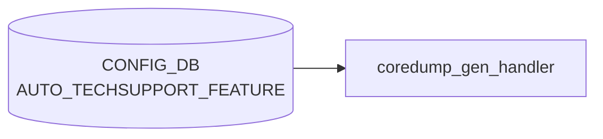

# AUTO_TECHSUPPORT_FEATURE テーブル

## 概要

`AUTO_TECHSUPPORT` (GLOBAL) で定義したイベント駆動 techsupport の挙動を、`FEATURE` (docker) 単位でオーバーライドするテーブル[^1]。`coredump-compress`/`techsupport-cleanup` パイプラインを実行する `coredump_gen_handler` (`docker-database` 内 `monit` 経由) が参照し、対象 docker でクラッシュ (core-dump) が発生したときに当該 feature の `state` と `rate_limit_interval` を見て techsupport を起動する。

<!-- cdb-mermaid -->
### データフロー (自動生成)



!!! note "凡例"
    CONFIG_DB から SAI までの典型経路を `docs/reference/config-db-orch-map.md` から機械生成したミニ図。詳細・例外は本ページ本文と対応表を参照。
<!-- /cdb-mermaid -->

## key 構造

```text
AUTO_TECHSUPPORT_FEATURE|<feature_name>
```

`<feature_name>` は `FEATURE` テーブルの `name` に対応する文字列 (1..255 chars)。[YANG](../../reference/glossary.md#term-yang) では `TODO: Leafref once the FEATURE YANG is added` コメントが残っており、現状は単純文字列 (leafref 未指定)[^1]。

## フィールド

| フィールド | 型 | デフォルト | 説明 |
|-----------|----|-----------|------|
| `state` | `enabled`/`disabled` (`stypes:admin_mode`) | なし | この feature でクラッシュした際の techsupport 起動可否 |
| `available_mem_threshold` | decimal (0.0..99.99) | `10.0` | メモリ使用率しきい値。0 で無効化 |
| `rate_limit_interval` | uint16 (秒) | なし | この feature の rate-limit。0 で明示的に無効化 |

GLOBAL 側にある `max_techsupport_limit` / `max_core_limit` / `since` はここには存在せず、グローバル設定がそのまま適用される。

## 制約

- `available_mem_threshold` は `decimal-repr` typedef (fraction-digits 2、range 0.0..99.99)
- list 名は `AUTO_TECHSUPPORT_FEATURE_LIST`、container 名は `AUTO_TECHSUPPORT_FEATURE`

## 購読者

- `coredump_gen_handler` (`sonic-buildimage/files/scripts/coredump-compress` ハンドラ): core-dump イベントで [CONFIG_DB](../../reference/glossary.md#term-config_db) を参照し、対応する feature の state/rate_limit_interval を評価して techsupport を起動

## 関連 CONFIG_DB / YANG / CLI

- 関連 [CONFIG_DB](../../reference/glossary.md#term-config_db): [`AUTO_TECHSUPPORT`](auto-techsupport.md), [`FEATURE`](feature.md)
- 関連 CLI: `config auto-techsupport-feature update <feature> --state ... --rate-limit-interval ...`
- 関連 [YANG](../../reference/glossary.md#term-yang): `sonic-auto_techsupport`

<!-- cdb-exceptions -->
## 例外条件・特殊挙動

| 条件 | 挙動 |
|------|------|
| feature エントリが存在しない | `available_mem_threshold` を 0% (デフォルト) とみなし、コンテナメモリチェックをスキップ |
| `available_mem_threshold` が float 変換不可 | `MemoryCheckerException` 発生、techsupport 起動せず `EXIT_FAILURE` |
| feature 名がコンテナ名と不一致 | `startswith` で前方一致のため、完全一致不要。ただし誤 feature 名だとチェックがスキップされる |
| `AUTO_TECHSUPPORT\|GLOBAL` が不在 | パッケージインストール時に AUTO_TECHSUPPORT_FEATURE エントリが自動作成されない |
| `state` フィールド未設定 | パッケージインストール時はデフォルト `disabled` で登録 |

<!-- evidence: sonic-net/sonic-utilities/scripts/memory_threshold_check.py:118L -->
<!-- /cdb-exceptions -->

<!-- value-behavior -->
## 値依存挙動マトリクス

### `state` (enum `enabled`/`disabled`)

| 値 | 効果 | evidence |
|---|---|---|
| `enabled` | この feature のコアダンプ発生時に `invoke_ts_command_rate_limited` を呼び出し techsupport を起動 | `sonic-utilities/scripts/coredump_gen_handler.py:55` |
| `disabled` | techsupport 起動をスキップ。syslog NOTICE を出力して終了 | `sonic-utilities/scripts/coredump_gen_handler.py:55-56` |

### フリーフォームフィールド

- `rate_limit_interval` (uint16): `0` で無効化、`>0` で連続起動を抑制 (秒数)
- `available_mem_threshold` (decimal 0.0..99.99): `0.0` でメモリチェック無効

### 複合条件

- `AUTO_TECHSUPPORT|GLOBAL` の `state=disabled` の場合、本 feature エントリの `state` に関わらず全機能停止 (`coredump_gen_handler.py:17`)
- `state=enabled` でも、`AUTO_TECHSUPPORT|GLOBAL.available_mem_threshold` と本エントリの `available_mem_threshold` が両方評価される
<!-- /value-behavior -->

<!-- ref-triangle:start -->

## 関連リファレンス

- [YANG](../../reference/glossary.md#term-yang): `sonic-auto_techsupport`
- CLI: `config auto-techsupport-feature`

<!-- ref-triangle:end -->

## 引用元

[^1]: `src/sonic-yang-models/yang-models/sonic-auto_techsupport.yang` (container `AUTO_TECHSUPPORT_FEATURE` / list `AUTO_TECHSUPPORT_FEATURE_LIST`). <https://github.com/sonic-net/sonic-buildimage/blob/9ea932ec2e18f35e58268ec2e4456b1d4afd65cd/src/sonic-yang-models/yang-models/sonic-auto_techsupport.yang>

## 関連ページ
- [CONFIG_DB: AUTO_TECHSUPPORT](auto-techsupport.md)
- [CONFIG_DB: FEATURE](feature.md)
- [HLD: Event-Driven Tech-Support & CoreDump Mgmt](../../system/event-driven-techsupport-invocation-coredump-mgmt.md)

<!-- ops-hint -->
## 運用ヒント

### 典型値

- key 形式: `AUTO_TECHSUPPORT_FEATURE|<feature>` (例 `AUTO_TECHSUPPORT_FEATURE|swss`)。
- `state`: `enabled` / `disabled`、`rate_limit_interval`: `600` 秒程度が一般的。
- `available_mem_threshold`: デフォルト `10.0` (%)。

### よくある誤設定

- 存在しない `<feature>` 名を指定 (FEATURE テーブルに無い docker 名)。techsupport が起動しない。
- `rate_limit_interval=0` を意図せず設定し、core dump 連発で techsupport が暴走する。

### 確認コマンド

```bash
sonic-db-cli CONFIG_DB keys 'AUTO_TECHSUPPORT_FEATURE|*'
show auto-techsupport feature
ls -lh /var/dump/
```
<!-- /ops-hint -->

<!-- entry-points -->
## 書き込み入り口 (Direction A)

対象テーブル: `AUTO_TECHSUPPORT_FEATURE`

### CLI
- `config auto-techsupport feature enable/disable <feature>`
- `config auto-techsupport feature rate-limit-interval <feature> <secs>`
- `config auto-techsupport feature available-mem-threshold <feature> <pct>`
  - ソース: `sonic-utilities/config/plugins/auto_techsupport.py`

### minigraph / sonic-cfggen
- なし

### REST / gNMI (sonic-mgmt-common)
- なし (対応 OpenConfig/SONiC YANG transformer なし)

### db_migrator
- なし

### ビルド時デフォルト (init_cfg / j2 テンプレート)
- `init_cfg.json.j2` の `AUTO_TECHSUPPORT_FEATURE` セクションでデフォルト feature リスト (bgp, swss, syncd 等) が注入される

### ハードコードデフォルト
- なし

### ランタイム注入 (デーモン自動書き込み)
- なし
<!-- /entry-points -->

<!-- glossary-links-injected: 48d5f456ebb6 -->
