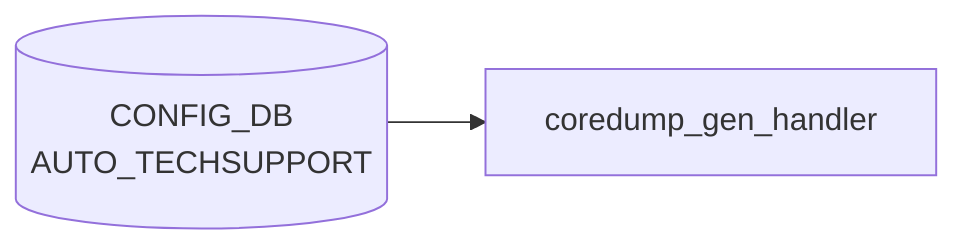

# AUTO_TECHSUPPORT テーブル

## 概要

イベント駆動 (core dump 生成) で `show techsupport` を自動実行・古いダンプを掃除する機能の設定。グローバル既定値の `AUTO_TECHSUPPORT|GLOBAL` と feature 別オーバーライドの `AUTO_TECHSUPPORT_FEATURE|<feature_name>` の 2 系統を持つ[^1]。`auto-techsupport.service` / `coredump-compress` ホストサービスが [CONFIG_DB](../../reference/glossary.md#term-config_db) を購読する。

<!-- cdb-mermaid -->
### データフロー (自動生成)



!!! note "凡例"
    CONFIG_DB から SAI までの典型経路を `docs/reference/config-db-orch-map.md` から機械生成したミニ図。詳細・例外は本ページ本文と対応表を参照。
<!-- /cdb-mermaid -->

## key 構造

```text
AUTO_TECHSUPPORT|GLOBAL
AUTO_TECHSUPPORT_FEATURE|<feature_name>
```

## AUTO_TECHSUPPORT|GLOBAL

| フィールド | 型 | 既定 | 説明 |
|-----------|----|------|------|
| `state` | enum `enabled`/`disabled` | - | core dump 駆動 techsupport の有効化 |
| `rate_limit_interval` | uint16 | - | 連続呼出間の最低秒数。`0` で無効化 |
| `max_techsupport_limit` | decimal64 (0.0..99.99) | - | `/var/dump` を占めて良い techsupport 累積容量 [%] |
| `max_core_limit` | decimal64 (0.0..99.99) | - | `/var/core` を占めて良い coredump 累積容量 [%] |
| `available_mem_threshold` | decimal64 (0.0..99.99) | 10.0 | techsupport 起動を抑止するメモリ閾値 [%] |
| `min_available_mem` | uint32 | 200 | techsupport 起動に必要な空きメモリ [MB] |
| `since` | string (1..255) | - | 収集対象期間 (例: `2 days ago`) |

## AUTO_TECHSUPPORT_FEATURE

| フィールド | 型 | 既定 | 説明 |
|-----------|----|------|------|
| `state` | enum `enabled`/`disabled` | - | feature 単位の有効化 |
| `available_mem_threshold` | decimal64 | 10.0 | feature 単位のメモリ閾値 |
| `rate_limit_interval` | uint16 | - | feature 単位の rate limit。`0` で無効化 |

`feature_name` は `FEATURE` テーブルとの整合が前提だが現状 leafref は張られていない ([YANG](../../reference/glossary.md#term-yang) 内コメント `TODO: Leafref once the FEATURE YANG is added`)。

## 購読者

- `coredump_gen_handler.py` (host service): core 検出時に `show techsupport` を起動し、本テーブルの閾値を尊重
- `techsupport_cleanup.py`: `max_*_limit` で古いダンプを削除

## 関連 CONFIG_DB / YANG / CLI

- 関連 [CONFIG_DB](../../reference/glossary.md#term-config_db): `FEATURE`
- 関連 CLI: `config auto-techsupport global`、`config auto-techsupport-feature`
- 関連 [YANG](../../reference/glossary.md#term-yang): `sonic-auto_techsupport`

<!-- cdb-exceptions -->
## 例外条件・特殊挙動

| 条件 | 挙動 |
|------|------|
| `GLOBAL` エントリが存在しない | デフォルト値で動作 (`available_mem_threshold`=10%, `min_available_mem`=200MB) |
| `available_mem_threshold` = 0 | システムメモリチェック全体をスキップし、feature 単位チェックのみ実行 |
| `available_mem_threshold`/`min_available_mem` が float 変換不可 | `MemoryCheckerException` 発生、techsupport 起動せず `EXIT_FAILURE` |
| 空きメモリ < `min_available_mem` | techsupport を起動しない（`EXIT_THRESHOLD_CROSSED` 返却） |
| `state` フィールド | `memory_threshold_check.py` では直接参照しない（呼び出し元が確認） |
| `rate_limit_interval` / `max_techsupport_limit` | memory_threshold_check では読まれない（coredump 監視デーモンが別途使用） |

<!-- evidence: sonic-net/sonic-utilities/scripts/memory_threshold_check.py:153L -->
<!-- /cdb-exceptions -->

<!-- value-behavior -->
## 値依存挙動マトリクス

### `state` (enum `enabled`/`disabled`) — `GLOBAL` キー

| 値 | 効果 | evidence |
|---|---|---|
| `enabled` | コアダンプ発生時に techsupport 起動パイプラインを実行する | `sonic-utilities/scripts/coredump_gen_handler.py:17` |
| `disabled` | coredump_cleanup および auto_invoke_ts の両方をスキップ。syslog NOTICE を出力 | `coredump_gen_handler.py:17-18,47-48` |

### `state` (enum `enabled`/`disabled`) — `AUTO_TECHSUPPORT_FEATURE` サブエントリ

| 値 | 効果 | evidence |
|---|---|---|
| `enabled` | 対象 feature (docker) のコアダンプで techsupport を起動 | `coredump_gen_handler.py:55` |
| `disabled` | 対象 feature のコアダンプで techsupport 起動をスキップ | `coredump_gen_handler.py:55-56` |

### フリーフォームフィールド

- `rate_limit_interval` (uint16): `0` で rate-limit 無効、`>0` で N 秒以内の重複起動を抑制
- `max_techsupport_limit` / `max_core_limit` (decimal64 0.0..99.99): 数値型。`techsupport_cleanup.py` が使用
- `since` (string): 収集期間指定。freeform

### 複合条件

- `GLOBAL.state=disabled` → `AUTO_TECHSUPPORT_FEATURE` 各エントリの state に関係なくすべてスキップ (`coredump_gen_handler.py:17`)
- `GLOBAL.state=enabled` かつ feature エントリ `state=disabled` → その feature のコアダンプのみスキップ
<!-- /value-behavior -->

<!-- ref-triangle:start -->

## 関連リファレンス

- [YANG](../../reference/glossary.md#term-yang): `sonic-auto_techsupport`
- CLI: `config auto-techsupport`

<!-- ref-triangle:end -->

## 引用元

[^1]: YANG 定義: `sonic-auto_techsupport.yang`. <https://github.com/sonic-net/sonic-buildimage/blob/9ea932ec2e18f35e58268ec2e4456b1d4afd65cd/src/sonic-yang-models/yang-models/sonic-auto_techsupport.yang>

<!-- topics-back-ref -->
## 関連 Topics

- [Topics: Telemetry / SNMP / Observability](../../topics/09-telemetry-snmp/index.md)

<!-- /topics-back-ref -->

<!-- ops-hint -->
## 運用ヒント

### 典型値

- key 形式: `AUTO_TECHSUPPORT|GLOBAL`。
- `state`: `enabled`。
- `rate_limit_interval`: `180` 秒。`max_techsupport_limit`: `10`%。

### よくある誤設定

- `max_core_limit` を 0 にすると core 自動収集が抑制され障害解析が困難になる。

### 確認コマンド

```bash
sonic-db-cli CONFIG_DB hgetall 'AUTO_TECHSUPPORT|GLOBAL'
show auto-techsupport global
```
<!-- /ops-hint -->


<!-- runtime-trace -->
## 実コンテナ動作トレース

### 段階 1 — Consumer 登録

`auto_techsupport_handler` (`sonic-host-services`) が CONFIG_DB の `AUTO_TECHSUPPORT` テーブルを購読する。

global テーブル (single key `GLOBAL`) と feature テーブルを同一ハンドラが購読。

### 段階 2 — CFG→APPL 翻訳

なし (APPL_DB 中継なし)

### 段階 3 — APPL→SAI

なし (SAI 非経由 — global techsupport 設定)

### 段階 4 — タイミングと副作用

**適用タイミング**: CONFIG_DB の `AUTO_TECHSUPPORT` エントリ変化を検知次第即時反映。次回 coredump または syslog イベント発生時から有効。

**副作用**: `max_core_size`/`since` 等のグローバル制限を更新。既存 coredump ファイルの削除・保存には非遡及。
<!-- /runtime-trace -->

<!-- entry-points -->
## 書き込み入り口 (Direction A)

対象テーブル: `AUTO_TECHSUPPORT`

### CLI
- `config auto-techsupport global enable/disable`
- `config auto-techsupport global max-techsupport-limit <pct>`
- `config auto-techsupport global rate-limit-interval <secs>`
  - ソース: `sonic-utilities/config/plugins/auto_techsupport.py`

### minigraph / sonic-cfggen
- なし

### REST / gNMI (sonic-mgmt-common)
- なし (対応 OpenConfig/SONiC YANG transformer なし)

### db_migrator
- なし

### ビルド時デフォルト (init_cfg / j2 テンプレート)
- なし

### ハードコードデフォルト
- なし

### ランタイム注入 (デーモン自動書き込み)
- なし
<!-- /entry-points -->

<!-- glossary-links-injected: 48d5f456ebb6 -->

<!-- ordering -->
## コア生成から techsupport 起動までの順序依存関係

### 1. カーネル coredump パイプ起動

カーネルが `kernel.core_pattern` に従いプロセスクラッシュを検知し、`coredump-compress` スクリプトへ標準入力でコアデータをパイプする。

```
kernel.core_pattern = |/usr/local/bin/coredump-compress %e %t %p %P
kernel.core_pipe_limit = 16
```

ソース: `sonic-buildimage/files/image_config/sysctl/90-sonic.conf:45,55`

### 2. coredump-compress による圧縮・保存

`coredump-compress` が `/var/core/<prefix>.core.gz` に gzip 圧縮して保存する。コアダンプが Docker コンテナプロセス由来の場合 (`/proc/<PID>/cgroup` から `CONTAINER_ID` を判定) のみ次フェーズへ進む。

ソース: `sonic-utilities/scripts/coredump-compress:12,19-31`

### 3. coredump_gen_handler.py 非同期呼び出し

`coredump-compress` がコンテナ名確定後に `setsid python3 coredump_gen_handler.py <core.gz> <container_name>` を **バックグラウンド (`&`)** で起動する。この非同期化により `coredump-compress` はカーネルのパイプタイムアウトに依存せずに返却できる。

### 4. CONFIG_DB 順序チェック (coredump_gen_handler.py)

`coredump_gen_handler.py` は以下の順序で CONFIG_DB を参照し、いずれかで条件不成立であれば後続をスキップする。

| ステップ | 参照キー | 条件 | 不成立時 |
|---------|---------|------|---------|
| 4-1 | `AUTO_TECHSUPPORT\|GLOBAL` `state` | `"enabled"` | syslog NOTICE 出力後 `auto_invoke_ts` スキップ |
| 4-2 | `AUTO_TECHSUPPORT_FEATURE\|<container>` `state` | `"enabled"` | techsupport 起動スキップ |
| 4-3 | rate-limit チェック | 前回起動から `rate_limit_interval` 秒経過 | 起動抑制 |
| 4-4 | メモリ閾値チェック | 空きメモリ ≥ `min_available_mem` かつ `available_mem_threshold` | 起動抑制 |

ソース: `sonic-utilities/scripts/coredump_gen_handler.py:17,47,55-60`

### 5. coredump_cleanup の実行順序

`coredump_gen_handler.py` の `main()` は techsupport 呼び出し後に `handle_coredump_cleanup()` を **同期で** 呼び出す。cleanup は `AUTO_TECHSUPPORT|GLOBAL` `state` が `"enabled"` かつ `max_core_limit` が 0 より大きい場合のみ実施。

ソース: `sonic-utilities/scripts/coredump_gen_handler.py:76-78`

### 6. systemd-coredump との関係

SONiC は **systemd-coredump を使用しない**。`kernel.core_pattern` をパイプ (`|`) で独自スクリプト (`coredump-compress`) に向けることで systemd-coredump の介在を排除している。`/etc/systemd/coredump.conf` は参照されない。

### 7. AUTO_TECHSUPPORT 連携まとめ

```
クラッシュ発生
  └─ kernel → coredump-compress (同期パイプ)
       └─ /var/core/<name>.core.gz 保存
            └─ coredump_gen_handler.py (非同期 setsid &)
                 ├─ CONFIG_DB: AUTO_TECHSUPPORT|GLOBAL.state == "enabled" ?
                 ├─ CONFIG_DB: AUTO_TECHSUPPORT_FEATURE|<c>.state == "enabled" ?
                 ├─ rate_limit_interval チェック
                 ├─ メモリ閾値チェック
                 ├─ show techsupport 起動 → /var/dump/sonic_dump_*.tar.gz
                 └─ handle_coredump_cleanup (max_core_limit に基づき /var/core 整理)
```
<!-- /ordering -->

