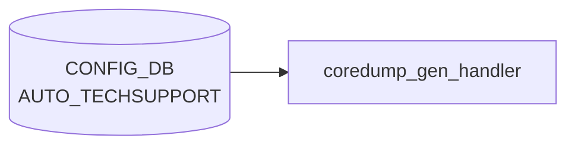

# AUTO_TECHSUPPORT テーブル

## 概要

イベント駆動 (core dump 生成) で `show techsupport` を自動実行・古いダンプを掃除する機能の設定。グローバル既定値の `AUTO_TECHSUPPORT|GLOBAL` と feature 別オーバーライドの `AUTO_TECHSUPPORT_FEATURE|<feature_name>` の 2 系統を持つ[^1]。`auto-techsupport.service` / `coredump-compress` ホストサービスが [CONFIG_DB](../../reference/glossary.md#term-config_db) を購読する。

<!-- cdb-mermaid -->
### データフロー (自動生成)



!!! note "凡例"
    CONFIG_DB から SAI までの典型経路を `docs/reference/config-db-orch-map.md` から機械生成したミニ図。詳細・例外は本ページ本文と対応表を参照。
<!-- /cdb-mermaid -->

## key 構造

```
AUTO_TECHSUPPORT|GLOBAL
AUTO_TECHSUPPORT_FEATURE|<feature_name>
```

## AUTO_TECHSUPPORT|GLOBAL

| フィールド | 型 | 既定 | 説明 |
|-----------|----|------|------|
| `state` | enum `enabled`/`disabled` | - | core dump 駆動 techsupport の有効化 |
| `rate_limit_interval` | uint16 | - | 連続呼出間の最低秒数。`0` で無効化 |
| `max_techsupport_limit` | decimal64 (0.0..99.99) | - | `/var/dump` を占めて良い techsupport 累積容量 [%] |
| `max_core_limit` | decimal64 (0.0..99.99) | - | `/var/core` を占めて良い coredump 累積容量 [%] |
| `available_mem_threshold` | decimal64 (0.0..99.99) | 10.0 | techsupport 起動を抑止するメモリ閾値 [%] |
| `min_available_mem` | uint32 | 200 | techsupport 起動に必要な空きメモリ [MB] |
| `since` | string (1..255) | - | 収集対象期間 (例: `2 days ago`) |

## AUTO_TECHSUPPORT_FEATURE

| フィールド | 型 | 既定 | 説明 |
|-----------|----|------|------|
| `state` | enum `enabled`/`disabled` | - | feature 単位の有効化 |
| `available_mem_threshold` | decimal64 | 10.0 | feature 単位のメモリ閾値 |
| `rate_limit_interval` | uint16 | - | feature 単位の rate limit。`0` で無効化 |

`feature_name` は `FEATURE` テーブルとの整合が前提だが現状 leafref は張られていない ([YANG](../../reference/glossary.md#term-yang) 内コメント `TODO: Leafref once the FEATURE YANG is added`)。

## 購読者

- `coredump_gen_handler.py` (host service): core 検出時に `show techsupport` を起動し、本テーブルの閾値を尊重
- `techsupport_cleanup.py`: `max_*_limit` で古いダンプを削除

## 関連 CONFIG_DB / YANG / CLI

- 関連 [CONFIG_DB](../../reference/glossary.md#term-config_db): `FEATURE`
- 関連 CLI: `config auto-techsupport global`、`config auto-techsupport-feature`
- 関連 [YANG](../../reference/glossary.md#term-yang): `sonic-auto_techsupport`

<!-- ref-triangle:start -->

## 関連リファレンス

- [YANG](../../reference/glossary.md#term-yang): `sonic-auto_techsupport`
- CLI: `config auto-techsupport`

<!-- ref-triangle:end -->

## 引用元

[^1]: YANG 定義: `sonic-auto_techsupport.yang`. <https://github.com/sonic-net/sonic-buildimage/blob/9ea932ec2e18f35e58268ec2e4456b1d4afd65cd/src/sonic-yang-models/yang-models/sonic-auto_techsupport.yang>

<!-- topics-back-ref -->
## 関連 Topics

- [Topics: Telemetry / SNMP / Observability](../../topics/09-telemetry-snmp/index.md)

<!-- /topics-back-ref -->

<!-- ops-hint -->
## 運用ヒント

### 典型値

- key 形式: `AUTO_TECHSUPPORT|GLOBAL`。
- `state`: `enabled`。
- `rate_limit_interval`: `180` 秒。`max_techsupport_limit`: `10`%。

### よくある誤設定

- `max_core_limit` を 0 にすると core 自動収集が抑制され障害解析が困難になる。

### 確認コマンド

```bash
sonic-db-cli CONFIG_DB hgetall 'AUTO_TECHSUPPORT|GLOBAL'
show auto-techsupport global
```
<!-- /ops-hint -->

<!-- glossary-links-injected: 48d5f456ebb6 -->
