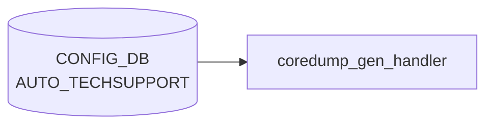

# AUTO_TECHSUPPORT テーブル

## 概要

イベント駆動 (core dump 生成) で `show techsupport` を自動実行・古いダンプを掃除する機能の設定。グローバル既定値の `AUTO_TECHSUPPORT|GLOBAL` と feature 別オーバーライドの `AUTO_TECHSUPPORT_FEATURE|<feature_name>` の 2 系統を持つ[^1]。`auto-techsupport.service` / `coredump-compress` ホストサービスが [CONFIG_DB](../../reference/glossary.md#term-config_db) を購読する。

<!-- cdb-mermaid -->
### データフロー (自動生成)



!!! note "凡例"
    CONFIG_DB から SAI までの典型経路を `docs/reference/config-db-orch-map.md` から機械生成したミニ図。詳細・例外は本ページ本文と対応表を参照。
<!-- /cdb-mermaid -->

## key 構造

```text
AUTO_TECHSUPPORT|GLOBAL
AUTO_TECHSUPPORT_FEATURE|<feature_name>
```

## AUTO_TECHSUPPORT|GLOBAL

| フィールド | 型 | 既定 | 説明 |
|-----------|----|------|------|
| `state` | enum `enabled`/`disabled` | - | core dump 駆動 techsupport の有効化 |
| `rate_limit_interval` | uint16 | - | 連続呼出間の最低秒数。`0` で無効化 |
| `max_techsupport_limit` | decimal64 (0.0..99.99) | - | `/var/dump` を占めて良い techsupport 累積容量 [%] |
| `max_core_limit` | decimal64 (0.0..99.99) | - | `/var/core` を占めて良い coredump 累積容量 [%] |
| `available_mem_threshold` | decimal64 (0.0..99.99) | 10.0 | techsupport 起動を抑止するメモリ閾値 [%] |
| `min_available_mem` | uint32 | 200 | techsupport 起動に必要な空きメモリ [MB] |
| `since` | string (1..255) | - | 収集対象期間 (例: `2 days ago`) |

## AUTO_TECHSUPPORT_FEATURE

| フィールド | 型 | 既定 | 説明 |
|-----------|----|------|------|
| `state` | enum `enabled`/`disabled` | - | feature 単位の有効化 |
| `available_mem_threshold` | decimal64 | 10.0 | feature 単位のメモリ閾値 |
| `rate_limit_interval` | uint16 | - | feature 単位の rate limit。`0` で無効化 |

`feature_name` は `FEATURE` テーブルとの整合が前提だが現状 leafref は張られていない ([YANG](../../reference/glossary.md#term-yang) 内コメント `TODO: Leafref once the FEATURE YANG is added`)。

## 購読者

- `coredump_gen_handler.py` (host service): core 検出時に `show techsupport` を起動し、本テーブルの閾値を尊重
- `techsupport_cleanup.py`: `max_*_limit` で古いダンプを削除

## 関連 CONFIG_DB / YANG / CLI

- 関連 [CONFIG_DB](../../reference/glossary.md#term-config_db): `FEATURE`
- 関連 CLI: `config auto-techsupport global`、`config auto-techsupport-feature`
- 関連 [YANG](../../reference/glossary.md#term-yang): `sonic-auto_techsupport`

<!-- cdb-exceptions -->
## 例外条件・特殊挙動

### memory_threshold_check.py 経由

| 条件 | 挙動 |
|------|------|
| `GLOBAL` エントリが存在しない | デフォルト値で動作 (`available_mem_threshold`=10%, `min_available_mem`=200MB) |
| `available_mem_threshold` = 0 | システムメモリチェック全体をスキップし、feature 単位チェックのみ実行 |
| `available_mem_threshold`/`min_available_mem` が float 変換不可 | `MemoryCheckerException` 発生、techsupport 起動せず `EXIT_FAILURE` |
| 空きメモリ < `min_available_mem` | techsupport を起動しない（`EXIT_THRESHOLD_CROSSED` 返却） |
| `state` フィールド | `memory_threshold_check.py` では直接参照しない（呼び出し元が確認） |
| `rate_limit_interval` / `max_techsupport_limit` | memory_threshold_check では読まれない（coredump 監視デーモンが別途使用） |

<!-- evidence: sonic-net/sonic-utilities/scripts/memory_threshold_check.py:153L -->

### coredump_gen_handler.py 経由の失敗挙動

| consumer | 条件 | 挙動 | ソース |
|---|---|---|---|
| `coredump_gen_handler` | core ファイルが生成後 20 秒以内に存在しない (`verify_recent_file_creation` 失敗) | `"Spurious Invocation"` を syslog INFO に記録して即返却。techsupport / cleanup いずれも実行しない | `coredump_gen_handler.py:73-75` |
| `coredump_gen_handler` | `AUTO_TECHSUPPORT\|GLOBAL` の `state` が `"enabled"` 以外 | `"auto_invoke_ts is disabled"` を syslog NOTICE に記録し techsupport 起動をスキップ | `coredump_gen_handler.py:47-49` |
| `coredump_gen_handler` | `AUTO_TECHSUPPORT_FEATURE\|<container>` の `state` が `"enabled"` 以外 | `"auto-techsupport feature for <container> is not enabled"` を syslog NOTICE に記録し techsupport 起動をスキップ | `coredump_gen_handler.py:55-57` |
| `handle_coredump_cleanup` | `AUTO_TECHSUPPORT\|GLOBAL` の `state` が `"enabled"` 以外 | `"coredump_cleanup is disabled"` を syslog NOTICE に記録して cleanup をスキップ | `coredump_gen_handler.py:17-19` |
| `handle_coredump_cleanup` | `max_core_limit` が `float()` 変換不可または `0` | cleanup をスキップ（`core_usage = 0.0` にフォールバック、`if not core_usage` 節で早期 return） | `coredump_gen_handler.py:22-31` |
| `invoke_ts_cmd` | `show techsupport` が `EXT_LOCKFAIL` (rc=2) で終了 | `"Another instance of techsupport running"` を syslog NOTICE に記録し、今回の起動を中断 | `auto_techsupport_helper.py:240` |
| `invoke_ts_cmd` | `show techsupport` が `EXT_RETRY` (rc=4) で終了かつ再試行上限 (`MAX_RETRY_LIMIT=2`) 超過 | `"MAX_RETRY_LIMIT for show techsupport invocation exceeded"` を syslog ERR に記録 | `auto_techsupport_helper.py:243-245` |
| `invoke_ts_cmd` | `show techsupport` が成功 (rc=0) だが stdout に dump 名が見つからない | `"no techsupport dump is found"` を syslog ERR に記録。[STATE_DB](../../reference/glossary.md#term-state_db) への書き込みは行わない | `auto_techsupport_helper.py:249-251` |

> **Evidence**: `sonic-net/sonic-utilities/scripts/coredump_gen_handler.py:14-78`, `utilities_common/auto_techsupport_helper.py:232-254`
<!-- /cdb-exceptions -->

<!-- value-behavior -->
## 値依存挙動マトリクス

### `state` (enum `enabled`/`disabled`) — `GLOBAL` キー

| 値 | 効果 | evidence |
|---|---|---|
| `enabled` | コアダンプ発生時に techsupport 起動パイプラインを実行する | `sonic-utilities/scripts/coredump_gen_handler.py:17` |
| `disabled` | coredump_cleanup および auto_invoke_ts の両方をスキップ。syslog NOTICE を出力 | `coredump_gen_handler.py:17-18,47-48` |

### `state` (enum `enabled`/`disabled`) — `AUTO_TECHSUPPORT_FEATURE` サブエントリ

| 値 | 効果 | evidence |
|---|---|---|
| `enabled` | 対象 feature (docker) のコアダンプで techsupport を起動 | `coredump_gen_handler.py:55` |
| `disabled` | 対象 feature のコアダンプで techsupport 起動をスキップ | `coredump_gen_handler.py:55-56` |

### フリーフォームフィールド

- `rate_limit_interval` (uint16): `0` で rate-limit 無効、`>0` で N 秒以内の重複起動を抑制
- `max_techsupport_limit` / `max_core_limit` (decimal64 0.0..99.99): 数値型。`techsupport_cleanup.py` が使用
- `since` (string): 収集期間指定。freeform

### 複合条件

- `GLOBAL.state=disabled` → `AUTO_TECHSUPPORT_FEATURE` 各エントリの state に関係なくすべてスキップ (`coredump_gen_handler.py:17`)
- `GLOBAL.state=enabled` かつ feature エントリ `state=disabled` → その feature のコアダンプのみスキップ
<!-- /value-behavior -->

<!-- defaults -->
## コード由来の暗黙デフォルト

以下は YANG `default` 宣言の**外**にあるコードレベルの fallback。`init_cfg.json.j2` の初期値 + ランタイム `.get`/`try-except`/`or` パターンをして導出。

### AUTO_TECHSUPPORT|GLOBAL

| フィールド | YANG default | init_cfg.j2 初期値 | コード fallback | evidence |
|---|---|---|---|---|
| `state` | なし | ビルド変数 `enable_auto_tech_support` で `enabled`/`disabled` | 未設定 → `disabled` 扱い（`!= "enabled"` 分岐でスキップ） | `coredump_gen_handler.py:17`, `techsupport_cleanup.py:27` |
| `rate_limit_interval` | なし | `"180"` (秒) | `ValueError` / 未設定 → `0.0`（rate-limit 無効） | `auto_techsupport_helper.py:323-326` |
| `max_techsupport_limit` | なし | `"10.0"` (%) | `ValueError` / 未設定 → `0.0` → クリーンアップなし | `techsupport_cleanup.py:32-39` |
| `max_core_limit` | なし | `"5.0"` (%) | `ValueError` / 未設定 → `0.0` → クリーンアップなし | `coredump_gen_handler.py:22-30` |
| `available_mem_threshold` | **10.0** | `"10.0"` (%) | 未設定 → `10` (%) — YANG/init_cfg/コード 3層一致 | `memory_threshold_check.py:24,122-127` |
| `min_available_mem` | **200** (MB) | `"200"` | 未設定 → `200 MB`（内部では `× 1024 = 204800 KB`）— 3層一致 | `memory_threshold_check.py:26,128-134` |
| `since` | なし | `"2 days ago"` | 未設定 または `date` 検証失敗 → `"2 days ago"`（二重 fallback） | `auto_techsupport_helper.py:213,215,219` |

### AUTO_TECHSUPPORT_FEATURE

| フィールド | YANG default | init_cfg.j2 / feature.py 初期値 | コード fallback | evidence |
|---|---|---|---|---|
| `state` | なし | GLOBAL `state` 継承 (`infer_auto_ts_capability`) | GLOBAL 未設定 → `"disabled"` | `feature.py:159-174,181-183` |
| `available_mem_threshold` | **10.0** | `"10.0"` | DB 欠落時のみコード定数 `0`（feature チェック無効）— 通常は YANG/init_cfg の 10.0 が優先 | `memory_threshold_check.py:28,139-145` |
| `rate_limit_interval` | なし | `"600"` (秒) | `ValueError` / 未設定 → `0.0`（feature rate-limit 無効） | `auto_techsupport_helper.py:316-330` |

!!! note "FEATURE.available_mem_threshold の非対称"
    `memory_threshold_check.py` のコード定数は `DEFAULT_MEMORY_AVAILABLE_FEATURE_THRESHOLD = 0` (%)。
    これは DB 値が**完全に欠落**した場合のみ有効。通常は `init_cfg.json.j2` または YANG default の `10.0` が DB に書き込まれているため、コード定数 `0` は事実上発動しない。
<!-- /defaults -->

<!-- constants -->
## ハードコード定数

[CONFIG_DB](../../reference/glossary.md#term-config_db) / YANG / init_cfg.json.j2 のいずれからも変更不可能な、コード内固定値。
`coredump_gen_handler.py` / `techsupport_cleanup.py` / 共有ライブラリ `auto_techsupport_helper.py` から抽出。

### ファイルシステムパス (`auto_techsupport_helper.py` L33-39)

| 定数 | 値 | 用途 |
|------|----|------|
| `CORE_DUMP_DIR` | `/var/core` | core dump 収集ディレクトリ。`max_core_limit` の base path |
| `CORE_DUMP_PTRN` | `*.core.gz` | core dump ファイル glob (gzip 圧縮済のみ集計対象) |
| `TS_DIR` | `/var/dump` | techsupport 出力ディレクトリ。`max_techsupport_limit` の base path |
| `TS_PTRN_GLOB` | `sonic_dump_*tar*` | techsupport ファイル glob (cleanup 対象) |

`CORE_DUMP_DIR` は `coredump_gen_handler.py:15,33,72`、`TS_DIR` は `techsupport_cleanup.py:22,25,43` で import 利用される。

### 既定値・タイムアウト (`auto_techsupport_helper.py` L69-71)

| 定数 | 値 | 用途 |
|------|----|------|
| `TIME_BUF` | `20` 秒 | coredump ファイル生成後の有効期間。`verify_recent_file_creation` が使用し、20 秒以上前のファイルは偽陽性として無視する |
| `SINCE_DEFAULT` | `"2 days ago"` | `since` 未設定 / `date` パース失敗時の二重 fallback |
| `TS_GLOBAL_TIMEOUT` | `"60"` (秒) | `show techsupport` 実行のグローバルタイムアウト |

### 終了コード・リトライ (`auto_techsupport_helper.py` L81-84)

| 定数 | 値 | 用途 |
|------|----|------|
| `EXT_LOCKFAIL` | `2` | flock 取得失敗 (重複起動防止) の exit code |
| `EXT_RETRY` | `4` | リトライ要求 exit code |
| `EXT_SUCCESS` | `0` | 正常終了 exit code |
| `MAX_RETRY_LIMIT` | `2` | techsupport 起動失敗時の最大リトライ回数 |

### PATH 注入 (`auto_techsupport_helper.py` L74-78)

クロスビルド (`CROSS_BUILD_ENVIRON=y`) 以外では subprocess 起動前に
`/usr/local/sbin:/usr/local/bin:/usr/sbin:/usr/bin:/sbin:/bin:` を `PATH` 先頭に注入。
`show techsupport` が依存する utilities をネイティブパスから発見させる。

!!! note "の defaults 表との関係"
    `state` / `rate_limit_interval` / `max_techsupport_limit` / `min_available_mem` / `since` の
    既定値そのものは の「コード由来の暗黙デフォルト」表を参照。
    は **DB / YANG / init_cfg のいずれからも変更不可能なリテラル**
    (`/var/core`, `/var/dump`, `SINCE_DEFAULT`, `TS_GLOBAL_TIMEOUT`, `TIME_BUF` 等) のみを扱う。

<!-- /constants -->

<!-- ref-triangle:start -->

## 関連リファレンス

- [YANG](../../reference/glossary.md#term-yang): `sonic-auto_techsupport`
- CLI: `config auto-techsupport`

<!-- ref-triangle:end -->

## 引用元

[^1]: YANG 定義: `sonic-auto_techsupport.yang`. <https://github.com/sonic-net/sonic-buildimage/blob/9ea932ec2e18f35e58268ec2e4456b1d4afd65cd/src/sonic-yang-models/yang-models/sonic-auto_techsupport.yang>

<!-- topics-back-ref -->
## 関連 Topics

- [Topics: Telemetry / SNMP / Observability](../../topics/09-telemetry-snmp/index.md)

<!-- /topics-back-ref -->

<!-- ops-hint -->
## 運用ヒント

### 典型値

- key 形式: `AUTO_TECHSUPPORT|GLOBAL`。
- `state`: `enabled`。
- `rate_limit_interval`: `180` 秒。`max_techsupport_limit`: `10`%。

### よくある誤設定

- `max_core_limit` を 0 にすると core 自動収集が抑制され障害解析が困難になる。

### 確認コマンド

```bash
sonic-db-cli CONFIG_DB hgetall 'AUTO_TECHSUPPORT|GLOBAL'
show auto-techsupport global
```
<!-- /ops-hint -->

<!-- runtime-trace -->
## 実コンテナ動作トレース

### 段階 1 — Consumer 登録

本テーブルに対する常駐 subscriber は存在しない（`sonic-host-services` 全体で `AUTO_TECHSUPPORT` の grep 0 hit）。実装は [hostcfgd](../../reference/glossary.md#term-hostcfgd) と独立した kernel `core_pattern` → `coredump-compress` → `coredump_gen_handler.py` のパイプラインで、必要なフィールドは一発起動スクリプトが同期 HGET で取得する。詳細は を参照。

### 段階 2 — CFG→APPL 翻訳

なし ([APPL_DB](../../reference/glossary.md#term-appl_db) 中継なし)

### 段階 3 — APPL→SAI

なし ([SAI](../../reference/glossary.md#term-sai) 非経由 — global techsupport 設定)

### 段階 4 — タイミングと副作用

**適用タイミング**: CONFIG_DB の `AUTO_TECHSUPPORT` エントリ変化を検知次第即時反映。次回 coredump または syslog イベント発生時から有効。

**副作用**: `max_core_size`/`since` 等のグローバル制限を更新。既存 coredump ファイルの削除・保存には非遡及。
<!-- /runtime-trace -->

<!-- entry-points -->
## 書き込み入り口

対象テーブル: `AUTO_TECHSUPPORT`

### CLI
- `config auto-techsupport global enable/disable`
- `config auto-techsupport global max-techsupport-limit <pct>`
- `config auto-techsupport global rate-limit-interval <secs>`
  - ソース: `sonic-utilities/config/plugins/auto_techsupport.py`

### minigraph / sonic-cfggen
- なし

### REST / gNMI (sonic-mgmt-common)
- なし (対応 OpenConfig/[SONiC](../../reference/glossary.md#term-sonic) YANG transformer なし)

### db_migrator
- なし

### ビルド時デフォルト (init_cfg / j2 テンプレート)
- なし

### ハードコードデフォルト
- なし

### ランタイム注入 (デーモン自動書き込み)
- なし
<!-- /entry-points -->

<!-- side-effects -->
## 副次 DB 書込

CONFIG_DB `AUTO_TECHSUPPORT` テーブルの変更を直接の入力とする host service スクリプト (`coredump_gen_handler.py` / `techsupport_cleanup.py`) は、techsupport ダンプ生成および掃除の過程で **[STATE_DB](../../reference/glossary.md#term-state_db)** に副次的な書込を行う。CONFIG_DB / [APPL_DB](../../reference/glossary.md#term-appl_db) / [COUNTERS_DB](../../reference/glossary.md#term-counters_db) / [ASIC_DB](../../reference/glossary.md#term-asic_db) への書込は発生しない。

| 副次 DB | 書込有無 | 書込キー / 操作 | 根拠 |
|---|---|---|---|
| [STATE_DB](../../reference/glossary.md#term-state_db) | **あり** | `AUTO_TECHSUPPORT_DUMP_INFO\|<ts_dump_name>` (`hset` 相当) | `auto_techsupport_helper.py:302-310` (`write_to_state_db()` が `db.set(STATE_DB, key, TIMESTAMP, ...)`、`EVENT_TYPE`、event_data 各 key、`CONTAINER` を逐次書込) |
| STATE_DB | **あり (削除)** | `AUTO_TECHSUPPORT_DUMP_INFO\|<name>` の `db.delete` | `techsupport_cleanup.py:13-18` (`clean_state_db_entries()` が `cleanup_process()` で削除されたダンプファイル毎に STATE_DB エントリを削除) |
| [APPL_DB](../../reference/glossary.md#term-appl_db) | なし | — | 両スクリプト・helper 内に APPL_DB 参照なし (`auto_techsupport_helper.py` / `coredump_gen_handler.py` / `techsupport_cleanup.py` の `import` および `db.set`/`db.delete`/`Producer` を grep して 0 ヒット) |
| CONFIG_DB | なし (読み取り専用) | — | `db.get(CFG_DB, AUTO_TS, ...)` / `db.get(CFG_DB, FEATURE.format(container), ...)` の **読み取り** のみで書込なし (`coredump_gen_handler.py:17,22,47,55` / `techsupport_cleanup.py:27,32` / `auto_techsupport_helper.py:315-321`) |
| [COUNTERS_DB](../../reference/glossary.md#term-counters_db) | なし | — | techsupport ハンドラ群は [SAI](../../reference/glossary.md#term-sai) 非経由のため counter 系テーブルへの参照なし |
| その他 ([ASIC_DB](../../reference/glossary.md#term-asic_db) / [FLEX_COUNTER_DB](../../reference/glossary.md#term-flex_counter_db) / [LOGLEVEL_DB](../../reference/glossary.md#term-loglevel_db)) | なし | — | 段階 3 トレース参照: [SAI](../../reference/glossary.md#term-sai) 経路なし |

### STATE_DB `AUTO_TECHSUPPORT_DUMP_INFO` エントリの構造

`write_to_state_db()` が書き込むフィールドは以下の通り (`auto_techsupport_helper.py:60-67,302-310`):

| フィールド | 値の型 / 例 | 用途 |
|---|---|---|
| `timestamp` | epoch 秒 (str) | `get_ts_map()` 経由で per-container rate-limit 判定に使用 (`auto_techsupport_helper.py:268-276,292-298`) |
| `event_type` | `core` / `memory` | ダンプ契機 (`EVENT_TYPE_CORE` / `EVENT_TYPE_MEMORY`) |
| `core_dump` | core ファイル名 (event=`core` の場合のみ) | `EVENT_TYPE_CORE` の event_data として渡される (`coredump_gen_handler.py:60`) |
| `container_name` | docker コンテナ名 (省略可) | container 単位 rate-limit のキー (`auto_techsupport_helper.py:309-310`) |

### 副次書込の発生タイミング

- `coredump_gen_handler.py` 経由: critical process の core dump 検出 → `invoke_ts_command_rate_limited()` → `invoke_ts_cmd()` 成功時に `write_to_state_db()` が呼ばれ STATE_DB に新規エントリ追加。
- `techsupport_cleanup.py` 経由: `max_techsupport_limit` 超過時に `cleanup_process()` が物理ファイル削除を返却し、`clean_state_db_entries()` が対応する STATE_DB エントリを `db.delete` で除去。

<!-- /side-effects -->

<!-- platform -->
## プラットフォーム差

AUTO_TECHSUPPORT (GLOBAL) の挙動は [ASIC](../../reference/glossary.md#term-asic) ベンダー / [VOQ](../../reference/glossary.md#term-voq) chassis / namespace 構成に対して**ほぼ非依存**。実装上の配慮は multi-asic で container 名 (`swss0` / `syncd1` 等) を feature 名と照合する 1 箇所のみ。

| 観点 | 影響 | 根拠 |
|------|------|------|
| [ASIC](../../reference/glossary.md#term-asic) ベンダー (Broadcom / Mellanox / Marvell / Innovium / Cisco / [DASH](../../reference/glossary.md#term-dash)) | なし | SAI 非経由。consumer 4 ファイルに vendor 分岐 0 hit |
| multi-asic (`is_multi_npu() == True`) | key 構造は不変。container 名のみ `startswith` で前方一致 | `sonic-utilities/scripts/memory_threshold_check.py:204` |
| [VOQ](../../reference/glossary.md#term-voq) chassis (supervisor + line card) | 各 host で独立動作 | `chassisdb` (`REDIS_CHASSIS_SERVER`) 非参照、host ごとに local CONFIG_DB と `/var/dump/` を扱う |
| namespace (asic0..asicN) | 影響なし | 全 consumer が `SonicV2Connector(use_unix_socket_path=True)` で host CONFIG_DB のみ接続 |
| init_cfg / build template | 分岐なし | `enable_auto_tech_support` ビルド変数で `state` を切替えるのみ。[ASIC](../../reference/glossary.md#term-asic)/chassis 条件式なし |

!!! note "sonic-host-services/scripts/ に consumer なし"
    `grep -rli AUTO_TECHSUPPORT .cache/sonic-sources/sonic-host-services/` は 0 hit。実コンシューマは `sonic-utilities/scripts/{coredump_gen_handler,techsupport_cleanup,memory_threshold_check}.py` + `utilities_common/auto_techsupport_helper.py` に集約。

<!-- /platform -->

<!-- ordering -->
## 書込み順依存

### 起動順 (kernel core_pattern → handler)

`kernel.core_pattern=|/usr/local/bin/coredump-compress %e %t %p %P` (`90-sonic.conf:45`) が `systemd-sysctl.service` で適用された後にのみ、coredump → `coredump-compress` → `coredump_gen_handler.py` のパイプが成立する。sysctl 適用前に critical process がクラッシュした場合 kernel は default pattern を使い、AUTO_TECHSUPPORT 設定は一切評価されない。

### CONFIG_DB 進入条件チェック順

`coredump_gen_handler.py` は CONFIG_DB を以下の順で参照し、いずれかが未充足なら即 return する (GLOBAL kill switch → per-feature kill switch → rate-limit)。

| 順 | キー / フィールド | 未充足時の挙動 | ソース |
|---|---|---|---|
| 1 | `AUTO_TECHSUPPORT\|GLOBAL.state` | `!= "enabled"` → syslog NOTICE のみで終了。FEATURE 読取りに進まない | `coredump_gen_handler.py:47-49` |
| 2 | `trim_masic_suffix(container)` | multi-asic suffix を除去し 1 つの FEATURE エントリで全 instance を表現 | `:52` |
| 3 | `AUTO_TECHSUPPORT_FEATURE\|<feature>.state` | `!= "enabled"` → syslog NOTICE のみで終了 | `:54-58` |
| 4 | `rate_limit_interval` (GLOBAL + FEATURE) | rate-limit 該当なら techsupport 起動せず終了 | `auto_techsupport_helper.py:316-330` |

`techsupport_cleanup.py` も同じ GLOBAL `state` → `max_techsupport_limit` 順で読む (`:27,32`)。

### handler 内アクション順 (`main()`)

```
1. db.connect(CFG_DB); db.connect(STATE_DB)            # :70-71
2. verify_recent_file_creation(/var/core/<name>)       # :73 — TIME_BUF=20s 以内のみ受理
3. handle_core_dump_creation_event()                   # :76-77 — techsupport 起動 + STATE_DB hset
4. handle_coredump_cleanup(args.name, db)              # :78 — /var/core を max_core_limit で掃除
```

段階 3 → 4 の順序は重要。逆順だと **trigger となった core ファイルを techsupport 採取前に削除** してしまい、収集 dump に core が含まれない事故が起きる。現実装はこの順を厳守して防いでいる。

### techsupport_cleanup 内の削除順

```
cleanup_process()           # :43 — 物理ファイル削除を先行
clean_state_db_entries()    # :44 — STATE_DB AUTO_TECHSUPPORT_DUMP_INFO を後追い削除
```

ファイル削除を先行させることで、`cleanup_process` 失敗時に STATE_DB を巻き込まない (再試行可能な状態を維持) 設計。

### warm reboot との関係

- 本 2 スクリプトおよび `auto_techsupport_helper.py` に `WARM_RESTART` / `warm-reboot` 参照は **0 hit**。warm reboot 専用ロジックは持たない
- kernel 継続稼働 = `core_pattern` 継続有効。warm reboot 中の critical process クラッシュでも `coredump-compress` は通常起動する
- `AUTO_TECHSUPPORT_DUMP_INFO` は STATE_DB に保存され warm reboot を跨いで保持される (`auto_techsupport_helper.py:302-310`)。warm reboot 直後の連続 trigger でも rate-limit timestamp が尊重される
- warm reboot 中の container 再起動で `AUTO_TECHSUPPORT_FEATURE|<feature>.state` が瞬間的に消えたタイミングで core が落ちると skip される副作用がある

### 起動シーケンス図

```
systemd-sysctl.service → kernel.core_pattern セット
  ↓
[critical process クラッシュ]
  ↓
kernel pipe → coredump-compress → /var/core/<pfx>core.gz
  ↓
setsid python3 coredump_gen_handler.py <name> <container>
  ↓
GLOBAL.state == enabled ?
  ├─ no → 終了 (syslog)
  └─ yes → FEATURE.state == enabled ?
            ├─ no → 終了 (syslog)
            └─ yes → invoke_ts_command_rate_limited
                       ├─ rate-limit hit → 終了
                       └─ pass → show techsupport → STATE_DB hset
  ↓
handle_coredump_cleanup → /var/core の max_core_limit 超過分削除
```

実運用では `config auto-techsupport global enable` で GLOBAL を有効化した後、各 feature について `config auto-techsupport-feature` で個別有効化する順序を取る (GLOBAL → FEATURE 伝搬は `init_cfg.json.j2` 側 `infer_auto_ts_capability` でビルド時に確立)。

<!-- /ordering -->

<!-- cross-refs -->
## 暗黙参照 — `coredump_gen_handler` / `techsupport_cleanup` が読み書きする関連テーブル

`AUTO_TECHSUPPORT|GLOBAL` の値を起点に動く host service スクリプト
`coredump_gen_handler.py` / `techsupport_cleanup.py` は、共有モジュール
`utilities_common/auto_techsupport_helper.py` を介して **CONFIG_DB の隣接テーブル**
と **STATE_DB の dump info テーブル** を間接的に読み書きする。`AUTO_TECHSUPPORT|GLOBAL.state=enabled`
だけで techsupport 起動が決まらず、container 単位のゲートと rate-limit 履歴の参照を経る。

### CONFIG_DB 暗黙参照 (read)

| テーブル | 参照タイミング | 用途 | evidence |
|---|---|---|---|
| `AUTO_TECHSUPPORT_FEATURE\|<container>` | core 検出時 (Gate-2) | container 単位の `state` チェック。`disabled` または未設定なら techsupport 起動スキップ | `coredump_gen_handler.py:54-58` |
| `AUTO_TECHSUPPORT_FEATURE\|<container>` | rate-limit 判定 | container 単位 `rate_limit_interval` を取得。`ValueError` / 未設定 → `0.0` (rate-limit 無効) | `auto_techsupport_helper.py:316-331` |

`container` は `trim_masic_suffix()` (`auto_techsupport_helper.py:200-201`) で
masic suffix を除去してから (`swss0` → `swss`) `AUTO_TECHSUPPORT_FEATURE|{}` キーに合成される。

### STATE_DB 暗黙参照 — `AUTO_TECHSUPPORT_DUMP_INFO`

「副次 DB 書込」で書込先として扱っているのと同テーブルだが、本スクリプトは
**rate-limit 判定の入力**としても本テーブルを読み出す。読み書きの双方向に依存している点が 観点と異なる。

| 操作 | キー / フィールド | 参照箇所 | 用途 |
|---|---|---|---|
| `db.keys(STATE_DB, "AUTO_TECHSUPPORT_DUMP_INFO*")` | 全件走査 | `auto_techsupport_helper.py:260` (`get_ts_map`) | container 別最終生成時刻を集計 |
| `db.get_all(STATE_DB, <key>)` | `timestamp` / `container_name` | `auto_techsupport_helper.py:264-276` | container 名でグルーピングし `timestamp` を比較対象に |
| `db.set(STATE_DB, ...)` | `timestamp` / `event_type` / `core_dump` / `container_name` | `auto_techsupport_helper.py:302-310` | 新規 techsupport 生成成功時に hset 相当で書込 |
| `db.delete(STATE_DB, ...)` | `AUTO_TECHSUPPORT_DUMP_INFO\|<name>` | `techsupport_cleanup.py:13-18` | `max_techsupport_limit` 超過で物理削除されたエントリを除去 |

> 本テーブルが空のとき、container 側 `rate_limit_interval > 0` でも常に「経過済」扱いとなる
> (`auto_techsupport_helper.py:293`)。逆に同一 container の `timestamp` が現在時刻に近いと
> 当該 container の techsupport 起動を抑制する。`container_name` フィールド欠落エントリは
> グローバル枠として集計されない。

### 関連 — しかし現状コードでは未参照のテーブル

| テーブル | 関係性 | 現状の参照 | evidence |
|---|---|---|---|
| `FEATURE` (アプリ feature 有効化) | YANG コメント `TODO: Leafref once the FEATURE YANG is added` で参照予定とされる | `coredump_gen_handler.py` / `techsupport_cleanup.py` / `auto_techsupport_helper.py` のいずれも未参照。container 妥当性は `AUTO_TECHSUPPORT_FEATURE\|<container>` の存否のみで間接判定 | 上記 3 ファイルに `"FEATURE"` 単独文字列なし (`FEATURE = "AUTO_TECHSUPPORT_FEATURE\|{}"` のサブ文字列のみ) |
| [`DEVICE_METADATA`](device-metadata.md) (`localhost.hostname` / `platform`) | `show techsupport` 出力には反映され得るが、本スクリプトの CONFIG_DB 参照経路には現れない | スクリプト 3 ファイル全行で `DEVICE_METADATA` / `hostname` / `localhost` の hit 0 | 同上 |

### 範囲外 (誤解されやすい隣接)

- `DOCKER_STATS` (STATE_DB): `memory_threshold_check.py` の別エントリポイントが参照する
  per-container メモリ統計で、`coredump_gen_handler.py` / `techsupport_cleanup.py` 経路では未参照
- `FEATURE` テーブル本体は `hostcfgd` の `FeatureHandler` が docker サービス on/off の起点として
  使うのみで、auto-techsupport 起動判定には関与しない

<!-- /cross-refs -->

<!-- failure -->
## 失敗挙動・エラーパス

> **Evidence**: `coredump_gen_handler.py`, `techsupport_cleanup.py`, `utilities_common/auto_techsupport_helper.py` (2026-05-15)  

### techsupport 起動失敗・retry (`auto_techsupport_helper.invoke_ts_cmd`)

`show techsupport` を `subprocess_exec` 経由で起動した直後の `returncode` を分岐させる。Python レベルの `subprocess.TimeoutExpired` は raise されず、タイムアウトは `--global-timeout 60` (CLI 側) に委ねている (`auto_techsupport_helper.py:71,87-94`)。

| 条件 | 結果 | ログ | evidence |
|---|---|---|---|
| `rc == EXT_LOCKFAIL` (`2`) — flock 取得失敗 (別 instance 実行中) | retry なし・即時 abort・新規ダンプなし | `LOG_NOTICE "Another instance of techsupport running, aborting this. stderr: ..."` | `auto_techsupport_helper.py:239-240` |
| `rc == EXT_RETRY` (`4`) かつ `num_retry <= MAX_RETRY_LIMIT` (`2`) | `invoke_ts_cmd(db, num_retry+1)` で再帰再試行 (最大 2 回追加) | なし | `auto_techsupport_helper.py:84,241-243` |
| `rc == EXT_RETRY` かつ `num_retry > MAX_RETRY_LIMIT` | 打ち切り・新規ダンプなし | `LOG_ERR "MAX_RETRY_LIMIT for show techsupport invocation exceeded, stderr: ..."` | `auto_techsupport_helper.py:244-245` |
| `rc != EXT_SUCCESS` かつ上記以外 (汎用失敗 / `--global-timeout 60` 経過後の非 0 含む) | retry なし・新規ダンプなし | `LOG_ERR "show techsupport failed with exit code {rc}, stderr: ..."` | `auto_techsupport_helper.py:246-247` |
| `rc == EXT_SUCCESS` だが stdout に `sonic_dump_.*tar.*` マッチなし | 空文字返却 → `write_to_state_db()` 不呼出・STATE_DB 更新なし | `LOG_ERR "stdout of the 'show techsupport' cmd doesn't have the dump name"` ＋ `LOG_ERR "{cmd} was run, but no techsupport dump is found"` | `auto_techsupport_helper.py:228-229,250-251` |

### rate-limit による skip (`verify_rate_limit_intervals`)

`invoke_ts_command_rate_limited()` が `invoke_ts_cmd()` 呼出前に評価し、未経過なら起動自体をスキップ。

| 条件 | 結果 | ログ | evidence |
|---|---|---|---|
| `time.time() - mtime(<最新 ts_dump>) < GLOBAL.rate_limit_interval` | グローバル rate-limit 未経過 → `False` → techsupport スキップ | `syslog "Global rate_limit_interval period has not passed. Techsupport Invocation is skipped"` | `auto_techsupport_helper.py:285-290` |
| `time.time() - <container 最古 entry> < FEATURE.rate_limit_interval` | コンテナ単位 rate-limit 未経過 → スキップ | `syslog "Per Container rate_limit_interval for {container} has not passed. Techsupport Invocation is skipped"` | `auto_techsupport_helper.py:292-298` |
| `GLOBAL` / `FEATURE` の `rate_limit_interval` が `ValueError` (非数値) | `0.0` fallback → rate-limit 実質無効化 (skip ではなく無効化) | なし | `auto_techsupport_helper.py:323-331` |

### state ガード・spurious invocation

| 条件 | 結果 | ログ | evidence |
|---|---|---|---|
| `AUTO_TECHSUPPORT\|GLOBAL.state != "enabled"` (未設定含む) | techsupport 起動も cleanup も全スキップ | `LOG_NOTICE "auto_invoke_ts is disabled. No cleanup is performed: core ..."` | `coredump_gen_handler.py:47-48` |
| `AUTO_TECHSUPPORT_FEATURE\|<container>.state != "enabled"` | 当該 feature の techsupport 起動のみスキップ | `LOG_NOTICE "auto-techsupport feature for {container} is not enabled. ..."` | `coredump_gen_handler.py:55-57` |
| core ファイルの mtime が `TIME_BUF` (`20` 秒) 以上前 | spurious invocation として早期 return | `LOG_INFO "Spurious Invocation. {file_path} is not created within last 20 sec"` | `coredump_gen_handler.py:73-74`, `auto_techsupport_helper.py:115-125` |
| `os.path.getmtime(core_file)` が `Exception` (ファイル不在) | `verify_recent_file_creation()` が `False` → 同上 spurious 分岐 | なし | `auto_techsupport_helper.py:118-121` |

### cleanup (disk full / max_core_limit / max_techsupport_limit) 失敗

`cleanup_process()` は `/var/core` `/var/dump` 配下の disk 使用率を限界内に保つ。

| 条件 | 結果 | ログ | evidence |
|---|---|---|---|
| `max_core_limit` / `max_techsupport_limit` が `ValueError` (非数値) | `0.0` fallback → `if not limit` でガード → cleanup スキップ | `LOG_NOTICE "max-techsupport-limit argument is not set. ..."` / `"core-usage argument is not set. ..."` | `coredump_gen_handler.py:23-30`, `techsupport_cleanup.py:33-40` |
| `limit` が `(0,100)` 範囲外 | cleanup 即時 return | `LOG_ERR "core_usage_limit can only be between 1 and 100, whereas the configured value is: {limit}"` | `auto_techsupport_helper.py:173-175` |
| `os.remove(<oldest dump>)` が `OSError` (権限 / 既に削除済 / disk error) | `continue` で skip・raise しない | なし (silent) | `auto_techsupport_helper.py:193-194` |
| `len(fs_stats) <= 1` (最新ダンプ 1 個のみ) | 最新は必ず保持 — 閾値未達成のままループ脱出 | `LOG_INFO "{deleted} deleted from {dir}"` (削除量 0 でも emit) | `auto_techsupport_helper.py:188,196` |
| disk full で `show techsupport` 自体が失敗 | `invoke_ts_cmd()` の `rc != EXT_SUCCESS` 経路に流入 | `LOG_ERR "show techsupport failed with exit code ..."` | `auto_techsupport_helper.py:246-247` |

### memory check 失敗 (`memory_threshold_check.py` 補助スクリプト)

| 条件 | exit code | 挙動 | evidence |
|---|---|---|---|
| `available_mem_threshold` / `min_available_mem` が `float()` 変換失敗 | `EXIT_FAILURE` (`1`) | `MemoryCheckerException` raise → techsupport 不起動 | `memory_threshold_check.py:36-37,154-156,232-235` |
| `/proc/meminfo` の `MemAvailable` 取得不能 (`KeyError`/`ValueError`) | `EXIT_FAILURE` (`1`) | 同上 | `memory_threshold_check.py:104-108` |
| 空きメモリ < `min_available_mem` または < `available_mem_threshold` % | `EXIT_THRESHOLD_CROSSED` (`2`) | techsupport を起動しない通常スキップ (失敗ではなく抑止) | `memory_threshold_check.py:11-12,177,232` |

### 部分成功の性質

`cleanup_process()` は `OSError` を `continue` で握り潰し、削除成功分のみ `removed_files` リストに append する。`clean_state_db_entries()` は成功分のみ STATE_DB から `db.delete` するため、削除失敗ファイルに対応する `AUTO_TECHSUPPORT_DUMP_INFO|<name>` は次回 cleanup まで残存する (`auto_techsupport_helper.py:188-197`, `techsupport_cleanup.py:13-18,43-44`)。`invoke_ts_cmd()` の再帰 retry は `EXT_RETRY` 3 回 (初回 + `MAX_RETRY_LIMIT=2`) で必ず打ち切られる。`write_to_state_db()` は `new_file` が truthy のときのみ呼ばれ、起動失敗時には STATE_DB entry が作られないため、次回 rate-limit 判定は失敗を「未起動」として扱う (rate-limit リセットされない)。

> **Evidence**: [sonic-utilities](../../reference/glossary.md#term-sonic-utilities) `scripts/coredump_gen_handler.py:17,22-30,47-48,55-57,73-74`; `scripts/techsupport_cleanup.py:23,27-30,33-43`; `utilities_common/auto_techsupport_helper.py:71,74-78,81-84,87-94,115-125,171-197,232-254,282-299,313-337`; 補助: `scripts/memory_threshold_check.py:11-12,36-37,104-108,154-156,177,232-235`
<!-- /failure -->

<!-- pubsub -->
## 通信メカニズム

### Redis 購読方式

`AUTO_TECHSUPPORT|GLOBAL` テーブルには **常駐 subscriber が存在しない**。`ConfigDBConnector.subscribe()` / `listen()` / `SubscriberStateTable` / [Redis](../../reference/glossary.md#term-redis) keyspace 通知 (`__keyspace@<dbId>__:AUTO_TECHSUPPORT*`) のいずれも本テーブルを観測しておらず、`hostcfgd` / `featured` などの常駐 daemon は本テーブルを参照しない (`sonic-host-services/` 全体で `AUTO_TECHSUPPORT` の grep 0 hit)。

代わりに、外部トリガー (kernel `core_pattern` パイプ / `monit` 周期実行) で起動される **一発実行スクリプト** が、必要なフィールドだけ同期 `HGET` または `HGETALL` で取得して終了する。設定変更は次回起動時に「結果的に」反映される (eventual reload)。

| 消費者 | 起動方式 | DB アクセス API | [Redis](../../reference/glossary.md#term-redis) primitive |
|--------|---------|----------------|-----------------|
| `coredump_gen_handler.py` | kernel `core_pattern` → `coredump-compress` (パイプ受け) | `SonicV2Connector.get()` | 単発 HGET |
| `techsupport_cleanup.py` | `coredump_gen_handler` 後段フック / 周期実行 | `SonicV2Connector.get()` | 単発 HGET |
| `memory_threshold_check.py` | `monit` 周期 / `coredump_gen_handler` 経由 | `ConfigDBConnector.get_table()` | 単発 HGETALL スナップショット |
| `hostcfgd` | 常駐 daemon | — | **購読しない** (grep 0 hit) |

### トリガ経路 (G-1: coredump_gen_handler)

```
プロセスクラッシュ
  │  (kernel core_dump)
  ▼
kernel.core_pattern=|/usr/local/bin/coredump-compress %e %t %p %P
  │  (sonic-buildimage 90-sonic.conf:45)
  ▼
/usr/local/bin/coredump-compress
  └─ setsid python3 coredump_gen_handler.py ${PREFIX}core.gz ${CONTAINER}
       ▼
       SonicV2Connector(use_unix_socket_path=True).connect(CFG_DB)
       ├─ db.get(CFG_DB, "AUTO_TECHSUPPORT|GLOBAL", "state")               ← HGET
       ├─ db.get(CFG_DB, "AUTO_TECHSUPPORT_FEATURE|<feature>", "state")    ← HGET
       └─ invoke_ts_command_rate_limited()
            └─ db.get(CFG_DB, "AUTO_TECHSUPPORT|GLOBAL",
                     "rate_limit_interval")                                ← HGET
```

- 常駐プロセスなし。`setsid` でバックグラウンド起動し、処理後即終了する。
- 設定変更通知は受け取らず、次回 core dump 発生時に最新値を都度読み出す。
- `SonicV2Connector.get(db, key, field)` は内部で `HGET <key> <field>` を発行する単発同期コマンド。

### トリガ経路 (G-2: memory_threshold_check)

`monit` から周期起動される `memory_threshold_check.py` は、`ConfigDBConnector` を `connect()` した直後に `get_table("AUTO_TECHSUPPORT")` (=全行 `HGETALL` スナップショット) を 1 回取得し、`available_mem_threshold` / `min_available_mem` を比較してから exit する (`memory_threshold_check.py:117-145`)。subscribe / keyspace 通知は使用しない。

### 設定変更の反映タイミング

| 操作 | 反映契機 |
|---|---|
| `config auto-techsupport global state ...` | 次回 core dump 発生時 / 次回 monit cycle |
| `config auto-techsupport global rate-limit-interval <s>` | 次回 core dump 発生時 (`invoke_ts_command_rate_limited` 内 HGET) |
| `config auto-techsupport global max-techsupport-limit <pct>` | 次回 `techsupport_cleanup.py` 実行時 |
| `config auto-techsupport global available-mem-threshold <pct>` | 次回 `memory_threshold_check.py` 実行時 (monit cycle、既定 60s) |

> **常駐 subscriber 不在のため、変更直後に即時反映する仕組みは存在しない。** 反映遅延は外部トリガー (core dump 発生 / monit cycle) の周期に依存する。

<!-- /pubsub -->

## コア生成から techsupport 起動までの順序依存関係

### 1. カーネル coredump パイプ起動

カーネルが `kernel.core_pattern` に従いプロセスクラッシュを検知し、`coredump-compress` スクリプトへ標準入力でコアデータをパイプする。

```
kernel.core_pattern = |/usr/local/bin/coredump-compress %e %t %p %P
kernel.core_pipe_limit = 16
```

ソース: `sonic-buildimage/files/image_config/sysctl/90-sonic.conf:45,55`

### 2. coredump-compress による圧縮・保存

`coredump-compress` が `/var/core/<prefix>.core.gz` に gzip 圧縮して保存する。コアダンプが Docker コンテナプロセス由来の場合 (`/proc/<PID>/cgroup` から `CONTAINER_ID` を判定) のみ次フェーズへ進む。

ソース: `sonic-utilities/scripts/coredump-compress:12,19-31`

### 3. coredump_gen_handler.py 非同期呼び出し

`coredump-compress` がコンテナ名確定後に `setsid python3 coredump_gen_handler.py <core.gz> <container_name>` を **バックグラウンド (`&`)** で起動する。この非同期化により `coredump-compress` はカーネルのパイプタイムアウトに依存せずに返却できる。

### 4. CONFIG_DB 順序チェック (coredump_gen_handler.py)

`coredump_gen_handler.py` は以下の順序で CONFIG_DB を参照し、いずれかで条件不成立であれば後続をスキップする。

| ステップ | 参照キー | 条件 | 不成立時 |
|---------|---------|------|---------|
| 4-1 | `AUTO_TECHSUPPORT\|GLOBAL` `state` | `"enabled"` | syslog NOTICE 出力後 `auto_invoke_ts` スキップ |
| 4-2 | `AUTO_TECHSUPPORT_FEATURE\|<container>` `state` | `"enabled"` | techsupport 起動スキップ |
| 4-3 | rate-limit チェック | 前回起動から `rate_limit_interval` 秒経過 | 起動抑制 |
| 4-4 | メモリ閾値チェック | 空きメモリ ≥ `min_available_mem` かつ `available_mem_threshold` | 起動抑制 |

ソース: `sonic-utilities/scripts/coredump_gen_handler.py:17,47,55-60`

### 5. coredump_cleanup の実行順序

`coredump_gen_handler.py` の `main()` は techsupport 呼び出し後に `handle_coredump_cleanup()` を **同期で** 呼び出す。cleanup は `AUTO_TECHSUPPORT|GLOBAL` `state` が `"enabled"` かつ `max_core_limit` が 0 より大きい場合のみ実施。

ソース: `sonic-utilities/scripts/coredump_gen_handler.py:76-78`

### 6. systemd-coredump との関係

[SONiC](../../reference/glossary.md#term-sonic) は **systemd-coredump を使用しない**。`kernel.core_pattern` をパイプ (`|`) で独自スクリプト (`coredump-compress`) に向けることで systemd-coredump の介在を排除している。`/etc/systemd/coredump.conf` は参照されない。

### 7. AUTO_TECHSUPPORT 連携まとめ

```
クラッシュ発生
  └─ kernel → coredump-compress (同期パイプ)
       └─ /var/core/<name>.core.gz 保存
            └─ coredump_gen_handler.py (非同期 setsid &)
                 ├─ CONFIG_DB: AUTO_TECHSUPPORT|GLOBAL.state == "enabled" ?
                 ├─ CONFIG_DB: AUTO_TECHSUPPORT_FEATURE|<c>.state == "enabled" ?
                 ├─ rate_limit_interval チェック
                 ├─ メモリ閾値チェック
                 ├─ show techsupport 起動 → /var/dump/sonic_dump_*.tar.gz
                 └─ handle_coredump_cleanup (max_core_limit に基づき /var/core 整理)
```

<!-- glossary-links-injected: 48d5f456ebb6 -->
