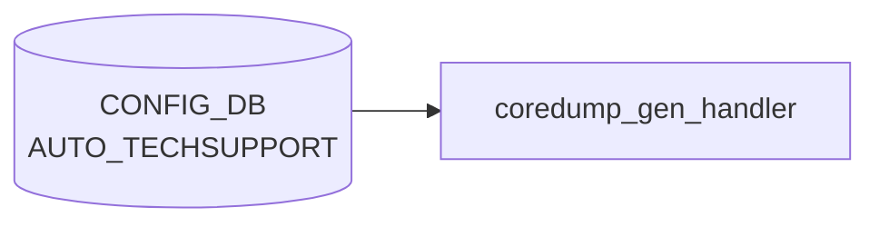

# AUTO_TECHSUPPORT テーブル

## 概要

イベント駆動 (core dump 生成) で `show techsupport` を自動実行・古いダンプを掃除する機能の設定。グローバル既定値の `AUTO_TECHSUPPORT|GLOBAL` と feature 別オーバーライドの `AUTO_TECHSUPPORT_FEATURE|<feature_name>` の 2 系統を持つ[^1]。`auto-techsupport.service` / `coredump-compress` ホストサービスが [CONFIG_DB](../../reference/glossary.md#term-config_db) を購読する。

<!-- cdb-mermaid -->
### データフロー (自動生成)



!!! note "凡例"
    CONFIG_DB から SAI までの典型経路を `docs/reference/config-db-orch-map.md` から機械生成したミニ図。詳細・例外は本ページ本文と対応表を参照。
<!-- /cdb-mermaid -->

## key 構造

```text
AUTO_TECHSUPPORT|GLOBAL
AUTO_TECHSUPPORT_FEATURE|<feature_name>
```

## AUTO_TECHSUPPORT|GLOBAL

| フィールド | 型 | 既定 | 説明 |
|-----------|----|------|------|
| `state` | enum `enabled`/`disabled` | - | core dump 駆動 techsupport の有効化 |
| `rate_limit_interval` | uint16 | - | 連続呼出間の最低秒数。`0` で無効化 |
| `max_techsupport_limit` | decimal64 (0.0..99.99) | - | `/var/dump` を占めて良い techsupport 累積容量 [%] |
| `max_core_limit` | decimal64 (0.0..99.99) | - | `/var/core` を占めて良い coredump 累積容量 [%] |
| `available_mem_threshold` | decimal64 (0.0..99.99) | 10.0 | techsupport 起動を抑止するメモリ閾値 [%] |
| `min_available_mem` | uint32 | 200 | techsupport 起動に必要な空きメモリ [MB] |
| `since` | string (1..255) | - | 収集対象期間 (例: `2 days ago`) |

## AUTO_TECHSUPPORT_FEATURE

| フィールド | 型 | 既定 | 説明 |
|-----------|----|------|------|
| `state` | enum `enabled`/`disabled` | - | feature 単位の有効化 |
| `available_mem_threshold` | decimal64 | 10.0 | feature 単位のメモリ閾値 |
| `rate_limit_interval` | uint16 | - | feature 単位の rate limit。`0` で無効化 |

`feature_name` は `FEATURE` テーブルとの整合が前提だが現状 leafref は張られていない ([YANG](../../reference/glossary.md#term-yang) 内コメント `TODO: Leafref once the FEATURE YANG is added`)。

## 購読者

- `coredump_gen_handler.py` (host service): core 検出時に `show techsupport` を起動し、本テーブルの閾値を尊重
- `techsupport_cleanup.py`: `max_*_limit` で古いダンプを削除

## 関連 CONFIG_DB / YANG / CLI

- 関連 [CONFIG_DB](../../reference/glossary.md#term-config_db): `FEATURE`
- 関連 CLI: `config auto-techsupport global`、`config auto-techsupport-feature`
- 関連 [YANG](../../reference/glossary.md#term-yang): `sonic-auto_techsupport`

<!-- cdb-exceptions -->
## 例外条件・特殊挙動

| 条件 | 挙動 |
|------|------|
| `GLOBAL` エントリが存在しない | デフォルト値で動作 (`available_mem_threshold`=10%, `min_available_mem`=200MB) |
| `available_mem_threshold` = 0 | システムメモリチェック全体をスキップし、feature 単位チェックのみ実行 |
| `available_mem_threshold`/`min_available_mem` が float 変換不可 | `MemoryCheckerException` 発生、techsupport 起動せず `EXIT_FAILURE` |
| 空きメモリ < `min_available_mem` | techsupport を起動しない（`EXIT_THRESHOLD_CROSSED` 返却） |
| `state` フィールド | `memory_threshold_check.py` では直接参照しない（呼び出し元が確認） |
| `rate_limit_interval` / `max_techsupport_limit` | memory_threshold_check では読まれない（coredump 監視デーモンが別途使用） |

<!-- evidence: sonic-net/sonic-utilities/scripts/memory_threshold_check.py:153L -->
<!-- /cdb-exceptions -->

<!-- value-behavior -->
## 値依存挙動マトリクス

### `state` (enum `enabled`/`disabled`) — `GLOBAL` キー

| 値 | 効果 | evidence |
|---|---|---|
| `enabled` | コアダンプ発生時に techsupport 起動パイプラインを実行する | `sonic-utilities/scripts/coredump_gen_handler.py:17` |
| `disabled` | coredump_cleanup および auto_invoke_ts の両方をスキップ。syslog NOTICE を出力 | `coredump_gen_handler.py:17-18,47-48` |

### `state` (enum `enabled`/`disabled`) — `AUTO_TECHSUPPORT_FEATURE` サブエントリ

| 値 | 効果 | evidence |
|---|---|---|
| `enabled` | 対象 feature (docker) のコアダンプで techsupport を起動 | `coredump_gen_handler.py:55` |
| `disabled` | 対象 feature のコアダンプで techsupport 起動をスキップ | `coredump_gen_handler.py:55-56` |

### フリーフォームフィールド

- `rate_limit_interval` (uint16): `0` で rate-limit 無効、`>0` で N 秒以内の重複起動を抑制
- `max_techsupport_limit` / `max_core_limit` (decimal64 0.0..99.99): 数値型。`techsupport_cleanup.py` が使用
- `since` (string): 収集期間指定。freeform

### 複合条件

- `GLOBAL.state=disabled` → `AUTO_TECHSUPPORT_FEATURE` 各エントリの state に関係なくすべてスキップ (`coredump_gen_handler.py:17`)
- `GLOBAL.state=enabled` かつ feature エントリ `state=disabled` → その feature のコアダンプのみスキップ
<!-- /value-behavior -->

<!-- defaults -->
## コード由来の暗黙デフォルト (Phase A)

以下は YANG `default` 宣言の**外**にあるコードレベルの fallback。`init_cfg.json.j2` の初期値 + ランタイム `.get`/`try-except`/`or` パターンを全行精読して導出。

### AUTO_TECHSUPPORT|GLOBAL

| フィールド | YANG default | init_cfg.j2 初期値 | コード fallback | evidence |
|---|---|---|---|---|
| `state` | なし | ビルド変数 `enable_auto_tech_support` で `enabled`/`disabled` | 未設定 → `disabled` 扱い（`!= "enabled"` 分岐でスキップ） | `coredump_gen_handler.py:17`, `techsupport_cleanup.py:27` |
| `rate_limit_interval` | なし | `"180"` (秒) | `ValueError` / 未設定 → `0.0`（rate-limit 無効） | `auto_techsupport_helper.py:323-326` |
| `max_techsupport_limit` | なし | `"10.0"` (%) | `ValueError` / 未設定 → `0.0` → クリーンアップなし | `techsupport_cleanup.py:32-39` |
| `max_core_limit` | なし | `"5.0"` (%) | `ValueError` / 未設定 → `0.0` → クリーンアップなし | `coredump_gen_handler.py:22-30` |
| `available_mem_threshold` | **10.0** | `"10.0"` (%) | 未設定 → `10` (%) — YANG/init_cfg/コード 3層一致 | `memory_threshold_check.py:24,122-127` |
| `min_available_mem` | **200** (MB) | `"200"` | 未設定 → `200 MB`（内部では `× 1024 = 204800 KB`）— 3層一致 | `memory_threshold_check.py:26,128-134` |
| `since` | なし | `"2 days ago"` | 未設定 または `date` 検証失敗 → `"2 days ago"`（二重 fallback） | `auto_techsupport_helper.py:213,215,219` |

### AUTO_TECHSUPPORT_FEATURE

| フィールド | YANG default | init_cfg.j2 / feature.py 初期値 | コード fallback | evidence |
|---|---|---|---|---|
| `state` | なし | GLOBAL `state` 継承 (`infer_auto_ts_capability`) | GLOBAL 未設定 → `"disabled"` | `feature.py:159-174,181-183` |
| `available_mem_threshold` | **10.0** | `"10.0"` | DB 欠落時のみコード定数 `0`（feature チェック無効）— 通常は YANG/init_cfg の 10.0 が優先 | `memory_threshold_check.py:28,139-145` |
| `rate_limit_interval` | なし | `"600"` (秒) | `ValueError` / 未設定 → `0.0`（feature rate-limit 無効） | `auto_techsupport_helper.py:316-330` |

!!! note "FEATURE.available_mem_threshold の非対称"
    `memory_threshold_check.py` のコード定数は `DEFAULT_MEMORY_AVAILABLE_FEATURE_THRESHOLD = 0` (%)。
    これは DB 値が**完全に欠落**した場合のみ有効。通常は `init_cfg.json.j2` または YANG default の `10.0` が DB に書き込まれているため、コード定数 `0` は事実上発動しない。
<!-- /defaults -->

<!-- constants -->
## ハードコード定数 (Phase E)

CONFIG_DB / YANG / init_cfg.json.j2 のいずれからも変更不可能な、コード内固定値。
`coredump_gen_handler.py` / `techsupport_cleanup.py` / 共有ライブラリ `auto_techsupport_helper.py` から抽出。

### ファイルシステムパス (`auto_techsupport_helper.py` L33-39)

| 定数 | 値 | 用途 |
|------|----|------|
| `CORE_DUMP_DIR` | `/var/core` | core dump 収集ディレクトリ。`max_core_limit` の base path |
| `CORE_DUMP_PTRN` | `*.core.gz` | core dump ファイル glob (gzip 圧縮済のみ集計対象) |
| `TS_DIR` | `/var/dump` | techsupport 出力ディレクトリ。`max_techsupport_limit` の base path |
| `TS_PTRN_GLOB` | `sonic_dump_*tar*` | techsupport ファイル glob (cleanup 対象) |

`CORE_DUMP_DIR` は `coredump_gen_handler.py:15,33,72`、`TS_DIR` は `techsupport_cleanup.py:22,25,43` で import 利用される。

### 既定値・タイムアウト (`auto_techsupport_helper.py` L69-71)

| 定数 | 値 | 用途 |
|------|----|------|
| `TIME_BUF` | `20` 秒 | rate-limit 判定の許容バッファ (`rate_limit_interval` 経過後 +20 秒の猶予) |
| `SINCE_DEFAULT` | `"2 days ago"` | `since` 未設定 / `date` パース失敗時の二重 fallback |
| `TS_GLOBAL_TIMEOUT` | `"60"` (秒) | `show techsupport` 実行のグローバルタイムアウト |

### 終了コード・リトライ (`auto_techsupport_helper.py` L81-84)

| 定数 | 値 | 用途 |
|------|----|------|
| `EXT_LOCKFAIL` | `2` | flock 取得失敗 (重複起動防止) の exit code |
| `EXT_RETRY` | `4` | リトライ要求 exit code |
| `EXT_SUCCESS` | `0` | 正常終了 exit code |
| `MAX_RETRY_LIMIT` | `2` | techsupport 起動失敗時の最大リトライ回数 |

### PATH 注入 (`auto_techsupport_helper.py` L74-78)

クロスビルド (`CROSS_BUILD_ENVIRON=y`) 以外では subprocess 起動前に
`/usr/local/sbin:/usr/local/bin:/usr/sbin:/usr/bin:/sbin:/bin:` を `PATH` 先頭に注入。
`show techsupport` が依存する utilities をネイティブパスから発見させる。

!!! note "Phase A の defaults 表との関係"
    `state` / `rate_limit_interval` / `max_techsupport_limit` / `min_available_mem` / `since` の
    既定値そのものは Phase A の「コード由来の暗黙デフォルト」表を参照。
    Phase E は **DB / YANG / init_cfg のいずれからも変更不可能なリテラル**
    (`/var/core`, `/var/dump`, `SINCE_DEFAULT`, `TS_GLOBAL_TIMEOUT`, `TIME_BUF` 等) のみを扱う。

詳細は `meta/_intermediate/cdb-flow/auto-techsupport-constants.md` を参照。
<!-- /constants -->

<!-- ref-triangle:start -->

## 関連リファレンス

- [YANG](../../reference/glossary.md#term-yang): `sonic-auto_techsupport`
- CLI: `config auto-techsupport`

<!-- ref-triangle:end -->

## 引用元

[^1]: YANG 定義: `sonic-auto_techsupport.yang`. <https://github.com/sonic-net/sonic-buildimage/blob/9ea932ec2e18f35e58268ec2e4456b1d4afd65cd/src/sonic-yang-models/yang-models/sonic-auto_techsupport.yang>

<!-- topics-back-ref -->
## 関連 Topics

- [Topics: Telemetry / SNMP / Observability](../../topics/09-telemetry-snmp/index.md)

<!-- /topics-back-ref -->

<!-- ops-hint -->
## 運用ヒント

### 典型値

- key 形式: `AUTO_TECHSUPPORT|GLOBAL`。
- `state`: `enabled`。
- `rate_limit_interval`: `180` 秒。`max_techsupport_limit`: `10`%。

### よくある誤設定

- `max_core_limit` を 0 にすると core 自動収集が抑制され障害解析が困難になる。

### 確認コマンド

```bash
sonic-db-cli CONFIG_DB hgetall 'AUTO_TECHSUPPORT|GLOBAL'
show auto-techsupport global
```
<!-- /ops-hint -->


<!-- runtime-trace -->
## 実コンテナ動作トレース

### 段階 1 — Consumer 登録

`auto_techsupport_handler` (`sonic-host-services`) が CONFIG_DB の `AUTO_TECHSUPPORT` テーブルを購読する。

global テーブル (single key `GLOBAL`) と feature テーブルを同一ハンドラが購読。

### 段階 2 — CFG→APPL 翻訳

なし (APPL_DB 中継なし)

### 段階 3 — APPL→SAI

なし (SAI 非経由 — global techsupport 設定)

### 段階 4 — タイミングと副作用

**適用タイミング**: CONFIG_DB の `AUTO_TECHSUPPORT` エントリ変化を検知次第即時反映。次回 coredump または syslog イベント発生時から有効。

**副作用**: `max_core_size`/`since` 等のグローバル制限を更新。既存 coredump ファイルの削除・保存には非遡及。
<!-- /runtime-trace -->

<!-- entry-points -->
## 書き込み入り口 (Direction A)

対象テーブル: `AUTO_TECHSUPPORT`

### CLI
- `config auto-techsupport global enable/disable`
- `config auto-techsupport global max-techsupport-limit <pct>`
- `config auto-techsupport global rate-limit-interval <secs>`
  - ソース: `sonic-utilities/config/plugins/auto_techsupport.py`

### minigraph / sonic-cfggen
- なし

### REST / gNMI (sonic-mgmt-common)
- なし (対応 OpenConfig/SONiC YANG transformer なし)

### db_migrator
- なし

### ビルド時デフォルト (init_cfg / j2 テンプレート)
- なし

### ハードコードデフォルト
- なし

### ランタイム注入 (デーモン自動書き込み)
- なし
<!-- /entry-points -->

<!-- side-effects -->
## 副次 DB 書込 (Phase F)

CONFIG_DB `AUTO_TECHSUPPORT` テーブルの変更を直接の入力とする host service スクリプト (`coredump_gen_handler.py` / `techsupport_cleanup.py`) は、techsupport ダンプ生成および掃除の過程で **STATE_DB** に副次的な書込を行う。CONFIG_DB / APPL_DB / COUNTERS_DB / ASIC_DB への書込は発生しない。

| 副次 DB | 書込有無 | 書込キー / 操作 | 根拠 |
|---|---|---|---|
| STATE_DB | **あり** | `AUTO_TECHSUPPORT_DUMP_INFO\|<ts_dump_name>` (`hset` 相当) | `auto_techsupport_helper.py:302-310` (`write_to_state_db()` が `db.set(STATE_DB, key, TIMESTAMP, ...)`、`EVENT_TYPE`、event_data 各 key、`CONTAINER` を逐次書込) |
| STATE_DB | **あり (削除)** | `AUTO_TECHSUPPORT_DUMP_INFO\|<name>` の `db.delete` | `techsupport_cleanup.py:13-18` (`clean_state_db_entries()` が `cleanup_process()` で削除されたダンプファイル毎に STATE_DB エントリを削除) |
| APPL_DB | なし | — | 両スクリプト・helper 内に APPL_DB 参照なし (`auto_techsupport_helper.py` / `coredump_gen_handler.py` / `techsupport_cleanup.py` の `import` および `db.set`/`db.delete`/`Producer` を grep して 0 ヒット) |
| CONFIG_DB | なし (読み取り専用) | — | `db.get(CFG_DB, AUTO_TS, ...)` / `db.get(CFG_DB, FEATURE.format(container), ...)` の **読み取り** のみで書込なし (`coredump_gen_handler.py:17,22,47,55` / `techsupport_cleanup.py:27,32` / `auto_techsupport_helper.py:315-321`) |
| COUNTERS_DB | なし | — | techsupport ハンドラ群は SAI 非経由のため counter 系テーブルへの参照なし |
| その他 (ASIC_DB / FLEX_COUNTER_DB / LOGLEVEL_DB) | なし | — | 段階 3 トレース参照: SAI 経路なし |

### STATE_DB `AUTO_TECHSUPPORT_DUMP_INFO` エントリの構造

`write_to_state_db()` が書き込むフィールドは以下の通り (`auto_techsupport_helper.py:60-67,302-310`):

| フィールド | 値の型 / 例 | 用途 |
|---|---|---|
| `timestamp` | epoch 秒 (str) | `get_ts_map()` 経由で per-container rate-limit 判定に使用 (`auto_techsupport_helper.py:268-276,292-298`) |
| `event_type` | `core` / `memory` | ダンプ契機 (`EVENT_TYPE_CORE` / `EVENT_TYPE_MEMORY`) |
| `core_dump` | core ファイル名 (event=`core` の場合のみ) | `EVENT_TYPE_CORE` の event_data として渡される (`coredump_gen_handler.py:60`) |
| `container_name` | docker コンテナ名 (省略可) | container 単位 rate-limit のキー (`auto_techsupport_helper.py:309-310`) |

### 副次書込の発生タイミング

- `coredump_gen_handler.py` 経由: critical process の core dump 検出 → `invoke_ts_command_rate_limited()` → `invoke_ts_cmd()` 成功時に `write_to_state_db()` が呼ばれ STATE_DB に新規エントリ追加。
- `techsupport_cleanup.py` 経由: `max_techsupport_limit` 超過時に `cleanup_process()` が物理ファイル削除を返却し、`clean_state_db_entries()` が対応する STATE_DB エントリを `db.delete` で除去。

詳細スキャン手順と grep 結果は `meta/_intermediate/cdb-flow/auto-techsupport-side.md` を参照。
<!-- /side-effects -->

<!-- platform -->
## プラットフォーム差

AUTO_TECHSUPPORT (GLOBAL) の挙動は ASIC ベンダー / VOQ chassis / namespace 構成に対して**ほぼ非依存**。実装上の配慮は multi-asic で container 名 (`swss0` / `syncd1` 等) を feature 名と照合する 1 箇所のみ。

| 観点 | 影響 | 根拠 |
|------|------|------|
| ASIC ベンダー (Broadcom / Mellanox / Marvell / Innovium / Cisco / DASH) | なし | SAI 非経由。consumer 4 ファイルに vendor 分岐 0 hit |
| multi-asic (`is_multi_npu() == True`) | key 構造は不変。container 名のみ `startswith` で前方一致 | `sonic-utilities/scripts/memory_threshold_check.py:204` |
| VOQ chassis (supervisor + line card) | 各 host で独立動作 | `chassisdb` (`REDIS_CHASSIS_SERVER`) 非参照、host ごとに local CONFIG_DB と `/var/dump/` を扱う |
| namespace (asic0..asicN) | 影響なし | 全 consumer が `SonicV2Connector(use_unix_socket_path=True)` で host CONFIG_DB のみ接続 |
| init_cfg / build template | 分岐なし | `enable_auto_tech_support` ビルド変数で `state` を切替えるのみ。ASIC/chassis 条件式なし |

!!! note "sonic-host-services/scripts/ に consumer なし"
    `grep -rli AUTO_TECHSUPPORT .cache/sonic-sources/sonic-host-services/` は 0 hit。実コンシューマは `sonic-utilities/scripts/{coredump_gen_handler,techsupport_cleanup,memory_threshold_check}.py` + `utilities_common/auto_techsupport_helper.py` に集約。

詳細スキャン手順と grep 結果は `meta/_intermediate/cdb-flow/auto-techsupport-platform.md` を参照。
<!-- /platform -->

<!-- glossary-links-injected: 48d5f456ebb6 -->
