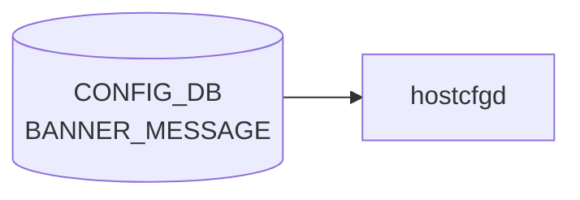

# BANNER_MESSAGE テーブル

## 概要

SSH / コンソールログイン時の login バナー、MOTD、logout バナーを設定するテーブル[^1]。
`hostcfgd` が [CONFIG_DB](../../reference/glossary.md#term-config_db) を購読し、`/etc/issue` / `/etc/motd` / `/etc/issue.net` を書き換える。

<!-- cdb-mermaid -->
### データフロー (自動生成)



!!! note "凡例"
    CONFIG_DB から SAI までの典型経路を `docs/reference/config-db-orch-map.md` から機械生成したミニ図。詳細・例外は本ページ本文と対応表を参照。
<!-- /cdb-mermaid -->

## key 構造

```text
BANNER_MESSAGE|global
```

シングルトン (`global` の 1 行のみ)。

<!-- pubsub -->
## 通信メカニズム (Redis PUBSUB / keyspace notification)

> **Evidence**: `sonic-host-services/scripts/hostcfgd` の `BannerCfg` クラス全体 (2044-2117) + `register_callbacks()` (2480-2521) 精読、`sonic-buildimage/files/image_config/bannerconfig/banner-config.sh` 精読 (2026-05-15)  

### 購読方式

`hostcfgd` は `swsscommon.ConfigDBConnector` の `subscribe(table, callback)` でハンドラを登録する方式を採用する。`swsscommon.SubscriberStateTable` / `ConsumerStateTable` / `NotificationConsumer` を**直接は使わず**、`ConfigDBConnector.listen()` が内部で [Redis](../../reference/glossary.md#term-redis) keyspace 通知 (`__keyspace@4__:BANNER_MESSAGE|*` の PSUBSCRIBE) を購読してテーブル名一致のコールバックへディスパッチする。`BANNER_MESSAGE` テーブルの購読者は `hostcfgd.BannerCfg` ただ 1 つ。[APPL_DB](../../reference/glossary.md#term-appl_db) 中継・[SAI](../../reference/glossary.md#term-sai) 経由・NotificationProducer 経由は一切ない。

### 購読登録 (register_callbacks)

```python
# sonic-host-services/scripts/hostcfgd:2519-2521
# Handle BANNER_MESSAGE changes
self.config_db.subscribe(swsscommon.CFG_BANNER_MESSAGE_TABLE_NAME,
                         make_callback(self.banner_handler))
```

`swsscommon.CFG_BANNER_MESSAGE_TABLE_NAME` は C++ 側で定義された `"BANNER_MESSAGE"` 定数。channel ベースの `PUBLISH/SUBSCRIBE` は使わず、[CONFIG_DB](../../reference/glossary.md#term-config_db) の `HSET` を契機とする [Redis](../../reference/glossary.md#term-redis) keyspace notification (`notify-keyspace-events`) で通知される。TTL は設定されない (永続前提)。

### ハンドラ動作

| 入口 | 動作 | 副作用 |
|------|------|--------|
| `banner_handler(key, op, data)` ([hostcfgd](../../reference/glossary.md#term-hostcfgd):2442) | `op` は無視、`(key, data)` を `BannerCfg.banner_message()` に転送 | LOG_INFO `'BANNER_MESSAGE table handler...'` |
| `BannerCfg.banner_message(key, data)` ([hostcfgd](../../reference/glossary.md#term-hostcfgd):2084) | `data` 内 1 フィールドでもキャッシュと差分あれば `systemctl restart banner-config` 発行 → 成功時のみキャッシュ更新 | `banner-config.service` (oneshot) を ExecStart |
| `banner-config.service` 起動 | `/usr/bin/banner-config.sh` 実行 | `/etc/issue.net` → `/etc/issue` → `/etc/motd` → `/etc/logout_message` を順次 `echo -e ... >` 上書き |

差分判定は早期 break (`for k,v in data.items(): if v != self.cache.get(k): update_required=True; break`) で、complete equality ではなく 1 つでも違えば restart 発行。`run_cmd` 失敗時はキャッシュ未更新のため、次回 [CONFIG_DB](../../reference/glossary.md#term-config_db) 変化 (同値でも) で自動再試行される。

### 通信シーケンス

```
config banner motd "..." (CLI)
  └─ sonic-db-cli CONFIG_DB HSET 'BANNER_MESSAGE|global' motd "..."
       └─ Redis keyspace notification: __keyspace@4__:BANNER_MESSAGE|global hset
            └─ hostcfgd ConfigDBConnector.listen() ループが受信
                 └─ make_callback wrapper: (table, key, data) → (key, op="SET", data)
                      └─ banner_handler("global", "SET", HGETALL BANNER_MESSAGE|global)
                           └─ BannerCfg.banner_message("global", data)
                                ├─ type(data) != dict → silent return
                                ├─ キャッシュ差分なし → no-op (restart skip)
                                └─ 差分あり → systemctl restart banner-config
                                     └─ banner-config.service (Type=oneshot, RemainAfterExit=no)
                                          └─ /usr/bin/banner-config.sh
                                               ├─ sonic-db-cli HGET state/login/motd/logout (再読込)
                                               ├─ [[ $STATE == "enabled" ]] ガード
                                               └─ echo -e "$LOGIN"  > /etc/issue.net
                                                  echo -e "$LOGIN"  > /etc/issue
                                                  echo -e "$MOTD"   > /etc/motd
                                                  echo -e "$LOGOUT" > /etc/logout_message
```

### keyspace notification 詳細

| 項目 | 値 |
|------|-----|
| 購読 API | `ConfigDBConnector.subscribe('BANNER_MESSAGE', callback)` ([hostcfgd](../../reference/glossary.md#term-hostcfgd):2519-2521) |
| 通知方式 | [Redis](../../reference/glossary.md#term-redis) keyspace notification (内部で PSUBSCRIBE `__keyspace@4__:BANNER_MESSAGE\|*`) |
| 通知種別 | `hset` / `del` (HMSET も hset 通知) — op 種別は区別せず `data is None` で `SET` / `DEL` を識別 |
| dbId | 4 (CONFIG_DB) |
| Select timeout | `ConfigDBConnector.listen()` 内部 (明示タイムアウトなし、Redis subscribe ブロッキング) |
| 起動時スナップショット | `BannerCfg.load()` で state/login/motd/logout 4 フィールドを順次 `banner_message()` に渡す (hostcfgd:2079-2082) — 最大 4 回 `systemctl restart banner-config` が連続発行され得る |
| 実行時変更反映 | 差分判定 → 1 フィールドでも差分があれば 1 回 restart。CLI で 4 フィールドを個別変更すると最大 4 回 restart |
| [ConsumerStateTable](../../reference/glossary.md#term-consumerstatetable) / NotificationProducer | 未使用 (`BANNER_MESSAGE` テーブルに対する他購読者・通知 producer なし) |
| TTL | なし (CONFIG_DB は永続前提) |

### 反映タイミング

CONFIG_DB 書込み → keyspace 通知到達 → `banner_handler` 呼び出し → `systemctl restart banner-config` → `banner-config.sh` が CONFIG_DB を `sonic-db-cli HGET` で再読込 → 4 ファイル順次上書き、までを `O(秒)` で完了。新規 SSH / console 接続から新 banner が表示される。既存セッションへの影響なし (sshd / PAM の再起動・reload は不要)。`banner-config.sh` の 4 ファイル書込みは `set -e` のため途中失敗時は以降スキップで部分書込状態が残存する。

<!-- /pubsub -->

## フィールド

| フィールド | 型 | 既定 | 説明 |
|-----------|----|------|------|
| `state`  | `admin_mode` (enabled/disabled) | `disabled` | バナー機能の有効化フラグ |
| `login`  | string | `Debian GNU/Linux 11` | ログインプロンプト前に表示 |
| `motd`   | string | [SONiC](../../reference/glossary.md#term-sonic) アスキーアート + 警告文 | ログイン直後に表示 |
| `logout` | string | `""` | ログアウト時に表示 |

<!-- defaults -->
## フィールド暗黙デフォルト

YANG `default` 文はプロビジョニング時 ([sonic-cfggen](../../reference/glossary.md#term-sonic-cfggen) が `init_cfg.json.j2` を展開して DB に書く段階) に適用される。
以下は **DB エントリ自体がない場合** のランタイム fallback を per-field で示す。

| フィールド | YANG default | init_cfg.json.j2 | コード fallback (DB なし) |
|-----------|-------------|-----------------|--------------------------|
| `state`   | `disabled`  | `"disabled"`    | `hostcfgd` `.get("state", {})` → `{}` → `banner-config.sh` で `STATE=` (空文字列) → バナー無効と同等 |
| `login`   | `"Debian GNU/Linux 11"` | `"Debian GNU/Linux 11"` | `.get("login", {})` → `{}` → `state=disabled` 時 no-op、`state=enabled` 時 `LOGIN=` (空文字列) → `/etc/issue` / `/etc/issue.net` 空白化 |
| `motd`    | [SONiC](../../reference/glossary.md#term-sonic) ASCII アート + 警告文 (多行) | 同一内容 | `.get("motd", {})` → `{}` → `state=enabled` 時 `MOTD=` → `/etc/motd` 空白化 |
| `logout`  | `""` (空文字列) | `""` | `.get("logout", {})` → `{}` → `state=enabled` 時 `LOGOUT=` → `/etc/logout_message` 空白化 |

**コード根拠**:
- `hostcfgd` `BannerCfg.load()`: `sonic-host-services/scripts/hostcfgd:2069-2077`
- `banner-config.sh` shell fallback: `sonic-buildimage/files/image_config/bannerconfig/banner-config.sh:4-6`
- `init_cfg.json.j2` 初期値: `sonic-buildimage/files/build_templates/init_cfg.json.j2:180-186`
- YANG default: `sonic-buildimage/src/sonic-yang-models/yang-models/sonic-banner.yang:22-48`

<!-- /defaults -->

<!-- failure -->
## 失敗挙動マトリクス

ソース: `sonic-net/sonic-host-services/scripts/hostcfgd` (`BannerCfg`) + `sonic-net/sonic-buildimage/files/image_config/bannerconfig/banner-config.sh`

`BANNER_MESSAGE` は [SAI](../../reference/glossary.md#term-sai) 非経由のシングルトンテーブルで、書込側は **hostcfgd `BannerCfg`** (CONFIG_DB → `systemctl restart banner-config`) と **`banner-config.sh`** (`sonic-db-cli` で値取得 → `echo -e ... > /etc/issue` 等 4 ファイルを上書き) の 2 段構成。失敗経路は両層で評価する。

### hostcfgd 側 (`BannerCfg.handler()` / `BannerCfg.load()`)

| 失敗条件 | 検出箇所 | 結果 | ログ出力 | evidence |
|---|---|---|---|---|
| `handler()` に渡された `data` が `dict` 型以外 | `BannerCfg.handler()` | silent return・キャッシュ更新も restart も発行されない | なし | `hostcfgd:2084` |
| `data` 4 フィールド (`state`/`login`/`motd`/`logout`) がキャッシュと完全一致 | 差分判定 | `systemctl restart banner-config` をスキップ (重複再起動抑制) | なし | `hostcfgd:2074` |
| `data` に上記 4 つ以外のフィールド | `BannerCfg.load()` の `.get()` 固定 4 キー | silent ignore (読まれず、shell にも届かない) | なし | `hostcfgd:2074-2077` |
| `run_cmd(["systemctl", "restart", "banner-config"])` 非 0 終了 / `CalledProcessError` | `handler()` 内 `run_cmd` | LOG_ERR のみ・キャッシュ未更新 (次回変化時に再試行) | LOG_ERR `'BannerCfg: Failed to restart banner-config service'` | `hostcfgd:2111-2114` |
| CONFIG_DB が空 / `BANNER_MESSAGE\|global` エントリ未生成 | `BannerCfg.load()` 起動時 | 全 4 キーを空 dict として処理・差分なければ no-op | LOG_INFO `'BannerCfg: load initial'` | `hostcfgd:2067, 2074-2077` |
| `global` 以外のキー (`BANNER_MESSAGE\|foo` 等) | table handler dispatch | dispatch 対象キーは `global` 固定。他キーは silent ignore | なし | `hostcfgd:2259, 2443` |

### banner-config.sh 側 (subprocess + ファイル書込)

`banner-config.sh` は `#!/bin/bash -e` で起動するため、**いずれかのコマンドが非 0 終了した時点で即時 exit** する。

| 失敗条件 | 検出箇所 | 結果 | ログ出力 | evidence |
|---|---|---|---|---|
| `sonic-db-cli CONFIG_DB HGET 'BANNER_MESSAGE\|global' state` 非 0 (Redis 未起動 / `database.service` 停止) | `banner-config.sh:3` | `set -e` で即時 exit。`LOGIN` / `MOTD` / `LOGOUT` 取得も書込も全てスキップ | systemd journal の non-zero exit | `banner-config.sh:1, 3` |
| `state="enabled"` で `echo -e "$LOGIN" > /etc/issue` が `Permission denied` / `Read-only filesystem` | `banner-config.sh:13` | `set -e` で即時 exit — 後続 `/etc/issue.net` / `/etc/motd` / `/etc/logout_message` への書込は**実行されない** (部分書込状態残存) | systemd journal のみ | `banner-config.sh:1, 13` |
| 上記同様 `/etc/issue.net` 書込失敗 | `banner-config.sh:12` | 同上 — 後続 3 ファイル書込スキップ | systemd journal のみ | `banner-config.sh:1, 12` |
| `state` が空文字列 (CONFIG_DB 未設定 / `disabled`) | `banner-config.sh:7` `[[ $STATE == "enabled" ]]` | False → 4 ファイル書換なし (silent no-op で正常終了) | なし | `banner-config.sh:7, 13-16` |
| CONFIG_DB の `motd` 値で `\n` を二重エスケープ (Redis 上に `\\n` リテラル保存) | `banner-config.sh:14` `echo -e` 展開 | `echo -e` が LF に展開しないため、ファイルにリテラル `\n` 文字列が書かれる (silent 誤動作) | なし | `banner-config.sh:12-15` + ops-hint「よくある誤設定」 |
| `state="enabled"` → `state="disabled"` 切替 | `banner-config.sh:7` | 早期 return で **何も書かない** → 前回 enabled 時の `/etc/issue` 等が**残存** (Debian デフォルトには復元されない) | なし | `banner-config.sh:7-16` |

### systemd / 連動レイヤ

| 失敗条件 | 検出箇所 | 結果 | evidence |
|---|---|---|---|
| `database.service` 停止で `BindsTo` 連鎖停止 | systemd | `banner-config.service` が inactive → `hostcfgd` の `systemctl restart` も一時的に失敗する可能性 | `banner-config.service:5-6` |
| 前提 `config-setup.service` 未完了 / 失敗 | systemd | `Requires=` / `After=` で `banner-config` 起動が遅延 or 失敗 | `banner-config.service:3-4` |
| `sshd_config` の `Banner /etc/issue.net` ディレクティブ無効化 | sshd 起動時 | `/etc/issue.net` が更新されても SSH banner が表示されない (banner-config 側はエラーなし) | constants 表「暗黙の前提」 |
| `pam_motd.so` 無効化 / `~/.bash_logout` から `/etc/logout_message` 不参照 | PAM / shell | `/etc/motd` / `/etc/logout_message` 更新が表示に反映されない | constants 表「LOGOUT_BANNER_PATH」注記 |

### 補足

- **部分書込**: `banner-config.sh` の `set -e` により 4 ファイルのうち最初の失敗位置以降は書かれない。冪等性は次回 `systemctl restart` で 4 ファイル全再書込により担保される。
- **自動 retry**: `hostcfgd` は `run_cmd` 失敗時にキャッシュを更新しないため、次回 CONFIG_DB 変化 (同じ値でも) で再 restart が走る。
- **silent 誤動作**: `dict` 型外データ、`global` 以外のキー、`\n` 二重エスケープ、`state=disabled` 時のファイル残存はいずれもログを出さない。
- **明示的 try/except なし**: `BannerCfg` クラスは明示的な `try/except` を持たず、例外ハンドリングは `run_cmd` 内部に委ねる。`raise` も無い。

<!-- /failure -->

<!-- constants -->
## ハードコード定数

`BANNER_MESSAGE` テーブルおよびその購読者 (`hostcfgd` `BannerCfg` クラス + `banner-config.sh`) に存在する、CONFIG_DB / YANG で管理されないハードコード定数の一覧。出典は `sonic-host-services/scripts/hostcfgd` と `sonic-buildimage/files/image_config/bannerconfig/`。

### banner 出力先ファイルパス (banner-config.sh)

`banner-config.sh` は `state=enabled` の場合に CONFIG_DB から `login` / `motd` / `logout` を取得し、以下 4 つの絶対パスへ書き込む。これらは shell スクリプト内にリテラル直書きで、CONFIG_DB / YANG / 環境変数で変更不可。

| 定数 | 値 | 用途 | ソース |
|------|----|------|--------|
| LOGIN_BANNER_PATH | `/etc/issue` | コンソール (getty) ログインプロンプト前に表示される Linux 標準 issue ファイル | banner-config.sh:13 |
| LOGIN_NET_BANNER_PATH | `/etc/issue.net` | sshd `Banner /etc/issue.net` ディレクティブ経由で SSH ログイン前に表示される | banner-config.sh:12 |
| MOTD_PATH | `/etc/motd` | PAM `pam_motd.so` がログイン成功直後に cat する標準 MOTD ファイル | banner-config.sh:14 |
| LOGOUT_BANNER_PATH | `/etc/logout_message` | [SONiC](../../reference/glossary.md#term-sonic) 独自パス。`~/.bash_logout` 等から参照する想定 (Debian 標準ではない) | banner-config.sh:15 |

> **注意**: `/etc/logout_message` は Debian / Linux 標準にないファイル名で、SONiC が独自に導入したもの。実際に logout 時に cat されるかは shell プロファイル設定 (`/etc/skel/.bash_logout` 等) に依存する。

### 書き込みコマンドと改行コード処理

| 定数/構文 | 値 | 用途 | ソース |
|----------|----|------|--------|
| `echo -e` フラグ | `-e` (バックスラッシュエスケープ解釈) | CONFIG_DB に格納された `\n` を実改行 (LF 0x0A) に展開して書き込む | banner-config.sh:12-15 |
| リダイレクト | `>` (truncate + write) | 上書きモード。毎回ファイル全文を置換 | banner-config.sh:12-15 |
| シェバン | `#!/bin/bash -e` | bash 必須 (`[[ ]]` 使用)。`-e` で任意のコマンド失敗時即終了 | banner-config.sh:1 |

> **注意**: `echo -e` は bash builtin に依存。Redis 上には `\` + `n` の 2 文字として保存され、`echo -e` 展開時に初めて LF になる。CRLF を CLI から渡すのは難しいため運用上は LF (`\n`) のみが推奨される。

### CONFIG_DB アクセス・有効化判定

| 定数/構文 | 値 | 用途 | ソース |
|----------|----|------|--------|
| DB クライアント | `sonic-db-cli CONFIG_DB HGET` | Redis HGET でフィールド単位取得 | banner-config.sh:3,9-11 |
| テーブルキー | `'BANNER_MESSAGE\|global'` | シングルトン固定キー | banner-config.sh:3,9-11 |
| 有効化判定値 | `"enabled"` | `[[ $STATE == "enabled" ]]` の右辺リテラル | banner-config.sh:7 |

### systemd unit (banner-config.service) 内固定値

| 定数 | 値 | 用途 | ソース |
|------|----|------|--------|
| ExecStart | `/usr/bin/banner-config.sh` | スクリプトのインストール先絶対パス | banner-config.service:11 |
| Type | `oneshot` | 起動して終了するワンショット (デーモン化しない) | banner-config.service:9 |
| RemainAfterExit | `no` | 終了後 inactive に戻る | banner-config.service:10 |
| BindsTo | `database.service`, `sonic.target` | database 停止時に自動停止 | banner-config.service:5-6 |
| Requires/After | `config-setup.service` | [config-setup](../../reference/glossary.md#term-config-setup) 完了後に起動 | banner-config.service:3-4 |

### hostcfgd 内ハードコード文字列

| 定数 | 値 | 用途 | ソース |
|------|----|------|--------|
| 再起動対象 service 名 | `"banner-config"` | `run_cmd(["systemctl", "restart", "banner-config"], ...)` の対象 unit 名 | hostcfgd L2111 |
| 読み取りフィールド名 | `"state"` / `"login"` / `"motd"` / `"logout"` | `BannerCfg.load()` で `.get()` に渡す固定 4 キー。これ以外の CONFIG_DB フィールドは無視 | hostcfgd L2074-2077 |
| syslog タグ | `'BannerCfg: load initial'` / `'BannerCfg: Failed to restart banner-config service'` / `'BANNER_MESSAGE table handler...'` | デバッグ識別文字列 | hostcfgd L2067, L2113-2114, L2443 |
| CFG テーブル名定数参照 | `swsscommon.CFG_BANNER_MESSAGE_TABLE_NAME` | swsscommon の C++ 定義 (`"BANNER_MESSAGE"`) を import | hostcfgd L2259 |

### デフォルト文字列定数 (YANG / init_cfg.json.j2)

| フィールド | YANG default | init_cfg.json.j2 値 | 改行表現 |
|-----------|-------------|---------------------|---------|
| `state` | `disabled` | `"disabled"` | N/A (enum) |
| `login` | `"Debian GNU/Linux 11"` | `"Debian GNU/Linux 11"` | 改行なし (1 行) |
| `motd` | SONiC ASCII アート + 警告文 (複数行リテラル) | 同一内容 (`\n` エスケープで 1 行 JSON 化) | `\n` 区切り、末尾 `\n\n` |
| `logout` | `""` | `""` | 改行なし (空) |

> **注意**: motd の表示文字 (ASCII アート骨格 + 警告文) は YANG default と init_cfg.json.j2 で等価だが、インデント空白と改行表現が異なる。実 DB には init_cfg.json.j2 の `\n` 形式が書き込まれる。

### 暗黙の前提

- `/etc/issue` / `/etc/issue.net` / `/etc/motd` / `/etc/logout_message` の所有者・パーミッションは Debian デフォルト (`root:root 0644`)。`banner-config.sh` は明示的に `chmod` / `chown` しないため、Debian インストール時の値を継承する
- `state=enabled` で上書きしたファイルは `state=disabled` に戻しても復元されない (CONFIG_DB のみ無効化される)
- `sshd_config` の `Banner /etc/issue.net` ディレクティブが前提。SONiC イメージビルド時に有効化されている

<!-- /constants -->

## 購読者

- `hostcfgd` (`host-services` パッケージ)。ConfigDBConnector で `BANNER_MESSAGE/global` を listen し、`/etc/issue`, `/etc/motd`, `/etc/issue.net` をテンプレ展開して書き換える

## 関連 CONFIG_DB / YANG / CLI

- 関連 CLI: `config banner state` / `config banner login` / `config banner motd` / `config banner logout`
- 関連 [YANG](../../reference/glossary.md#term-yang): `sonic-banner`

<!-- cdb-exceptions -->
## 例外条件・特殊挙動

| 条件 | 挙動 |
|------|------|
| `data` が dict 型以外 | silent return（ログなし） |
| キャッシュと同一の値 | `banner-config` 再起動をスキップ |
| `systemctl restart banner-config` 失敗 | syslog ERR のみ、キャッシュ更新なし（次回変更時に再試行） |
| CONFIG_DB が空 / エントリなし | 全 key を空 dict として処理、再起動不要なら no-op |
| `state`/`login`/`motd`/`logout` 以外のフィールド | `load()` では読まれない（`get()` に固定 key しか渡さない） |

<!-- evidence: sonic-net/sonic-host-services/scripts/hostcfgd:2084L -->
<!-- /cdb-exceptions -->

<!-- cross-refs -->
## 暗黙参照 — `BannerCfg` が間接的に駆動する依存

`BANNER_MESSAGE` はシングルトンテーブルで、CONFIG_DB レベルでは**他テーブルへの暗黙参照を持たない** (`AAA` のような共依存テーブル群は存在しない)。一方で、`hostcfgd` の `BannerCfg` ハンドラは `systemctl restart banner-config` 経由で `/usr/bin/banner-config.sh` を再実行させ、結果として **OS 側のテキストファイル経由** で sshd / getty / PAM / shell logout と暗黙連携する。本ブロックではこれら「配送経路ベースの依存」と systemd unit 依存をまとめる。

### CONFIG_DB レベル

`BannerCfg` (`hostcfgd:2044-2114`) の subscribe 対象は `BANNER_MESSAGE` のみ (hostcfgd:2443)。他 CONFIG_DB テーブルの `get_keys` / `get_table` も呼ばない。

ただし `banner-config.sh` が `systemctl restart banner-config` で呼ばれる際、shell 側が改めて `sonic-db-cli CONFIG_DB HGET 'BANNER_MESSAGE|global' ...` を 4 回実行する**二重読み出し**経路が存在する。`hostcfgd` が dict を渡すのではなく、shell 再実行時点での Redis 上の最新値を取り直す。

| テーブル | 参照タイミング | 用途 | evidence |
|---|---|---|---|
| `BANNER_MESSAGE` (`global` の `state`/`login`/`motd`/`logout`) | `banner_handler` subscribe + `banner-config.sh` の HGET 再取得 | `hostcfgd` が dict 受領 → cache 比較 → 変化時に `systemctl restart banner-config` → shell 側が Redis 上の最新値を 4 HGET で改めて読む | hostcfgd:2074-2077,2111,2443 / banner-config.sh:3,9-11 |

> 純粋な暗黙参照 CONFIG_DB テーブルは **なし**。シングルトン自己完結。

### OS 側 (テキストファイル経由) の暗黙連携

`banner-config.sh` が生成する 4 ファイルは、別プロセスがそれぞれ独立に読み出す。`BANNER_MESSAGE` から見ると **配送経路ベースの暗黙依存** にあたる。

| 配送先ファイル | 読み出し側 | 前提 | evidence |
|---|---|---|---|
| `/etc/issue.net` | `sshd` (OpenSSH) | `sshd_config` に `Banner /etc/issue.net` ディレクティブが有効化されている (SONiC イメージビルド時の前提) | banner-config.sh:13 |
| `/etc/issue` | `getty` (`agetty`) — コンソールログインプロンプト | Debian `agetty` 標準動作 (`--issue-file` デフォルト `/etc/issue`) | banner-config.sh:14 |
| `/etc/motd` | `pam_motd.so` (`/etc/pam.d/sshd` / `/etc/pam.d/login` の `session optional pam_motd.so`) | PAM stack に `pam_motd` が含まれていること (Debian デフォルト) | banner-config.sh:15 |
| `/etc/logout_message` | 各ユーザ shell の `~/.bash_logout` / `/etc/skel/.bash_logout` 等 | SONiC 独自パス。Debian 標準にないため、profile 側で明示的に cat する設定が必要 | banner-config.sh:16 |

> いずれも `echo -e "$VAR" > path` による **truncate 上書き**。`state=disabled` に戻しても元の Debian 標準内容は復元されない 。

### systemd unit 依存

`BannerCfg` の `systemctl restart banner-config` (hostcfgd:2111) を起点に、`banner-config.service` の以下 unit 依存が間接的に効く。

| 依存対象 unit | 関係 | 効果 | evidence |
|---|---|---|---|
| `banner-config.service` | hostcfgd → `restart` | shell スクリプト再実行のための oneshot unit | banner-config.service:11 / hostcfgd:2111 |
| `database.service` | `BindsTo` | Redis 停止時に banner-config も停止 (`sonic-db-cli` 失敗を回避) | banner-config.service:5 |
| `config-setup.service` | `Requires` + `After` | 初期 CONFIG_DB ロード後に banner-config が走る (cold boot race 回避) | banner-config.service:3-4 |
| `sonic.target` | `BindsTo` + `WantedBy` | SONiC スタック停止時に同時停止、起動時に有効化 | banner-config.service:6,14 |

> cold boot 時の初回 banner 反映は `hostcfgd` の `BannerCfg.load()` (hostcfgd:2057-2082) では `restart` を呼ばず、systemd 側で `banner-config.service` が `WantedBy=sonic.target` により独立に oneshot 起動する経路に依存する。

### 範囲外 (誤解されやすい隣接テーブル)

- **`SSH_SERVER`**: `hostcfgd` `SshCfg` が購読するが、`Banner` ディレクティブの値 (`/etc/issue.net` パス) はビルド時固定で CONFIG_DB に流れない。`BannerCfg` と CONFIG_DB レベルの読み合いはない。両者は「`sshd_config` の `Banner` 有効化」というビルド時前提だけで間接的に繋がる
- **`AAA` / `TACPLUS` / `RADIUS` / `LDAP`**: PAM stack を共有するが、`pam_motd` 制御は別 PAM 設定で `BannerCfg` から触らない
- **`DEVICE_METADATA.localhost.hostname`**: banner 文字列はリテラル展開 (`echo -e`) のみで、hostname を埋め込む処理は `banner-config.sh` に存在しない (getty/login 側の `\h` escape は使えない)
- **`FIPS`**: sshd の暗号方針には影響するが banner には無関係

<!-- /cross-refs -->

<!-- value-behavior -->
## 値依存挙動マトリクス

### `state` (enum `enabled`/`disabled`)

| 値 | 効果 | evidence |
|---|---|---|
| `enabled` | `banner-config.sh` が `login` / `motd` / `logout` を読み取り `/etc/issue.net`, `/etc/issue`, `/etc/motd`, `/etc/logout_message` を書き換える | `sonic-buildimage/files/image_config/bannerconfig/banner-config.sh:8` |
| `disabled` | `banner-config.sh` がファイルを一切書き換えない | `banner-config.sh:8` |

### フリーフォームフィールド

- `login` / `motd` / `logout` — freeform string。`state=enabled` の場合のみ評価される

### 複合条件

- `state=enabled` のときのみ `login`/`motd`/`logout` フィールドが評価される。`state=disabled` では他フィールドの値に関わらずファイル更新なし
- `hostcfgd` はキャッシュと値が変化した場合のみ `systemctl restart banner-config` を発行 (重複再起動抑制) (`hostcfgd:2074`)
<!-- /value-behavior -->

<!-- ordering -->
## 書込み順序依存

### 依存関係マップ

```
config-setup.service (起動)
  └─► database.service (Redis CONFIG_DB)
        └─► banner-config.service (Requires + BindsTo)

hostcfgd.load()  ─── 順次呼び出し ───
  ├─► PASSW_HARDENING  → PAM common-password 書換え
  ├─► SSH_SERVER       → sshd_config 書換え + sshd reload
  ├─► (… 他テーブル …)
  └─► BANNER_MESSAGE   → BannerCfg.load() → state/login/motd/logout 順
        └─► systemctl restart banner-config (変化時のみ)
              └─► banner-config.sh
                    └─► /etc/issue.net → /etc/issue → /etc/motd → /etc/logout_message
                          └─► sshd は接続毎に /etc/issue.net を再読込 (restart 不要)
                          └─► pam_motd.so がログイン時に /etc/motd を再読込 (PAM reload 不要)
```

### 書込み順序ルール

| 優先度 | ルール | 根拠 |
|--------|--------|------|
| 必須 | `config-setup.service` / `database.service` が起動済み (systemd 自動制御) | `banner-config.service`: `Requires=config-setup.service` / `BindsTo=database.service` |
| 必須 | `state` フィールドを `login`/`motd`/`logout` と**同一バッチで**書く、または `state` を先に書く | `banner-config.sh:8` の `state == "enabled"` ガード。中間状態 `state=disabled` のままで他フィールドだけ書いてもファイルは更新されない |
| 推奨 | `SSH_SERVER` を `BANNER_MESSAGE` より先に確定 | hostcfgd:2265 (`sshscfg.load`) → 2274 (`bannermsgcfg.load`) の load 順 |
| 注意 | 4 フィールド同時更新は最大 4 回 `systemctl restart banner-config` を引き起こす | `BannerCfg.load()` は state/login/motd/logout を 1 行ずつ `banner_message()` に渡し、変化があるたびに restart (hostcfgd:2079-2082 + 2111) |
| 不要 | sshd の再起動・reload | sshd は新規接続ごとに `/etc/issue.net` を読み直す。`BannerCfg` も sshd / PAM に一切タッチしない (hostcfgd:2044-2119) |
| 不要 | PAM 設定ファイルの事前書換え | `pam_motd.so` は Debian イメージビルド時に既定で組み込み済み。Banner と [AAA](../../reference/glossary.md#term-aaa)/PASSW_HARDENING の PAM 経路は独立 |

### タイミング制約

- **boot 時**: `banner-config.service` (`WantedBy=sonic.target`) は sonic.target ramp-up 中に oneshot で 1 度実行される。最初の SSH 接続が `banner-config.service` 完了より先に到達した場合は Debian デフォルト banner が出るのみで機能影響はない (`hostcfgd:2060-2061` のコメント参照)。
- **runtime 変更**: CONFIG_DB 変更検知から `banner-config.sh` 完了まで O(秒)。`/etc/issue.net` → `/etc/issue` → `/etc/motd` → `/etc/logout_message` の個別書込み間に race window があり、新 banner + 旧 motd が短時間混在し得る (banner-config.sh:13-16)。
- **冪等性**: `banner-config.sh` は同じファイルを上書きするだけなので、複数回 restart されても最終状態は CONFIG_DB の値と一致。

### sshd / PAM の再起動が**不要**である根拠

- `BannerCfg` (hostcfgd:2044-2119) 全体に `ssh` / `sshd` / `pam` / `reload` の参照なし。restart 対象は `banner-config` 単一 unit のみ (hostcfgd:2111)。
- sshd は `Banner /etc/issue.net` ディレクティブに従い接続ごとにファイルを再読込する Debian 標準挙動。
- `/etc/motd` は `pam_motd.so` がログインセッション開始時に都度読む。PAM スタックの再ロードは発生しない。

<!-- /ordering -->

<!-- ref-triangle:start -->

## 関連リファレンス

- [YANG](../../reference/glossary.md#term-yang): [`sonic-banner`](../yang/sonic-banner.md)

<!-- ref-triangle:end -->

## 引用元

[^1]: [YANG](../../reference/glossary.md#term-yang) 定義: `sonic-banner.yang`. <https://github.com/sonic-net/sonic-buildimage/blob/9ea932ec2e18f35e58268ec2e4456b1d4afd65cd/src/sonic-yang-models/yang-models/sonic-banner.yang>

## 関連ページ
- [CONFIG_DB index](index.md)

<!-- ops-hint -->
## 運用ヒント

### 典型値

- key 形式: `BANNER_MESSAGE|global`。
- `state`: `enabled`、`login` / `motd` / `logout` に短い文字列を設定。

### よくある誤設定

- 改行を含めるときに JSON エスケープを忘れて適用が失敗する。

### 確認コマンド

```bash
sonic-db-cli CONFIG_DB hgetall 'BANNER_MESSAGE|global'
show banner
```
<!-- /ops-hint -->

<!-- runtime-trace -->
## 実コンテナ動作トレース

### 段階 1 — Consumer 登録

`hostcfgd` の `BannerMessageHandler` が CONFIG_DB の `BANNER_MESSAGE` テーブルを購読する。

`BANNER_MESSAGE` テーブルはシングルトン（key `global`）で、フィールド `state` / `login` / `motd` / `logout` を持つ。

### 段階 2 — CFG→APPL 翻訳

なし ([APPL_DB](../../reference/glossary.md#term-appl_db) 中継なし)

### 段階 3 — APPL→SAI

なし ([SAI](../../reference/glossary.md#term-sai) 非経由 — `/etc/issue` / `/etc/issue.net` / sshd banner ファイルを書き換え)

### 段階 4 — タイミングと副作用

**適用タイミング**: CONFIG_DB 変化を検知次第即時にファイル書き換え。次回 SSH / console ログイン時から新 banner が表示される。

**副作用**: 既存セッションへの影響なし。`sshd` の再起動は不要（banner は接続時に読む）。
<!-- /runtime-trace -->

<!-- entry-points -->
## 書き込み入り口

対象テーブル: `BANNER_MESSAGE`

### CLI
- `config banner motd <message>`
- `config banner login <message>`
- `config banner logout <message>`
  - ソース: `sonic-utilities/config/main.py (banner グループ)`

### minigraph / sonic-cfggen
- なし

### REST / gNMI (sonic-mgmt-common)
- なし (対応 OpenConfig/SONiC YANG transformer なし)

### db_migrator
- なし

### ビルド時デフォルト (init_cfg / j2 テンプレート)
- `init_cfg.json.j2` に `BANNER_MESSAGE` セクションはないが、空エントリがデフォルト

### ハードコードデフォルト
- なし

### ランタイム注入 (デーモン自動書き込み)
- なし
<!-- /entry-points -->

<!-- platform -->
## プラットフォーム差

**結論: プラットフォーム差なし**（multi-asic / chassis / ベンダー固有 banner すべて該当なし）。

`BANNER_MESSAGE` はホスト名前空間限定のシングルトンテーブルで、購読者である `hostcfgd` `BannerCfg` と `banner-config.sh` はいずれも Linux ホスト上のテキストファイル (`/etc/issue` / `/etc/issue.net` / `/etc/motd` / `/etc/logout_message`) を書き換えるだけで、SAI / [ASIC](../../reference/glossary.md#term-asic) / chassis ハードウェアには一切タッチしない。

### 根拠（コード単位）

| 観点 | 差の有無 | 根拠 |
|------|---------|------|
| multi-asic (namespace 分岐) | なし | `hostcfgd` `BannerCfg` クラス (`sonic-host-services/scripts/hostcfgd:2044-2114`) 全体に `namespace` / `asic_id` / `multi_asic` の参照・分岐なし。グローバル CONFIG_DB のみ参照 |
| chassis (VoQ / packet-chassis) | なし | `banner-config.sh` は `sonic-db-cli CONFIG_DB HGET 'BANNER_MESSAGE|global' ...` を 4 回呼ぶだけ。`linecard` / `supervisor` / `database-chassis` 分岐なし (`sonic-buildimage/files/image_config/bannerconfig/banner-config.sh:1-18`) |
| [ASIC](../../reference/glossary.md#term-asic) ベンダー固有 (Broadcom/Mellanox/Marvell/…) | なし | SAI 非経由。Linux ファイル書き換えのみ。`platform/*/` 配下に `banner` 関連オーバーライドファイルなし |
| ビルド時 platform 条件 | なし | `sonic_debian_extension.j2:652-654` で全プラットフォーム共通 (platform 別 `if` の外) に `banner-config.service` / `banner-config.sh` をコピー |
| systemd template (`@.service`) | なし | `banner-config.service` は単一 unit。`[Install] WantedBy=sonic.target` 固定 (`sonic-buildimage/files/image_config/bannerconfig/banner-config.service:1-14`) |
| [HLD](../../reference/glossary.md#term-hld) 上の platform 言及 | なし | `SONiC/doc/banner/banner_hld.md` 全文に `asic` / `chassis` / `namespace` / `vendor` の言及なし |

### 補足

- multi-asic chassis (例: VoQ chassis supervisor + linecard 構成) においても `banner-config.service` はホスト側に 1 インスタンスのみ存在し、すべての SSH / console セッションで同じバナーが表示される。
<!-- /platform -->

<!-- side-effects -->
## 副次 DB 書込

**結論: 副次 Redis DB ([APPL_DB](../../reference/glossary.md#term-appl_db) / [STATE_DB](../../reference/glossary.md#term-state_db) / [COUNTERS_DB](../../reference/glossary.md#term-counters_db) / その他) への書込は一切なし**。

`BANNER_MESSAGE` テーブルの変更時に発生する副作用は、Redis 上の他 DB ではなく **Linux ホスト OS のテキストファイル 4 つ** および **systemd unit 1 つの再起動** に閉じる。状態可視化用の [STATE_DB](../../reference/glossary.md#term-state_db) エントリ (例: `BANNER_STATUS|*`) も存在しないため、適用結果の観測は `cat /etc/issue` 等のファイル参照と `systemctl status banner-config` のみで行う。

### 副次書込スキャン結果

| 走査対象 | パス | 副次 DB 書込 | 備考 |
|---|---|---|---|
| `BannerCfg` クラス本体 | `sonic-host-services/scripts/hostcfgd:2044-2119` | **なし** | `set(` / `hset` / `publish` / `Producer` / `Notification` / `STATE_DB` / `APPL_DB` / `COUNTERS_DB` のいずれも 0 件 |
| `banner_handler` ディスパッチ | `hostcfgd:2442-2444` | **なし** | `LOG_INFO` 出力後 `bannermsgcfg.banner_message()` に丸投げ |
| CONFIG_DB 購読登録 | `hostcfgd:2519-2521` | **なし** | `config_db.subscribe(swsscommon.CFG_BANNER_MESSAGE_TABLE_NAME, ...)` の購読のみ |
| `banner-config.sh` Redis 操作 | `sonic-buildimage/files/image_config/bannerconfig/banner-config.sh:1-18` | **なし** | `sonic-db-cli CONFIG_DB HGET` を 4 回呼ぶのみ (読み出し)。`HSET` / `SET` / `PUBLISH` 不在 |
| `banner-config.service` 依存 | `banner-config.service:1-14` | **なし** | `BindsTo=database.service` は Redis 起動順序の確保のみ |
| [sonic-swss](../../reference/glossary.md#term-sonic-swss) mgrd / [orchagent](../../reference/glossary.md#term-orchagent) | `sonic-swss/` 全体 | **なし** | `BANNER_MESSAGE` を購読する mgrd / [orchagent](../../reference/glossary.md#term-orchagent) 不在 |
| [sonic-utilities](../../reference/glossary.md#term-sonic-utilities) CLI 書込 | `sonic-utilities/config/main.py:10019,10030,10041,10052` | **なし** | `config_db.mod_entry('BANNER_MESSAGE', 'global', ...)` で CONFIG_DB のみ更新 |

### 実際に発生する副作用 (Redis 外)

| 経路 | 副作用 | evidence |
|---|---|---|
| systemd unit 再起動 | `systemctl restart banner-config` (差分検出時のみ) | `hostcfgd:2111` |
| Linux ファイル書込 | `echo -e ... > /etc/issue` (LOGIN_BANNER_PATH) | `banner-config.sh:13` |
| Linux ファイル書込 | `echo -e ... > /etc/issue.net` (LOGIN_NET_BANNER_PATH) | `banner-config.sh:12` |
| Linux ファイル書込 | `echo -e ... > /etc/motd` (MOTD_PATH) | `banner-config.sh:14` |
| Linux ファイル書込 | `echo -e ... > /etc/logout_message` (LOGOUT_BANNER_PATH) | `banner-config.sh:15` |
| インメモリ更新 | `self.cache[k] = v` (hostcfgd プロセス内、差分判定用) | `hostcfgd:2117-2118` |

### 観測手段が限定される影響

- [STATE_DB](../../reference/glossary.md#term-state_db) に `BANNER_STATUS|*` 相当のエントリが存在しないため、`sonic-db-cli STATE_DB ...` 経由では banner 適用結果を取得できない
- 適用済みかどうかの確認は **ホスト OS ファイル参照** または **systemd journal (`journalctl -u banner-config`)** に閉じる
- 比較として `FipsCfg` (`hostcfgd:1759-1821`) は `STATE_DB` の `FIPS_STATS|state` を `hset` で公開するが、`BannerCfg` には同等のパターンが意図的に実装されていない

<!-- /side-effects -->

<!-- glossary-links-injected: d2191ccfe0bd -->
