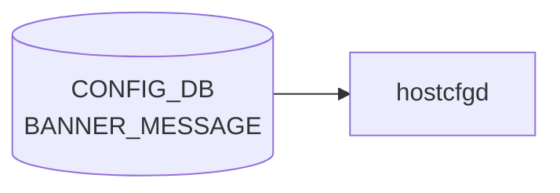

# BANNER_MESSAGE テーブル

## 概要

SSH / コンソールログイン時の login バナー、MOTD、logout バナーを設定するテーブル[^1]。
`hostcfgd` が [CONFIG_DB](../../reference/glossary.md#term-config_db) を購読し、`/etc/issue` / `/etc/motd` / `/etc/issue.net` を書き換える。

<!-- cdb-mermaid -->
### データフロー (自動生成)



!!! note "凡例"
    CONFIG_DB から SAI までの典型経路を `docs/reference/config-db-orch-map.md` から機械生成したミニ図。詳細・例外は本ページ本文と対応表を参照。
<!-- /cdb-mermaid -->

## key 構造

```text
BANNER_MESSAGE|global
```

シングルトン (`global` の 1 行のみ)。

## フィールド

| フィールド | 型 | 既定 | 説明 |
|-----------|----|------|------|
| `state`  | `admin_mode` (enabled/disabled) | `disabled` | バナー機能の有効化フラグ |
| `login`  | string | `Debian GNU/Linux 11` | ログインプロンプト前に表示 |
| `motd`   | string | SONiC アスキーアート + 警告文 | ログイン直後に表示 |
| `logout` | string | `""` | ログアウト時に表示 |

<!-- defaults -->
## フィールド暗黙デフォルト (Phase A — コード由来)

YANG `default` 文はプロビジョニング時 (sonic-cfggen が `init_cfg.json.j2` を展開して DB に書く段階) に適用される。
以下は **DB エントリ自体がない場合** のランタイム fallback を per-field で示す。

| フィールド | YANG default | init_cfg.json.j2 | コード fallback (DB なし) |
|-----------|-------------|-----------------|--------------------------|
| `state`   | `disabled`  | `"disabled"`    | `hostcfgd` `.get("state", {})` → `{}` → `banner-config.sh` で `STATE=` (空文字列) → バナー無効と同等 |
| `login`   | `"Debian GNU/Linux 11"` | `"Debian GNU/Linux 11"` | `.get("login", {})` → `{}` → `state=disabled` 時 no-op、`state=enabled` 時 `LOGIN=` (空文字列) → `/etc/issue` / `/etc/issue.net` 空白化 |
| `motd`    | SONiC ASCII アート + 警告文 (多行) | 同一内容 | `.get("motd", {})` → `{}` → `state=enabled` 時 `MOTD=` → `/etc/motd` 空白化 |
| `logout`  | `""` (空文字列) | `""` | `.get("logout", {})` → `{}` → `state=enabled` 時 `LOGOUT=` → `/etc/logout_message` 空白化 |

**コード根拠**:
- `hostcfgd` `BannerCfg.load()`: `sonic-host-services/scripts/hostcfgd:2069-2077`
- `banner-config.sh` shell fallback: `sonic-buildimage/files/image_config/bannerconfig/banner-config.sh:4-6`
- `init_cfg.json.j2` 初期値: `sonic-buildimage/files/build_templates/init_cfg.json.j2:180-186`
- YANG default: `sonic-buildimage/src/sonic-yang-models/yang-models/sonic-banner.yang:22-48`

<!-- /defaults -->

## 購読者

- `hostcfgd` (`host-services` パッケージ)。ConfigDBConnector で `BANNER_MESSAGE/global` を listen し、`/etc/issue`, `/etc/motd`, `/etc/issue.net` をテンプレ展開して書き換える

## 関連 CONFIG_DB / YANG / CLI

- 関連 CLI: `config banner state` / `config banner login` / `config banner motd` / `config banner logout`
- 関連 [YANG](../../reference/glossary.md#term-yang): `sonic-banner`

<!-- cdb-exceptions -->
## 例外条件・特殊挙動

| 条件 | 挙動 |
|------|------|
| `data` が dict 型以外 | silent return（ログなし） |
| キャッシュと同一の値 | `banner-config` 再起動をスキップ |
| `systemctl restart banner-config` 失敗 | syslog ERR のみ、キャッシュ更新なし（次回変更時に再試行） |
| CONFIG_DB が空 / エントリなし | 全 key を空 dict として処理、再起動不要なら no-op |
| `state`/`login`/`motd`/`logout` 以外のフィールド | `load()` では読まれない（`get()` に固定 key しか渡さない） |

<!-- evidence: sonic-net/sonic-host-services/scripts/hostcfgd:2084L -->
<!-- /cdb-exceptions -->

<!-- value-behavior -->
## 値依存挙動マトリクス

### `state` (enum `enabled`/`disabled`)

| 値 | 効果 | evidence |
|---|---|---|
| `enabled` | `banner-config.sh` が `login` / `motd` / `logout` を読み取り `/etc/issue.net`, `/etc/issue`, `/etc/motd`, `/etc/logout_message` を書き換える | `sonic-buildimage/files/image_config/bannerconfig/banner-config.sh:8` |
| `disabled` | `banner-config.sh` がファイルを一切書き換えない | `banner-config.sh:8` |

### フリーフォームフィールド

- `login` / `motd` / `logout` — freeform string。`state=enabled` の場合のみ評価される

### 複合条件

- `state=enabled` のときのみ `login`/`motd`/`logout` フィールドが評価される。`state=disabled` では他フィールドの値に関わらずファイル更新なし
- `hostcfgd` はキャッシュと値が変化した場合のみ `systemctl restart banner-config` を発行 (重複再起動抑制) (`hostcfgd:2074`)
<!-- /value-behavior -->

<!-- ref-triangle:start -->

## 関連リファレンス

- [YANG](../../reference/glossary.md#term-yang): [`sonic-banner`](../yang/sonic-banner.md)

<!-- ref-triangle:end -->

## 引用元

[^1]: [YANG](../../reference/glossary.md#term-yang) 定義: `sonic-banner.yang`. <https://github.com/sonic-net/sonic-buildimage/blob/9ea932ec2e18f35e58268ec2e4456b1d4afd65cd/src/sonic-yang-models/yang-models/sonic-banner.yang>

## 関連ページ
- [CONFIG_DB index](index.md)

<!-- ops-hint -->
## 運用ヒント

### 典型値

- key 形式: `BANNER_MESSAGE|global`。
- `state`: `enabled`、`login` / `motd` / `logout` に短い文字列を設定。

### よくある誤設定

- 改行を含めるときに JSON エスケープを忘れて適用が失敗する。

### 確認コマンド

```bash
sonic-db-cli CONFIG_DB hgetall 'BANNER_MESSAGE|global'
show banner
```
<!-- /ops-hint -->


<!-- runtime-trace -->
## 実コンテナ動作トレース

### 段階 1 — Consumer 登録

`hostcfgd` の `BannerMessageHandler` が CONFIG_DB の `BANNER_MESSAGE` テーブルを購読する。

`BANNER_MESSAGE` テーブルの key は `login` / `logout` / `motd`。

### 段階 2 — CFG→APPL 翻訳

なし (APPL_DB 中継なし)

### 段階 3 — APPL→SAI

なし (SAI 非経由 — `/etc/issue` / `/etc/issue.net` / sshd banner ファイルを書き換え)

### 段階 4 — タイミングと副作用

**適用タイミング**: CONFIG_DB 変化を検知次第即時にファイル書き換え。次回 SSH / console ログイン時から新 banner が表示される。

**副作用**: 既存セッションへの影響なし。`sshd` の再起動は不要（banner は接続時に読む）。
<!-- /runtime-trace -->

<!-- entry-points -->
## 書き込み入り口 (Direction A)

対象テーブル: `BANNER_MESSAGE`

### CLI
- `config banner motd <message>`
- `config banner login <message>`
- `config banner logout <message>`
  - ソース: `sonic-utilities/config/main.py (banner グループ)`

### minigraph / sonic-cfggen
- なし

### REST / gNMI (sonic-mgmt-common)
- なし (対応 OpenConfig/SONiC YANG transformer なし)

### db_migrator
- なし

### ビルド時デフォルト (init_cfg / j2 テンプレート)
- `init_cfg.json.j2` に `BANNER_MESSAGE` セクションはないが、空エントリがデフォルト

### ハードコードデフォルト
- なし

### ランタイム注入 (デーモン自動書き込み)
- なし
<!-- /entry-points -->

<!-- platform -->
## プラットフォーム差 (Phase H)

**結論: プラットフォーム差なし**（multi-asic / chassis / ベンダー固有 banner すべて該当なし）。

`BANNER_MESSAGE` はホスト名前空間限定のシングルトンテーブルで、購読者である `hostcfgd` `BannerCfg` と `banner-config.sh` はいずれも Linux ホスト上のテキストファイル (`/etc/issue` / `/etc/issue.net` / `/etc/motd` / `/etc/logout_message`) を書き換えるだけで、SAI / ASIC / chassis ハードウェアには一切タッチしない。

### 根拠（コード単位）

| 観点 | 差の有無 | 根拠 |
|------|---------|------|
| multi-asic (namespace 分岐) | なし | `hostcfgd` `BannerCfg` クラス (`sonic-host-services/scripts/hostcfgd:2044-2114`) 全体に `namespace` / `asic_id` / `multi_asic` の参照・分岐なし。グローバル CONFIG_DB のみ参照 |
| chassis (VoQ / packet-chassis) | なし | `banner-config.sh` は `sonic-db-cli CONFIG_DB HGET 'BANNER_MESSAGE|global' ...` を 4 回呼ぶだけ。`linecard` / `supervisor` / `database-chassis` 分岐なし (`sonic-buildimage/files/image_config/bannerconfig/banner-config.sh:1-18`) |
| ASIC ベンダー固有 (Broadcom/Mellanox/Marvell/…) | なし | SAI 非経由。Linux ファイル書き換えのみ。`platform/*/` 配下に `banner` 関連オーバーライドファイルなし |
| ビルド時 platform 条件 | なし | `sonic_debian_extension.j2:652-654` で全プラットフォーム共通 (platform 別 `if` の外) に `banner-config.service` / `banner-config.sh` をコピー |
| systemd template (`@.service`) | なし | `banner-config.service` は単一 unit。`[Install] WantedBy=sonic.target` 固定 (`sonic-buildimage/files/image_config/bannerconfig/banner-config.service:1-14`) |
| HLD 上の platform 言及 | なし | `SONiC/doc/banner/banner_hld.md` 全文に `asic` / `chassis` / `namespace` / `vendor` の言及なし |

### 補足

- 本判定の詳細は `meta/_intermediate/cdb-flow/banner-message-platform.md` を参照。
- multi-asic chassis (例: VoQ chassis supervisor + linecard 構成) においても `banner-config.service` はホスト側に 1 インスタンスのみ存在し、すべての SSH / console セッションで同じバナーが表示される。
<!-- /platform -->

<!-- glossary-links-injected: b5626ca1f0f9 -->
