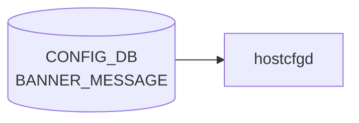

# BANNER_MESSAGE テーブル

## 概要

SSH / コンソールログイン時の login バナー、MOTD、logout バナーを設定するテーブル[^1]。
`hostcfgd` が [CONFIG_DB](../../reference/glossary.md#term-config_db) を購読し、`/etc/issue` / `/etc/motd` / `/etc/issue.net` を書き換える。

<!-- cdb-mermaid -->
### データフロー (自動生成)



!!! note "凡例"
    CONFIG_DB から SAI までの典型経路を `docs/reference/config-db-orch-map.md` から機械生成したミニ図。詳細・例外は本ページ本文と対応表を参照。
<!-- /cdb-mermaid -->

## key 構造

```text
BANNER_MESSAGE|global
```

シングルトン (`global` の 1 行のみ)。

## フィールド

| フィールド | 型 | 既定 | 説明 |
|-----------|----|------|------|
| `state`  | `admin_mode` (enabled/disabled) | `disabled` | バナー機能の有効化フラグ |
| `login`  | string | `Debian GNU/Linux 11` | ログインプロンプト前に表示 |
| `motd`   | string | SONiC アスキーアート + 警告文 | ログイン直後に表示 |
| `logout` | string | `""` | ログアウト時に表示 |

## 購読者

- `hostcfgd` (`host-services` パッケージ)。ConfigDBConnector で `BANNER_MESSAGE/global` を listen し、`/etc/issue`, `/etc/motd`, `/etc/issue.net` をテンプレ展開して書き換える

## 関連 CONFIG_DB / YANG / CLI

- 関連 CLI: `config banner state` / `config banner login` / `config banner motd` / `config banner logout`
- 関連 [YANG](../../reference/glossary.md#term-yang): `sonic-banner`

<!-- cdb-exceptions -->
## 例外条件・特殊挙動

| 条件 | 挙動 |
|------|------|
| `data` が dict 型以外 | silent return（ログなし） |
| キャッシュと同一の値 | `banner-config` 再起動をスキップ |
| `systemctl restart banner-config` 失敗 | syslog ERR のみ、キャッシュ更新なし（次回変更時に再試行） |
| CONFIG_DB が空 / エントリなし | 全 key を空 dict として処理、再起動不要なら no-op |
| `state`/`login`/`motd`/`logout` 以外のフィールド | `load()` では読まれない（`get()` に固定 key しか渡さない） |

<!-- evidence: sonic-net/sonic-host-services/scripts/hostcfgd:2084L -->
<!-- /cdb-exceptions -->

<!-- value-behavior -->
## 値依存挙動マトリクス

### `state` (enum `enabled`/`disabled`)

| 値 | 効果 | evidence |
|---|---|---|
| `enabled` | `banner-config.sh` が `login` / `motd` / `logout` を読み取り `/etc/issue.net`, `/etc/issue`, `/etc/motd`, `/etc/logout_message` を書き換える | `sonic-buildimage/files/image_config/bannerconfig/banner-config.sh:8` |
| `disabled` | `banner-config.sh` がファイルを一切書き換えない | `banner-config.sh:8` |

### フリーフォームフィールド

- `login` / `motd` / `logout` — freeform string。`state=enabled` の場合のみ評価される

### 複合条件

- `state=enabled` のときのみ `login`/`motd`/`logout` フィールドが評価される。`state=disabled` では他フィールドの値に関わらずファイル更新なし
- `hostcfgd` はキャッシュと値が変化した場合のみ `systemctl restart banner-config` を発行 (重複再起動抑制) (`hostcfgd:2074`)
<!-- /value-behavior -->

<!-- ref-triangle:start -->

## 関連リファレンス

- [YANG](../../reference/glossary.md#term-yang): [`sonic-banner`](../yang/sonic-banner.md)

<!-- ref-triangle:end -->

## 引用元

[^1]: [YANG](../../reference/glossary.md#term-yang) 定義: `sonic-banner.yang`. <https://github.com/sonic-net/sonic-buildimage/blob/9ea932ec2e18f35e58268ec2e4456b1d4afd65cd/src/sonic-yang-models/yang-models/sonic-banner.yang>

## 関連ページ
- [CONFIG_DB index](index.md)

<!-- ops-hint -->
## 運用ヒント

### 典型値

- key 形式: `BANNER_MESSAGE|global`。
- `state`: `enabled`、`login` / `motd` / `logout` に短い文字列を設定。

### よくある誤設定

- 改行を含めるときに JSON エスケープを忘れて適用が失敗する。

### 確認コマンド

```bash
sonic-db-cli CONFIG_DB hgetall 'BANNER_MESSAGE|global'
show banner
```
<!-- /ops-hint -->


<!-- runtime-trace -->
## 実コンテナ動作トレース

### 段階 1 — Consumer 登録

`hostcfgd` の `BannerMessageHandler` が CONFIG_DB の `BANNER_MESSAGE` テーブルを購読する。

`BANNER_MESSAGE` テーブルの key は `login` / `logout` / `motd`。

### 段階 2 — CFG→APPL 翻訳

なし (APPL_DB 中継なし)

### 段階 3 — APPL→SAI

なし (SAI 非経由 — `/etc/issue` / `/etc/issue.net` / sshd banner ファイルを書き換え)

### 段階 4 — タイミングと副作用

**適用タイミング**: CONFIG_DB 変化を検知次第即時にファイル書き換え。次回 SSH / console ログイン時から新 banner が表示される。

**副作用**: 既存セッションへの影響なし。`sshd` の再起動は不要（banner は接続時に読む）。
<!-- /runtime-trace -->

<!-- entry-points -->
## 書き込み入り口 (Direction A)

対象テーブル: `BANNER_MESSAGE`

### CLI
- `config banner motd <message>`
- `config banner login <message>`
- `config banner logout <message>`
  - ソース: `sonic-utilities/config/main.py (banner グループ)`

### minigraph / sonic-cfggen
- なし

### REST / gNMI (sonic-mgmt-common)
- なし (対応 OpenConfig/SONiC YANG transformer なし)

### db_migrator
- なし

### ビルド時デフォルト (init_cfg / j2 テンプレート)
- `init_cfg.json.j2` に `BANNER_MESSAGE` セクションはないが、空エントリがデフォルト

### ハードコードデフォルト
- なし

### ランタイム注入 (デーモン自動書き込み)
- なし
<!-- /entry-points -->

<!-- derivation -->
## 派生・条件付き登録 (Phase 6/7)

### Phase 6: 自動派生

BANNER_MESSAGE テーブルのフィールドが他フィールドを自動派生させるパターンは確認されなかった。`state` フィールドはバナー表示の ON/OFF を制御するが、他のフィールドへの派生は行わない。

**minigraph.py / config_samples.py / init_cfg 由来の自動設定**: 該当なし

### Phase 7: 条件付き登録

| 条件 | 影響 | ソース |
|---|---|---|
| `hostcfgd` の `BannerCfg` ハンドラは常時登録 (platform 非依存) | `BANNER_MESSAGE` テーブル購読は無条件 | `hostcfgd:2520` |
| キャッシュと値が一致する場合 | `update_required = False` → `systemctl restart banner-config` をスキップ | `hostcfgd:2107-2108` |

### グレップカバレッジ

| 項目 | hit 数 | 証跡 |
|---|---|---|
| BannerCfg 登録 | 1 | `hostcfgd:2520` |
| キャッシュ比較 | 1 | `hostcfgd:2102-2105` |

<!-- /derivation -->

<!-- handler-branching -->
### Phase 8: Handler メソッド内分岐

BANNER_MESSAGE は `BannerCfg.banner_message()` が処理する。

| Handler | メソッド | 分岐条件 | 効果 | evidence |
|---|---|---|---|---|
| `BannerCfg` | `banner_message()` | `type(data) != dict` | 早期 return (処理対象外) | `hostcfgd:2096-2098` |
| `BannerCfg` | `banner_message()` | キャッシュと全フィールドが一致 | `update_required = False` → return (no-op) | `hostcfgd:2100-2108` |
| `BannerCfg` | `banner_message()` | いずれかのフィールドがキャッシュと不一致 | `systemctl restart banner-config` を実行 | `hostcfgd:2111` |
| `BannerCfg` | `banner_message()` | `systemctl restart` 失敗 | `syslog ERR` + return (クラッシュなし) | `hostcfgd:2113-2115` |

> **スキャン証跡**: `hostcfgd:2084-2119` を全行読了、4 件分岐抽出。`state` フィールド値による内部分岐は存在せず、変化検知 → `banner-config` サービス再起動の一本道。

<!-- /handler-branching -->

<!-- glossary-links-injected: b5626ca1f0f9 -->
