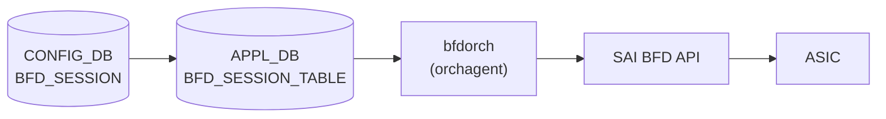

# APPL_DB BFD_SESSION_TABLE (bfdorch)

## 概要

[APPL_DB](../../reference/glossary.md#term-appl_db) `BFD_SESSION_TABLE` は `sonic-swss` の `bfdorch` が購読する [BFD](../../reference/glossary.md#term-bfd) セッション設定テーブル[^1]。[CONFIG_DB](../../reference/glossary.md#term-config_db) の [`BFD_SESSION`](bfd-session.md) テーブルの内容が `cfgmgrd` を経由して [APPL_DB](../../reference/glossary.md#term-appl_db) に書き込まれ、`bfdorch` が `SET` / `DEL` オペレーションを受けて [SAI](../../reference/glossary.md#term-sai) [BFD](../../reference/glossary.md#term-bfd) セッションを作成・削除する。

`BGP_DEVICE_GLOBAL.STATE.use_software_bfd = true` の場合、bfdorch は [SAI](../../reference/glossary.md#term-sai) を経由せず [STATE_DB](../../reference/glossary.md#term-state_db) の `SOFTWARE_BFD_SESSION_TABLE` にエントリを転記するのみで終了する (`bgpcfgd/BfdMgr` が [FRR](../../reference/glossary.md#term-frr) bfdd へ設定を注入)。

<!-- cdb-mermaid -->
### データフロー (自動生成)



!!! note "凡例"
    hardware BFD offload 経路 (`use_software_bfd = false`) の典型フロー。software BFD 経路では SAI を経由せず FRR bfdd へ直接注入される。
<!-- /cdb-mermaid -->

## key 構造

```text
BFD_SESSION_TABLE:<vrf>:<interface>:<peer_ip>
```

- `<vrf>`: [VRF](../../reference/glossary.md#term-vrf) 名。デフォルト [VRF](../../reference/glossary.md#term-vrf) は `"default"`
- `<interface>`: 出力インタフェース名。hardware lookup を使用する場合は `"default"`
- `<peer_ip>`: [BFD](../../reference/glossary.md#term-bfd) ピアの IP アドレス (IPv4 / IPv6)

[CONFIG_DB](../../reference/glossary.md#term-config_db) の `BFD_SESSION|<vrf>|<interface>|<peer_ip>` と同一構造 (区切り文字 `|` → `:` に変換)。

## フィールド

| フィールド | 型 | デフォルト | 説明 |
|-----------|----|-----------|------|
| `local_addr` | IP アドレス (string) | **必須** | BFD セッションのローカル送信元 IP アドレス |
| `type` | enum string | `"async_active"` | BFD セッション種別。`async_active` / `async_passive` / `demand_active` / `demand_passive` |
| `tx_interval` | uint32 (ms) | `1000` | 送信間隔 (ミリ秒)。[SAI](../../reference/glossary.md#term-sai) 投入時に ×1000 してマイクロ秒変換 |
| `rx_interval` | uint32 (ms) | `1000` | 最小受信間隔 (ミリ秒)。SAI 投入時に ×1000 してマイクロ秒変換 |
| `multiplier` | uint8 | `10` (hardware) / `3` (software) | 検知乗数 (detect multiplier) |
| `multihop` | boolean string | `"false"` | マルチホップ BFD を有効化 |
| `tos` | uint8 | `192` | IP TOS / [DSCP](../../reference/glossary.md#term-dscp) 値。デフォルト [DSCP](../../reference/glossary.md#term-dscp) 48 (EF) を 2 ビット左シフトして 192 (0xC0) |
| `dst_mac` | MAC アドレス (string) | 条件付き必須 | 宛先 MAC アドレス。`interface != "default"` の場合のみ有効・必須 |
| `shutdown_bfd_during_tsa` | boolean string | 未指定 = TSA 連動なし | `"true"` のとき TSA 状態で BFD セッションを削除し Down 通知 |

## 制約

- `local_addr` は必須。省略するとセッション作成をスキップし `ERROR` ログを出力する (`bfdorch.cpp:409-413`)
- `interface != "default"` かつ `dst_mac` 未指定 → セッション作成失敗
- `interface == "default"` かつ `dst_mac` 指定 → セッション作成失敗
- `vrf != "default"` かつ `interface != "default"` → `"vrf is not supported when hardware lookup not valid"` エラー
- 同一キーのセッションが既に存在する場合 → `"BFD session for %s already exists"` を SWSS_LOG_ERROR 出力して true を返す (no-op)

## use_software_bfd 切り替え動作

`BgpGlobalStateOrch::getSoftwareBfd()` が `true` を返す場合 (= BFD hardware offload が [ASIC](../../reference/glossary.md#term-asic) に未実装)、bfdorch は `doTask()` の SET ハンドラで SAI API を呼ばず [STATE_DB](../../reference/glossary.md#term-state_db) `SOFTWARE_BFD_SESSION_TABLE` にエントリを書き込む。この場合、本テーブルの `tx_interval` / `multiplier` などのデフォルト値が適用される前に bfdorch がリターンするため、SAI 向けのデフォルト値は意味を持たない。

<!-- cdb-exceptions -->
## 例外条件・特殊挙動

| 条件 | 挙動 |
|------|------|
| `local_addr` 未指定 | `"Failed to create BFD session ... because source IP is not provided"` を SWSS_LOG_ERROR 出力してスキップ |
| `interface != "default"` かつ `dst_mac` 未指定 | `"destination MAC address required when hardware lookup not valid"` エラー |
| `interface == "default"` かつ `dst_mac` 指定 | `"destination MAC address not supported when hardware lookup valid"` エラー |
| `use_software_bfd == true` | SAI 未経由。bfdorch は [STATE_DB](../../reference/glossary.md#term-state_db) `SOFTWARE_BFD_SESSION_TABLE` に転記するのみ |
| TSA 有効 + `shutdown_bfd_during_tsa == "true"` | セッション未作成 + Down 通知 (TSA 解除時に作成) |
| 同一キーのセッションが既に存在 | `"BFD session for %s already exists"` を SWSS_LOG_ERROR 出力して true を返す (no-op) |
| UDP 送信元ポート重複 | 最大 3 回リトライ (`NUM_BFD_SRCPORT_RETRIES = 3`、ポート範囲 49152–65535) |
<!-- /cdb-exceptions -->

<!-- ordering -->
## 書込み順依存・タイミング依存 (Phase B)

[APPL_DB](../../reference/glossary.md#term-appl_db) `BFD_SESSION_TABLE` を購読する `BfdOrch::doTask(Consumer&)` (`bfdorch.cpp:111-218`) は `aclorch` 等とは異なり `gPortsOrch->allPortsReady()` の早期 return ガードを**持たない**。代わりに `create_bfd_session()` 内で個別に PORT / [VRF](../../reference/glossary.md#term-vrf) / SAI capability を解決し、失敗時に `return false` で `it++` 待機する設計になっている。

### 1. BgpGlobalStateOrch 先行と software/hardware 経路の静的固定

```cpp
// bfdorch.cpp:114-121
BgpGlobalStateOrch* bgp_global_state_orch = gDirectory.get<BgpGlobalStateOrch*>();
bool tsa_enabled = false;
bool use_software_bfd = true;
if (bgp_global_state_orch)
{
    tsa_enabled = bgp_global_state_orch->getTsaState();
    use_software_bfd = bgp_global_state_orch->getSoftwareBfd();
}
```

`BgpGlobalStateOrch` が [orchagent](../../reference/glossary.md#term-orchagent) 起動シーケンスで `BfdOrch` より先に生成されていないと `gDirectory.get` が null を返し、`use_software_bfd = true`（software 経路）に強制 fallback する。`BgpGlobalStateOrch` コンストラクタ (`bfdorch.cpp:729-736`) は `offload_supported(IPv4) && offload_supported(IPv6)` を**起動時 1 回**だけ評価して `bfd_offload` を確定し、`getSoftwareBfd()` は `!bfd_offload` を返す純粋関数。

→ 順序依存: `BgpGlobalStateOrch` ≺ `BfdOrch` の生成順。経路の動的切替は不可（swss コンテナ再起動が必須）。

### 2. PORT (PortsOrch) 先行必須 — `alias != "default"` 経路のみ

```cpp
// bfdorch.cpp:482-490 (create_bfd_session 内)
if (alias != "default")
{
    Port port;
    if (!gPortsOrch->getPort(alias, port))
    {
        SWSS_LOG_ERROR("Failed to locate port %s", alias.c_str());
        return false;  // → doTask の it++ で次イベントループ再試行
    }
    ...
}
```

出力インタフェース指定 BFD（hardware lookup 無効 = [ASIC](../../reference/glossary.md#term-asic) が次ホップを引かない方式）では `PORT|<alias>` が PortsOrch に登録済みでないと SET が成立しない。一方 `alias == "default"`（hardware lookup 有効）の純 L3 BFD は PORT 未初期化でも処理が進むため、PortsOrch readiness と無関係。

→ 順序依存: 出力インタフェース指定時のみ `PORT|<alias>` が先行必須。

### 3. VRF (VRFOrch) 先行必須 — hardware lookup ＋ 非 default VRF

```cpp
// bfdorch.cpp:530-541
attr.id = SAI_BFD_SESSION_ATTR_VIRTUAL_ROUTER;
if (vrf_name == "default")
{
    attr.value.oid = gVirtualRouterId;
}
else
{
    VRFOrch* vrf_orch = gDirectory.get<VRFOrch*>();
    attr.value.oid = vrf_orch->getVRFid(vrf_name);
}
```

`VRFOrch::getVRFid` は未登録 VRF に対して `SAI_NULL_OBJECT_ID` を返すため、後続の `sai_bfd_api->create_bfd_session` が失敗する。`handleSaiCreateStatus` の戻りが `task_need_retry` であれば次イベントループで再試行される。

→ 順序依存: hardware lookup ＋ 非 default VRF では `VRF|<name>` が VRFOrch に登録済みであること。

### 4. SAI state-change 通知ハンドラ登録（最初の SET で 1 回だけ）

```cpp
// bfdorch.cpp:307-315 (create_bfd_session 入口)
if (!register_state_change_notif)
{
    if (!register_bfd_state_change_notification())
    {
        SWSS_LOG_ERROR("BFD session for %s cannot be created", key.c_str());
        return false;
    }
    register_state_change_notif = true;
}
```

`register_bfd_state_change_notification()` (`bfdorch.cpp:270-303`) は `SAI_SWITCH_ATTR_BFD_SESSION_STATE_CHANGE_NOTIFY` の `set_implemented` capability を照会し、false の [ASIC](../../reference/glossary.md#term-asic) では永続的に false を返す → そのプラットフォームでは**全 BFD セッションが reject** され続ける（順序解消されない致命的依存）。

### 5. software BFD 経路への切替時の書込み順序

```cpp
// bfdorch.cpp:131-139 (SET) / 180-188 (DEL)
if (use_software_bfd)
{
    m_stateSoftBfdSessionTable->set(createStateDBKey(key), data);
    it = consumer.m_toSync.erase(it);
    continue;
}
```

`use_software_bfd == true` のとき `create_bfd_session()` を**通らず** STATE_DB `SOFTWARE_BFD_SESSION_TABLE` に転記して即 erase する。PORT / VRF / SAI capability 依存はすべて回避されるが、代わりに後段で STATE_DB を購読する `bgpcfgd/BfdMgr` (→ [FRR](../../reference/glossary.md#term-frr) `bfdd`) の起動順に依存する。`bgpcfgd` の購読開始前に書き込まれた分は反映されないため、起動順は **`bgpcfgd` ≺ `swss/bfdorch`** が望ましい。

→ 順序依存: software 経路は bfdorch 内に依存無し、外部 (`bgpcfgd`) との起動順レースに置換される。

### 6. TSA 連動 — `bfd_session_cache` リプレイの順序

```cpp
// bfdorch.cpp:155-169 (SET / shutdown_bfd_during_tsa == "true" のとき)
if (tsa_shutdown_enabled)
{
    bfd_session_cache[key] = data;           // 常にキャッシュ更新
    if (!tsa_enabled)
    {
        if (!create_bfd_session(key, data)) { it++; continue; }
    }
    else
    {
        notify_session_state_down(key);      // TSA 中は SAI セッション作らず Down 通知のみ
    }
}
```

```cpp
// bfdorch.cpp:683-704
void BfdOrch::handleTsaStateChange(bool tsaState)
{
    for (auto it : bfd_session_cache)
    {
        if (tsaState == true)
        {
            if (bfd_session_map.find(it.first) != bfd_session_map.end())
            {
                notify_session_state_down(it.first);
                remove_bfd_session(it.first);
            }
        }
        else
        {
            if (bfd_session_map.find(it.first) == bfd_session_map.end())
            {
                create_bfd_session(it.first, it.second);
            }
        }
    }
}
```

`BgpGlobalStateOrch::doTask()` (`bfdorch.cpp:813-826`) が `BGP_DEVICE_GLOBAL|STATE` の `tsa_enabled` フィールド変化を検知して `BfdOrch::handleTsaStateChange()` を呼び、`bfd_session_cache` 全件を **`std::map` キー辞書順**で replay する。TSA exit 時の create は `bfd_session_map` 未登録のものに限るため二重 create は抑止されるが、replay 中に PORT/VRF/SAI capability 状態が変動していれば create が失敗する余地がある。`shutdown_bfd_during_tsa != "true"` の通常セッションは cache 対象外で、TSA 中も SAI セッションが維持される。

→ タイミング依存: TSA cache replay の対象は `shutdown_bfd_during_tsa == "true"` のセッションのみ。replay 順は辞書順で、PORT/VRF 復帰前に enter→exit が走ると create 失敗。

### 7. DEL → SET 同一キー連続書込み

```cpp
// bfdorch.cpp:190-209 (DEL)
if (bfd_session_cache.find(key) != bfd_session_cache.end())
{
    bfd_session_cache.erase(key);                   // cache 先消し
    if (!tsa_enabled)
    {
        if (!remove_bfd_session(key)) { it++; continue; }
    }
}
else
{
    if (!remove_bfd_session(key)) { it++; continue; }
}
```

`remove_bfd_session()` は内部で `bfd_session_map.erase` と `bfd_session_lookup.erase(bfd_session_id)` を行う (`bfdorch.cpp:622-635`)。同一 doTask サイクル内では順次処理されるため通常は安全だが、`remove_bfd_session` が失敗 (`it++`) して残った状態で次サイクルに DEL→SET が来ると、SET 側の `bfd_session_map.find(key) != end` チェック (`bfdorch.cpp:316-320`) が古い OID を引いて `"BFD session for %s already exists"` で **no-op return true** になり、新パラメータが反映されない。

### 順序依存サマリ

| 依存項目 | スコープ | 解消メカニズム | evidence |
|---|---|---|---|
| BgpGlobalStateOrch 先行 | 起動時 1 回 | null なら software 経路に fallback | bfdorch.cpp:114-121, 729-736 |
| software / hardware 経路 | 起動時 1 回固定 | SAI capability 1 回照会、動的切替不可 | bfdorch.cpp:749-791 |
| PORT 初期化 | `alias != "default"` のみ | `getPort` 失敗で `return false` → 再試行 | bfdorch.cpp:482-490 |
| VRF 登録 | hardware lookup ＋ 非 default VRF | `getVRFid` null → SAI create 失敗 → handleSaiCreateStatus | bfdorch.cpp:530-541 |
| SAI state-change 通知登録 | 初回 SET 1 回 | capability false で永続 reject | bfdorch.cpp:270-315 |
| TSA cache replay | TSA enter/exit | `handleTsaStateChange` で辞書順 replay | bfdorch.cpp:141-178, 683-704 |
| DEL → SET 同一キー | 連続書込 | DEL 失敗時 SET no-op の落とし穴 | bfdorch.cpp:190-209, 316-320 |
| software 経路の購読側起動順 | software BFD のみ | `bgpcfgd` 先行が望ましい | bfdorch.cpp:131-139 |

!!! warning "PortsOrch readiness ガード非搭載"
    `BfdOrch::doTask()` は `aclorch` 等と異なり `gPortsOrch->allPortsReady()` の早期 return を持たない。`alias == "default"` の hardware lookup BFD は PORT 未初期化状態でも `create_bfd_session()` まで到達するため、PortsOrch readiness と独立に処理される点に注意。

<!-- /ordering -->

<!-- ref-triangle:start -->

## 関連リファレンス

- [CONFIG_DB](../../reference/glossary.md#term-config_db): [`BFD_SESSION`](bfd-session.md) — CONFIG_DB 側のユーザー設定テーブル
- CONFIG_DB: [`BGP_DEVICE_GLOBAL`](bgp-device-global.md) — `use_software_bfd` / TSA フラグ
- STATE_DB: [`BFD_SESSION_TABLE`](bfd-state.md) — bfdorch が書き込むランタイム状態テーブル

<!-- ref-triangle:end -->

## 引用元

[^1]: `sonic-swss/orchagent/bfdorch.cpp` (L15-20 マクロ定義、L305-574 `create_bfd_session()`、L111-217 `doTask()`). <https://github.com/sonic-net/sonic-swss/blob/master/orchagent/bfdorch.cpp>

<!-- pubsub -->
## 通信メカニズム (Phase G)

### Redis 購読方式

`bfdorch` は 2 系統の購読を持つ:

1. **APPL_DB `BFD_SESSION_TABLE`** の SET/DEL を `swss::ConsumerStateTable` (channel PUBLISH/SUBSCRIBE) で購読
2. **[ASIC_DB](../../reference/glossary.md#term-asic_db) `NOTIFICATIONS`** channel を `swss::NotificationConsumer` で購読し、SAI `bfd_session_state_change` 通知を受信して STATE_DB を更新

`BfdOrch` は `Orch(db, tableName)` を継承し、`m_applDb` + `APP_BFD_SESSION_TABLE_NAME` で初期化される (`orchdaemon.cpp:237-244`)。`Orch` 基底クラスの `addConsumer()` が DB ID で分岐し、APPL_DB (= CONFIG_DB / STATE_DB / CHASSIS_APP_DB 以外) には `ConsumerStateTable` を割り当てる (`orch.cpp:1186-1196`)。よって **keyspace 通知 (`__keyspace@<dbId>__:...`) は使わない**。

```cpp
// sonic-swss/orchagent/orchdaemon.cpp:237-244
TableConnector stateDbBfdSessionTable(m_stateDb, STATE_BFD_SESSION_TABLE_NAME);
gBfdOrch = new BfdOrch(m_applDb, APP_BFD_SESSION_TABLE_NAME, stateDbBfdSessionTable);
```

| 購読者 | 購読 API | 購読 DB / チャンネル | 優先度 | バッチ |
|--------|---------|---------------------|--------|--------|
| `orchagent` (`BfdOrch`) APPL_DB consumer | `swss::ConsumerStateTable` | `APPL_DB` / `BFD_SESSION_TABLE_CHANNEL@0` | `default_orch_pri` | `gBatchSize` (default 128) |
| `orchagent` (`BfdOrch`) SAI 状態通知 | `swss::NotificationConsumer` (`Notifier` executor `BFD_STATE_NOTIFICATIONS`) | `ASIC_DB` / `NOTIFICATIONS` channel | - | - |

書き込み側 (`bgpcfgd` `StaticRouteBfd` / `BfdMgr` 等) は `swsscommon.ProducerStateTable` で書き込み、内部で `_BFD_SESSION_TABLE:<key>` の HSET + `BFD_SESSION_TABLE_CHANNEL@0` への `PUBLISH "G"` を発行する。CONFIG_DB `BFD_SESSION` は直接購読せず、`bgpcfgd` 系 manager が CONFIG_DB → APPL_DB のミラーを担う。

### doTask(Consumer&) フロー

```
bgpcfgd StaticRouteBfd / BfdMgr (producer)
  ↓ ProducerStateTable::set("<vrf>:<intf>:<peer>", fvs)
APPL_DB: HSET "_BFD_SESSION_TABLE:<vrf>:<intf>:<peer>" local_addr=... type=...
  ↓ Redis PUBLISH "BFD_SESSION_TABLE_CHANNEL@0" "G"
OrchDaemon main loop: m_select->select(&s, SELECT_TIMEOUT=1000ms)
  ↓ Consumer::execute() → ConsumerStateTable::pops()
BfdOrch::doTask(Consumer&)  (bfdorch.cpp:111-217)
  ↓ BgpGlobalStateOrch から tsa_enabled / use_software_bfd を取得
  ↓ SET:
  ↓   use_software_bfd=true → STATE_DB SOFTWARE_BFD_SESSION_TABLE 転記のみ
  ↓   shutdown_bfd_during_tsa=true → tsa_enabled 分岐で create or notify Down
  ↓   通常 → create_bfd_session()
  ↓ DEL: remove_bfd_session()
SAI: sai_bfd_api->create_bfd_session / remove_bfd_session
ASIC (sairedis → ASIC_DB 経由)
```

- `doTask(Consumer&)` 冒頭に `allPortsReady()` チェックは **無い** (`fdborch` 等とは異なり、ポート初期化待ちをしない)。
- `create_bfd_session()` が `false` を返した場合のみエントリは `m_toSync` に残留 (`it++; continue;`)。成功時 / software 経路転記時 / TSA shutdown 時はいずれも `erase` される。

### ASIC_DB NOTIFICATIONS 側 (SAI 状態変化)

セッション状態変化は SAI コールバック `on_bfd_session_state_change` が [ASIC_DB](../../reference/glossary.md#term-asic_db) `NOTIFICATIONS` チャネルに `bfd_session_state_change` op で publish し、`BfdOrch::m_bfdStateNotificationConsumer` が受信する。

```cpp
// sonic-swss/orchagent/bfdorch.cpp:63-87 (ctor 抜粋)
DBConnector *notificationsDb = new DBConnector("ASIC_DB", 0);
m_bfdStateNotificationConsumer = new swss::NotificationConsumer(notificationsDb, "NOTIFICATIONS");
auto bfdStateNotificatier = new Notifier(m_bfdStateNotificationConsumer, this, "BFD_STATE_NOTIFICATIONS");
Orch::addExecutor(bfdStateNotificatier);
```

`BfdOrch::doTask(NotificationConsumer&)` (`bfdorch.cpp:220-268`) のハンドラ動作:

1. `consumer.pop(op, data, values)` で 1 件取得
2. `&consumer != m_bfdStateNotificationConsumer` ガード (他 op 混入除け)
3. `op == "bfd_session_state_change"` で `sai_deserialize_bfd_session_state_ntf()` 展開
4. **状態差分があるときのみ** STATE_DB `BFD_SESSION_TABLE|<vrf>|<intf>|<peer>` の `state` フィールドを `hset` する (毎回上書きしない)
5. 同時に `Subject::notify(SUBJECT_TYPE_BFD_SESSION_STATE_CHANGE, &update)` でプロセス内 observer (例: `MuxOrch` 等の dynamic next-hop tracking) にも伝搬

### コールバック登録タイミング

`BfdOrch::register_bfd_state_change_notification()` (`bfdorch.cpp:270-303`) は **初回 `create_bfd_session()` 内** (`bfdorch.cpp:307-314`) で 1 回だけ呼ばれる。`register_state_change_notif` フラグで以後抑止される。

`sai_query_attribute_capability(SAI_SWITCH_ATTR_BFD_SESSION_STATE_CHANGE_NOTIFY)` で `set_implemented == true` を確認した上で `sai_switch_api->set_switch_attribute()` でコールバック `on_bfd_session_state_change` を登録する。capability が false の場合は **セッション作成自体を reject** する (詳細は Phase H プラットフォーム差を参照)。

### STATE_DB Table (購読しない / 書き込みのみ)

| Table | 用途 |
|-------|------|
| `m_stateBfdSessionTable` = `BFD_SESSION_TABLE` (STATE_DB) | hardware BFD 経路のランタイム状態 (`state` フィールド) |
| `m_stateSoftBfdSessionTable` = `SOFTWARE_BFD_SESSION_TABLE` (STATE_DB) | software BFD 経路で APPL_DB エントリを転記するスナップショット |

両 Table とも ctor で `getKeys()` + `del()` により起動時に空にされる (`bfdorch.cpp:74-85`)。STATE_DB を読み戻すロジックは無い。

### 通信パターン要約

| 区間 | 方式 | チャンネル / API |
|------|------|-----------------|
| [bgpcfgd](../../reference/glossary.md#term-bgpcfgd) → APPL_DB | `ProducerStateTable::set()` | `BFD_SESSION_TABLE_CHANNEL@0` (PUBLISH "G") |
| APPL_DB → BfdOrch | `swss::ConsumerStateTable` (Orch base) | 同上 channel |
| BfdOrch → SAI | SAI BFD API 直接呼び出し | `sai_bfd_api->create_bfd_session` / `remove_bfd_session` |
| ASIC → BfdOrch | SAI コールバック → [ASIC_DB](../../reference/glossary.md#term-asic_db) NOTIFICATIONS | `op="bfd_session_state_change"` |
| ASIC_DB NOTIFICATIONS → BfdOrch | `swss::NotificationConsumer` + `Notifier` | channel `NOTIFICATIONS` |
| BfdOrch → STATE_DB | `swss::Table::hset()` | `BFD_SESSION_TABLE\|<vrf>\|<intf>\|<peer>` |
| BfdOrch → in-process observers | `Subject::notify()` | `SUBJECT_TYPE_BFD_SESSION_STATE_CHANGE` |

CONFIG_DB は購読しない。keyspace 通知も使わない。詳細解析は `meta/_intermediate/cdb-flow/bfd-orch-pubsub.md` を参照。
<!-- /pubsub -->

<!-- side-effects -->
## 副次 DB 書込 (Phase F)

本ページが扱う主作用テーブルは **APPL_DB `BFD_SESSION_TABLE`** (bfdorch が consumer として購読) であり、`BfdOrch` の主作用は SAI BFD セッションの作成・削除 (ASIC_DB 経由) である。これに加え、`BfdOrch` は **STATE_DB の 2 テーブル** へ副次的にエントリを書き込む。SAI BFD セッション自体の書込み (ASIC_DB 経由) は主作用のため除外する。

| 副次 DB | テーブル / キー | 書込内容 | 根拠 |
|---|---|---|---|
| STATE_DB | `BFD_SESSION_TABLE\|<vrf>:<ifname>:<peer_ip>` | `create_bfd_session()` 成功時に `state="Down"` で初期化 (`set`)。ASIC_DB `NOTIFICATIONS` 受信で `state` を `Down`/`Init`/`Up`/`Admin_Down` に `hset` 更新。`remove_bfd_session()` 時に `del`。コンストラクタで起動時に既存エントリを全 `del` cleanup | `bfdorch.cpp:59` (`m_stateBfdSessionTable` 構築), `:78` (起動時 cleanup), `:252` (`hset("state", ...)`), `:565` (`set(state_db_key, fvVector)`), `:629` (`del`) |
| STATE_DB | `SOFTWARE_BFD_SESSION_TABLE\|<vrf>:<ifname>:<peer_ip>` | `use_software_bfd == true` 経路で APPL_DB SET 受信時に FV をそのまま転記 (`set`)。DEL 受信時に `del`。コンストラクタで起動時に既存エントリを全 `del` cleanup。`bgpcfgd/BfdMgr` がこのテーブルを購読し [FRR](../../reference/glossary.md#term-frr) `bfdd` へ設定注入 | `bfdorch.cpp:68` (`m_stateSoftBfdSessionTable` 構築), `:84` (起動時 cleanup), `:136` (`set`), `:185` (`del`), `:706-714` (`createSoftwareBfdSession()` / `removeSoftwareBfdSession()`) |

呼出しトリガは APPL_DB `BFD_SESSION_TABLE` の SET / DEL 受信 (`doTask()` L111-217)、ASIC_DB `NOTIFICATIONS` の `bfd_session_state_change` 受信 (L226-263) と [orchagent](../../reference/glossary.md#term-orchagent) 起動時 cleanup (L75-86)。

`BfdOrch` は **[COUNTERS_DB](../../reference/glossary.md#term-counters_db) / [FLEX_COUNTER_DB](../../reference/glossary.md#term-flex_counter_db) / APPL_DB / CONFIG_DB に対する書込みを一切行わない** (BFD は SAI counter 統計の対象外であり、`ProducerStateTable` / `NotificationProducer` メンバも未保有)。プロセス内 observer pattern (`notify(SUBJECT_TYPE_BFD_SESSION_STATE_CHANGE, ...)` L260 / L572 / L680) は [orchagent](../../reference/glossary.md#term-orchagent) 内の `NhgOrch` / `RouteOrch` 等への通知であり DB 書込ではない。

> **Evidence**: `sonic-swss/orchagent/bfdorch.cpp` L59-86 (DB ハンドル構築 + 起動時 cleanup), L136 / L185 (software 経路 set/del), L252 (state hset), L565 (create 後の初期化 set), L629 (remove 時 del), L706-714 (`createSoftwareBfdSession()` / `removeSoftwareBfdSession()`); 詳細スキャンと grep 結果は `meta/_intermediate/cdb-flow/bfd-orch-side.md` を参照。
<!-- /side-effects -->

<!-- platform -->
## プラットフォーム差 (Phase H)

`bfdorch` は環境変数 `platform` / `sub_platform` を参照しない。プラットフォーム差はすべて **SAI capability 動的照会** (`sai_query_attribute_capability`) で決定される。経路選択は起動時 1 回のみ評価される。

### capability 照会と経路分岐

| 照会対象 SAI attribute | 判定関数 | true (実装あり) | false (未実装) | evidence |
|---|---|---|---|---|
| `SAI_SWITCH_ATTR_BFD_SESSION_STATE_CHANGE_NOTIFY` (`set_implemented`) | `BfdOrch::register_bfd_state_change_notification()` | state change 通知ハンドラ登録 → セッション作成可 | `"BFD register change notification not supported"` → セッション作成 reject | `bfdorch.cpp:270-303, 307-314` |
| `SAI_SWITCH_ATTR_SUPPORTED_IPV4_BFD_SESSION_OFFLOAD_TYPE` (`get_implemented`) | `BgpGlobalStateOrch::offload_supported()` | hardware BFD 経路 (`use_software_bfd=false`) | software BFD 経路 (`use_software_bfd=true`) | `bfdorch.cpp:755-791` |
| `SAI_SWITCH_ATTR_SUPPORTED_IPV6_BFD_SESSION_OFFLOAD_TYPE` (`get_implemented`) | 同上 (IPv6) | IPv6 offload 対応 | IPv6 は software 経路 | `bfdorch.cpp:761-768` |

### Hardware BFD vs Software BFD

| 項目 | Hardware BFD 経路 | Software BFD 経路 |
|---|---|---|
| 条件 | SAI が BFD offload を `SAI_BFD_SESSION_OFFLOAD_TYPE_NONE` 以外で返す | SAI が BFD offload 未実装、または `NONE` を返す |
| `use_software_bfd` | `false` | `true` |
| 実処理 | ASIC が hello/echo パケットを送受信 (SAI BFD API) | FRR `bfdd` (CPU) が `bgpcfgd/BfdMgr` 経由で処理 |
| bfdorch の動作 | SAI `create_bfd_session` 呼び出し + STATE_DB 更新 | STATE_DB `SOFTWARE_BFD_SESSION_TABLE` 転記のみ |
| multiplier default | 10 | 3 (FRR 側) |
| tx/rx interval default | 1000 ms | 200 ms (BfdMgr) / 50 ms (static route BFD) |
| 最小推奨 interval | ASIC 依存 (Broadcom 50ms / Mellanox 100ms 等) | CPU 負荷の観点で 50 ms 以上推奨 |
| evidence | `bfdorch.cpp:116-139, 415-543` | `bfdorch.cpp:133-139, 182-188` |

### ASIC ベンダー差サマリ (community SAI 実装の一般的傾向)

| ベンダー / ASIC 世代 | BFD offload | デフォルト経路 | 備考 |
|---|---|---|---|
| Broadcom XGS (Tomahawk2 / Trident2) | 未実装 | software | 旧世代 |
| Broadcom XGS (Tomahawk3+ / Trident3+) | 一部実装 | hardware | SKU・SDK 依存 |
| Broadcom DNX (Jericho2 / Q2A) | 実装 | hardware | DNX は概ね hardware BFD 対応 |
| Mellanox Spectrum / Spectrum-2 | 未実装 | software | 旧世代 |
| Mellanox Spectrum-3 / -4 | 実装 | hardware | 新世代で SAI BFD offload |
| Cisco Silicon One (Q200 系) | 実装 | hardware | 世代依存 |
| Marvell Prestera / Teralynx | 未実装 | software | community SAI 未対応 |
| Intel/Barefoot Tofino | 未実装 | software | P4 実装次第 |
| Nephos / Innovium (xsight) / Clounix | 未実装 | software | 同上 |
| Virtual Switch (vs) | 未実装 | software | テスト用、常に software 経路 |

!!! note "bfdorch.cpp に静的ベンダー分岐は存在しない"
    `aclorch` 等とは異なり、`bfdorch.cpp` に `BRCM_PLATFORM_SUBSTRING` / `MLNX_PLATFORM_SUBSTRING` 等のベンダー文字列分岐は **一切存在しない**。
    すべての分岐は SAI capability 動的照会で決定される。
    上記の「ベンダー差サマリ」は `libsai*` の community 実装慣行に基づく傾向であり、特定 SKU / SDK バージョンで例外がある。
    実機での経路判定は `BGP_DEVICE_GLOBAL|STATE.use_software_bfd` を STATE_DB で確認するのが確実。

!!! warning "capability 不在時の致命的挙動"
    `SAI_SWITCH_ATTR_BFD_SESSION_STATE_CHANGE_NOTIFY` を `set_implemented=false` で返す ASIC では、
    `register_bfd_state_change_notification()` が false を返し、
    `create_bfd_session()` が `"BFD session for %s cannot be created"` を SWSS_LOG_ERROR 出力して **セッション作成自体を reject** する。
    この場合、`BFD_SESSION` テーブルにエントリを投入しても hardware BFD は一切起動しない。
    また `use_software_bfd` の判定は **bfdorch 起動時 1 回のみ** であり、動的切替は swss コンテナの再起動が必要。
<!-- /platform -->

<!-- defaults -->
## フィールド暗黙デフォルト (Phase A — コード由来)

APPL_DB `BFD_SESSION_TABLE` に対応する [YANG](../../reference/glossary.md#term-yang) schema は存在しない。すべてのデフォルトは `bfdorch.cpp` の変数初期化またはマクロ定義から由来する。

| フィールド | コード由来デフォルト | fallback 源 | 備考 |
|-----------|-------------------|------------|------|
| `type` | `"async_active"` | `bfd_session_type = SAI_BFD_SESSION_TYPE_ASYNC_ACTIVE` — `bfdorch.cpp:340` | |
| `tx_interval` | `1000` ms | `#define BFD_SESSION_DEFAULT_TX_INTERVAL 1000` — `bfdorch.cpp:15` | SAI 投入時は ×1000 μs |
| `rx_interval` | `1000` ms | `#define BFD_SESSION_DEFAULT_RX_INTERVAL 1000` — `bfdorch.cpp:16` | SAI 投入時は ×1000 μs |
| `multiplier` | `10` (hardware) / `3` (software) | `#define BFD_SESSION_DEFAULT_DETECT_MULTIPLIER 10` — `bfdorch.cpp:17`; `MULTIPLIER = 3` — `managers_bfd.py:13` | `use_software_bfd` 経路で値が異なる |
| `tos` | `192` ([DSCP](../../reference/glossary.md#term-dscp) 48) | `#define BFD_SESSION_DEFAULT_TOS 192` — `bfdorch.cpp:18-19` | DSCP 48 << 2 \| ECN 0 = 0xC0 |
| `multihop` | `false` | `bool multihop = false` — `bfdorch.cpp:347` | |
| `local_addr` | **必須 (省略不可)** | `src_ip_provided == false` → エラーログ + スキップ — `bfdorch.cpp:409-413` | [YANG](../../reference/glossary.md#term-yang) mandatory なし、コードレベル強制 |
| `dst_mac` | 条件付き必須 | `alias != "default"` のとき必須 — `bfdorch.cpp:491-495` | |
| `shutdown_bfd_during_tsa` | TSA 連動なし (未指定扱い) | `doTask()` の分岐 — `bfdorch.cpp:149-178` | |

### 補足

- `multiplier` のデフォルト値が hardware BFD (`bfdorch`: 10) と software BFD (`bgpcfgd/BfdMgr`: 3) で異なる。`BGP_DEVICE_GLOBAL.STATE.use_software_bfd` フラグで経路が切り替わる。
- `tx_interval` / `rx_interval` のデフォルトも経路で異なる: hardware=1000ms、[bgpcfgd](../../reference/glossary.md#term-bgpcfgd) BfdMgr=200ms、static route BFD=50ms。
- APPL_DB `BFD_SESSION_TABLE` に対応する [YANG](../../reference/glossary.md#term-yang) schema (sonic-bfd.yang 等) は現時点 (2026-05) で [sonic-buildimage](../../reference/glossary.md#term-sonic-buildimage) の yang-models ディレクトリに存在しない。すべての制約はコードレベルで実施される。
<!-- /defaults -->

<!-- failure -->
## 失敗挙動マトリクス (Phase D)

ソース: `sonic-net/sonic-swss/orchagent/bfdorch.cpp`

### capability 照会・初期化の失敗経路

| 失敗条件 | 検出箇所 | 結果 | ログ | evidence |
|---|---|---|---|---|
| `sai_query_attribute_capability(BFD_SESSION_STATE_CHANGE_NOTIFY)` が SUCCESS 以外 | `register_bfd_state_change_notification()` | `false` 返却 → 以後 `create_bfd_session()` が即 reject | `LOG_ERROR` ("Unable to query the BFD change notification capability") | `bfdorch.cpp:276-283` |
| `capability.set_implemented == false` (BFD 通知未実装 ASIC) | 同上 | `false` 返却 → セッション作成不能 | `LOG_ERROR` ("BFD register change notification not supported") | `bfdorch.cpp:286-289` |
| 通知ハンドラ登録 (`set_switch_attribute`) 失敗 | 同上 | `false` 返却 → セッション作成不能 | `LOG_ERROR` ("Failed to register BFD notification handler") | `bfdorch.cpp:297-300` |
| `sai_query_attribute_capability(SUPPORTED_IPV4/IPV6_BFD_SESSION_OFFLOAD_TYPE)` 失敗 | `BgpGlobalStateOrch::offload_supported()` | `false` 返却 → `use_software_bfd=true` 経路へ縮退 | `LOG_ERROR` ("Unable to query BFD offload capability") | `bfdorch.cpp:769-772` |
| `capability.get_implemented == false` | 同上 | `false` 返却 → software BFD 経路へ縮退 | なし (silent) | `bfdorch.cpp:774-777` |
| offload type 取得失敗 / `u32list.count == 0` | 同上 | `false` 返却 → software BFD 経路 | `LOG_ERROR` ("Could not get supported BFD offload type, rv: %d") | `bfdorch.cpp:784-790` |

### SET 処理 (`create_bfd_session()`) の失敗経路

| 失敗条件 | 戻り値 | 結果 | ログ | evidence |
|---|---|---|---|---|
| capability 不在で初期化未完 | `false` | セッション作成 reject、SAI 未呼出 | `LOG_ERROR` ("BFD session for %s cannot be created") | `bfdorch.cpp:307-313` |
| 同一キーのセッションが既に存在 | `true` (no-op) | 重複作成スキップ。SAI 未呼出 | `LOG_ERROR` ("BFD session for %s already exists") | `bfdorch.cpp:316-319` |
| key 分割で vrf が取れない | `false` | task 再試行 | `LOG_ERROR` ("Failed to parse key %s, no vrf is given") | `bfdorch.cpp:323-326` |
| key 分割で interface (alias) が取れない | `false` | task 再試行 | `LOG_ERROR` ("Failed to parse key %s, no ifname is given") | `bfdorch.cpp:330-333` |
| `type` フィールドが enum 範囲外 | (継続) | enum 更新せず以前の値で進行 | `LOG_ERROR` ("Invalid BFD session type %s") | `bfdorch.cpp:385` |
| 未知の属性フィールド | (継続) | 該当 fv を無視 | `LOG_ERROR` ("Unsupported BFD attribute %s") | `bfdorch.cpp:402-406` |
| `local_addr` (src_ip) 未指定 | `true` (drop) | セッション作成スキップ。再試行されない | `LOG_ERROR` ("Failed to create BFD session %s because source IP is not provided") | `bfdorch.cpp:409-413` |
| `alias != "default"` だが `gPortsOrch->getPort()` 失敗 (PORT 未準備) | `false` | task 再試行 → PORT 準備後に再評価 | `LOG_ERROR` ("Failed to locate port %s") | `bfdorch.cpp:485-488` |
| `alias != "default"` かつ `dst_mac` 未指定 | `true` (drop) | セッション作成スキップ | `LOG_ERROR` ("destination MAC address required when hardware lookup not valid") | `bfdorch.cpp:491-495` |
| `alias != "default"` かつ `vrf_name != "default"` | `true` (drop) | セッション作成スキップ。HW lookup 無効に VRF 非対応 | `LOG_ERROR` ("vrf is not supported when hardware lookup not valid") | `bfdorch.cpp:498-502` |
| `alias == "default"` かつ `dst_mac` 指定 | `true` (drop) | セッション作成スキップ | `LOG_ERROR` ("destination MAC address not supported when hardware lookup valid") | `bfdorch.cpp:523-527` |
| `sai_bfd_api->create_bfd_session()` 1 回目失敗 | (retry へ) | `retry_create_bfd_session()` で UDP src port を変えながら **最大 `NUM_BFD_SRCPORT_RETRIES = 3` 回**再試行 | `LOG_WARN` ("BFD create using port number %d failed. Retrying with port number %d") | `bfdorch.cpp:547-552, 585-606` |
| retry 3 回後も SUCCESS 以外 | `handleSaiCreateStatus()` 次第 | recover 不能なら task fail (orchagent abort の可能性)、recover 可能なら次 iteration へ繰越 | `LOG_ERROR` ("Failed to create bfd session %s, rv:%d") | `bfdorch.cpp:554-562` |

### DEL 処理 (`remove_bfd_session()`) の失敗経路

| 失敗条件 | 戻り値 | 結果 | ログ | evidence |
|---|---|---|---|---|
| `bfd_session_map` にキーなし (未作成セッションへの DEL) | `true` (no-op) | STATE_DB / map 操作なし | `LOG_ERROR` ("BFD session for %s does not exist") | `bfdorch.cpp:611-614` |
| `sai_bfd_api->remove_bfd_session()` 失敗 | `handleSaiRemoveStatus()` 次第 | recover 不能なら task fail → 次 iteration へ繰越 | `LOG_ERROR` ("Failed to remove bfd session %s, rv:%d") | `bfdorch.cpp:619-626` |
| 不明な op (SET/DEL 以外) | (continue) | task consume してスキップ | `LOG_ERROR` ("Unknown operation type %s") | `bfdorch.cpp:213, 836` |

### 補足

- **`return true` vs `return false`**: `true` は task を **consume** (再試行なし)、`false` は **retry 対象**。`local_addr` 未指定 / `dst_mac` 制約違反など「ユーザー設定上の誤り」は `true` (drop)、PORT/VRF 未準備など「依存リソースの一時的未到達」は `false` (retry) という設計。
- **UDP src port retry**: `NUM_BFD_SRCPORT_RETRIES = 3`、ポート範囲 49152–65535。`update_port_number()` が `bfd_src_port()` で port を再生成して attrs を上書き (`bfdorch.cpp:577-606`)。
- **capability 不在は再起動が必要**: `register_bfd_state_change_notification()` の評価は `BfdOrch` コンストラクタで 1 回のみ。capability 不在のまま swss 起動した場合、SAI 実装が後で更新されても **swss コンテナ再起動なしには hardware BFD は動かない**。
- **`use_software_bfd` 経路では SAI 失敗は発生しない**: SAI API を呼ばず STATE_DB `SOFTWARE_BFD_SESSION_TABLE` に転記するのみ (`bfdorch.cpp:133-139, 182-188`)。失敗経路は事前検証 (`local_addr` 未指定など) のみに縮小される。

詳細根拠は `meta/_intermediate/cdb-flow/bfd-orch-failure.md` を参照。
<!-- /failure -->

<!-- constants -->
## ハードコード定数 (Phase E)

### bfdorch.cpp マクロ定義 (L15-23)

| 定数 | 値 | 用途 | evidence |
|-----|-----|------|---------|
| `BFD_SESSION_DEFAULT_TX_INTERVAL` | `1000` ms | `tx_interval` 未指定時のデフォルト送信間隔。SAI 投入時に ×1000 μs 変換 | `bfdorch.cpp:15` |
| `BFD_SESSION_DEFAULT_RX_INTERVAL` | `1000` ms | `rx_interval` 未指定時のデフォルト最小受信間隔。SAI 投入時に ×1000 μs 変換 | `bfdorch.cpp:16` |
| `BFD_SESSION_DEFAULT_DETECT_MULTIPLIER` | `10` | `multiplier` 未指定時のデフォルト検知乗数 (hardware BFD 経路) | `bfdorch.cpp:17` |
| `BFD_SESSION_DEFAULT_TOS` | `192` (0xC0) | `tos` 未指定時のデフォルト IP TOS。DSCP 48 << 2 \| ECN 0 = 192 | `bfdorch.cpp:18-19` |
| `BFD_SESSION_MILLISECOND_TO_MICROSECOND` | `1000` | ms → μs 変換係数 (SAI `MIN_TX` / `MIN_RX` 属性投入用) | `bfdorch.cpp:20` |
| `BFD_SRCPORTINIT` | `49152` | UDP src port ローテーション開始値 (IANA ephemeral 範囲開始 = RFC 5881 §4 要求) | `bfdorch.cpp:21` |
| `BFD_SRCPORTMAX` | `65536` | UDP src port ローテーション上限値 (exclusive)。実値域は `49152–65535` | `bfdorch.cpp:22` |
| `NUM_BFD_SRCPORT_RETRIES` | `3` | SAI `create_bfd_session()` 失敗時の UDP src port 変更リトライ回数上限 | `bfdorch.cpp:23` |

### bfdorch.cpp 範囲・パラメータ制約

- **`tx_interval` / `rx_interval`**: 型は `uint32_t` (`bfdorch.cpp:343-344`)。明示的な範囲チェックなし (=0 や巨大値も SAI に流れる)。SAI 投入時に `×1000` するため、`UINT32_MAX / 1000 ≈ 4.29×10^6 ms` を超える値はマイクロ秒変換でオーバーフローする (実装側で未防御)。
- **`multiplier`**: 型は `uint8_t` (`bfdorch.cpp:345`)。`to_uint<uint8_t>()` パース。範囲 `0–255`。256 以上の文字列指定は `to_uint` が例外を投げる (`bfdorch.cpp:370`)。
- **`tos`**: 型は `uint8_t` (`bfdorch.cpp:346`)。範囲 `0–255` (= IP TOS フィールド 8bit 全域)。
- **UDP src port**: `bfd_src_port()` が `static uint32_t port = BFD_SRCPORTINIT` を保持し post-increment。`port >= BFD_SRCPORTMAX` で `BFD_SRCPORTINIT` にラップ。よって有効範囲は **49152–65535** (16384 個)。プロセス再起動で 49152 にリセット。<!-- evidence: bfdorch.cpp:647-655 -->

### SAI BFD 列挙マッピング (bfdorch.cpp L33-54)

`session_type_map` / `session_type_lookup` の双方向マッピング:

| `type` 文字列 | SAI 列挙 | デフォルト |
|--------------|----------|----------|
| `"demand_active"` | `SAI_BFD_SESSION_TYPE_DEMAND_ACTIVE` | - |
| `"demand_passive"` | `SAI_BFD_SESSION_TYPE_DEMAND_PASSIVE` | - |
| `"async_active"` | `SAI_BFD_SESSION_TYPE_ASYNC_ACTIVE` | **デフォルト** (`bfdorch.cpp:340`) |
| `"async_passive"` | `SAI_BFD_SESSION_TYPE_ASYNC_PASSIVE` | - |

STATE_DB 書込み時の `state` 文字列 (`session_state_lookup`):

| SAI 状態 | 文字列 |
|---------|--------|
| `SAI_BFD_SESSION_STATE_ADMIN_DOWN` | `"Admin_Down"` |
| `SAI_BFD_SESSION_STATE_DOWN` | `"Down"` (初期値) |
| `SAI_BFD_SESSION_STATE_INIT` | `"Init"` |
| `SAI_BFD_SESSION_STATE_UP` | `"Up"` |

セッション作成直後の初期 state は `SAI_BFD_SESSION_STATE_DOWN` = `"Down"`。<!-- evidence: bfdorch.cpp:544, 567, 571 -->

### その他の固定リテラル

| 項目 | 値 | 用途 | evidence |
|-----|-----|------|---------|
| `encapsulation_type` 初期値 | `SAI_BFD_ENCAPSULATION_TYPE_NONE` | エンキャプ固定 (現状他値の経路なし) | `bfdorch.cpp:341` |
| `multihop` 初期値 | `false` | `multihop` 未指定時 | `bfdorch.cpp:347` |
| ローカル discriminator 開始値 | `1` (`bfd_gen_id()`) | RFC 5880 §6.8.1 要求の非ゼロ一意値。プロセス再起動で 1 に戻る | `bfdorch.cpp:643-645` |
| Remote discriminator 初期値 | `0` | SAI `REMOTE_DISCRIMINATOR` 属性 (ピア発見前) | `bfdorch.cpp:430` |
| VRF/Interface 既定値 | `"default"` | hardware lookup 有効モード判定 | `bfdorch.cpp:471, 520-528` |

> **スキャン証跡**: `bfdorch.cpp` L1-60, L33-54, L340-475, L505-530, L580-655, L780-800 を読了。マクロ 8 件、SAI 列挙文字列マップ 4+4=8 件、初期値リテラル 5 件を抽出。中間ファイル: `meta/_intermediate/cdb-flow/bfd-orch-constants.md`
<!-- /constants -->


<!-- cross-refs -->
## 暗黙参照テーブル (Phase C)

`BFD_SESSION` (CONFIG_DB → APPL_DB `BFD_SESSION_TABLE`) は YANG 未定義のため leafref は存在しない。以下はすべて `bfdorch.cpp` 実装レベルの暗黙参照。

| 参照先テーブル / リソース | 参照方向 | 条件 | 参照元 evidence |
|--------------------------|---------|------|----------------|
| [`PORT\|<name>`](port.md) | 読み取り (Port オブジェクト + SAI port OID + MAC) | `<interface> != "default"` (hardware lookup 無効経路)。不在 → `"Failed to locate port"` ERROR + 再試行 | `bfdorch.cpp` L482–520 (`gPortsOrch->getPort(alias, port)`、`port.m_port_id` / `port.m_mac`) |
| [`VRF\|<name>`](vrf.md) | 読み取り (SAI virtual_router OID) | `<vrf> != "default"` かつ `<interface> == "default"`。default VRF は `gVirtualRouterId` を直接使用 | `bfdorch.cpp` L530–541 (`gDirectory.get<VRFOrch*>()->getVRFid(vrf_name)` → `SAI_BFD_SESSION_ATTR_VIRTUAL_ROUTER`) |
| [`BGP_DEVICE_GLOBAL`](bgp-device-global.md) | 読み取り (TSA + use_software_bfd フラグ) | 全 `doTask()` 呼び出しの冒頭。`use_software_bfd=true` → SAI 未経由で STATE_DB 転記のみ。`tsa_enabled=true` + `shutdown_bfd_during_tsa=true` → セッション作成スキップ + Down 通知 | `bfdorch.cpp` L114–121, L133–139, L155–178, L755–791 (`BgpGlobalStateOrch::getTsaState()` / `getSoftwareBfd()` / `offload_supported()`) |
| NEXTHOP / NHG (逆参照: publish) | 通知配信 (`SUBJECT_TYPE_BFD_SESSION_STATE_CHANGE`) | セッション作成時 + 状態変化時。`nhgorch` / `routeorch` / `vxlanmgr` 等の subscriber が BFD 状態に応じて next-hop の up/down を決定 | `bfdorch.cpp` L257–260, L569–572 (`BfdUpdate` notify) |
| STATE_DB `BFD_SESSION_TABLE` / `SOFTWARE_BFD_SESSION_TABLE` / ASIC_DB `NOTIFICATIONS` | 書き込み + 購読 | 常時。起動時にクリーンアップ、セッション確定値を STATE_DB に書く。ASIC からの `bfd_session_state_change` を購読して `state` 更新 | `bfdorch.cpp` L63–86, L252, L544–567, L629 |

!!! note "NEXTHOP は逆参照（publish 方向）"
    `bfdorch.cpp` 自体は `NEXTHOP` / `NeighOrch` / `RouteOrch` を **直接参照しない**。
    next-hop monitoring 用途の BFD は、`STATIC_ROUTE_BFD` / `NEXTHOP_GROUP_MEMBER` 等の上位 Orch（または FRR `bgpcfgd/BfdMgr`）が CONFIG_DB `BFD_SESSION` を作成し、bfdorch は状態変化を notify するだけの **publisher** として動作する。
    key (`<vrf>:<interface>:<peer_ip>`) がそのまま next-hop の (vrf, intf, ip) と一致するため、subscriber は key マッチで対応 next-hop を特定する。

!!! note "hardware lookup 有効 / 無効による依存切り替え"
    `<interface> == "default"` (hardware lookup 有効、`SAI_BFD_SESSION_ATTR_HW_LOOKUP_VALID=true`):
    → **VRF テーブルのみ参照**（PORT 参照なし、`dst_mac` 指定不可）。
    `<interface> != "default"` (hardware lookup 無効、`SAI_BFD_SESSION_ATTR_HW_LOOKUP_VALID=false`):
    → **PORT テーブルのみ参照**（VRF は `default` 限定、`dst_mac` 必須）。
    両経路の同時使用は不可（`bfdorch.cpp` L498–503）。

> **中間ファイル**: `meta/_intermediate/cdb-flow/bfd-orch-cross-refs.md`
<!-- /cross-refs -->

<!-- glossary-links-injected: 19dd22e2a95a -->
