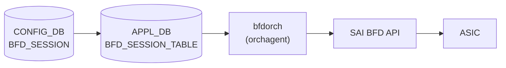

# APPL_DB BFD_SESSION_TABLE (bfdorch)

## 概要

APPL_DB `BFD_SESSION_TABLE` は `sonic-swss` の `bfdorch` が購読する BFD セッション設定テーブル[^1]。CONFIG_DB の [`BFD_SESSION`](bfd-session.md) テーブルの内容が `cfgmgrd` を経由して APPL_DB に書き込まれ、`bfdorch` が `SET` / `DEL` オペレーションを受けて SAI BFD セッションを作成・削除する。

`BGP_DEVICE_GLOBAL.STATE.use_software_bfd = true` の場合、bfdorch は SAI を経由せず STATE_DB の `SOFTWARE_BFD_SESSION_TABLE` にエントリを転記するのみで終了する (`bgpcfgd/BfdMgr` が FRR bfdd へ設定を注入)。

<!-- cdb-mermaid -->
### データフロー (自動生成)



!!! note "凡例"
    hardware BFD offload 経路 (`use_software_bfd = false`) の典型フロー。software BFD 経路では SAI を経由せず FRR bfdd へ直接注入される。
<!-- /cdb-mermaid -->

## key 構造

```text
BFD_SESSION_TABLE:<vrf>:<interface>:<peer_ip>
```

- `<vrf>`: VRF 名。デフォルト VRF は `"default"`
- `<interface>`: 出力インタフェース名。hardware lookup を使用する場合は `"default"`
- `<peer_ip>`: BFD ピアの IP アドレス (IPv4 / IPv6)

CONFIG_DB の `BFD_SESSION|<vrf>|<interface>|<peer_ip>` と同一構造 (区切り文字 `|` → `:` に変換)。

## フィールド

| フィールド | 型 | デフォルト | 説明 |
|-----------|----|-----------|------|
| `local_addr` | IP アドレス (string) | **必須** | BFD セッションのローカル送信元 IP アドレス |
| `type` | enum string | `"async_active"` | BFD セッション種別。`async_active` / `async_passive` / `demand_active` / `demand_passive` |
| `tx_interval` | uint32 (ms) | `1000` | 送信間隔 (ミリ秒)。SAI 投入時に ×1000 してマイクロ秒変換 |
| `rx_interval` | uint32 (ms) | `1000` | 最小受信間隔 (ミリ秒)。SAI 投入時に ×1000 してマイクロ秒変換 |
| `multiplier` | uint8 | `10` (hardware) / `3` (software) | 検知乗数 (detect multiplier) |
| `multihop` | boolean string | `"false"` | マルチホップ BFD を有効化 |
| `tos` | uint8 | `192` | IP TOS / DSCP 値。デフォルト DSCP 48 (EF) を 2 ビット左シフトして 192 (0xC0) |
| `dst_mac` | MAC アドレス (string) | 条件付き必須 | 宛先 MAC アドレス。`interface != "default"` の場合のみ有効・必須 |
| `shutdown_bfd_during_tsa` | boolean string | 未指定 = TSA 連動なし | `"true"` のとき TSA 状態で BFD セッションを削除し Down 通知 |

## 制約

- `local_addr` は必須。省略するとセッション作成をスキップし `ERROR` ログを出力する (`bfdorch.cpp:409-413`)
- `interface != "default"` かつ `dst_mac` 未指定 → セッション作成失敗
- `interface == "default"` かつ `dst_mac` 指定 → セッション作成失敗
- `vrf != "default"` かつ `interface != "default"` → `"vrf is not supported when hardware lookup not valid"` エラー
- 同一キーのセッションが既に存在する場合 → `"BFD session for %s already exists"` を SWSS_LOG_ERROR 出力して true を返す (no-op)

## use_software_bfd 切り替え動作

`BgpGlobalStateOrch::getSoftwareBfd()` が `true` を返す場合 (= BFD hardware offload が ASIC に未実装)、bfdorch は `doTask()` の SET ハンドラで SAI API を呼ばず STATE_DB `SOFTWARE_BFD_SESSION_TABLE` にエントリを書き込む。この場合、本テーブルの `tx_interval` / `multiplier` などのデフォルト値が適用される前に bfdorch がリターンするため、SAI 向けのデフォルト値は意味を持たない。

<!-- cdb-exceptions -->
## 例外条件・特殊挙動

| 条件 | 挙動 |
|------|------|
| `local_addr` 未指定 | `"Failed to create BFD session ... because source IP is not provided"` を SWSS_LOG_ERROR 出力してスキップ |
| `interface != "default"` かつ `dst_mac` 未指定 | `"destination MAC address required when hardware lookup not valid"` エラー |
| `interface == "default"` かつ `dst_mac` 指定 | `"destination MAC address not supported when hardware lookup valid"` エラー |
| `use_software_bfd == true` | SAI 未経由。bfdorch は STATE_DB `SOFTWARE_BFD_SESSION_TABLE` に転記するのみ |
| TSA 有効 + `shutdown_bfd_during_tsa == "true"` | セッション未作成 + Down 通知 (TSA 解除時に作成) |
| 同一キーのセッションが既に存在 | `"BFD session for %s already exists"` を SWSS_LOG_ERROR 出力して true を返す (no-op) |
| UDP 送信元ポート重複 | 最大 3 回リトライ (`NUM_BFD_SRCPORT_RETRIES = 3`、ポート範囲 49152–65535) |
<!-- /cdb-exceptions -->

<!-- ref-triangle:start -->

## 関連リファレンス

- CONFIG_DB: [`BFD_SESSION`](bfd-session.md) — CONFIG_DB 側のユーザー設定テーブル
- CONFIG_DB: [`BGP_DEVICE_GLOBAL`](bgp-device-global.md) — `use_software_bfd` / TSA フラグ
- STATE_DB: [`BFD_SESSION_TABLE`](bfd-state.md) — bfdorch が書き込むランタイム状態テーブル

<!-- ref-triangle:end -->

## 引用元

[^1]: `sonic-swss/orchagent/bfdorch.cpp` (L15-20 マクロ定義、L305-574 `create_bfd_session()`、L111-217 `doTask()`). <https://github.com/sonic-net/sonic-swss/blob/master/orchagent/bfdorch.cpp>

<!-- defaults -->
## フィールド暗黙デフォルト (Phase A — コード由来)

APPL_DB `BFD_SESSION_TABLE` に対応する YANG schema は存在しない。すべてのデフォルトは `bfdorch.cpp` の変数初期化またはマクロ定義から由来する。

| フィールド | コード由来デフォルト | fallback 源 | 備考 |
|-----------|-------------------|------------|------|
| `type` | `"async_active"` | `bfd_session_type = SAI_BFD_SESSION_TYPE_ASYNC_ACTIVE` — `bfdorch.cpp:340` | |
| `tx_interval` | `1000` ms | `#define BFD_SESSION_DEFAULT_TX_INTERVAL 1000` — `bfdorch.cpp:15` | SAI 投入時は ×1000 μs |
| `rx_interval` | `1000` ms | `#define BFD_SESSION_DEFAULT_RX_INTERVAL 1000` — `bfdorch.cpp:16` | SAI 投入時は ×1000 μs |
| `multiplier` | `10` (hardware) / `3` (software) | `#define BFD_SESSION_DEFAULT_DETECT_MULTIPLIER 10` — `bfdorch.cpp:17`; `MULTIPLIER = 3` — `managers_bfd.py:13` | `use_software_bfd` 経路で値が異なる |
| `tos` | `192` (DSCP 48) | `#define BFD_SESSION_DEFAULT_TOS 192` — `bfdorch.cpp:18-19` | DSCP 48 << 2 \| ECN 0 = 0xC0 |
| `multihop` | `false` | `bool multihop = false` — `bfdorch.cpp:347` | |
| `local_addr` | **必須 (省略不可)** | `src_ip_provided == false` → エラーログ + スキップ — `bfdorch.cpp:409-413` | YANG mandatory なし、コードレベル強制 |
| `dst_mac` | 条件付き必須 | `alias != "default"` のとき必須 — `bfdorch.cpp:491-495` | |
| `shutdown_bfd_during_tsa` | TSA 連動なし (未指定扱い) | `doTask()` の分岐 — `bfdorch.cpp:149-178` | |

### 補足

- `multiplier` のデフォルト値が hardware BFD (`bfdorch`: 10) と software BFD (`bgpcfgd/BfdMgr`: 3) で異なる。`BGP_DEVICE_GLOBAL.STATE.use_software_bfd` フラグで経路が切り替わる。
- `tx_interval` / `rx_interval` のデフォルトも経路で異なる: hardware=1000ms、bgpcfgd BfdMgr=200ms、static route BFD=50ms。
- APPL_DB `BFD_SESSION_TABLE` に対応する YANG schema (sonic-bfd.yang 等) は現時点 (2026-05) で sonic-buildimage の yang-models ディレクトリに存在しない。すべての制約はコードレベルで実施される。
<!-- /defaults -->
