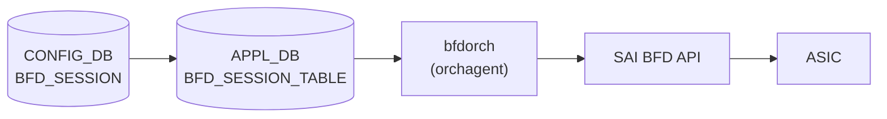

# APPL_DB BFD_SESSION_TABLE (bfdorch)

## 概要

APPL_DB `BFD_SESSION_TABLE` は `sonic-swss` の `bfdorch` が購読する BFD セッション設定テーブル[^1]。CONFIG_DB の [`BFD_SESSION`](bfd-session.md) テーブルの内容が `cfgmgrd` を経由して APPL_DB に書き込まれ、`bfdorch` が `SET` / `DEL` オペレーションを受けて SAI BFD セッションを作成・削除する。

`BGP_DEVICE_GLOBAL.STATE.use_software_bfd = true` の場合、bfdorch は SAI を経由せず STATE_DB の `SOFTWARE_BFD_SESSION_TABLE` にエントリを転記するのみで終了する (`bgpcfgd/BfdMgr` が FRR bfdd へ設定を注入)。

<!-- cdb-mermaid -->
### データフロー (自動生成)



!!! note "凡例"
    hardware BFD offload 経路 (`use_software_bfd = false`) の典型フロー。software BFD 経路では SAI を経由せず FRR bfdd へ直接注入される。
<!-- /cdb-mermaid -->

## key 構造

```text
BFD_SESSION_TABLE:<vrf>:<interface>:<peer_ip>
```

- `<vrf>`: VRF 名。デフォルト VRF は `"default"`
- `<interface>`: 出力インタフェース名。hardware lookup を使用する場合は `"default"`
- `<peer_ip>`: BFD ピアの IP アドレス (IPv4 / IPv6)

CONFIG_DB の `BFD_SESSION|<vrf>|<interface>|<peer_ip>` と同一構造 (区切り文字 `|` → `:` に変換)。

## フィールド

| フィールド | 型 | デフォルト | 説明 |
|-----------|----|-----------|------|
| `local_addr` | IP アドレス (string) | **必須** | BFD セッションのローカル送信元 IP アドレス |
| `type` | enum string | `"async_active"` | BFD セッション種別。`async_active` / `async_passive` / `demand_active` / `demand_passive` |
| `tx_interval` | uint32 (ms) | `1000` | 送信間隔 (ミリ秒)。SAI 投入時に ×1000 してマイクロ秒変換 |
| `rx_interval` | uint32 (ms) | `1000` | 最小受信間隔 (ミリ秒)。SAI 投入時に ×1000 してマイクロ秒変換 |
| `multiplier` | uint8 | `10` (hardware) / `3` (software) | 検知乗数 (detect multiplier) |
| `multihop` | boolean string | `"false"` | マルチホップ BFD を有効化 |
| `tos` | uint8 | `192` | IP TOS / DSCP 値。デフォルト DSCP 48 (EF) を 2 ビット左シフトして 192 (0xC0) |
| `dst_mac` | MAC アドレス (string) | 条件付き必須 | 宛先 MAC アドレス。`interface != "default"` の場合のみ有効・必須 |
| `shutdown_bfd_during_tsa` | boolean string | 未指定 = TSA 連動なし | `"true"` のとき TSA 状態で BFD セッションを削除し Down 通知 |

## 制約

- `local_addr` は必須。省略するとセッション作成をスキップし `ERROR` ログを出力する (`bfdorch.cpp:409-413`)
- `interface != "default"` かつ `dst_mac` 未指定 → セッション作成失敗
- `interface == "default"` かつ `dst_mac` 指定 → セッション作成失敗
- `vrf != "default"` かつ `interface != "default"` → `"vrf is not supported when hardware lookup not valid"` エラー
- 同一キーのセッションが既に存在する場合 → `"BFD session for %s already exists"` を SWSS_LOG_ERROR 出力して true を返す (no-op)

## use_software_bfd 切り替え動作

`BgpGlobalStateOrch::getSoftwareBfd()` が `true` を返す場合 (= BFD hardware offload が ASIC に未実装)、bfdorch は `doTask()` の SET ハンドラで SAI API を呼ばず STATE_DB `SOFTWARE_BFD_SESSION_TABLE` にエントリを書き込む。この場合、本テーブルの `tx_interval` / `multiplier` などのデフォルト値が適用される前に bfdorch がリターンするため、SAI 向けのデフォルト値は意味を持たない。

<!-- cdb-exceptions -->
## 例外条件・特殊挙動

| 条件 | 挙動 |
|------|------|
| `local_addr` 未指定 | `"Failed to create BFD session ... because source IP is not provided"` を SWSS_LOG_ERROR 出力してスキップ |
| `interface != "default"` かつ `dst_mac` 未指定 | `"destination MAC address required when hardware lookup not valid"` エラー |
| `interface == "default"` かつ `dst_mac` 指定 | `"destination MAC address not supported when hardware lookup valid"` エラー |
| `use_software_bfd == true` | SAI 未経由。bfdorch は STATE_DB `SOFTWARE_BFD_SESSION_TABLE` に転記するのみ |
| TSA 有効 + `shutdown_bfd_during_tsa == "true"` | セッション未作成 + Down 通知 (TSA 解除時に作成) |
| 同一キーのセッションが既に存在 | `"BFD session for %s already exists"` を SWSS_LOG_ERROR 出力して true を返す (no-op) |
| UDP 送信元ポート重複 | 最大 3 回リトライ (`NUM_BFD_SRCPORT_RETRIES = 3`、ポート範囲 49152–65535) |
<!-- /cdb-exceptions -->

<!-- ref-triangle:start -->

## 関連リファレンス

- CONFIG_DB: [`BFD_SESSION`](bfd-session.md) — CONFIG_DB 側のユーザー設定テーブル
- CONFIG_DB: [`BGP_DEVICE_GLOBAL`](bgp-device-global.md) — `use_software_bfd` / TSA フラグ
- STATE_DB: [`BFD_SESSION_TABLE`](bfd-state.md) — bfdorch が書き込むランタイム状態テーブル

<!-- ref-triangle:end -->

## 引用元

[^1]: `sonic-swss/orchagent/bfdorch.cpp` (L15-20 マクロ定義、L305-574 `create_bfd_session()`、L111-217 `doTask()`). <https://github.com/sonic-net/sonic-swss/blob/master/orchagent/bfdorch.cpp>

<!-- platform -->
## プラットフォーム差 (Phase H)

`bfdorch` は環境変数 `platform` / `sub_platform` を参照しない。プラットフォーム差はすべて **SAI capability 動的照会** (`sai_query_attribute_capability`) で決定される。経路選択は起動時 1 回のみ評価される。

### capability 照会と経路分岐

| 照会対象 SAI attribute | 判定関数 | true (実装あり) | false (未実装) | evidence |
|---|---|---|---|---|
| `SAI_SWITCH_ATTR_BFD_SESSION_STATE_CHANGE_NOTIFY` (`set_implemented`) | `BfdOrch::register_bfd_state_change_notification()` | state change 通知ハンドラ登録 → セッション作成可 | `"BFD register change notification not supported"` → セッション作成 reject | `bfdorch.cpp:270-303, 307-314` |
| `SAI_SWITCH_ATTR_SUPPORTED_IPV4_BFD_SESSION_OFFLOAD_TYPE` (`get_implemented`) | `BgpGlobalStateOrch::offload_supported()` | hardware BFD 経路 (`use_software_bfd=false`) | software BFD 経路 (`use_software_bfd=true`) | `bfdorch.cpp:755-791` |
| `SAI_SWITCH_ATTR_SUPPORTED_IPV6_BFD_SESSION_OFFLOAD_TYPE` (`get_implemented`) | 同上 (IPv6) | IPv6 offload 対応 | IPv6 は software 経路 | `bfdorch.cpp:761-768` |

### Hardware BFD vs Software BFD

| 項目 | Hardware BFD 経路 | Software BFD 経路 |
|---|---|---|
| 条件 | SAI が BFD offload を `SAI_BFD_SESSION_OFFLOAD_TYPE_NONE` 以外で返す | SAI が BFD offload 未実装、または `NONE` を返す |
| `use_software_bfd` | `false` | `true` |
| 実処理 | ASIC が hello/echo パケットを送受信 (SAI BFD API) | FRR `bfdd` (CPU) が `bgpcfgd/BfdMgr` 経由で処理 |
| bfdorch の動作 | SAI `create_bfd_session` 呼び出し + STATE_DB 更新 | STATE_DB `SOFTWARE_BFD_SESSION_TABLE` 転記のみ |
| multiplier default | 10 | 3 (FRR 側) |
| tx/rx interval default | 1000 ms | 200 ms (BfdMgr) / 50 ms (static route BFD) |
| 最小推奨 interval | ASIC 依存 (Broadcom 50ms / Mellanox 100ms 等) | CPU 負荷の観点で 50 ms 以上推奨 |
| evidence | `bfdorch.cpp:116-139, 415-543` | `bfdorch.cpp:133-139, 182-188` |

### ASIC ベンダー差サマリ (community SAI 実装の一般的傾向)

| ベンダー / ASIC 世代 | BFD offload | デフォルト経路 | 備考 |
|---|---|---|---|
| Broadcom XGS (Tomahawk2 / Trident2) | 未実装 | software | 旧世代 |
| Broadcom XGS (Tomahawk3+ / Trident3+) | 一部実装 | hardware | SKU・SDK 依存 |
| Broadcom DNX (Jericho2 / Q2A) | 実装 | hardware | DNX は概ね hardware BFD 対応 |
| Mellanox Spectrum / Spectrum-2 | 未実装 | software | 旧世代 |
| Mellanox Spectrum-3 / -4 | 実装 | hardware | 新世代で SAI BFD offload |
| Cisco Silicon One (Q200 系) | 実装 | hardware | 世代依存 |
| Marvell Prestera / Teralynx | 未実装 | software | community SAI 未対応 |
| Intel/Barefoot Tofino | 未実装 | software | P4 実装次第 |
| Nephos / Innovium (xsight) / Clounix | 未実装 | software | 同上 |
| Virtual Switch (vs) | 未実装 | software | テスト用、常に software 経路 |

!!! note "bfdorch.cpp に静的ベンダー分岐は存在しない"
    `aclorch` 等とは異なり、`bfdorch.cpp` に `BRCM_PLATFORM_SUBSTRING` / `MLNX_PLATFORM_SUBSTRING` 等のベンダー文字列分岐は **一切存在しない**。
    すべての分岐は SAI capability 動的照会で決定される。
    上記の「ベンダー差サマリ」は `libsai*` の community 実装慣行に基づく傾向であり、特定 SKU / SDK バージョンで例外がある。
    実機での経路判定は `BGP_DEVICE_GLOBAL|STATE.use_software_bfd` を STATE_DB で確認するのが確実。

!!! warning "capability 不在時の致命的挙動"
    `SAI_SWITCH_ATTR_BFD_SESSION_STATE_CHANGE_NOTIFY` を `set_implemented=false` で返す ASIC では、
    `register_bfd_state_change_notification()` が false を返し、
    `create_bfd_session()` が `"BFD session for %s cannot be created"` を SWSS_LOG_ERROR 出力して **セッション作成自体を reject** する。
    この場合、`BFD_SESSION` テーブルにエントリを投入しても hardware BFD は一切起動しない。
    また `use_software_bfd` の判定は **bfdorch 起動時 1 回のみ** であり、動的切替は swss コンテナの再起動が必要。
<!-- /platform -->

<!-- defaults -->
## フィールド暗黙デフォルト (Phase A — コード由来)

APPL_DB `BFD_SESSION_TABLE` に対応する YANG schema は存在しない。すべてのデフォルトは `bfdorch.cpp` の変数初期化またはマクロ定義から由来する。

| フィールド | コード由来デフォルト | fallback 源 | 備考 |
|-----------|-------------------|------------|------|
| `type` | `"async_active"` | `bfd_session_type = SAI_BFD_SESSION_TYPE_ASYNC_ACTIVE` — `bfdorch.cpp:340` | |
| `tx_interval` | `1000` ms | `#define BFD_SESSION_DEFAULT_TX_INTERVAL 1000` — `bfdorch.cpp:15` | SAI 投入時は ×1000 μs |
| `rx_interval` | `1000` ms | `#define BFD_SESSION_DEFAULT_RX_INTERVAL 1000` — `bfdorch.cpp:16` | SAI 投入時は ×1000 μs |
| `multiplier` | `10` (hardware) / `3` (software) | `#define BFD_SESSION_DEFAULT_DETECT_MULTIPLIER 10` — `bfdorch.cpp:17`; `MULTIPLIER = 3` — `managers_bfd.py:13` | `use_software_bfd` 経路で値が異なる |
| `tos` | `192` (DSCP 48) | `#define BFD_SESSION_DEFAULT_TOS 192` — `bfdorch.cpp:18-19` | DSCP 48 << 2 \| ECN 0 = 0xC0 |
| `multihop` | `false` | `bool multihop = false` — `bfdorch.cpp:347` | |
| `local_addr` | **必須 (省略不可)** | `src_ip_provided == false` → エラーログ + スキップ — `bfdorch.cpp:409-413` | YANG mandatory なし、コードレベル強制 |
| `dst_mac` | 条件付き必須 | `alias != "default"` のとき必須 — `bfdorch.cpp:491-495` | |
| `shutdown_bfd_during_tsa` | TSA 連動なし (未指定扱い) | `doTask()` の分岐 — `bfdorch.cpp:149-178` | |

### 補足

- `multiplier` のデフォルト値が hardware BFD (`bfdorch`: 10) と software BFD (`bgpcfgd/BfdMgr`: 3) で異なる。`BGP_DEVICE_GLOBAL.STATE.use_software_bfd` フラグで経路が切り替わる。
- `tx_interval` / `rx_interval` のデフォルトも経路で異なる: hardware=1000ms、bgpcfgd BfdMgr=200ms、static route BFD=50ms。
- APPL_DB `BFD_SESSION_TABLE` に対応する YANG schema (sonic-bfd.yang 等) は現時点 (2026-05) で sonic-buildimage の yang-models ディレクトリに存在しない。すべての制約はコードレベルで実施される。
<!-- /defaults -->

<!-- constants -->
## ハードコード定数 (Phase E)

### bfdorch.cpp マクロ定義 (L15-23)

| 定数 | 値 | 用途 | evidence |
|-----|-----|------|---------|
| `BFD_SESSION_DEFAULT_TX_INTERVAL` | `1000` ms | `tx_interval` 未指定時のデフォルト送信間隔。SAI 投入時に ×1000 μs 変換 | `bfdorch.cpp:15` |
| `BFD_SESSION_DEFAULT_RX_INTERVAL` | `1000` ms | `rx_interval` 未指定時のデフォルト最小受信間隔。SAI 投入時に ×1000 μs 変換 | `bfdorch.cpp:16` |
| `BFD_SESSION_DEFAULT_DETECT_MULTIPLIER` | `10` | `multiplier` 未指定時のデフォルト検知乗数 (hardware BFD 経路) | `bfdorch.cpp:17` |
| `BFD_SESSION_DEFAULT_TOS` | `192` (0xC0) | `tos` 未指定時のデフォルト IP TOS。DSCP 48 << 2 \| ECN 0 = 192 | `bfdorch.cpp:18-19` |
| `BFD_SESSION_MILLISECOND_TO_MICROSECOND` | `1000` | ms → μs 変換係数 (SAI `MIN_TX` / `MIN_RX` 属性投入用) | `bfdorch.cpp:20` |
| `BFD_SRCPORTINIT` | `49152` | UDP src port ローテーション開始値 (IANA ephemeral 範囲開始 = RFC 5881 §4 要求) | `bfdorch.cpp:21` |
| `BFD_SRCPORTMAX` | `65536` | UDP src port ローテーション上限値 (exclusive)。実値域は `49152–65535` | `bfdorch.cpp:22` |
| `NUM_BFD_SRCPORT_RETRIES` | `3` | SAI `create_bfd_session()` 失敗時の UDP src port 変更リトライ回数上限 | `bfdorch.cpp:23` |

### bfdorch.cpp 範囲・パラメータ制約

- **`tx_interval` / `rx_interval`**: 型は `uint32_t` (`bfdorch.cpp:343-344`)。明示的な範囲チェックなし (=0 や巨大値も SAI に流れる)。SAI 投入時に `×1000` するため、`UINT32_MAX / 1000 ≈ 4.29×10^6 ms` を超える値はマイクロ秒変換でオーバーフローする (実装側で未防御)。
- **`multiplier`**: 型は `uint8_t` (`bfdorch.cpp:345`)。`to_uint<uint8_t>()` パース。範囲 `0–255`。256 以上の文字列指定は `to_uint` が例外を投げる (`bfdorch.cpp:370`)。
- **`tos`**: 型は `uint8_t` (`bfdorch.cpp:346`)。範囲 `0–255` (= IP TOS フィールド 8bit 全域)。
- **UDP src port**: `bfd_src_port()` が `static uint32_t port = BFD_SRCPORTINIT` を保持し post-increment。`port >= BFD_SRCPORTMAX` で `BFD_SRCPORTINIT` にラップ。よって有効範囲は **49152–65535** (16384 個)。プロセス再起動で 49152 にリセット。<!-- evidence: bfdorch.cpp:647-655 -->

### SAI BFD 列挙マッピング (bfdorch.cpp L33-54)

`session_type_map` / `session_type_lookup` の双方向マッピング:

| `type` 文字列 | SAI 列挙 | デフォルト |
|--------------|----------|----------|
| `"demand_active"` | `SAI_BFD_SESSION_TYPE_DEMAND_ACTIVE` | - |
| `"demand_passive"` | `SAI_BFD_SESSION_TYPE_DEMAND_PASSIVE` | - |
| `"async_active"` | `SAI_BFD_SESSION_TYPE_ASYNC_ACTIVE` | **デフォルト** (`bfdorch.cpp:340`) |
| `"async_passive"` | `SAI_BFD_SESSION_TYPE_ASYNC_PASSIVE` | - |

STATE_DB 書込み時の `state` 文字列 (`session_state_lookup`):

| SAI 状態 | 文字列 |
|---------|--------|
| `SAI_BFD_SESSION_STATE_ADMIN_DOWN` | `"Admin_Down"` |
| `SAI_BFD_SESSION_STATE_DOWN` | `"Down"` (初期値) |
| `SAI_BFD_SESSION_STATE_INIT` | `"Init"` |
| `SAI_BFD_SESSION_STATE_UP` | `"Up"` |

セッション作成直後の初期 state は `SAI_BFD_SESSION_STATE_DOWN` = `"Down"`。<!-- evidence: bfdorch.cpp:544, 567, 571 -->

### その他の固定リテラル

| 項目 | 値 | 用途 | evidence |
|-----|-----|------|---------|
| `encapsulation_type` 初期値 | `SAI_BFD_ENCAPSULATION_TYPE_NONE` | エンキャプ固定 (現状他値の経路なし) | `bfdorch.cpp:341` |
| `multihop` 初期値 | `false` | `multihop` 未指定時 | `bfdorch.cpp:347` |
| ローカル discriminator 開始値 | `1` (`bfd_gen_id()`) | RFC 5880 §6.8.1 要求の非ゼロ一意値。プロセス再起動で 1 に戻る | `bfdorch.cpp:643-645` |
| Remote discriminator 初期値 | `0` | SAI `REMOTE_DISCRIMINATOR` 属性 (ピア発見前) | `bfdorch.cpp:430` |
| VRF/Interface 既定値 | `"default"` | hardware lookup 有効モード判定 | `bfdorch.cpp:471, 520-528` |

> **スキャン証跡**: `bfdorch.cpp` L1-60, L33-54, L340-475, L505-530, L580-655, L780-800 を読了。マクロ 8 件、SAI 列挙文字列マップ 4+4=8 件、初期値リテラル 5 件を抽出。中間ファイル: `meta/_intermediate/cdb-flow/bfd-orch-constants.md`
<!-- /constants -->
