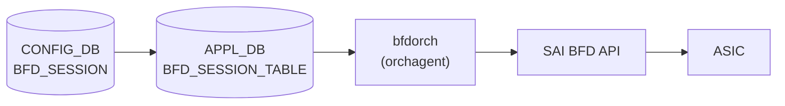

# BFD_SESSION テーブル

## 概要

BFD (Bidirectional Forwarding Detection) セッションのパラメータを [CONFIG_DB](../../reference/glossary.md#term-config_db) に保持するテーブル[^1]。`sonic-swss` の `bfdorch` が APPL_DB の `BFD_SESSION_TABLE` を購読し、SAI BFD セッションを作成・削除する。BGP 等のルーティングプロトコルが隣接ノードの生死を高速に検出するために使用する。

software BFD モード (`BGP_DEVICE_GLOBAL.STATE.use_software_bfd = true`) では bfdorch は STATE_DB の `SOFTWARE_BFD_SESSION_TABLE` に書き込むのみで SAI を経由しない。この場合は `bgpcfgd` の `BfdMgr` が STATE_DB を読み出して FRR の bfdd へ設定を注入する。

<!-- cdb-mermaid -->
### データフロー (自動生成)



!!! note "凡例"
    CONFIG_DB から SAI までの典型経路を示す。software BFD 経路では SAI を経由せず FRR bfdd へ直接注入される。
<!-- /cdb-mermaid -->

## key 構造

```text
BFD_SESSION|<vrf>|<interface>|<peer_ip>
```

- `<vrf>`: VRF 名。デフォルト VRF は `"default"`
- `<interface>`: 出力インタフェース名。hardware lookup を使用する場合は `"default"`
- `<peer_ip>`: BFD ピアの IP アドレス (IPv4 / IPv6)

## フィールド

| フィールド | 型 | デフォルト | 説明 |
|-----------|----|-----------|------|
| `local_addr` | IP アドレス (string) | **必須** | BFD セッションのローカル送信元 IP アドレス |
| `type` | enum | `"async_active"` | BFD セッション種別。`async_active` / `async_passive` / `demand_active` / `demand_passive` |
| `tx_interval` | uint32 (ms) | `1000` | 送信間隔 (ミリ秒)。SAI 投入時に ×1000 してマイクロ秒変換 |
| `rx_interval` | uint32 (ms) | `1000` | 最小受信間隔 (ミリ秒)。SAI 投入時に ×1000 してマイクロ秒変換 |
| `multiplier` | uint8 | `10` | 検知乗数 (detect multiplier)。`tx_interval × multiplier` で隣接ダウン判定 |
| `multihop` | boolean string | `"false"` | マルチホップ BFD を有効化。`"true"` のとき `SAI_BFD_SESSION_ATTR_MULTIHOP = true` をセット |
| `tos` | uint8 | `192` | IP TOS / DSCP 値。デフォルト DSCP 48 (EF) を 2 ビット左シフトして 192 (0xC0) |
| `dst_mac` | MAC アドレス (string) | 条件付き必須 | 宛先 MAC アドレス。`interface != "default"` の場合は必須、`interface == "default"` では指定禁止 |
| `shutdown_bfd_during_tsa` | boolean string | 未指定 = TSA 連動なし | `"true"` のとき TSA (Traffic Shift Away) 状態になると BFD セッションを削除し Down を通知 |

## 制約

- `local_addr` は必須。省略するとセッション作成をスキップし `ERROR` ログを出力する (YANG mandatory 宣言なし、コードレベル強制)
- `interface != "default"` かつ `dst_mac` 未指定 → セッション作成失敗
- `interface == "default"` かつ `dst_mac` 指定 → セッション作成失敗
- `vrf != "default"` かつ `interface != "default"` → `"vrf is not supported when hardware lookup not valid"` エラー

## 購読者

- `bfdorch` (`sonic-swss/orchagent/bfdorch.cpp`): APPL_DB `BFD_SESSION_TABLE` を購読して SAI BFD セッションを作成
- `BfdMgr` (`sonic-buildimage/src/sonic-bgpcfgd/bgpcfgd/managers_bfd.py`): software BFD モードで STATE_DB `SOFTWARE_BFD_SESSION_TABLE` を購読して FRR bfdd に vtysh コマンドを注入

## 関連 CONFIG_DB / CLI

- 関連 [CONFIG_DB](../../reference/glossary.md#term-config_db): [`BGP_DEVICE_GLOBAL`](bgp-device-global.md)
- 関連 CLI: `show bfd peers`, `show bfd peers <ip>`, `show bfd peers details`

<!-- cdb-exceptions -->
## 例外条件・特殊挙動

| 条件 | 挙動 |
|------|------|
| `local_addr` 未指定 | `"Failed to create BFD session ... because source IP is not provided"` を SWSS_LOG_ERROR 出力してスキップ |
| `interface != "default"` かつ `dst_mac` 未指定 | `"destination MAC address required when hardware lookup not valid"` エラー |
| `interface == "default"` かつ `dst_mac` 指定 | `"destination MAC address not supported when hardware lookup valid"` エラー |
| `use_software_bfd == true` | SAI 未経由。bfdorch は STATE_DB `SOFTWARE_BFD_SESSION_TABLE` に転記するのみ |
| TSA 有効 + `shutdown_bfd_during_tsa == "true"` | セッション未作成 + Down 通知 (TSA 解除時に作成) |
| 同一キーのセッションが既に存在 | `"BFD session for %s already exists"` を SWSS_LOG_ERROR 出力して true を返す (no-op) |
| UDP 送信元ポート重複 | 最大 3 回リトライ (`NUM_BFD_SRCPORT_RETRIES = 3`、ポート範囲 49152–65535) |
<!-- /cdb-exceptions -->

<!-- value-behavior -->
## 値依存挙動マトリクス

### `type` (enum)

| 値 | SAI 属性 | software BFD (FRR) | evidence |
|---|---|---|---|
| `async_active` (既定) | `SAI_BFD_SESSION_TYPE_ASYNC_ACTIVE` | `passive-mode = false` | `bfdorch.cpp:340,388; managers_bfd.py:107-108` |
| `async_passive` | `SAI_BFD_SESSION_TYPE_ASYNC_PASSIVE` | `passive-mode = true` | `bfdorch.cpp:388; managers_bfd.py:109-110` |
| `demand_active` | `SAI_BFD_SESSION_TYPE_DEMAND_ACTIVE` | `passive-mode = true` | `bfdorch.cpp:35` |
| `demand_passive` | `SAI_BFD_SESSION_TYPE_DEMAND_PASSIVE` | `passive-mode = true` | `bfdorch.cpp:36` |

### `tx_interval` / `rx_interval` (uint32, ms)

| 経路 | 既定値 | SAI 変換 | evidence |
|---|---|---|---|
| hardware BFD (bfdorch) | `1000` ms | `× 1000` → マイクロ秒 で SAI 投入 | `bfdorch.cpp:15-16, 451-458` |
| software BFD (bgpcfgd/BfdMgr) | `200` ms | FRR vtysh `transmit-interval` / `receive-interval` コマンドに ms 値をそのまま渡す | `managers_bfd.py:14-15, 146-148` |
| static route BFD (staticroutebfd) | `50` ms | APPL_DB `BFD_SESSION_TABLE` に `"tx_interval": "50"` として書き込み | `staticroutebfd/main.py:101` |

### `multiplier` (uint8)

| 経路 | 既定値 | evidence |
|---|---|---|
| hardware BFD (bfdorch) | `10` | `bfdorch.cpp:17, 345` |
| software BFD (bgpcfgd/BfdMgr) | `3` | `managers_bfd.py:13, 70` |

### `tos` (uint8)

| 値 | 意味 | evidence |
|---|---|---|
| `192` (既定) | DSCP 48 (EF class) << 2 \| ECN 0 = 0xC0 | `bfdorch.cpp:18-19` |
| 任意 uint8 | 上位 6 ビット = DSCP, 下位 2 ビット = ECN | `bfdorch.cpp:395-397` |

### `multihop` (boolean string)

| 値 | SAI | FRR | evidence |
|---|---|---|---|
| `"false"` (既定) | `SAI_BFD_SESSION_ATTR_MULTIHOP` 属性なし | `multihop` キーワードなし | `bfdorch.cpp:347, 470-479` |
| `"true"` | `SAI_BFD_SESSION_ATTR_MULTIHOP = true` + `minimum-ttl 1` | `multihop` キーワードを peer 設定に追加 | `bfdorch.cpp:472-475; managers_bfd.py:125-127, 151-152` |

### `shutdown_bfd_during_tsa` (boolean string)

| 値 | TSA 無効時 | TSA 有効時 | evidence |
|---|---|---|---|
| 未指定 / `"false"` (既定) | 通常 create_bfd_session() 実行 | TSA 状態に関係なくセッション維持 | `bfdorch.cpp:172-178` |
| `"true"` | キャッシュ登録 + create_bfd_session() 実行 | キャッシュ登録 + notify_session_state_down() のみ (SAI 作成なし) | `bfdorch.cpp:156-169` |
<!-- /value-behavior -->

<!-- ref-triangle:start -->

## 関連リファレンス

- CONFIG_DB: [`BGP_DEVICE_GLOBAL`](bgp-device-global.md)

<!-- ref-triangle:end -->

## 引用元

[^1]: `sonic-swss/orchagent/bfdorch.cpp` (L15-20 マクロ定義、L305-574 `create_bfd_session()`、L111-217 `doTask()`). <https://github.com/sonic-net/sonic-swss/blob/master/orchagent/bfdorch.cpp>

<!-- ops-hint -->
## 運用ヒント

### 典型値

- key 形式: `BFD_SESSION|default|default|<peer_ip>` (VRF default、interface default = hardware lookup 有効)
- 最小構成: `local_addr` + key の peer_ip のみ。`tx_interval=1000`, `rx_interval=1000`, `multiplier=10` がデフォルト適用される
- マルチホップ BFD: `multihop=true` + `interface=default` (interface 指定は VRF なし単一ホップのみ対応)

### よくある誤設定

- `local_addr` を省略するとセッション未作成 (エラーログのみ)
- `interface` を指定する場合は必ず `dst_mac` も指定する
- `interface != "default"` の場合は `vrf = "default"` のみ有効

### 確認コマンド

```bash
sonic-db-cli CONFIG_DB keys 'BFD_SESSION|*'
sonic-db-cli CONFIG_DB hgetall 'BFD_SESSION|default|default|10.0.0.1'
show bfd peers
show bfd peers 10.0.0.1
show bfd peers details
```
<!-- /ops-hint -->

<!-- defaults -->
## フィールド暗黙デフォルト (Phase A — コード由来)

YANG schema が存在しないため、すべてのデフォルトはコード (`bfdorch.cpp`) の変数初期化またはマクロ定義から由来する。

| フィールド | コード由来デフォルト | fallback 源 | 備考 |
|-----------|-------------------|------------|------|
| `type` | `"async_active"` | `bfd_session_type = SAI_BFD_SESSION_TYPE_ASYNC_ACTIVE` — `bfdorch.cpp:340` | |
| `tx_interval` | `1000` ms | `#define BFD_SESSION_DEFAULT_TX_INTERVAL 1000` — `bfdorch.cpp:15` | SAI 投入時は ×1000 μs |
| `rx_interval` | `1000` ms | `#define BFD_SESSION_DEFAULT_RX_INTERVAL 1000` — `bfdorch.cpp:16` | SAI 投入時は ×1000 μs |
| `multiplier` | `10` (hardware) / `3` (software) | `#define BFD_SESSION_DEFAULT_DETECT_MULTIPLIER 10` — `bfdorch.cpp:17`; `MULTIPLIER = 3` — `managers_bfd.py:13` | 経路で値が異なる |
| `tos` | `192` (DSCP 48) | `#define BFD_SESSION_DEFAULT_TOS 192` — `bfdorch.cpp:18-19` | |
| `multihop` | `false` | `bool multihop = false` — `bfdorch.cpp:347` | |
| `local_addr` | **必須 (省略不可)** | `src_ip_provided == false` → エラーログ + スキップ — `bfdorch.cpp:409-413` | YANG mandatory なし、コードレベル強制 |
| `dst_mac` | 条件付き必須 | `interface != "default"` のとき必須 — `bfdorch.cpp:491-495` | |
| `shutdown_bfd_during_tsa` | TSA 連動なし (未指定扱い) | `doTask()` の分岐 — `bfdorch.cpp:149-178` | |

### 補足

- `multiplier` のデフォルト値が hardware BFD (`bfdorch`: 10) と software BFD (`bgpcfgd/BfdMgr`: 3) で異なる。`use_software_bfd` フラグ (`BGP_DEVICE_GLOBAL.STATE.use_software_bfd`) で経路が切り替わる。
- `tx_interval` / `rx_interval` のデフォルトも経路で異なる: hardware=1000ms、bgpcfgd BfdMgr=200ms、static route BFD=50ms。
- BFD_SESSION テーブルに対応する YANG schema (sonic-bfd.yang 等) は現時点 (2026-05) で sonic-buildimage の yang-models ディレクトリに存在しない。すべての制約はコードレベルで実施される。
<!-- /defaults -->

<!-- ordering -->
## 書込み順依存 (Phase B — コード由来)

`bfdorch` (`sonic-swss/orchagent/bfdorch.cpp`) の `doTask()` / `create_bfd_session()` を精読して検出した順序依存・タイミング依存。詳細スキャンノート: [`meta/_intermediate/cdb-flow/bfd-session-ordering.md`](https://github.com/aoki-taquan/sonic-unofficial-docs/blob/main/meta/_intermediate/cdb-flow/bfd-session-ordering.md)。

| # | 依存関係 | 方向 | 緩和策 / 備考 |
|---|----------|------|--------------|
| 1 | `PORT|<interface>` 初期化完了 → BFD_SESSION SET (`interface != "default"`) | 強制先行 | `gPortsOrch->getPort()` 失敗時 `doTask` が `it++` で次イベントループ周回で**自動再試行**。`bfdorch.cpp:485-488, 173-177` |
| 2 | `VRF|<name>` SAI 作成完了 → BFD_SESSION SET (`vrf != "default"`) | 強制先行 | `VRFOrch::getVRFid()` が未登録時 `SAI_NULL_OBJECT_ID` を返し SAI create が失敗 → 次周回再試行。`bfdorch.cpp:530-541` |
| 3 | `BGP_DEVICE_GLOBAL.STATE.use_software_bfd` 確定 → BFD_SESSION SET | 推奨先行 | doTask は毎周回 `getSoftwareBfd()` を読む。途中で値が変わると hardware/software 経路を行き来し SAI セッションと STATE_DB エントリが二重に残る恐れあり。`bfdorch.cpp:114-138` |
| 4 | TSA 状態遷移 ⇄ BFD_SESSION SET (`shutdown_bfd_during_tsa=true`) | 自動調停 | `bfd_session_cache` に常にキャッシュされ、TSA 解除通知で replay。順序を意識する必要なし。`bfdorch.cpp:141-178, 220+` |
| 5 | SwitchOrch (`gSwitchId` / `gVirtualRouterId`) 先行 | 強制先行 | orchagent 起動順で自然満足 (BfdOrch は SwitchOrch より後段で生成)。`bfdorch.cpp:27, 533, 547` |
| 6 | `interface != "default"` と `vrf != "default"` の併用 | 排他（順序ではない） | `"vrf is not supported when hardware lookup not valid"` で永続スキップ (`return true`、再試行されない)。`bfdorch.cpp:498-503` |
| 7 | UDP 送信元ポート衝突時の自動 retry | 自動 | `NUM_BFD_SRCPORT_RETRIES = 3` で再選択 |

### 補足

- 依存 #1 / #2 は doTask が **false 返却 → `it++` で次イベントループ周回再試行**する設計のため、PORT / VRF が後追いで作成されても自動的に追従する。ただし orchagent ログには `Failed to locate port ...` が周回ごとに記録され続けるため、ログノイズを避けたい場合は PORT/VRF を先行投入することが望ましい。
- 依存 #3 は software ⇄ hardware の経路切替が運用中に発生する珍しいケース。通常は `BGP_DEVICE_GLOBAL` を最初に確定してから BFD_SESSION を投入する。
- レコード内整合性 (`local_addr` 必須、`interface` と `dst_mac` の併用条件) は順序ではないが、不整合な SET は永続スキップされる ([例外条件・特殊挙動](#例外条件特殊挙動) 参照)。
<!-- /ordering -->
