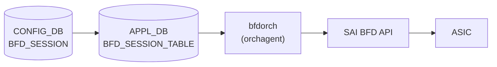

# BFD_SESSION テーブル

## 概要

[BFD](../../reference/glossary.md#term-bfd) (Bidirectional Forwarding Detection) セッションのパラメータを [CONFIG_DB](../../reference/glossary.md#term-config_db) に保持するテーブル[^1]。`sonic-swss` の `bfdorch` が [APPL_DB](../../reference/glossary.md#term-appl_db) の `BFD_SESSION_TABLE` を購読し、[SAI](../../reference/glossary.md#term-sai) [BFD](../../reference/glossary.md#term-bfd) セッションを作成・削除する。[BGP](../../reference/glossary.md#term-bgp) 等のルーティングプロトコルが隣接ノードの生死を高速に検出するために使用する。

software [BFD](../../reference/glossary.md#term-bfd) モード (`BGP_DEVICE_GLOBAL.STATE.use_software_bfd = true`) では bfdorch は [STATE_DB](../../reference/glossary.md#term-state_db) の `SOFTWARE_BFD_SESSION_TABLE` に書き込むのみで [SAI](../../reference/glossary.md#term-sai) を経由しない。この場合は `bgpcfgd` の `BfdMgr` が [STATE_DB](../../reference/glossary.md#term-state_db) を読み出して [FRR](../../reference/glossary.md#term-frr) の bfdd へ設定を注入する。

<!-- cdb-mermaid -->
### データフロー (自動生成)



!!! note "凡例"
    CONFIG_DB から SAI までの典型経路を示す。software BFD 経路では SAI を経由せず FRR bfdd へ直接注入される。
<!-- /cdb-mermaid -->

## key 構造

```text
BFD_SESSION|<vrf>|<interface>|<peer_ip>
```

- `<vrf>`: [VRF](../../reference/glossary.md#term-vrf) 名。デフォルト [VRF](../../reference/glossary.md#term-vrf) は `"default"`
- `<interface>`: 出力インタフェース名。hardware lookup を使用する場合は `"default"`
- `<peer_ip>`: BFD ピアの IP アドレス (IPv4 / IPv6)

## フィールド

| フィールド | 型 | デフォルト | 説明 |
|-----------|----|-----------|------|
| `local_addr` | IP アドレス (string) | **必須** | BFD セッションのローカル送信元 IP アドレス |
| `type` | enum | `"async_active"` | BFD セッション種別。`async_active` / `async_passive` / `demand_active` / `demand_passive` |
| `tx_interval` | uint32 (ms) | `1000` | 送信間隔 (ミリ秒)。[SAI](../../reference/glossary.md#term-sai) 投入時に ×1000 してマイクロ秒変換 |
| `rx_interval` | uint32 (ms) | `1000` | 最小受信間隔 (ミリ秒)。SAI 投入時に ×1000 してマイクロ秒変換 |
| `multiplier` | uint8 | `10` | 検知乗数 (detect multiplier)。`tx_interval × multiplier` で隣接ダウン判定 |
| `multihop` | boolean string | `"false"` | マルチホップ BFD を有効化。`"true"` のとき `SAI_BFD_SESSION_ATTR_MULTIHOP = true` をセット |
| `tos` | uint8 | `192` | IP TOS / [DSCP](../../reference/glossary.md#term-dscp) 値。デフォルト [DSCP](../../reference/glossary.md#term-dscp) 48 (EF) を 2 ビット左シフトして 192 (0xC0) |
| `dst_mac` | MAC アドレス (string) | 条件付き必須 | 宛先 MAC アドレス。`interface != "default"` の場合は必須、`interface == "default"` では指定禁止 |
| `shutdown_bfd_during_tsa` | boolean string | 未指定 = TSA 連動なし | `"true"` のとき TSA (Traffic Shift Away) 状態になると BFD セッションを削除し Down を通知 |

## 制約

- `local_addr` は必須。省略するとセッション作成をスキップし `ERROR` ログを出力する ([YANG](../../reference/glossary.md#term-yang) mandatory 宣言なし、コードレベル強制)
- `interface != "default"` かつ `dst_mac` 未指定 → セッション作成失敗
- `interface == "default"` かつ `dst_mac` 指定 → セッション作成失敗
- `vrf != "default"` かつ `interface != "default"` → `"vrf is not supported when hardware lookup not valid"` エラー

## 購読者

- `bfdorch` (`sonic-swss/orchagent/bfdorch.cpp`): [APPL_DB](../../reference/glossary.md#term-appl_db) `BFD_SESSION_TABLE` を購読して SAI BFD セッションを作成
- `BfdMgr` (`sonic-buildimage/src/sonic-bgpcfgd/bgpcfgd/managers_bfd.py`): software BFD モードで [STATE_DB](../../reference/glossary.md#term-state_db) `SOFTWARE_BFD_SESSION_TABLE` を購読して [FRR](../../reference/glossary.md#term-frr) bfdd に [vtysh](../../reference/glossary.md#term-vtysh) コマンドを注入

## 関連 CONFIG_DB / CLI

- 関連 [CONFIG_DB](../../reference/glossary.md#term-config_db): [`BGP_DEVICE_GLOBAL`](bgp-device-global.md)
- 関連 CLI: `show bfd peers`, `show bfd peers <ip>`, `show bfd peers details`

<!-- cdb-exceptions -->
## 例外条件・特殊挙動

| 条件 | 挙動 |
|------|------|
| `local_addr` 未指定 | `"Failed to create BFD session ... because source IP is not provided"` を SWSS_LOG_ERROR 出力してスキップ |
| `interface != "default"` かつ `dst_mac` 未指定 | `"destination MAC address required when hardware lookup not valid"` エラー |
| `interface == "default"` かつ `dst_mac` 指定 | `"destination MAC address not supported when hardware lookup valid"` エラー |
| `use_software_bfd == true` | SAI 未経由。bfdorch は STATE_DB `SOFTWARE_BFD_SESSION_TABLE` に転記するのみ |
| TSA 有効 + `shutdown_bfd_during_tsa == "true"` | セッション未作成 + Down 通知 (TSA 解除時に作成) |
| 同一キーのセッションが既に存在 | `"BFD session for %s already exists"` を SWSS_LOG_ERROR 出力して true を返す (no-op) |
| UDP 送信元ポート重複 | 最大 3 回リトライ (`NUM_BFD_SRCPORT_RETRIES = 3`、ポート範囲 49152–65535) |
<!-- /cdb-exceptions -->

<!-- value-behavior -->
## 値依存挙動マトリクス

### `type` (enum)

| 値 | SAI 属性 | software BFD ([FRR](../../reference/glossary.md#term-frr)) | evidence |
|---|---|---|---|
| `async_active` (既定) | `SAI_BFD_SESSION_TYPE_ASYNC_ACTIVE` | `passive-mode = false` | `bfdorch.cpp:340,388; managers_bfd.py:107-108` |
| `async_passive` | `SAI_BFD_SESSION_TYPE_ASYNC_PASSIVE` | `passive-mode = true` | `bfdorch.cpp:388; managers_bfd.py:109-110` |
| `demand_active` | `SAI_BFD_SESSION_TYPE_DEMAND_ACTIVE` | `passive-mode = true` | `bfdorch.cpp:35` |
| `demand_passive` | `SAI_BFD_SESSION_TYPE_DEMAND_PASSIVE` | `passive-mode = true` | `bfdorch.cpp:36` |

### `tx_interval` / `rx_interval` (uint32, ms)

| 経路 | 既定値 | SAI 変換 | evidence |
|---|---|---|---|
| hardware BFD (bfdorch) | `1000` ms | `× 1000` → マイクロ秒 で SAI 投入 | `bfdorch.cpp:15-16, 451-458` |
| software BFD ([bgpcfgd](../../reference/glossary.md#term-bgpcfgd)/BfdMgr) | `200` ms | FRR [vtysh](../../reference/glossary.md#term-vtysh) `transmit-interval` / `receive-interval` コマンドに ms 値をそのまま渡す | `managers_bfd.py:14-15, 146-148` |
| static route BFD (staticroutebfd) | `50` ms | [APPL_DB](../../reference/glossary.md#term-appl_db) `BFD_SESSION_TABLE` に `"tx_interval": "50"` として書き込み | `staticroutebfd/main.py:101` |

### `multiplier` (uint8)

| 経路 | 既定値 | evidence |
|---|---|---|
| hardware BFD (bfdorch) | `10` | `bfdorch.cpp:17, 345` |
| software BFD ([bgpcfgd](../../reference/glossary.md#term-bgpcfgd)/BfdMgr) | `3` | `managers_bfd.py:13, 70` |

### `tos` (uint8)

| 値 | 意味 | evidence |
|---|---|---|
| `192` (既定) | [DSCP](../../reference/glossary.md#term-dscp) 48 (EF class) << 2 \| ECN 0 = 0xC0 | `bfdorch.cpp:18-19` |
| 任意 uint8 | 上位 6 ビット = DSCP, 下位 2 ビット = ECN | `bfdorch.cpp:395-397` |

### `multihop` (boolean string)

| 値 | SAI | FRR | evidence |
|---|---|---|---|
| `"false"` (既定) | `SAI_BFD_SESSION_ATTR_MULTIHOP` 属性なし | `multihop` キーワードなし | `bfdorch.cpp:347, 470-479` |
| `"true"` | `SAI_BFD_SESSION_ATTR_MULTIHOP = true` + `minimum-ttl 1` | `multihop` キーワードを peer 設定に追加 | `bfdorch.cpp:472-475; managers_bfd.py:125-127, 151-152` |

### `shutdown_bfd_during_tsa` (boolean string)

| 値 | TSA 無効時 | TSA 有効時 | evidence |
|---|---|---|---|
| 未指定 / `"false"` (既定) | 通常 create_bfd_session() 実行 | TSA 状態に関係なくセッション維持 | `bfdorch.cpp:172-178` |
| `"true"` | キャッシュ登録 + create_bfd_session() 実行 | キャッシュ登録 + notify_session_state_down() のみ (SAI 作成なし) | `bfdorch.cpp:156-169` |
<!-- /value-behavior -->

<!-- pubsub -->
## 通信メカニズム (Phase G)

`BfdOrch` は [CONFIG_DB](../../reference/glossary.md#term-config_db) の `BFD_SESSION` を **直接購読しない**。`orchdaemon.cpp:243` で APPL_DB + `APP_BFD_SESSION_TABLE_NAME = "BFD_SESSION_TABLE"` を渡して生成されるため、`Orch::addConsumer()` の DB 種別分岐で **`ConsumerStateTable`** (channel ベースの Producer/Consumer 方式) が選ばれる。CONFIG_DB → APPL_DB の橋渡しは別コンポーネント (`bgpcfgd`、`staticroutebfd`、`DashHaOrch` 等) が担う。さらに `BfdOrch` は **2 つ目の Executor** として [ASIC_DB](../../reference/glossary.md#term-asic_db) 上の `NotificationConsumer` (channel `NOTIFICATIONS`、op `bfd_session_state_change`) を持ち、SAI からの state 通知を受ける。詳細スキャンノート: [`meta/_intermediate/cdb-flow/bfd-session-pubsub.md`](https://github.com/aoki-taquan/sonic-unofficial-docs/blob/main/meta/_intermediate/cdb-flow/bfd-session-pubsub.md)。

| 項目 | 値 |
|------|-----|
| 購読クラス (設定経路) | `ConsumerStateTable` (APPL_DB / `Orch::addConsumer` の `else` 分岐) |
| 購読対象 | `BFD_SESSION_TABLE` (APPL_DB)、key 区切り `:` |
| channel | `BFD_SESSION_TABLE_CHANNEL` ([ProducerStateTable](../../reference/glossary.md#term-producerstatetable) / [ConsumerStateTable](../../reference/glossary.md#term-consumerstatetable) が暗黙生成) |
| POP_BATCH_SIZE | `gBatchSize` ([orchagent](../../reference/glossary.md#term-orchagent) グローバル、既定 128。CLI `--batchsize` で上書き可) |
| 優先度 (`pri`) | 0 (`Orch::Orch(db, tableName)` の `default_orch_pri`) |
| 起動時スナップショット | LIST 上の未処理エントリのみ。[Redis](../../reference/glossary.md#term-redis) 既存キーの `HGETALL` 再配信なし (cold-start は ctor で STATE_DB を `del`) |
| TTL | 未設定 (APPL_DB / STATE_DB ともに永続) |
| ディスパッチ | `Consumer::execute()` → `BfdOrch::doTask(Consumer&)` (`bfdorch.cpp:111-217`)、`use_software_bfd` で hardware/software 経路分岐 |
| 2nd Executor (state 通知) | `NotificationConsumer` on [ASIC_DB](../../reference/glossary.md#term-asic_db) channel `NOTIFICATIONS`、op `"bfd_session_state_change"` → `doTask(NotificationConsumer&)` → STATE_DB `BFD_SESSION_TABLE.state` 更新 |
| 失敗時挙動 | `create_bfd_session()` false → `it++` で次イベントループ周回で**自動再試行** |

注意: APPL_DB `BFD_SESSION_TABLE` を直接書き込むのが hardware 経路への正規ルート。CONFIG_DB `BFD_SESSION` を `sonic-db-cli` で直書きしても `BfdOrch` には届かない (`sonic-cfggen` 等の橋渡しが必要)。

<!-- evidence: sonic-net/sonic-swss/orchagent/orchdaemon.cpp:243L (gBfdOrch = new BfdOrch(m_applDb, APP_BFD_SESSION_TABLE_NAME, ...)) -->
<!-- evidence: sonic-net/sonic-swss/orchagent/bfdorch.cpp:58L (BfdOrch::BfdOrch — Orch(db, tableName) 継承) -->
<!-- evidence: sonic-net/sonic-swss/orchagent/bfdorch.cpp:63L (NotificationConsumer on ASIC_DB NOTIFICATIONS channel) -->
<!-- evidence: sonic-net/sonic-swss/orchagent/bfdorch.cpp:111L (BfdOrch::doTask(Consumer&)) -->
<!-- evidence: sonic-net/sonic-swss/orchagent/orch.cpp:1186L (Orch::addConsumer DB 種別分岐 → APPL_DB は ConsumerStateTable) -->
<!-- evidence: sonic-net/sonic-swss-common/common/schema.h:120L (APP_BFD_SESSION_TABLE_NAME = "BFD_SESSION_TABLE") -->
<!-- /pubsub -->

<!-- ref-triangle:start -->

## 関連リファレンス

- CONFIG_DB: [`BGP_DEVICE_GLOBAL`](bgp-device-global.md)

<!-- ref-triangle:end -->

## 引用元

[^1]: `sonic-swss/orchagent/bfdorch.cpp` (L15-20 マクロ定義、L305-574 `create_bfd_session()`、L111-217 `doTask()`). <https://github.com/sonic-net/sonic-swss/blob/master/orchagent/bfdorch.cpp>

<!-- ops-hint -->
## 運用ヒント

### 典型値

- key 形式: `BFD_SESSION|default|default|<peer_ip>` ([VRF](../../reference/glossary.md#term-vrf) default、interface default = hardware lookup 有効)
- 最小構成: `local_addr` + key の peer_ip のみ。`tx_interval=1000`, `rx_interval=1000`, `multiplier=10` がデフォルト適用される
- マルチホップ BFD: `multihop=true` + `interface=default` (interface 指定は VRF なし単一ホップのみ対応)

### よくある誤設定

- `local_addr` を省略するとセッション未作成 (エラーログのみ)
- `interface` を指定する場合は必ず `dst_mac` も指定する
- `interface != "default"` の場合は `vrf = "default"` のみ有効

### 確認コマンド

```bash
sonic-db-cli CONFIG_DB keys 'BFD_SESSION|*'
sonic-db-cli CONFIG_DB hgetall 'BFD_SESSION|default|default|10.0.0.1'
show bfd peers
show bfd peers 10.0.0.1
show bfd peers details
```
<!-- /ops-hint -->

<!-- cross-refs -->
## 暗黙参照 — `bfdorch` が他テーブル由来の状態を直接参照する経路 (Phase C)

`BFD_SESSION` は [YANG](../../reference/glossary.md#term-yang) schema を持たず leafref / subscribe 経由の明示参照を宣言しない。しかし `bfdorch` (`sonic-swss/orchagent/bfdorch.cpp`) は SAI 投入時に **他 CONFIG_DB テーブル由来の [orchagent](../../reference/glossary.md#term-orchagent) 内オブジェクト** を直接参照しており、暗黙的な前提依存が発生する。本ブロックではコード経路ベースで観測される暗黙参照をまとめる。

### CONFIG_DB レベル — bfdorch が参照する他テーブル

| 参照先テーブル | 参照タイミング | 用途 | 方向 | evidence |
|---|---|---|---|---|
| [`PORT`](port.md) (`PORT|<alias>`) | `create_bfd_session()` で `interface != "default"` のとき | `gPortsOrch->getPort(alias, port)` で `Port::m_port_id` / `Port::m_mac` を取得し SAI `BFD_SESSION_ATTR_PORT` / `SRC_MAC_ADDRESS` に投入 | 入力依存 | `bfdorch.cpp:482-515` |
| [`VRF`](vrf.md) (`VRF|<name>`) | `create_bfd_session()` で `vrf != "default"` かつ `interface == "default"` のとき | `VRFOrch::getVRFid(vrf_name)` で SAI virtual_router OID を取得し `BFD_SESSION_ATTR_VIRTUAL_ROUTER` に投入 | 入力依存 | `bfdorch.cpp:530-541` |
| [`BGP_DEVICE_GLOBAL`](bgp-device-global.md) (`STATE.use_software_bfd` / `STATE.tsa_enabled`) | `doTask()` 毎周回 + TSA state change 通知時 | `BgpGlobalStateOrch::getSoftwareBfd()` / `getTsaState()` で hardware/software 経路 と TSA shutdown 挙動を決定 | 制御依存 | `bfdorch.cpp:114-138, 683-748` |
| `STATIC_ROUTE` (`STATIC_ROUTE|<vrf>|<prefix>`) | `staticroutebfd` プロセス (別プロセス) が CONFIG_DB を subscribe し、BFD 監視対象の next-hop に対応する BFD セッションを APPL_DB `BFD_SESSION_TABLE` に push する | static route の BFD 監視は `staticroutebfd` 経由で **逆方向に `BFD_SESSION_TABLE` を生成** する (`tx/rx_interval=50ms` 既定上書き) | **逆方向** (STATIC_ROUTE → BFD_SESSION) | `staticroutebfd/main.py:23-24, 118-120, 283-288, 366-559, 720-730` |

> 上記は `bfdorch` が CONFIG_DB を直接 subscribe するわけではない点に注意。`PORT` / `VRF` は [orchagent](../../reference/glossary.md#term-orchagent) 内 in-memory state (`gPortsOrch` / `VRFOrch`) 経由、`BGP_DEVICE_GLOBAL` は `BgpGlobalStateOrch` 経由で参照される。順序依存は 書込み順依存 (Phase B) を参照。

### STATE_DB / APPL_DB レベル — 経路別の中継

| 参照先 | 役割 | 経路 | evidence |
|---|---|---|---|
| `STATE_DB.SOFTWARE_BFD_SESSION_TABLE` | `use_software_bfd=true` 時の中継。`bfdorch` が CONFIG_DB から転記し、`bgpcfgd/BfdMgr` が subscribe して FRR `bfdd` に [vtysh](../../reference/glossary.md#term-vtysh) 経由で投入 | `bfdorch` (write) → `BfdMgr` (read/subscribe) | `bfdorch.cpp:114-138` / `managers_bfd.py` |
| `APPL_DB.BFD_SESSION_TABLE` | hardware BFD の SAI 投入直前段。`staticroutebfd` も [ProducerStateTable](../../reference/glossary.md#term-producerstatetable) で直接書き込む | `staticroutebfd` (producer) → `bfdorch` (consumer) | `staticroutebfd/main.py:118-120` |
| `STATE_DB.BFD_SESSION_TABLE` | hardware BFD の状態通知 (`UP` / `DOWN`)。SAI notification handler が更新 | `bfdorch` (write) → `staticroutebfd.bfd_state_set_handler` (read/subscribe) | `bfdorch.cpp:274-302` / `staticroutebfd/main.py:296-300, 641-710` |

### 範囲外 (誤解されやすい隣接テーブル)

- **`INTERFACE` / `PORTCHANNEL_INTERFACE` / `LOOPBACK_INTERFACE`**: `bfdorch.cpp` は `local_addr` の所属インタフェースを検証しない。妥当性確認は SAI 実装側に委ねる。`staticroutebfd` はこれらを subscribe するが、`bfdorch` 自身は読まない (`staticroutebfd/main.py:718-730`)
- **`ROUTE_TABLE` / 通常の `STATIC_ROUTE` 経路**: `bfdorch` が ROUTE を直接読むことはない。`STATIC_ROUTE` は `staticroutebfd` を経由する**間接的な書込み源**であり、APPL_DB に到達した時点で他の BFD セッションと区別はない
- **`BGP_NEIGHBOR` / `BGP_PEER_RANGE`**: [BGP](../../reference/glossary.md#term-bgp) セッションで BFD を有効化する設定はこちらにあるが、`BFD_SESSION` テーブルへの投入は `bgpcfgd` / FRR が担当し `bfdorch` のスコープ外
- **`DEVICE_METADATA` / `SWITCH`**: `gSwitchId` / `gVirtualRouterId` は SwitchOrch 起動時に確定済みのグローバル変数として参照される (`bfdorch.cpp:27, 533`)。`bfdorch` が `DEVICE_METADATA` を直接読むことはない

詳細スキャン手順と grep 結果は `meta/_intermediate/cdb-flow/bfd-session-cross-refs.md` を参照。
<!-- /cross-refs -->

<!-- defaults -->
## フィールド暗黙デフォルト (Phase A — コード由来)

[YANG](../../reference/glossary.md#term-yang) schema が存在しないため、すべてのデフォルトはコード (`bfdorch.cpp`) の変数初期化またはマクロ定義から由来する。

| フィールド | コード由来デフォルト | fallback 源 | 備考 |
|-----------|-------------------|------------|------|
| `type` | `"async_active"` | `bfd_session_type = SAI_BFD_SESSION_TYPE_ASYNC_ACTIVE` — `bfdorch.cpp:340` | |
| `tx_interval` | `1000` ms | `#define BFD_SESSION_DEFAULT_TX_INTERVAL 1000` — `bfdorch.cpp:15` | SAI 投入時は ×1000 μs |
| `rx_interval` | `1000` ms | `#define BFD_SESSION_DEFAULT_RX_INTERVAL 1000` — `bfdorch.cpp:16` | SAI 投入時は ×1000 μs |
| `multiplier` | `10` (hardware) / `3` (software) | `#define BFD_SESSION_DEFAULT_DETECT_MULTIPLIER 10` — `bfdorch.cpp:17`; `MULTIPLIER = 3` — `managers_bfd.py:13` | 経路で値が異なる |
| `tos` | `192` (DSCP 48) | `#define BFD_SESSION_DEFAULT_TOS 192` — `bfdorch.cpp:18-19` | |
| `multihop` | `false` | `bool multihop = false` — `bfdorch.cpp:347` | |
| `local_addr` | **必須 (省略不可)** | `src_ip_provided == false` → エラーログ + スキップ — `bfdorch.cpp:409-413` | YANG mandatory なし、コードレベル強制 |
| `dst_mac` | 条件付き必須 | `interface != "default"` のとき必須 — `bfdorch.cpp:491-495` | |
| `shutdown_bfd_during_tsa` | TSA 連動なし (未指定扱い) | `doTask()` の分岐 — `bfdorch.cpp:149-178` | |

### 補足

- `multiplier` のデフォルト値が hardware BFD (`bfdorch`: 10) と software BFD (`bgpcfgd/BfdMgr`: 3) で異なる。`use_software_bfd` フラグ (`BGP_DEVICE_GLOBAL.STATE.use_software_bfd`) で経路が切り替わる。
- `tx_interval` / `rx_interval` のデフォルトも経路で異なる: hardware=1000ms、[bgpcfgd](../../reference/glossary.md#term-bgpcfgd) BfdMgr=200ms、static route BFD=50ms。
- BFD_SESSION テーブルに対応する YANG schema (sonic-bfd.yang 等) は現時点 (2026-05) で [sonic-buildimage](../../reference/glossary.md#term-sonic-buildimage) の yang-models ディレクトリに存在しない。すべての制約はコードレベルで実施される。
<!-- /defaults -->

<!-- constants -->
## ハードコード定数 (Phase E — コード由来)

`bfdorch` (`sonic-swss/orchagent/bfdorch.cpp`) の `#define` マクロおよび `const` マップから抽出した、BFD_SESSION 処理に直接影響する定数群。詳細スキャンノート: [`meta/_intermediate/cdb-flow/bfd-session-constants.md`](https://github.com/aoki-taquan/sonic-unofficial-docs/blob/main/meta/_intermediate/cdb-flow/bfd-session-constants.md)。

### `#define` マクロ定数

| 定数名 | 値 | 単位 | 用途 | ソース |
|--------|----|------|------|--------|
| `BFD_SESSION_DEFAULT_TX_INTERVAL` | `1000` | ms | `tx_interval` 未指定時のデフォルト送信間隔 | `bfdorch.cpp:15` |
| `BFD_SESSION_DEFAULT_RX_INTERVAL` | `1000` | ms | `rx_interval` 未指定時のデフォルト最小受信間隔 | `bfdorch.cpp:16` |
| `BFD_SESSION_DEFAULT_DETECT_MULTIPLIER` | `10` | — | `multiplier` 未指定時のデフォルト検知乗数 (hardware 経路) | `bfdorch.cpp:17` |
| `BFD_SESSION_DEFAULT_TOS` | `192` (0xC0) | — | `tos` 未指定時のデフォルト。DSCP 48 (EF) << 2 \| ECN 0 | `bfdorch.cpp:19` |
| `BFD_SESSION_MILLISECOND_TO_MICROSECOND` | `1000` | — | ms → μs 変換係数。SAI `MIN_TX` / `MIN_RX` 投入時に乗算 | `bfdorch.cpp:20, 452, 457` |
| `BFD_SRCPORTINIT` | `49152` | — | BFD UDP 送信元ポート範囲下限 (IANA dynamic/ephemeral 開始) | `bfdorch.cpp:21` |
| `BFD_SRCPORTMAX` | `65536` | — | BFD UDP 送信元ポート範囲上限 (排他。実効最大値は `65535`) | `bfdorch.cpp:22` |
| `NUM_BFD_SRCPORT_RETRIES` | `3` | — | UDP 送信元ポート衝突時の自動 retry 回数 | `bfdorch.cpp:23, 596` |

### 文字列マップ (CONFIG_DB ⇄ SAI enum)

`session_type_map` (`bfdorch.cpp:33-39`) と `session_type_lookup` (`bfdorch.cpp:41-47`) は双方向の固定マップ。CONFIG_DB の `type` フィールドが受理する文字列は以下の 4 つに限定される (それ以外は parse エラー)。

| 文字列 (`type`) | SAI enum |
|-----------------|----------|
| `demand_active` | `SAI_BFD_SESSION_TYPE_DEMAND_ACTIVE` |
| `demand_passive` | `SAI_BFD_SESSION_TYPE_DEMAND_PASSIVE` |
| `async_active` (既定) | `SAI_BFD_SESSION_TYPE_ASYNC_ACTIVE` |
| `async_passive` | `SAI_BFD_SESSION_TYPE_ASYNC_PASSIVE` |

STATE_DB へ書き戻される `state` 値も固定 (`session_state_lookup`, `bfdorch.cpp:49-55`): `Admin_Down` / `Down` (初期値) / `Init` / `Up`。

### `create_bfd_session()` 内のリテラル既定値

| 項目 | 値 | 補足 |
|------|----|------|
| `encapsulation_type` | `SAI_BFD_ENCAPSULATION_TYPE_NONE` | 常に NONE 固定。CONFIG_DB から変更不可 (`bfdorch.cpp:341`) |
| `SAI_BFD_SESSION_ATTR_REMOTE_DISCRIMINATOR` | `0` | 常に 0 投入。peer 検出後に SAI 内部で更新 (`bfdorch.cpp:431`) |
| `SAI_BFD_SESSION_ATTR_IPHDR_VERSION` | `4` / `6` | `src_ip.isV4()` で決定 (`bfdorch.cpp:439`) |
| `SAI_BFD_SESSION_ATTR_HW_LOOKUP_VALID` | `false` | `interface != "default"` のみセット (`bfdorch.cpp:506`) |
| 初期 STATE_DB `state` | `"Down"` | セッション作成直後の書き戻し値 (`bfdorch.cpp:562`) |

### 補足

- **UDP 送信元ポート選択**: `bfd_src_port()` は半開区間 `[49152, 65536)` から選び、実効範囲は IANA dynamic port (`49152..65535`) 全域。衝突時は最大 `NUM_BFD_SRCPORT_RETRIES = 3` 回まで再選択する (`bfdorch.cpp:596`)。
- **ms ⇄ μs 単位変換**: CONFIG_DB / APPL_DB 上の `tx_interval` / `rx_interval` は ms 単位、SAI 投入時は `× 1000` で μs に変換 (`bfdorch.cpp:452, 457`)。software BFD (bgpcfgd `BfdMgr`) 経路ではこの変換は発生せず FRR に ms のまま渡される。
- **`multiplier` 既定値の経路差**: hardware BFD は `10` (`BFD_SESSION_DEFAULT_DETECT_MULTIPLIER`)、software BFD は `3` (`managers_bfd.py:13`)。`use_software_bfd` フラグで切替。
- **`SAI_BFD_ENCAPSULATION_TYPE_NONE` 固定**: IP-in-IP 等の他カプセル化は `bfdorch` に分岐がなく、CONFIG_DB から指定する方法もない。
- **`type` マップは双方向 2 本立て**: `session_type_map` (parse 用) と `session_type_lookup` (STATE_DB 書き戻し用) を別 const map で保持。enum / 文字列の追加変更時は両方を同時更新する必要がある。
<!-- /constants -->

<!-- ordering -->
## 書込み順依存 (Phase B — コード由来)

`bfdorch` (`sonic-swss/orchagent/bfdorch.cpp`) の `doTask()` / `create_bfd_session()` を精読して検出した順序依存・タイミング依存。詳細スキャンノート: [`meta/_intermediate/cdb-flow/bfd-session-ordering.md`](https://github.com/aoki-taquan/sonic-unofficial-docs/blob/main/meta/_intermediate/cdb-flow/bfd-session-ordering.md)。

| # | 依存関係 | 方向 | 緩和策 / 備考 |
|---|----------|------|--------------|
| 1 | `PORT|<interface>` 初期化完了 → BFD_SESSION SET (`interface != "default"`) | 強制先行 | `gPortsOrch->getPort()` 失敗時 `doTask` が `it++` で次イベントループ周回で**自動再試行**。`bfdorch.cpp:485-488, 173-177` |
| 2 | `VRF|<name>` SAI 作成完了 → BFD_SESSION SET (`vrf != "default"`) | 強制先行 | `VRFOrch::getVRFid()` が未登録時 `SAI_NULL_OBJECT_ID` を返し SAI create が失敗 → 次周回再試行。`bfdorch.cpp:530-541` |
| 3 | `BGP_DEVICE_GLOBAL.STATE.use_software_bfd` 確定 → BFD_SESSION SET | 推奨先行 | doTask は毎周回 `getSoftwareBfd()` を読む。途中で値が変わると hardware/software 経路を行き来し SAI セッションと STATE_DB エントリが二重に残る恐れあり。`bfdorch.cpp:114-138` |
| 4 | TSA 状態遷移 ⇄ BFD_SESSION SET (`shutdown_bfd_during_tsa=true`) | 自動調停 | `bfd_session_cache` に常にキャッシュされ、TSA 解除通知で replay。順序を意識する必要なし。`bfdorch.cpp:141-178, 220+` |
| 5 | SwitchOrch (`gSwitchId` / `gVirtualRouterId`) 先行 | 強制先行 | orchagent 起動順で自然満足 (BfdOrch は SwitchOrch より後段で生成)。`bfdorch.cpp:27, 533, 547` |
| 6 | `interface != "default"` と `vrf != "default"` の併用 | 排他（順序ではない） | `"vrf is not supported when hardware lookup not valid"` で永続スキップ (`return true`、再試行されない)。`bfdorch.cpp:498-503` |
| 7 | UDP 送信元ポート衝突時の自動 retry | 自動 | `NUM_BFD_SRCPORT_RETRIES = 3` で再選択 |

### 補足

- 依存 #1 / #2 は doTask が **false 返却 → `it++` で次イベントループ周回再試行**する設計のため、PORT / VRF が後追いで作成されても自動的に追従する。ただし orchagent ログには `Failed to locate port ...` が周回ごとに記録され続けるため、ログノイズを避けたい場合は PORT/VRF を先行投入することが望ましい。
- 依存 #3 は software ⇄ hardware の経路切替が運用中に発生する珍しいケース。通常は `BGP_DEVICE_GLOBAL` を最初に確定してから BFD_SESSION を投入する。
- レコード内整合性 (`local_addr` 必須、`interface` と `dst_mac` の併用条件) は順序ではないが、不整合な SET は永続スキップされる (例外条件・特殊挙動 参照)。
<!-- /ordering -->

<!-- side-effects -->
## 副次 DB 書込 (Phase F)

CONFIG_DB `BFD_SESSION` の SET/DEL を起点に `bfdorch` (`sonic-swss/orchagent/bfdorch.cpp`) が副次的に書き込む DB は **STATE_DB の 2 テーブル** に閉じる。APPL_DB / [COUNTERS_DB](../../reference/glossary.md#term-counters_db) / [FLEX_COUNTER_DB](../../reference/glossary.md#term-flex_counter_db) への書込は `bfdorch` 起点では存在しない。

| 副次 DB | テーブル | 書込有無 | 操作 | 根拠 |
|---|---|---|---|---|
| STATE_DB | `BFD_SESSION_TABLE` | あり (hardware 経路) | SET / DEL / HSET | hardware 経路で SAI `create_bfd_session` 成功直後に SET (`bfdorch.cpp:565`)、SAI `remove_bfd_session` 成功時に DEL (`bfdorch.cpp:629`)、SAI state-change notify ハンドラから `state` フィールドのみ HSET (`bfdorch.cpp:252`)。起動時に stale エントリを cleanup する DEL もあり (`bfdorch.cpp:75-78`) |
| STATE_DB | `SOFTWARE_BFD_SESSION_TABLE` | あり (software 経路) | SET / DEL | software 経路 (`use_software_bfd=true` または SAI offload capability なし) で `createSoftwareBfdSession()` / `removeSoftwareBfdSession()` が CONFIG_DB の fvVector をそのまま転記 (`bfdorch.cpp:706-716`、`doTask` からの直接呼出 `bfdorch.cpp:136, 185`)。起動時 cleanup DEL もあり (`bfdorch.cpp:81-84`) |
| APPL_DB | — | なし | — | `bfdorch` は `BFD_SESSION_TABLE` を **subscribe** するのみで、APPL_DB へ Producer/Table の書込呼出は `bfdorch.cpp` に 0 件 (`grep -nE "APPL_DB\|m_app\|appDb" bfdorch.cpp` で no match) |
| [COUNTERS_DB](../../reference/glossary.md#term-counters_db) | — | なし | — | `bfdorch.cpp` 全体で `COUNTERS_DB` / `FlexCounter` / `m_counters` への参照が 0 件。SAI には `SAI_BFD_SESSION_STAT_*` enum が存在するが、`bfdorch` には FlexCounterManager 登録呼出が無く `COUNTERS:BFD_SESSION:` キーは master では生成されない |
| [FLEX_COUNTER_DB](../../reference/glossary.md#term-flex_counter_db) | — | なし | — | 同上。BFD カウンタの polling 登録は実装されていない |
| [ASIC_DB](../../reference/glossary.md#term-asic_db) | — | 間接 (SAI 経由) | — | `sai_bfd_api->create_bfd_session()` 経由で [syncd](../../reference/glossary.md#term-syncd) が ASIC_DB を更新するが、`bfdorch` は ASIC_DB を直接書かない |

### キー / 値の要点

- **`STATE_DB:BFD_SESSION_TABLE`**: キー `<vrf>|<alias>|<peer_ip>` (区切り文字 `state_db_key_delimiter`、`get_state_db_key()` `bfdorch.cpp:636-639`)。値は CONFIG_DB から流入した fvVector + 後追いの `state` フィールド (`Down` / `Init` / `Up` / `Admin_Down`、`session_state_lookup` `bfdorch.cpp:31-37`)。
- **`STATE_DB:SOFTWARE_BFD_SESSION_TABLE`**: キー `createStateDBKey()` (vrf/interface/peer を区切り文字で連結)。値は CONFIG_DB の fvVector をそのまま転記。`state` フィールドは `bfdorch` では書かず、FRR `bfdd` → `bgpcfgd` 側で反映する設計。

### 注記

- software BFD 経路の `state` 反映は `bgpcfgd` `BfdMgr` の責務であり、本ページの主購読者 `bfdorch` の副次書込からは外れる (読出側)。
- hardware/software の経路判定は起動時の SAI capability 照会で固定される (`bfdorch.cpp:735` / プラットフォーム差)。
- 詳細スキャン手順と grep 結果は [`meta/_intermediate/cdb-flow/bfd-session-side.md`](https://github.com/aoki-taquan/sonic-unofficial-docs/blob/main/meta/_intermediate/cdb-flow/bfd-session-side.md) を参照。
<!-- /side-effects -->

<!-- platform -->
## プラットフォーム差 (Phase H)

BFD_SESSION の処理は **SAI 動的 capability 照会** で hardware/software 経路を起動時に決定する。[ACL](../../reference/glossary.md#term-acl) 系のように `platform` / `sub_platform` 環境変数を静的比較する分岐は `bfdorch.cpp` には存在しない。差異の決定は SAI 実装 (`libsai*.so`) 側の `set_implemented` / `get_implemented` プロパティに完全依存する。詳細スキャンノート: [`meta/_intermediate/cdb-flow/bfd-session-platform.md`](https://github.com/aoki-taquan/sonic-unofficial-docs/blob/main/meta/_intermediate/cdb-flow/bfd-session-platform.md)。

### 動的に照会される SAI capability

| SAI 属性 | 照会タイミング | 影響 | evidence |
|---|---|---|---|
| `SAI_SWITCH_ATTR_SUPPORTED_IPV4_BFD_SESSION_OFFLOAD_TYPE` | `BgpGlobalStateOrch` 起動時 (1 回) | IPv4 hardware offload 可否 | `bfdorch.cpp:761, 767-793` |
| `SAI_SWITCH_ATTR_SUPPORTED_IPV6_BFD_SESSION_OFFLOAD_TYPE` | `BgpGlobalStateOrch` 起動時 (1 回) | IPv6 hardware offload 可否 | `bfdorch.cpp:764, 767-793` |
| `SAI_SWITCH_ATTR_BFD_SESSION_STATE_CHANGE_NOTIFY` | 最初の `create_bfd_session()` 時 | UP/DOWN 通知ハンドラ登録の可否 | `bfdorch.cpp:274-302` |

`bfd_offload = (offload_supported(ipv4) && offload_supported(ipv6))` (`bfdorch.cpp:741`) — **IPv4 / IPv6 両方** が `get_implemented=true` かつ `OFFLOAD_TYPE != NONE` でなければ `bfd_offload=false` となり、`getSoftwareBfd()` が常に true を返して software BFD 経路に強制される。

### capability 結果と経路の対応

| SAI 照会結果 | `bfd_offload` | `getSoftwareBfd()` | 経路 | SAI 経由 | state 通知 |
|---|---|---|---|---|---|
| IPv4/IPv6 両方 capability あり + `OFFLOAD_TYPE != NONE` | true | false | **hardware BFD** | あり (`bfdorch` → SAI → [ASIC](../../reference/glossary.md#term-asic)) | SAI notify handler |
| いずれかが `get_implemented=false` | false | true | **software BFD** | なし (STATE_DB のみ) | bgpcfgd `BfdMgr` polling |
| いずれかが `OFFLOAD_TYPE_NONE` | false | true | software BFD | なし | 同上 |
| `sai_query` 失敗 (ERROR ログ) | false | true | software BFD | なし | 同上 |
| `BFD_SESSION_STATE_CHANGE_NOTIFY` の `set_implemented=false` | (hw 経路時) hardware だが**通知欠落** | — | hardware BFD (通知なし) | あり | **なし** (`BFD_SESSION_TABLE.state` 未更新, `bfdorch.cpp:286-290`) |

### hardware ⇄ software 経路差 (デフォルト値・単位・API)

| 項目 | hardware BFD (`bfdorch`) | software BFD (`bgpcfgd/BfdMgr`) | static route BFD (`staticroutebfd`) | evidence |
|---|---|---|---|---|
| `tx_interval` 既定 | 1000 ms | 200 ms | 50 ms (上書き) | `bfdorch.cpp:15` / `managers_bfd.py:14` / `staticroutebfd/main.py:101` |
| `rx_interval` 既定 | 1000 ms | 200 ms | 50 ms | 同上 |
| `multiplier` 既定 | 10 | 3 | 設定追従 | `bfdorch.cpp:17` / `managers_bfd.py:13` |
| SAI 単位変換 | ms × 1000 → μs | FRR vtysh は ms をそのまま | — | `bfdorch.cpp:451-458` / `managers_bfd.py:146-148` |
| multihop | `SAI_BFD_SESSION_ATTR_MULTIHOP=true` + `minimum-ttl 1` | FRR `multihop` キーワード | — | `bfdorch.cpp:472-475` / `managers_bfd.py:125-127, 151-152` |
| VRF | `interface=="default"` のみ。`vrf != "default"` かつ `interface != "default"` は永続スキップ | FRR 側で peer 設定の VRF 指定可 | — | `bfdorch.cpp:498-503` |
| state 通知 | SAI notification handler | FRR bfdd → bgpcfgd polling | — | `bfdorch.cpp:register_bfd_state_change_notification` |

### ASIC ベンダー別の傾向 (経験則)

`bfdorch.cpp` 自体はベンダー文字列を見ないが、SAI 実装による `BFD_SESSION_OFFLOAD_TYPE` capability の典型的な実装状況は以下:

| [ASIC](../../reference/glossary.md#term-asic) / プラットフォーム | hardware BFD offload | 備考 |
|---|---|---|
| broadcom (XGS / 非 DNX) | あり (機種・SDK バージョン依存) | Trident / Tomahawk 系の一部で実装 |
| broadcom-dnx (Jericho / Qumran) | あり | DNX SDK は BFD endpoint をサポート |
| mellanox (Spectrum 系) | あり | Spectrum / Spectrum-2/3/4 で SAI BFD offload 実装 |
| barefoot (Tofino) | 通常なし | P4 で実装可能だが標準 SAI 未含。**software BFD 前提** |
| cisco-8000 (Silicon One) | あり | SAI BFD offload あり |
| marvell-prestera / marvell-teralynx | 機種依存 | SAI が NONE を返すと software fallback |
| nephos / xsight / clounix | 機種依存 | SAI 実装次第 |
| vs (Virtual Switch) | **なし** | libsai が capability 未実装 → software BFD 強制 |

!!! note "最終判定は SAI capability"
    上表は一般的傾向で、最終の hw/sw 判定は起動時の `sai_query_attribute_capability` 戻り値が決める。
    実機では `swssloglevel -l DEBUG -c bfdorch` で `"BFD offload type: %d"` ログ、
    または `STATE_DB` の `SOFTWARE_BFD_SESSION_TABLE` 有無で確実に確認できる (`bfdorch.cpp:783`)。

!!! warning "state 通知ハンドラ未対応プラットフォーム"
    `SAI_SWITCH_ATTR_BFD_SESSION_STATE_CHANGE_NOTIFY` の `set_implemented=false` を返す SAI 実装では
    hardware BFD は動くものの UP/DOWN 通知が orchagent に届かず、
    `BFD_SESSION_TABLE.state` が永久に更新されない (`bfdorch.cpp:286-290`)。
    BGP 等の上位プロトコルが BFD 状態を参照する場合は事前に SAI capability 検証が必要。

!!! warning "経路切替は起動時のみ確定"
    `bfd_offload` は `BgpGlobalStateOrch` コンストラクタで **1 回だけ** 決定される (`bfdorch.cpp:741`) ため、
    実行中に SAI capability が変わっても hw/sw 経路は切り替わらない。
    経路を変更したい場合は orchagent (BfdOrch を含むコンテナ swss) の再起動が必要。

<!-- /platform -->

<!-- failure -->
## 失敗挙動 (Phase D — `bfdorch.cpp` 由来)

`create_bfd_session()` / `remove_bfd_session()` / `register_bfd_state_change_notification()` / `checkBfdSwOrchHwSupport()` の精読で検出した失敗経路。詳細スキャンノート: [`meta/_intermediate/cdb-flow/bfd-session-failure.md`](https://github.com/aoki-taquan/sonic-unofficial-docs/blob/main/meta/_intermediate/cdb-flow/bfd-session-failure.md)。

### SET 処理 (`create_bfd_session()`)

| 失敗条件 | 結果 | 再試行 | evidence |
|---|---|---|---|
| BFD state change 通知 capability 未対応 / `sai_query` 失敗 | ERROR ログ → `return false` | あり (次周回) | `bfdorch.cpp:280-289, 311-313` |
| BFD 通知ハンドラ登録 SAI 失敗 | ERROR ログ → `return false` | あり (次周回) | `bfdorch.cpp:297-301` |
| 同一キーのセッションが既に存在 | ERROR ログ → `return true` (no-op) | なし (冪等) | `bfdorch.cpp:316-320` |
| key パース失敗 (VRF / interface デリミタ欠落) | ERROR ログ → `return true` | なし (恒久スキップ) | `bfdorch.cpp:322-334` |
| `type` 不正 enum / 未知フィールド | ERROR ログ → 当該 attr スキップ | — | `bfdorch.cpp:383-387, 404-407` |
| `local_addr` (`src_ip_provided`) 未指定 | ERROR ログ → `return true` | なし (恒久スキップ) | `bfdorch.cpp:409-413` |
| `interface != "default"` で PORT 未登録 | ERROR ログ → `return false` | **あり** (PORT 後追い作成で自動追従) | `bfdorch.cpp:485-489` |
| `interface != "default"` かつ `dst_mac` 未指定 | ERROR ログ → `return true` | なし (恒久スキップ) | `bfdorch.cpp:491-496` |
| `interface != "default"` かつ `vrf != "default"` 併用 | ERROR ログ → `return true` | なし (恒久スキップ) | `bfdorch.cpp:498-503` |
| `interface == "default"` かつ `dst_mac` 指定 | ERROR ログ → `return true` | なし (恒久スキップ) | `bfdorch.cpp:523-528` |
| `vrf != "default"` で VRF 未登録 (`getVRFid() == SAI_NULL_OBJECT_ID`) | SAI create 失敗 → 後段 retry/`handleSaiCreateStatus` 経由 | あり (次周回、VRF 作成後) | `bfdorch.cpp:530-541` |
| SAI `create_bfd_session` 失敗 (UDP src port 衝突含む) | WARN ログ → `retry_create_bfd_session()` で UDP src port 再選択 | **最大 3 回** (`NUM_BFD_SRCPORT_RETRIES`) | `bfdorch.cpp:547-551, 585, 596-606` |
| SAI create 全 retry 失敗 (初回 + 3 retry = 4 回失敗) | ERROR ログ → `handleSaiCreateStatus` → `parseHandleSaiStatusFailure` | OrchAgent 共通判断に依存 | `bfdorch.cpp:554-562` |

### DEL 処理 (`remove_bfd_session()`)

| 失敗条件 | 結果 | 再試行 | evidence |
|---|---|---|---|
| 削除対象 key が `bfd_session_map` に存在しない | ERROR ログ → `return true` (冪等) | なし | `bfdorch.cpp:611-615` |
| SAI `remove_bfd_session` 失敗 | ERROR ログ → `handleSaiRemoveStatus` 経由 | OrchAgent 共通判断 | `bfdorch.cpp:619-628` |
| DEL key パース失敗 | ERROR ログ → `return true` (恒久スキップ) | なし | `bfdorch.cpp:662-672` |

### capability 起動時失敗 (`checkBfdSwOrchHwSupport()`)

| 失敗条件 | 結果 | 経路への影響 | evidence |
|---|---|---|---|
| `SAI_SWITCH_ATTR_SUPPORTED_IPV4/IPV6_BFD_SESSION_OFFLOAD_TYPE` 照会失敗 | ERROR ログ → `return false` → `bfd_offload=false` | software BFD 経路強制 | `bfdorch.cpp:767-772` |
| capability `get_implemented=false` (offload 未実装) | NOTICE ログ → `return false` | software BFD 経路強制 | `bfdorch.cpp:774-777` |
| `OFFLOAD_TYPE` 値取得失敗 | ERROR ログ → `return false` | software BFD 経路強制 | `bfdorch.cpp:789-790` |

### 再試行 vs 恒久スキップの分岐基準

- **再試行 (`return false` → `doTask()` で `it++` 次周回)**: リソース未確定系 — `register_bfd_state_change_notification` 失敗、PORT 未登録、VRF 未登録、SAI create 全 retry 失敗、SAI remove 失敗
- **恒久スキップ (`return true`)**: 設定不整合系 — key パース失敗、`local_addr` 未指定、`interface`/`dst_mac`/`vrf` の組合せ不整合、既存セッション重複 (冪等)
- **UDP src port retry**: SAI create が失敗するたびに `update_port_number()` で `bfd_src_port()` (49152–65535) から新ポートを引き直して再投入、最大 `NUM_BFD_SRCPORT_RETRIES = 3` 回 (`bfdorch.cpp:23, 581-606`)

!!! note "STATE_DB エントリは成功後のみ"
    `m_stateBfdSessionTable.set()` は SAI create 成功後 (`bfdorch.cpp:564-565`) に呼ばれるため、
    失敗経路では `STATE_DB.BFD_SESSION_TABLE` のエントリは一切作成されない。
    `BFD_SESSION` 投入後に STATE_DB に出てこない場合は `bfdorch` の ERROR ログを確認する。

!!! warning "恒久スキップは DEL → SET が必要"
    `local_addr` 未指定や `dst_mac` 不整合で `return true` 確定スキップされたエントリは、
    後から該当フィールドを SET し直しても **`bfd_session_map` に未登録のまま** 再処理されない。
    回復には CONFIG_DB から該当 key を一度 DEL → 正しい値で SET し直す必要がある。

<!-- /failure -->

<!-- glossary-links-injected: c252b8cd8678 -->
