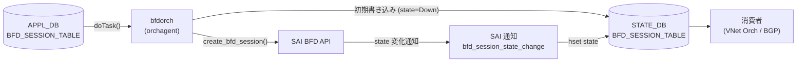

# BFD_SESSION_TABLE (STATE_DB)

## 概要

`STATE_DB` の `BFD_SESSION_TABLE` は、`sonic-swss` の `bfdorch` が SAI BFD セッションを作成した後に書き込む読み取り専用のセッション状態テーブル[^1]。設定値（`tx_interval` 等）とランタイム状態（`state`）の両方を保持し、SAI からの状態変化通知（`bfd_session_state_change`）を受信するたびに `state` フィールドのみ更新される。

`use_software_bfd = true`（`BGP_DEVICE_GLOBAL.STATE.use_software_bfd`）のソフトウェア BFD モードでは、SAI を経由しないため `BFD_SESSION_TABLE` は書き込まれず、代わりに `BFD_SOFTWARE_SESSION_TABLE` に APPL_DB データが転記される。

!!! note "CONFIG_DB との関係"
    BFD の **設定** は `CONFIG_DB` の [`BFD_SESSION`](bfd-session.md) テーブルで行う。`bfdorch` が APPL_DB `BFD_SESSION_TABLE` を経由して SAI セッションを作成した後、その結果と構成情報を本テーブルに書き戻す。

<!-- cdb-mermaid -->
### データフロー



<!-- /cdb-mermaid -->

## key 構造

```text
BFD_SESSION_TABLE|<vrf>|<interface>|<peer_ip>
```

- `<vrf>`: VRF 名。デフォルト VRF は `"default"`
- `<interface>`: 出力インタフェース名。hardware lookup 時は `"default"`
- `<peer_ip>`: BFD ピアの IP アドレス (IPv4 / IPv6)

key は `bfdorch.cpp` の `get_state_db_key()` が APPL_DB キーの `|` 区切りから生成する。

## フィールド一覧

| フィールド | 型 | 書込み主体 | デフォルト | 説明 |
|-----------|----|-----------|-----------|------|
| `state` | enum string | `bfdorch` (SAI 通知) | `"Down"` | BFD セッション状態。`"Admin_Down"` / `"Down"` / `"Init"` / `"Up"` のいずれか |
| `type` | enum string | `bfdorch` (セッション作成) | `"async_active"` | BFD セッション種別。APPL_DB 入力値をそのまま転記 |
| `local_discriminator` | uint32 string | `bfdorch` (セッション作成) | 連番 (1–) | bfd_gen_id() で生成した内部識別子 |
| `local_addr` | IP アドレス string | `bfdorch` (セッション作成) | 必須 | SAI セッションの送信元 IP アドレス |
| `tx_interval` | uint32 string (ms) | `bfdorch` (セッション作成) | `"1000"` | 送信間隔 (ミリ秒)。STATE_DB には ms 値、SAI 投入は ×1000 μs |
| `rx_interval` | uint32 string (ms) | `bfdorch` (セッション作成) | `"1000"` | 最小受信間隔 (ミリ秒) |
| `multiplier` | uint8 string | `bfdorch` (セッション作成) | `"10"` | 検知乗数 (detect multiplier) |
| `multihop` | boolean string | `bfdorch` (セッション作成) | `"false"` | マルチホップ BFD 有効フラグ。常に `"true"` または `"false"` が書かれる |

## `state` フィールド詳細

### 書き込みトリガーと状態遷移

`bfdorch` は以下の 2 タイミングで `state` を STATE_DB に書き込む:

1. **セッション作成直後** (`create_bfd_session()` 完了後) — `state = "Down"` で固定書き込み (`bfdorch.cpp:544,565`)
2. **SAI 通知受信時** (`doTask(NotificationConsumer)`) — SAI からの `bfd_session_state_change` 通知が届くたびに `hset(key, "state", ...)` で更新 (`bfdorch.cpp:252`)

### 取り得る値

| 値 | SAI 対応状態 | 意味 |
|----|------------|------|
| `"Admin_Down"` | `SAI_BFD_SESSION_STATE_ADMIN_DOWN` | 管理的に Down に設定 |
| `"Down"` | `SAI_BFD_SESSION_STATE_DOWN` | セッション Down（初期値・ピア未検出） |
| `"Init"` | `SAI_BFD_SESSION_STATE_INIT` | セッション確立中 |
| `"Up"` | `SAI_BFD_SESSION_STATE_UP` | セッション確立済み（正常動作） |

## `local_discriminator` フィールド詳細

`bfd_gen_id()` が static uint32_t を 1 から順にインクリメントして返す:

```cpp
// bfdorch.cpp:641-645
static uint32_t session_id = 1;
return (session_id++);
```

orchagent プロセス内でのセッション作成順序に依存する連番。orchagent 再起動でリセットされる。

## STATE_DB に書き込まれないフィールド

以下の APPL_DB / CONFIG_DB フィールドは STATE_DB `BFD_SESSION_TABLE` に**書き込まれない**:

| フィールド | 理由 |
|-----------|------|
| `tos` | SAI 属性 `SAI_BFD_SESSION_ATTR_TOS` にのみ反映。`fvVector` に追加しない (`bfdorch.cpp:466-468`) |
| `dst_mac` | SAI 属性としてのみ使用 |
| `shutdown_bfd_during_tsa` | `create_bfd_session()` 内で `continue` (無視)。doTask() の呼び出し元で処理済み |

## ソフトウェア BFD モード (`BFD_SOFTWARE_SESSION_TABLE`)

`use_software_bfd = true` の場合、`bfdorch` は SAI を呼ばず `BFD_SOFTWARE_SESSION_TABLE` に APPL_DB データを転記する:

```cpp
// bfdorch.cpp:706-710
void BfdOrch::createSoftwareBfdSession(const string &key, const vector<swss::FieldValueTuple>& data)
{
    m_stateSoftBfdSessionTable->set(createStateDBKey(key), data);
}
```

この場合は `state` フィールドが含まれず、`bgpcfgd` の `BfdMgr` が FRR に vtysh 経由で設定を注入し、FRR 側で状態管理する。

## 購読者 (consumer)

| プロセス | 参照 | 用途 |
|---------|------|------|
| `vnetorch` | `STATE_DB BFD_SESSION_TABLE` → `state` | VNET の BFD 監視。BFD Up/Down でルート切替 |
| `BfdMonitorOrch` | `STATE_DB BFD_SESSION_TABLE` | BFD 状態のオーケストレーション監視 |
| `show bfd peers` (sonic-utilities) | `STATE_DB BFD_SESSION_TABLE` | セッション状態の表示 |

<!-- value-behavior -->
## 値依存挙動マトリクス

### `state` (enum string)

| 値 | SAI 通知 | bfd_session_lookup 更新 | VNet 連動 |
|---|---|---|---|
| `"Down"` (初期) | セッション作成直後に固定書込み | `SAI_BFD_SESSION_STATE_DOWN` | Down 通知 |
| `"Down"` (SAI 通知) | SAI_BFD_SESSION_STATE_DOWN | 更新 | Down 通知 |
| `"Init"` | SAI_BFD_SESSION_STATE_INIT | 更新 | — |
| `"Up"` | SAI_BFD_SESSION_STATE_UP | 更新 | Up 通知 |
| `"Admin_Down"` | SAI_BFD_SESSION_STATE_ADMIN_DOWN | 更新 | Down 通知 |

### TSA 有効時の挙動

TSA (Traffic Shift Away) が有効かつ `shutdown_bfd_during_tsa = "true"` のセッションは、`handleTsaStateChange(true)` で `notify_session_state_down()` が呼ばれた後 `remove_bfd_session()` で STATE_DB エントリが削除される。TSA 解除時は再作成される (`bfdorch.cpp:683-704`)。

<!-- /value-behavior -->

<!-- defaults -->
## フィールド暗黙デフォルト (Phase A — コード由来)

YANG schema が存在しないため、すべてのデフォルトはコード (`bfdorch.cpp`) の変数初期化またはマクロ定義から由来する。

| フィールド | コード由来デフォルト | fallback 源 |
|-----------|-------------------|------------|
| `state` | `"Down"` | `session_state_lookup.at(SAI_BFD_SESSION_STATE_DOWN)` — `bfdorch.cpp:544` にて create 直後に固定書込み |
| `type` | `"async_active"` | `SAI_BFD_SESSION_TYPE_ASYNC_ACTIVE` — `bfdorch.cpp:340` の C++ 変数初期化 |
| `local_discriminator` | 連番 (1 から開始) | `bfd_gen_id()` — `bfdorch.cpp:641-645` の static 変数インクリメント |
| `local_addr` | **必須 (省略不可)** | `src_ip_provided == false` → エラーログ + STATE_DB 書込みなし — `bfdorch.cpp:409-413` |
| `tx_interval` | `"1000"` (ms) | `BFD_SESSION_DEFAULT_TX_INTERVAL 1000` — `bfdorch.cpp:15,343` |
| `rx_interval` | `"1000"` (ms) | `BFD_SESSION_DEFAULT_RX_INTERVAL 1000` — `bfdorch.cpp:16,344` |
| `multiplier` | `"10"` | `BFD_SESSION_DEFAULT_DETECT_MULTIPLIER 10` — `bfdorch.cpp:17,345` |
| `multihop` | `"false"` | `bool multihop = false` — `bfdorch.cpp:347`。STATE_DB には常に文字列 `"true"` / `"false"` |

### 補足

- `state` は **セッション作成直後は常に `"Down"`**。SAI からの Up 通知を受け取って初めて `"Up"` になる。
- `local_discriminator` は orchagent 再起動でリセットされる。分散環境では同一セッションキーに対して再起動のたびに異なる値が入る。
- `tos` は APPL_DB → SAI への変換専用で STATE_DB には書かれない。STATE_DB から TOS 値を読み出すことはできない。
- BFD_SESSION_TABLE に対応する YANG schema は現時点 (2026-05) で存在しない。すべての制約はコードレベルで実施される。

<!-- /defaults -->

<!-- ordering -->
## フィールド書込み順序と前提依存

`BFD_SESSION_TABLE` (STATE_DB) は `bfdorch` が 2 つの異なる経路で書き込む。経路によって書込み順序と前提条件が異なる。

### 経路 1: セッション作成時（`create_bfd_session()`）— 全フィールド一括書込み

SAI セッション作成が **成功した後**に全フィールドをまとめて `m_stateBfdSessionTable.set()` する。`fvVector` への追加順序は以下の通り[^ord1]:

| 順序 | フィールド | 追加箇所 |
|-----|-----------|---------|
| 1 | `type` | `bfdorch.cpp:418` |
| 2 | `local_discriminator` | `bfdorch.cpp:424` |
| 3 | `local_addr` | `bfdorch.cpp:445` |
| 4 | `tx_interval` | `bfdorch.cpp:454` |
| 5 | `rx_interval` | `bfdorch.cpp:459` |
| 6 | `multiplier` | `bfdorch.cpp:464` |
| 7 | `multihop` | `bfdorch.cpp:475 / 479` |
| 8 | `state = "Down"` | `bfdorch.cpp:544`（**最後に追加**）|

SAI create 呼出し（`bfdorch.cpp:547`）→ 成功確認（`bfdorch.cpp:554-562`）→ `m_stateBfdSessionTable.set(state_db_key, fvVector)`（`bfdorch.cpp:565`）の順。**SAI create が失敗した場合（3 回リトライ後も）は STATE_DB に一切書き込まれない。** 中間状態（フィールドが一部しかない状態）は外部から観測できない。

### 経路 2: SAI 通知受信時（`doTask(NotificationConsumer&)`）— `state` のみ更新

SAI `bfd_session_state_change` 通知を受信するたびに `m_stateBfdSessionTable.hset(key, "state", ...)` で `state` フィールド**のみ**を上書きする（`bfdorch.cpp:252`）。他のフィールドは変更されない。

前提条件: `bfd_session_lookup[bfd_session_id]` が登録済み（= 経路 1 が完了済み）であること。

### 前提依存サマリ

| 依存項目 | 対象経路 | 前提未解決時の挙動 |
|---------|---------|----------------|
| SAI BFD capability 登録（初回 SET 時に 1 回）| 全 hardware BFD | `register_bfd_state_change_notification()` 失敗 → STATE_DB 書込みなし (`bfdorch.cpp:307-313`) |
| PORT 初期化（`alias != "default"` 経路）| hardware BFD, 出力インタフェース指定 | `gPortsOrch->getPort()` 失敗 → `return false` → 次イベントループで再試行 (`bfdorch.cpp:485-489`) |
| VRF 登録（`vrf != "default"` 経路）| hardware BFD, 非デフォルト VRF | `VRFOrch::getVRFid()` 失敗 → SAI create 失敗 → handleSaiCreateStatus 再試行 (`bfdorch.cpp:537-540`) |
| BgpGlobalStateOrch 先行起動 | software/hardware 経路選択 | 未起動の場合は `use_software_bfd=true` 固定 → `BFD_SOFTWARE_SESSION_TABLE` に転記（本テーブルには書かれない）(`bfdorch.cpp:114-121`) |

### orchagent 再起動時のクリーンアップ

orchagent 起動直後、コンストラクタ（`bfdorch.cpp:74-84`）が `BFD_SESSION_TABLE` の**全エントリを削除**してから通常処理を開始する。この瞬間、STATE_DB テーブルが一時的に空になるため、`vnetorch` 等の consumer が参照するタイミングによっては全セッションが Down 扱いになる。

### TSA 操作時の書込み順序

- **TSA enter**: `notify_session_state_down(key)` で内部 observer へ Down 通知（STATE_DB の `state` は**変更しない**）→ `remove_bfd_session()` で STATE_DB エントリを削除。外部から見ると「`state` フィールドが "Down" を経由せずエントリが消える」挙動になる（`bfdorch.cpp:692-693`）。
- **TSA exit**: `bfd_session_cache`（`std::map` = キー辞書順）を走査して `create_bfd_session()` を再呼び出し。辞書順でセッションが順次 STATE_DB に再出現する（`bfdorch.cpp:697-703`）。

[^ord1]: `sonic-swss/orchagent/bfdorch.cpp` (L418-565): `fvVector` へのフィールド追加順序および `m_stateBfdSessionTable.set()` 呼出し。<https://github.com/sonic-net/sonic-swss/blob/master/orchagent/bfdorch.cpp>

<!-- /ordering -->

<!-- cdb-exceptions -->
## 例外条件・特殊挙動

| 条件 | 挙動 |
|------|------|
| `local_addr` 未指定 | STATE_DB に書き込まれない。`"Failed to create BFD session ... because source IP is not provided"` を SWSS_LOG_ERROR 出力 |
| `interface != "default"` かつ `dst_mac` 未指定 | セッション作成失敗。STATE_DB に書き込まれない |
| `use_software_bfd == true` | `BFD_SESSION_TABLE` ではなく `BFD_SOFTWARE_SESSION_TABLE` に書き込む。`state` フィールドなし |
| orchagent 起動時 | 既存の `BFD_SESSION_TABLE` エントリをすべて削除（クリーンアップ）してから再作成 (`bfdorch.cpp:74-79`) |
| TSA 有効 + `shutdown_bfd_during_tsa == "true"` | `notify_session_state_down()` 後に STATE_DB エントリ削除 |
| SAI セッション作成失敗 | `sai_bfd_api->create_bfd_session()` 失敗時は STATE_DB に書き込まれない |

<!-- /cdb-exceptions -->

<!-- platform -->
## プラットフォーム差 (SAI capability / HW vs SW BFD / ASIC vendor)

`bfdorch` は `platform` / `sub_platform` 環境変数の static 比較を**行わず**、**SAI 動的 capability 照会**のみで ASIC 対応を判定する (他の orch とは設計が異なる)[^h1]。STATE_DB `BFD_SESSION_TABLE` への書込みが発生するか否かは、以下の組合せで決まる。

### HW BFD 経路 vs SW BFD 経路

| 条件 | `BFD_SESSION_TABLE` (STATE_DB) | `BFD_SOFTWARE_SESSION_TABLE` |
|------|-------------------------------|------------------------------|
| `BGP_DEVICE_GLOBAL.STATE.use_software_bfd == "true"` | **書込みなし** | `bfdorch::createSoftwareBfdSession()` 経由で書込み |
| `use_software_bfd == "false"` (デフォルト) + ASIC が SAI BFD 対応 | 書込みあり | なし |
| `use_software_bfd == "false"` + ASIC が SAI BFD 未対応 | **書込みなし** (create 失敗) | なし |

### 動的照会される SAI capability

`bfdorch` が起動時 / 初回 create 時に問い合わせる SAI 属性:

| SAI 属性 | チェック対象 | 失敗時の挙動 |
|---------|-------------|------------|
| `SAI_SWITCH_ATTR_BFD_SESSION_STATE_CHANGE_NOTIFY` (`set_implemented`) | BFD 状態変化通知の登録可否 | `create_bfd_session()` 全体が **fail**。STATE_DB エントリ作成自体が起こらない (`bfdorch.cpp:286-290, 309-313`) |
| `SAI_SWITCH_ATTR_SUPPORTED_IPV4_BFD_SESSION_OFFLOAD_TYPE` | IPv4 BFD オフロード対応 | `bgpcfgd` が SW BFD 経路を選択 → STATE_DB `BFD_SESSION_TABLE` は使われない (`bfdorch.cpp:761-790`) |
| `SAI_SWITCH_ATTR_SUPPORTED_IPV6_BFD_SESSION_OFFLOAD_TYPE` | IPv6 BFD オフロード対応 | 同上 (IPv6 family のみ独立) |

`SUPPORTED_IPV*_BFD_SESSION_OFFLOAD_TYPE` の値が `SAI_BFD_SESSION_OFFLOAD_TYPE_NONE` の場合も SW BFD 経路となる。IPv4 / IPv6 は独立に照会されるため、片方だけ HW 対応の ASIC では対応 family のセッションだけが STATE_DB に出現する。

### `HW_LOOKUP_VALID` 分岐 (interface 指定の有無)

`bfdorch.cpp:482-542` で `interface` フィールドが `"default"` か否かにより SAI 属性セットが分岐する。フィールド集合は同一だが ASIC 互換性に差がある。

| `interface` | `SAI_BFD_SESSION_ATTR_HW_LOOKUP_VALID` | 追加必須 SAI 属性 |
|-------------|----------------------------------------|------------------|
| `"default"` | 省略 (SAI default = true) | `VIRTUAL_ROUTER` |
| 具体ポート名 (例 `Ethernet0`) | `false` を明示セット | `PORT`, `SRC_MAC`, `DST_MAC` (CONFIG_DB の `dst_mac` 必須)。`vrf != "default"` は reject |

ASIC によっては `HW_LOOKUP_VALID = false` を未サポートで `create_bfd_session()` 自体が失敗 → STATE_DB に書込みなし。

### vendor 別の典型挙動

| プラットフォーム | HW BFD オフロード | `BFD_SESSION_TABLE` 書込み | 備考 |
|-----------------|------------------|---------------------------|------|
| broadcom (TD/TH/JR) | あり (IPv4/IPv6) | あり | state 通知レイテンシ低 |
| mellanox (Spectrum) | あり (IPv4/IPv6) | あり | `detect_multiplier × rx_interval` に従う |
| cisco-8000 | あり (IPv4/IPv6) | あり | offload type 取得経路を通る |
| barefoot (Tofino) | 実装依存 | 実装依存 | SAI capability 照会結果に従う |
| marvell-prestera | 一部 SKU で SW のみ | SW モードでは**なし** | `use_software_bfd = true` で動くケースあり |
| vs (シミュレーション) | なし | SW モードでは**なし** | テスト環境では FRR 経路 |

上表は SAI 実装の現状を示すもので、`bfdorch.cpp` 内の明示的な vendor 文字列比較ではない。`bfdorch` は ASIC vendor を直接見ず、SAI capability 動的照会のみで分岐する点に注意。

### 通知の async 配信タイミング差

HW BFD 経路では SAI 通知が ASIC 内のタイマ精度に依存する。broadcom 系は数百 μs 〜 ms 単位、mellanox 系は `detect_multiplier × rx_interval` に従う。`"Down" → "Up"` 遷移までの遅延が ASIC vendor 差で 1〜数百 ms 揺れる。STATE_DB を polling する consumer (例 `vnetorch`) は `Init` 状態を観測する可能性が vendor によって異なる。

[^h1]: `sonic-swss/orchagent/bfdorch.cpp` (L116-205 use_software_bfd 分岐、L270-303 BFD 通知 capability 照会、L482-542 HW_LOOKUP_VALID 分岐、L755-791 BgpGlobalStateOrch::offload_supported)。`bfdorch.cpp` 全 841 行で `platform` / `sub_platform` の static 比較は 0 件。<https://github.com/sonic-net/sonic-swss/blob/master/orchagent/bfdorch.cpp>

<!-- /platform -->

## 関連リファレンス

- CONFIG_DB: [`BFD_SESSION`](bfd-session.md) — BFD セッション設定パラメータ
- CONFIG_DB: [`BGP_DEVICE_GLOBAL`](bgp-device-global.md) — `use_software_bfd` フラグ
- CLI: `show bfd peers`, `show bfd peers <ip>`, `show bfd peers details`

<!-- ref-triangle:start -->

## 関連リファレンス

- CONFIG_DB: [`BFD_SESSION`](bfd-session.md)

<!-- ref-triangle:end -->

## 引用元

[^1]: `sonic-swss/orchagent/bfdorch.cpp` (L49-55 session_state_lookup, L57-88 constructor/cleanup, L220-268 SAI 通知受信/hset, L305-575 create_bfd_session/fvVector 書込み, L564-567 STATE_DB set). <https://github.com/sonic-net/sonic-swss/blob/master/orchagent/bfdorch.cpp>

<!-- ops-hint -->
## 運用ヒント

### STATE_DB 確認コマンド

```bash
# BFD セッション一覧
sonic-db-cli STATE_DB keys 'BFD_SESSION_TABLE|*'

# 特定セッションの全フィールド確認
sonic-db-cli STATE_DB hgetall 'BFD_SESSION_TABLE|default|default|10.0.0.1'

# state フィールドのみ確認
sonic-db-cli STATE_DB hget 'BFD_SESSION_TABLE|default|default|10.0.0.1' state

# CLI からの確認
show bfd peers
show bfd peers 10.0.0.1
show bfd peers details
```

### よくある確認ポイント

- `state` が `"Down"` のまま変化しない場合は SAI / ASIC の BFD offload 対応を確認
- `local_discriminator` がセッションごとに異なる値になることは正常動作
- orchagent 再起動後は全セッションが `"Down"` から再開する（クリーンアップ後再作成）

<!-- /ops-hint -->
