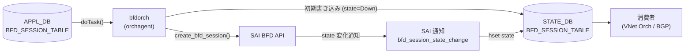

# BFD_SESSION_TABLE (STATE_DB)

## 概要

`STATE_DB` の `BFD_SESSION_TABLE` は、`sonic-swss` の `bfdorch` が [SAI](../../reference/glossary.md#term-sai) [BFD](../../reference/glossary.md#term-bfd) セッションを作成した後に書き込む読み取り専用のセッション状態テーブル[^1]。設定値（`tx_interval` 等）とランタイム状態（`state`）の両方を保持し、[SAI](../../reference/glossary.md#term-sai) からの状態変化通知（`bfd_session_state_change`）を受信するたびに `state` フィールドのみ更新される。

`use_software_bfd = true`（`BGP_DEVICE_GLOBAL.STATE.use_software_bfd`）のソフトウェア [BFD](../../reference/glossary.md#term-bfd) モードでは、[SAI](../../reference/glossary.md#term-sai) を経由しないため `BFD_SESSION_TABLE` は書き込まれず、代わりに `BFD_SOFTWARE_SESSION_TABLE` に [APPL_DB](../../reference/glossary.md#term-appl_db) データが転記される。

!!! note "CONFIG_DB との関係"
    BFD の **設定** は `CONFIG_DB` の [`BFD_SESSION`](bfd-session.md) テーブルで行う。`bfdorch` が APPL_DB `BFD_SESSION_TABLE` を経由して SAI セッションを作成した後、その結果と構成情報を本テーブルに書き戻す。

<!-- cdb-mermaid -->
### データフロー



<!-- /cdb-mermaid -->

## key 構造

```text
BFD_SESSION_TABLE|<vrf>|<interface>|<peer_ip>
```

- `<vrf>`: [VRF](../../reference/glossary.md#term-vrf) 名。デフォルト [VRF](../../reference/glossary.md#term-vrf) は `"default"`
- `<interface>`: 出力インタフェース名。hardware lookup 時は `"default"`
- `<peer_ip>`: [BFD](../../reference/glossary.md#term-bfd) ピアの IP アドレス (IPv4 / IPv6)

key は `bfdorch.cpp` の `get_state_db_key()` が [APPL_DB](../../reference/glossary.md#term-appl_db) キーの `|` 区切りから生成する。

## フィールド一覧

| フィールド | 型 | 書込み主体 | デフォルト | 説明 |
|-----------|----|-----------|-----------|------|
| `state` | enum string | `bfdorch` (SAI 通知) | `"Down"` | BFD セッション状態。`"Admin_Down"` / `"Down"` / `"Init"` / `"Up"` のいずれか |
| `type` | enum string | `bfdorch` (セッション作成) | `"async_active"` | BFD セッション種別。[APPL_DB](../../reference/glossary.md#term-appl_db) 入力値をそのまま転記 |
| `local_discriminator` | uint32 string | `bfdorch` (セッション作成) | 連番 (1–) | bfd_gen_id() で生成した内部識別子 |
| `local_addr` | IP アドレス string | `bfdorch` (セッション作成) | 必須 | SAI セッションの送信元 IP アドレス |
| `tx_interval` | uint32 string (ms) | `bfdorch` (セッション作成) | `"1000"` | 送信間隔 (ミリ秒)。[STATE_DB](../../reference/glossary.md#term-state_db) には ms 値、SAI 投入は ×1000 μs |
| `rx_interval` | uint32 string (ms) | `bfdorch` (セッション作成) | `"1000"` | 最小受信間隔 (ミリ秒) |
| `multiplier` | uint8 string | `bfdorch` (セッション作成) | `"10"` | 検知乗数 (detect multiplier) |
| `multihop` | boolean string | `bfdorch` (セッション作成) | `"false"` | マルチホップ BFD 有効フラグ。常に `"true"` または `"false"` が書かれる |

## `state` フィールド詳細

### 書き込みトリガーと状態遷移

`bfdorch` は以下の 2 タイミングで `state` を [STATE_DB](../../reference/glossary.md#term-state_db) に書き込む:

1. **セッション作成直後** (`create_bfd_session()` 完了後) — `state = "Down"` で固定書き込み (`bfdorch.cpp:544,565`)
2. **SAI 通知受信時** (`doTask(NotificationConsumer)`) — SAI からの `bfd_session_state_change` 通知が届くたびに `hset(key, "state", ...)` で更新 (`bfdorch.cpp:252`)

### 取り得る値

| 値 | SAI 対応状態 | 意味 |
|----|------------|------|
| `"Admin_Down"` | `SAI_BFD_SESSION_STATE_ADMIN_DOWN` | 管理的に Down に設定 |
| `"Down"` | `SAI_BFD_SESSION_STATE_DOWN` | セッション Down（初期値・ピア未検出） |
| `"Init"` | `SAI_BFD_SESSION_STATE_INIT` | セッション確立中 |
| `"Up"` | `SAI_BFD_SESSION_STATE_UP` | セッション確立済み（正常動作） |

## `local_discriminator` フィールド詳細

`bfd_gen_id()` が static uint32_t を 1 から順にインクリメントして返す:

```cpp
// bfdorch.cpp:641-645
static uint32_t session_id = 1;
return (session_id++);
```

[orchagent](../../reference/glossary.md#term-orchagent) プロセス内でのセッション作成順序に依存する連番。[orchagent](../../reference/glossary.md#term-orchagent) 再起動でリセットされる。

## STATE_DB に書き込まれないフィールド

以下の APPL_DB / [CONFIG_DB](../../reference/glossary.md#term-config_db) フィールドは [STATE_DB](../../reference/glossary.md#term-state_db) `BFD_SESSION_TABLE` に**書き込まれない**:

| フィールド | 理由 |
|-----------|------|
| `tos` | SAI 属性 `SAI_BFD_SESSION_ATTR_TOS` にのみ反映。`fvVector` に追加しない (`bfdorch.cpp:466-468`) |
| `dst_mac` | SAI 属性としてのみ使用 |
| `shutdown_bfd_during_tsa` | `create_bfd_session()` 内で `continue` (無視)。doTask() の呼び出し元で処理済み |

## ソフトウェア BFD モード (`BFD_SOFTWARE_SESSION_TABLE`)

`use_software_bfd = true` の場合、`bfdorch` は SAI を呼ばず `BFD_SOFTWARE_SESSION_TABLE` に APPL_DB データを転記する:

```cpp
// bfdorch.cpp:706-710
void BfdOrch::createSoftwareBfdSession(const string &key, const vector<swss::FieldValueTuple>& data)
{
    m_stateSoftBfdSessionTable->set(createStateDBKey(key), data);
}
```

この場合は `state` フィールドが含まれず、`bgpcfgd` の `BfdMgr` が [FRR](../../reference/glossary.md#term-frr) に [vtysh](../../reference/glossary.md#term-vtysh) 経由で設定を注入し、[FRR](../../reference/glossary.md#term-frr) 側で状態管理する。

## 購読者 (consumer)

| プロセス | 参照 | 用途 |
|---------|------|------|
| `vnetorch` | `STATE_DB BFD_SESSION_TABLE` → `state` | [VNET](../../reference/glossary.md#term-vnet) の BFD 監視。BFD Up/Down でルート切替 |
| `BfdMonitorOrch` | `STATE_DB BFD_SESSION_TABLE` | BFD 状態のオーケストレーション監視 |
| `show bfd peers` ([sonic-utilities](../../reference/glossary.md#term-sonic-utilities)) | `STATE_DB BFD_SESSION_TABLE` | セッション状態の表示 |

<!-- value-behavior -->
## 値依存挙動マトリクス

### `state` (enum string)

| 値 | SAI 通知 | bfd_session_lookup 更新 | VNet 連動 |
|---|---|---|---|
| `"Down"` (初期) | セッション作成直後に固定書込み | `SAI_BFD_SESSION_STATE_DOWN` | Down 通知 |
| `"Down"` (SAI 通知) | SAI_BFD_SESSION_STATE_DOWN | 更新 | Down 通知 |
| `"Init"` | SAI_BFD_SESSION_STATE_INIT | 更新 | — |
| `"Up"` | SAI_BFD_SESSION_STATE_UP | 更新 | Up 通知 |
| `"Admin_Down"` | SAI_BFD_SESSION_STATE_ADMIN_DOWN | 更新 | Down 通知 |

### TSA 有効時の挙動

TSA (Traffic Shift Away) が有効かつ `shutdown_bfd_during_tsa = "true"` のセッションは、`handleTsaStateChange(true)` で `notify_session_state_down()` が呼ばれた後 `remove_bfd_session()` で STATE_DB エントリが削除される。TSA 解除時は再作成される (`bfdorch.cpp:683-704`)。

<!-- /value-behavior -->

<!-- pubsub -->
## 通信メカニズム (Phase G)

STATE_DB `BFD_SESSION_TABLE` は [CONFIG_DB](../../reference/glossary.md#term-config_db) / APPL_DB 系の `ProducerStateTable` を用いず、**`swss::Table` 直書きのみ** で更新される。書き手は `bfdorch` 1 プロセスに限定され、`NotificationProducer` も専用 channel `PUBLISH` も使用しない。Subscriber は **[Redis](../../reference/glossary.md#term-redis) keyspace 通知** または **HGETALL polling**、および `bfdorch` プロセス内の `Orch::notify` Observer に分岐する。

### 書込パス: SAI 通知 → `swss::Table::hset`

`BfdOrch` ctor (`bfdorch.cpp:63-65, 86`) は [ASIC_DB](../../reference/glossary.md#term-asic_db) `NOTIFICATIONS` channel に対して:

```cpp
DBConnector *notificationsDb = new DBConnector("ASIC_DB", 0);
m_bfdStateNotificationConsumer = new swss::NotificationConsumer(notificationsDb, "NOTIFICATIONS");
auto bfdStateNotificatier = new Notifier(m_bfdStateNotificationConsumer, this, "BFD_STATE_NOTIFICATIONS");
Orch::addExecutor(bfdStateNotificatier);
```

を登録し、SAI 側に `register_bfd_state_change_notification()` (`bfdorch.cpp:270-303`) で `SAI_SWITCH_ATTR_BFD_SESSION_STATE_CHANGE_NOTIFY` を query + set する。SAI [ASIC](../../reference/glossary.md#term-asic) が `bfd_session_state_change` を発火するたびに `doTask(NotificationConsumer&)` (`bfdorch.cpp:220-268`) が:

```cpp
// bfdorch.cpp:252
m_stateBfdSessionTable.hset(key, "state", session_state_lookup.at(state));
```

を呼び、`state` フィールドのみを上書きする (`state != bfd_session_lookup[id].state` のときに限る)。同時に in-process Observer `notify(SUBJECT_TYPE_BFD_SESSION_STATE_CHANGE, &update)` (`bfdorch.cpp:257-260`) も発火し、`VNetRouteOrch` 等の同 [orchagent](../../reference/glossary.md#term-orchagent) 内 subscriber を起こす。

セッション作成・削除時の書込みは:

| 行 | 操作 | 契機 |
|---|---|---|
| `bfdorch.cpp:78` | `del(alias)` 全件 | コンストラクタ時クリーンアップ |
| `bfdorch.cpp:565` | `set(state_db_key, fvVector)` | `create_bfd_session()` 成功直後 (`state=Down` 固定) |
| `bfdorch.cpp:252` | `hset(key, "state", ...)` | SAI 通知受信時 |
| `bfdorch.cpp:629` | `del(peer)` | `remove_bfd_session()` 内 |

`swss::Table::set/hset/del` は **[Redis](../../reference/glossary.md#term-redis) `HSET`/`HDEL` を直接発行** するのみで、`ProducerStateTable` のような LUA + channel PUBLISH は走らない。よって `BFD_SESSION_TABLE_CHANNEL` のような専用 channel は存在しない。

### 購読パス: keyspace 通知 / HGETALL polling / in-process Observer

| 役割 | 経路 | 根拠 |
|---|---|---|
| 同 orchagent 内 (`VNetRouteOrch` 等) | `Orch::notify(SUBJECT_TYPE_BFD_SESSION_STATE_CHANGE)` Observer | `bfdorch.cpp:257-260` |
| 別プロセス subscriber | `swss::SubscriberStateTable(STATE_DB, STATE_BFD_SESSION_TABLE_NAME)` ([Redis](../../reference/glossary.md#term-redis) keyspace 通知) | swss-common keyspace 通知ベース |
| CLI / snapshot 読者 | `sonic-db-cli STATE_DB hgetall 'BFD_SESSION_TABLE\|*'` (polling) | `show bfd peers` |
| [gNMI](../../reference/glossary.md#term-gnmi) / translib | STATE_DB HGETALL マッピング | [sonic-mgmt](../../reference/glossary.md#term-sonic-mgmt)-common bfd モジュール |

`BFD_SESSION_TABLE` 用の `NotificationProducer` / `ResponsePublisher` / `ZmqProducerStateTable` は [SONiC](../../reference/glossary.md#term-sonic) ソース内に存在しない (`bfdorch.cpp` 範囲で確認、`BfdOrch` は `Orch` 直系で `ZmqOrch` 非継承)。

### ソフトウェア BFD 経路 (`BFD_SOFTWARE_SESSION_TABLE`)

`use_software_bfd == true` の場合 (`bfdorch.cpp:133-139, 706-710`) は `m_stateSoftBfdSessionTable->set(createStateDBKey(key), data)` で APPL_DB 入力を転記。こちらも `swss::Table` 直書きで `state` フィールドなし。状態管理は [FRR](../../reference/glossary.md#term-frr) (`bgpcfgd::BfdMgr` 経由) に委譲される。

### 通信パスまとめ

| 役割 | クラス | 経路 | 根拠 |
|---|---|---|---|
| SAI → orchagent | `swss::NotificationConsumer` ([ASIC_DB](../../reference/glossary.md#term-asic_db) `NOTIFICATIONS`) | LPOP + PUBSUB | `bfdorch.cpp:63-65, 220-268` |
| 書込 (state 初期) | `swss::Table::set` | `HSET STATE_DB BFD_SESSION_TABLE\|<k>` (全フィールド) | `bfdorch.cpp:565` |
| 書込 (state 変化) | `swss::Table::hset` | `HSET ... state <enum>` | `bfdorch.cpp:252` |
| 削除 | `swss::Table::del` | `DEL ...` | `bfdorch.cpp:78, 629` |
| in-process 通知 | `Orch::notify` (Observer) | プロセス内コールバック | `bfdorch.cpp:257-260` |
| 外部購読 | `SubscriberStateTable` / HGETALL | Redis keyspace 通知 or polling | swss-common keyspace 通知 |

`NotificationProducer` / `ProducerStateTable` / 応答 channel publish は **すべて非使用**。詳細スキャンと根拠コードは `meta/_intermediate/cdb-flow/bfd-state-pubsub.md` を参照。
<!-- /pubsub -->

<!-- ordering -->
## STATE_DB 書込み順依存

`bfdorch` は STATE_DB `BFD_SESSION_TABLE` に対して、orchagent シングルスレッドの select loop 上で書込み順を厳密に制御している。consumer (vnetorch / BfdMonitorOrch / `show bfd peers`) はこの順序を前提に状態を解釈する。

### 順序依存サマリ

| # | 依存関係 | 方向 | 補足 |
|---|----------|------|------|
| 1 | constructor の STATE_DB 全削除 → notifier 登録 | 強制先行 | 起動直後の stale `state=Up` を consumer に見せない (`bfdorch.cpp:74-86`) |
| 2 | 初回 `create_bfd_session()` での SAI 通知ハンドラ登録 → STATE_DB 書込み | 遅延（初回のみ） | 登録失敗時は STATE_DB 未書込み (`bfdorch.cpp:307-315`) |
| 3 | SAI BFD `create_bfd_session()` 成功 → `m_stateBfdSessionTable.set()` → `bfd_session_map` / `bfd_session_lookup` 登録 | 強制先行 | STATE_DB 書込みが先、map 登録が後 (`bfdorch.cpp:544-567`) |
| 4 | SAI create 失敗（リトライ含む）→ STATE_DB 未書込み | 負の制約 | `handle_status != task_success` 経路 (`bfdorch.cpp:549-562`) |
| 5 | `bfd_session_lookup` 登録済み → SAI 状態変化通知受信 → `hset("state", ...)` | 強制先行 | 通知 consumer は同 select loop で逐次処理 (`bfdorch.cpp:242-263`) |
| 6 | 同一 state 通知 → STATE_DB 書込みスキップ | 冪等 | `state != bfd_session_lookup[id].state` のときのみ更新 (`bfdorch.cpp:249-263`) |
| 7 | TSA 有効化: `notify_session_state_down()` → `remove_bfd_session()` (STATE_DB del) | 強制（notify が先） | consumer は Down 通知の後にエントリ消滅を観測 (`bfdorch.cpp:683-704`) |
| 8 | TSA 解除の replay: `bfd_session_cache` iteration 順で `create_bfd_session()` | 非決定 | `local_discriminator` は新規連番に置換 (`bfdorch.cpp:696-702`, `641-645`) |
| 9 | `use_software_bfd` フラグで `BFD_SESSION_TABLE` / `BFD_SOFTWARE_SESSION_TABLE` 経路を排他選択 | 排他 | 同 key 二重書込みなし (`bfdorch.cpp:114-122`, `706-710`) |

### 主要な順序保証の詳細

**(1) 起動時クリーンアップが notifier 登録より先**
`BfdOrch::BfdOrch()` は `m_stateBfdSessionTable` の全キーを列挙して `del()` した後 (`bfdorch.cpp:74-85`)、`Orch::addExecutor(bfdStateNotificatier)` で SAI 通知 consumer を登録する (`bfdorch.cpp:86`)。orchagent 再起動直後の `BFD_SESSION_TABLE` には**必ず**新規セッションのみが残り、再起動前の `state=Up` を vnetorch が誤って拾うことはない。

**(3) SAI create 成功が STATE_DB 書込みの絶対条件**
`create_bfd_session()` は `fvVector` を `type` → `local_discriminator` → `local_addr` → `tx_interval` → `rx_interval` → `multiplier` → `multihop` → `state="Down"` の順で組み立て (`bfdorch.cpp:418-544`)、SAI `create_bfd_session()` 成功（または `retry_create_bfd_session()` 経由のリトライ成功）した場合に限り `m_stateBfdSessionTable.set(state_db_key, fvVector)` を実行する (`bfdorch.cpp:547-565`)。STATE_DB 書込みは `bfd_session_map` / `bfd_session_lookup` への登録 (`bfdorch.cpp:566-567`) より**前**に行われる。

**(5) 通知ハンドラは `bfd_session_lookup` 登録済み前提**
`doTask(NotificationConsumer)` は受信した `bfd_session_id` を `bfd_session_lookup[id]` で逆引きして STATE_DB キーを取得する (`bfdorch.cpp:244-252`)。`bfd_session_lookup` への登録は `create_bfd_session()` の最終段 (`bfdorch.cpp:567`) でのみ行われるため、SAI 通知が早着しても orchagent シングルスレッドの select loop で逐次処理されるため race は発生しない。

**(7) TSA 有効化は Down 通知 → STATE_DB 削除の順**
`handleTsaStateChange(true)` は各セッションについて先に `notify_session_state_down(key)` で `SUBJECT_TYPE_BFD_SESSION_STATE_CHANGE` を `SAI_BFD_SESSION_STATE_DOWN` で伝播し (`bfdorch.cpp:692`)、続けて `remove_bfd_session(key)` で SAI remove → STATE_DB `del()` を実行する (`bfdorch.cpp:693`, `629`)。consumer は「Down 通知を先に受け取り、その後で `BFD_SESSION_TABLE` エントリが消える」順で観測するため、`state=Up` のスナップショットを抱えたままエントリが消える「孤立 Up」を防ぐ。

<!-- /ordering -->

<!-- defaults -->
## フィールド暗黙デフォルト (Phase A — コード由来)

[YANG](../../reference/glossary.md#term-yang) schema が存在しないため、すべてのデフォルトはコード (`bfdorch.cpp`) の変数初期化またはマクロ定義から由来する。

| フィールド | コード由来デフォルト | fallback 源 |
|-----------|-------------------|------------|
| `state` | `"Down"` | `session_state_lookup.at(SAI_BFD_SESSION_STATE_DOWN)` — `bfdorch.cpp:544` にて create 直後に固定書込み |
| `type` | `"async_active"` | `SAI_BFD_SESSION_TYPE_ASYNC_ACTIVE` — `bfdorch.cpp:340` の C++ 変数初期化 |
| `local_discriminator` | 連番 (1 から開始) | `bfd_gen_id()` — `bfdorch.cpp:641-645` の static 変数インクリメント |
| `local_addr` | **必須 (省略不可)** | `src_ip_provided == false` → エラーログ + STATE_DB 書込みなし — `bfdorch.cpp:409-413` |
| `tx_interval` | `"1000"` (ms) | `BFD_SESSION_DEFAULT_TX_INTERVAL 1000` — `bfdorch.cpp:15,343` |
| `rx_interval` | `"1000"` (ms) | `BFD_SESSION_DEFAULT_RX_INTERVAL 1000` — `bfdorch.cpp:16,344` |
| `multiplier` | `"10"` | `BFD_SESSION_DEFAULT_DETECT_MULTIPLIER 10` — `bfdorch.cpp:17,345` |
| `multihop` | `"false"` | `bool multihop = false` — `bfdorch.cpp:347`。STATE_DB には常に文字列 `"true"` / `"false"` |

### 補足

- `state` は **セッション作成直後は常に `"Down"`**。SAI からの Up 通知を受け取って初めて `"Up"` になる。
- `local_discriminator` は orchagent 再起動でリセットされる。分散環境では同一セッションキーに対して再起動のたびに異なる値が入る。
- `tos` は APPL_DB → SAI への変換専用で STATE_DB には書かれない。STATE_DB から TOS 値を読み出すことはできない。
- BFD_SESSION_TABLE に対応する [YANG](../../reference/glossary.md#term-yang) schema は現時点 (2026-05) で存在しない。すべての制約はコードレベルで実施される。

<!-- /defaults -->

<!-- constants -->
## ハードコード定数 (Phase E — コード由来)

`bfdorch.cpp` および `orch.h` に直接埋め込まれた定数で、[CONFIG_DB](../../reference/glossary.md#term-config_db) / STATE_DB / [YANG](../../reference/glossary.md#term-yang) では設定不能なもの。詳細は [meta/_intermediate/cdb-flow/bfd-state-constants.md](https://github.com/aoki-taquan/sonic-unofficial-docs/blob/main/meta/_intermediate/cdb-flow/bfd-state-constants.md) を参照。

### `#define` マクロ (デフォルト値)

| 定数名 | 値 | 用途 | ソース |
|--------|-----|------|--------|
| `BFD_SESSION_DEFAULT_TX_INTERVAL` | `1000` (ms) | `tx_interval` 未指定時のデフォルト | `bfdorch.cpp:15` |
| `BFD_SESSION_DEFAULT_RX_INTERVAL` | `1000` (ms) | `rx_interval` 未指定時のデフォルト | `bfdorch.cpp:16` |
| `BFD_SESSION_DEFAULT_DETECT_MULTIPLIER` | `10` | `multiplier` 未指定時のデフォルト | `bfdorch.cpp:17` |
| `BFD_SESSION_DEFAULT_TOS` | `192` | `tos` 未指定時のデフォルト ([DSCP](../../reference/glossary.md#term-dscp) CS6 相当)。STATE_DB 非書込み | `bfdorch.cpp:19` |

### `session_state_lookup` — SAI 状態 → STATE_DB 文字列

| SAI 列挙値 | STATE_DB 文字列 |
|-----------|---------------|
| `SAI_BFD_SESSION_STATE_ADMIN_DOWN` | `"Admin_Down"` |
| `SAI_BFD_SESSION_STATE_DOWN` | `"Down"` |
| `SAI_BFD_SESSION_STATE_INIT` | `"Init"` |
| `SAI_BFD_SESSION_STATE_UP` | `"Up"` |

`bfdorch.cpp:49-55` の `const map<sai_bfd_session_state_t, string>`。`hset(key, "state", session_state_lookup.at(state))` (`bfdorch.cpp:252`) および create 直後の固定書込み (`bfdorch.cpp:544`) で参照される。**`"Admin_Down"` のみアンダースコア表記** に注意 (CLI/監視は完全一致比較が必要)。

### `session_type_map` / `session_type_lookup` — type 双方向変換

| 文字列 | SAI 列挙値 |
|-------|----------|
| `"demand_active"` | `SAI_BFD_SESSION_TYPE_DEMAND_ACTIVE` |
| `"demand_passive"` | `SAI_BFD_SESSION_TYPE_DEMAND_PASSIVE` |
| `"async_active"` (default) | `SAI_BFD_SESSION_TYPE_ASYNC_ACTIVE` |
| `"async_passive"` | `SAI_BFD_SESSION_TYPE_ASYNC_PASSIVE` |

CONFIG_DB → SAI: `session_type_map` (`bfdorch.cpp:33-39`)。SAI → STATE_DB: `session_type_lookup` (`bfdorch.cpp:41-47`)。デフォルトは `SAI_BFD_SESSION_TYPE_ASYNC_ACTIVE` (`bfdorch.cpp:340`)。

### フィールド名・キー区切り文字リテラル

| 値 | 用途 | ソース |
|----|------|--------|
| `"state"` | STATE_DB フィールド名 (状態) | `bfdorch.cpp:252,544` |
| `"type"` | STATE_DB フィールド名 (セッション種別) | `bfdorch.cpp:418` |
| `"default"` | [VRF](../../reference/glossary.md#term-vrf) / interface のデフォルト値 (hardware lookup 時の interface) | `bfdorch.cpp:482,498,531` |
| `state_db_key_delimiter = '|'` | STATE_DB キー区切り文字 (全 orch 共通) | `orch.h:38`, `bfdorch.cpp:638` |

### 補足

- `tos` のデフォルト `192` は SAI 属性専用で **STATE_DB / 読み出し不可**。
- `tx_interval` / `rx_interval` は STATE_DB には ms、SAI には ×1000 した μs で投入される。
- `state_db_key_delimiter` が `'|'` のため、VRF 名や interface 名に `|` を含めることはできない。

<!-- /constants -->

<!-- cdb-exceptions -->
## 例外条件・特殊挙動

| 条件 | 挙動 |
|------|------|
| `local_addr` 未指定 | STATE_DB に書き込まれない。`"Failed to create BFD session ... because source IP is not provided"` を SWSS_LOG_ERROR 出力 |
| `interface != "default"` かつ `dst_mac` 未指定 | セッション作成失敗。STATE_DB に書き込まれない |
| `use_software_bfd == true` | `BFD_SESSION_TABLE` ではなく `BFD_SOFTWARE_SESSION_TABLE` に書き込む。`state` フィールドなし |
| orchagent 起動時 | 既存の `BFD_SESSION_TABLE` エントリをすべて削除（クリーンアップ）してから再作成 (`bfdorch.cpp:74-79`) |
| TSA 有効 + `shutdown_bfd_during_tsa == "true"` | `notify_session_state_down()` 後に STATE_DB エントリ削除 |
| SAI セッション作成失敗 | `sai_bfd_api->create_bfd_session()` 失敗時は STATE_DB に書き込まれない |

<!-- /cdb-exceptions -->

<!-- cross-refs -->
## 暗黙参照 — `bfdorch` が STATE_DB `BFD_SESSION_TABLE` 書込みに伴い連動する DB / 消費者 (Phase C)

`bfdorch` は STATE_DB `BFD_SESSION_TABLE` を**単体では書かない**。APPL_DB 入力、`BgpGlobalStateOrch` 経由で取得する CONFIG_DB `BGP_DEVICE_GLOBAL` の 2 フラグ、および SAI が返す [ASIC_DB](../../reference/glossary.md#term-asic_db) のセッション OID と連動し、書込み有無・書込み先テーブル・state 更新タイミングが分岐する。書き込まれた値は複数の orchagent / daemon が observer または SubscriberStateTable で消費する。

### Direction A — `bfdorch` が読み出す関連 DB / Orch

| テーブル / 値 | DB / 経路 | 役割 | evidence |
|---|---|---|---|
| [`BFD_SESSION`](bfd-session.md) (APPL_DB `BFD_SESSION_TABLE`) | APPL_DB | Direction A の入り口。SET/DEL が STATE_DB `BFD_SESSION_TABLE` の create/del を駆動 | `bfdorch.cpp` `BfdOrch::doTask(Consumer&)` |
| [`BGP_DEVICE_GLOBAL`](bgp-device-global.md) `.tsa_enabled` | CONFIG_DB → `BgpGlobalStateOrch::getTsaState()` | TSA 有効時に `shutdown_bfd_during_tsa=true` のセッションを `notify_session_state_down()` + STATE_DB から削除する分岐。`BgpGlobalStateOrch::doTask()` で SET を受けると `BfdOrch::handleTsaStateChange()` 経由で既存 STATE_DB エントリを一斉に再評価 | `bfdorch.cpp:114-120,158,193,683-704,743-748,793-840` |
| [`BGP_DEVICE_GLOBAL`](bgp-device-global.md) `.use_software_bfd` | CONFIG_DB → `BgpGlobalStateOrch::getSoftwareBfd()` | `true` のとき STATE_DB `BFD_SESSION_TABLE` を書かず、代わりに `BFD_SOFTWARE_SESSION_TABLE` に APPL_DB データを転記。Phase 6 handler-branching の主分岐 | `bfdorch.cpp:116,120,133-136,182-185,749-753` |
| ASIC_DB `SAI_OBJECT_TYPE_BFD_SESSION` OID | ASIC_DB (via SAI) | `sai_bfd_api->create_bfd_session()` の返却 OID を `bfd_session_lookup` に格納し、SAI 通知 (`bfd_session_state_change`) を STATE_DB key に逆引きして `hset(key, "state", ...)` を発火 | `bfdorch.cpp:249-263,567-572,629-631` |
| switch `SAI_SWITCH_ATTR_BFD_SESSION_STATE_CHANGE_NOTIFY` | SAI switch attr | SAI 通知ハンドラ登録。**`state` フィールドを動かす唯一のトリガ** | `bfdorch.cpp:277,292` |

> `BfdOrch` と `BgpGlobalStateOrch` は同 `bfdorch.cpp` 内で定義され `gDirectory` 経由で循環参照する。`tsa_enabled` 1 ビットの変化で全 STATE_DB エントリが再評価される点に注意。

### Direction B — STATE_DB `BFD_SESSION_TABLE` を読む消費者

| 消費者 | 参照経路 | 連動内容 | evidence |
|---|---|---|---|
| `VNetRouteOrch` / `VNetOrch` | `SUBJECT_TYPE_BFD_SESSION_STATE_CHANGE` observer | BFD Up/Down で VNet monitor ルート (`VNET_MONITORING_TYPE_CUSTOM_BFD` 等) の next-hop を切替 | `vnetorch.cpp:786,968,1375,2457-2487,2661,2761` |
| `NeighOrch` | `SUBJECT_TYPE_BFD_SESSION_STATE_CHANGE` observer | BFD Up で neighbor (next-hop) を有効化 | `neighorch.cpp:201,631` |
| `staticroutebfd` (`sonic-bgpcfgd`) | `SubscriberStateTable(STATE_DB, BFD_SESSION_TABLE)` + 起動時 `db.keys(STATE_DB, "BFD_SESSION_TABLE\|*")` | CONFIG_DB `STATIC_ROUTE.bfd=true` のルートで BFD Up セッションが残る next-hop のみを APPL_DB `STATIC_ROUTE_TABLE` に書き出し、全 Down で APPL_DB エントリ削除 | `staticroutebfd/main.py:24,116,118,253,275,296,721,736` |
| `BfdMonitorOrch` | STATE_DB `BFD_SESSION_TABLE` 直接購読 | BFD 状態オーケストレーション監視 | `orchdaemon.cpp` (BFD_SESSION_TABLE 登録) |
| `show bfd peers` ([sonic-utilities](../../reference/glossary.md#term-sonic-utilities)) | STATE_DB `BFD_SESSION_TABLE` ダンプ | CLI 表示 | [sonic-utilities](../../reference/glossary.md#term-sonic-utilities) `show/bfd.py` |

### 範囲外 (誤解されやすい隣接)

- `STATIC_ROUTE_BFD` という CONFIG_DB テーブル名は**存在しない**。`STATIC_ROUTE.bfd=true` フラグを `staticroutebfd` daemon が読み、本 STATE_DB テーブルを Subscriber で参照して APPL_DB `STATIC_ROUTE_TABLE` を再構築する経路で「STATIC_ROUTE × BFD」連携が成立する。
- `BFD_SOFTWARE_SESSION_TABLE` (STATE_DB) は `use_software_bfd=true` の代替テーブルで、本ページの分岐先として上で扱う。フィールド詳細は派生ページの対象 (本ページ範囲外)。
- `bfd_session_lookup` は orchagent プロセス内メモリ (DB ではない) のため暗黙参照には含めない。

詳細スキャン手順と grep 結果は `meta/_intermediate/cdb-flow/bfd-state-cross-refs.md` を参照。
<!-- /cross-refs -->

<!-- failure -->
## 失敗挙動 (Phase D)

STATE_DB `BFD_SESSION_TABLE` の書き手は `bfdorch` のみで、`swss::Table::set/hset/del` を直接呼ぶ（戻り値なし）。アプリ層で「STATE_DB 書込み自体の失敗」は観測できず、Redis I/O 例外時は orchagent プロセスごと abort → systemd 再起動 → 起動時 cleanup ループ (`bfdorch.cpp:74-86`) で全エントリ削除後に再作成される自己回復経路に集約される。本節は (A) SAI セッション作成失敗、(B) セッション削除失敗、(C) SAI 通知ハンドラ登録失敗 / 切断、(D) SAI 通知受信時の lookup ミス、(E) 入力バリデーション失敗による書込み未到達、の 5 系統を整理する。

### A. SAI セッション作成失敗 (`create_bfd_session`)

| 失敗条件 | 結果 | STATE_DB 反映 | evidence |
|---|---|---|---|
| `sai_bfd_api->create_bfd_session()` 失敗 → `retry_create_bfd_session()` も失敗 | `SWSS_LOG_ERROR("Failed to create bfd session ... rv:%d")` → `handleSaiCreateStatus(SAI_API_BFD, status)`。`task_success` 以外なら `parseHandleSaiStatusFailure()` で `return false`、`m_stateBfdSessionTable.set()` 行に到達しない | **書込みなし** (`bfd_session_map` / `bfd_session_lookup` も未登録) | `bfdorch.cpp:547-562` |
| `retry_create_bfd_session()` でポート番号フォールバック (3784→4784) が SAI WARN を出して成功 | 通常書込み継続。STATE_DB 反映は正常経路と同一 | `state="Down"` で書込み | `bfdorch.cpp:583-606` |
| `handleSaiCreateStatus` が `task_success` 返却（リトライ可能扱い） | 関数は `false` を返さず継続するが、`bfd_session_id` が `SAI_NULL_OBJECT_ID` のまま STATE_DB 書込みに至る可能性。後段 SAI 通知が来ても `bfd_session_lookup` に欠けるため hset 不能 | 整合性破壊（要 SAI 実装依存）。Phase E 監視推奨 | `bfdorch.cpp:556-568` |

### B. SAI セッション削除失敗 (`remove_bfd_session`)

| 失敗条件 | 結果 | STATE_DB 反映 | evidence |
|---|---|---|---|
| `bfd_session_map` に該当 key なし | `SWSS_LOG_ERROR("BFD session for ... does not exist")` → `return true`（成功扱い） | **何もしない**（STATE_DB に古いエントリが残ればそのまま） | `bfdorch.cpp:611-615` |
| `sai_bfd_api->remove_bfd_session()` 失敗 | `SWSS_LOG_ERROR("Failed to remove bfd session ... rv:%d")` → `handleSaiRemoveStatus()`。`task_success` 以外なら `parseHandleSaiStatusFailure()` で `return false`、`m_stateBfdSessionTable.del()` 行に到達しない | **削除されず残留**。`doTask()` 上位 SET/DEL ループで retry 候補に戻るが `bfd_session_map` には残るため再 DEL 試行になる | `bfdorch.cpp:618-627` |
| SAI remove 成功 | `m_stateBfdSessionTable.del(peer)` で STATE_DB 行削除 | 削除 | `bfdorch.cpp:629` |

### C. SAI 通知ハンドラ登録失敗 / 切断 (`register_bfd_state_change_notification`)

| 失敗条件 | 結果 | STATE_DB 反映 | evidence |
|---|---|---|---|
| `sai_query_attribute_capability(SAI_SWITCH_ATTR_BFD_SESSION_STATE_CHANGE_NOTIFY)` 失敗 | `SWSS_LOG_ERROR("Unable to query the BFD change notification capability")` → `return false` | 初期書込み (`state="Down"`) は走るが、**以降 SAI 通知が届かないため `state` が永久に `"Down"` で固着**。`BfdMonitorOrch` / `vnetorch` 誤判定の経路 | `bfdorch.cpp:273-284` |
| capability あるが `set_implemented==false` | `SWSS_LOG_ERROR("BFD register change notification not supported")` → `return false` | 同上（state 固着） | `bfdorch.cpp:286-290` |
| `set_switch_attribute()` でハンドラ登録失敗 | `SWSS_LOG_ERROR("Failed to register BFD notification handler")` → `return false` | 同上（state 固着） | `bfdorch.cpp:296-301` |
| `ASIC_DB` NOTIFICATIONS チャネル切断（Redis サブスクライブ側） | `NotificationConsumer::pop()` がブロック / 例外。Redis 切断は `DBConnector` レイヤで例外 → orchagent abort → systemd 再起動 → init 再走 | プロセス再起動で全エントリクリーンアップ後に再作成 | `bfdorch.cpp:63-65, 74-86` |

!!! warning "通知ハンドラ登録失敗は『静かな state 固着』を生む"
    `register_bfd_state_change_notification()` の失敗（`return false`）はプロセス abort に直結しない。結果、`create_bfd_session()` 直後の `state="Down"` が固定され、SAI/ピアが Up になっても STATE_DB は更新されない。syslog で `"BFD register change notification not supported"` / `"Failed to register BFD notification handler"` の出現を監視すべき。

### D. SAI 通知受信時の lookup ミス (`doTask(NotificationConsumer)`)

| 失敗条件 | 結果 | STATE_DB 反映 | evidence |
|---|---|---|---|
| `bfd_session_lookup[id]` が未登録の `bfd_session_id` を SAI が通知 | `std::map::operator[]` がデフォルト構築（`state=0=SAI_BFD_SESSION_STATE_ADMIN_DOWN`, `peer=""`）を**挿入**。差分判定が通る場合 `m_stateBfdSessionTable.hset("", "state", ...)` で空キー行を生成 | **`BFD_SESSION_TABLE\|` (空 peer) という不正キーが生成されうる**。`bfd_session_lookup` にも誤エントリが永続化 | `bfdorch.cpp:244-263` |
| `session_state_lookup.at(state)` が範囲外の `state` を受信 | `std::out_of_range` 例外 → orchagent プロセス abort | プロセス再起動で全クリーンアップ | `bfdorch.cpp:247, 252` |
| `state == bfd_session_lookup[id].state`（差分なし） | `if` ブロックスキップ。`hset` も `notify()` も発火しない | 書込みなし（正常） | `bfdorch.cpp:249-263` |

### E. 入力バリデーション失敗 → STATE_DB 書込み未到達 (`create_bfd_session` 前半)

| 失敗条件 | 結果 | STATE_DB 反映 | evidence |
|---|---|---|---|
| key パース失敗（VRF / ifname 欠落） | `SWSS_LOG_ERROR("Failed to parse key ... no vrf/ifname is given")` → `return false` | 書込みなし | `bfdorch.cpp:323-333` |
| 同一 key で `bfd_session_map` に既存 | `SWSS_LOG_ERROR("BFD session for ... already exists")` → `return false` | 書込みなし（既存行はそのまま） | `bfdorch.cpp:316-320` |
| BFD type が `SESSION_TYPE_MAP` に未定義 | `SWSS_LOG_ERROR("Invalid BFD session type ...")` → `return false` | 書込みなし | `bfdorch.cpp:383-387` |
| 未対応属性キー | `SWSS_LOG_ERROR("Unsupported BFD attribute ...")` → `return false` | 書込みなし | `bfdorch.cpp:404-407` |
| `src_ip_provided == false` (`local_addr` 欠落) | `SWSS_LOG_ERROR("Failed to create BFD session ... source IP is not provided")` → `return false` | 書込みなし | `bfdorch.cpp:409-413` |
| `hardware_lookup_valid == false` + ポート解決不能 | `SWSS_LOG_ERROR("Failed to locate port ...")` → `return false` | 書込みなし | `bfdorch.cpp:485-489` |
| `hardware_lookup_valid == false` + `dst_mac` 未指定 | `SWSS_LOG_ERROR("destination MAC address required when hardware lookup not valid")` → `return false` | 書込みなし | `bfdorch.cpp:491-495` |
| `hardware_lookup_valid == false` + 非 default VRF | `SWSS_LOG_ERROR("vrf is not supported when hardware lookup not valid")` → `return false` | 書込みなし | `bfdorch.cpp:497-502` |
| `hardware_lookup_valid == true` + `dst_mac` 指定 | `SWSS_LOG_ERROR("destination MAC address not supported when hardware lookup valid")` → `return false` | 書込みなし | `bfdorch.cpp:522-528` |

### 検出ロジック補足

- **`m_stateBfdSessionTable.set/hset/del` の戻り値なし**: `swss::Table` API は void。Redis 接続失敗時は `DBConnector` 系から `system_error` 例外が伝播し orchagent abort → systemd 再起動 → コンストラクタ内 cleanup ループ (`bfdorch.cpp:74-86`) で全 `BFD_SESSION_TABLE` / `BFD_SOFTWARE_SESSION_TABLE` エントリ削除 → CONFIG_DB / APPL_DB 経由で再投入される自己回復経路。STATE_DB 不整合が永続することは設計上ない。
- **SAI 通知欠落の最大リスク**: C 系統（register 失敗）は `state="Down"` 固着、D 系統（lookup ミス）は空キー行生成・整合性破壊で、いずれもプロセス自走中は回復しない。
- **B 系統 SAI 削除失敗時の `bfd_session_map` 残留**: `parseHandleSaiStatusFailure` が `task_need_retry` を返した場合でも `bfd_session_map` は残ったままで、次サイクル DEL は同じ key の再 DEL になる。新規 SET 判定にはならない。
- **D 系統 `operator[]` 副作用**: `std::map::operator[]` は要素を**挿入する**ため、未知の SAI session id が来ると `bfd_session_lookup` の汚染が永続化する。`.find()` ガードがないのは設計上の盲点。Phase E（観測手順）で `BFD_SESSION_TABLE` キーに空 peer (`||` 連続) が混入していないか確認推奨。

> **証跡**: `BfdOrch` constructor + cleanup L57-88、`doTask(Consumer)` L99-216、`doTask(NotificationConsumer)` L220-268、`register_bfd_state_change_notification()` L271-303、`create_bfd_session()` L305-575（バリデーション L316-528、SAI 作成 L547-562、STATE_DB 書込み L565-568）、`retry_create_bfd_session()` L583-606、`remove_bfd_session()` L609-633、`createSoftwareBfdSession()` L706-710、`removeSoftwareBfdSession()` L713-715。詳細グレップ証跡は `meta/_intermediate/cdb-flow/bfd-state-failure.md` を参照。

<!-- /failure -->

<!-- platform -->
## プラットフォーム差 (SAI capability / HW vs SW BFD / ASIC vendor)

`bfdorch` は `platform` / `sub_platform` 環境変数の static 比較を**行わず**、**SAI 動的 capability 照会**のみで [ASIC](../../reference/glossary.md#term-asic) 対応を判定する (他の orch とは設計が異なる)[^h1]。STATE_DB `BFD_SESSION_TABLE` への書込みが発生するか否かは、以下の組合せで決まる。

### HW BFD 経路 vs SW BFD 経路

| 条件 | `BFD_SESSION_TABLE` (STATE_DB) | `BFD_SOFTWARE_SESSION_TABLE` |
|------|-------------------------------|------------------------------|
| `BGP_DEVICE_GLOBAL.STATE.use_software_bfd == "true"` | **書込みなし** | `bfdorch::createSoftwareBfdSession()` 経由で書込み |
| `use_software_bfd == "false"` (デフォルト) + [ASIC](../../reference/glossary.md#term-asic) が SAI BFD 対応 | 書込みあり | なし |
| `use_software_bfd == "false"` + ASIC が SAI BFD 未対応 | **書込みなし** (create 失敗) | なし |

### 動的照会される SAI capability

`bfdorch` が起動時 / 初回 create 時に問い合わせる SAI 属性:

| SAI 属性 | チェック対象 | 失敗時の挙動 |
|---------|-------------|------------|
| `SAI_SWITCH_ATTR_BFD_SESSION_STATE_CHANGE_NOTIFY` (`set_implemented`) | BFD 状態変化通知の登録可否 | `create_bfd_session()` 全体が **fail**。STATE_DB エントリ作成自体が起こらない (`bfdorch.cpp:286-290, 309-313`) |
| `SAI_SWITCH_ATTR_SUPPORTED_IPV4_BFD_SESSION_OFFLOAD_TYPE` | IPv4 BFD オフロード対応 | `bgpcfgd` が SW BFD 経路を選択 → STATE_DB `BFD_SESSION_TABLE` は使われない (`bfdorch.cpp:761-790`) |
| `SAI_SWITCH_ATTR_SUPPORTED_IPV6_BFD_SESSION_OFFLOAD_TYPE` | IPv6 BFD オフロード対応 | 同上 (IPv6 family のみ独立) |

`SUPPORTED_IPV*_BFD_SESSION_OFFLOAD_TYPE` の値が `SAI_BFD_SESSION_OFFLOAD_TYPE_NONE` の場合も SW BFD 経路となる。IPv4 / IPv6 は独立に照会されるため、片方だけ HW 対応の ASIC では対応 family のセッションだけが STATE_DB に出現する。

### `HW_LOOKUP_VALID` 分岐 (interface 指定の有無)

`bfdorch.cpp:482-542` で `interface` フィールドが `"default"` か否かにより SAI 属性セットが分岐する。フィールド集合は同一だが ASIC 互換性に差がある。

| `interface` | `SAI_BFD_SESSION_ATTR_HW_LOOKUP_VALID` | 追加必須 SAI 属性 |
|-------------|----------------------------------------|------------------|
| `"default"` | 省略 (SAI default = true) | `VIRTUAL_ROUTER` |
| 具体ポート名 (例 `Ethernet0`) | `false` を明示セット | `PORT`, `SRC_MAC`, `DST_MAC` (CONFIG_DB の `dst_mac` 必須)。`vrf != "default"` は reject |

ASIC によっては `HW_LOOKUP_VALID = false` を未サポートで `create_bfd_session()` 自体が失敗 → STATE_DB に書込みなし。

### vendor 別の典型挙動

| プラットフォーム | HW BFD オフロード | `BFD_SESSION_TABLE` 書込み | 備考 |
|-----------------|------------------|---------------------------|------|
| broadcom (TD/TH/JR) | あり (IPv4/IPv6) | あり | state 通知レイテンシ低 |
| mellanox (Spectrum) | あり (IPv4/IPv6) | あり | `detect_multiplier × rx_interval` に従う |
| cisco-8000 | あり (IPv4/IPv6) | あり | offload type 取得経路を通る |
| barefoot (Tofino) | 実装依存 | 実装依存 | SAI capability 照会結果に従う |
| marvell-prestera | 一部 SKU で SW のみ | SW モードでは**なし** | `use_software_bfd = true` で動くケースあり |
| vs (シミュレーション) | なし | SW モードでは**なし** | テスト環境では FRR 経路 |

上表は SAI 実装の現状を示すもので、`bfdorch.cpp` 内の明示的な vendor 文字列比較ではない。`bfdorch` は ASIC vendor を直接見ず、SAI capability 動的照会のみで分岐する点に注意。

### 通知の async 配信タイミング差

HW BFD 経路では SAI 通知が ASIC 内のタイマ精度に依存する。broadcom 系は数百 μs 〜 ms 単位、mellanox 系は `detect_multiplier × rx_interval` に従う。`"Down" → "Up"` 遷移までの遅延が ASIC vendor 差で 1〜数百 ms 揺れる。STATE_DB を polling する consumer (例 `vnetorch`) は `Init` 状態を観測する可能性が vendor によって異なる。

[^h1]: `sonic-swss/orchagent/bfdorch.cpp` (L116-205 use_software_bfd 分岐、L270-303 BFD 通知 capability 照会、L482-542 HW_LOOKUP_VALID 分岐、L755-791 BgpGlobalStateOrch::offload_supported)。`bfdorch.cpp` 全 841 行で `platform` / `sub_platform` の static 比較は 0 件。<https://github.com/sonic-net/sonic-swss/blob/master/orchagent/bfdorch.cpp>

<!-- /platform -->

<!-- side-effects -->
## 副次 DB 書込 (Phase F — STATE_DB 以外への波及)

`bfdorch` が `BFD_SESSION_TABLE` (STATE_DB) を更新する際、**STATE_DB 自身以外の DB ([COUNTERS_DB](../../reference/glossary.md#term-counters_db) / APPL_STATE_DB) への副次書込は行わない**。`bfdorch.cpp` のソース全行を `DBConnector` / `Table` / `swss::Table` インスタンス化箇所で精査した結果、確保される DB ハンドルは以下 4 種類に限定される[^se1]。

### `bfdorch` が保持する DB ハンドル

| ハンドル | DB | 用途 | 書込/読込 |
|---------|----|------|----------|
| `Orch::db` (基底) | `APPL_DB` (`BFD_SESSION_TABLE`) | コンシューマー入力 (購読のみ) | **読込専用** (consumer subscribe) |
| `m_stateBfdSessionTable` | `STATE_DB` (`BFD_SESSION_TABLE`) | セッション state/構成書込 | 書込 (`set` / `hset` / `del`) |
| `m_stateSoftBfdSessionTable` | `STATE_DB` (`BFD_SOFTWARE_SESSION_TABLE`) | ソフトウェア BFD 経路の転記 | 書込 (`set` / `del`) |
| `notificationsDb` | `ASIC_DB` (`NOTIFICATIONS` channel) | SAI BFD 状態通知の **subscribe** | **読込専用** (NotificationConsumer) |

### COUNTERS_DB への波及 (該当なし)

- `bfdorch.cpp` 全 841 行に `COUNTERS_DB` / `COUNTERS_TABLE` / `FLEX_COUNTER` への DBConnector 生成も Table 書込も存在しない。
- BFD セッション統計 (RX/TX パケット数, SessionState 遷移回数) を SAI から polling し [COUNTERS_DB](../../reference/glossary.md#term-counters_db) に転記する flex counter loop も `bfdorch` 自身には実装されていない[^se1]。
- このため `show bfd peers` 系の CLI は STATE_DB のみを参照し、[COUNTERS_DB](../../reference/glossary.md#term-counters_db) を読まない。

### APPL_STATE_DB への波及 (該当なし)

- `bfdorch` は `APPL_STATE_DB` の DBConnector を確保しない。APPL_STATE_DB は `producerstatetable` の `_REMOVE` ack 用途で他 orch (`portsorch` 等) が使うパターンだが、BFD は STATE_DB 直書きモデルのため不要。
- APPL_DB → SAI 経路で `notify_session_state_down()` (`bfdorch.cpp:683-704`) が SAI 削除前の通知を出すが、これは **STATE_DB 内の `state` フィールド更新** であり APPL_STATE_DB ack ではない。

### ASIC_DB との関係 (subscribe 専用)

`notificationsDb` (ASIC_DB) は `NotificationConsumer("NOTIFICATIONS")` の購読チャネル取得用であり、書込み API は呼ばれない (`bfdorch.cpp:63-65`)。SAI 側 (`syncd`) が ASIC_DB の `NOTIFICATIONS` channel に publish した `bfd_session_state_change` を **受信** するだけで、`bfdorch` が ASIC_DB へ書き戻すことはない。受信後の唯一の DB 副作用は `m_stateBfdSessionTable.hset(key, "state", ...)` (`bfdorch.cpp:252`) で、これも STATE_DB 内の更新である。

### 副次書込が無いことの含意

| 観点 | 含意 |
|------|------|
| 故障診断 | BFD セッション統計を取得したい場合、COUNTERS_DB ではなく SAI API (`sai_bfd_api->get_bfd_session_stats`) を直接叩く必要がある (sonic-utilities `show bfd peers details` は STATE_DB しか読まないため統計は出ない) |
| flex counter 拡張 | 将来 BFD 統計を flex counter 化するには、別途 `BfdCounterOrch` 等を新設し COUNTERS_DB / [FLEX_COUNTER_DB](../../reference/glossary.md#term-flex_counter_db) への書込を実装する必要がある (現状は [SONiC](../../reference/glossary.md#term-sonic) master に存在しない) |
| ACK パターン | APPL_STATE_DB 経由の two-phase delete (例: portsorch の `_REMOVE` ack) は BFD には適用されない。BFD の削除は同期的に `remove_bfd_session()` → SAI → STATE_DB `del()` で完結 |

[^se1]: `sonic-swss/orchagent/bfdorch.cpp` (L57-88 BfdOrch::BfdOrch — `DBConnector("ASIC_DB")` / `DBConnector("STATE_DB")` 各 1 件のみ、COUNTERS_DB/APPL_STATE_DB の生成 0 件)、`bfdorch.h` (L18-53 メンバ定義 — `m_stateBfdSessionTable` / `m_stateSoftBfdSessionTable` / `m_bfdStateNotificationConsumer` 以外の DB ハンドル無し)。全行 grep で `COUNTERS_DB` / `APPL_STATE_DB` / `FLEX_COUNTER` hit 0 件。<https://github.com/sonic-net/sonic-swss/blob/master/orchagent/bfdorch.cpp>

<!-- /side-effects -->

## 関連リファレンス

- CONFIG_DB: [`BFD_SESSION`](bfd-session.md) — BFD セッション設定パラメータ
- CONFIG_DB: [`BGP_DEVICE_GLOBAL`](bgp-device-global.md) — `use_software_bfd` フラグ
- CLI: `show bfd peers`, `show bfd peers <ip>`, `show bfd peers details`

<!-- ref-triangle:start -->

## 関連リファレンス

- CONFIG_DB: [`BFD_SESSION`](bfd-session.md)

<!-- ref-triangle:end -->

## 引用元

[^1]: `sonic-swss/orchagent/bfdorch.cpp` (L49-55 session_state_lookup, L57-88 constructor/cleanup, L220-268 SAI 通知受信/hset, L305-575 create_bfd_session/fvVector 書込み, L564-567 STATE_DB set). <https://github.com/sonic-net/sonic-swss/blob/master/orchagent/bfdorch.cpp>

<!-- ops-hint -->
## 運用ヒント

### STATE_DB 確認コマンド

```bash
# BFD セッション一覧
sonic-db-cli STATE_DB keys 'BFD_SESSION_TABLE|*'

# 特定セッションの全フィールド確認
sonic-db-cli STATE_DB hgetall 'BFD_SESSION_TABLE|default|default|10.0.0.1'

# state フィールドのみ確認
sonic-db-cli STATE_DB hget 'BFD_SESSION_TABLE|default|default|10.0.0.1' state

# CLI からの確認
show bfd peers
show bfd peers 10.0.0.1
show bfd peers details
```

### よくある確認ポイント

- `state` が `"Down"` のまま変化しない場合は SAI / ASIC の BFD offload 対応を確認
- `local_discriminator` がセッションごとに異なる値になることは正常動作
- orchagent 再起動後は全セッションが `"Down"` から再開する（クリーンアップ後再作成）

<!-- /ops-hint -->

<!-- glossary-links-injected: 90eadcf82bb6 -->
