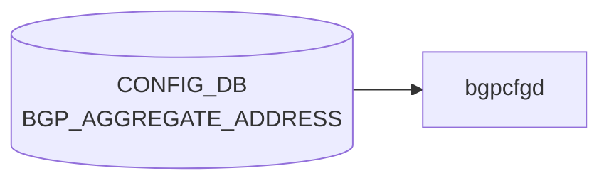

# BGP_AGGREGATE_ADDRESS テーブル

## 概要

[BGP](../../reference/glossary.md#term-bgp) aggregate-address (集約広告) の設定テーブル。`frr-mgmt-framework` または `bgpcfgd` テンプレ経路で `aggregate-address <prefix> [summary-only] [as-set] ...` に変換される[^1]。

!!! note "VRF スコープ"
    YANG 定義のキーは `aggregate-address` のみで VRF スコープが取れない。MR 由来の初期実装で、BGP_GLOBALS の default VRF に対する集約として扱われる前提。複数 VRF 対応については HLD / 実装と整合性検証が要 (本ページは YANG 定義のみを根拠とする)。

<!-- cdb-mermaid -->
### データフロー (自動生成)



!!! note "凡例"
    CONFIG_DB から SAI までの典型経路を `docs/reference/config-db-orch-map.md` から機械生成したミニ図。詳細・例外は本ページ本文と対応表を参照。
<!-- /cdb-mermaid -->

## key 構造

```text
BGP_AGGREGATE_ADDRESS|<aggregate-address>
```

`<aggregate-address>` は `inet:ip-prefix` (IPv4 / IPv6 prefix)。

## 主要フィールド

| フィールド | 型 | 既定 | 説明 |
|-----------|----|------|------|
| `bbr-required` | boolean | false | BBR (best route) entry が存在する場合のみ aggregate を生成 |
| `summary-only` | boolean | false | より詳細な経路を抑止し、集約のみ広告 |
| `as-set` | boolean | false | AS_SET path を含めて origin AS 情報を保持 |
| `aggregate-address-prefix-list` | string `[0-9a-zA-Z_-]*` (length 0..128) | "" | 集約に含める prefix を絞る prefix list |
| `contributing-address-prefix-list` | string `[0-9a-zA-Z_-]*` (length 0..128) | "" | contributing 経路を絞る prefix list |

## 購読者

- `frr-mgmt-framework`: [CONFIG_DB](../../reference/glossary.md#term-config_db) → [FRR](../../reference/glossary.md#term-frr) `aggregate-address` コマンド

## 関連 CONFIG_DB / YANG / CLI

- 関連 [CONFIG_DB](../../reference/glossary.md#term-config_db): `BGP_GLOBALS`、`PREFIX_SET`
- 関連 CLI: `vtysh -c "show ip bgp aggregate"`
- 関連 [YANG](../../reference/glossary.md#term-yang): `sonic-bgp-aggregate-address`

<!-- cdb-exceptions -->
## 例外条件・特殊挙動

| 条件 | 挙動 |
|------|------|
| prefix が不正な IP アドレス形式 | `validate_prefix()` が None → STATE_DB に `state=inactive`、FRR 未投入 |
| `bbr-required=true` かつ BBR 状態が不明 | STATE_DB に `state=inactive`、skip |
| `bbr-required=true` かつ BBR が disabled | STATE_DB に `state=inactive`、skip |
| BBR が enabled に変化 | bbr-required=true の全アドレスを STATE_DB から読み出して FRR に再投入 |
| BBR が disabled に変化 | bbr-required=true の全アドレスを FRR から削除、STATE_DB を inactive に更新 |
| DEL 操作で STATE_DB が `inactive` | FRR への削除コマンドをスキップ |
| `DEVICE_METADATA.localhost.bgp_asn` 未設定 | KeyError が上位に伝播 |
| FRR push 失敗 | STATE_DB に `state=inactive`、再試行なし |

<!-- evidence: sonic-net/sonic-buildimage/src/sonic-bgpcfgd/bgpcfgd/managers_aggregate_address.py:74L -->
<!-- /cdb-exceptions -->

<!-- value-behavior -->
## 値依存挙動マトリクス

### enum 型フィールド

該当無し (全フィールド boolean または freeform string)

### boolean フィールド

| フィールド | `true` の効果 | `false` の効果 | evidence |
|---|---|---|---|
| `summary-only` | FRR `aggregate-address <prefix> summary-only` を生成。contributing route を BGP UPDATE から抑制 | `summary-only` キーワードなし | `sonic-bgp-aggregate-address.yang; frr-mgmt-framework` |
| `as-set` | `aggregate-address <prefix> as-set` を生成。AS_SET path 属性を付与 | `as-set` キーワードなし | `sonic-bgp-aggregate-address.yang` |
| `bbr-required` | BBR (BGP Best Route) エントリが存在する場合のみ aggregate を生成 | BBR 状態に依存しない | `managers_aggregate_address.py:74` |

### 複合条件

- `bbr-required=true` かつ BBR `disabled` → `STATE_DB` に `state=inactive` を書き込み FRR への反映をスキップ (`managers_aggregate_address.py:80-81`)
- `summary-only=true` かつ contributing route が RIB に 0 本 → FRR で aggregate 生成されない (BGP 仕様)
<!-- /value-behavior -->

<!-- ref-triangle:start -->

## 関連リファレンス

- [YANG](../../reference/glossary.md#term-yang): [`sonic-bgp-aggregate-address`](../yang/sonic-bgp-aggregate-address.md)
- CLI: [`config bgp`](../cli/config-bgp.md)

<!-- ref-triangle:end -->

## 引用元

[^1]: [YANG](../../reference/glossary.md#term-yang) 定義: `sonic-bgp-aggregate-address.yang`. <https://github.com/sonic-net/sonic-buildimage/blob/9ea932ec2e18f35e58268ec2e4456b1d4afd65cd/src/sonic-yang-models/yang-models/sonic-bgp-aggregate-address.yang>

<!-- ops-hint -->
## 運用ヒント

### 典型値

- key 形式: `BGP_GLOBALS_AF_AGGREGATE_ADDR|<vrf>|<af>|<prefix>`。
- `as_set`: `false`、`summary_only`: `true`（詳細経路を抑制して集約のみ広告）。

### よくある誤設定

- `summary_only=true` のまま contributing route が無い状態で参照経路を期待しても集約広告されない。

### 確認コマンド

```bash
sonic-db-cli CONFIG_DB keys 'BGP_GLOBALS_AF_AGGREGATE_ADDR|*'
vtysh -c 'show bgp ipv4 unicast'
```
<!-- /ops-hint -->


<!-- runtime-trace -->
## 実コンテナ動作トレース

### 段階 1 — Consumer 登録

`bgpcfgd` が CONFIG_DB の `BGP_AGGREGATE_ADDRESS` テーブルを購読する。

`BGP_AGGREGATE_ADDRESS` は AF ごとの key `<vrf>|<prefix>` で管理。

### 段階 2 — CFG→APPL 翻訳

なし (FRR vtysh 経由)

### 段階 3 — APPL→SAI

なし (FRR が APPL_DB `ROUTE_TABLE` に集約ルートを注入 → `RouteOrch` → `sai_route_api`)

### 段階 4 — タイミングと副作用

**適用タイミング**: `bgpcfgd` が変化を検知後 FRR に `aggregate-address` コマンドを発行。BGP 経路集約は FRR の次回 BGP Update 送信タイミングで適用。

**副作用**: 集約ルートが FRR から BGP ピアに広告される。`summary-only` フラグ有無によりより細かいプレフィクスの withdraw が起こる。
<!-- /runtime-trace -->

<!-- entry-points -->
## 書き込み入り口 (Direction A)

対象テーブル: `BGP_AGGREGATE_ADDRESS`

### CLI
- `vtysh` 経由: `aggregate-address <prefix>` (FRR コンフィグ → bgpcfgd が CONFIG_DB へ書き戻し)
  - ソース: `sonic-buildimage/src/sonic-frr/patch (bgpcfgd)`

### minigraph / sonic-cfggen
- なし

### REST / gNMI (sonic-mgmt-common)
- sonic-mgmt-common OpenConfig BGP ポリシー経由

### db_migrator
- なし

### ビルド時デフォルト (init_cfg / j2 テンプレート)
- なし

### ハードコードデフォルト
- なし

### ランタイム注入 (デーモン自動書き込み)
- `bgpcfgd` が FRR running-config を読み CONFIG_DB と同期
<!-- /entry-points -->

<!-- ordering -->
## 書込み順依存 (Phase B)

> 調査対象: `sonic-buildimage/src/sonic-bgpcfgd/bgpcfgd/managers_aggregate_address.py` / `sonic-buildimage/src/sonic-frr-mgmt-framework/frrcfgd/frrcfgd.py`
> 調査日: 2026-05-16

### 他テーブル先行必須

| 先行テーブル / 条件 | 依存の内容 | コード根拠 |
|-------------------|-----------|-----------|
| `DEVICE_METADATA|localhost.bgp_asn` | `AggregateAddressMgr.__init__` の依存宣言で未解決の間は `set_handler` が呼ばれない。`address_set_handler` 冒頭で `directory.get_slot(...)["localhost"]["bgp_asn"]` を取得 (未設定で KeyError) | `managers_aggregate_address.py:33-40, 93` |
| `BGP_GLOBALS|<vrf>.local_asn` | frrcfgd は `local_asn is None` の VRF 配下の `BGP_GLOBALS_AF_AGGREGATE_ADDR` 更新を `continue` で**黙って捨てる** | `frrcfgd.py:2658-2662` |
| `BGP_GLOBALS_AF|<vrf>|<af>` | frrcfgd の table 列挙順で AF 宣言が aggregate より先に処理される。bgpd 側でも `address-family <af>` モード遷移後でないと `aggregate-address` を受け付けない | `frrcfgd.py:2139` / `managers_aggregate_address.py:241-250` |
| `BGP_BBR|all.status` (`bbr-required=true` の場合) | `bbr_status` が `enabled` / `disabled` 以外 (=未設定) かつ `bbr-required=true` のエントリは STATE_DB `inactive` に落とされ FRR 投入をスキップ | `managers_aggregate_address.py:73-83` |
| `ROUTE_MAP` / `PREFIX_SET` (`aggr-policy` 使用時のみ) | frrcfgd の `af_aggregate_key_map` が `{5:aggr-policy}` をルートマップ名に解決。ROUTE_MAP 未登録だと `aggregate-address ... route-map <name>` の属性付与が機能しない | `frrcfgd.py:1982-1983, 2669-2676` |

### bgpcfgd vtysh push 順序

`address_set_handler` は `cfg_mgr.push_list()` に以下の順で渡す。

1. `router bgp <asn>` → `address-family ipv4|ipv6` → `aggregate-address <prefix> [summary-only] [as-set]` → `exit-address-family` → `exit`
2. (`aggregate-address-prefix-list` 設定時) `ip|ipv6 prefix-list <name> permit <prefix>`
3. (`contributing-address-prefix-list` 設定時) `ip|ipv6 prefix-list <name> permit <prefix> le 32|128`

aggregate 本体 → prefix-list の順であり、中間状態では aggregate が未登録 prefix-list を参照する瞬間が存在する (bgpd の前方参照許容で動作)。

### 起動順 / 再起動時の挙動

| タイミング | 挙動 | コード根拠 |
|-----------|------|-----------|
| `AggregateAddressMgr.__init__` 末尾 | `remove_all_state_of_address()` で STATE_DB の `BGP_AGGREGATE_ADDRESS` を全削除 → CONFIG_DB 購読開始。bgpcfgd 再起動直後は STATE_DB 空。`inactive` の有無で readiness を判定してはならない | `managers_aggregate_address.py:42-44, 203-207` |
| `BGP_BBR.status` が `disabled` → `enabled` に遷移 | `on_bbr_change` が STATE_DB を走査し `bbr-required=true` の全 aggregate を FRR に再投入 | `managers_aggregate_address.py:46-56` |
| `BGP_BBR.status` が `enabled` → `disabled` に遷移 | 同じく走査し FRR から削除 + STATE_DB を `inactive` に | `managers_aggregate_address.py:57-61` |

### DEL 順依存

| 操作 | 必須順序 | コード根拠 |
|------|---------|-----------|
| `BGP_AGGREGATE_ADDRESS` DEL | STATE_DB が `inactive` の場合 FRR 削除コマンドをスキップ。`inactive` の判定が `set_address_state` 経由でしか書かれないため、CONFIG_DB と STATE_DB の整合が崩れていると削除漏れの可能性 | `managers_aggregate_address.py:138-146` |
| DEL の vtysh 順 | aggregate 本体 (`no aggregate-address ...`) → 関連 prefix-list (`no ip\|ipv6 prefix-list ...`) の順で `push_list` | `managers_aggregate_address.py:148-185` |

詳細根拠とスキャンログは intermediate メモ (`meta/_intermediate/cdb-flow/bgp-aggregate-address-ordering.md`) を参照。

<!-- evidence: sonic-net/sonic-buildimage/src/sonic-bgpcfgd/bgpcfgd/managers_aggregate_address.py:33 -->
<!-- evidence: sonic-net/sonic-buildimage/src/sonic-bgpcfgd/bgpcfgd/managers_aggregate_address.py:73 -->
<!-- evidence: sonic-net/sonic-buildimage/src/sonic-bgpcfgd/bgpcfgd/managers_aggregate_address.py:104 -->
<!-- evidence: sonic-net/sonic-buildimage/src/sonic-frr-mgmt-framework/frrcfgd/frrcfgd.py:2658 -->
<!-- evidence: sonic-net/sonic-buildimage/src/sonic-frr-mgmt-framework/frrcfgd/frrcfgd.py:1982 -->
<!-- /ordering -->

<!-- defaults -->
## フィールド暗黙デフォルト (Phase A コード由来)

YANG `default` 宣言に加えて、`bgpcfgd` (`managers_aggregate_address.py`) と `sonic-utilities` (`config/bgp_cli.py`) が独立して同値を `.get()` / `is_flag` で再定義している。全フィールドで三層 (YANG / bgpcfgd / CLI) が一致しており、フィールド欠落時の挙動は以下のとおり。

| フィールド | 暗黙デフォルト値 | コード fallback 箇所 | FRR への影響 |
|-----------|---------------|---------------------|-------------|
| `bbr-required` | `"false"` | `data.get(BBR_REQUIRED_KEY, COMMON_FALSE_STRING)` (L77, L210) | BBR 状態チェックをバイパス。常に FRR へ投入を試みる |
| `summary-only` | `"false"` | `data.get(SUMMARY_ONLY_KEY, COMMON_FALSE_STRING)` (L109, L212) | `aggregate-address <prefix>` のみ生成。`summary-only` キーワードなし |
| `as-set` | `"false"` | `data.get(AS_SET_KEY, COMMON_FALSE_STRING)` (L110, L213) | `as-set` キーワードなし |
| `aggregate-address-prefix-list` | `""` (空文字列) | `data.get(AGGREGATE_ADDRESS_PREFIX_LIST_KEY, "")` (L214); `default=""` in CLI | 空の場合 `generate_prefix_list_commands()` 未呼び出し。FRR prefix-list 設定なし |
| `contributing-address-prefix-list` | `""` (空文字列) | `data.get(CONTRIBUTING_ADDRESS_PREFIX_LIST_KEY, "")` (L215); `default=""` in CLI | 空の場合スキップ。非空の場合は IPv4 `le 32` / IPv6 `le 128` suffix が自動付与 |

### bbr_status の暗黙デフォルト

`BGP_BBR` テーブルが CONFIG_DB に存在しない場合、bgpcfgd は `bbr_status = ""` を設定する (L73-76)。この状態で `bbr-required=true` のエントリは `ADDRESS_INACTIVE_STATE` に落とされ FRR に反映されない。

<!-- evidence: sonic-net/sonic-buildimage/src/sonic-bgpcfgd/bgpcfgd/managers_aggregate_address.py -->
<!-- evidence: sonic-net/sonic-buildimage/src/sonic-yang-models/yang-models/sonic-bgp-aggregate-address.yang -->
<!-- evidence: sonic-net/sonic-utilities/config/bgp_cli.py -->
<!-- /defaults -->

<!-- platform -->
## プラットフォーム差

**プラットフォーム差なし**。`BGP_AGGREGATE_ADDRESS` の適用経路は FRR (ユーザ空間 `bgpd`) で完結し、SAI / ASIC SDK を直接呼び出さない。ASIC ベンダー・T0 / T1 / VOQ chassis・single-asic / multi-asic いずれの構成でも `bgpcfgd` の `AggregateAddressMgr` が CONFIG_DB を購読し `vtysh` 経由で `aggregate-address` を投入する経路は同一。

| 観点 | 差分有無 | 根拠 |
|------|---------|------|
| ASIC ベンダー (Broadcom / Mellanox / Marvell / Innovium / Barefoot) | なし | 集約は FRR `bgpd` で生成され、SAI route API はすべてのベンダーで共通の `RouteOrch` から呼ばれる |
| T0 / T1 / T2 / VOQ chassis | なし | `main.py` L105-106 の `AggregateAddressMgr` 登録は無条件 (`is_chassis()` 分岐は別マネージャ `ChassisAppDbMgr` のため) |
| single-asic / multi-asic | なし | `managers_aggregate_address.py` / `frrcfgd.py` を `platform / asic / chassis / multi_npu` で grep しても 0 ヒット |
| platform-specific j2 / hwsku 上書き | なし | `device/<vendor>/<platform>/` および `files/image_config/` に aggregate-address 差分なし |

詳細根拠は intermediate メモ (`meta/_intermediate/cdb-flow/bgp-aggregate-address-platform.md`) を参照。

<!-- evidence: sonic-net/sonic-buildimage/src/sonic-bgpcfgd/bgpcfgd/main.py:105 -->
<!-- evidence: sonic-net/sonic-buildimage/src/sonic-bgpcfgd/bgpcfgd/managers_aggregate_address.py -->
<!-- evidence: sonic-net/sonic-buildimage/src/sonic-frr-mgmt-framework/frrcfgd/frrcfgd.py:1313 -->
<!-- /platform -->

<!-- glossary-links-injected: 48d5f456ebb6 -->
