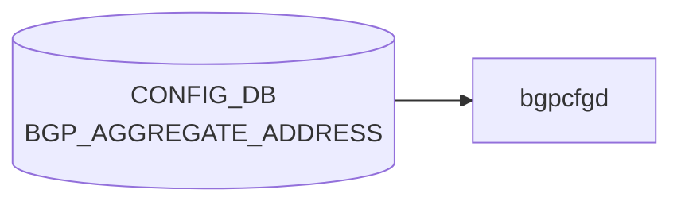

# BGP_AGGREGATE_ADDRESS テーブル

## 概要

[BGP](../../reference/glossary.md#term-bgp) aggregate-address (集約広告) の設定テーブル。`frr-mgmt-framework` または `bgpcfgd` テンプレ経路で `aggregate-address <prefix> [summary-only] [as-set] ...` に変換される[^1]。

!!! note "VRF スコープ"
    YANG 定義のキーは `aggregate-address` のみで VRF スコープが取れない。MR 由来の初期実装で、BGP_GLOBALS の default VRF に対する集約として扱われる前提。複数 VRF 対応については HLD / 実装と整合性検証が要 (本ページは YANG 定義のみを根拠とする)。

<!-- cdb-mermaid -->
### データフロー (自動生成)



!!! note "凡例"
    CONFIG_DB から SAI までの典型経路を `docs/reference/config-db-orch-map.md` から機械生成したミニ図。詳細・例外は本ページ本文と対応表を参照。
<!-- /cdb-mermaid -->

## key 構造

```text
BGP_AGGREGATE_ADDRESS|<aggregate-address>
```

`<aggregate-address>` は `inet:ip-prefix` (IPv4 / IPv6 prefix)。

## 主要フィールド

| フィールド | 型 | 既定 | 説明 |
|-----------|----|------|------|
| `bbr-required` | boolean | false | BBR (best route) entry が存在する場合のみ aggregate を生成 |
| `summary-only` | boolean | false | より詳細な経路を抑止し、集約のみ広告 |
| `as-set` | boolean | false | AS_SET path を含めて origin AS 情報を保持 |
| `aggregate-address-prefix-list` | string `[0-9a-zA-Z_-]*` (length 0..128) | "" | 集約に含める prefix を絞る prefix list |
| `contributing-address-prefix-list` | string `[0-9a-zA-Z_-]*` (length 0..128) | "" | contributing 経路を絞る prefix list |

## 購読者

- `frr-mgmt-framework`: [CONFIG_DB](../../reference/glossary.md#term-config_db) → [FRR](../../reference/glossary.md#term-frr) `aggregate-address` コマンド

## 関連 CONFIG_DB / YANG / CLI

- 関連 [CONFIG_DB](../../reference/glossary.md#term-config_db): `BGP_GLOBALS`、`PREFIX_SET`
- 関連 CLI: `vtysh -c "show ip bgp aggregate"`
- 関連 [YANG](../../reference/glossary.md#term-yang): `sonic-bgp-aggregate-address`

<!-- cdb-exceptions -->
## 例外条件・特殊挙動

| 条件 | 挙動 |
|------|------|
| prefix が不正な IP アドレス形式 | `validate_prefix()` が None → STATE_DB に `state=inactive`、FRR 未投入 |
| `bbr-required=true` かつ BBR 状態が不明 | STATE_DB に `state=inactive`、skip |
| `bbr-required=true` かつ BBR が disabled | STATE_DB に `state=inactive`、skip |
| BBR が enabled に変化 | bbr-required=true の全アドレスを STATE_DB から読み出して FRR に再投入 |
| BBR が disabled に変化 | bbr-required=true の全アドレスを FRR から削除、STATE_DB を inactive に更新 |
| DEL 操作で STATE_DB が `inactive` | FRR への削除コマンドをスキップ |
| `DEVICE_METADATA.localhost.bgp_asn` 未設定 | KeyError が上位に伝播 |
| FRR push 失敗 | STATE_DB に `state=inactive`、再試行なし |

<!-- evidence: sonic-net/sonic-buildimage/src/sonic-bgpcfgd/bgpcfgd/managers_aggregate_address.py:74L -->
<!-- /cdb-exceptions -->

<!-- value-behavior -->
## 値依存挙動マトリクス

### enum 型フィールド

該当無し (全フィールド boolean または freeform string)

### boolean フィールド

| フィールド | `true` の効果 | `false` の効果 | evidence |
|---|---|---|---|
| `summary-only` | FRR `aggregate-address <prefix> summary-only` を生成。contributing route を BGP UPDATE から抑制 | `summary-only` キーワードなし | `sonic-bgp-aggregate-address.yang; frr-mgmt-framework` |
| `as-set` | `aggregate-address <prefix> as-set` を生成。AS_SET path 属性を付与 | `as-set` キーワードなし | `sonic-bgp-aggregate-address.yang` |
| `bbr-required` | BBR (BGP Best Route) エントリが存在する場合のみ aggregate を生成 | BBR 状態に依存しない | `managers_aggregate_address.py:74` |

### 複合条件

- `bbr-required=true` かつ BBR `disabled` → `STATE_DB` に `state=inactive` を書き込み FRR への反映をスキップ (`managers_aggregate_address.py:80-81`)
- `summary-only=true` かつ contributing route が RIB に 0 本 → FRR で aggregate 生成されない (BGP 仕様)
<!-- /value-behavior -->

<!-- ref-triangle:start -->

## 関連リファレンス

- [YANG](../../reference/glossary.md#term-yang): [`sonic-bgp-aggregate-address`](../yang/sonic-bgp-aggregate-address.md)
- CLI: [`config bgp`](../cli/config-bgp.md)

<!-- ref-triangle:end -->

## 引用元

[^1]: [YANG](../../reference/glossary.md#term-yang) 定義: `sonic-bgp-aggregate-address.yang`. <https://github.com/sonic-net/sonic-buildimage/blob/9ea932ec2e18f35e58268ec2e4456b1d4afd65cd/src/sonic-yang-models/yang-models/sonic-bgp-aggregate-address.yang>

<!-- ops-hint -->
## 運用ヒント

### 典型値

- key 形式: `BGP_GLOBALS_AF_AGGREGATE_ADDR|<vrf>|<af>|<prefix>`。
- `as_set`: `false`、`summary_only`: `true`（詳細経路を抑制して集約のみ広告）。

### よくある誤設定

- `summary_only=true` のまま contributing route が無い状態で参照経路を期待しても集約広告されない。

### 確認コマンド

```bash
sonic-db-cli CONFIG_DB keys 'BGP_GLOBALS_AF_AGGREGATE_ADDR|*'
vtysh -c 'show bgp ipv4 unicast'
```
<!-- /ops-hint -->


<!-- runtime-trace -->
## 実コンテナ動作トレース

### 段階 1 — Consumer 登録

`bgpcfgd` が CONFIG_DB の `BGP_AGGREGATE_ADDRESS` テーブルを購読する。

`BGP_AGGREGATE_ADDRESS` は AF ごとの key `<vrf>|<prefix>` で管理。

### 段階 2 — CFG→APPL 翻訳

なし (FRR vtysh 経由)

### 段階 3 — APPL→SAI

なし (FRR が APPL_DB `ROUTE_TABLE` に集約ルートを注入 → `RouteOrch` → `sai_route_api`)

### 段階 4 — タイミングと副作用

**適用タイミング**: `bgpcfgd` が変化を検知後 FRR に `aggregate-address` コマンドを発行。BGP 経路集約は FRR の次回 BGP Update 送信タイミングで適用。

**副作用**: 集約ルートが FRR から BGP ピアに広告される。`summary-only` フラグ有無によりより細かいプレフィクスの withdraw が起こる。
<!-- /runtime-trace -->

<!-- entry-points -->
## 書き込み入り口 (Direction A)

対象テーブル: `BGP_AGGREGATE_ADDRESS`

### CLI
- `vtysh` 経由: `aggregate-address <prefix>` (FRR コンフィグ → bgpcfgd が CONFIG_DB へ書き戻し)
  - ソース: `sonic-buildimage/src/sonic-frr/patch (bgpcfgd)`

### minigraph / sonic-cfggen
- なし

### REST / gNMI (sonic-mgmt-common)
- sonic-mgmt-common OpenConfig BGP ポリシー経由

### db_migrator
- なし

### ビルド時デフォルト (init_cfg / j2 テンプレート)
- なし

### ハードコードデフォルト
- なし

### ランタイム注入 (デーモン自動書き込み)
- `bgpcfgd` が FRR running-config を読み CONFIG_DB と同期
<!-- /entry-points -->

<!-- derivation -->
## 派生・条件付き登録 (Phase 6/7)

### Phase 6: 自動派生

| 派生先フィールド/動作 | 派生元条件 | 派生値 | ソース |
|---|---|---|---|
| FRR `aggregate-address` コマンドの `summary-only` フラグ | `summary-only == "true"` | FRR コマンドに ` summary-only` を付与 | `managers_aggregate_address.py:245-246` |
| FRR `aggregate-address` コマンドの `as-set` フラグ | `as-set == "true"` | FRR コマンドに ` as-set` を付与 | `managers_aggregate_address.py:247-248` |
| STATE_DB `BGP_AGGREGATE_ADDRESS` エントリ | `bbr-required` フィールド値 | BBR 状態に応じて `ACTIVE` / `INACTIVE` を STATE_DB に書き込み | `managers_aggregate_address.py:85-89` |

**minigraph.py 由来の自動設定**: 該当なし

### Phase 7: 条件付き登録

| 条件 | 影響 | ソース |
|---|---|---|
| `AggregateAddressMgr` は常時登録 (bgpcfgd manager リストに無条件追加) | BBR 状態に関わらず購読は有効 | `bgpcfgd/main.py:106` |
| `bbr-required == "true"` かつ BBR 状態が `"enabled"` | `address_set_handler()` 呼び出し → FRR に適用 | `managers_aggregate_address.py:49-55` |
| `bbr-required == "true"` かつ BBR 状態が `"disabled"` | FRR から削除 (`address_del_handler`) → STATE_DB に INACTIVE | `managers_aggregate_address.py:57-61` |
| `bbr-required == "true"` かつ BBR 状態 unknown | スキップ → STATE_DB に INACTIVE | `managers_aggregate_address.py:78-80` |

### グレップカバレッジ

| 項目 | hit 数 | 証跡 |
|---|---|---|
| summary-only フラグ付与 | 1 | `managers_aggregate_address.py:245` |
| as-set フラグ付与 | 1 | `managers_aggregate_address.py:247` |
| BBR 状態分岐 | 3 | `managers_aggregate_address.py:49,57,78` |

<!-- /derivation -->

<!-- handler-branching -->
### Phase 8: Handler メソッド内分岐

BGP_AGGREGATE_ADDRESS は `AggregateAddressMgr.set_handler()` / `del_handler()` が処理する。

| Handler | メソッド | 分岐条件 | 効果 | evidence |
|---|---|---|---|---|
| `AggregateAddressMgr` | `set_handler()` | IP prefix パース失敗 | STATE_DB に INACTIVE を書き込み → return True | `managers_aggregate_address.py:69-72` |
| `AggregateAddressMgr` | `set_handler()` | `bbr-required == "true"` かつ BBR 状態 unknown | スキップ → INACTIVE | `managers_aggregate_address.py:78-80` |
| `AggregateAddressMgr` | `set_handler()` | `bbr-required == "true"` かつ BBR disabled | 削除 → INACTIVE | `managers_aggregate_address.py:81-83` |
| `AggregateAddressMgr` | `set_handler()` | それ以外 (bbr-required=false or BBR enabled) | `address_set_handler()` 呼び出し → ACTIVE/INACTIVE | `managers_aggregate_address.py:85-89` |
| `AggregateAddressMgr` | `del_handler()` | STATE_DB エントリが INACTIVE | 削除試行せず STATE_DB 削除のみ | `managers_aggregate_address.py:140-142` |
| `AggregateAddressMgr` | `del_handler()` | STATE_DB エントリが ACTIVE | `address_del_handler()` で FRR から削除 | `managers_aggregate_address.py:143-145` |
| `address_set_handler()` | 内部 | `summary_only == "true"` | FRR コマンドに `summary-only` 付与 | `managers_aggregate_address.py:245-246` |
| `address_set_handler()` | 内部 | `as_set == "true"` | FRR コマンドに `as-set` 付与 | `managers_aggregate_address.py:247-248` |

> **スキャン証跡**: `managers_aggregate_address.py` 全行読了、8 件分岐抽出。BBR 状態による 3-way 分岐が主要制御フロー。

<!-- /handler-branching -->

<!-- glossary-links-injected: 48d5f456ebb6 -->
