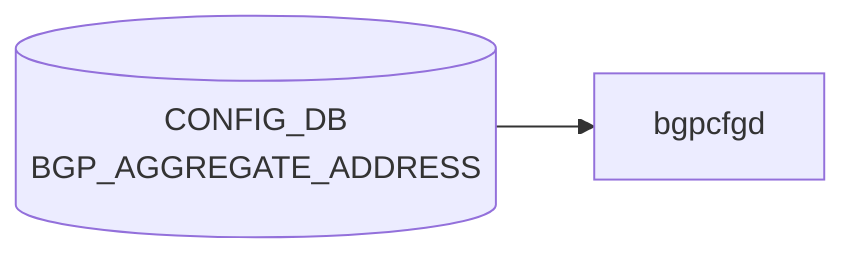

# BGP_AGGREGATE_ADDRESS テーブル

## 概要

[BGP](../../reference/glossary.md#term-bgp) aggregate-address (集約広告) の設定テーブル。`frr-mgmt-framework` または `bgpcfgd` テンプレ経路で `aggregate-address <prefix> [summary-only] [as-set] ...` に変換される[^1]。

!!! note "VRF スコープ"
    YANG 定義のキーは `aggregate-address` のみで VRF スコープが取れない。MR 由来の初期実装で、BGP_GLOBALS の default VRF に対する集約として扱われる前提。複数 VRF 対応については HLD / 実装と整合性検証が要 (本ページは YANG 定義のみを根拠とする)。

<!-- cdb-mermaid -->
### データフロー (自動生成)



!!! note "凡例"
    CONFIG_DB から SAI までの典型経路を `docs/reference/config-db-orch-map.md` から機械生成したミニ図。詳細・例外は本ページ本文と対応表を参照。
<!-- /cdb-mermaid -->

## key 構造

```text
BGP_AGGREGATE_ADDRESS|<aggregate-address>
```

`<aggregate-address>` は `inet:ip-prefix` (IPv4 / IPv6 prefix)。

## 主要フィールド

| フィールド | 型 | 既定 | 説明 |
|-----------|----|------|------|
| `bbr-required` | boolean | false | BBR (best route) entry が存在する場合のみ aggregate を生成 |
| `summary-only` | boolean | false | より詳細な経路を抑止し、集約のみ広告 |
| `as-set` | boolean | false | AS_SET path を含めて origin AS 情報を保持 |
| `aggregate-address-prefix-list` | string `[0-9a-zA-Z_-]*` (length 0..128) | "" | 集約に含める prefix を絞る prefix list |
| `contributing-address-prefix-list` | string `[0-9a-zA-Z_-]*` (length 0..128) | "" | contributing 経路を絞る prefix list |

## 購読者

- `frr-mgmt-framework`: [CONFIG_DB](../../reference/glossary.md#term-config_db) → [FRR](../../reference/glossary.md#term-frr) `aggregate-address` コマンド

## 関連 CONFIG_DB / YANG / CLI

- 関連 [CONFIG_DB](../../reference/glossary.md#term-config_db): `BGP_GLOBALS`、`PREFIX_SET`
- 関連 CLI: `vtysh -c "show ip bgp aggregate"`
- 関連 [YANG](../../reference/glossary.md#term-yang): `sonic-bgp-aggregate-address`

<!-- cdb-exceptions -->
## 例外条件・特殊挙動

| 条件 | 挙動 |
|------|------|
| prefix が不正な IP アドレス形式 | `validate_prefix()` が None → [STATE_DB](../../reference/glossary.md#term-state_db) に `state=inactive`、[FRR](../../reference/glossary.md#term-frr) 未投入 |
| `bbr-required=true` かつ BBR 状態が不明 | [STATE_DB](../../reference/glossary.md#term-state_db) に `state=inactive`、skip |
| `bbr-required=true` かつ BBR が disabled | [STATE_DB](../../reference/glossary.md#term-state_db) に `state=inactive`、skip |
| BBR が enabled に変化 | bbr-required=true の全アドレスを STATE_DB から読み出して [FRR](../../reference/glossary.md#term-frr) に再投入 |
| BBR が disabled に変化 | bbr-required=true の全アドレスを FRR から削除、STATE_DB を inactive に更新 |
| DEL 操作で STATE_DB が `inactive` | FRR への削除コマンドをスキップ |
| `DEVICE_METADATA.localhost.bgp_asn` 未設定 | KeyError が上位に伝播 |
| FRR push 失敗 | STATE_DB に `state=inactive`、再試行なし |

<!-- evidence: sonic-net/sonic-buildimage/src/sonic-bgpcfgd/bgpcfgd/managers_aggregate_address.py:74L -->
<!-- /cdb-exceptions -->

<!-- value-behavior -->
## 値依存挙動マトリクス

### enum 型フィールド

該当無し (全フィールド boolean または freeform string)

### boolean フィールド

| フィールド | `true` の効果 | `false` の効果 | evidence |
|---|---|---|---|
| `summary-only` | FRR `aggregate-address <prefix> summary-only` を生成。contributing route を [BGP](../../reference/glossary.md#term-bgp) UPDATE から抑制 | `summary-only` キーワードなし | `sonic-bgp-aggregate-address.yang; frr-mgmt-framework` |
| `as-set` | `aggregate-address <prefix> as-set` を生成。AS_SET path 属性を付与 | `as-set` キーワードなし | `sonic-bgp-aggregate-address.yang` |
| `bbr-required` | BBR ([BGP](../../reference/glossary.md#term-bgp) Best Route) エントリが存在する場合のみ aggregate を生成 | BBR 状態に依存しない | `managers_aggregate_address.py:74` |

### 複合条件

- `bbr-required=true` かつ BBR `disabled` → `STATE_DB` に `state=inactive` を書き込み FRR への反映をスキップ (`managers_aggregate_address.py:80-81`)
- `summary-only=true` かつ contributing route が RIB に 0 本 → FRR で aggregate 生成されない (BGP 仕様)
<!-- /value-behavior -->

<!-- cross-refs -->
## 暗黙参照テーブル

`BGP_AGGREGATE_ADDRESS` の YANG (`sonic-bgp-aggregate-address.yang`) には leafref 宣言がない。以下はすべて `bgpcfgd` (`managers_aggregate_address.py`) および参考として `frr-mgmt-framework` (`frrcfgd.py`) の実装レベル暗黙参照。

| 参照先テーブル / リソース | 参照方向 | 条件 | 参照元 evidence |
|--------------------------|---------|------|----------------|
| `DEVICE_METADATA\|localhost.bgp_asn` | 購読 + 読み取り（必須） | 常時。set/del いずれの handler も先頭で参照 | `managers_aggregate_address.py` L36 (subscribe), L93 / L149 (`directory.get_slot`) |
| `BGP_BBR.bbr_status` | 購読 + 読み取り（条件付き） | `bbr-required=true` のエントリのみ実害あり。状態変化で STATE_DB / FRR 同期 | `managers_aggregate_address.py` L41 (subscribe + `on_bbr_change`), L73-83 (set_handler 内分岐) |
| FRR `ip prefix-list <name>` (出力先) | 書き込み | `aggregate-address-prefix-list` / `contributing-address-prefix-list` が非空のとき | `managers_aggregate_address.py` L114-132, L255-264 (`generate_prefix_list_commands`) |
| `BGP_GLOBALS.local_asn` / `vrf` (frrcfgd 経路) | 読み取り（必須） | `BGP_GLOBALS_AF_AGGREGATE_ADDR` テーブル経由のみ。`BGP_AGGREGATE_ADDRESS` ([bgpcfgd](../../reference/glossary.md#term-bgpcfgd) 経路) では非該当 | `frrcfgd.py` L3161-3163, L3179-3181 (`cmd_prefix`) |
| `BGP_GLOBALS_AF` (frrcfgd 経路) | 読み取り（必須） | `BGP_GLOBALS_AF_AGGREGATE_ADDR` テーブル経由のみ。address-family コンテキスト生成 | `frrcfgd.py` L3171, L3181 |
| `ROUTE_MAP` (frrcfgd 経路) | 値参照（条件付き） | `BGP_GLOBALS_AF_AGGREGATE_ADDR.policy` 非空時。`aggregate-address ... route-map <name>` に展開 | `frrcfgd.py` L1982-1983, L928-930 (`aggr-policy` フォーマッタ) |

!!! note "2 経路の差分"
    本ページが対象とする `BGP_AGGREGATE_ADDRESS` テーブル (bgpcfgd 経路) は VRF を取らず default VRF 固定で、`DEVICE_METADATA.bgp_asn` のみを直接購読する。
    一方 `frr-mgmt-framework` が扱う別テーブル `BGP_GLOBALS_AF_AGGREGATE_ADDR` (VRF/AF 分離) は `BGP_GLOBALS` / `BGP_GLOBALS_AF` / `ROUTE_MAP` への暗黙依存を持つ。
    関連 CONFIG_DB の `BGP_GLOBALS` リンク (frontmatter) は後者経路を念頭に置いたもの。

!!! note "prefix-list フィールドと PREFIX_SET の関係"
    `aggregate-address-prefix-list` / `contributing-address-prefix-list` は `bgpcfgd` が FRR `ip prefix-list <name>` を**直接生成**するための名前であり、CONFIG_DB の `PREFIX_SET` テーブルから値を引くわけではない。`PREFIX_SET` テーブルとは独立した FRR 名前空間として運用される (`generate_prefix_list_commands` L255-264)。

<!-- evidence: sonic-net/sonic-buildimage/src/sonic-bgpcfgd/bgpcfgd/managers_aggregate_address.py -->
<!-- evidence: sonic-net/sonic-buildimage/src/sonic-frr-mgmt-framework/frrcfgd/frrcfgd.py -->
<!-- /cross-refs -->

<!-- ref-triangle:start -->

## 関連リファレンス

- [YANG](../../reference/glossary.md#term-yang): [`sonic-bgp-aggregate-address`](../yang/sonic-bgp-aggregate-address.md)
- CLI: [`config bgp`](../cli/config-bgp.md)

<!-- ref-triangle:end -->

## 引用元

[^1]: [YANG](../../reference/glossary.md#term-yang) 定義: `sonic-bgp-aggregate-address.yang`. <https://github.com/sonic-net/sonic-buildimage/blob/9ea932ec2e18f35e58268ec2e4456b1d4afd65cd/src/sonic-yang-models/yang-models/sonic-bgp-aggregate-address.yang>

<!-- ops-hint -->
## 運用ヒント

### 典型値

- key 形式: `BGP_AGGREGATE_ADDRESS|<aggregate-address>`。
- `as-set`: `false`、`summary-only`: `true`（詳細経路を抑制して集約のみ広告）。

### よくある誤設定

- `summary-only=true` のまま contributing route が無い状態で参照経路を期待しても集約広告されない。

### 確認コマンド

```bash
sonic-db-cli CONFIG_DB keys 'BGP_AGGREGATE_ADDRESS|*'
vtysh -c 'show bgp ipv4 unicast'
```
<!-- /ops-hint -->

<!-- runtime-trace -->
## 実コンテナ動作トレース

### 段階 1 — Consumer 登録

`bgpcfgd` が [CONFIG_DB](../../reference/glossary.md#term-config_db) の `BGP_AGGREGATE_ADDRESS` テーブルを購読する。

`BGP_AGGREGATE_ADDRESS` は AF ごとの key `<vrf>|<prefix>` で管理。

### 段階 2 — CFG→APPL 翻訳

なし (FRR [vtysh](../../reference/glossary.md#term-vtysh) 経由)

### 段階 3 — APPL→SAI

なし (FRR が [APPL_DB](../../reference/glossary.md#term-appl_db) `ROUTE_TABLE` に集約ルートを注入 → `RouteOrch` → `sai_route_api`)

### 段階 4 — タイミングと副作用

**適用タイミング**: `bgpcfgd` が変化を検知後 FRR に `aggregate-address` コマンドを発行。BGP 経路集約は FRR の次回 BGP Update 送信タイミングで適用。

**副作用**: 集約ルートが FRR から BGP ピアに広告される。`summary-only` フラグ有無によりより細かいプレフィクスの withdraw が起こる。
<!-- /runtime-trace -->

<!-- pubsub -->
## 通信メカニズム

### Producer/Consumer ペア

`BGP_AGGREGATE_ADDRESS` テーブルは CONFIG_DB → [bgpcfgd](../../reference/glossary.md#term-bgpcfgd) → FRR [vtysh](../../reference/glossary.md#term-vtysh) の経路をとる。[APPL_DB](../../reference/glossary.md#term-appl_db) / [SAI](../../reference/glossary.md#term-sai) への中継は無く、STATE_DB は [bgpcfgd](../../reference/glossary.md#term-bgpcfgd) 自身が `swsscommon.Table` で直接書き込む。

| 区間 | 方式 | チャンネル/パターン |
|------|------|--------------------|
| CONFIG_DB → bgpcfgd | `SubscriberStateTable` | `__keyspace@{config_db_id}__:BGP_AGGREGATE_ADDRESS\|*` |
| bgpcfgd → STATE_DB | `swsscommon.Table` (HSET 直接) | `BGP_AGGREGATE_ADDRESS\|<prefix>` (`state=active/inactive`) |
| bgpcfgd → FRR | [vtysh](../../reference/glossary.md#term-vtysh) コマンド発行 | `aggregate-address <prefix> [summary-only] [as-set]` |
| BGP_BBR.status → bgpcfgd | `directory.subscribe()` (in-process callback) | `on_bbr_change()` |

### SubscriberStateTable の動作

`Runner.add_manager()` (`runner.py:31-52`) は `AggregateAddressMgr` 登録時に `SubscriberStateTable(conn, "BGP_AGGREGATE_ADDRESS")` を生成し、`PSUBSCRIBE __keyspace@<config_db_id>__:BGP_AGGREGATE_ADDRESS|*` を発行する。コンストラクタは PSUBSCRIBE 後に `m_table.getKeys()` で既存エントリを `SET` イベントとして再生し、bgpcfgd 起動前に書かれたエントリも取りこぼさない。

### select() ループと handler dispatch

`Runner.run()` (`runner.py:54-73`) は `swsscommon.Select` を `SELECT_TIMEOUT=1000ms` で回す。イベント到着時、全 subscriber を `pop()` で key=None までドレインし、登録済 callback (`Manager.handler`) を呼び出す。ドレイン完了後 `cfg_manager.commit()` で FRR vtysh へバッチ発行する。

`Manager.handler()` (`manager.py:34-53`) は op で分岐する:

1. `SET` かつ全依存 (`DEVICE_METADATA.localhost/bgp_asn`) 解決済 → `AggregateAddressMgr.set_handler()` 即時実行
2. `SET` かつ依存未解決 → `set_queue` に積み、`on_deps_change()` で再試行
3. `DEL` → `AggregateAddressMgr.del_handler()` 直接呼出

### BGP_BBR との横方向連携

`AggregateAddressMgr.__init__` (`managers_aggregate_address.py:41`) で `directory.subscribe([(CONFIG_DB, BGP_BBR, status)], self.on_bbr_change)` を登録する。BGP_BBR の `status` が `enabled` / `disabled` に切り替わると、STATE_DB から `bbr-required=true` の全エントリを読み出して FRR への再投入 / 削除を実施する (keyspace ではなく bgpcfgd in-process `directory` 経由)。

### retry メカニズム

`bgp_asn` 未設定で `set_handler` を即実行できない場合は `set_queue` に積まれ、`DEVICE_METADATA.localhost/bgp_asn` の到着時に `on_deps_change()` が再試行する。`set_handler` 自体は常に `True` を返すため、検証失敗・FRR push 失敗は再試行されず `state=inactive` を STATE_DB に書いて沈黙する (recoverable retry なし)。

### データフロー図

```
CONFIG_DB[BGP_AGGREGATE_ADDRESS|<prefix>]
  ↓ SubscriberStateTable (keyspace notification)
  ↓ PSUBSCRIBE __keyspace@config_db_id__:BGP_AGGREGATE_ADDRESS|*
bgpcfgd Runner select() loop (SELECT_TIMEOUT=1000ms)
  ↓ subscriber.pop() → callback dispatch
  ↓ Manager.handler(key, op, data)
  ↓   [op==SET] → 依存 (bgp_asn) ガード → AggregateAddressMgr.set_handler()
  ↓   [op==DEL] → AggregateAddressMgr.del_handler()
  ↓
  ├─→ STATE_DB[BGP_AGGREGATE_ADDRESS|<prefix>] state=active/inactive (swsscommon.Table)
  └─→ cfg_mgr.push("aggregate-address <prefix> [summary-only] [as-set]")
       ↓ Runner.run() 末尾の cfg_manager.commit()
       ↓ vtysh -c ...
      FRR bgpd (BGP UPDATE 経由で peer に集約広告)

APPL_DB 書き込み: なし (FRR 経由で APPL_DB ROUTE_TABLE に副次反映)
ASIC_DB 書き込み: なし (RouteOrch 経由で間接反映)
NotificationConsumer: なし
```

<!-- evidence: sonic-net/sonic-buildimage/src/sonic-bgpcfgd/bgpcfgd/managers_aggregate_address.py:23-44 -->
<!-- evidence: sonic-net/sonic-buildimage/src/sonic-bgpcfgd/bgpcfgd/runner.py:31-73 -->
<!-- evidence: sonic-net/sonic-buildimage/src/sonic-bgpcfgd/bgpcfgd/manager.py:34-64 -->
<!-- /pubsub -->

<!-- entry-points -->
## 書き込み入り口

対象テーブル: `BGP_AGGREGATE_ADDRESS`

### CLI
- `vtysh` 経由: `aggregate-address <prefix>` (FRR コンフィグ → bgpcfgd が CONFIG_DB へ書き戻し)
  - ソース: `sonic-buildimage/src/sonic-frr/patch (bgpcfgd)`

### minigraph / sonic-cfggen
- なし

### REST / gNMI (sonic-mgmt-common)
- [sonic-mgmt](../../reference/glossary.md#term-sonic-mgmt)-common OpenConfig BGP ポリシー経由

### db_migrator
- なし

### ビルド時デフォルト (init_cfg / j2 テンプレート)
- なし

### ハードコードデフォルト
- なし

### ランタイム注入 (デーモン自動書き込み)
- `bgpcfgd` が FRR running-config を読み CONFIG_DB と同期
<!-- /entry-points -->

<!-- ordering -->
## 書込み順依存

> 調査対象: `sonic-buildimage/src/sonic-bgpcfgd/bgpcfgd/managers_aggregate_address.py` / `sonic-buildimage/src/sonic-frr-mgmt-framework/frrcfgd/frrcfgd.py`
> 調査日: 2026-05-16

### 他テーブル先行必須

| 先行テーブル / 条件 | 依存の内容 | コード根拠 |
|-------------------|-----------|-----------|
| `DEVICE_METADATA|localhost.bgp_asn` | `AggregateAddressMgr.__init__` の依存宣言で未解決の間は `set_handler` が呼ばれない。`address_set_handler` 冒頭で `directory.get_slot(...)["localhost"]["bgp_asn"]` を取得 (未設定で KeyError) | `managers_aggregate_address.py:33-40, 93` |
| `BGP_GLOBALS|<vrf>.local_asn` | frrcfgd は `local_asn is None` の [VRF](../../reference/glossary.md#term-vrf) 配下の `BGP_GLOBALS_AF_AGGREGATE_ADDR` 更新を `continue` で**黙って捨てる** | `frrcfgd.py:2658-2662` |
| `BGP_GLOBALS_AF|<vrf>|<af>` | frrcfgd の table 列挙順で AF 宣言が aggregate より先に処理される。bgpd 側でも `address-family <af>` モード遷移後でないと `aggregate-address` を受け付けない | `frrcfgd.py:2139` / `managers_aggregate_address.py:241-250` |
| `BGP_BBR|all.status` (`bbr-required=true` の場合) | `bbr_status` が `enabled` / `disabled` 以外 (=未設定) かつ `bbr-required=true` のエントリは STATE_DB `inactive` に落とされ FRR 投入をスキップ | `managers_aggregate_address.py:73-83` |
| `ROUTE_MAP` / `PREFIX_SET` (`aggr-policy` 使用時のみ) | frrcfgd の `af_aggregate_key_map` が `{5:aggr-policy}` をルートマップ名に解決。[ROUTE_MAP](../../reference/glossary.md#term-route_map) 未登録だと `aggregate-address ... route-map <name>` の属性付与が機能しない | `frrcfgd.py:1982-1983, 2669-2676` |

### bgpcfgd vtysh push 順序

`address_set_handler` は `cfg_mgr.push_list()` に以下の順で渡す。

1. `router bgp <asn>` → `address-family ipv4|ipv6` → `aggregate-address <prefix> [summary-only] [as-set]` → `exit-address-family` → `exit`
2. (`aggregate-address-prefix-list` 設定時) `ip|ipv6 prefix-list <name> permit <prefix>`
3. (`contributing-address-prefix-list` 設定時) `ip|ipv6 prefix-list <name> permit <prefix> le 32|128`

aggregate 本体 → prefix-list の順であり、中間状態では aggregate が未登録 prefix-list を参照する瞬間が存在する (bgpd の前方参照許容で動作)。

### 起動順 / 再起動時の挙動

| タイミング | 挙動 | コード根拠 |
|-----------|------|-----------|
| `AggregateAddressMgr.__init__` 末尾 | `remove_all_state_of_address()` で STATE_DB の `BGP_AGGREGATE_ADDRESS` を全削除 → CONFIG_DB 購読開始。bgpcfgd 再起動直後は STATE_DB 空。`inactive` の有無で readiness を判定してはならない | `managers_aggregate_address.py:42-44, 203-207` |
| `BGP_BBR.status` が `disabled` → `enabled` に遷移 | `on_bbr_change` が STATE_DB を走査し `bbr-required=true` の全 aggregate を FRR に再投入 | `managers_aggregate_address.py:46-56` |
| `BGP_BBR.status` が `enabled` → `disabled` に遷移 | 同じく走査し FRR から削除 + STATE_DB を `inactive` に | `managers_aggregate_address.py:57-61` |

### DEL 順依存

| 操作 | 必須順序 | コード根拠 |
|------|---------|-----------|
| `BGP_AGGREGATE_ADDRESS` DEL | STATE_DB が `inactive` の場合 FRR 削除コマンドをスキップ。`inactive` の判定が `set_address_state` 経由でしか書かれないため、CONFIG_DB と STATE_DB の整合が崩れていると削除漏れの可能性 | `managers_aggregate_address.py:138-146` |
| DEL の vtysh 順 | aggregate 本体 (`no aggregate-address ...`) → 関連 prefix-list (`no ip\|ipv6 prefix-list ...`) の順で `push_list` | `managers_aggregate_address.py:148-185` |


<!-- evidence: sonic-net/sonic-buildimage/src/sonic-bgpcfgd/bgpcfgd/managers_aggregate_address.py:33 -->
<!-- evidence: sonic-net/sonic-buildimage/src/sonic-bgpcfgd/bgpcfgd/managers_aggregate_address.py:73 -->
<!-- evidence: sonic-net/sonic-buildimage/src/sonic-bgpcfgd/bgpcfgd/managers_aggregate_address.py:104 -->
<!-- evidence: sonic-net/sonic-buildimage/src/sonic-frr-mgmt-framework/frrcfgd/frrcfgd.py:2658 -->
<!-- evidence: sonic-net/sonic-buildimage/src/sonic-frr-mgmt-framework/frrcfgd/frrcfgd.py:1982 -->
<!-- /ordering -->

<!-- defaults -->
## フィールド暗黙デフォルト (コード由来)

YANG `default` 宣言に加えて、`bgpcfgd` (`managers_aggregate_address.py`) と `sonic-utilities` (`config/bgp_cli.py`) が独立して同値を `.get()` / `is_flag` で再定義している。全フィールドで三層 (YANG / bgpcfgd / CLI) が一致しており、フィールド欠落時の挙動は以下のとおり。

| フィールド | 暗黙デフォルト値 | コード fallback 箇所 | FRR への影響 |
|-----------|---------------|---------------------|-------------|
| `bbr-required` | `"false"` | `data.get(BBR_REQUIRED_KEY, COMMON_FALSE_STRING)` (L77, L210) | BBR 状態チェックをバイパス。常に FRR へ投入を試みる |
| `summary-only` | `"false"` | `data.get(SUMMARY_ONLY_KEY, COMMON_FALSE_STRING)` (L109, L212) | `aggregate-address <prefix>` のみ生成。`summary-only` キーワードなし |
| `as-set` | `"false"` | `data.get(AS_SET_KEY, COMMON_FALSE_STRING)` (L110, L213) | `as-set` キーワードなし |
| `aggregate-address-prefix-list` | `""` (空文字列) | `data.get(AGGREGATE_ADDRESS_PREFIX_LIST_KEY, "")` (L214); `default=""` in CLI | 空の場合 `generate_prefix_list_commands()` 未呼び出し。FRR prefix-list 設定なし |
| `contributing-address-prefix-list` | `""` (空文字列) | `data.get(CONTRIBUTING_ADDRESS_PREFIX_LIST_KEY, "")` (L215); `default=""` in CLI | 空の場合スキップ。非空の場合は IPv4 `le 32` / IPv6 `le 128` suffix が自動付与 |

### bbr_status の暗黙デフォルト

`BGP_BBR` テーブルが CONFIG_DB に存在しない場合、bgpcfgd は `bbr_status = ""` を設定する (L73-76)。この状態で `bbr-required=true` のエントリは `ADDRESS_INACTIVE_STATE` に落とされ FRR に反映されない。

<!-- evidence: sonic-net/sonic-buildimage/src/sonic-bgpcfgd/bgpcfgd/managers_aggregate_address.py -->
<!-- evidence: sonic-net/sonic-buildimage/src/sonic-yang-models/yang-models/sonic-bgp-aggregate-address.yang -->
<!-- evidence: sonic-net/sonic-utilities/config/bgp_cli.py -->
<!-- /defaults -->

<!-- platform -->
## プラットフォーム差

**プラットフォーム差なし**。`BGP_AGGREGATE_ADDRESS` の適用経路は FRR (ユーザ空間 `bgpd`) で完結し、[SAI](../../reference/glossary.md#term-sai) / [ASIC SDK](../../reference/glossary.md#term-asic-sdk) を直接呼び出さない。[ASIC](../../reference/glossary.md#term-asic) ベンダー・T0 / T1 / [VOQ](../../reference/glossary.md#term-voq) chassis・single-asic / multi-asic いずれの構成でも `bgpcfgd` の `AggregateAddressMgr` が CONFIG_DB を購読し `vtysh` 経由で `aggregate-address` を投入する経路は同一。

| 観点 | 差分有無 | 根拠 |
|------|---------|------|
| [ASIC](../../reference/glossary.md#term-asic) ベンダー (Broadcom / Mellanox / Marvell / Innovium / Barefoot) | なし | 集約は FRR `bgpd` で生成され、[SAI](../../reference/glossary.md#term-sai) route API はすべてのベンダーで共通の `RouteOrch` から呼ばれる |
| T0 / T1 / T2 / [VOQ](../../reference/glossary.md#term-voq) chassis | なし | `main.py` L105-106 の `AggregateAddressMgr` 登録は無条件 (`is_chassis()` 分岐は別マネージャ `ChassisAppDbMgr` のため) |
| single-asic / multi-asic | なし | `managers_aggregate_address.py` / `frrcfgd.py` を `platform / asic / chassis / multi_npu` で grep しても 0 ヒット |
| platform-specific j2 / hwsku 上書き | なし | `device/<vendor>/<platform>/` および `files/image_config/` に aggregate-address 差分なし |


<!-- evidence: sonic-net/sonic-buildimage/src/sonic-bgpcfgd/bgpcfgd/main.py:105 -->
<!-- evidence: sonic-net/sonic-buildimage/src/sonic-bgpcfgd/bgpcfgd/managers_aggregate_address.py -->
<!-- evidence: sonic-net/sonic-buildimage/src/sonic-frr-mgmt-framework/frrcfgd/frrcfgd.py:1313 -->
<!-- /platform -->

<!-- failure -->
## 失敗挙動

### 失敗パス一覧

| # | トリガー | 発生箇所 | 結果 | retry |
|---|---------|---------|------|-------|
| 1 | 不正な prefix (`/` 無し / `strict=True` でない) | `validate_prefix()` → `set_handler` L65-72 | `STATE_DB` に `state=inactive`、FRR 未投入 | なし |
| 2 | FRR push 失敗 (`vtysh -f` rc != 0) | `FRR.write()` → `ConfigMgr.commit()` False | ログ出力のみ。エントリ単位の rollback なし | なし |
| 3 | `bbr-required=true` かつ BBR 状態不明 / disabled | `set_handler` L78-83 | `state=inactive`、FRR 未投入 | イベント駆動 (`on_bbr_change`) |
| 4 | BBR `disabled`→`enabled` 遷移 | `on_bbr_change` L46-56 | 全 `bbr-required=true` エントリを再投入 | (これ自体が唯一の retry トリガ) |
| 5 | `DEVICE_METADATA.localhost.bgp_asn` 未取得 | `address_set_handler` L93 (dict 参照) | `KeyError` が上位に伝播 | なし |
| 6 | DEL で `state=inactive` | `del_handler` L140-142 | FRR への no コマンド skip、STATE_DB のみ削除 | — |
| 7 | [ROUTE_MAP](../../reference/glossary.md#term-route_map) 不在で `policy` 参照 (frrcfgd 経路) | `hdl_af_aggregate` → bgpd 構文エラー | syslog DEBUG のみ、bgpd 未反映、[ROUTE_MAP](../../reference/glossary.md#term-route_map) 後追い定義で自動再投入なし | なし |
| 8 | bgpd vty socket 接続失敗 (起動時) | `__create_frr_client` L184-200 | 2秒間隔で 100 回 retry、超過で `RuntimeError` | 100 回 / 2秒 |
| 9 | bgpd コマンド送信中の socket error | `__proc_command` L261-265 | 当該コマンド false、syslog ERR、CONFIG_DB は残存 | なし |

### retry の唯一の自動トリガ

`AggregateAddressMgr` に周期 retry は存在せず、唯一の自動再投入トリガは `BGP_BBR/STATUS` の状態遷移を観測する `on_bbr_change()` のみ。BBR `enabled` 遷移時に `bbr-required=true` の inactive エントリが全件再投入される (`managers_aggregate_address.py:46-56`)。<!-- evidence: managers_aggregate_address.py L46-63 -->

### FRR push 失敗時の実装ギャップ

`address_set_handler()` は内部で FRR の commit 結果を確認せず常に `True` を返す (L136)。結果として `set_handler` L85 の分岐で `set_address_state(..., ACTIVE)` が記録されるため、**`vtysh -f` レベルで構文エラーや投入失敗が起きても STATE_DB は `active` のまま**となる。実際の失敗検出は `ConfigMgr.commit()` → `FRR.write()` のログ出力 (`frr.py:50-51`) に限定される。

```text
log_err("ConfigMgr::commit(): can't push configuration from file='%s', rc='%d', stdout='%s', stderr='%s'" % err_tuple)
```

### ROUTE_MAP 順序依存

`frr-mgmt-framework` の `hdl_af_aggregate()` は `ROUTE_MAP` テーブルの存在検証を行わず、`{5:aggr-policy}` をそのまま `route-map <name>` に展開して bgpd に流し込む (`frrcfgd.py:928-930, 1313-1328`)。route-map 未定義のまま `BGP_GLOBALS_AF_AGGREGATE_ADDR` に `policy=<name>` を SET すると bgpd 側で構文エラーになるが、frr-mgmt-framework は ack 待ちのみで再投入トリガを持たない。**ROUTE_MAP を後から定義しても aggregate-address は自動再投入されない**ため、ユーザ側で aggregate-address エントリを SET し直す必要がある。

### bgpd ソケット失敗時の retry 戦略

起動時 `/run/frr/<daemon>.vty` への connect は 2 秒間隔で最大 100 回 retry (`frrcfgd.py:186-200`)。超過すると `RuntimeError('connect to FRR daemon failed')` で frrcfgd 自体が起動失敗し、`BGP_GLOBALS_AF_AGGREGATE_ADDR` を含む全 BGP テーブル更新が反映されない。**運用中の socket error (送信途中) には自動再接続が無く**、frrcfgd プロセス再起動が必要 (`__proc_command` L261-265 は当該コマンドのみ skip)。

### STATE_DB / syslog への記録

- `STATE_DB.BGP_AGGREGATE_ADDRESS|<prefix>` に `state=active|inactive` を記録 (`set_address_state` L209-216)
- FRR push 失敗・socket error 等はすべて syslog のみ
- ERROR_TABLE への記録はなし

```bash
# 状態確認
sonic-db-cli STATE_DB hgetall 'BGP_AGGREGATE_ADDRESS|10.0.0.0/24'
# 失敗ログ
journalctl -u bgp | grep -iE 'aggregate|frr daemon'
```


<!-- evidence: sonic-net/sonic-buildimage/src/sonic-bgpcfgd/bgpcfgd/managers_aggregate_address.py:65 -->
<!-- evidence: sonic-net/sonic-buildimage/src/sonic-bgpcfgd/bgpcfgd/managers_aggregate_address.py:46 -->
<!-- evidence: sonic-net/sonic-buildimage/src/sonic-bgpcfgd/bgpcfgd/frr.py:42 -->
<!-- evidence: sonic-net/sonic-buildimage/src/sonic-frr-mgmt-framework/frrcfgd/frrcfgd.py:181 -->
<!-- evidence: sonic-net/sonic-buildimage/src/sonic-frr-mgmt-framework/frrcfgd/frrcfgd.py:1313 -->
<!-- /failure -->

<!-- constants -->
## ハードコード定数

`bgpcfgd` (`managers_aggregate_address.py`) と `frr-mgmt-framework` (`frrcfgd.py`) が CONFIG_DB / STATE_DB のフィールド名・FRR vtysh コマンドリテラル・プレフィクス長上限を module-level / 関数内リテラルとしてハードコード保持する。YANG / CONFIG_DB から変更できない値はここに集約される。

### CONFIG_DB / STATE_DB キー定数（bgpcfgd module-level）

| 定数 | 値 | 用途 | ソース |
|---|---|---|---|
| `BGP_AGGREGATE_ADDRESS_TABLE_NAME` | `"BGP_AGGREGATE_ADDRESS"` | CONFIG_DB / STATE_DB テーブル名 | `managers_aggregate_address.py:10` |
| `BBR_REQUIRED_KEY` / `AS_SET_KEY` / `SUMMARY_ONLY_KEY` | `"bbr-required"` / `"as-set"` / `"summary-only"` | フィールド名（FRR キーワードと同名） | `managers_aggregate_address.py:11-13` |
| `AGGREGATE_ADDRESS_PREFIX_LIST_KEY` | `"aggregate-address-prefix-list"` | フィールド名 | `managers_aggregate_address.py:14` |
| `CONTRIBUTING_ADDRESS_PREFIX_LIST_KEY` | `"contributing-address-prefix-list"` | フィールド名 | `managers_aggregate_address.py:15` |
| `COMMON_TRUE_STRING` / `COMMON_FALSE_STRING` | `"true"` / `"false"` | bool リテラル / 全 bool フィールドの暗黙デフォルト | `managers_aggregate_address.py:16-17` |
| `ADDRESS_STATE_KEY` | `"state"` | STATE_DB フィールド名 | `managers_aggregate_address.py:18` |
| `ADDRESS_ACTIVE_STATE` / `ADDRESS_INACTIVE_STATE` | `"active"` / `"inactive"` | STATE_DB state 値 | `managers_aggregate_address.py:19-20` |

### FRR vtysh コマンドリテラル（bgpcfgd 生成）

`generate_aggregate_address_commands()` と `generate_prefix_list_commands()` が以下の文字列を組み立てる。

| コマンド断片 | 値 | 条件 | ソース |
|---|---|---|---|
| router-bgp 入口 | `"router bgp %s"` (asn) | 常時 | `managers_aggregate_address.py:241` |
| address-family | `"address-family ipv4"` / `"address-family ipv6"` | `net.version == 4` で分岐 | `managers_aggregate_address.py:242` |
| 集約本体 | `"aggregate-address %s"` (prefix) | 常時（削除時は `"no "` プレフィクス） | `managers_aggregate_address.py:243-244` |
| `summary-only` 接尾辞 | `" summary-only"` | `summary_only=="true"` かつ非削除 | `managers_aggregate_address.py:245-246` |
| `as-set` 接尾辞 | `" as-set"` | `as_set=="true"` かつ非削除 | `managers_aggregate_address.py:247-248` |
| 退出 | `"exit-address-family"` / `"exit"` | 常時 | `managers_aggregate_address.py:250-251` |
| prefix-list 前置詞 | `"ip"` / `"ipv6"` | `is_v4` で分岐 | `managers_aggregate_address.py:258` |
| prefix-list 本体 | `" prefix-list %s permit %s"` | aggregate / contributing 共通 | `managers_aggregate_address.py:259-260` |

### プレフィクス長上限のハードコード（contributing prefix-list）

`generate_prefix_list_commands()` が contributing 経路用 prefix-list に **IPv4=32 / IPv6=128** を `le` 句として固定付与する。CONFIG_DB / YANG から構成不可。

| 値 | 用途 | ソース |
|---|---|---|
| `32` | IPv4 最大プレフィクス長（`le 32`） | `managers_aggregate_address.py:262` |
| `128` | IPv6 最大プレフィクス長（`le 128`） | `managers_aggregate_address.py:262` |

### prefix-list 名のバリデーション範囲（YANG 由来）

| 制約 | 値 | ソース |
|---|---|---|
| pattern | `[0-9a-zA-Z_-]*` | `sonic-bgp-aggregate-address.yang:63, 72` |
| length | `0..128` 文字 | `sonic-bgp-aggregate-address.yang:64, 73` |

### frrcfgd 経路の FRR コマンドテンプレート

`BGP_GLOBALS_AF_AGGREGATE_ADDR` 経由の代替経路（frr-mgmt-framework）も独立に FRR コマンドフォーマットをハードコードする。

| 定数 | 値 | ソース |
|---|---|---|
| コマンドテンプレート | `"{no:no-prefix}aggregate-address {2} {3:aggr-as-set} {4:aggr-summary-only} {5:aggr-policy}"` | `frrcfgd.py:1983` |
| `aggr-as-set` → FRR キーワード | `as-set` | `frrcfgd.py:815` |
| `aggr-summary-only` → FRR キーワード | `summary-only` | `frrcfgd.py:816` |
| `aggr-policy` 前置詞 | `"route-map "` | `frrcfgd.py:928-930` |
| 対象 daemon | `'bgpd'` | `frrcfgd.py:98` |
| `AggregateAddr.as_set` / `.summary_only` 初期値 | `False` | `frrcfgd.py:1704-1705` |

### 特記事項

1. **IPv4=32 / IPv6=128 固定** — contributing prefix-list の `le` suffix は CONFIG_DB / YANG から変更不可。サブネット階層構成によっては期待外の contributing 経路にマッチする。
2. **bgpcfgd / frrcfgd の二重定義** — 同じ FRR コマンドリテラルが二経路 (`managers_aggregate_address.py` / `frrcfgd.py`) で独立にハードコードされている。片方を変更しても他方は追従しない（更新時の整合性リスク）。
3. **[VRF](../../reference/glossary.md#term-vrf) 非対応のハードコード** — bgpcfgd 経路は `DEVICE_METADATA.localhost.bgp_asn` を直接読むため default [VRF](../../reference/glossary.md#term-vrf) 専用。frrcfgd 経路のみ VRF キーを受け付ける。
4. **空文字列の `bbr_status` フォールバック** — `BGP_BBR` テーブル不在時に `bbr_status=""` が設定され、`bbr-required=true` のエントリは恒久的に `inactive` になる (`managers_aggregate_address.py:73-80`)。

<!-- evidence: sonic-net/sonic-buildimage/src/sonic-bgpcfgd/bgpcfgd/managers_aggregate_address.py -->
<!-- evidence: sonic-net/sonic-buildimage/src/sonic-frr-mgmt-framework/frrcfgd/frrcfgd.py -->
<!-- evidence: sonic-net/sonic-buildimage/src/sonic-yang-models/yang-models/sonic-bgp-aggregate-address.yang -->
<!-- /constants -->

<!-- side-effects -->
## 副次 DB 書込

`BGP_AGGREGATE_ADDRESS` テーブルの SET / DEL を契機に `bgpcfgd`
(`AggregateAddressMgr`) が行う副次 DB 書込は **STATE_DB
`BGP_AGGREGATE_ADDRESS|<prefix>` の `state` フィールドのみ** であり、
[COUNTERS_DB](../../reference/glossary.md#term-counters_db) / APPL_STATE_DB / [ASIC_DB](../../reference/glossary.md#term-asic_db) / ERROR_TABLE への副次書込は無い。
それ以外の経路反映は FRR vtysh push (`bgpd` → [APPL_DB](../../reference/glossary.md#term-appl_db) `ROUTE_TABLE` →
`RouteOrch`) に閉じる。

| 副次 DB | 書込有無 | 根拠 |
|---|---|---|
| STATE_DB | あり (`state=active|inactive`) | `AggregateAddressMgr.__init__` で `state_db_connector` から `BGP_AGGREGATE_ADDRESS` テーブルをオープン (`managers_aggregate_address.py:42-44`)、`set_address_state()` (L209-216) が `state` を書込み。発火点は `set_handler` / `del_handler` / `on_bbr_change` / `address_set_handler` |
| [COUNTERS_DB](../../reference/glossary.md#term-counters_db) | なし | `managers_aggregate_address.py` / `frrcfgd.py` に `COUNTERS_DB` / `FlexCounter` 参照なし。BGP 集約はカウンタ統合対象外 |
| APPL_STATE_DB | なし | 両ファイルに `APPL_STATE_DB` / `APP_STATE_DB` 参照なし。FRR が APPL_DB `ROUTE_TABLE` に集約ルートを注入する経路は `RouteOrch` 配下で扱われ、`BGP_AGGREGATE_ADDRESS` handler とは独立 |
| [ASIC_DB](../../reference/glossary.md#term-asic_db) | なし (間接のみ) | bgpcfgd は SAI を直接呼ばない。FRR → APPL_DB `ROUTE_TABLE` → `RouteOrch` → `sairedis` 経路で [ASIC_DB](../../reference/glossary.md#term-asic_db) に到達するが、これは `ROUTE_TABLE` の副作用であり本テーブルの handler 由来ではない |
| ERROR_TABLE | なし | 失敗パスのいずれも ERROR_TABLE 書込を行わず、syslog 出力に限定 |

!!! note "frrcfgd 経路との非対称"
    別テーブル `BGP_GLOBALS_AF_AGGREGATE_ADDR` (frr-mgmt-framework 経路) は
    vtysh push のみで STATE_DB ミラーを持たない。bgpcfgd 経路と frrcfgd 経路
    で STATE_DB 反映の有無が**非対称**である点に注意 (本ページ対象は
    bgpcfgd 経路)。


<!-- evidence: sonic-net/sonic-buildimage/src/sonic-bgpcfgd/bgpcfgd/managers_aggregate_address.py:42 -->
<!-- evidence: sonic-net/sonic-buildimage/src/sonic-bgpcfgd/bgpcfgd/managers_aggregate_address.py:209 -->
<!-- evidence: sonic-net/sonic-buildimage/src/sonic-frr-mgmt-framework/frrcfgd/frrcfgd.py:1982 -->
<!-- /side-effects -->

<!-- glossary-links-injected: a99e2b6a40fd -->
