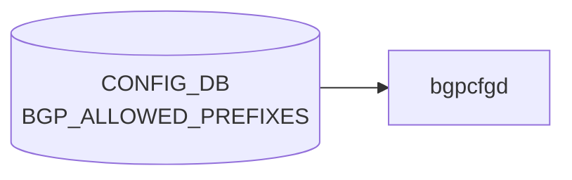

# BGP_ALLOWED_PREFIXES テーブル

## 概要

`BGP_ALLOWED_PREFIXES` は **deployment ID 単位の prefix 許可リスト** を [CONFIG_DB](../../reference/glossary.md#term-config_db) に格納するテーブル[^1]。[bgpcfgd](../../reference/glossary.md#term-bgpcfgd) の Jinja テンプレが読み込み、ToR / leaf スイッチで広告する prefix-list / route-map を生成する。Microsoft 由来の deployment 駆動構成 (T0/T1/T2 ロール) で利用される。

[YANG](../../reference/glossary.md#term-yang) モジュール 1 つで 4 つの list（key の組合せが異なる）を持つ:

1. `BGP_ALLOWED_PREFIXES_LIST` (deployment, id)
2. `BGP_ALLOWED_PREFIXES_NEIGH_LIST` (deployment, id, neighbor, neighbor_type)
3. `BGP_ALLOWED_PREFIXES_COM_LIST` (deployment, id, community)
4. `BGP_ALLOWED_PREFIXES_NEIGH_COM_LIST` (deployment, id, neighbor, neighbor_type, community)

<!-- cdb-mermaid -->
### データフロー (自動生成)



!!! note "凡例"
    CONFIG_DB から SAI までの典型経路を `docs/reference/config-db-orch-map.md` から機械生成したミニ図。詳細・例外は本ページ本文と対応表を参照。
<!-- /cdb-mermaid -->

## key 構造

```text
BGP_ALLOWED_PREFIXES|<deployment>|<id>[|<neighbor>|<neighbor_type>][|<community>]
```

- `<deployment>` は固定文字列 `DEPLOYMENT_ID` ([YANG](../../reference/glossary.md#term-yang) `pattern "DEPLOYMENT_ID"`)
- `<id>` は uint32 の deployment id
- `<neighbor>` は固定文字列 `NEIGHBOR_TYPE` (`pattern "NEIGHBOR_TYPE"`)
- `<neighbor_type>` は任意の neighbor タイプ名
- `<community>` は community 文字列

> パターンが固定文字列に見えるが、これは [bgpcfgd](../../reference/glossary.md#term-bgpcfgd) テンプレ側で `DEPLOYMENT_ID` / `NEIGHBOR_TYPE` という文字列キーをそのまま使う構造になっているため。`<id>` などの可変部分で deployment を区別する。

## フィールド（共通）

各 list は次の共通フィールドを持つ:

| フィールド | 型 | 説明 |
|-----------|----|------|
| `default_action` | `rpolsets:routing-policy-action-type` | permit / deny |
| `prefixes_v4` | leaf-list of `bgp-allowed-ipv4-prefix` (ordered-by user) | 許可する IPv4 prefix リスト |
| `prefixes_v6` | leaf-list of `bgp-allowed-ipv6-prefix` (ordered-by user) | 許可する IPv6 prefix リスト |

`bgp-allowed-ipv4-prefix` / `bgp-allowed-ipv6-prefix` は **`<prefix> [le|ge <len>]`** という [FRR](../../reference/glossary.md#term-frr)-like の構文を許す独自 typedef。例: `10.0.0.0/8 le 32`。

## 制約

- `<deployment>` キーは固定パターン `DEPLOYMENT_ID` / `NEIGHBOR_TYPE` に縛られるため、[CONFIG_DB](../../reference/glossary.md#term-config_db) に書き込む際は必ずこのリテラルを使う。
- prefix の `le` / `ge` 修飾子は IPv4 では 0..32、IPv6 では 0..128 の範囲のみ許可。
- 4 種類の list は同じ container 配下にあるが、key の組合せが異なるので区別される。

## 購読者

- `bgpcfgd` (`docker-fpm-frr`): deployment id ごとに `BGP_ALLOWED_PREFIXES_*` を読み、Jinja テンプレで `ip prefix-list` / `route-map` 文を [vtysh](../../reference/glossary.md#term-vtysh) に流す
- `bgpd` ([FRR](../../reference/glossary.md#term-frr)): 生成された prefix-list / route-map を [BGP](../../reference/glossary.md#term-bgp) neighbor / peer-group に適用

## 関連 CONFIG_DB / YANG / CLI

- 関連 [CONFIG_DB](../../reference/glossary.md#term-config_db): `BGP_NEIGHBOR`, `BGP_PEER_GROUP`, `ROUTE_MAP_SET`, `DEVICE_METADATA` (`deployment_id`)
- 関連 CLI: 専用 CLI なし。`sonic-cfggen` / minigraph 経由で投入されるのが通常
- 関連 [YANG](../../reference/glossary.md#term-yang): `sonic-bgp-allowed-prefix`, `sonic-routing-policy-sets`

<!-- defaults -->
## コード由来の暗黙デフォルト

YANG の `default` 節には値がないが、`bgpcfgd` (`managers_allow_list.py`) が実行時に適用する暗黙デフォルトが存在する。書き込み時 (SET) と実行時 (FRR 生成) で乖離が生じる点に注意。

### `default_action`

| 条件 | fallback 値 | フェーズ | 根拠 |
|------|------------|---------|------|
| フィールド省略時 (SET) | `constants["bgp"]["allow_list"]["default_action"]` の値 → なければ `drop_community` を返す (`"permit"` 相当) | 書き込み時 | `managers_allow_list.py:773-785` |
| DEL 後の残置ルール | 同上 (`data=None` で呼ばれる) | 実行時 | `managers_allow_list.py:197` |
| `constants.yml` の実値 | `default_action: "permit"`, `drop_community: "5060:12345"` | — | `files/image_config/constants/constants.yml:33-34` |

> 書き込み時と実行時で同じ constants を参照するため**乖離なし**。ただし constants を後から変更しても既存ルールは再 SET するまで更新されない。

### `prefixes_v4` / `prefixes_v6`

| 条件 | fallback 動作 | フェーズ | 根拠 |
|------|--------------|---------|------|
| フィールド省略 (key なし) | `[]` (空リスト) として処理 | 書き込み時 | `managers_allow_list.py:70-71` |
| 両方空の場合 | validate 失敗 (`log_err` + `return False`) | 書き込み時 | `managers_allow_list.py:107-109` |
| FRR prefix-list 生成時 | `constants["bgp"]["allow_list"]["default_pl_rules"]["v4/v6"]` を先頭に prepend | 実行時 | `managers_allow_list.py:265-266` |
| v4 constants 実値 | `["deny 0.0.0.0/0 le 17", "permit 127.0.0.1/32"]` | — | `constants.yml:36-38` |
| v6 constants 実値 | `["deny 0::/0 le 59", "deny 0::/0 ge 65"]` | — | `constants.yml:39-41` |

> **書き込み時 vs 実行時の乖離**: CONFIG_DB 上の `prefixes_v4` / `prefixes_v6` が空でも、FRR の実 prefix-list には constants 由来のエントリが必ず挿入される。

#### `__to_prefix_list` による暗黙の `le` 補完

`le` / `ge` 修飾子がなく、かつマスク長が `/32` (v4) / `/128` (v6) 未満の prefix は FRR 送出時に自動で `le 32` / `le 128` が付与される。例: `10.0.0.0/8` → `permit 10.0.0.0/8 le 32`。`managers_allow_list.py:736-754`。

### キーフィールドの暗黙補完

| key 部分 | 省略時の値 | 根拠 |
|---------|-----------|------|
| `community_value` (key に community なし) | `"empty"` (`EMPTY_COMMUNITY`) | `managers_allow_list.py:15,64,67` |
| `neighbor_type` (key に NEIGHBOR_TYPE なし) | `''` (空文字) | `managers_allow_list.py:68` |
| `prefix_match_tag` (constants に未定義) | `None` → `set tag` 行を生成しない | `managers_allow_list.py:657` |

### 機能無効時

`constants["bgp"]["allow_list"]["enabled"]` が `false` または存在しない場合、SET/DEL 両方とも warn log のみで消化される（テーブル処理が完全スキップ）。`managers_allow_list.py:699-707`。

<!-- /defaults -->

<!-- side-effects -->
## 副次 DB 書込 (Phase F)

CONFIG_DB `BGP_ALLOWED_PREFIXES` テーブルの変更に伴って `bgpcfgd` の `BGPAllowListMgr` ハンドラが副次的に書き込む DB エントリは **存在しない**。出力はすべて [FRR](../../reference/glossary.md#term-frr) [vtysh](../../reference/glossary.md#term-vtysh) への設定 push (`ip prefix-list` / `ipv6 prefix-list` / `bgp community-list standard` / `route-map`) と必要に応じた peer-group `soft clear` に閉じる。

| 副次 DB | 書込有無 | 根拠 |
|---|---|---|
| [APPL_DB](../../reference/glossary.md#term-appl_db) | なし | `managers_allow_list.py` を `Producer`/`Table(`/`hset`/`publish`/`Notification`/`APPL_DB` で grep して 0 ヒット。出力経路は `self.cfg_mgr.push_list(cmds)` (`managers_allow_list.py:176, 209`) と `self.cfg_mgr.restart_peer_groups(peer_groups)` (`managers_allow_list.py:178, 211`) のみ |
| [STATE_DB](../../reference/glossary.md#term-state_db) | なし | `managers_allow_list.py` 全体に `STATE_DB` / `state_db` 参照なし。`self.cfg_mgr` (FRR ConfigMgr) のみで `state_db_conn` を保持しない |
| [COUNTERS_DB](../../reference/glossary.md#term-counters_db) | なし | `managers_allow_list.py` 全体に `COUNTERS_DB` 参照なし。ALLOW_LIST は [BGP](../../reference/glossary.md#term-bgp) UPDATE 経路フィルタのため統計テーブルも存在しない |
| その他 ([ASIC_DB](../../reference/glossary.md#term-asic_db) / [FLEX_COUNTER_DB](../../reference/glossary.md#term-flex_counter_db) / [LOGLEVEL_DB](../../reference/glossary.md#term-loglevel_db)) | なし | [SAI](../../reference/glossary.md#term-sai) 非経由 (段階 3 トレース参照、[BGP](../../reference/glossary.md#term-bgp) UPDATE フィルタは FRR ユーザ空間で完結)。`sonic-swss/` で `BGP_ALLOWED_PREFIXES` を grep して 0 ヒット (購読 mgrd/[orchagent](../../reference/glossary.md#term-orchagent) なし) |

主購読者 `BGPAllowListMgr.set_handler()` / `del_handler()` の副作用は `__update_policy()` / `__remove_policy()` 内の `cfg_mgr.push_list()` 呼出による FRR [vtysh](../../reference/glossary.md#term-vtysh) への route-map / prefix-list / community-list 投入 (`managers_allow_list.py:167-176, 200-207`) と、`__find_peer_group()` で逆引きした peer-group に対する `restart_peer_groups()` (BGP soft clear) のみ。[Redis](../../reference/glossary.md#term-redis) (CONFIG_DB / [APPL_DB](../../reference/glossary.md#term-appl_db) / [STATE_DB](../../reference/glossary.md#term-state_db) / [COUNTERS_DB](../../reference/glossary.md#term-counters_db)) を経由しない。

詳細スキャン手順と grep 結果は `meta/_intermediate/cdb-flow/bgp-allowed-prefixes-side.md` を参照。
<!-- /side-effects -->

<!-- constants -->
## コード由来のハードコード定数 (Phase E)

`bgpcfgd` の `managers_allow_list.py` と FRR テンプレ `policies.conf.j2` には、ユーザが [CONFIG_DB](../../reference/glossary.md#term-config_db) や [YANG](../../reference/glossary.md#term-yang) から変更できない固定文字列・固定数値が多数埋め込まれている。

### 1. route-map / prefix-list / community 名テンプレート

| 定数 | 値 | 役割 | 根拠 |
|------|----|------|------|
| `PL_NAME_TMPL` | `"PL_ALLOW_LIST_DEPLOYMENT_ID_%d_COMMUNITY_%s_V%s"` | community 単位の prefix-list 名 | `managers_allow_list.py:16` |
| `PL_NAME_TMPL_WITH_NEIGH` | `"PL_ALLOW_LIST_DEPLOYMENT_ID_%d_NEIGHBOR_%s_COMMUNITY_%s_V%s"` | neighbor_type を含む prefix-list 名 | `managers_allow_list.py:17` |
| `COMMUNITY_NAME_TMPL` | `"COMMUNITY_ALLOW_LIST_DEPLOYMENT_ID_%d_COMMUNITY_%s"` | community-list 名 | `managers_allow_list.py:18` |
| `COMMUNITY_NAME_TMPL_WITH_NEIGH` | `"COMMUNITY_ALLOW_LIST_DEPLOYMENT_ID_%d_NEIGHBOR_%s_COMMUNITY_%s"` | neighbor_type を含む community-list 名 | `managers_allow_list.py:19` |
| `RM_NAME_TMPL` | `"ALLOW_LIST_DEPLOYMENT_ID_%d_V%s"` | route-map 名 (deployment 単位, v4/v6) | `managers_allow_list.py:20` |
| `RM_NAME_TMPL_WITH_NEIGH` | `"ALLOW_LIST_DEPLOYMENT_ID_%d_NEIGHBOR_%s_V%s"` | neighbor_type を含む route-map 名 | `managers_allow_list.py:21` |

### 2. FROM_BGP_PEER テンプレート (固定 5 段構成)

`policies.conf.j2` (general) は `route-map FROM_BGP_PEER_V4` / `FROM_BGP_PEER_V6` をハードコードで生成する。seq 10/11/12/13/100 の順:

| seq | 役割 | 根拠 |
|-----|------|------|
| 10 | `call ALLOW_LIST_DEPLOYMENT_ID_0_V{4,6}` + `on-match next` | `policies.conf.j2:34-36,57-59` |
| 11 | `match community allow_list_default_community` (community-list 名はハードコード) | `policies.conf.j2:38-39,61-62` |
| 12 | `match ip{,v6} address prefix-list DEFAULT_IPV{4,6}` (`type=SpineRouter` かつ `subtype=UpstreamLC` のみ生成) | `policies.conf.j2:41-45,64-68` |
| 13 | `set tag` + `set community internal_fallback_community additive` (同上ロール限定。`switch_type=chassis-packet` で tag を `route_do_not_send_appdb_tag` → `route_eligible_for_fallback_to_default_tag` に切替) | `policies.conf.j2:47-53,70-76` |
| 100 | 終端 permit (素通り) | `policies.conf.j2:84,94` |

V6 のみ `permit 1` で `on-match next` + `set ipv6 next-hop prefer-global` (`policies.conf.j2:90-92`)。

`DEFAULT_IPV4` / `DEFAULT_IPV6` prefix-list 名と中身 (`permit 0.0.0.0/0` / `permit ::/0`) もハードコード (`policies.conf.j2:5-6`)。

### 3. community-list `allow_list_default_community`

`bgp community-list standard allow_list_default_community` (community-list 名はハードコード) に以下 2 メンバを permit (`policies.conf.j2:31-32`):

- `no-export`
- `{{ constants.bgp.allow_list.drop_community }}` (`constants.yml` で `"5060:12345"`)

CONFIG_DB から変更不可。

### 4. route-map seq 番号定数

| 定数 | 値 | 用途 | 根拠 |
|------|----|------|------|
| `ROUTE_MAP_ENTRY_WITH_COMMUNITY_START` | `10` | community 付きエントリ seq 範囲下限 | `managers_allow_list.py:22` |
| `ROUTE_MAP_ENTRY_WITH_COMMUNITY_END` | `29990` | community 付きエントリ seq 範囲上限 | `managers_allow_list.py:23` |
| `ROUTE_MAP_ENTRY_WITHOUT_COMMUNITY_START` | `30000` | community なしエントリ seq 範囲下限 | `managers_allow_list.py:24` |
| `ROUTE_MAP_ENTRY_WITHOUT_COMMUNITY_END` | `65530` | community なしエントリ seq 範囲上限 | `managers_allow_list.py:25` |
| seq 増分 | `10` | `range(start, end, 10)` で 10 刻み割当 | `managers_allow_list.py:585` |
| default action 末尾 seq | `65535` | `route-map ALLOW_LIST_DEPLOYMENT_ID_*_V{4,6} permit 65535` (default_action 用エントリ) | `managers_allow_list.py:441,450,463,476,481,511,556` / `policies.conf.j2:17,20,24,27` |

> seq `65535` は `ROUTE_MAP_ENTRY_WITHOUT_COMMUNITY_END (65530)` の外側なので、`__find_next_seq_number` の動的割当と衝突しない。j2 テンプレ起動時に空の `ALLOW_LIST_DEPLOYMENT_ID_0_V{4,6} permit 65535` が先行投入され、CONFIG_DB に 1 件も `BGP_ALLOWED_PREFIXES` が無い状態でも default action ルールが存在する。

### 5. address-family / community センチネル定数

| 定数 | 値 | 用途 | 根拠 |
|------|----|------|------|
| `V4` | `"v4"` | address-family enum (IPv4) | `managers_allow_list.py:28` |
| `V6` | `"v6"` | address-family enum (IPv6) | `managers_allow_list.py:29` |
| `EMPTY_COMMUNITY` | `"empty"` | community 未指定キー時のセンチネル。prefix-list / route-map 名の `COMMUNITY_%s` 部分に展開 | `managers_allow_list.py:15` |

### 6. prefix mask デフォルト (IPv4=32 / IPv6=128)

`__to_prefix_list` (`managers_allow_list.py:736-754`) は `le`/`ge` 修飾子のない prefix を以下のように補完する:

| address-family | `prefix_mask_default` | 補完規則 | 根拠 |
|----------------|----------------------|----------|------|
| `V4` | `32` | マスク長 < 32 → `le 32` を自動付与 (`10.0.0.0/8` → `permit 10.0.0.0/8 le 32`)。マスク長 == 32 (host route) はそのまま | `managers_allow_list.py:744-754` |
| `V6` | `128` | マスク長 < 128 → `le 128` を自動付与 (`2001:db8::/32` → `permit 2001:db8::/32 le 128`)。マスク長 == 128 (host route) はそのまま | `managers_allow_list.py:744-754` |

> 判定は `'le' in prefix or 'ge' in prefix` (`managers_allow_list.py:739`) という素朴な文字列マッチで行われるため、prefix 文字列中に偶然 `le` / `ge` の 2 文字を含む場合は補完がスキップされる。

### 7. `prefix_match_tag` (constants 由来、ハードコードではないが固定挙動)

| 条件 | 挙動 | 根拠 |
|------|------|------|
| `constants["bgp"]["allow_list"]["prefix_match_tag"]` 定義あり | community なしの route-map entry に `set tag <値>` を付与 | `managers_allow_list.py:434-435,657-664` |
| 同 constants 未定義 | `None` のまま。`set tag` 行を生成しない (constants.yml には未定義) | `managers_allow_list.py:657` |

> `policies.conf.j2` 側の `FROM_BGP_PEER_V*` seq 13 で参照される `route_do_not_send_appdb_tag` / `route_eligible_for_fallback_to_default_tag` は別の定数 (constants.yml 由来) で、`prefix_match_tag` とは独立。

---

詳細根拠は `meta/_intermediate/cdb-flow/bgp-allowed-prefixes-constants.md` を参照。
<!-- /constants -->

<!-- cdb-exceptions -->
## 例外条件・特殊挙動

| 条件 | 挙動 |
|------|------|
| 機能が constants で無効化 | SET/DEL 両方とも warn log 後 return True（消化） |
| key が正規表現パターン不一致 | log_err 後 return False（消化されない、再試行の可能性） |
| `data` が None | log_err 後 return False |
| `prefixes_v4` に IPv6 アドレス | log_err 後 return False |
| `prefixes_v6` に IPv4 アドレス | log_err 後 return False |
| `prefixes_v4`/`prefixes_v6` が両方空 | log_err 後 return False |
| `default_action` が `"permit"`/`"deny"` 以外 | log_err 後 return False |
| `ge`/`le` サフィックス付き prefix | split して prefix 部分のみ IP 検証（サフィックスは FRR に委ねる） |
| DEL の key パターン不一致 | log_err 後 return（値なし）、消化扱い |

<!-- evidence: sonic-net/sonic-buildimage/src/sonic-bgpcfgd/bgpcfgd/managers_allow_list.py:75L -->
<!-- /cdb-exceptions -->

<!-- value-behavior -->
## 値依存挙動マトリクス

### `default_action` (enum `permit`/`deny`)

`bgpcfgd` の `BGPAllowListMgr.__get_default_action_community()` が値を community に変換してルートマップに適用する:

| 値 | 生成 community | 効果 | evidence |
|---|---|---|---|
| `permit` | `drop_community` (constants 定義値) | マッチしなかった prefix に drop_community を付与 | `managers_allow_list.py:773,780` |
| `deny` | `no-export` | マッチしなかった prefix に `no-export` community を付与し、AS 外への再広告を抑制 | `managers_allow_list.py:774` |

> `default_action` は prefix-list の末尾ルール (`route-map permit 65535`) に `set community <value> additive` として埋め込まれる (`managers_allow_list.py:438-451`)

### フリーフォームフィールド

- `prefixes_v4` / `prefixes_v6` — `<prefix> [le|ge <len>]` 形式の freeform 文字列リスト。FRR prefix-list 構文として vtysh に渡す

### 複合条件

- `default_action=deny` → `no-export` community 付与で他 AS への流出を防ぐ。ただし同一 AS 内の他ルータには広告される
- NEIGHBOR_TYPE キーを含む variant は `neighbor_type` 単位で個別ポリシーを生成し、同一 deployment_id のグローバルポリシーと AND 結合 (`managers_allow_list.py:__update_policy`)
<!-- /value-behavior -->

<!-- platform -->
## プラットフォーム差 (Phase H)

**[ASIC](../../reference/glossary.md#term-asic)・ベンダー依存はないが、`switch_type` と `type/subtype` で FRR route-map 生成テンプレートが分岐する**。テーブル処理ロジック自体 (`managers_allow_list.py`) はプラットフォーム非依存だが、ALLOW_LIST がぶら下がる `FROM_BGP_PEER_V4/V6` ポリシーの末尾処理が [VOQ](../../reference/glossary.md#term-voq) chassis (chassis-packet) で差し替わり、追加の DEFAULT prefix-list ブロックは UpstreamLC な SpineRouter でのみ生成される。

| 観点 | 結果 | 根拠 |
|------|------|------|
| [ASIC](../../reference/glossary.md#term-asic) 種別 (Broadcom / Mellanox / Marvell / Innovium 等) | 影響なし | BGP_ALLOWED_PREFIXES → FRR prefix-list / route-map → BGP UPDATE フィルタは [FRR](../../reference/glossary.md#term-frr) ユーザ空間で完結、[SAI](../../reference/glossary.md#term-sai) 非経由 |
| [HwSku](../../reference/glossary.md#term-hwsku) | 影響なし | `managers_allow_list.py` および `policies.conf.j2` を `hwsku` で grep して 0 ヒット |
| multi-asic (`is_multi_npu` true) | 実質影響なし | 各 `asicN` namespace の `bgpcfgd` プロセスが同一バイナリで独立に処理。テーブル処理に差は出ない |
| `switch_type == 'chassis-packet'` | **分岐あり** | `policies.conf.j2:48,71` で `route-map FROM_BGP_PEER_V4/V6 permit 13` の `set tag` が `route_do_not_send_appdb_tag` → `route_eligible_for_fallback_to_default_tag` に切り替わる (chassis-packet LC では fallback default 用にマーク) |
| `type=='SpineRouter' and subtype=='UpstreamLC'` | **分岐あり** | route-map permit 12/13 (DEFAULT_IPV4/V6 マッチ + tag/community 付与) は UpstreamLC な SpineRouter でのみ生成 (`policies.conf.j2:41,64`)。それ以外のロールでは ALLOW_LIST 不一致経路は `permit 11 → permit 100` で素通り |
| constants.yml (`bgp.allow_list`) | プラットフォーム非依存 | `files/image_config/constants/constants.yml` 1 ファイルで image 全体共通。`files/device/<platform>/` 配下の上書き機構なし |
| テーブル値検証 (`default_action`, `prefixes_v4/v6`) | 影響なし | `managers_allow_list.py` は IP family 構文のみを見て分岐。`platform / asic / chassis / namespace / switch_type` を参照する箇所が 0 ヒット |

詳細根拠は `meta/_intermediate/cdb-flow/bgp-allowed-prefixes-platform.md` を参照。
<!-- /platform -->

<!-- cross-refs -->
## 暗黙参照 (Phase C)

`BGP_ALLOWED_PREFIXES` テーブル本体のフィールドには現れないが、`bgpcfgd` の `BGPAllowListMgr` と FRR Jinja テンプレ `policies.conf.j2` (general/) が**間接的に**読み出すエンティティ群。詳細根拠は `meta/_intermediate/cdb-flow/bgp-allowed-prefixes-cross-refs.md` を参照。

### 値変換で生成される FRR community-list

`default_action` (`permit` / `deny`) は CONFIG_DB に文字列で保存されるが、適用時に **community 値** に変換され FRR の community-list `allow_list_default_community` にマッチさせる:

| `default_action` | 出力 community | 効果 |
|---|---|---|
| `permit` | `constants.bgp.allow_list.drop_community` (例: `5060:12345`) | 不一致 prefix に drop community を付与 |
| `deny` | `no-export` | 不一致 prefix を AS 外へ広告しない |

community-list `allow_list_default_community` は CONFIG_DB の `BGP_COMMUNITY_LIST` 経由ではなく **`policies.conf.j2:31-32` がテンプレ生成時に必ず定義** する点に注意。

> evidence: `managers_allow_list.py:773-785`, `policies.conf.j2:31-32`

### `DEVICE_METADATA` (CONFIG_DB)

`policies.conf.j2` が `CONFIG_DB__DEVICE_METADATA['localhost']` の以下フィールドで route-map 生成を分岐:

| フィールド | 役割 | evidence |
|---|---|---|
| `type` | `SpineRouter` / `UpperSpineRouter` のとき DEFAULT prefix 経路 (permit 12/13) を生成 | `policies.conf.j2:41,64,104-105` |
| `subtype` | `UpstreamLC` で上記分岐をさらに絞る | `policies.conf.j2:41,64,104` |
| `switch_type` | `chassis-packet` で `set tag` を切替 (`route_do_not_send_appdb_tag` ↔ `route_eligible_for_fallback_to_default_tag`) | `policies.conf.j2:48,71` |
| `deployment_id` | **直接参照なし**。論理的に `BGP_ALLOWED_PREFIXES` のキー `<id>` と一致したとき自局向けポリシーになる (運用上の対応関係。minigraph 経由で両者が揃えられる) | `managers_allow_list.py:63-69` |

> `DEVICE_METADATA.localhost.bgp_asn` は ALLOW_LIST 経路では参照されない (community/tag ベースで AS 番号非依存)。`policies.conf.j2` (general/) を `bgp_asn` で grep して 0 ヒット。

### peer-group / neighbor — FRR running-config 経由の間接利用

ALLOW_LIST 更新後に soft-clear すべき peer-group は、`__find_peer_group()` が **CONFIG_DB ではなく FRR の生 running-config テキスト** (`cfg_mgr.get_text()`) を正規表現で解析して抽出する (`managers_allow_list.py:686-697`)。命名規約 `ALLOW_LIST_DEPLOYMENT_ID_%d_(NEIGHBOR_%s_)?V<af>` で route-map call を逆引きする。

| エンティティ | 関係 | evidence |
|---|---|---|
| `BGP_PEER_GROUP` | **直接参照なし**。FRR running-config 経由で間接利用 | `managers_allow_list.py:601-607,686-697` |
| `BGP_NEIGHBOR` | 同上 (peer-group が neighbor に紐付くため間接) | 同上 |

### `BGP_GLOBALS` (隣接テーブル・直接参照なし)

`managers_allow_list.py` および ALLOW_LIST 経路の `policies.conf.j2` 両方を `BGP_GLOBALS` で grep して **0 ヒット**。ALLOW_LIST は peer-group / route-map レイヤで完結するため `BGP_GLOBALS` への依存はない。隣接リファレンスとして関連付けるに留める。

### `constants.yml` (CONFIG_DB 外部依存)

| キー | 用途 | evidence |
|---|---|---|
| `bgp.allow_list.enabled` | 機能 ON/OFF (false で全 skip) | `managers_allow_list.py:699-707` |
| `bgp.allow_list.default_action` | `default_action` 省略時の fallback | `managers_allow_list.py:773-785` |
| `bgp.allow_list.drop_community` | `permit` の community 変換先 | `managers_allow_list.py:780`, `policies.conf.j2:25,28,32` |
| `bgp.allow_list.default_pl_rules.{v4,v6}` | prefix-list 先頭 prepend | `managers_allow_list.py:265,709-723` |
| `bgp.allow_list.prefix_match_tag` | route-map `set tag` 行生成 | `managers_allow_list.py:652-664` |

<!-- /cross-refs -->

<!-- ref-triangle:start -->

## 関連リファレンス

- YANG: `sonic-bgp-allowed-prefix`

<!-- ref-triangle:end -->

## 引用元

[^1]: YANG 定義: `sonic-bgp-allowed-prefix.yang` (revision 2022-02-26). <https://github.com/sonic-net/sonic-buildimage/blob/9ea932ec2e18f35e58268ec2e4456b1d4afd65cd/src/sonic-yang-models/yang-models/sonic-bgp-allowed-prefix.yang>

<!-- ops-hint -->
## 運用ヒント

### 典型値

- key 形式: `BGP_ALLOWED_PREFIXES|<vrf>|<peer>|<af>`。
- ToR 配下の特定 prefix 集合のみを許可する利用が多い。`prefixes` は CSV または list。

### よくある誤設定

- prefix-list 名と表記揺れがあると [FRR](../../reference/glossary.md#term-frr) 側に反映されず広告フィルタが効かない。

### 確認コマンド

```bash
sonic-db-cli CONFIG_DB keys 'BGP_ALLOWED_PREFIXES|*'
vtysh -c 'show running-config bgp'
```
<!-- /ops-hint -->

<!-- runtime-trace -->
## 実コンテナ動作トレース

### 段階 1 — Consumer 登録

`bgpcfgd` が CONFIG_DB の `BGP_ALLOWED_PREFIXES` テーブルを購読する。

`BGP_ALLOWED_PREFIXES` テーブルは [SONiC](../../reference/glossary.md#term-sonic) の内部フィルタ管理用。

### 段階 2 — CFG→APPL 翻訳

なし (FRR vtysh 経由)

### 段階 3 — APPL→SAI

なし (FRR BGP フィルタのみ)

### 段階 4 — タイミングと副作用

**適用タイミング**: `bgpcfgd` が変化を検知後 FRR prefix-list / route-map を更新。既存ピアには `soft clear` が必要な場合がある。

**副作用**: 許可プレフィクスの変更は既存 BGP セッションの UPDATE 再送を引き起こす可能性がある。
<!-- /runtime-trace -->

<!-- entry-points -->
## 書き込み入り口 (Direction A)

対象テーブル: `BGP_ALLOWED_PREFIXES`

### CLI
- `config bgp allowed-prefix add/del <prefix>`
  - ソース: `sonic-utilities/config/main.py (bgp グループ)`

### minigraph / sonic-cfggen
- なし

### REST / gNMI (sonic-mgmt-common)
- なし (対応 OpenConfig/[SONiC](../../reference/glossary.md#term-sonic) YANG transformer なし)

### db_migrator
- なし

### ビルド時デフォルト (init_cfg / j2 テンプレート)
- なし

### ハードコードデフォルト
- なし

### ランタイム注入 (デーモン自動書き込み)
- なし
<!-- /entry-points -->

<!-- ordering -->
## 書込み順依存 (Phase B)

> 調査対象: `sonic-buildimage/src/sonic-bgpcfgd/bgpcfgd/managers_allow_list.py` / `sonic-buildimage/dockers/docker-fpm-frr/frr/bgpd/templates/general/policies.conf.j2`
> 調査日: 2026-05-16

### 他テーブル / 設定先行必須

| 先行テーブル / 条件 | 依存の内容 | コード根拠 |
|-------------------|-----------|-----------|
| `constants.yml` (`bgp.allow_list.enabled`, `drop_community`, `default_action`, `default_pl_rules`, `prefix_match_tag`) | `BGPAllowListMgr.__init__` 時点で `self.enabled` / `self.prefix_match_tag` / `constants_v4/v6` が確定。constants 変更は [bgpcfgd](../../reference/glossary.md#term-bgpcfgd) 再起動まで反映されない | `managers_allow_list.py:45-47, 699-734, 652-664` |
| `DEVICE_METADATA|localhost.{type, subtype, switch_type}` | `policies.conf.j2` のレンダ条件 (`SpineRouter`+`UpstreamLC` 限定の `permit 12/13`、`chassis-packet` で `set tag` 値が分岐)。bgpcfgd 起動前に確定が必要 | `policies.conf.j2:40-54, 63-77` |
| `policies.conf.j2` 起動時レンダ | `route-map FROM_BGP_PEER_V4/V6 permit 10 call ALLOW_LIST_DEPLOYMENT_ID_0_V4/V6`、`bgp community-list standard allow_list_default_community`、deployment_id=0 の `permit 65535` は **template 起動時に一度だけ** 生成。これより前に `BGP_ALLOWED_PREFIXES` を SET しても prefix-list が peer に紐付かない | `policies.conf.j2:17-32, 34-38, 57-61` |
| `BGP_NEIGHBOR` / `BGP_PEER_RANGE` (peer-group 定義) | `__update_policy` 末尾の `__find_peer_group()` が vtysh running-config を grep して deployment_id に紐づく peer-group を抽出 → `restart_peer_groups()` で soft-clear。peer-group 未存在のままだと soft-clear 空振りで**フィルタが有効化されない** | `managers_allow_list.py:177-178, 595-697` |
| `BGP_ALLOWED_PREFIXES` 自身 (CommunityList 連動) | EMPTY_COMMUNITY 経路 (`|<community>` 無し) では `__update_community` が早期 return し community-list を作らない一方、`__update_allow_route_map_entry` は `set tag <prefix_match_tag>` を出す。constants の `prefix_match_tag` が未定義だと tag も付かず、ALLOW_LIST 不一致時の `route-map FROM_BGP_PEER_V4 permit 11 match community allow_list_default_community` 経路に頼ることになる | `managers_allow_list.py:15, 360-362, 432-435` |

### bgpcfgd Manager 起動順 (main.py)

`BGPAllowListMgr` は `bgpcfgd/main.py:73-104` の Manager 配列で次の位置に登録される:

- **前**: `BGPDataBaseMgr` ([DEVICE_METADATA](../../reference/glossary.md#term-device_metadata)), `InterfaceMgr` 一式, `BGPPeerMgrBase` 一式 (general / internal / monitors / dynamic / voq_chassis / sentinels)
- **後**: `BBRMgr`, `StaticRouteMgr`, `RouteMapMgr`, `DeviceGlobalCfgMgr`

これにより、初回スキャン時には [DEVICE_METADATA](../../reference/glossary.md#term-device_metadata) / peer-group が `BGP_ALLOWED_PREFIXES` 処理前に running-config に反映される設計。ただし**運用中の動的追加** (peer-group を後から追加) では順序逆転が発生しうるため、`BGP_ALLOWED_PREFIXES` の再 SET が必要になる場合がある。

### `set_handler` 内 vtysh push 順 (固定)

`__update_policy` は `cfg_mgr.push_list()` に以下を**この順で**渡す (`managers_allow_list.py:167-176`):

1. v4 prefix-list (`ip prefix-list <pl_v4> seq N permit ...`)
2. v6 prefix-list (`ipv6 prefix-list <pl_v6> seq N permit ...`)
3. community-list (`bgp community-list standard <name> permit <value>`、EMPTY_COMMUNITY 時はスキップ)
4. v4 "allow" route-map entry (`route-map <rm_v4> permit <seq> / match ip address prefix-list <pl_v4> / [match community <name>|set tag <tag>]`)
5. v6 "allow" route-map entry
6. v4 "default action" route-map entry (`route-map <rm_v4> permit 65535 / set community <permit→drop_community|deny→no-export> additive`)
7. v6 "default action" route-map entry

`__remove_policy` (DEL) は概ね逆順: allow route-map entry 削除 → prefix-list 削除 → community-list 削除 → default 行更新 (`managers_allow_list.py:200-207`)。

### deployment_id=0 の二重書き

`policies.conf.j2:17-29` は起動時に **deployment_id=0 限定** で `route-map ALLOW_LIST_DEPLOYMENT_ID_0_V4|V6 permit 65535 / set community ... additive` を書き出す。一方 `BGPAllowListMgr.__update_default_route_map_entry` も SET ごとに seq=65535 を上書きする。**deployment_id=0 で template 引数 `allow_list_default_action` と CONFIG_DB の `default_action` が食い違うと、bgpcfgd 起動直後〜最初の SET 到達までの短時間は template 値、その後は CONFIG_DB 値**という遷移が発生する。

詳細根拠とスキャンログは intermediate メモ (`meta/_intermediate/cdb-flow/bgp-allowed-prefixes-ordering.md`) を参照。

<!-- evidence: sonic-net/sonic-buildimage/src/sonic-bgpcfgd/bgpcfgd/managers_allow_list.py:45 -->
<!-- evidence: sonic-net/sonic-buildimage/src/sonic-bgpcfgd/bgpcfgd/managers_allow_list.py:167 -->
<!-- evidence: sonic-net/sonic-buildimage/src/sonic-bgpcfgd/bgpcfgd/managers_allow_list.py:177 -->
<!-- evidence: sonic-net/sonic-buildimage/src/sonic-bgpcfgd/bgpcfgd/main.py:73 -->
<!-- evidence: sonic-net/sonic-buildimage/dockers/docker-fpm-frr/frr/bgpd/templates/general/policies.conf.j2:17 -->
<!-- evidence: sonic-net/sonic-buildimage/dockers/docker-fpm-frr/frr/bgpd/templates/general/policies.conf.j2:34 -->
<!-- /ordering -->

<!-- failure -->
## 失敗挙動・エラーパス (Phase D)

> **調査根拠**: `bgpcfgd/managers_allow_list.py` および `docker-fpm-frr/frr/bgpd/templates/general/policies.conf.j2` 精読 (2026-05-16)  
> 詳細証跡: `meta/_intermediate/cdb-flow/bgp-allowed-prefixes-failure.md`

`BGPAllowListMgr` (Manager 基底) の `set_handler` / `del_handler` 戻り値は CONFIG_DB SubscriberStateTable ループで解釈される。**`return False` は「未消化」扱いで自動再投入** され、依存物 (FRR `community-list`、vtysh セッション、constants 整備) が揃うまで暗黙にリトライが続く。`return True` は消化 (成功または明示スキップ)。

### SET 失敗マトリクス (`managers_allow_list.py`)

| 条件 | 戻り値 | リトライ | ログ |
|---|---|---|---|
| `constants["bgp"]["allow_list"]["enabled"]` が false / 未定義 | `True` (消化) | なし | `LOG_WARN "... but this feature is disabled in constants"` (L699-707) |
| key が `key_re` (`DEPLOYMENT_ID\|<id>...`) 不一致 | `False` | **再投入** | `LOG_ERR "... invalid key"` |
| `data` が `None` | `False` | 再投入 | `LOG_ERR` |
| `default_action` が `permit`/`deny` 以外 | `False` | 再投入 | `LOG_ERR` |
| `prefixes_v4` に IPv6 表記 / `prefixes_v6` に IPv4 表記 | `False` | 再投入 | `LOG_ERR` |
| `prefixes_v4` と `prefixes_v6` が両方空 | `False` | 再投入 | `LOG_ERR "... without prefixes. Skip it."` (L107-109) |
| FRR `community-list` (`drop_community` 前提) 未準備で vtysh コマンド失敗 | `False` | **再投入** (FRR 起動 / community-list 整備まで待機) | `LOG_ERR` (vtysh stderr) |
| `cfg_mgr.push_list()` 戻り False (vtysh 文法エラー / セッション切断) | `False` | 再投入 | `LOG_ERR "push_list failed"` |
| `deployment_id` が `DEVICE_METADATA.localhost.deployment_id` と不一致 | `True` (消化) | なし | silent (debug 程度)。FRR ポリシー差し替えは行われず effective には no-op |
| `__to_prefix_list()` 内で prefix 解析例外 | 例外伝播 → `False` | 再投入 | スタックトレース (未捕捉) |

### DEL 失敗マトリクス

| 条件 | 戻り値 | 結果 |
|---|---|---|
| key が `key_re` 不一致 | `True` (silent skip) | `LOG_ERR` のみ。再投入なし |
| `enabled=false` | `True` (消化) | `LOG_WARN` のみ |
| vtysh `cfg_mgr.push_list()` 失敗 | `False` | FRR 復旧まで再試行 |
| DEL 後フォールバック (`data=None` で `__update_policy` 再呼) | n/a | 最後の deployment に対し constants 由来の default-action ルールが残置 (`managers_allow_list.py:197`) |

### `policies.conf.j2` (FRR テンプレ) 由来の暗黙失敗

| 条件 | 結果 |
|---|---|
| `switch_type == 'chassis-packet'` で `route_eligible_for_fallback_to_default_tag` 未定義 | Jinja undefined → render 失敗。`bgpcfgd` 起動シーケンスで FRR config が空となり SET が**未消化ループ** (`False`) に陥る (`policies.conf.j2:48,71`) |
| `type == 'SpineRouter'` だが `subtype != 'UpstreamLC'` | DEFAULT_IPV4/V6 マッチブロックを生成しない (silent skip)。ALLOW_LIST 不一致経路は `permit 11 → permit 100` で素通り (`policies.conf.j2:41,64`) |

### リトライ機構の性質

- `set_handler` が `False` を返すと SubscriberStateTable 側で自動再投入。**回数上限・バックオフなし**。
- FRR 起動直後 / vtysh セッション復旧待ち / `community-list` 準備中などの過渡状態は数秒〜十数秒で自然消化。
- **`deployment_id` 変化はサブされていない**ため、`DEVICE_METADATA.localhost.deployment_id` を後から書き換えても再評価されない。`config reload` または各 `BGP_ALLOWED_PREFIXES` エントリの再書き込みが必要。

> **Evidence**: `sonic-buildimage/src/sonic-bgpcfgd/bgpcfgd/managers_allow_list.py` (L75-110, 197, 699-707, 736-754, 773-785); `dockers/docker-fpm-frr/frr/bgpd/templates/general/policies.conf.j2` L41,48,64,71。
<!-- /failure -->

<!-- pubsub -->
## 通信メカニズム (Redis PUBSUB / keyspace notification)

> **調査根拠**: `sonic-bgpcfgd/bgpcfgd/runner.py` + `manager.py` + `managers_allow_list.py` + `main.py` 精読 (2026-05-16)
> 詳細証跡: `meta/_intermediate/cdb-flow/bgp-allowed-prefixes-pubsub.md`

### 購読方式

`bgpcfgd` は `swss::SubscriberStateTable` を 1 本の `swsscommon.Select` ループで束ねる**集中 dispatcher** 構成。テーブルごとに subscriber を 1 つ作り、`Runner.run()` が `select(1000ms)` → `subscriber.pop()` → 各 Manager の `handler(key, op, fvs)` に振り分ける。`BGP_ALLOWED_PREFIXES` は `main.py:94` で `BGPAllowListMgr(common_objs, "CONFIG_DB", "BGP_ALLOWED_PREFIXES")` として登録され、`Runner.add_manager` が `SubscriberStateTable(CONFIG_DB_conn, "BGP_ALLOWED_PREFIXES")` を生成して `swsscommon.Select` に追加する (`runner.py:47-52`)。`ConsumerStateTable` / `NotificationConsumer` / `ProducerStateTable` は使用せず、[APPL_DB](../../reference/glossary.md#term-appl_db) / [STATE_DB](../../reference/glossary.md#term-state_db) 中継もない。

### dispatch チェーン

`Manager.handler` (base class, `manager.py:34-53`) が op 種別で分岐:

| op | 処理 | 根拠 |
|----|------|------|
| `SET_COMMAND` | deps 充足チェック → `set_handler(key, data)`。`False` 戻りは `set_queue` に退避 (暗黙リトライ) | `manager.py:41-49`, `managers_allow_list.py:49` |
| `DEL_COMMAND` | `del_handler(key)` を直接呼ぶ | `manager.py:50-51`, `managers_allow_list.py:115` |
| その他 | `log_err` のみ | `manager.py:52-53` |

`BGPAllowListMgr` は `deps=[]` で初期化される (`managers_allow_list.py:40`) ため `available_deps([])` は常に True。初回イベントから即 `set_handler` に到達する一方、`set_handler` が `False` を返したときの再投入トリガは乏しく (`on_deps_change` は依存変化が無いので発火しない)、実質的には**次の SET イベント到来時に `set_queue` の保留分が再走される**挙動。

### keyspace notification 詳細

| 項目 | 値 |
|------|-----|
| [Redis](../../reference/glossary.md#term-redis) DB 番号 | 4 (`SonicDBConfig.getDbId("CONFIG_DB")`) |
| PSUBSCRIBE パターン | `__keyspace@4__:BGP_ALLOWED_PREFIXES\|*` (libswsscommon の `SubscriberStateTable` が内部で張る) |
| Select timeout | 1000 ms (`runner.py:21` `SELECT_TIMEOUT = 1000`) |
| 起動時スナップショット | あり — `SubscriberStateTable` 生成時に既存キーを内部キューに enqueue (swsscommon 標準挙動)。`bgpcfgd` 側に明示の全量 fetch は無い |
| バッチ性 | 1 select cycle 内で全 subscriber を pop した後 `cfg_manager.commit()` を**まとめて 1 回**呼び、複数テーブル変更を 1 vtysh バッチに収める (`runner.py:63-73`) |
| APPL_DB / STATE_DB 中継 | なし。`cfg_mgr.push_list` で vtysh に直接 prefix-list / community-list / route-map を送る |

### 通信シーケンス

```
ユーザ書込み: CONFIG_DB|BGP_ALLOWED_PREFIXES|<deployment>|<id>[|...]
  ↓ (Redis keyspace event)
SubscriberStateTable 内部キューに enqueue
  ↓ (≤ 1000 ms)
Runner.run() の selector.select() 起床                          # runner.py:57
  ↓
subscriber.pop() → (key, op, fvs)                              # runner.py:65
  ↓
callbacks[4]["BGP_ALLOWED_PREFIXES"] = BGPAllowListMgr.handler  # runner.py:69-70
  ↓
Manager.handler(key, op, dict(fvs))                            # manager.py:34
  ├─ SET → set_handler → __set_handler_validate → __update_policy
  │           └─ cfg_mgr.push_list([prefix-list, community-list, route-map ...])
  └─ DEL → del_handler → __remove_policy
              └─ cfg_mgr.push_list([... no ...])
  ↓
runner ループ末の cfg_manager.commit()                         # runner.py:71
  ↓
vtysh セッションへ FRR config をバッチ送信
  ↓
bgpd が prefix-list / route-map / community-list を反映
  ↓ (必要に応じ)
__find_peer_group → restart_peer_groups → "clear bgp ... soft"
```

### 反映タイミング

CONFIG_DB write から FRR 反映まで通常**≤ 1 秒** (Select timeout = 1000 ms)。`set_handler` が `False` を返した場合は `set_queue` に退避され、後続の SET イベントで再試行される (回数上限・バックオフなし。詳細は Phase D セクションを参照)。

<!-- evidence: sonic-net/sonic-buildimage/src/sonic-bgpcfgd/bgpcfgd/runner.py:21 -->
<!-- evidence: sonic-net/sonic-buildimage/src/sonic-bgpcfgd/bgpcfgd/runner.py:47 -->
<!-- evidence: sonic-net/sonic-buildimage/src/sonic-bgpcfgd/bgpcfgd/runner.py:63 -->
<!-- evidence: sonic-net/sonic-buildimage/src/sonic-bgpcfgd/bgpcfgd/manager.py:34 -->
<!-- evidence: sonic-net/sonic-buildimage/src/sonic-bgpcfgd/bgpcfgd/main.py:94 -->
<!-- evidence: sonic-net/sonic-buildimage/src/sonic-bgpcfgd/bgpcfgd/managers_allow_list.py:38 -->
<!-- /pubsub -->

<!-- glossary-links-injected: 4650386d44ae -->
