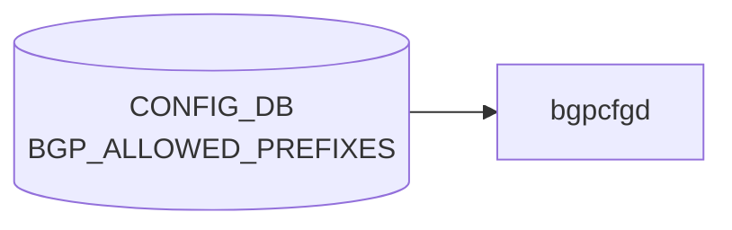

# BGP_ALLOWED_PREFIXES テーブル

## 概要

`BGP_ALLOWED_PREFIXES` は **deployment ID 単位の prefix 許可リスト** を [CONFIG_DB](../../reference/glossary.md#term-config_db) に格納するテーブル[^1]。[bgpcfgd](../../reference/glossary.md#term-bgpcfgd) の Jinja テンプレが読み込み、ToR / leaf スイッチで広告する prefix-list / route-map を生成する。Microsoft 由来の deployment 駆動構成 (T0/T1/T2 ロール) で利用される。

[YANG](../../reference/glossary.md#term-yang) モジュール 1 つで 4 つの list（key の組合せが異なる）を持つ:

1. `BGP_ALLOWED_PREFIXES_LIST` (deployment, id)
2. `BGP_ALLOWED_PREFIXES_NEIGH_LIST` (deployment, id, neighbor, neighbor_type)
3. `BGP_ALLOWED_PREFIXES_COM_LIST` (deployment, id, community)
4. `BGP_ALLOWED_PREFIXES_NEIGH_COM_LIST` (deployment, id, neighbor, neighbor_type, community)

<!-- cdb-mermaid -->
### データフロー (自動生成)



!!! note "凡例"
    CONFIG_DB から SAI までの典型経路を `docs/reference/config-db-orch-map.md` から機械生成したミニ図。詳細・例外は本ページ本文と対応表を参照。
<!-- /cdb-mermaid -->

## key 構造

```text
BGP_ALLOWED_PREFIXES|<deployment>|<id>[|<neighbor>|<neighbor_type>][|<community>]
```

- `<deployment>` は固定文字列 `DEPLOYMENT_ID` ([YANG](../../reference/glossary.md#term-yang) `pattern "DEPLOYMENT_ID"`)
- `<id>` は uint32 の deployment id
- `<neighbor>` は固定文字列 `NEIGHBOR_TYPE` (`pattern "NEIGHBOR_TYPE"`)
- `<neighbor_type>` は任意の neighbor タイプ名
- `<community>` は community 文字列

> パターンが固定文字列に見えるが、これは [bgpcfgd](../../reference/glossary.md#term-bgpcfgd) テンプレ側で `DEPLOYMENT_ID` / `NEIGHBOR_TYPE` という文字列キーをそのまま使う構造になっているため。`<id>` などの可変部分で deployment を区別する。

## フィールド（共通）

各 list は次の共通フィールドを持つ:

| フィールド | 型 | 説明 |
|-----------|----|------|
| `default_action` | `rpolsets:routing-policy-action-type` | permit / deny |
| `prefixes_v4` | leaf-list of `bgp-allowed-ipv4-prefix` (ordered-by user) | 許可する IPv4 prefix リスト |
| `prefixes_v6` | leaf-list of `bgp-allowed-ipv6-prefix` (ordered-by user) | 許可する IPv6 prefix リスト |

`bgp-allowed-ipv4-prefix` / `bgp-allowed-ipv6-prefix` は **`<prefix> [le|ge <len>]`** という [FRR](../../reference/glossary.md#term-frr)-like の構文を許す独自 typedef。例: `10.0.0.0/8 le 32`。

## 制約

- `<deployment>` キーは固定パターン `DEPLOYMENT_ID` / `NEIGHBOR_TYPE` に縛られるため、[CONFIG_DB](../../reference/glossary.md#term-config_db) に書き込む際は必ずこのリテラルを使う。
- prefix の `le` / `ge` 修飾子は IPv4 では 0..32、IPv6 では 0..128 の範囲のみ許可。
- 4 種類の list は同じ container 配下にあるが、key の組合せが異なるので区別される。

## 購読者

- `bgpcfgd` (`docker-fpm-frr`): deployment id ごとに `BGP_ALLOWED_PREFIXES_*` を読み、Jinja テンプレで `ip prefix-list` / `route-map` 文を vtysh に流す
- `bgpd` ([FRR](../../reference/glossary.md#term-frr)): 生成された prefix-list / route-map を [BGP](../../reference/glossary.md#term-bgp) neighbor / peer-group に適用

## 関連 CONFIG_DB / YANG / CLI

- 関連 [CONFIG_DB](../../reference/glossary.md#term-config_db): `BGP_NEIGHBOR`, `BGP_PEER_GROUP`, `ROUTE_MAP_SET`, `DEVICE_METADATA` (`deployment_id`)
- 関連 CLI: 専用 CLI なし。`sonic-cfggen` / minigraph 経由で投入されるのが通常
- 関連 [YANG](../../reference/glossary.md#term-yang): `sonic-bgp-allowed-prefix`, `sonic-routing-policy-sets`

<!-- cdb-exceptions -->
## 例外条件・特殊挙動

| 条件 | 挙動 |
|------|------|
| 機能が constants で無効化 | SET/DEL 両方とも warn log 後 return True（消化） |
| key が正規表現パターン不一致 | log_err 後 return False（消化されない、再試行の可能性） |
| `data` が None | log_err 後 return False |
| `prefixes_v4` に IPv6 アドレス | log_err 後 return False |
| `prefixes_v6` に IPv4 アドレス | log_err 後 return False |
| `prefixes_v4`/`prefixes_v6` が両方空 | log_err 後 return False |
| `default_action` が `"permit"`/`"deny"` 以外 | log_err 後 return False |
| `ge`/`le` サフィックス付き prefix | split して prefix 部分のみ IP 検証（サフィックスは FRR に委ねる） |
| DEL の key パターン不一致 | log_err 後 return（値なし）、消化扱い |

<!-- evidence: sonic-net/sonic-buildimage/src/sonic-bgpcfgd/bgpcfgd/managers_allow_list.py:75L -->
<!-- /cdb-exceptions -->

<!-- value-behavior -->
## 値依存挙動マトリクス

### `default_action` (enum `permit`/`deny`)

`bgpcfgd` の `BGPAllowListMgr.__get_default_action_community()` が値を community に変換してルートマップに適用する:

| 値 | 生成 community | 効果 | evidence |
|---|---|---|---|
| `permit` | `drop_community` (constants 定義値) | マッチしなかった prefix に drop_community を付与 | `managers_allow_list.py:773,780` |
| `deny` | `no-export` | マッチしなかった prefix に `no-export` community を付与し、AS 外への再広告を抑制 | `managers_allow_list.py:774` |

> `default_action` は prefix-list の末尾ルール (`route-map permit 65535`) に `set community <value> additive` として埋め込まれる (`managers_allow_list.py:438-451`)

### フリーフォームフィールド

- `prefixes_v4` / `prefixes_v6` — `<prefix> [le|ge <len>]` 形式の freeform 文字列リスト。FRR prefix-list 構文として vtysh に渡す

### 複合条件

- `default_action=deny` → `no-export` community 付与で他 AS への流出を防ぐ。ただし同一 AS 内の他ルータには広告される
- NEIGHBOR_TYPE キーを含む variant は `neighbor_type` 単位で個別ポリシーを生成し、同一 deployment_id のグローバルポリシーと AND 結合 (`managers_allow_list.py:__update_policy`)
<!-- /value-behavior -->

<!-- ref-triangle:start -->

## 関連リファレンス

- YANG: `sonic-bgp-allowed-prefix`

<!-- ref-triangle:end -->

## 引用元

[^1]: YANG 定義: `sonic-bgp-allowed-prefix.yang` (revision 2022-02-26). <https://github.com/sonic-net/sonic-buildimage/blob/9ea932ec2e18f35e58268ec2e4456b1d4afd65cd/src/sonic-yang-models/yang-models/sonic-bgp-allowed-prefix.yang>

<!-- ops-hint -->
## 運用ヒント

### 典型値

- key 形式: `BGP_ALLOWED_PREFIXES|<vrf>|<peer>|<af>`。
- ToR 配下の特定 prefix 集合のみを許可する利用が多い。`prefixes` は CSV または list。

### よくある誤設定

- prefix-list 名と表記揺れがあると [FRR](../../reference/glossary.md#term-frr) 側に反映されず広告フィルタが効かない。

### 確認コマンド

```bash
sonic-db-cli CONFIG_DB keys 'BGP_ALLOWED_PREFIXES|*'
vtysh -c 'show running-config bgp'
```
<!-- /ops-hint -->


<!-- runtime-trace -->
## 実コンテナ動作トレース

### 段階 1 — Consumer 登録

`bgpcfgd` が CONFIG_DB の `BGP_ALLOWED_PREFIXES` テーブルを購読する。

`BGP_ALLOWED_PREFIXES` テーブルは SONiC の内部フィルタ管理用。

### 段階 2 — CFG→APPL 翻訳

なし (FRR vtysh 経由)

### 段階 3 — APPL→SAI

なし (FRR BGP フィルタのみ)

### 段階 4 — タイミングと副作用

**適用タイミング**: `bgpcfgd` が変化を検知後 FRR prefix-list / route-map を更新。既存ピアには `soft clear` が必要な場合がある。

**副作用**: 許可プレフィクスの変更は既存 BGP セッションの UPDATE 再送を引き起こす可能性がある。
<!-- /runtime-trace -->

<!-- entry-points -->
## 書き込み入り口 (Direction A)

対象テーブル: `BGP_ALLOWED_PREFIXES`

### CLI
- `config bgp allowed-prefix add/del <prefix>`
  - ソース: `sonic-utilities/config/main.py (bgp グループ)`

### minigraph / sonic-cfggen
- なし

### REST / gNMI (sonic-mgmt-common)
- なし (対応 OpenConfig/SONiC YANG transformer なし)

### db_migrator
- なし

### ビルド時デフォルト (init_cfg / j2 テンプレート)
- なし

### ハードコードデフォルト
- なし

### ランタイム注入 (デーモン自動書き込み)
- なし
<!-- /entry-points -->

<!-- derivation -->
## 派生・条件付き登録 (Phase 6/7)

### Phase 6: 自動派生

| 派生先フィールド/動作 | 派生元条件 | 派生値 | ソース |
|---|---|---|---|
| FRR route-map の default action community | `default_action == "deny"` | `"no-export"` community を付与 | `managers_allow_list.py:774-775` |
| FRR route-map の default action community | `default_action == "permit"` または未設定 | `constants["bgp"]["allow_list"]["drop_community"]` 値を付与 | `managers_allow_list.py:776-785` |
| BGP community-list エントリ | `community_value` フィールド | `bgp community-list standard <name> permit <community>` として FRR に適用 | `managers_allow_list.py:374` |

**minigraph.py / config_samples.py / init_cfg 由来の自動設定**: 該当なし

### Phase 7: 条件付き登録

| 条件 | 影響 | ソース |
|---|---|---|
| `BGPAllowListMgr` は常時登録 | BGP_ALLOWED_PREFIXES 購読は無条件 | `bgpcfgd/main.py:94` |
| `default_action` が `"permit"` / `"deny"` 以外 | バリデーション失敗 → エラーログ + return False (FRR 未適用) | `managers_allow_list.py:110-112` |

### グレップカバレッジ

| 項目 | hit 数 | 証跡 |
|---|---|---|
| default_action → community マッピング | 2 | `managers_allow_list.py:774-775,777` |
| バリデーション失敗 | 1 | `managers_allow_list.py:110-112` |

<!-- /derivation -->

<!-- handler-branching -->
### Phase 8: Handler メソッド内分岐

BGP_ALLOWED_PREFIXES は `BGPAllowListMgr.set_handler()` / `del_handler()` が処理する。

| Handler | メソッド | 分岐条件 | 効果 | evidence |
|---|---|---|---|---|
| `BGPAllowListMgr` | `set_handler()` | キー形式が `<neighbor_type>\|<community>` 形式 | `neighbor_type` と `community_value` を分割 | `managers_allow_list.py:64` |
| `BGPAllowListMgr` | `set_handler()` | キー形式が単純文字列 | `deployment_id` として使用、`community_value` は `EMPTY_COMMUNITY` | `managers_allow_list.py:67` |
| `BGPAllowListMgr` | `set_handler()` | `default_action == "deny"` | community = `"no-export"` として route-map に設定 | `managers_allow_list.py:774-775` |
| `BGPAllowListMgr` | `set_handler()` | `default_action == "permit"` または未設定 | community = `drop_community` (constants から取得) | `managers_allow_list.py:776-785` |
| `BGPAllowListMgr` | `del_handler()` | キー形式が `<neighbor_type>\|<community>` 形式 | neighbor_type と community_value を分割して削除 | `managers_allow_list.py:129` |
| `__update_default_route_map_entry` | 内部 | 現在値と新値が異なる | route-map を更新 | `managers_allow_list.py:447-453` |
| `__update_default_route_map_entry` | 内部 | 現在値と新値が同一 | no-op | `managers_allow_list.py:447` |

> **スキャン証跡**: `managers_allow_list.py` の `set_handler()` (L49-113)、`__get_default_action_community()` (L764-785)、`__update_default_route_map_entry()` (L438-453) を全行読了、7 件分岐抽出。`default_action=deny` → `no-export` community という間接マッピングが主要パターン。

<!-- /handler-branching -->

<!-- glossary-links-injected: 43ff039eae38 -->
