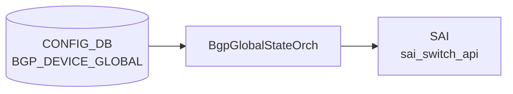

# BGP_DEVICE_GLOBAL テーブル

## 概要

スイッチ全体（[VRF](../../reference/glossary.md#term-vrf) 横断）の [BGP](../../reference/glossary.md#term-bgp) 動作スイッチを保持する。`BGP_GLOBALS` が [VRF](../../reference/glossary.md#term-vrf) 単位なのに対し、`BGP_DEVICE_GLOBAL` は装置全体スコープ。TSA (Traffic-Shift-Away)、W-[ECMP](../../reference/glossary.md#term-ecmp) ([BGP](../../reference/glossary.md#term-bgp) link-bandwidth ベース重み付き [ECMP](../../reference/glossary.md#term-ecmp))、IDF (Inter-DC Fabric) 隔離状態、confederation の代表設定を持つ[^1]。

<!-- cdb-mermaid -->
### データフロー (自動生成)



!!! note "凡例"
    CONFIG_DB から SAI までの典型経路を `docs/reference/config-db-orch-map.md` から機械生成したミニ図。詳細・例外は本ページ本文と対応表を参照。
<!-- /cdb-mermaid -->

## key 構造

```text
BGP_DEVICE_GLOBAL|STATE
BGP_DEVICE_GLOBAL|CONFED
```

2つの固定キーを持つ container 型。

## STATE のフィールド

| フィールド | 型 | デフォルト | 説明 |
|-----------|----|-----------|------|
| `tsa_enabled` | boolean | `false` | true で外部隣接へ経路広告を停止 (TSA) |
| `wcmp_enabled` | boolean | `false` | [BGP](../../reference/glossary.md#term-bgp) link-bandwidth W-[ECMP](../../reference/glossary.md#term-ecmp) 有効化 |
| `idf_isolation_state` | enum `isolated_no_export` / `isolated_withdraw_all` / `unisolated` | `unisolated` | IDF 隔離状態 |

## CONFED のフィールド

| フィールド | 型 | 説明 |
|-----------|----|------|
| `asn` | uint32 (1..2^32-1) | confederation AS 番号 |
| `peers` | string | confederation 内の sub-AS をセミコロン区切りで列挙 |

## 購読者

- `bgpcfgd`: STATE / CONFED を読み出し [vtysh](../../reference/glossary.md#term-vtysh) コマンドに変換
- `frr-mgmt-framework` (`frr_mgmt_framework_config = true` 時)
- TSA / W-ECMP は `bgpcfgd` の `TsaHandler` / `WcmpHandler` が直接担当

## 関連 CONFIG_DB / YANG / CLI

- 関連 [CONFIG_DB](../../reference/glossary.md#term-config_db): `BGP_GLOBALS`、`DEVICE_METADATA`
- 関連 CLI: [`config bgp device-global tsa`](../cli/config-bgp.md)、`config bgp device-global w-ecmp`
- 関連 [YANG](../../reference/glossary.md#term-yang): `sonic-bgp-device-global`

<!-- cdb-exceptions -->
## 例外条件・特殊挙動

| 条件 | 挙動 |
|------|------|
| `data` が None | log_err 後 return False |
| `tsa_enabled` が `"true"`/`"false"` 以外 | log_err 後 [FRR](../../reference/glossary.md#term-frr) push しない（return False） |
| `wcmp_enabled` が `"true"`/`"false"` 以外 | log_err 後 [FRR](../../reference/glossary.md#term-frr) push しない（return False） |
| chassis_tsa が `"true"` | 個別デバイスの TSA 操作をスキップ（シャーシ全体 TSA が優先） |
| キャッシュと同一値 | `is_update_required()` が False → [FRR](../../reference/glossary.md#term-frr) push スキップ |
| Jinja2 テンプレートレンダリング失敗 | log_err 後 return False、FRR 未反映 |
| `DEVICE_METADATA.localhost.type` 未設定 | switch_role が空文字列のまま処理継続（テンプレート条件分岐依存） |
| `idf_isolation_state` の不正値 | idf handler 側での検証に委ねる（DeviceGlobalCfgMgr では未検証） |

<!-- evidence: sonic-net/sonic-buildimage/src/sonic-bgpcfgd/bgpcfgd/managers_device_global.py:67L -->
<!-- /cdb-exceptions -->

<!-- value-behavior -->
## 値依存挙動マトリクス

### `idf_isolation_state` (enum) — `BGP_DEVICE_GLOBAL|STATE`

| 値 | FRR ルートマップ効果 | evidence |
|---|---|---|
| `unisolated` (既定) | `idf_unisolate.conf.j2` を適用。`CHECK_IDF_ISOLATION` ルートマップは標準状態 | `managers_device_global.py:IDF_DEFAULTS; idf_unisolate.conf.j2` |
| `isolated_no_export` | `idf_isolate.conf.j2` 適用。`route-map CHECK_IDF_ISOLATION permit 10` に `set community no-export additive` を追加 | `idf_isolate.conf.j2:17` |
| `isolated_withdraw_all` | `idf_isolate.conf.j2` 適用。`route-map CHECK_IDF_ISOLATION deny 4` を追加し残 prefix をすべてドロップ | `idf_isolate.conf.j2:11` |

### `tsa_enabled` (boolean) — `BGP_DEVICE_GLOBAL|STATE`

| 値 | FRR ルートマップ効果 | evidence |
|---|---|---|
| `false` (既定) | `bgpd.tsa.unisolate.conf.j2` を適用。TSB 状態 (通常広告) | `managers_device_global.py:TSA_DEFAULTS` |
| `true` | `bgpd.tsa.isolate.conf.j2` を適用。外部 BGP 隣接への route-map に `deny 40` を挿入し経路広告を停止 | `managers_device_global.py:isolate_unisolate_device` |

### `wcmp_enabled` (boolean) — `BGP_DEVICE_GLOBAL|STATE`

| 値 | FRR ルートマップ効果 | evidence |
|---|---|---|
| `false` (既定) | `TO_BGP_PEER_V4`/`V6` permit 100 に `no set extcommunity bandwidth` | `bgpd.wcmp.conf.j2:6` |
| `true` | `TO_BGP_PEER_V4`/`V6` permit 100 に `set extcommunity bandwidth num-multipaths` | `bgpd.wcmp.conf.j2:5` |

### 複合条件

- `tsa_enabled=true` かつ chassis_tsa が `"true"` (chassis-level TSA) → 個別デバイスの TSA 操作をスキップ (chassis TSA 優先) (`managers_device_global.py:105-106`)
- `idf_isolation_state=isolated_no_export` と `isolated_withdraw_all` の違い: `no_export` は AS 外への再広告のみ抑制、`withdraw_all` は deny 4 で隣接への送信そのものを遮断
<!-- /value-behavior -->

<!-- failure -->
## 失敗挙動・retry 分岐

### set_handler() — data が None

`set_handler()` が `data=None` で呼ばれた場合、即 `log_err` して `return False`。FRR への push は全フィールドでスキップ。retry なし。

### TSA 適用失敗

| 条件 | 挙動 |
|------|------|
| `tsa_enabled` が `"true"`/`"false"` 以外 | `isolate_unisolate_device()` 冒頭で `log_err` → `return False`。FRR push なし |
| `chassis_tsa == "true"` | ローカル TSA 操作をスキップ（chassis 優先）。`log_notice` のみ |

いずれも retry なし。次回 [CONFIG_DB](../../reference/glossary.md#term-config_db) イベント到着まで状態は更新されない。

### W-ECMP — Jinja2 レンダリング失敗

`wcmp_template.render()` が `jinja2.TemplateError` を送出した場合: `log_err` 後 `return False`。`cfg_mgr.push()` は呼ばれない。`configure_wcmp()` が `set_wcmp()` の `False` を検知し `directory.put()` もスキップ（キャッシュ不整合を防止）。

`wcmp_enabled` が `"true"`/`"false"` 以外の不正値の場合も `set_wcmp()` 冒頭で即 `return False`。

### IDF 適用失敗

| 条件 | 挙動 |
|------|------|
| `idf_isolation_state` が不正値 | `log_err` → `return False`。FRR push なし、directory 更新なし |
| `switch_role` が SpineRouter 系以外 | `log_debug` → `return True`（失敗ではなくスキップ）。directory 更新なし |

### CHASSIS_APP_DB 接続例外

`get_chassis_tsa_status()` で `SonicV2Connector` 接続例外が発生した場合: `log_err` 後 `chassis_tsa_status = "false"` で返る（フォールセーフ）。chassis TSA なし扱いで処理継続。

### BFD capability 不在

`BGP_DEVICE_GLOBAL` テーブルに [BFD](../../reference/glossary.md#term-bfd) フィールドは存在しない。[BFD](../../reference/glossary.md#term-bfd) capability 不在による失敗パスは本テーブルのスコープ外。

### retry 機構の総括

`DeviceGlobalCfgMgr` には **retry 機構が存在しない**。失敗は `log_err` 記録後に即 `return False`。再試行は [CONFIG_DB](../../reference/glossary.md#term-config_db) の次回変更イベント到着時に自然発生する。

<!-- evidence: sonic-net/sonic-buildimage/src/sonic-bgpcfgd/bgpcfgd/managers_device_global.py:61-63,146-162,186-188,244-250,256-263 -->
<!-- /failure -->

<!-- ref-triangle:start -->

## 関連リファレンス

- [YANG](../../reference/glossary.md#term-yang): [`sonic-bgp-device-global`](../yang/sonic-bgp-device-global.md)
- CLI: [`config bgp`](../cli/config-bgp.md)

<!-- ref-triangle:end -->

## 引用元

[^1]: [YANG](../../reference/glossary.md#term-yang) 定義: `sonic-bgp-device-global.yang`. <https://github.com/sonic-net/sonic-buildimage/blob/9ea932ec2e18f35e58268ec2e4456b1d4afd65cd/src/sonic-yang-models/yang-models/sonic-bgp-device-global.yang>

<!-- ops-hint -->
## 運用ヒント

### 典型値

- key: `BGP_DEVICE_GLOBAL|STATE` / `BGP_DEVICE_GLOBAL|CONFED`。
- `STATE`: `tsa_enabled=false` / `wcmp_enabled=false` / `idf_isolation_state=unisolated` が通常運用。
- TSA メンテ時のみ `tsa_enabled=true`。

### よくある誤設定

- TSA を有効にしたまま戻し忘れて外部広告が長時間停止する。
- `wcmp_enabled=true` を W-ECMP 非対応のプラットフォームで設定し、効果が出ず混乱する。

### 確認コマンド

```bash
sonic-db-cli CONFIG_DB hgetall 'BGP_DEVICE_GLOBAL|STATE'
TSA -s   # TSA 状態確認
vtysh -c "show running-config bgpd" | grep -i ecmp
```
<!-- /ops-hint -->

<!-- runtime-trace -->
## 実コンテナ動作トレース

### 段階 1 — Consumer 登録

`BgpGlobalStateOrch` ([orchagent](../../reference/glossary.md#term-orchagent) 直接 CFG 購読) が CONFIG_DB の `BGP_DEVICE_GLOBAL` テーブルを購読する。

`BGP_DEVICE_GLOBAL` は `BgpGlobalStateOrch` が `TableConsumer` で購読。

### 段階 2 — CFG→APPL 翻訳

なし ([orchagent](../../reference/glossary.md#term-orchagent) が直接 [SAI](../../reference/glossary.md#term-sai) を呼び出す)

### 段階 3 — APPL→SAI

`sai_switch_api` (TCP MD5 等のヒント設定、ECMP hash seed 等)

### 段階 4 — タイミングと副作用

**適用タイミング**: [orchagent](../../reference/glossary.md#term-orchagent) 起動時および CONFIG_DB 変化時に即時反映。[SAI](../../reference/glossary.md#term-sai) call は同期的。

**副作用**: Switch-global な BGP 関連パラメータ (ECMP) の変更は全 BGP ネクストホップに影響する。
<!-- /runtime-trace -->

<!-- entry-points -->
## 書き込み入り口 (Direction A)

対象テーブル: `BGP_DEVICE_GLOBAL`

### CLI
- `config bgp device-global tsa enable/disable`
- `config bgp device-global w-ecmp enable/disable`
  - ソース: `sonic-utilities/config/main.py (bgp グループ)`

### minigraph / sonic-cfggen
- なし

### REST / gNMI (sonic-mgmt-common)
- なし (対応 OpenConfig/[SONiC](../../reference/glossary.md#term-sonic) YANG transformer なし)

### db_migrator
- なし

### ビルド時デフォルト (init_cfg / j2 テンプレート)
- `init_cfg.json.j2` に `BGP_DEVICE_GLOBAL` セクションが存在し `tsa_enabled: false` 等のデフォルト値が注入される

### ハードコードデフォルト
- なし

### ランタイム注入 (デーモン自動書き込み)
- なし
<!-- /entry-points -->

<!-- ordering -->
## 書込み順依存 (Phase B)

`BGP_DEVICE_GLOBAL` は **[bgpcfgd](../../reference/glossary.md#term-bgpcfgd) 側 (`DeviceGlobalCfgMgr`)** と **orchagent 側 (`BgpGlobalStateOrch`)** の 2 つの consumer が同じ CONFIG_DB テーブルを購読する。[bgpcfgd](../../reference/glossary.md#term-bgpcfgd) は FRR への [vtysh](../../reference/glossary.md#term-vtysh) 反映、`BgpGlobalStateOrch` は SAI / `BfdOrch` への TSA 連動を担当する。両者は独立に動作するため、書込み順により中間状態が異なる結果になる。

### 検出された順序依存

| # | 依存関係 | 方向 | 緩和策 |
|---|----------|------|--------|
| 1 | `DEVICE_METADATA\|localhost.type` → `BGP_DEVICE_GLOBAL\|STATE.idf_isolation_state` | **先行必須**（IDF 適用判定が `switch_role` に依存） | runtime 追加時は `directory.subscribe` で `handle_type_update()` が自動回収 |
| 2 | `BgpGlobalStateOrch` インスタンス化 → `BfdOrch` インスタンス化 | **先行必須**（`gDirectory.set(bgp_global_state_orch)` を `BfdOrch` 構築前に実行） | orchdaemon 静的順序で保証（`orchdaemon.cpp:239-244`） |
| 3 | `BgpGlobalStateOrch::doTask` での TSA 変更 → `BfdOrch::handleTsaStateChange` | 即時連鎖（同一 doTask 内で `gDirectory.get<BfdOrch*>()` 経由 dispatch） | `bfd_orch` が `nullptr` の場合スキップ（緩い fallback） |
| 4 | `CHASSIS_APP_DB\|BGP_DEVICE_GLOBAL\|STATE.tsa_enabled` → 個別デバイス `tsa_enabled` の TSA 適用 | **先行優先**（chassis_tsa=true 時は個別 TSA 操作スキップ） | `configure_tsa` 内で `get_chassis_tsa_status()` が毎回再評価 |
| 5 | `BGP_DEVICE_GLOBAL\|STATE` 書き込み → `cfg_mgr.commit()` / `cfg_mgr.update()` → `isolate_unisolate_device` | TSA のみ強制 `commit + update` 先行（W-ECMP / IDF は commit せず直接 push） | TSA 適用前に [bgpcfgd](../../reference/glossary.md#term-bgpcfgd) 内未 commit 設定が FRR へ反映される副作用あり |
| 6 | `BGP_DEVICE_GLOBAL` 内フィールド処理順 (TSA → W-ECMP → IDF) | bgpcfgd `set_handler` 内で固定（`configure_tsa` → `configure_wcmp` → `configure_idf`） | 同一 set イベントでは TSA の `commit+update` が他フィールドより先に走る |
| 7 | `BGP_DEVICE_GLOBAL` キャッシュ更新 → 次回 `is_update_required` 判定 | 同期（`directory.put` 後即反映） | キャッシュと同一値なら FRR push スキップ（冪等保証） |

### 主要な制約詳細

**[DEVICE_METADATA](../../reference/glossary.md#term-device_metadata) 先行必須 (依存 #1)**: `DeviceGlobalCfgMgr.__init__` は `directory.subscribe([("CONFIG_DB", DEVICE_METADATA, "localhost/type")], self.handle_type_update)` を登録するが、初期値は `self.switch_role = ""`。`downstream_isolate_unisolate()` は `switch_role and switch_role not in ["SpineRouter", "LowerSpineRouter", "UpperSpineRouter"]` の条件で IDF 適用をスキップする。`DEVICE_METADATA` 未設定時は `switch_role == ""` のため**条件 falsy → IDF 適用が進む**（スキップされない）。`DEVICE_METADATA` が後から書き込まれて `switch_role = "ToRRouter"` 等になった場合、それまで適用されていた IDF 設定は更新トリガがない限り残置される（evidence: `managers_device_global.py:23,33,51-55,260-262`）。

**BgpGlobalStateOrch 起動順 (依存 #2, #3)**: `orchdaemon.cpp` は明示的に `BgpGlobalStateOrch` を `BfdOrch` よりも先に構築・`gDirectory.set()` する（行 239-244）。これは `BgpGlobalStateOrch::doTask` 内で `gDirectory.get<BfdOrch*>()` が成功するためにも必須だが、初期化時には逆向きの順序（`BgpGlobalStateOrch` が先）が必要。`BgpGlobalStateOrch` 自身は SAI capability query (`offload_supported`) を constructor 内で実行するため、`gSwitchId` が有効になっている必要がある（`gSwitchOrch` 構築後に走る前提）。

**TSA トリガ順 (依存 #5, #6)**: `set_handler` は TSA → W-ECMP → IDF の固定順で処理し、TSA のみ `requires_update and chassis_tsa == "false"` の条件下で `cfg_mgr.commit()` と `cfg_mgr.update()` を実行する。これは TSA route-map 生成が現在 FRR に push 済みの neighbor 設定を読む必要があるため。同一 set イベント内で BGP neighbor 設定変更と TSA 切替が同時に来た場合、bgpcfgd 内のバッファされた neighbor 設定が TSA 適用直前に強制 commit される副作用がある。W-ECMP / IDF は単独 `cfg_mgr.push()` のみで commit 連動なし（evidence: `managers_device_global.py:57-72,103-109`）。

**Chassis TSA の優先 (依存 #4)**: シャーシ構成 (`device_info.is_chassis() == true`) では `CHASSIS_APP_DB\|BGP_DEVICE_GLOBAL\|STATE.tsa_enabled` がシャーシ全体 TSA を表現する。`chassis_tsa == "true"` の間は個別 LC の `BGP_DEVICE_GLOBAL\|STATE.tsa_enabled` 書き込みでは `isolate_unisolate_device()` が呼ばれない。シャーシ TSA 解除後に LC ローカル TSA 状態を再適用するには、`BGP_DEVICE_GLOBAL\|STATE` への明示的な再書き込みが必要（evidence: `managers_device_global.py:100,106,238-251`）。

<!-- /ordering -->

<!-- defaults -->
## コード由来の暗黙デフォルト (Phase A)

> YANG `default` 以外の Python/C++ レベル fallback を per-field で整理する。
> 書き込み時デフォルト (init_cfg 注入) と実行時 fallback (del_handler / `or` / クラス定数) の乖離を区別する。

### `tsa_enabled`

| 種別 | 値 | ソース |
|------|----|--------|
| YANG default | `"false"` | `sonic-bgp-device-global.yang:35` |
| init_cfg 書き込みデフォルト | `"false"` | `init_cfg.json.j2` (ビルド時 CONFIG_DB へ静的注入) |
| Python クラス定数 | `TSA_DEFAULTS = "false"` | `managers_device_global.py:12` |
| `__init__` fallback | `path_exist` ガードで DB にキーなし時のみ directory キャッシュへ `"false"` を書き込む | `managers_device_global.py:42-43` |
| `del_handler` fallback | `configure_tsa(data=None)` → `state = TSA_DEFAULTS` → `isolate_unisolate_device("false")` (TSB 実行) | `managers_device_global.py:78,94` |
| `configure_tsa` fallback | `data` が None / キーなし → `state = "false"` | `managers_device_global.py:94-98` |

**乖離**: なし。YANG default / init_cfg / Python クラス定数すべて `"false"` で一致。`del_handler` 時は FRR に TSB ルートマップが即時 push される。

---

### `wcmp_enabled`

| 種別 | 値 | ソース |
|------|----|--------|
| YANG default | `"false"` | `sonic-bgp-device-global.yang:44` |
| init_cfg 書き込みデフォルト | `"false"` | `init_cfg.json.j2` |
| Python クラス定数 | `WCMP_DEFAULTS = "false"` | `managers_device_global.py:13` |
| `__init__` fallback | `path_exist` ガードで `"false"` を directory へ書き込む | `managers_device_global.py:45-46` |
| `del_handler` fallback | `configure_wcmp(data=None)` → `state = "false"` → `set_wcmp("false")` | `managers_device_global.py:80,116` |

**乖離**: なし。`set_wcmp("false")` は `bgpd.wcmp.conf.j2` を `wcmp_enabled="false"` でレンダリングして extcommunity bandwidth を FRR から削除する。

---

### `idf_isolation_state`

| 種別 | 値 | ソース |
|------|----|--------|
| YANG default | `"unisolated"` | `sonic-bgp-device-global.yang:59` |
| init_cfg 書き込みデフォルト | `"unisolated"` | `init_cfg.json.j2` |
| Python クラス定数 | `IDF_DEFAULTS = "unisolated"` | `managers_device_global.py:14` |
| `__init__` fallback | `path_exist` ガードで `"unisolated"` を directory へ書き込む | `managers_device_global.py:48-49` |
| `del_handler` fallback | `configure_idf(data=None)` → `state = "unisolated"` → `downstream_isolate_unisolate("unisolated")` | `managers_device_global.py:82,130` |
| 新 peer-group 追加時 | `check_state_and_get_idf_isolation_routemaps()` が `"unisolated"` なら空文字返却 → isolate テンプレート非適用 | `managers_device_global.py:283` |

**乖離 (重要)**: `downstream_isolate_unisolate("unisolated")` は `switch_role` が `SpineRouter` / `LowerSpineRouter` / `UpperSpineRouter` 以外の場合は FRR への push を**スキップ** (`managers_device_global.py:260`)。ToR 等の非 Spine では del_handler でも IDF unisolate テンプレートが送出されない。これは書き込み時デフォルト (`init_cfg` が `"unisolated"` を注入) と実行時処理の乖離ではなく、ロール依存スキップである。

---

### `asn` / `peers` (CONFED)

| 種別 | 値 | ソース |
|------|----|--------|
| YANG default | なし (optional leaf) | `sonic-bgp-device-global.yang:69-81` |
| init_cfg 書き込みデフォルト | なし (`BGP_DEVICE_GLOBAL|CONFED` セクション未定義) | `init_cfg.json.j2` |
| Python fallback | なし。`DeviceGlobalCfgMgr` は CONFED を直接処理しない | — |

**乖離**: CONFIG_DB に `BGP_DEVICE_GLOBAL|CONFED` エントリが存在しない場合、bgpcfgd は confederation 設定を FRR へ送出しない。FRR 側では `no bgp confederation identifier` が有効 (未設定状態)。

---

### 内部ランタイム参照: `chassis_tsa`

`get_chassis_tsa_status()` が `CHASSIS_APP_DB.BGP_DEVICE_GLOBAL|STATE.tsa_enabled` を読む。非シャーシ環境またはキー不在時のデフォルトは `"false"` (`managers_device_global.py:239`)。CONFIG_DB フィールドではなく内部状態変数。

<!-- evidence: managers_device_global.py:12-14,42-49,78-82,94-98,116,130,239,260,283 -->
<!-- /defaults -->

<!-- platform -->
## プラットフォーム差 (Phase H)

**[ASIC](../../reference/glossary.md#term-asic) ベンダー (Broadcom / Mellanox / Marvell / Innovium / Cisco) ごとの直接分岐は無いが、`device_info.is_chassis()` / `switch_role` (`DEVICE_METADATA.localhost.type`) / `switch_type` / SAI [BFD](../../reference/glossary.md#term-bfd) offload capability の 4 系統でテーブル処理が間接分岐する**。BGP_DEVICE_GLOBAL 自体は [SAI](../../reference/glossary.md#term-sai) を直接駆動しないが、CONFIG_DB を購読する `BgpGlobalStateOrch` がコンストラクタで SAI capability を問い合わせ、結果が `BfdOrch` の software/hw 経路選択に伝播する。

| 観点 | 結果 | 根拠 |
|------|------|------|
| [ASIC](../../reference/glossary.md#term-asic) 種別 (Broadcom / Mellanox / Marvell / Innovium / Cisco / Nephos / Centec) | 直接の if/elif は無い | `managers_device_global.py` を vendor 名で grep して 0 ヒット |
| [HwSku](../../reference/glossary.md#term-hwsku) | 影響なし | `managers_device_global.py` / `bfdorch.cpp` に [HwSku](../../reference/glossary.md#term-hwsku) 参照 0 ヒット |
| multi-asic (`is_multi_npu`) | 実質影響なし | bgpcfgd は per-namespace に独立起動。テーブル処理に namespace 別フィールドは無い |
| `device_info.is_chassis()` 真 ([VOQ](../../reference/glossary.md#term-voq) / packet-based chassis) | **分岐あり** | `managers_device_global.py:241-251` で CHASSIS_APP_DB の `BGP_DEVICE_GLOBAL|STATE.tsa_enabled` を読み、シャーシ全体 TSA が個別 LC TSA を抑止 (`configure_tsa` 内 `chassis_tsa=="false"` ガード) |
| `switch_role == 'SpineRouter' / 'LowerSpineRouter' / 'UpperSpineRouter'` | **分岐あり** | `idf_isolation_state` の FRR push が Spine 系ロールのみで実行。それ以外 (ToRRouter / LeafRouter / 空) は `downstream_isolate_unisolate()` が早期 return しテンプレート未送出 (`managers_device_global.py:260-262`) |
| `switch_type == 'chassis-packet'` ([VOQ](../../reference/glossary.md#term-voq) system) | **分岐あり** | TSA route-map 整形で `_INTERNAL_` / `VOQ_` を含む name を LC 間 iBGP として `internal_route_map=1` で render し、シャーシ内セッションをスキップしない処理に切替 (`managers_device_global.py:213-225`) |
| SAI BFD offload capability (`SAI_SWITCH_ATTR_SUPPORTED_IPV4/IPV6_BFD_SESSION_OFFLOAD_TYPE`) | **分岐あり (間接)** | `BgpGlobalStateOrch` コンストラクタ (`bfdorch.cpp:729-791`) が v4/v6 両方の offload capability を SAI に問合せ。両対応なら `bfd_offload=true` → `getSoftwareBfd()=false`、欠ければ `BfdOrch::doTask` が `m_stateSoftBfdSessionTable` 経路へ切替 (`bfdorch.cpp:116-188`) |
| `software_bfd` feature gate (`constants.yml`) | build-time | bgpcfgd 起動時に `sys_defaults['software_bfd']['status']=='enabled'` でのみ bfd manager を起動 (`main.py:118-119`)。image build 単位で固定。`files/device/<platform>/` 別の上書き機構なし |
| `use_software_bfd` という BGP_DEVICE_GLOBAL フィールド | **存在しない** | `bfdorch.cpp:116` の local 変数名であり CONFIG_DB のフィールドではない。YANG (`sonic-bgp-device-global.yang`) にも未定義 |
| `tsa_enabled` / `wcmp_enabled` のテーブル受理ロジック | 影響なし | `managers_device_global.py` の値検証 (`"true"/"false"`) と FRR push は platform / asic / hwsku を参照しない |

詳細根拠 (関数本体・呼出関係・SAI attr id) は `meta/_intermediate/cdb-flow/bgp-device-global-platform.md` を参照。
<!-- /platform -->

<!-- cross-refs -->
## 暗黙参照 (Phase C)

`BGP_DEVICE_GLOBAL` テーブル本体のフィールド (`tsa_enabled` / `wcmp_enabled` / `idf_isolation_state` / `asn` / `peers`) には現れないが、`bgpcfgd` の `DeviceGlobalCfgMgr` と orchagent の `BgpGlobalStateOrch` / `BfdOrch` が**間接的に**読み出すエンティティ群。詳細根拠は `meta/_intermediate/cdb-flow/bgp-device-global-cross-refs.md` を参照。

### `DEVICE_METADATA` (CONFIG_DB)

`DeviceGlobalCfgMgr.__init__` は `directory.subscribe([("CONFIG_DB", DEVICE_METADATA, "localhost/type")], self.handle_type_update)` を明示的に登録する:

| フィールド | 役割 | evidence |
|---|---|---|
| `localhost.type` (`switch_role`) | `downstream_isolate_unisolate()` が `SpineRouter` / `LowerSpineRouter` / `UpperSpineRouter` 以外で IDF 適用を **早期 return** | `managers_device_global.py:23,33,53-55,260-262` |

> 初期値は `self.switch_role = ""` (空文字)。`switch_role and switch_role not in [...]` 条件のため、**`DEVICE_METADATA` 未設定時は条件 falsy → IDF 適用が進む**（スキップされない）。`DEVICE_METADATA.localhost.bgp_asn` / `subtype` / `switch_type` は `managers_device_global.py` で 0 ヒット (TSA/W-ECMP/IDF は AS 番号非依存)。

### `CHASSIS_APP_DB.BGP_DEVICE_GLOBAL` (別 DB / 同名テーブル)

`get_chassis_tsa_status()` は `CHASSIS_APP_DB` の `BGP_DEVICE_GLOBAL|STATE.tsa_enabled` を直接読み、シャーシ全体 TSA を表現する:

| 参照キー | 役割 | evidence |
|---|---|---|
| `CHASSIS_APP_DB.BGP_DEVICE_GLOBAL|STATE.tsa_enabled` | `chassis_tsa == "true"` の間は個別 LC の `BGP_DEVICE_GLOBAL|STATE.tsa_enabled` 書き込みでも `isolate_unisolate_device()` が呼ばれない (chassis TSA 優先) | `managers_device_global.py:100,106,238-251` |

> `device_info.is_chassis() == false` の通常スイッチでは固定で `"false"` を返し CHASSIS_APP_DB アクセスは発生しない。シャーシでは `ChassisAppDbMgr` (`main.py:113`) が CHASSIS_APP_DB を別途購読し、CONFIG_DB / CHASSIS_APP_DB の二系統で同名テーブル `BGP_DEVICE_GLOBAL` が並走する設計。

### `BgpGlobalStateOrch` → `BfdOrch` (orchagent プロセス内 directory 経由)

orchagent 側では `BgpGlobalStateOrch` (`bfdorch.h:58-72`) が `BGP_DEVICE_GLOBAL` の CONFIG_DB consumer となり、`BfdOrch::doTask` から `gDirectory.get<BgpGlobalStateOrch*>()` 経由で読み出される:

| API | 役割 | evidence |
|---|---|---|
| `BgpGlobalStateOrch::getTsaState()` | `BfdOrch::doTask` 内で `tsa_enabled` を取得。`shutdown_bfd_during_tsa == "true"` の BFD セッション作成可否を判定 | `bfdorch.cpp:114-160`, `bfdorch.h:64` |
| `BgpGlobalStateOrch::getSoftwareBfd()` | `m_stateSoftBfdSessionTable` 経路で software BFD に切替えるか判定 | `bfdorch.cpp:114-188`, `bfdorch.h:65` |

`orchdaemon.cpp:239-241` で `BgpGlobalStateOrch` を `BfdOrch` 構築の **前** に `new` + `gDirectory.set()` する順序が明示。`m_orchList` (`orchdaemon.cpp:500`) でも `bgp_global_state_orch` が `gBfdOrch` より先に並ぶ。**CONFIG_DB ではなく orchagent プロセス内 directory 経由の暗黙参照**である点に注意。

### `BFD_SESSION` (CONFIG_DB) — `BGP_DEVICE_GLOBAL` 変化が波及

`BGP_DEVICE_GLOBAL.tsa_enabled` 変化時に `BfdOrch::doTask` (`bfdorch.cpp:141-160`) の判定経由で `shutdown_bfd_during_tsa = "true"` を持つ BFD セッションの作成/維持判定が再評価される。

| エンティティ | 関係 | evidence |
|---|---|---|
| `BFD_SESSION` (CONFIG_DB) | `tsa_enabled` 変化時に `shutdown_bfd_during_tsa=true` セッションの作成/維持判定を再評価 (逆方向の暗黙参照) | `bfdorch.cpp:114-160` |

### `FEATURE` (CONFIG_DB) — 直接参照なし

`managers_device_global.py` および `bfdorch.{cpp,h}` を `FEATURE` で grep して **0 ヒット**。BGP コンテナ起動制御 (`FEATURE|bgp.state`) は `hostcfgd` 側に分離されており、`BGP_DEVICE_GLOBAL` フロー内には `FEATURE` 参照は存在しない。

> `software_bfd` 機能ゲートは `constants.yml` (build-time) で制御され (`main.py:118-119`)、CONFIG_DB の `FEATURE` ではない。隣接リファレンスとして `FEATURE|bgp` は BGP コンテナ起動の前提となる運用上の含意のみ持つ。

### `constants.yml` (CONFIG_DB 外部依存)

| 経路 | 用途 | evidence |
|---|---|---|
| `tsa_template.render(... constants=self.constants)` | TSA route-map テンプレ展開 | `managers_device_global.py:225` |
| `idf_isolate_template.render(... constants=self.constants)` | IDF isolate route-map テンプレ展開 | `managers_device_global.py:269,285` |
| `idf_unisolate_template.render(constants=self.constants)` | IDF unisolate route-map テンプレ展開 | `managers_device_global.py:266` |

### `BGP_GLOBALS` (CONFIG_DB) — 隣接だが直接参照なし

`managers_device_global.py` で `BGP_GLOBALS` を grep して 0 ヒット。`BGP_DEVICE_GLOBAL` (装置全体スコープ) と `BGP_GLOBALS` ([VRF](../../reference/glossary.md#term-vrf) 単位) は同 `bgpcfgd` プロセス内で別マネージャが処理する設計分離。TSA route-map は `cfg_mgr.get_text()` (FRR running-config) から `neighbor <X> route-map <name> out` を逆引きするため、`BGP_GLOBALS` 由来の neighbor 設定が FRR に反映済みであることが**実行時の前提** (CONFIG_DB レベルの読み合いではない)。

<!-- /cross-refs -->

<!-- constants -->
## ハードコード定数 (Phase E)

### managers_device_global.py クラス定数 (L12-14)

| 定数 | 値 | 用途 | evidence |
|-----|-----|------|---------|
| `TSA_DEFAULTS` | `"false"` | `tsa_enabled` の Python 側既定値 (`__init__` / `del_handler` / `configure_tsa(data=None)` fallback) | `managers_device_global.py:12` |
| `WCMP_DEFAULTS` | `"false"` | `wcmp_enabled` の Python 側既定値 | `managers_device_global.py:13` |
| `IDF_DEFAULTS` | `"unisolated"` | `idf_isolation_state` の Python 側既定値 | `managers_device_global.py:14` |

### フィールド値リテラル — 受理セット

| フィールド | 受理する文字列 | 拒否時 | evidence |
|-----------|---------------|--------|---------|
| `tsa_enabled` | `"true"` / `"false"` のみ (小文字厳密一致) | `log_err("TSA: invalid value(...)")` → False 返却 | `managers_device_global.py:103,186-188` |
| `wcmp_enabled` | `"true"` / `"false"` のみ | `log_err("W-ECMP: invalid value(...)")` → False 返却 | `managers_device_global.py:146-148` |
| `idf_isolation_state` | `"unisolated"` / `"isolated_withdraw_all"` / `"isolated_no_export"` のみ | `log_err("IDF: invalid value(...)")` → False 返却 | `managers_device_global.py:256-258` |

> `"True"` / `"FALSE"` / `"1"` / `"0"` は YANG `boolean` 形式に反するためすべて拒否される。`BgpGlobalStateOrch` (C++) 側も `value == "true"` という小文字リテラル一致で bool 化する (`bfdorch.cpp:815`)。

### switch_role 受理リスト (L260)

| 文字列 | 用途 | evidence |
|--------|------|---------|
| `"SpineRouter"` / `"LowerSpineRouter"` / `"UpperSpineRouter"` | IDF isolate/unisolate の FRR push を実行する 3 ロール。それ以外は `downstream_isolate_unisolate()` が早期 return | `managers_device_global.py:260` |

### chassis 内 BGP セッション識別 substring (L215, L219-222)

| 文字列 | 用途 |
|--------|------|
| `"_INTERNAL_"` / `"VOQ_"` | route-map 名にこの substring を含むものは [VOQ](../../reference/glossary.md#term-voq) chassis 内 LC 間 iBGP として扱い、TSA isolate 時も isolate 対象に含める (`internal_route_map="1"`) |
| `"V4"` / `"V6"` | route-map 名に含めば `ip_version` / `ip_protocol` 変数として j2 に渡す |

### CHASSIS_APP_DB 参照キー (L247)

| 項目 | 値 |
|------|----|
| DB | `CHASSIS_APP_DB` |
| Key | `"BGP_DEVICE_GLOBAL|STATE"` (リテラル) |
| Field | `"tsa_enabled"` (リテラル) |
| 失敗時 fallback | `"false"` (`managers_device_global.py:239`) |

### route-map 名抽出 regex (L231)

| 定数 | 値 | 用途 |
|------|----|------|
| `out_route_map` | `r'^\s*neighbor \S+ route-map (\S+) out$'` | bgpd 現行 config からアウトバウンド route-map 名を抽出 |

### FRR コマンドリテラル (テンプレート由来)

| テンプレート | 主要 FRR リテラル | evidence |
|-------------|-------------------|---------|
| `bgpd/wcmp/bgpd.wcmp.conf.j2` | `route-map TO_BGP_PEER_V4/V6 permit 100` + `set extcommunity bandwidth num-multipaths` (true) / `no set extcommunity bandwidth` (false) | `bgpd.wcmp.conf.j2:4-18` |
| `bgpd/tsa/bgpd.tsa.isolate.conf.j2` | `route-map {name} permit 20` + `match {ip} address prefix-list PL_Loopback{V4,V6}`、`route-map {name} permit 30` + `match tag <internal_community_match_tag>`、`route-map {name} deny 40` (catch-all) | `bgpd.tsa.isolate.conf.j2:1-13` |
| `bgpd/idf_isolate/idf_isolate.conf.j2` | `route-map CHECK_IDF_ISOLATION permit 1/2/3` (Loopback + tag)、`deny 4` (isolated_withdraw_all 限定)、`permit 10` + `set community no-export additive` (isolated_no_export 時) | `idf_isolate.conf.j2:1-22` |
| `bgpd/idf_isolate/idf_unisolate.conf.j2` | `no route-map CHECK_IDF_ISOLATION permit 1/2/3` + `no route-map ... deny 4` + `permit 10` + `no set community no-export additive` | `idf_unisolate.conf.j2:1-6` |

> route-map 名 `TO_BGP_PEER_V4` / `TO_BGP_PEER_V6` / `CHECK_IDF_ISOLATION` および seq 番号 (`20` / `30` / `40` / `100` / `1` / `2` / `3` / `4` / `10`) はすべて FRR j2 側ハードコードで、CONFIG_DB / constants.yml から差し替え不可。

### BgpGlobalStateOrch (bfdorch.cpp) 側リテラル

| 項目 | 値 | evidence |
|------|----|---------|
| `tsa_enabled` 初期値 | `false` (C++ bool) | `bfdorch.cpp:733` |
| field 名マッチ | `"tsa_enabled"` (`wcmp_enabled` / `idf_isolation_state` は無視) | `bfdorch.cpp:813` |
| value 比較 | `value == "true"` (小文字厳密一致) | `bfdorch.cpp:815` |
| SAI attr (v4 offload 照会) | `SAI_SWITCH_ATTR_SUPPORTED_IPV4_BFD_SESSION_OFFLOAD_TYPE` | `bfdorch.cpp:761` |
| SAI attr (v6 offload 照会) | `SAI_SWITCH_ATTR_SUPPORTED_IPV6_BFD_SESSION_OFFLOAD_TYPE` | `bfdorch.cpp:764` |
| offload 判定 | `attr.value.u32list.list[0] != SAI_BFD_SESSION_OFFLOAD_TYPE_NONE` | `bfdorch.cpp:787` |
| capability list 要求サイズ | `1` (`u32list.count = 1` 固定) | `bfdorch.cpp:780-782` |

> orchagent 側は `tsa_enabled` 1 フィールドしか購読しない (`if (type == "tsa_enabled")`)。`wcmp_enabled` / `idf_isolation_state` は完全に bgpcfgd → FRR 経路で閉じ、SAI まで届かない。

> **スキャン証跡**: `managers_device_global.py` 全 288 行読了 (クラス定数 3、受理文字列 8、ロール 3、substring 4、regex 1)。`bfdorch.cpp` L114-200 / L729-829 読了 (リテラル 8、SAI attr id 2)。FRR j2 テンプレート 5 件読了 (route-map 名 3、seq 番号 9 種、extcommunity リテラル 1)。中間ファイル: `meta/_intermediate/cdb-flow/bgp-device-global-constants.md`
<!-- /constants -->

<!-- side-effects -->
## 副次 DB 書込 (Phase F)

`BGP_DEVICE_GLOBAL|STATE` / `BGP_DEVICE_GLOBAL|CONFED` への SET/DEL が引き起こす、CONFIG_DB 以外の DB への書込みと SAI 呼び出しを示す。bgpcfgd 経路 (`DeviceGlobalCfgMgr` / `ChassisAppDbMgr`) は **副次 DB への直接書込みを行わず**、すべて FRR への [vtysh](../../reference/glossary.md#term-vtysh) コマンド送出 (`cfg_mgr.push`) と in-process `directory` キャッシュ更新に閉じる。副次 DB 書込みは orchagent 側 `BgpGlobalStateOrch` から `BfdOrch::handleTsaStateChange` への dispatch、および CLI スクリプト (`TSA`/`TSB`) からの直接書込みでのみ発生する。

### SET — `BGP_DEVICE_GLOBAL|STATE`

| 操作 | 対象 DB / テーブル | キー / フィールド | 条件 |
|------|------------------|-----------------|------|
| `m_stateBfdSessionTable.del(<peer>)` | [STATE_DB](../../reference/glossary.md#term-state_db) / `BFD_SESSION_TABLE` | `<peer key>` | `tsa_enabled=true` への変化 かつ `bfd_session_cache` にエントリ有 (`BgpGlobalStateOrch::doTask` → `BfdOrch::handleTsaStateChange`) |
| `m_stateBfdSessionTable.set(<peer>, fv)` | [STATE_DB](../../reference/glossary.md#term-state_db) / `BFD_SESSION_TABLE` | `<peer key>` | `tsa_enabled=false` への変化 かつ退避セッション存在 (同上) |
| (`sonic-cfggen -a` 経由) CONFIG_DB `BGP_DEVICE_GLOBAL|STATE.tsa_enabled` set | CONFIG_DB / `BGP_DEVICE_GLOBAL` | `STATE` field=`tsa_enabled` | CLI `TSA` / `TSB` 実行時のみ (本テーブル自身への波及書込) |
| `HMSET BGP_DEVICE_GLOBAL|STATE tsa_enabled <bool>` | CHASSIS_APP_DB / `BGP_DEVICE_GLOBAL` | `STATE` field=`tsa_enabled` | シャーシ supervisor 上で `TSA` / `TSB` 実行時 (各 LC の `ChassisAppDbMgr` が再購読し FRR へ伝播) |
| `HDEL ALL_SERVICE_STATUS|tsa_tsb_service running` | [STATE_DB](../../reference/glossary.md#term-state_db) / `ALL_SERVICE_STATUS` | `tsa_tsb_service` field=`running` | `TSA` / `TSB` スクリプト完了時 (`tsa_tsb_service` サービス管理) |

SAI 呼び出し (`ASIC_DB` に反映):

- `sai_bfd_api->remove_bfd_session(<oid>)` — `tsa_enabled=true` 遷移時に既存 BFD セッションを一括解除 (`BfdOrch::remove_bfd_session`、`bfdorch.cpp:629` 周辺)
- `sai_bfd_api->create_bfd_session(...)` — `tsa_enabled=false` 復帰時に退避セッションを再作成 (`BfdOrch::create_bfd_session`、`bfdorch.cpp:565` 周辺)
- `sai_query_attribute_capability(SAI_SWITCH_ATTR_SUPPORTED_IPV4/IPV6_BFD_SESSION_OFFLOAD_TYPE)` — `BgpGlobalStateOrch` コンストラクタで一度だけ実行 (read のみ、DB 書込なし)

注: `wcmp_enabled` / `idf_isolation_state` の変更は副次 DB / SAI への波及なし (FRR vtysh push のみ)。

### DEL — `BGP_DEVICE_GLOBAL|STATE`

| 操作 | 対象 DB / テーブル | キー / フィールド | 条件 |
|------|------------------|-----------------|------|
| (なし — bgpcfgd `del_handler` は `configure_{tsa,wcmp,idf}(data=None)` でデフォルト値 (`"false"` / `"unisolated"`) を FRR へ push するのみ) | — | — | `DeviceGlobalCfgMgr.del_handler` (`managers_device_global.py:74-84`) |
| `m_stateBfdSessionTable.del/set` | STATE_DB / `BFD_SESSION_TABLE` | `<peer key>` | `BgpGlobalStateOrch::doTask` は DEL を `SWSS_LOG_ERROR("DEL on key %s is not expected.")` で拒否 (`bfdorch.cpp:830-833`)、よって BFD 連動は発生しない |

SAI 呼び出し: なし (`BgpGlobalStateOrch` 側で DEL を処理しないため)。

### SET / DEL — `BGP_DEVICE_GLOBAL|CONFED`

| 操作 | 対象 DB / テーブル | キー / フィールド | 条件 |
|------|------------------|-----------------|------|
| (なし) | — | — | `DeviceGlobalCfgMgr` は `STATE` のみ処理。`CONFED` は別 manager (`managers_bgp.py` 経由 BGP_GLOBALS の confederation 解決) で FRR へ反映され、副次 DB / SAI 書込みなし |

### 補足

- `BgpGlobalStateOrch` は `tsa_enabled` フィールドのみを `doTask` で処理する。`wcmp_enabled` / `idf_isolation_state` は同 orch 内で参照されない (FRR 側完結)。
- `BfdOrch::handleTsaStateChange` の波及は **アクティブな BFD セッションが存在する場合のみ** 観察される。`BFD_SESSION` テーブル空状態では STATE_DB / [ASIC_DB](../../reference/glossary.md#term-asic_db) への書込みは発生しない (`bfdorch.cpp:683-704` の `for (auto it : bfd_session_cache)` ループが空回り)。
- シャーシ環境では CLI `TSA`/`TSB` の CHASSIS_APP_DB 書込みが各 LC に伝播し、LC 側 `ChassisAppDbMgr.set_handler` 経由で `isolate_unisolate_device` が起動する。この LC 側経路でも副次 DB 書込みは 0 件 (FRR push のみ)。

<!-- 証跡: sonic-buildimage/src/sonic-bgpcfgd/bgpcfgd/managers_device_global.py, managers_chassis_app_db.py; sonic-swss/orchagent/bfdorch.cpp:683-840,565,629; sonic-buildimage/dockers/docker-fpm-frr/base_image_files/{TSA,TSB,TS} -->
<!-- /side-effects -->

<!-- pubsub -->
## 通信メカニズム (Phase G)

`BGP_DEVICE_GLOBAL` テーブルは **`SubscriberStateTable`** を用いた [Redis](../../reference/glossary.md#term-redis) keyspace notification ベースの push 型購読で 2 プロセスに配信される。

### bgpcfgd — Runner の SubscriberStateTable

```python
# sonic-bgpcfgd/bgpcfgd/runner.py:49
subscriber = swsscommon.SubscriberStateTable(conn, table_name)
self.selector.addSelectable(subscriber)
```

`Runner` が `DeviceGlobalCfgMgr("CONFIG_DB", CFG_BGP_DEVICE_GLOBAL_TABLE_NAME)` の登録に基づき `SubscriberStateTable` を生成。[Redis](../../reference/glossary.md#term-redis) keyspace 通知をエポールで受信後 `subscriber.pop()` → `set_handler` / `del_handler` へ dispatch し、FRR vtysh push を実行する。タイムアウト間隔 10 s（`runner.py:57`）。

シャーシ環境では `ChassisAppDbMgr` が同じ仕組みで **CHASSIS_APP_DB の `BGP_DEVICE_GLOBAL`** も購読する（`main.py:113`）。

### bgpcfgd — directory.subscribe (in-process)

`DeviceGlobalCfgMgr.__init__` は bgpcfgd プロセス内のインメモリ directory に対して `directory.subscribe` を呼び出し、`DEVICE_METADATA.localhost.type` 変化時に `handle_type_update` でロールを更新する（`managers_device_global.py:33`）。[Redis](../../reference/glossary.md#term-redis) への接続は不要で Python オブジェクト内コールバックとして動作する。

`ChassisAppDbMgr` は同様に `CONFIG_DB.BGP_DEVICE_GLOBAL.tsa_enabled` の変化を `directory.subscribe` で受信し、LC ローカル TSA とシャーシ全体 TSA の調整を行う（`managers_chassis_app_db.py:20`）。

### orchagent — BgpGlobalStateOrch の SubscriberStateTable

```cpp
// orchagent/orch.cpp:1190
addExecutor(new Consumer(
    new SubscriberStateTable(db, tableName, TableConsumable::DEFAULT_POP_BATCH_SIZE, pri),
    this, tableName));
```

`BgpGlobalStateOrch(m_configDb, CFG_BGP_DEVICE_GLOBAL_TABLE_NAME)` が `Orch` 基底クラス経由で `SubscriberStateTable(CONFIG_DB, "BGP_DEVICE_GLOBAL")` を生成（`orchdaemon.cpp:240`）。epoll イベント受信後 `BgpGlobalStateOrch::doTask(Consumer&)` が呼び出され、`tsa_enabled` フィールドのみを消費して `BfdOrch::handleTsaStateChange` へ連鎖する（`bfdorch.cpp:793-825`）。`wcmp_enabled` / `idf_isolation_state` は orchagent 側では無視される。

### 購読方式まとめ

| コンシューマ | 購読方式 | 対象 DB | 処理フィールド |
|------------|---------|---------|--------------|
| `DeviceGlobalCfgMgr` (bgpcfgd) | `SubscriberStateTable` (Runner 経由) | CONFIG_DB | `tsa_enabled` / `wcmp_enabled` / `idf_isolation_state` |
| `DeviceGlobalCfgMgr` (bgpcfgd) | `directory.subscribe` (in-process) | CONFIG_DB / `DEVICE_METADATA` | `localhost.type` (switch_role 更新) |
| `ChassisAppDbMgr` (bgpcfgd, chassis のみ) | `SubscriberStateTable` (Runner 経由) | CHASSIS_APP_DB / `BGP_DEVICE_GLOBAL` | `tsa_enabled` |
| `ChassisAppDbMgr` (bgpcfgd, chassis のみ) | `directory.subscribe` (in-process) | CONFIG_DB / `BGP_DEVICE_GLOBAL` | `tsa_enabled` (LC ローカル変化追従) |
| `BgpGlobalStateOrch` (orchagent) | `SubscriberStateTable` (Orch 基底) | CONFIG_DB | `tsa_enabled` のみ |

bgpcfgd と orchagent は独立プロセスのため、同一 SET イベントに対して並列に処理が走り、完了の相対順序は保証されない。詳細根拠は `meta/_intermediate/cdb-flow/bgp-device-global-pubsub.md` を参照。
<!-- /pubsub -->

<!-- glossary-links-injected: 8c9bb48d191c -->
