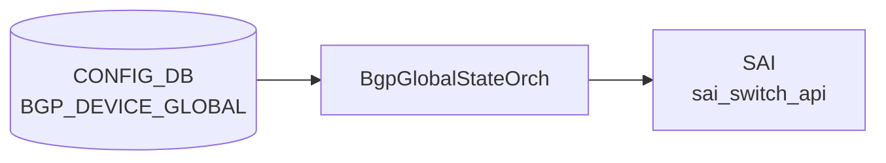

# BGP_DEVICE_GLOBAL テーブル

## 概要

スイッチ全体（[VRF](../../reference/glossary.md#term-vrf) 横断）の [BGP](../../reference/glossary.md#term-bgp) 動作スイッチを保持する。`BGP_GLOBALS` が [VRF](../../reference/glossary.md#term-vrf) 単位なのに対し、`BGP_DEVICE_GLOBAL` は装置全体スコープ。TSA (Traffic-Shift-Away)、W-[ECMP](../../reference/glossary.md#term-ecmp) ([BGP](../../reference/glossary.md#term-bgp) link-bandwidth ベース重み付き [ECMP](../../reference/glossary.md#term-ecmp))、IDF (Inter-DC Fabric) 隔離状態、confederation の代表設定を持つ[^1]。

<!-- cdb-mermaid -->
### データフロー (自動生成)



!!! note "凡例"
    CONFIG_DB から SAI までの典型経路を `docs/reference/config-db-orch-map.md` から機械生成したミニ図。詳細・例外は本ページ本文と対応表を参照。
<!-- /cdb-mermaid -->

## key 構造

```text
BGP_DEVICE_GLOBAL|STATE
BGP_DEVICE_GLOBAL|CONFED
```

二つの固定キーを持つ container 型。

## STATE のフィールド

| フィールド | 型 | デフォルト | 説明 |
|-----------|----|-----------|------|
| `tsa_enabled` | boolean | `false` | true で外部隣接へ経路広告を停止 (TSA) |
| `wcmp_enabled` | boolean | `false` | [BGP](../../reference/glossary.md#term-bgp) link-bandwidth W-[ECMP](../../reference/glossary.md#term-ecmp) 有効化 |
| `idf_isolation_state` | enum `isolated_no_export` / `isolated_withdraw_all` / `unisolated` | `unisolated` | IDF 隔離状態 |

## CONFED のフィールド

| フィールド | 型 | 説明 |
|-----------|----|------|
| `asn` | uint32 (1..2^32-1) | confederation AS 番号 |
| `peers` | string | confederation 内の sub-AS をセミコロン区切りで列挙 |

## 購読者

- `bgpcfgd`: STATE / CONFED を読み出し vtysh コマンドに変換
- `frr-mgmt-framework` (`frr_mgmt_framework_config = true` 時)
- TSA / W-ECMP は `bgpcfgd` の `TsaHandler` / `WcmpHandler` が直接担当

## 関連 CONFIG_DB / YANG / CLI

- 関連 [CONFIG_DB](../../reference/glossary.md#term-config_db): `BGP_GLOBALS`、`DEVICE_METADATA`
- 関連 CLI: [`config bgp device-global tsa`](../cli/config-bgp.md)、`config bgp device-global w-ecmp`
- 関連 [YANG](../../reference/glossary.md#term-yang): `sonic-bgp-device-global`

<!-- cdb-exceptions -->
## 例外条件・特殊挙動

| 条件 | 挙動 |
|------|------|
| `data` が None | log_err 後 return False |
| `tsa_enabled` が `"true"`/`"false"` 以外 | log_err 後 FRR push しない（return False） |
| `wcmp_enabled` が `"true"`/`"false"` 以外 | log_err 後 FRR push しない（return False） |
| chassis_tsa が `"true"` | 個別デバイスの TSA 操作をスキップ（シャーシ全体 TSA が優先） |
| キャッシュと同一値 | `is_update_required()` が False → FRR push スキップ |
| Jinja2 テンプレートレンダリング失敗 | log_err 後 return False、FRR 未反映 |
| `DEVICE_METADATA.localhost.type` 未設定 | switch_role が空文字列のまま処理継続（テンプレート条件分岐依存） |
| `idf_isolation_state` の不正値 | idf handler 側での検証に委ねる（DeviceGlobalCfgMgr では未検証） |

<!-- evidence: sonic-net/sonic-buildimage/src/sonic-bgpcfgd/bgpcfgd/managers_device_global.py:67L -->
<!-- /cdb-exceptions -->

<!-- ref-triangle:start -->

## 関連リファレンス

- [YANG](../../reference/glossary.md#term-yang): [`sonic-bgp-device-global`](../yang/sonic-bgp-device-global.md)
- CLI: [`config bgp`](../cli/config-bgp.md)

<!-- ref-triangle:end -->

## 引用元

[^1]: [YANG](../../reference/glossary.md#term-yang) 定義: `sonic-bgp-device-global.yang`. <https://github.com/sonic-net/sonic-buildimage/blob/9ea932ec2e18f35e58268ec2e4456b1d4afd65cd/src/sonic-yang-models/yang-models/sonic-bgp-device-global.yang>

<!-- ops-hint -->
## 運用ヒント

### 典型値

- key: `BGP_DEVICE_GLOBAL|STATE` / `BGP_DEVICE_GLOBAL|CONFED`。
- `STATE`: `tsa_enabled=false` / `wcmp_enabled=false` / `idf_isolation_state=unisolated` が通常運用。
- TSA メンテ時のみ `tsa_enabled=true`。

### よくある誤設定

- TSA を有効にしたまま戻し忘れて外部広告が長時間停止する。
- `wcmp_enabled=true` を W-ECMP 非対応のプラットフォームで設定し、効果が出ず混乱する。

### 確認コマンド

```bash
sonic-db-cli CONFIG_DB hgetall 'BGP_DEVICE_GLOBAL|STATE'
TSA -s   # TSA 状態確認
vtysh -c "show running-config bgpd" | grep -i ecmp
```
<!-- /ops-hint -->

<!-- glossary-links-injected: 029bff240b1b -->
