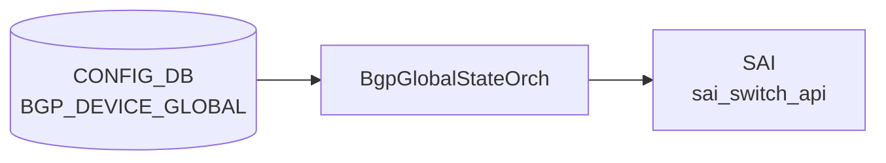

# BGP_DEVICE_GLOBAL テーブル

## 概要

スイッチ全体（[VRF](../../reference/glossary.md#term-vrf) 横断）の [BGP](../../reference/glossary.md#term-bgp) 動作スイッチを保持する。`BGP_GLOBALS` が [VRF](../../reference/glossary.md#term-vrf) 単位なのに対し、`BGP_DEVICE_GLOBAL` は装置全体スコープ。TSA (Traffic-Shift-Away)、W-[ECMP](../../reference/glossary.md#term-ecmp) ([BGP](../../reference/glossary.md#term-bgp) link-bandwidth ベース重み付き [ECMP](../../reference/glossary.md#term-ecmp))、IDF (Inter-DC Fabric) 隔離状態、confederation の代表設定を持つ[^1]。

<!-- cdb-mermaid -->
### データフロー (自動生成)



!!! note "凡例"
    CONFIG_DB から SAI までの典型経路を `docs/reference/config-db-orch-map.md` から機械生成したミニ図。詳細・例外は本ページ本文と対応表を参照。
<!-- /cdb-mermaid -->

## key 構造

```text
BGP_DEVICE_GLOBAL|STATE
BGP_DEVICE_GLOBAL|CONFED
```

二つの固定キーを持つ container 型。

## STATE のフィールド

| フィールド | 型 | デフォルト | 説明 |
|-----------|----|-----------|------|
| `tsa_enabled` | boolean | `false` | true で外部隣接へ経路広告を停止 (TSA) |
| `wcmp_enabled` | boolean | `false` | [BGP](../../reference/glossary.md#term-bgp) link-bandwidth W-[ECMP](../../reference/glossary.md#term-ecmp) 有効化 |
| `idf_isolation_state` | enum `isolated_no_export` / `isolated_withdraw_all` / `unisolated` | `unisolated` | IDF 隔離状態 |

## CONFED のフィールド

| フィールド | 型 | 説明 |
|-----------|----|------|
| `asn` | uint32 (1..2^32-1) | confederation AS 番号 |
| `peers` | string | confederation 内の sub-AS をセミコロン区切りで列挙 |

## 購読者

- `bgpcfgd`: STATE / CONFED を読み出し vtysh コマンドに変換
- `frr-mgmt-framework` (`frr_mgmt_framework_config = true` 時)
- TSA / W-ECMP は `bgpcfgd` の `TsaHandler` / `WcmpHandler` が直接担当

## 関連 CONFIG_DB / YANG / CLI

- 関連 [CONFIG_DB](../../reference/glossary.md#term-config_db): `BGP_GLOBALS`、`DEVICE_METADATA`
- 関連 CLI: [`config bgp device-global tsa`](../cli/config-bgp.md)、`config bgp device-global w-ecmp`
- 関連 [YANG](../../reference/glossary.md#term-yang): `sonic-bgp-device-global`

<!-- cdb-exceptions -->
## 例外条件・特殊挙動

| 条件 | 挙動 |
|------|------|
| `data` が None | log_err 後 return False |
| `tsa_enabled` が `"true"`/`"false"` 以外 | log_err 後 FRR push しない（return False） |
| `wcmp_enabled` が `"true"`/`"false"` 以外 | log_err 後 FRR push しない（return False） |
| chassis_tsa が `"true"` | 個別デバイスの TSA 操作をスキップ（シャーシ全体 TSA が優先） |
| キャッシュと同一値 | `is_update_required()` が False → FRR push スキップ |
| Jinja2 テンプレートレンダリング失敗 | log_err 後 return False、FRR 未反映 |
| `DEVICE_METADATA.localhost.type` 未設定 | switch_role が空文字列のまま処理継続（テンプレート条件分岐依存） |
| `idf_isolation_state` の不正値 | idf handler 側での検証に委ねる（DeviceGlobalCfgMgr では未検証） |

<!-- evidence: sonic-net/sonic-buildimage/src/sonic-bgpcfgd/bgpcfgd/managers_device_global.py:67L -->
<!-- /cdb-exceptions -->

<!-- value-behavior -->
## 値依存挙動マトリクス

### `idf_isolation_state` (enum) — `BGP_DEVICE_GLOBAL|STATE`

| 値 | FRR ルートマップ効果 | evidence |
|---|---|---|
| `unisolated` (既定) | `idf_unisolate.conf.j2` を適用。`CHECK_IDF_ISOLATION` ルートマップは標準状態 | `managers_device_global.py:IDF_DEFAULTS; idf_unisolate.conf.j2` |
| `isolated_no_export` | `idf_isolate.conf.j2` 適用。`route-map CHECK_IDF_ISOLATION permit 10` に `set community no-export additive` を追加 | `idf_isolate.conf.j2:17` |
| `isolated_withdraw_all` | `idf_isolate.conf.j2` 適用。`route-map CHECK_IDF_ISOLATION deny 4` を追加し残 prefix をすべてドロップ | `idf_isolate.conf.j2:11` |

### `tsa_enabled` (boolean) — `BGP_DEVICE_GLOBAL|STATE`

| 値 | FRR ルートマップ効果 | evidence |
|---|---|---|
| `false` (既定) | `bgpd.tsa.unisolate.conf.j2` を適用。TSB 状態 (通常広告) | `managers_device_global.py:TSA_DEFAULTS` |
| `true` | `bgpd.tsa.isolate.conf.j2` を適用。外部 BGP 隣接への route-map に `deny 40` を挿入し経路広告を停止 | `managers_device_global.py:isolate_unisolate_device` |

### `wcmp_enabled` (boolean) — `BGP_DEVICE_GLOBAL|STATE`

| 値 | FRR ルートマップ効果 | evidence |
|---|---|---|
| `false` (既定) | `TO_BGP_PEER_V4`/`V6` permit 100 に `no set extcommunity bandwidth` | `bgpd.wcmp.conf.j2:6` |
| `true` | `TO_BGP_PEER_V4`/`V6` permit 100 に `set extcommunity bandwidth num-multipaths` | `bgpd.wcmp.conf.j2:5` |

### 複合条件

- `tsa_enabled=true` かつ chassis_tsa が `"true"` (chassis-level TSA) → 個別デバイスの TSA 操作をスキップ (chassis TSA 優先) (`managers_device_global.py:105-106`)
- `idf_isolation_state=isolated_no_export` と `isolated_withdraw_all` の違い: `no_export` は AS 外への再広告のみ抑制、`withdraw_all` は deny 4 で隣接への送信そのものを遮断
<!-- /value-behavior -->

<!-- ref-triangle:start -->

## 関連リファレンス

- [YANG](../../reference/glossary.md#term-yang): [`sonic-bgp-device-global`](../yang/sonic-bgp-device-global.md)
- CLI: [`config bgp`](../cli/config-bgp.md)

<!-- ref-triangle:end -->

## 引用元

[^1]: [YANG](../../reference/glossary.md#term-yang) 定義: `sonic-bgp-device-global.yang`. <https://github.com/sonic-net/sonic-buildimage/blob/9ea932ec2e18f35e58268ec2e4456b1d4afd65cd/src/sonic-yang-models/yang-models/sonic-bgp-device-global.yang>

<!-- ops-hint -->
## 運用ヒント

### 典型値

- key: `BGP_DEVICE_GLOBAL|STATE` / `BGP_DEVICE_GLOBAL|CONFED`。
- `STATE`: `tsa_enabled=false` / `wcmp_enabled=false` / `idf_isolation_state=unisolated` が通常運用。
- TSA メンテ時のみ `tsa_enabled=true`。

### よくある誤設定

- TSA を有効にしたまま戻し忘れて外部広告が長時間停止する。
- `wcmp_enabled=true` を W-ECMP 非対応のプラットフォームで設定し、効果が出ず混乱する。

### 確認コマンド

```bash
sonic-db-cli CONFIG_DB hgetall 'BGP_DEVICE_GLOBAL|STATE'
TSA -s   # TSA 状態確認
vtysh -c "show running-config bgpd" | grep -i ecmp
```
<!-- /ops-hint -->


<!-- runtime-trace -->
## 実コンテナ動作トレース

### 段階 1 — Consumer 登録

`BgpGlobalStateOrch` (orchagent 直接 CFG 購読) が CONFIG_DB の `BGP_DEVICE_GLOBAL` テーブルを購読する。

`BGP_DEVICE_GLOBAL` は `BgpGlobalStateOrch` が `TableConsumer` で購読。

### 段階 2 — CFG→APPL 翻訳

なし (orchagent が直接 SAI を呼び出す)

### 段階 3 — APPL→SAI

`sai_switch_api` (TCP MD5 等のヒント設定、ECMP hash seed 等)

### 段階 4 — タイミングと副作用

**適用タイミング**: orchagent 起動時および CONFIG_DB 変化時に即時反映。SAI call は同期的。

**副作用**: Switch-global な BGP 関連パラメータ (ECMP) の変更は全 BGP ネクストホップに影響する。
<!-- /runtime-trace -->

<!-- entry-points -->
## 書き込み入り口 (Direction A)

対象テーブル: `BGP_DEVICE_GLOBAL`

### CLI
- `config bgp device-global tsa enable/disable`
- `config bgp device-global w-ecmp enable/disable`
  - ソース: `sonic-utilities/config/main.py (bgp グループ)`

### minigraph / sonic-cfggen
- なし

### REST / gNMI (sonic-mgmt-common)
- なし (対応 OpenConfig/SONiC YANG transformer なし)

### db_migrator
- なし

### ビルド時デフォルト (init_cfg / j2 テンプレート)
- `init_cfg.json.j2` に `BGP_DEVICE_GLOBAL` セクションが存在し `tsa_enabled: false` 等のデフォルト値が注入される

### ハードコードデフォルト
- なし

### ランタイム注入 (デーモン自動書き込み)
- なし
<!-- /entry-points -->

<!-- derivation -->
## 派生・条件付き登録 (Phase 6/7)

### Phase 6: 自動派生

| 派生先フィールド/動作 | 派生元条件 | 派生値 | ソース |
|---|---|---|---|
| Directory (内部キャッシュ) `tsa_enabled` | `tsa_enabled` in data かつ値が `"true"/"false"` | data の値をそのまま Directory に書き込み | `managers_device_global.py:103-104` |
| Directory `wcmp_enabled` | `wcmp_enabled` 変化あり | data の値をそのまま Directory に書き込み | `managers_device_global.py:124` |
| Directory `idf_isolation_state` | `idf_isolation_state` 変化あり | data の値をそのまま Directory に書き込み | `managers_device_global.py:139` |
| FRR TSA route-map 適用 | `tsa_enabled == "true"` かつ chassis_tsa == `"false"` | `tsa_template` から route-map 生成 → FRR へ push | `managers_device_global.py:106-109,191-193` |
| FRR TSB route-map 適用 | `tsa_enabled == "false"` かつ chassis_tsa == `"false"` | `tsb_template` から route-map 生成 → FRR へ push | `managers_device_global.py:106-109,194-196` |

**chassis cross-cutting**: `chassis_tsa == "true"` のとき local TSA 操作をスキップ (`managers_device_global.py:106`)

**minigraph.py / config_samples.py / init_cfg 由来の自動設定**: 該当なし

### Phase 7: 条件付き登録

| 条件 | 影響 | ソース |
|---|---|---|
| `DeviceGlobalCfgMgr` は常時登録 | BGP_DEVICE_GLOBAL 購読は無条件 | `bgpcfgd/main.py:104` |
| `device_info.is_chassis()` が true | `ChassisAppDbMgr` を追加登録 → CHASSIS_APP_DB の BGP_DEVICE_GLOBAL も購読 | `bgpcfgd/main.py:112-113` |

### グレップカバレッジ

| 項目 | hit 数 | 証跡 |
|---|---|---|
| tsa_enabled 条件分岐 | 3 | `managers_device_global.py:103,106,177` |
| chassis_tsa チェック | 2 | `managers_device_global.py:100,106` |
| idf_isolation_state 分岐 | 3 | `managers_device_global.py:256,265,269` |

<!-- /derivation -->

<!-- handler-branching -->
### Phase 8: Handler メソッド内分岐

BGP_DEVICE_GLOBAL は `DeviceGlobalCfgMgr.set_handler()` が処理し、内部で `configure_tsa()` / `configure_wcmp()` / `configure_idf()` を呼び出す。

| Handler | メソッド | 分岐条件 | 効果 | evidence |
|---|---|---|---|---|
| `DeviceGlobalCfgMgr` | `configure_tsa()` | `tsa_enabled` in data | data から state を取得 | `managers_device_global.py:97-98` |
| `DeviceGlobalCfgMgr` | `configure_tsa()` | `chassis_tsa == "false"` かつ requires_update | `isolate_unisolate_device()` 呼び出し | `managers_device_global.py:106-109` |
| `DeviceGlobalCfgMgr` | `configure_tsa()` | `chassis_tsa == "true"` | TSA 操作をスキップ (chassis が制御) | `managers_device_global.py:106` |
| `DeviceGlobalCfgMgr` | `isolate_unisolate_device()` | `tsa_status == "true"` | `tsa_template` で route-map 生成 (TSA) | `managers_device_global.py:191-193` |
| `DeviceGlobalCfgMgr` | `isolate_unisolate_device()` | `tsa_status == "false"` | `tsb_template` で route-map 生成 (TSB) | `managers_device_global.py:194-196` |
| `DeviceGlobalCfgMgr` | `isolate_unisolate_device()` | `tsa_status` が `"true"/"false"` 以外 | エラーログ + return False | `managers_device_global.py:186-188` |
| `DeviceGlobalCfgMgr` | `set_wcmp()` | `status == "true"` | wcmp_template で W-ECMP 有効化 | `managers_device_global.py:150-158` |
| `DeviceGlobalCfgMgr` | `set_wcmp()` | `status == "false"` | wcmp_template で W-ECMP 無効化 | `managers_device_global.py:152-158` |
| `DeviceGlobalCfgMgr` | `set_wcmp()` | `status` が `"true"/"false"` 以外 | エラーログ + return False | `managers_device_global.py:146-148` |
| `DeviceGlobalCfgMgr` | `downstream_isolate_unisolate()` | `idf_isolation_state == "unisolated"` | IDF unisolate コマンドを FRR に送信 | `managers_device_global.py:265` |
| `DeviceGlobalCfgMgr` | `downstream_isolate_unisolate()` | `idf_isolation_state == "isolated_withdraw_all"` | IDF isolate (withdraw all) を FRR に送信 | `managers_device_global.py:269` |
| `DeviceGlobalCfgMgr` | `downstream_isolate_unisolate()` | `idf_isolation_state == "isolated_no_export"` | IDF isolate (no-export) を FRR に送信 | `managers_device_global.py:269` |
| `DeviceGlobalCfgMgr` | `downstream_isolate_unisolate()` | 上記以外の値 | エラーログ + return | `managers_device_global.py:256-257` |

> **スキャン証跡**: `managers_device_global.py` を全行読了、12 件分岐抽出。TSA/TSB/W-ECMP/IDF の 4 機能がそれぞれ独立した分岐ロジックを持つ。

<!-- /handler-branching -->

<!-- glossary-links-injected: 029bff240b1b -->
