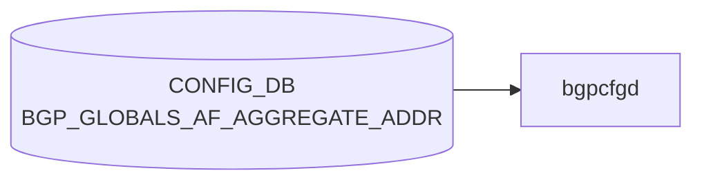

# BGP_GLOBALS_AF_AGGREGATE_ADDR テーブル

## 概要

**VRF × アドレスファミリ単位の BGP aggregate-address 設定** を保持する CONFIG_DB テーブル[^1]。`frr-mgmt-framework` (DEVICE_METADATA の `frr_mgmt_framework_config = true` 経路) が CONFIG_DB から読み、FRR `bgpd` の `router bgp <as>` → `address-family <afi> <safi>` → `aggregate-address <prefix>` 系コマンドに反映する。

`BGP_GLOBALS_AF` で AF レベルの設定（multipath、route distance、L2VPN advertise-all-vni 等）を行い、その AF 配下の **aggregate prefix** をこのテーブルで列挙する。

なお、似た名前の `BGP_AGGREGATE_ADDRESS` テーブル (YANG `sonic-bgp-aggregate-address`) は **AF/VRF を持たないフラットな** aggregate 定義で、別経路 (bgpcfgd テンプレ) で利用される。両者は実装パスが異なる点に注意。

<!-- cdb-mermaid -->
### データフロー (自動生成)



!!! note "凡例"
    CONFIG_DB から SAI までの典型経路を `docs/reference/config-db-orch-map.md` から機械生成したミニ図。詳細・例外は本ページ本文と対応表を参照。
<!-- /cdb-mermaid -->

## key 構造

```
BGP_GLOBALS_AF_AGGREGATE_ADDR|<vrf_name>|<afi_safi>|<ip_prefix>
```

- `<vrf_name>`: `BGP_GLOBALS.vrf_name` への leafref (例: `default`, `Vrf01`)
- `<afi_safi>`: 例 `ipv4_unicast`, `ipv6_unicast`, `l2vpn_evpn`
- `<ip_prefix>`: 集約対象プレフィックス (`inet:ip-prefix`)

## フィールド

| フィールド | 型 | 説明 |
|-----------|----|------|
| `vrf_name` (key) | leafref → `BGP_GLOBALS.vrf_name` | 所属 VRF |
| `afi_safi` (key) | string | アドレスファミリ |
| `ip_prefix` (key) | inet:ip-prefix | 集約プレフィックス |
| `as_set` | boolean | AS_SET path 情報を生成 (RFC 4271) |
| `summary_only` | boolean | より詳細 (more-specific) ルートを抑止し summary のみ広告 |
| `policy` | leafref → `ROUTE_MAP_SET.name` | aggregate に適用する route-map |

## 制約

- 3 つのキー (`vrf_name` / `afi_safi` / `ip_prefix`) で一意。
- `vrf_name` は `BGP_GLOBALS_LIST.vrf_name` への leafref のため、対応する VRF の BGP インスタンスが先に存在している必要がある。
- `summary_only = true` を指定すると aggregate に含まれる more-specific ルートは BGP UPDATE から抑制される（FRR の `aggregate-address ... summary-only` 相当）。

## 購読者

- `frr-mgmt-framework`: 本テーブルを vtysh の `aggregate-address` コマンドに変換し `bgpd` に投入
- `bgpd` (FRR): RIB から該当プレフィックス配下のルートを集約し、設定に応じて抑制・AS_SET 生成・route-map 適用を行う

`bgpcfgd` (テンプレベース) ではこのテーブルではなく `BGP_AGGREGATE_ADDRESS` を使う。設定経路を明確にするため、両方を併用するのは避ける。

## 関連 CONFIG_DB / YANG / CLI

- 関連 CONFIG_DB: `BGP_GLOBALS`, `BGP_GLOBALS_AF`, `BGP_GLOBALS_AF_NETWORK`, `BGP_AGGREGATE_ADDRESS`, `ROUTE_MAP_SET`
- 関連 CLI: `config bgp` (sonic-utilities 経由)、vtysh の `aggregate-address` (直接)
- 関連 YANG: `sonic-bgp-global`

<!-- ref-triangle:start -->

## 関連リファレンス

- YANG: [`sonic-bgp-global`](../yang/sonic-bgp-global.md)
- CLI: [`config bgp`](../cli/config-bgp.md)

<!-- ref-triangle:end -->

## 引用元

[^1]: YANG 定義: `sonic-bgp-global.yang` (`BGP_GLOBALS_AF_AGGREGATE_ADDR` container). <https://github.com/sonic-net/sonic-buildimage/blob/9ea932ec2e18f35e58268ec2e4456b1d4afd65cd/src/sonic-yang-models/yang-models/sonic-bgp-global.yang>

## 関連ページ
- [CONFIG_DB: BGP_GLOBALS_AF](bgp-globals-af.md)
- [CONFIG_DB: BGP_AGGREGATE_ADDRESS](bgp-aggregate-address.md)
- [YANG: sonic-bgp-global](../yang/sonic-bgp-global.md)

<!-- ops-hint -->
## 運用ヒント

### 典型値

- key 形式: `BGP_GLOBALS_AF_AGGREGATE_ADDR|<vrf>|<afi_safi>|<prefix>` (例 `BGP_GLOBALS_AF_AGGREGATE_ADDR|default|ipv4_unicast|10.0.0.0/8`)。
- `summary_only=true` で more-specific を抑制、`as_set=true` で AS_SET 生成。

### よくある誤設定

- 同一 AF に対して `BGP_AGGREGATE_ADDRESS` (フラット) と本テーブル (frr-mgmt-framework 経路) を併用し、設定経路が衝突。
- 集約に含まれる more-specific ルートが RIB に無く、aggregate が広告されない (BGP では 1 本以上の構成ルートが必要)。

### 確認コマンド

```bash
sonic-db-cli CONFIG_DB keys 'BGP_GLOBALS_AF_AGGREGATE_ADDR|*'
vtysh -c "show ip bgp summary"
vtysh -c "show running-config bgpd" | grep aggregate-address
```
<!-- /ops-hint -->
