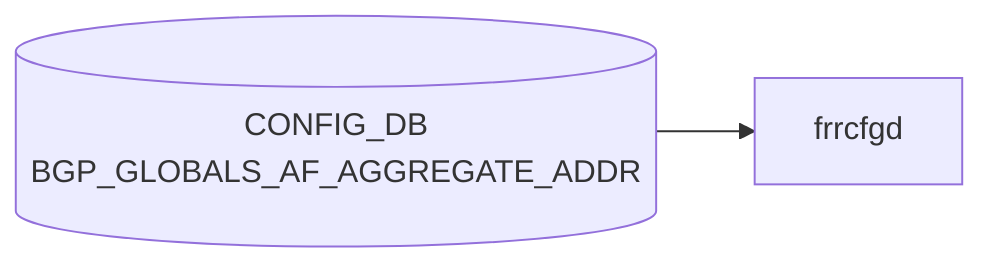

# BGP_GLOBALS_AF_AGGREGATE_ADDR テーブル

## 概要

**[VRF](../../reference/glossary.md#term-vrf) × アドレスファミリ単位の [BGP](../../reference/glossary.md#term-bgp) aggregate-address 設定** を保持する [CONFIG_DB](../../reference/glossary.md#term-config_db) テーブル[^1]。`frr-mgmt-framework` (DEVICE_METADATA の `frr_mgmt_framework_config = true` 経路) が [CONFIG_DB](../../reference/glossary.md#term-config_db) から読み、[FRR](../../reference/glossary.md#term-frr) `bgpd` の `router bgp <as>` → `address-family <afi> <safi>` → `aggregate-address <prefix>` 系コマンドに反映する。

`BGP_GLOBALS_AF` で AF レベルの設定（multipath、route distance、L2VPN advertise-all-vni 等）を行い、その AF 配下の **aggregate prefix** をこのテーブルで列挙する。

なお、似た名前の `BGP_AGGREGATE_ADDRESS` テーブル ([YANG](../../reference/glossary.md#term-yang) `sonic-bgp-aggregate-address`) は **AF/[VRF](../../reference/glossary.md#term-vrf) を持たないフラットな** aggregate 定義で、別経路 ([bgpcfgd](../../reference/glossary.md#term-bgpcfgd) テンプレ) で利用される。両者は実装パスが異なる点に注意。

<!-- cdb-mermaid -->
### データフロー (自動生成)



!!! note "凡例"
    CONFIG_DB から SAI までの典型経路を `docs/reference/config-db-orch-map.md` から機械生成したミニ図。詳細・例外は本ページ本文と対応表を参照。
<!-- /cdb-mermaid -->

## key 構造

```text
BGP_GLOBALS_AF_AGGREGATE_ADDR|<vrf_name>|<afi_safi>|<ip_prefix>
```

- `<vrf_name>`: `BGP_GLOBALS.vrf_name` への leafref (例: `default`, `Vrf01`)
- `<afi_safi>`: 例 `ipv4_unicast`, `ipv6_unicast`, `l2vpn_evpn`
- `<ip_prefix>`: 集約対象プレフィックス (`inet:ip-prefix`)

## フィールド

| フィールド | 型 | 説明 |
|-----------|----|------|
| `vrf_name` (key) | leafref → `BGP_GLOBALS.vrf_name` | 所属 [VRF](../../reference/glossary.md#term-vrf) |
| `afi_safi` (key) | string | アドレスファミリ |
| `ip_prefix` (key) | inet:ip-prefix | 集約プレフィックス |
| `as_set` | boolean | AS_SET path 情報を生成 (RFC 4271) |
| `summary_only` | boolean | より詳細 (more-specific) ルートを抑止し summary のみ広告 |
| `policy` | leafref → `ROUTE_MAP_SET.name` | aggregate に適用する route-map |

## 制約

- 3 つのキー (`vrf_name` / `afi_safi` / `ip_prefix`) で一意。
- `vrf_name` は `BGP_GLOBALS_LIST.vrf_name` への leafref のため、対応する VRF の [BGP](../../reference/glossary.md#term-bgp) インスタンスが先に存在している必要がある。
- `summary_only = true` を指定すると aggregate に含まれる more-specific ルートは [BGP](../../reference/glossary.md#term-bgp) UPDATE から抑制される（[FRR](../../reference/glossary.md#term-frr) の `aggregate-address ... summary-only` 相当）。

## 購読者

- `frr-mgmt-framework`: 本テーブルを vtysh の `aggregate-address` コマンドに変換し `bgpd` に投入
- `bgpd` ([FRR](../../reference/glossary.md#term-frr)): RIB から該当プレフィックス配下のルートを集約し、設定に応じて抑制・AS_SET 生成・route-map 適用を行う

`bgpcfgd` (テンプレベース) ではこのテーブルではなく `BGP_AGGREGATE_ADDRESS` を使う。設定経路を明確にするため、両方を併用するのは避ける。

## 関連 CONFIG_DB / YANG / CLI

- 関連 [CONFIG_DB](../../reference/glossary.md#term-config_db): `BGP_GLOBALS`, `BGP_GLOBALS_AF`, `BGP_GLOBALS_AF_NETWORK`, `BGP_AGGREGATE_ADDRESS`, `ROUTE_MAP_SET`
- 関連 CLI: `config bgp` ([sonic-utilities](../../reference/glossary.md#term-sonic-utilities) 経由)、vtysh の `aggregate-address` (直接)
- 関連 [YANG](../../reference/glossary.md#term-yang): `sonic-bgp-global`

<!-- cdb-exceptions -->
## 例外条件・特殊挙動

| 条件 | 挙動 |
|------|------|
| key の IP prefix 形式不正 | `normalize_ip_prefix()` が None → syslog ERR & continue、FRR 未反映 |
| AF_TYPE フォーマット不正（`_` 区切り不可） | ValueError が上位に伝播 |
| FRR コマンド実行失敗 | syslog ERR & continue、内部キャッシュ更新なし |
| `BGP_GLOBALS` が未設定（bgp_asn 不在） | 上位ハンドラで依存待機、または KeyError 伝播 |
| DEL 操作で `af_aggr_list[vrf]` に存在しない prefix | `pop(None)` で KeyError なし |
| `as_set`/`summary_only` フィールド欠如 | デフォルト `false` 扱い（`data.get(attr)` で None） |
| 更新操作 | FRR に `aggregate-address` を再投入（既存エントリの削除と新規追加の組み合わせ） |

<!-- evidence: sonic-net/sonic-buildimage/src/sonic-frr-mgmt-framework/frrcfgd/frrcfgd.py:3187L -->
<!-- /cdb-exceptions -->

<!-- defaults -->
## コード由来の暗黙デフォルト

YANG の `sonic-bgp-global.yang` は `as_set`、`summary_only`、`policy` すべてで `default` 文を宣言していない。実装上の fallback は frrcfgd.py のコードで定義される。

| フィールド | YANG default | 実装 fallback | FRR コマンド影響 |
|-----------|-------------|--------------|----------------|
| `as_set` | 未宣言 | `False`（`AggregateAddr.__init__` L1704） | キーワード `as-set` なし |
| `summary_only` | 未宣言 | `False`（`AggregateAddr.__init__` L1705） | キーワード `summary-only` なし |
| `policy` | 未宣言 | 空文字列（`+` optional フィールド） | `route-map` 指定なし |

### as_set / summary_only の fallback 根拠

`frrcfgd.py` の `AggregateAddr` クラス（L1702-1705）は `__init__` で両フィールドを `False` に初期化する。フィールドが CONFIG_DB に存在しないか `"true"` でない場合、`setattr` が呼ばれないため初期値 `False` が維持される。`CommandArgument.__format__` の `bool_format`（L815-816）で `"false"` または空は FRR キーワードなしに変換される。

### policy の fallback 根拠

`af_aggregate_key_map`（L1982）で `policy` は `'+policy'`（`+` = optional）として宣言される。フィールド欠如時は `cmd_data` に空文字列 `''` が渡り、`aggr-policy` format（L928-930）は空文字列にプレフィックスを追加しないため、FRR コマンドに `route-map` が付加されない。

### Discrepancy: Jinja2 テンプレート経路で `policy` が無視される

`bgpd.conf.db.addr_family.j2`（L48-61）の [bgpcfgd](../../reference/glossary.md#term-bgpcfgd) テンプレート経路は `as_set`/`summary_only` のみを処理し、`policy` フィールドを完全に無視する。frr-mgmt-framework 経路（`frrcfgd.py`）は `policy` を `route-map <name>` として反映するが、Jinja2 経路では同フィールドが読まれない。通常は両経路が同一エントリを処理しないため実害は限定的だが、設定経路の混在時に `policy` が反映されないリスクがある。

<!-- evidence: sonic-buildimage/src/sonic-frr-mgmt-framework/frrcfgd/frrcfgd.py:1702-1705,1982; sonic-buildimage/src/sonic-frr-mgmt-framework/templates/bgpd/bgpd.conf.db.addr_family.j2:48-61 -->
<!-- /defaults -->

<!-- value-behavior -->
## 値依存挙動マトリクス

### enum 型フィールド

該当無し (key の `afi_safi` は string だが YANG enum ではなく任意文字列)

### boolean フィールド

| フィールド | `true` の効果 | `false` の効果 | evidence |
|---|---|---|---|
| `summary_only` | FRR `aggregate-address <prefix> summary-only` を生成。contributing route が BGP UPDATE から抑制される | キーワードなし。contributing route と aggregate を両方広告 | `sonic-bgp-global.yang; frrcfgd.py:3187` |
| `as_set` | FRR `aggregate-address <prefix> as-set` を生成。集約経路に AS_SET path 属性を付与 | キーワードなし | `sonic-bgp-global.yang` |

### `policy` (leafref → ROUTE_MAP_SET.name)

| 値 | 効果 | evidence |
|---|---|---|
| 文字列 (route-map 名) | `aggregate-address <prefix> route-map <name>` を生成。aggregate に route-map を適用して属性を加工 | `frrcfgd.py:3187` |
| 空/未設定 | route-map 指定なし | — |

### 複合条件

- `summary_only=true` かつ contributing route が RIB に 0 本 → FRR で aggregate 生成されない (BGP 仕様)
- frr-mgmt-framework 経路 (`DEVICE_METADATA.frr_mgmt_framework_config=true`) でのみ有効。[bgpcfgd](../../reference/glossary.md#term-bgpcfgd) テンプレ経路では `BGP_AGGREGATE_ADDRESS` テーブルを使い、両者を混在させると干渉する可能性がある
<!-- /value-behavior -->

<!-- platform -->
## プラットフォーム差

`frrcfgd.py` (`src/sonic-frr-mgmt-framework/frrcfgd/`) および `bgpcfgd` (`src/sonic-bgpcfgd/bgpcfgd/`) を全文走査した結果、`BGP_GLOBALS_AF_AGGREGATE_ADDR` の挙動はコミュニティ master 上で **プラットフォーム非依存**である。経路は `frrcfgd` → vtysh → FRR `bgpd` (ユーザ空間ルーティングデーモン) で完結し、[SAI](../../reference/glossary.md#term-sai) / [ASIC SDK](../../reference/glossary.md#term-asic-sdk) を直接呼び出さないため、CONFIG_DB スキーマ・キー構造・適用ロジックには ASIC / chassis / multi-asic 差が現れない。

| 観点 | 差の有無 | 根拠 |
|---|---|---|
| ASIC ベンダー (Broadcom / Mellanox / Marvell 等) 分岐 | なし | `frrcfgd.py` 全体を `platform|asic|chassis|vendor` で grep して 0 ヒット (偽陽性 1 件は L3384 `'Basic mode...'` の `asic` 部分一致)。aggregate-address 適用は FRR `bgpd` のソフト処理 |
| switch type (voq / chassis / fabric) 分岐 | なし | `frrcfgd.py` に `voq` / `chassis` / `fabric` 参照 0 件。`hdl_af_aggregate()` (L1313)・`af_aggregate_key_map` (L1982-1983)・per-table 分岐 (L3169, L3187) いずれも ASIC 形態に依存しない |
| multi-asic / namespace 特殊化 | なし | `frrcfgd.py` に `is_multi_npu()` / `namespace` 参照 0 件。各 asic-namespace は独立 BGP container で同一ロジックを実行 |
| 一次経路の重複 (bgpcfgd テンプレ vs frr-mgmt-framework) | あり (プラットフォーム非依存) | `BGP_GLOBALS_AF_AGGREGATE_ADDR` を購読するのは `frrcfgd.py` のみ (`DEVICE_METADATA.frr_mgmt_framework_config=true` 経路)。`bgpcfgd/` 配下と `dockers/docker-fpm-frr/` 配下を grep しても 0 ヒット。bgpcfgd テンプレ経路は別テーブル `BGP_AGGREGATE_ADDRESS` を使う点に注意 (ASIC 差ではなく機能経路の切替) |
| ビルド時 platform オーバライド | なし | `device/<vendor>/<platform>/` 配下に本テーブルを差し替える j2 / json / hwsku-d 由来の差分は検出されず |

詳細な走査ログは `meta/_intermediate/cdb-flow/bgp-globals-af-aggregate-addr-platform.md` を参照。
<!-- /platform -->

<!-- ref-triangle:start -->

## 関連リファレンス

- [YANG](../../reference/glossary.md#term-yang): [`sonic-bgp-global`](../yang/sonic-bgp-global.md)
- CLI: [`config bgp`](../cli/config-bgp.md)

<!-- ref-triangle:end -->

## 引用元

[^1]: YANG 定義: `sonic-bgp-global.yang` (`BGP_GLOBALS_AF_AGGREGATE_ADDR` container). <https://github.com/sonic-net/sonic-buildimage/blob/9ea932ec2e18f35e58268ec2e4456b1d4afd65cd/src/sonic-yang-models/yang-models/sonic-bgp-global.yang>

## 関連ページ
- [CONFIG_DB: BGP_GLOBALS_AF](bgp-globals-af.md)
- [CONFIG_DB: BGP_AGGREGATE_ADDRESS](bgp-aggregate-address.md)
- [YANG: sonic-bgp-global](../yang/sonic-bgp-global.md)

<!-- ops-hint -->
## 運用ヒント

### 典型値

- key 形式: `BGP_GLOBALS_AF_AGGREGATE_ADDR|<vrf>|<afi_safi>|<prefix>` (例 `BGP_GLOBALS_AF_AGGREGATE_ADDR|default|ipv4_unicast|10.0.0.0/8`)。
- `summary_only=true` で more-specific を抑制、`as_set=true` で AS_SET 生成。

### よくある誤設定

- 同一 AF に対して `BGP_AGGREGATE_ADDRESS` (フラット) と本テーブル (frr-mgmt-framework 経路) を併用し、設定経路が衝突。
- 集約に含まれる more-specific ルートが RIB に無く、aggregate が広告されない (BGP では 1 本以上の構成ルートが必要)。

### 確認コマンド

```bash
sonic-db-cli CONFIG_DB keys 'BGP_GLOBALS_AF_AGGREGATE_ADDR|*'
vtysh -c "show ip bgp summary"
vtysh -c "show running-config bgpd" | grep aggregate-address
```
<!-- /ops-hint -->

<!-- runtime-trace -->
## 実コンテナ動作トレース

### 段階 1 — Consumer 登録

`bgpcfgd` が CONFIG_DB の `BGP_GLOBALS_AF_AGGREGATE_ADDR` テーブルを購読する。

`BGP_GLOBALS_AF_AGGREGATE_ADDR` は `<vrf>|<af>|<prefix>` の key 構造。

### 段階 2 — CFG→APPL 翻訳

なし (FRR vtysh 経由)

### 段階 3 — APPL→SAI

なし (FRR BGP のみ)

### 段階 4 — タイミングと副作用

**適用タイミング**: 変化検知後 FRR に AF 固有の aggregate-address コマンドを発行。

**副作用**: AF 毎の集約ルート広告が変化。`summary-only` 有効時は子プレフィクスが withdraw される。
<!-- /runtime-trace -->

<!-- entry-points -->
## 書き込み入り口 (Direction A)

対象テーブル: `BGP_GLOBALS_AF_AGGREGATE_ADDR`

### CLI
- `vtysh` 経由 aggregate-address コマンド (bgpcfgd が CONFIG_DB へ書き戻し)
  - ソース: `sonic-frr bgpcfgd`

### minigraph / sonic-cfggen
- なし

### REST / gNMI (sonic-mgmt-common)
- なし (対応 OpenConfig/SONiC YANG transformer なし)

### db_migrator
- なし

### ビルド時デフォルト (init_cfg / j2 テンプレート)
- なし

### ハードコードデフォルト
- なし

### ランタイム注入 (デーモン自動書き込み)
- `bgpcfgd` が FRR running-config を読み CONFIG_DB と同期
<!-- /entry-points -->

<!-- side-effects -->
## 副次 DB 書込 (Phase F)

### STATE_DB / COUNTERS_DB への書込: **なし**

`frrcfgd.py` 全体 (3985行) を `STATE_DB`、`COUNTERS_DB`、`APPL_DB`、`StateTable`、`CounterTable` で精査した結果、これらへの参照は **0 件**。`BGP_GLOBALS_AF_AGGREGATE_ADDR` ハンドラ (`hdl_af_aggregate` L1313 / `__update_bgp` L3169-3196) の処理は以下のみで完結する:

1. **vtysh コマンド発行** — `configure terminal` → `router bgp <asn> vrf <vrf>` → `address-family <afi> <safi>` → `aggregate-address <prefix> [as-set] [summary-only] [route-map <name>]` を FRR `bgpd` に投入。`bgpd` は受信後に RIB 計算ループで集約ルートを生成し BGP UPDATE として広告する（FRR 内部処理）。
2. **プロセス内キャッシュ更新** — `self.af_aggr_list[vrf][norm_ip_prefix] = AggregateAddr()` (SET 時) / `self.af_aggr_list[vrf].pop(norm_ip_prefix, None)` (DEL 時)。frrcfgd プロセスのメモリ内のみ。[Redis](../../reference/glossary.md#term-redis) への書き戻しなし。
3. **syslog 出力** — `syslog.LOG_INFO` / `syslog.LOG_ERR` のみ。DB ではない。

| 対象 DB | 書込 | 根拠 |
|---------|------|------|
| [STATE_DB](../../reference/glossary.md#term-state_db) | なし | `frrcfgd.py` に `STATE_DB` / `StateTable` 参照 0 件 |
| [COUNTERS_DB](../../reference/glossary.md#term-counters_db) | なし | `frrcfgd.py` に `COUNTERS_DB` / `CounterTable` 参照 0 件 |
| [APPL_DB](../../reference/glossary.md#term-appl_db) | なし | `frrcfgd.py` に `APPL_DB` / `AppDBConnector` 参照 0 件 |
| CONFIG_DB (書き戻し) | なし | CONFIG_DB の変更は受信するが書き戻しは行わない |
| FRR vtysh (bgpd) | あり | vtysh 経由で `aggregate-address` コマンドを `bgpd` に投入 ([SAI](../../reference/glossary.md#term-sai) 非経由) |

> **Evidence**: `sonic-buildimage/src/sonic-frr-mgmt-framework/frrcfgd/frrcfgd.py` L1-3985 全体 grep 結果 ([STATE_DB](../../reference/glossary.md#term-state_db) / [COUNTERS_DB](../../reference/glossary.md#term-counters_db) / [APPL_DB](../../reference/glossary.md#term-appl_db) / StateTable / CounterTable 各 0 件); ハンドラ L1313-1328, L3169-3196 実装確認。中間ファイル: `meta/_intermediate/cdb-flow/bgp-globals-af-aggregate-addr-side.md`
<!-- /side-effects -->

<!-- ordering -->
## 書込み順依存 (Phase B)

### `BGP_GLOBALS` 先行必須 (bgp_asn)

`bgp_table_handler_common()` の `BGP_GLOBALS_AF_AGGREGATE_ADDR` 分岐は `self.bgp_asn[vrf]` から `local_asn` を取得し、`router bgp <as> vrf <vrf>` プレフィクスを組み立てる。対応 VRF の `BGP_GLOBALS.local_asn` が CONFIG_DB に**先に**存在しないと vtysh コマンドが組み立てられず、aggregate-address は FRR に流れない。`table_handler_list` (frrcfgd.py L2296-2317) では `BGP_GLOBALS` (3 番目) が `BGP_GLOBALS_AF_AGGREGATE_ADDR` (23 番目) より先に登録されているため load フェーズでは自動保証だが、runtime に aggregate のみ先着した場合は `KeyError` 系の握り潰しで非反映となり、後続で `BGP_GLOBALS` が届いても aggregate は自動再投入されない（再 SET が必要）。<!-- evidence: frrcfgd.py:3169-3186, 2296-2317 -->

### `BGP_GLOBALS_AF` 先行推奨 (address-family コンテキスト)

aggregate-address は FRR で `router bgp <as>` → `address-family <afi> <safi>` → `aggregate-address <prefix>` の階層下に置かれる。`BGP_GLOBALS_AF|<vrf>|<afi_safi>` を先に書いてから aggregate を投入することで、AF レベル属性 (`multipath`、route distance、L2VPN advertise-all-vni 等) と aggregate が同一適用ウィンドウで揃う。順序が逆でも aggregate 自体は反映されるが、AF 属性は AF 設定到着まで非反映。`table_handler_list` では `BGP_GLOBALS_AF` (4 番目) が先のため load フェーズでは自動保証。<!-- evidence: frrcfgd.py:2297, 2317, 3169-3186 -->

### `__init__` snapshot のコード固定順

`BGPConfigDaemon.__init__()` は `BGP_GLOBALS` テーブル取得 (L2207-2213) で `bgp_asn[vrf]` を構築した後、`BGP_GLOBALS_AF_AGGREGATE_ADDR` テーブル取得 (L2257-2266) で `af_aggr_list[vrf][prefix] = AggregateAddr()` を構築する。コード上の固定順序により daemon 起動時のスナップショットでは `BGP_GLOBALS` → aggregate の順で読まれる。aggregate 単独で CONFIG_DB にある状態で daemon が起動すると、`af_aggr_list` キャッシュは作られても後続 SET イベントで `bgp_asn[vrf]` 不在となり vtysh 投入は失敗する。<!-- evidence: frrcfgd.py:2207-2213, 2257-2266 -->

### `frrcfgd` 起動順 — bgpd 先行必須

aggregate-address コマンドは `vtysh -c 'configure terminal' -c 'router bgp ...'` 経由で `bgpd` に投入される。`bgpd` の vty socket (`/var/run/frr/bgpd.vty`) が未生成の状態で vtysh を実行すると `failed to connect to any daemon` で失敗、`key_map.run_command()` が False を返し syslog ERR を出して continue する。frrcfgd は失敗時に再試行しないため、bgpd 復活後に CONFIG_DB へ再 SET するか `frrcfg.sh restart` で replay する必要がある。docker-fpm-frr の supervisord は `bgpd` → `frrcfgd` の順を狙うが、warm-restart や crash 復旧時はレースし得る。<!-- evidence: frrcfgd.py:3179-3186 -->

### bgpd CLI 順 — `no aggregate-address` 先行 → `aggregate-address <new>`

`hdl_af_aggregate()` は UPDATE 操作で対象 vrf+prefix が既に `af_aggr_list` に存在する場合、先に `no aggregate-address <prefix>` を生成してから `get_command_cmn()` で実 SET コマンドを追加する。Update = (Delete + Add) の合成で、`as_set` / `summary_only` / `policy` の欠落フィールドが意図せず引き継がれる事故を避けるための CLI 順。同一 vtysh セッションで連続投入されるが、`summary_only=true` 運用中はこの 1 瞬の aggregate 消失で more-specific ルートが一時的に広告される副作用に注意。CLI 順自体は逆転できない（コード固定）。<!-- evidence: frrcfgd.py:1313-1326 -->

### DEL 時の vtysh 投入 → cache pop の順

DEL 操作では `key_map.run_command` で `no aggregate-address` を vtysh に投入してから `self.af_aggr_list[vrf].pop(norm_ip_prefix, None)` を呼ぶ。pop は `None` デフォルトで KeyError は出ない。vtysh 投入失敗時もキャッシュは pop されないが、次回 UPDATE 時の `no` 先行発行のキーとして残るのみでリーク影響は小さい。<!-- evidence: frrcfgd.py:3187-3197 -->

### 不正 `ip_prefix` キーの早期 continue

`normalize_ip_prefix()` が None を返す不正キーは当該 entry のみ skip され、後続エントリの処理は継続する。順序依存なしだが、ログ (`invalid IP prefix format`) を見落とすと該当 aggregate のみ未適用となる。<!-- evidence: frrcfgd.py:3172-3175 -->

詳細スキャンログは `meta/_intermediate/cdb-flow/bgp-globals-af-aggregate-addr-ordering.md` を参照。
<!-- /ordering -->

<!-- cross-refs -->
## 暗黙参照テーブル (Phase C)

`BGP_GLOBALS_AF_AGGREGATE_ADDR` の YANG (`sonic-bgp-global.yang`) は `vrf_name` を `BGP_GLOBALS.vrf_name`、`policy` を `ROUTE_MAP_SET.name` への leafref として宣言する。実装側 (`frrcfgd.py`) では、これらに加え `BGP_GLOBALS` の `local_asn`、`BGP_GLOBALS_AF` の AF コンテキスト、`DEVICE_METADATA.frr_mgmt_framework_config = true` が暗黙の前提として読み取れる。

| 参照先テーブル / リソース | 参照方向 | 条件 | 参照元 evidence |
|--------------------------|---------|------|----------------|
| [`BGP_GLOBALS\|<vrf>`](bgp-globals.md) | 読み取り (`local_asn` → vtysh コマンドプレフィクス) | 常時 (UPDATE / DELETE 共通)。不在 → `bgp_asn[vrf]` `KeyError` で握り潰され FRR 未反映 | `frrcfgd.py` L3162, L3180 (`router bgp {} vrf {}`)、L2207-2213 (`bgp_asn` 構築) |
| [`BGP_GLOBALS_AF\|<vrf>\|<afi_safi>`](bgp-globals-af.md) | 暗黙の先行依存 (FRR コマンド階層上の親 AF コンテキスト) | `cmd_prefix` 第 3 要素として常に発行されるが、AF レベル属性 (`multipath` / route distance / L2VPN advertise-all-vni 等) は本テーブル単独では反映されない | `frrcfgd.py` L3163, L3181 (`address-family {} {}`)、L2297 (`table_handler_list` 登録順) |
| [`ROUTE_MAP_SET\|<name>`](route-map-set.md) (および [`ROUTE_MAP`](route-map.md)) | 読み取り (`policy` フィールド → vtysh `route-map <name>` 引数) | `policy` 非空のとき。route-map 実在性は frrcfgd では検証せず `bgpd` 側で検証 | `frrcfgd.py` L1982-1983 (`af_aggregate_key_map` の `+policy`)、L928-930 (`format == 'aggr-policy'` 分岐) |
| [`DEVICE_METADATA\|localhost`](device-metadata.md) (`frr_mgmt_framework_config`) | 起動時前提 (経路選択フラグ) | `true` でないと frrcfgd 経路全体が無効化され、bgpcfgd テンプレ経路 (`BGP_AGGREGATE_ADDRESS` テーブル) が代わりに動作 | `frrcfgd.py` L80, L2162-2170 (`get_entry('DEVICE_METADATA', 'localhost')`) |

!!! note "YANG leafref vs 実装暗黙参照"
    YANG (`sonic-bgp-global.yang`) は `vrf_name` (→`BGP_GLOBALS.vrf_name`) と `policy` (→`ROUTE_MAP_SET.name`) の 2 つを明示的な leafref として宣言する。`BGP_GLOBALS_AF` への参照および `DEVICE_METADATA.frr_mgmt_framework_config` への参照は YANG では宣言されておらず、`frrcfgd.py` の実装に暗黙的に存在する。

!!! note "VRF / PORT / NEXTHOP は参照しない"
    `frrcfgd.py` の `BGP_GLOBALS_AF_AGGREGATE_ADDR` 分岐 (L3169-3197) および `hdl_af_aggregate()` (L1313-) は **`VRF` / `PORT` / `INTERFACE` / `NEXTHOP` / `ROUTE_TABLE`** を直接参照しない。aggregate-address は L3 prefix ベースで bgpd 内部 RIB に基づき集約計算されるため、interface / nexthop の CONFIG_DB エントリには依存しない。

> **中間ファイル**: `meta/_intermediate/cdb-flow/bgp-globals-af-aggregate-addr-cross-refs.md`
<!-- /cross-refs -->

<!-- failure -->
## 失敗挙動 (Phase D)

スコープ: `frr-mgmt-framework` 経路 (`DEVICE_METADATA.frr_mgmt_framework_config=true`)。bgpcfgd テンプレ経路 (`BGP_AGGREGATE_ADDRESS`) の失敗挙動は別ページを参照。

### 失敗パス一覧

| # | トリガー | 発生箇所 | 結果 | retry |
|---|---------|---------|------|-------|
| 1 | key の prefix 形式不正 / AF と IP family の不一致 | `MatchPrefix.normalize_ip_prefix()` が `None` → `frrcfgd.py:3172-3175` | syslog ERR `'invalid IP prefix format'` → `continue`。FRR 未投入、`af_aggr_list` 未更新 | なし |
| 2 | `afi_safi` キーが `_` で 2 分割できない | `af_type.lower().split('_')` (L3170) | `ValueError` が `bgp_table_handler_common` を抜けて上位伝播 | なし (再 SET で再評価) |
| 3 | FRR コマンド失敗 (vtysh 投入失敗 = bgpd vty 不通 / 構文エラー / `router bgp` 未生成) | `key_map.run_command()` が `False` → `frrcfgd.py:3184-3186` | syslog ERR `'failed running BGP IP prefix AF config command'` → `continue`。`af_aggr_list` 更新も skip | なし |
| 4 | `BGP_GLOBALS` 未到着で `self.bgp_asn[vrf]` 不在 | `local_asn` 取得時 `KeyError` (L3176 直前) | 例外が上位に伝播。後追いで `BGP_GLOBALS` が来ても aggregate は自動再投入されない | なし |
| 5 | UPDATE 中の `no aggregate-address` 先行発行で bgpd vty 瞬断 | `hdl_af_aggregate` L1313-1328 → F3 と同経路 | 当該コマンド失敗、`af_aggr_list` キャッシュは前回値のまま | なし |
| 6 | DEL で対象 vrf / prefix が `af_aggr_list` に不在 | L3195-3197 `pop(..., None)` | `KeyError` 抑止で skip (冪等) | — |
| 7 | `policy=<name>` で `ROUTE_MAP_SET` に当該 name が未登録 | `aggr-policy` format (L928-930) → bgpd 投入 | frrcfgd は ROUTE_MAP 存在検証を行わず、`aggregate-address <prefix> route-map <name>` を bgpd に流す。bgpd は受理するが route-map 未解決で attribute 加工は no-op (silent ineffective)。後から ROUTE_MAP_SET を定義しても **aggregate-address は自動再投入されない** | なし |
| 8 | 起動時 `/run/frr/bgpd.vty` 接続失敗 | `__create_frr_client` L186-200 | 2 秒間隔で 100 回 retry、超過で `return False` → frrcfgd 起動失敗、aggregate-address を含む全 BGP テーブルが未反映 | 100 回 / 2 秒 |
| 9 | 運用中 vtysh 送信時 `socket.error` | `__proc_command` L259-264 | syslog ERR `'failed to send command to frr daemon'` → `(False, None)` 返却。再接続なし、CONFIG_DB 側は残存 | なし (frrcfgd プロセス再起動が必要) |
| 10 | bgpd 応答 `ret_code != 0` (構文エラー等) | `__proc_command` L267-269 | syslog **DEBUG** のみ。上位から見ると「成功」扱いで `af_aggr_list` は更新される (実機との乖離リスク) | なし |

### retry なしの実装上の理由

`frrcfgd` は `bgpcfgd` の `Directory` / `on_bbr_change()` のような依存待機・再投入機構を持たない。`BGP_GLOBALS_AF_AGGREGATE_ADDR` 専用の周期 retry / event-driven 再投入トリガは `frrcfgd.py` 全体に存在しない。FRR コマンド失敗は基本的に「投げっぱなし」で、救済は CONFIG_DB の再 SET か `frrcfg.sh restart` のみ。<!-- evidence: frrcfgd.py:3169-3197 -->

### FRR コマンド失敗時の検出ギャップ

`key_map.run_command()` は `__proc_command` 経由で各 daemon の返り値を確認するが、**`ret_code != 0` (bgpd 構文エラー) のケースは syslog DEBUG レベルでしか記録されない** (L267-269)。F3 (vtysh 送信失敗) と F10 (bgpd 構文エラー) では `run_command` の返り値が異なり、後者は `af_aggr_list` キャッシュが更新されてしまう。[STATE_DB](../../reference/glossary.md#term-state_db) / ERROR_TABLE への記録は無いため、DEBUG ログを syslog に流していない構成では失敗を観測できない。

### ROUTE_MAP 順序依存 (frrcfgd は検証しない)

`hdl_af_aggregate()` (L1313-1328) は `ROUTE_MAP_SET` テーブルの存在検証を行わず、`{5:aggr-policy}` をそのまま `route-map <name>` に展開して bgpd に流し込む (L928-930)。route-map 未定義のまま `BGP_GLOBALS_AF_AGGREGATE_ADDR` に `policy=<name>` を SET すると bgpd 上で aggregate-address は生成されるが route-map は未解決のまま attribute 加工が no-op となる。**ROUTE_MAP_SET を後から定義しても aggregate-address は自動再投入されない**ため、ユーザ側で aggregate-address エントリを SET し直す必要がある (`bgpcfgd` の `BGP_AGGREGATE_ADDRESS` 経路で実装される `on_bbr_change` 相当の hook は frr-mgmt-framework 経路には存在しない)。<!-- evidence: frrcfgd.py:928-930, 1313-1328, 1982-1983 -->

### bgpd ソケット失敗時の retry 戦略

- 起動時: `/run/frr/bgpd.vty` への connect は 2 秒間隔で最大 100 回 retry (F8、`frrcfgd.py:186-200`)。超過で `RuntimeError` 相当 (`return False`) → frrcfgd 起動失敗、aggregate-address を含む全 BGP テーブル更新が反映されない。
- 運用中: 送信途中の `socket.error` には自動再接続が無く (F9、`frrcfgd.py:259-264`)、frrcfgd プロセス再起動が必要 (`__proc_command` は当該コマンドのみ skip)。

### 状態記録 / 観測手段

- `STATE_DB` への記録は**なし** (frr-mgmt-framework 経路は `BGP_AGGREGATE_ADDRESS|*` のような STATE_DB ミラーを持たない)。
- 失敗観測は syslog のみ:

```bash
# 失敗ログ確認
journalctl -u bgp | grep -iE 'invalid IP prefix|failed running BGP IP prefix|failed to (connect|send) .* frr daemon'
# bgpd 構文エラーは DEBUG レベルなので syslog の DEBUG を有効化する必要あり
vtysh -c "show running-config bgpd" | grep aggregate-address  # bgpd 反映の最終確認
```

- `ERROR_TABLE` への記録もなし。

> 中間調査ファイル: `meta/_intermediate/cdb-flow/bgp-globals-af-aggregate-addr-failure.md`

<!-- evidence: sonic-net/sonic-buildimage/src/sonic-frr-mgmt-framework/frrcfgd/frrcfgd.py:3169-3197 -->
<!-- evidence: sonic-net/sonic-buildimage/src/sonic-frr-mgmt-framework/frrcfgd/frrcfgd.py:1313-1328 -->
<!-- evidence: sonic-net/sonic-buildimage/src/sonic-frr-mgmt-framework/frrcfgd/frrcfgd.py:928-930 -->
<!-- evidence: sonic-net/sonic-buildimage/src/sonic-frr-mgmt-framework/frrcfgd/frrcfgd.py:181-200 -->
<!-- evidence: sonic-net/sonic-buildimage/src/sonic-frr-mgmt-framework/frrcfgd/frrcfgd.py:255-275 -->
<!-- /failure -->

<!-- pubsub -->
## 通信メカニズム (Phase G)

### Redis 購読方式

`BGP_GLOBALS_AF_AGGREGATE_ADDR` テーブルへの変更通知は **`frrcfgd` (sonic-frr-mgmt-framework) のみ** が受信する。`frrcfgd` は `ConfigDBConnector` を継承した独自 `ExtConfigDBConnector.subscribe()` + `listen()` で **[Redis](../../reference/glossary.md#term-redis) keyspace 通知 (`PSUBSCRIBE __keyspace@<dbId>__:*`)** を購読する。`swsscommon.SubscriberStateTable` (channel ベース PUBLISH/SUBSCRIBE) は本経路では使用しない。CONFIG_DB は永続前提のため TTL は設定されない。

`bgpcfgd` のテンプレ経路 (`bgpd.conf.db.addr_family.j2`) は別テーブル `BGP_AGGREGATE_ADDRESS` (フラット) を使用し、本テーブルは購読しない (Phase F `<!-- side-effects -->` で確認済)。両者は同一機能の異なる設定経路のため、混在は避ける。

| 購読者 | 対象テーブル | 購読 API | 通信方式 | ハンドラ |
|--------|------------|---------|---------|---------|
| `frrcfgd` | `BGP_GLOBALS_AF_AGGREGATE_ADDR` | `ExtConfigDBConnector.subscribe()` + `listen()` (keyspace 通知) | [Redis](../../reference/glossary.md#term-redis) `PSUBSCRIBE __keyspace@<dbId>__:*` | `bgp_table_handler_common` → `hdl_af_aggregate` |

`orchagent` / `syncd` 等の [APPL_DB](../../reference/glossary.md#term-appl_db) / [ASIC_DB](../../reference/glossary.md#term-asic_db) レイヤは本テーブルを購読しない (FRR `bgpd` のソフト処理で完結、[SAI](../../reference/glossary.md#term-sai) 非経由)。

### keyspace 通知 → ハンドラ呼び出しの流れ (frrcfgd 経路)

```
sonic-db-cli CONFIG_DB hset 'BGP_GLOBALS_AF_AGGREGATE_ADDR|default|ipv4_unicast|10.0.0.0/8' summary_only true
  ↓ HSET 後に Redis 側で keyspace 通知発火
Redis keyspace PUBLISH "__keyspace@4__:BGP_GLOBALS_AF_AGGREGATE_ADDR|default|ipv4_unicast|10.0.0.0/8" "hset"
  ↓ ExtConfigDBConnector.listen_thread() がパターンマッチ
sub_msg_handler() → client.hgetall(key)  ← 通知後に値を再取得
raw_to_typed() で型変換
  ↓ _ConfigDBConnector__fire("BGP_GLOBALS_AF_AGGREGATE_ADDR", "default|ipv4_unicast|10.0.0.0/8", data)
bgp_table_handler_common(table, key, data) → bgp_message キューへ enqueue
  ↓ __update_bgp() で順次処理 (frrcfgd.py:3169-3196)
  ↓ key を vrf / af_type / ip_prefix に分解、normalize_ip_prefix() で正規化
  ↓ cmd_prefix = ['configure terminal', 'router bgp <asn> vrf <vrf>', 'address-family <af> <ip_type>']
  ↓ vtysh -c "aggregate-address 10.0.0.0/8 summary-only"
  ↓ AggregateAddr() を self.af_aggr_list[vrf][prefix] にキャッシュ
```

- keyspace 通知のペイロードは操作名 (`hset` / `del` 等) のみ。フィールド値は `client.hgetall(key)` で再取得 (`frrcfgd.py:1527-1528`)。
- `data is None ? DEL : SET` の 2 値判定 (`ConfigDBConnector` 標準動作)。`HDEL` / `HSET` の Redis 操作種別は区別しない。
- DEL では `self.af_aggr_list[vrf].pop(norm_ip_prefix, None)` でキャッシュから除去 (`frrcfgd.py:3194-3196`、`pop(..., None)` のため未登録 prefix でも KeyError は出ない)。
- `listen_thread` は専用スレッドで動作 (`frrcfgd.py:1551`)。テーブルハンドラは同スレッド内で逐次実行され、内部キュー `bgp_message` 経由で `__update_bgp` に直列化される。
- 起動時は `subscribe_all()` (`frrcfgd.py:2359-2361`) 開始前に `config_db.get_table_data([...])` で `table_handler_list` 全テーブルの一括スナップショットを取得し (`frrcfgd.py:2340`)、`config_mode == "unified"` であれば各エントリを `bgp_message` 経由で config replay する (`frrcfgd.py:2344-2357`)。

### サービス再起動トリガー

| 契機 | 操作 | コード |
|------|------|--------|
| `BGP_GLOBALS_AF_AGGREGATE_ADDR` 変更 | FRR `bgpd` への vtysh `(no )aggregate-address <prefix> [as-set] [summary-only] [route-map <name>]` 送出のみ。`bgpd` プロセス restart **なし** | `frrcfgd.py:3169-3196`, `1982-1983` |
| IP prefix 形式不正 | `MatchPrefix.normalize_ip_prefix()` → `None` で syslog ERR & continue | `frrcfgd.py:3172-3175` |
| `BGP_GLOBALS` (`bgp_asn`) 未設定 | `local_asn` 未解決のため当該 update は依存待ちで保留 | `frrcfgd.py:__update_bgp` 上層 |

vtysh コマンド送出のみで BGP セッション自体は再起動されない。集約広告の反映は **FRR の RIB 計算ループ** の次サイクルで行われ、contributing route が RIB に 1 本以上存在する場合のみ aggregate が広告される (BGP 仕様)。

> **Evidence**: `sonic-buildimage/src/sonic-frr-mgmt-framework/frrcfgd/frrcfgd.py:98, 1313, 1506-1555, 1982-1983, 2118, 2257, 2317, 2340-2357, 2359-2361, 3169-3196, 3955-3956` (keyspace listen / subscribe / `bgp_table_handler_common` / `hdl_af_aggregate` / 起動スナップショット / config replay); 詳細分析 `meta/_intermediate/cdb-flow/bgp-globals-af-aggregate-addr-pubsub.md`
<!-- /pubsub -->

<!-- constants -->
## ハードコード定数 (Phase E)

### FRR コマンド literal (`frrcfgd.py` ハンドラ)

| 定数 | 値 | 用途 | evidence |
|-----|-----|------|---------|
| `af_aggregate_key_map` コマンド雛形 | `{no:no-prefix}aggregate-address {2} {3:aggr-as-set} {4:aggr-summary-only} {5:aggr-policy}` | `address-family <afi> <safi>` 配下に投入する vtysh コマンド | `frrcfgd.py:1982-1983` |
| `aggr-as-set` 展開 | `as-set` | `as_set=true` のときに付与されるキーワード | `frrcfgd.py:815` |
| `aggr-summary-only` 展開 | `summary-only` | `summary_only=true` のときに付与されるキーワード | `frrcfgd.py:816` |
| `aggr-policy` 展開プレフィクス | `route-map ` | `policy` フィールドが非空のとき値の前に付与 | `frrcfgd.py:928-930` |
| vtysh prefix L1 | `configure terminal` | コマンド投入時の先頭行 | `frrcfgd.py:3179` |
| vtysh prefix L2 | `router bgp <asn> vrf <vrf>` | BGP インスタンス選択 | `frrcfgd.py:3180` |
| vtysh prefix L3 | `address-family <afi> <safi>` | AF コンテキスト切替 | `frrcfgd.py:3181` |
| 登録テーブル名 | `BGP_GLOBALS_AF_AGGREGATE_ADDR` | handler/dispatch/subscribe で使用される一意キー | `frrcfgd.py:98,2118,2139,2317` |

### prefix 正規化定数 (`MatchPrefix`)

| 定数 | 値 | 用途 | evidence |
|-----|-----|------|---------|
| `IPV4_MAXLEN` | `32` | `/` 無し IPv4 prefix に補う host mask 長 | `frrcfgd.py:1606` |
| `IPV6_MAXLEN` | `128` | `/` 無し IPv6 prefix に補う host mask 長 | `frrcfgd.py:1607` |
| `af` 判定リテラル | `ipv4` / `ipv6` | `<afi_safi>` を `_` で分割し小文字化、`socket.AF_INET`/`AF_INET6` を選択 | `frrcfgd.py:2261,3171-3172` |
| 正規化フォーマット | `%s/%d` | `inet_ntop()` 結果 + `mask_len` を連結 | `frrcfgd.py:1614,1621` |

### ハンドラ内ガード値

| 定数 | 値 | 用途 | evidence |
|-----|-----|------|---------|
| `hdl_af_aggregate` 必要引数数 | `5` | `len(args) < 5` で `None` を返し dispatch スキップ | `frrcfgd.py:1314` |
| boolean 真値リテラル | `'true'` | `data[attr].data == 'true'` 比較で `as_set` / `summary_only` を反映 | `frrcfgd.py:3191` |
| `AggregateAddr` 内部属性初期値 | `as_set=False`, `summary_only=False` | 内部キャッシュ `af_aggr_list[vrf][prefix]` の既定状態 | `frrcfgd.py:1704-1705` |

> **スキャン証跡**: `frrcfgd.py` L98 / L800-830 / L920-944 / L1313-1328 / L1600-1640 / L1700-1710 / L1982-1983 / L2118 / L2139 / L2256-2270 / L2317 / L3169-3197 を確認。定数 8 + 4 + 3 件抽出。中間ファイル: `meta/_intermediate/cdb-flow/bgp-globals-af-aggregate-addr-constants.md`
<!-- /constants -->

<!-- glossary-links-injected: e8193e3ccc45 -->
