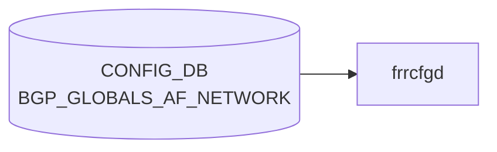

# BGP_GLOBALS_AF_NETWORK テーブル

## 概要

**[VRF](../../reference/glossary.md#term-vrf) × アドレスファミリ単位** で [BGP](../../reference/glossary.md#term-bgp) に **静的に注入するネットワーク** (`network <prefix>` ステートメント) を定義する [CONFIG_DB](../../reference/glossary.md#term-config_db) テーブル[^1]。[FRR](../../reference/glossary.md#term-frr) `bgpd` の `address-family <afi> <safi>` 配下の `network <ip_prefix>` に対応する。`frr-mgmt-framework` 経路 (DEVICE_METADATA `frr_mgmt_framework_config = true`) で使用される。

`BGP_GLOBALS_AF_AGGREGATE_ADDR` が複数の動的ルートを **集約** するのに対し、こちらは管理者が **明示的に広告したいプレフィックス** を列挙する用途。

<!-- cdb-mermaid -->
### データフロー (自動生成)



!!! note "凡例"
    CONFIG_DB から SAI までの典型経路を `docs/reference/config-db-orch-map.md` から機械生成したミニ図。詳細・例外は本ページ本文と対応表を参照。
<!-- /cdb-mermaid -->

## key 構造

```text
BGP_GLOBALS_AF_NETWORK|<vrf_name>|<afi_safi>|<ip_prefix>
```

- `<vrf_name>`: `BGP_GLOBALS.vrf_name` への leafref
- `<afi_safi>`: `ipv4_unicast`, `ipv6_unicast` 等
- `<ip_prefix>`: 広告対象プレフィックス (`inet:ip-prefix`)

## フィールド

| フィールド | 型 | 説明 |
|-----------|----|------|
| `vrf_name` (key) | leafref → `BGP_GLOBALS.vrf_name` | 所属 [VRF](../../reference/glossary.md#term-vrf) |
| `afi_safi` (key) | string | アドレスファミリ |
| `ip_prefix` (key) | inet:ip-prefix | 広告するネットワーク |
| `policy` | leafref → `ROUTE_MAP_SET.name` | 属性を加工する route-map |
| `backdoor` | boolean | backdoor ルートとして指定 (RFC 1771 / [FRR](../../reference/glossary.md#term-frr) 拡張) |

## 制約

- 3 つのキーで一意。
- 対応する [VRF](../../reference/glossary.md#term-vrf) の [BGP](../../reference/glossary.md#term-bgp) インスタンスが先に必要 (leafref)。
- `network` で広告するためには、**実際にそのプレフィックスが RIB (ルーティングテーブル) に存在する** ことが [BGP](../../reference/glossary.md#term-bgp) の動作上の前提（`BGP_GLOBALS.network_import_check = true` の場合）。
- `backdoor` は IGP と BGP の同一プレフィックスで IGP を優先させたいときに使う。

## 購読者

- `frr-mgmt-framework`: vtysh の `network <prefix> [route-map <name>] [backdoor]` コマンドに変換
- `bgpd` ([FRR](../../reference/glossary.md#term-frr)): network 経由で BGP UPDATE に該当プレフィックスを注入

## 関連 CONFIG_DB / YANG / CLI

- 関連 [CONFIG_DB](../../reference/glossary.md#term-config_db): `BGP_GLOBALS`, `BGP_GLOBALS_AF`, `BGP_GLOBALS_AF_AGGREGATE_ADDR`, `ROUTE_MAP_SET`, `STATIC_ROUTE`
- 関連 CLI: vtysh の `network <prefix>` (`frr-mgmt-framework` 経路では [CONFIG_DB](../../reference/glossary.md#term-config_db) 投入)
- 関連 [YANG](../../reference/glossary.md#term-yang): `sonic-bgp-global`

<!-- cdb-exceptions -->
## 例外条件・特殊挙動

| 条件 | 挙動 |
|------|------|
| key の IP prefix 形式不正 | `normalize_ip_prefix()` が None → syslog ERR & continue、FRR 未反映 |
| AF_TYPE フォーマット不正（`_` 区切り不可） | ValueError が上位に伝播 |
| FRR コマンド実行失敗 | syslog ERR & continue、再試行なし |
| `policy`/`backdoor` フィールド欠如 | FRR コマンドの該当部分を空/省略で生成 |
| 重複 `network <prefix>` 投入 | FRR は冪等に処理、frrcfgd 側での重複チェックなし |
| `BGP_GLOBALS` が未設定（bgp_asn 不在） | 上位ハンドラで依存待機、または KeyError 伝播 |
| DEL 操作 | FRR への `no network <prefix>` のみ、内部キャッシュなし |

<!-- evidence: sonic-net/sonic-buildimage/src/sonic-frr-mgmt-framework/frrcfgd/frrcfgd.py:3169L -->
<!-- /cdb-exceptions -->

<!-- value-behavior -->
## 値依存挙動マトリクス

### enum 型フィールド

該当無し (フィールドは boolean と freeform のみ)

### boolean フィールド

| フィールド | `true` の効果 | `false` の効果 | evidence |
|---|---|---|---|
| `backdoor` | FRR `network <prefix> backdoor` を生成。同一 prefix の IGP ルートを BGP より優先 | キーワードなし | `sonic-bgp-global.yang; frrcfgd.py:3169` |

### `policy` (leafref → ROUTE_MAP_SET.name)

| 値 | 効果 | evidence |
|---|---|---|
| 文字列 (route-map 名) | `network <prefix> route-map <name>` を生成。注入する prefix の BGP 属性を加工 | `frrcfgd.py:3169` |
| 空/未設定 | route-map 指定なし | — |

### 複合条件

- `backdoor=true` は `policy` と組み合わせて `network <prefix> route-map <name> backdoor` となる
- `BGP_GLOBALS.network_import_check=true` (FRR デフォルト) の場合、対象 prefix が RIB に存在しないと FRR が BGP UPDATE への注入を拒否する (CONFIG_DB への書き込みは成功するが実際には広告されない)
<!-- /value-behavior -->

<!-- defaults -->
## 暗黙デフォルトとコード由来フォールバック

### YANG デフォルト宣言

`BGP_GLOBALS_AF_NETWORK_LIST` 配下のフィールドには YANG `default` 文が**ない**。

### 実行時フォールバック (frrcfgd)

`af_network_key_map` 定義 (`frrcfgd.py:1985`):

```python
['ip_prefix', '++policy', '+backdoor']
→ '{no:no-prefix}network {2} {3:network-policy} {4:network-backdoor}'
```

| フィールド | key_map 修飾 | 欠如時の挙動 | 生成コマンドへの影響 |
|---|---|---|---|
| `ip_prefix` | required (修飾なし) | 処理スキップ (必ず存在) | 常に出力 |
| `policy` | `++` (opt_idx_list) | 空文字列で継続 → `network-policy` フォーマッタが `len==0` チェックで省略 | `route-map` キーワードなし |
| `backdoor` | `+` (optional のみ) | break → 空文字列パディング → `network-backdoor` フォーマッタが `''` を出力 | `backdoor` キーワードなし |

**実質デフォルト**: `policy` 欠如 = route-map なし、`backdoor` 欠如 = `false` 相当。

### backdoor フォーマッタ詳細 (`frrcfgd.py:811-814`)

```python
'network-backdoor': 'backdoor'  # bool_format テーブル
# true  → 'backdoor' キーワード出力
# false → '' (空文字列)
# 欠如  → 空文字列 (+修飾によるパディング)
```

### network-policy フォーマッタ詳細 (`frrcfgd.py:922-924`)

```python
elif format == 'network-policy':
    if len(self.value) > 0:
        self.value = 'route-map %s' % self.to_str()
# 空文字列 → 何も追記しない
```

### 書き込み時 vs 実行時の乖離

CONFIG_DB への書き込みは常に成功するが、`BGP_GLOBALS.network_import_check` が `true` (FRR デフォルト、YANG default 宣言なし) の場合、対象プレフィックスが RIB に存在しなければ FRR は実際の BGP UPDATE 注入を拒否する。

### YANG vs 実装の discrepancy

| 項目 | YANG 定義 | 実装挙動 |
|---|---|---|
| `backdoor` の afi 制約 | `ValidateAfisafiForBackdoor` カスタム検証あり (**コメントアウト**) | 検証なし — `ipv6_unicast` 等でも設定可能 (FRR が拒否する場合あり) |
| `backdoor` + `policy` 出力順 | 未規定 | frrcfgd: `route-map <name>` → `backdoor`; j2 テンプレート: `backdoor ` → `route-map <name>` (逆順) |
| `policy`/`backdoor` デフォルト | 宣言なし | 空文字列フォールバック (省略 = キーワードなし) |

<!-- evidence: sonic-bgp-global.yang:537-540; frrcfgd.py:1985,811-826,922-924 -->
<!-- /defaults -->

<!-- ref-triangle:start -->

## 関連リファレンス

- [YANG](../../reference/glossary.md#term-yang): [`sonic-bgp-global`](../yang/sonic-bgp-global.md)
- CLI: [`config bgp`](../cli/config-bgp.md)

<!-- ref-triangle:end -->

## 引用元

[^1]: [YANG](../../reference/glossary.md#term-yang) 定義: `sonic-bgp-global.yang` (`BGP_GLOBALS_AF_NETWORK` container). <https://github.com/sonic-net/sonic-buildimage/blob/9ea932ec2e18f35e58268ec2e4456b1d4afd65cd/src/sonic-yang-models/yang-models/sonic-bgp-global.yang>

## 関連ページ
- [CONFIG_DB: BGP_GLOBALS_AF](bgp-globals-af.md)
- [CONFIG_DB: BGP_GLOBALS_AF_AGGREGATE_ADDR](bgp-globals-af-aggregate-addr.md)

<!-- ops-hint -->
## 運用ヒント

### 典型値

- key 形式: `BGP_GLOBALS_AF_NETWORK|<vrf>|<afi_safi>|<prefix>` (例 `BGP_GLOBALS_AF_NETWORK|default|ipv4_unicast|10.1.0.0/16`)。
- `policy`: route-map 名 (任意)。`backdoor`: 通常 `false`。

### よくある誤設定

- 対象 prefix が RIB に存在せず広告されない (`network_import_check=true` の既定で必須)。
- `BGP_GLOBALS_AF_AGGREGATE_ADDR` と用途を混同して、集約の代わりに network で多数の prefix を列挙してしまう。

### 確認コマンド

```bash
sonic-db-cli CONFIG_DB keys 'BGP_GLOBALS_AF_NETWORK|*'
vtysh -c "show running-config bgpd" | grep "^ network"
vtysh -c "show ip bgp"
```
<!-- /ops-hint -->


<!-- runtime-trace -->
## 実コンテナ動作トレース

### 段階 1 — Consumer 登録

`bgpcfgd` が CONFIG_DB の `BGP_GLOBALS_AF_NETWORK` テーブルを購読する。

`BGP_GLOBALS_AF_NETWORK` は `<vrf>|<prefix>` の key 構造。

### 段階 2 — CFG→APPL 翻訳

なし (FRR vtysh 経由)

### 段階 3 — APPL→SAI

なし (FRR BGP network コマンド)

### 段階 4 — タイミングと副作用

**適用タイミング**: 変化検知後 FRR に `network <prefix>` コマンドを発行。次回 BGP Update で広告開始。

**副作用**: 指定プレフィクスが BGP テーブルに inject されピアに広告される。ルートが存在しない場合 null-route が生成される可能性。
<!-- /runtime-trace -->

<!-- entry-points -->
## 書き込み入り口 (Direction A)

対象テーブル: `BGP_GLOBALS_AF_NETWORK`

### CLI
- `vtysh` 経由 network コマンド (bgpcfgd が CONFIG_DB へ書き戻し)
  - ソース: `sonic-frr bgpcfgd`

### minigraph / sonic-cfggen
- なし

### REST / gNMI (sonic-mgmt-common)
- なし (対応 OpenConfig/SONiC YANG transformer なし)

### db_migrator
- なし

### ビルド時デフォルト (init_cfg / j2 テンプレート)
- なし

### ハードコードデフォルト
- なし

### ランタイム注入 (デーモン自動書き込み)
- `bgpcfgd` が FRR running-config を読み CONFIG_DB と同期
<!-- /entry-points -->

<!-- ordering -->
## 書込み順依存 (Phase B)

`BGP_GLOBALS_AF_NETWORK` の Consumer は `frrcfgd`。共通ハンドラ `bgp_table_handler_common` を経由し、`bgp_message_handler` ループ内の `BGP_GLOBALS_AF_NETWORK` 専用分岐 (`frrcfgd.py:3169-3186`) で `vtysh -c "router bgp <asn> vrf <vrf>" -c "address-family <af> <ip_type>" -c "network <prefix> [route-map <name>] [backdoor]"` を発行する。**前提テーブル不在時は silent drop、再試行・deferred queue なし**。

### 推奨書込み順序

```
① VRF|<vrf>                                       (default 以外を使う場合)
② BGP_GLOBALS|<vrf>  (local_asn)                  ← 不在だと #1 で silent drop
③ BGP_GLOBALS_AF|<vrf>|<afi_safi>                 (AF レベル属性の一貫性)
④ ROUTE_MAP / ROUTE_MAP_SET                       (policy 指定時、未存在は permit-any 期間)
⑤ STATIC_ROUTE / 直結インターフェース             (network_import_check=true の RIB 前提)
⑥ BGP_GLOBALS_AF_NETWORK|<vrf>|<afi_safi>|<prefix>
```

### 主要な順序依存

| # | 依存関係 | 方向 | 違反時の挙動 |
|---|----------|------|--------------|
| 1 | `BGP_GLOBALS.local_asn` → 本テーブル | 先行必須 | `local_asn=None` なら `syslog DEBUG 'ignore table ...'` で **silent drop**。`__apply_dep_vrf_table` は `ROUTE_REDISTRIBUTE` のみ再適用するため本テーブルは復旧しない (`frrcfgd.py:2656-2662, 2704`) |
| 2 | `BGP_GLOBALS_AF` → 本テーブル | 推奨 | `table_handler_list` 順序 (`frrcfgd.py:2297 vs 2318`) で起動時は保証、runtime は AF 属性未確定の中間状態あり |
| 3 | `bgpd` プロセス起動 → 書込み | 先行必須 | 未起動・restart 中の `vtysh` は失敗、`syslog ERR 'failed running BGP IP prefix AF config command'` で `continue`、**リトライなし** (`frrcfgd.py:3184-3186`) |
| 4 | `ROUTE_MAP` (`policy` 参照先) → 本テーブル | 推奨 | frrcfgd・FRR とも未存在 route-map を受理 (permit-any として扱われ全許可で広告) (`frrcfgd.py:922-924`) |
| 5 | `VRF|<name>` → 本テーブル | 先行必須 (非 default) | `vrf_tables` メンバ (`frrcfgd.py:2136-2140`)、`vrf_handler` が `table_handler_list` 最先頭 (`frrcfgd.py:2294`) |
| 6 | RIB 上に prefix 存在 → 実 BGP UPDATE | タイミング | CONFIG_DB 書込み成功・FRR 投入成功でも `network_import_check=true` で広告されない期間が発生 |
| 7 | DEL 操作 | 即時 | `no network <prefix> ...` を発行。内部キャッシュ更新なし (`BGP_GLOBALS_AF_AGGREGATE_ADDR` と異なる, `frrcfgd.py:3187-3196` は AGGREGATE 限定) |

### 重要 — silent drop の検出可否

- `local_asn` 不在に伴う drop は `syslog LOG_DEBUG` のため、既定 syslog レベルでは可視化されない。発生時の追跡には `swssloglevel -l DEBUG -c frrcfgd` が必要。
- 一度 drop された `BGP_GLOBALS_AF_NETWORK` エントリは、後から `BGP_GLOBALS.local_asn` が到着しても自動再適用されない (`__apply_dep_vrf_table(vrf, 'ROUTE_REDISTRIBUTE')` は `ROUTE_REDISTRIBUTE` 一択, `frrcfgd.py:2704`)。再投入するには `BGP_GLOBALS_AF_NETWORK` を一度書き直すか frrcfgd を再起動する必要がある。

<!-- evidence: sonic-net/sonic-buildimage/src/sonic-frr-mgmt-framework/frrcfgd/frrcfgd.py:99,2136-2140,2294,2297,2318,2656-2662,2704,3169-3196 -->
<!-- /ordering -->

<!-- platform -->
## プラットフォーム / ASIC 依存分岐

**プラットフォーム差なし。**

`frrcfgd.py` 全体に `platform`・`hwsku`・`asic` キーワードは一切存在しない。
`BGP_GLOBALS_AF_NETWORK` ハンドラ (`bgp_table_handler_common`) は全プラットフォームで
同一コードパスを実行する。

根拠:

| チェック項目 | 結果 |
|-------------|------|
| `frrcfgd.py` 内 `platform` 参照 | 0 件 |
| `frrcfgd.py` 内 `hwsku` 参照 | 0 件 |
| `frrcfgd.py` 内 `asic` 参照 | 0 件 |
| `DEVICE_METADATA` 参照 | `frr_mgmt_framework_config` フラグ読み取りのみ（プラットフォーム選択ではない） |

`BGP_GLOBALS_AF_NETWORK` は FRR (`bgpd`) へ直接 vtysh コマンドを発行し、
orchagent / syncd / SAI を経由しない。ASIC ケイパビリティ差による分岐が
発生する設計上の余地がない。

<!-- evidence: sonic-frr-mgmt-framework/frrcfgd/frrcfgd.py (grep: platform/hwsku/asic = 0 hits) -->
<!-- /platform -->

<!-- constants -->
## ハードコード定数 (Phase E)

`frrcfgd.py` が `BGP_GLOBALS_AF_NETWORK` ハンドラで固定的に使用する
FRR [vtysh](../../reference/glossary.md#term-vtysh) コマンドリテラル、フォーマッタ文字列、syslog メッセージの一覧[^frrcfgd_const]。

### FRR vtysh コマンドキーワード (`frrcfgd.py:1985`)

`af_network_key_map` が生成する [FRR](../../reference/glossary.md#term-frr) コマンドのテンプレート:

```
{no:no-prefix}network {ip_prefix} {policy:network-policy} {backdoor:network-backdoor}
```

| リテラル | 値 | 用途 |
|---------|---|------|
| `network` | `"network"` | FRR `address-family` 配下のネットワーク注入コマンドキーワード |
| `no ` (前置子) | `"no "` | 削除操作時に `no-prefix` フォーマッタが付加する否定前置子 (`frrcfgd.py:828`) |
| `route-map %s` | `"route-map %s"` | `network-policy` フォーマッタが `policy` フィールド非空時に生成する文字列 (`frrcfgd.py:924`) |
| `backdoor` | `"backdoor"` | `network-backdoor` フォーマッタが `backdoor=true` 時に出力するキーワード (`frrcfgd.py:814`) |

### vtysh セッション・コマンドプレフィクス (`frrcfgd.py:3179-3181`)

```python
['configure terminal',
 'router bgp {local_asn} vrf {vrf}',
 'address-family {af} {ip_type}']
```

| 文字列 | 意味 |
|--------|------|
| `"configure terminal"` | FRR vtysh 設定モード開始 |
| `"router bgp {} vrf {}"` | BGP インスタンス・VRF コンテキスト選択 |
| `"address-family {} {}"` | AF/SAFI コンテキスト（`af` = `ipv4`/`ipv6`、`ip_type` = `unicast` 等） |

### IP prefix 正規化定数 (`frrcfgd.py:3172`)

| 定数 | 値 | 意味 |
|------|---|------|
| `"ipv4"` | 文字列リテラル | `af_type.split('_')[0]` の期待値。IPv4 か IPv6 かを分岐する条件文字列 |
| `socket.AF_INET` | `2` | IPv4 の `normalize_ip_prefix()` 呼び出し引数 |
| `socket.AF_INET6` | `10` | IPv6 の `normalize_ip_prefix()` 呼び出し引数 |

### TABLE_DAEMON マッピング (`frrcfgd.py:99`)

| テーブル | デーモン |
|---------|---------|
| `'BGP_GLOBALS_AF_NETWORK'` | `['bgpd']` |

`bgpd` のみにコマンドを送信する。`zebra`/`staticd` は対象外。

### syslog メッセージリテラル (`frrcfgd.py:3174-3185`)

| ログレベル | メッセージ | 発火条件 |
|-----------|-----------|---------|
| `LOG_ERR` | `'invalid IP prefix format %s for af %s'` | `normalize_ip_prefix()` が `None` を返した場合 |
| `LOG_INFO` | `'Set address family for IP prefix {} to {} {}'` | 正常処理時の進捗ログ |
| `LOG_ERR` | `'failed running BGP IP prefix AF config command'` | `run_command()` が `False` を返した場合 |

> 詳細スキャン証跡: `meta/_intermediate/cdb-flow/bgp-globals-af-network-constants.md`

[^frrcfgd_const]: `sonic-buildimage/src/sonic-frr-mgmt-framework/frrcfgd/frrcfgd.py` L99, L811-814, L827-828, L922-924, L1985, L3172-3185。

<!-- /constants -->

<!-- glossary-links-injected: fcbe746ecf8b -->
