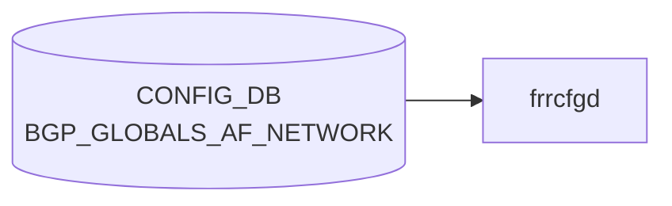

# BGP_GLOBALS_AF_NETWORK テーブル

## 概要

**[VRF](../../reference/glossary.md#term-vrf) × アドレスファミリ単位** で [BGP](../../reference/glossary.md#term-bgp) に **静的に注入するネットワーク** (`network <prefix>` ステートメント) を定義する [CONFIG_DB](../../reference/glossary.md#term-config_db) テーブル[^1]。[FRR](../../reference/glossary.md#term-frr) `bgpd` の `address-family <afi> <safi>` 配下の `network <ip_prefix>` に対応する。`frr-mgmt-framework` 経路 (DEVICE_METADATA `frr_mgmt_framework_config = true`) で使用される。

`BGP_GLOBALS_AF_AGGREGATE_ADDR` が複数の動的ルートを **集約** するのに対し、こちらは管理者が **明示的に広告したいプレフィックス** を列挙する用途。

<!-- cdb-mermaid -->
### データフロー (自動生成)



!!! note "凡例"
    CONFIG_DB から SAI までの典型経路を `docs/reference/config-db-orch-map.md` から機械生成したミニ図。詳細・例外は本ページ本文と対応表を参照。
<!-- /cdb-mermaid -->

## key 構造

```text
BGP_GLOBALS_AF_NETWORK|<vrf_name>|<afi_safi>|<ip_prefix>
```

- `<vrf_name>`: `BGP_GLOBALS.vrf_name` への leafref
- `<afi_safi>`: `ipv4_unicast`, `ipv6_unicast` 等
- `<ip_prefix>`: 広告対象プレフィックス (`inet:ip-prefix`)

## フィールド

| フィールド | 型 | 説明 |
|-----------|----|------|
| `vrf_name` (key) | leafref → `BGP_GLOBALS.vrf_name` | 所属 [VRF](../../reference/glossary.md#term-vrf) |
| `afi_safi` (key) | string | アドレスファミリ |
| `ip_prefix` (key) | inet:ip-prefix | 広告するネットワーク |
| `policy` | leafref → `ROUTE_MAP_SET.name` | 属性を加工する route-map |
| `backdoor` | boolean | backdoor ルートとして指定 (RFC 1771 / [FRR](../../reference/glossary.md#term-frr) 拡張) |

## 制約

- 3 つのキーで一意。
- 対応する [VRF](../../reference/glossary.md#term-vrf) の [BGP](../../reference/glossary.md#term-bgp) インスタンスが先に必要 (leafref)。
- `network` で広告するためには、**実際にそのプレフィックスが RIB (ルーティングテーブル) に存在する** ことが [BGP](../../reference/glossary.md#term-bgp) の動作上の前提（`BGP_GLOBALS.network_import_check = true` の場合）。
- `backdoor` は IGP と BGP の同一プレフィックスで IGP を優先させたいときに使う。

## 購読者

- `frr-mgmt-framework`: vtysh の `network <prefix> [route-map <name>] [backdoor]` コマンドに変換
- `bgpd` ([FRR](../../reference/glossary.md#term-frr)): network 経由で BGP UPDATE に該当プレフィックスを注入

## 関連 CONFIG_DB / YANG / CLI

- 関連 [CONFIG_DB](../../reference/glossary.md#term-config_db): `BGP_GLOBALS`, `BGP_GLOBALS_AF`, `BGP_GLOBALS_AF_AGGREGATE_ADDR`, `ROUTE_MAP_SET`, `STATIC_ROUTE`
- 関連 CLI: vtysh の `network <prefix>` (`frr-mgmt-framework` 経路では [CONFIG_DB](../../reference/glossary.md#term-config_db) 投入)
- 関連 [YANG](../../reference/glossary.md#term-yang): `sonic-bgp-global`

<!-- cdb-exceptions -->
## 例外条件・特殊挙動

| 条件 | 挙動 |
|------|------|
| key の IP prefix 形式不正 | `normalize_ip_prefix()` が None → syslog ERR & continue、FRR 未反映 |
| AF_TYPE フォーマット不正（`_` 区切り不可） | ValueError が上位に伝播 |
| FRR コマンド実行失敗 | syslog ERR & continue、再試行なし |
| `policy`/`backdoor` フィールド欠如 | FRR コマンドの該当部分を空/省略で生成 |
| 重複 `network <prefix>` 投入 | FRR は冪等に処理、frrcfgd 側での重複チェックなし |
| `BGP_GLOBALS` が未設定（bgp_asn 不在） | 上位ハンドラで依存待機、または KeyError 伝播 |
| DEL 操作 | FRR への `no network <prefix>` のみ、内部キャッシュなし |

<!-- evidence: sonic-net/sonic-buildimage/src/sonic-frr-mgmt-framework/frrcfgd/frrcfgd.py:3169L -->
<!-- /cdb-exceptions -->

<!-- value-behavior -->
## 値依存挙動マトリクス

### enum 型フィールド

該当無し (フィールドは boolean と freeform のみ)

### boolean フィールド

| フィールド | `true` の効果 | `false` の効果 | evidence |
|---|---|---|---|
| `backdoor` | FRR `network <prefix> backdoor` を生成。同一 prefix の IGP ルートを BGP より優先 | キーワードなし | `sonic-bgp-global.yang; frrcfgd.py:3169` |

### `policy` (leafref → ROUTE_MAP_SET.name)

| 値 | 効果 | evidence |
|---|---|---|
| 文字列 (route-map 名) | `network <prefix> route-map <name>` を生成。注入する prefix の BGP 属性を加工 | `frrcfgd.py:3169` |
| 空/未設定 | route-map 指定なし | — |

### 複合条件

- `backdoor=true` は `policy` と組み合わせて `network <prefix> route-map <name> backdoor` となる
- `BGP_GLOBALS.network_import_check=true` (FRR デフォルト) の場合、対象 prefix が RIB に存在しないと FRR が BGP UPDATE への注入を拒否する (CONFIG_DB への書き込みは成功するが実際には広告されない)
<!-- /value-behavior -->

<!-- ref-triangle:start -->

## 関連リファレンス

- [YANG](../../reference/glossary.md#term-yang): [`sonic-bgp-global`](../yang/sonic-bgp-global.md)
- CLI: [`config bgp`](../cli/config-bgp.md)

<!-- ref-triangle:end -->

## 引用元

[^1]: [YANG](../../reference/glossary.md#term-yang) 定義: `sonic-bgp-global.yang` (`BGP_GLOBALS_AF_NETWORK` container). <https://github.com/sonic-net/sonic-buildimage/blob/9ea932ec2e18f35e58268ec2e4456b1d4afd65cd/src/sonic-yang-models/yang-models/sonic-bgp-global.yang>

## 関連ページ
- [CONFIG_DB: BGP_GLOBALS_AF](bgp-globals-af.md)
- [CONFIG_DB: BGP_GLOBALS_AF_AGGREGATE_ADDR](bgp-globals-af-aggregate-addr.md)

<!-- ops-hint -->
## 運用ヒント

### 典型値

- key 形式: `BGP_GLOBALS_AF_NETWORK|<vrf>|<afi_safi>|<prefix>` (例 `BGP_GLOBALS_AF_NETWORK|default|ipv4_unicast|10.1.0.0/16`)。
- `policy`: route-map 名 (任意)。`backdoor`: 通常 `false`。

### よくある誤設定

- 対象 prefix が RIB に存在せず広告されない (`network_import_check=true` の既定で必須)。
- `BGP_GLOBALS_AF_AGGREGATE_ADDR` と用途を混同して、集約の代わりに network で多数の prefix を列挙してしまう。

### 確認コマンド

```bash
sonic-db-cli CONFIG_DB keys 'BGP_GLOBALS_AF_NETWORK|*'
vtysh -c "show running-config bgpd" | grep "^ network"
vtysh -c "show ip bgp"
```
<!-- /ops-hint -->


<!-- runtime-trace -->
## 実コンテナ動作トレース

### 段階 1 — Consumer 登録

`bgpcfgd` が CONFIG_DB の `BGP_GLOBALS_AF_NETWORK` テーブルを購読する。

`BGP_GLOBALS_AF_NETWORK` は `<vrf>|<prefix>` の key 構造。

### 段階 2 — CFG→APPL 翻訳

なし (FRR vtysh 経由)

### 段階 3 — APPL→SAI

なし (FRR BGP network コマンド)

### 段階 4 — タイミングと副作用

**適用タイミング**: 変化検知後 FRR に `network <prefix>` コマンドを発行。次回 BGP Update で広告開始。

**副作用**: 指定プレフィクスが BGP テーブルに inject されピアに広告される。ルートが存在しない場合 null-route が生成される可能性。
<!-- /runtime-trace -->

<!-- entry-points -->
## 書き込み入り口 (Direction A)

対象テーブル: `BGP_GLOBALS_AF_NETWORK`

### CLI
- `vtysh` 経由 network コマンド (bgpcfgd が CONFIG_DB へ書き戻し)
  - ソース: `sonic-frr bgpcfgd`

### minigraph / sonic-cfggen
- なし

### REST / gNMI (sonic-mgmt-common)
- なし (対応 OpenConfig/SONiC YANG transformer なし)

### db_migrator
- なし

### ビルド時デフォルト (init_cfg / j2 テンプレート)
- なし

### ハードコードデフォルト
- なし

### ランタイム注入 (デーモン自動書き込み)
- `bgpcfgd` が FRR running-config を読み CONFIG_DB と同期
<!-- /entry-points -->

<!-- derivation -->
## 派生・条件付き登録 (Phase 6/7)

### Phase 6: 自動派生

BGP_GLOBALS_AF_NETWORK は frrcfgd 経由で処理される。フィールド値が FRR `network` コマンドの引数に変換される。

| 派生先フィールド/動作 | 派生元条件 | 派生値 | ソース |
|---|---|---|---|
| FRR `network <prefix> backdoor` | `backdoor == "true"` | `backdoor` オプションを付与 | `bgpd.conf.db.addr_family.j2:36-37` |
| FRR `network <prefix> route-map <policy>` | `policy` フィールドが存在 | `route-map <policy>` オプションを付与 | `bgpd.conf.db.addr_family.j2:39-40` |

**minigraph.py / config_samples.py / init_cfg 由来の自動設定**: 該当なし

### Phase 7: 条件付き登録

| 条件 | 影響 | ソース |
|---|---|---|
| `frrcfgd` は常時登録 | BGP_GLOBALS_AF_NETWORK 購読は無条件 | `frrcfgd.py:99,2318` |
| IP prefix パース失敗 | エラーログ → continue (当該エントリをスキップ) | `frrcfgd.py:3173-3175` |

### グレップカバレッジ

| 項目 | hit 数 | 証跡 |
|---|---|---|
| backdoor フラグ | 1 | `bgpd.conf.db.addr_family.j2:36` |
| policy (route-map) 付与 | 1 | `bgpd.conf.db.addr_family.j2:39` |
| IP prefix パース | 1 | `frrcfgd.py:3172-3174` |

<!-- /derivation -->

<!-- handler-branching -->
### Phase 8: Handler メソッド内分岐

BGP_GLOBALS_AF_NETWORK は `frrcfgd.py` の `bgp_table_handler_common()` 経由で処理される。

| Handler | メソッド | 分岐条件 | 効果 | evidence |
|---|---|---|---|---|
| `frrcfgd` | `bgp_table_handler_common()` | `table == 'BGP_GLOBALS_AF_NETWORK'` | network-prefix パス: `af_type\|ip_prefix` 形式でキー分割 | `frrcfgd.py:3169-3170` |
| `frrcfgd` | 内部処理 | `norm_ip_prefix is None` | エラーログ + continue | `frrcfgd.py:3173-3175` |
| `frrcfgd` | Jinja2 テンプレート | `backdoor == "true"` | FRR `network` コマンドに `backdoor` を付与 | `bgpd.conf.db.addr_family.j2:36-37` |
| `frrcfgd` | Jinja2 テンプレート | `policy` フィールド存在 | FRR `network` コマンドに `route-map <policy>` を付与 | `bgpd.conf.db.addr_family.j2:39-40` |

> **スキャン証跡**: `frrcfgd.py:3169-3186` および `bgpd.conf.db.addr_family.j2:32-45` を全行読了、4 件分岐抽出。BGP_GLOBALS_AF_NETWORK には boolean フィールドのみで enum フィールドなし、分岐はシンプル。

<!-- /handler-branching -->

<!-- glossary-links-injected: fcbe746ecf8b -->
