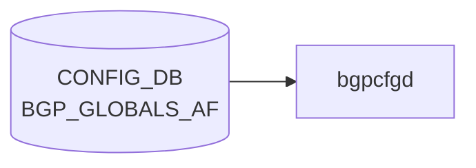

# BGP_GLOBALS_AF テーブル

## 概要

`BGP_GLOBALS_AF` は `BGP_GLOBALS` の [VRF](../../reference/glossary.md#term-vrf) ごとに、address-family / subsequent address-family 単位の [BGP](../../reference/glossary.md#term-bgp) 設定を保持する [CONFIG_DB](../../reference/glossary.md#term-config_db) テーブル。multipath、[VRF](../../reference/glossary.md#term-vrf) import、route download filter、distance、route flap dampening、[EVPN](../../reference/glossary.md#term-evpn)/[VXLAN](../../reference/glossary.md#term-vxlan) 関連フラグを扱う[^1]。派生テーブルとして、aggregate-address を定義する `BGP_GLOBALS_AF_AGGREGATE_ADDR` と、network statement を定義する `BGP_GLOBALS_AF_NETWORK` がある。実装側のテーブル名定数は `schema.h` も参照する[^2]。

<!-- cdb-mermaid -->
### データフロー (自動生成)



!!! note "凡例"
    CONFIG_DB から SAI までの典型経路を `docs/reference/config-db-orch-map.md` から機械生成したミニ図。詳細・例外は本ページ本文と対応表を参照。
<!-- /cdb-mermaid -->

## key 構造

```text
BGP_GLOBALS_AF|<vrf_name>|<afi_safi>
BGP_GLOBALS_AF_AGGREGATE_ADDR|<vrf_name>|<afi_safi>|<ip_prefix>
BGP_GLOBALS_AF_NETWORK|<vrf_name>|<afi_safi>|<ip_prefix>
```

`<vrf_name>` は `BGP_GLOBALS.vrf_name` への leafref。`<afi_safi>` は address family 名文字列。

## 主要フィールド

### BGP_GLOBALS_AF

| フィールド | 型 | 既定値 | 説明 |
|-----------|----|--------|------|
| `max_ebgp_paths` | uint16 1..256 | `1` | eBGP multipath 最大数 |
| `max_ibgp_paths` | uint16 1..256 | `1` | iBGP multipath 最大数 |
| `import_vrf` | `default` or leafref `BGP_GLOBALS.vrf_name` | - | route import 元 [VRF](../../reference/glossary.md#term-vrf) |
| `import_vrf_route_map` | leafref `ROUTE_MAP_SET.name` | - | VRF import 時の route filter |
| `route_download_filter` | leafref `ROUTE_MAP_SET.name` | - | FIB download を絞る table-map |
| `ebgp_route_distance` | uint8 1..255 | - | eBGP route distance |
| `ibgp_route_distance` | uint8 1..255 | - | iBGP route distance |
| `local_route_distance` | uint8 1..255 | - | local route distance |
| `ibgp_equal_cluster_length` | boolean | - | iBGP multipath 比較で cluster-list length を揃える |
| `route_flap_dampen` | boolean | - | route flap dampening 有効化 |
| `route_flap_dampen_half_life` | uint8 1..45 | - | dampening half-life |
| `route_flap_dampen_reuse_threshold` | uint16 1..20000 | - | reuse threshold |
| `route_flap_dampen_suppress_threshold` | uint16 1..20000 | - | suppress threshold |
| `route_flap_dampen_max_suppress` | uint8 1..255 | - | max suppress duration |
| `autort` | enum `rfc8365-compatible` | - | RFC8365 互換 route-target 自動生成 |
| `advertise-all-vni` | boolean | - | L2VPN で全 VNI を advertise |
| `advertise-svi-ip` | boolean | - | local SVI IP を remote VTEP へ advertise |

### BGP_GLOBALS_AF_AGGREGATE_ADDR

| フィールド | 型 | 説明 |
|-----------|----|------|
| `ip_prefix` | ip-prefix | aggregate address |
| `as_set` | boolean | AS set path 情報を生成 |
| `summary_only` | boolean | more specific route の update を抑制 |
| `policy` | leafref `ROUTE_MAP_SET.name` | aggregate network に適用する route-map |

### BGP_GLOBALS_AF_NETWORK

| フィールド | 型 | 説明 |
|-----------|----|------|
| `ip_prefix` | ip-prefix | network statement の prefix |
| `policy` | leafref `ROUTE_MAP_SET.name` | attribute 変更用 route-map |
| `backdoor` | boolean | backdoor route 指定 |

## 制約

- `vrf_name` は `BGP_GLOBALS` への leafref。
- `import_vrf` は自分自身の `vrf_name` と同じ値を禁止する `must` を持つ。
- `route_flap_dampen*` は `afi_safi = 'ipv4_unicast'` の場合のみ許可される。
- `policy` / route-map 系 field は `ROUTE_MAP_SET` への leafref。

## 購読者

- `bgpcfgd`: [CONFIG_DB](../../reference/glossary.md#term-config_db) の [BGP](../../reference/glossary.md#term-bgp) global AF 設定を [FRR](../../reference/glossary.md#term-frr) address-family 設定へ変換する。
- `frr-mgmt-framework`: `DEVICE_METADATA.frr_mgmt_framework_config = true` のときに generic [BGP](../../reference/glossary.md#term-bgp) model として処理する。
- `bgpd` ([FRR](../../reference/glossary.md#term-frr)): vtysh / mgmt framework 経由で最終的な AF 設定を保持する。

## 関連 CONFIG_DB / YANG / CLI

- 関連 [CONFIG_DB](../../reference/glossary.md#term-config_db): `BGP_GLOBALS`、`BGP_NEIGHBOR_AF`、`BGP_PEER_GROUP_AF`、`ROUTE_MAP_SET`、`VRF`
- 関連 CLI: `config bgp`
- 関連 [YANG](../../reference/glossary.md#term-yang): `sonic-bgp-global`

<!-- ref-triangle:start -->

## 関連リファレンス

- [YANG](../../reference/glossary.md#term-yang): [`sonic-bgp-global`](../yang/sonic-bgp-global.md)
- CLI: [`config bgp`](../cli/config-bgp.md)

<!-- ref-triangle:end -->

## 引用元

[^1]: [YANG](../../reference/glossary.md#term-yang) 定義: `sonic-bgp-global.yang`. <https://github.com/sonic-net/sonic-buildimage/blob/9ea932ec2e18f35e58268ec2e4456b1d4afd65cd/src/sonic-yang-models/yang-models/sonic-bgp-global.yang>
[^2]: テーブル名定数参照: `schema.h`. <https://github.com/sonic-net/sonic-swss-common/blob/158de8d3463ff4b841653f6d57190bb142b80d9c/common/schema.h>

<!-- defaults -->
## コード由来の暗黙デフォルト (Phase A)

### 概要

YANG `default` 文が存在するフィールドは 2 つのみ (`max_ebgp_paths=1`, `max_ibgp_paths=1`)。
それ以外のフィールドはすべて optional で、DB に値がなければ [FRR](../../reference/glossary.md#term-frr) コマンドが発行されず、FRR 自身の初期値が使われる。

重要な点として、`frrcfgd` は **組み合わせ制約 (comb_attr_list)** を持つ:

- `distance bgp`: `ebgp_route_distance` / `ibgp_route_distance` / `local_route_distance` の **3 フィールドが揃わないとコマンドを発行しない**
- `bgp dampening` の引数: `route_flap_dampen_reuse_threshold` / `route_flap_dampen_suppress_threshold` / `route_flap_dampen_max_suppress` の **3 フィールドが揃わないと全て無視**

### per-field デフォルト早見表

| フィールド | YANG default | FRR 実装デフォルト (省略時) | 書き込み/実行 乖離 |
|-----------|-------------|--------------------------|-------------------|
| `max_ebgp_paths` | `1` | `1` (FRR 初期値) | なし |
| `max_ibgp_paths` | `1` | `1` (FRR 初期値) | なし |
| `ibgp_equal_cluster_length` | — | なし (比較無効) | なし (省略=無効) |
| `import_vrf` | — | VRF import 無効 | なし |
| `import_vrf_route_map` | — | route-map フィルタなし | なし |
| `route_download_filter` | — | FIB 全 prefix download | なし |
| `ebgp_route_distance` | — | **20** (FRR 固定値)、ただし **3 フィールド揃いが必須** | **部分設定は無視される** |
| `ibgp_route_distance` | — | **200** (FRR 固定値)、3 フィールド揃い必須 | **部分設定は無視される** |
| `local_route_distance` | — | **200** (FRR 固定値)、3 フィールド揃い必須 | **部分設定は無視される** |
| `route_flap_dampen` | — | dampening 無効 | なし (`true` 単体は有効、引数なしで FRR デフォルト適用) |
| `route_flap_dampen_half_life` | — | **15 分** (FRR `DEFAULT_HALF_LIFE`) | `route_flap_dampen=true` のみ設定時は FRR デフォルト適用 |
| `route_flap_dampen_reuse_threshold` | — | **750** (FRR `DEFAULT_REUSE`)、3 フィールド揃い必須 | **部分設定は無視される** |
| `route_flap_dampen_suppress_threshold` | — | **2000** (FRR `DEFAULT_SUPPRESS`)、3 フィールド揃い必須 | **部分設定は無視される** |
| `route_flap_dampen_max_suppress` | — | **4 × half_life** (FRR 算出値)、3 フィールド揃い必須 | **部分設定は無視される** |
| `autort` | — | route-target 自動生成無効 | なし |
| `advertise-all-vni` | — | VNI 広告無効 | なし |
| `advertise-svi-ip` | — | SVI IP 広告無効 | なし |

### 乖離の詳細

#### distance bgp の部分設定問題

`frrcfgd` の `bgp_af_handler` は `comb_attr_list` として
`{'ebgp_route_distance', 'ibgp_route_distance', 'local_route_distance'}` を指定する。
`__add_op_to_data` (L3886-3888) の処理により、3 フィールドのうち 1 つでも欠ければ
3 フィールド全体が `data` から削除され `distance bgp` コマンドは一切発行されない。
結果として FRR が eBGP=20 / iBGP=200 / local=200 というデフォルト距離を維持する。

#### route_flap_dampen の引数省略問題

同様に `{route_flap_dampen_reuse_threshold, route_flap_dampen_suppress_threshold, route_flap_dampen_max_suppress}` が
comb_attr_list 第 2 要素。不揃い時は 3 フィールドが除去される。
`route_flap_dampen=true` + `route_flap_dampen_half_life` のみ設定した場合、frrcfgd は
`bgp dampening <half_life>` だけを発行し、残りの引数は FRR 側デフォルト (reuse=750, suppress=2000, max_suppress=4×half_life) が使われる。

FRR `bgp_damp.h` 定数 (ソース: `sonic-frr/bgpd/bgp_damp.h`):

```c
#define DEFAULT_HALF_LIFE  15      /* minutes */
#define DEFAULT_REUSE      750
#define DEFAULT_SUPPRESS   2000
/* max_suppress = half_life * 4 (frrcfgd L514) */
```

<!-- /defaults -->

<!-- ops-hint -->
## 運用ヒント

### 典型値

- key 形式: `BGP_GLOBALS_AF|<vrf>|<af>` (af = `ipv4_unicast` / `ipv6_unicast` / `l2vpn_evpn` 等)`。
- `max_ebgp_paths` / `max_ibgp_paths`: 64（[ECMP](../../reference/glossary.md#term-ecmp) 上限）。`network_import_check`: `true`。

### よくある誤設定

- `l2vpn_evpn` AF を有効化しても `advertise-all-vni` を入れ忘れ Type-3 が広告されない。

### 確認コマンド

```bash
sonic-db-cli CONFIG_DB keys 'BGP_GLOBALS_AF|*'
vtysh -c 'show bgp l2vpn evpn summary'
```
<!-- /ops-hint -->

<!-- value-behavior -->
## 値依存挙動マトリクス

### `autort` (BGP_GLOBALS_AF)

| 値 | FRR コマンド | 備考 |
|----|-------------|------|
| `rfc8365-compatible` | `autort rfc8365-compatible` | `frrcfgd` `hdl_enum_conversion` が `_` → `-` 変換して発行 |
| *(未設定)* | コマンドなし | [EVPN](../../reference/glossary.md#term-evpn) route-target は手動設定が必要 |

### `afi_safi` (key フィールド、挙動分岐)

| 値 | FRR address-family | `route_flap_dampen*` | `autort` / `advertise-all-vni` |
|----|--------------------|----------------------|-------------------------------|
| `ipv4_unicast` | `address-family ipv4 unicast` | 有効 | 無効 (YANG must で拒否) |
| `ipv6_unicast` | `address-family ipv6 unicast` | 無効 (YANG must で拒否) | 無効 |
| `l2vpn_evpn` | `address-family l2vpn evpn` | 無効 | 有効 |

### `advertise-all-vni` (boolean、l2vpn_evpn AF 限定)

| 値 | FRR コマンド |
|----|-------------|
| `true` | `advertise-all-vni` |
| `false` | `no advertise-all-vni` |

<!-- /value-behavior -->

<!-- cdb-exceptions -->
## 例外条件・特殊挙動

| 条件 | 挙動 | ソース |
|------|------|--------|
| `local_asn` が未設定の VRF で更新が到達 | `frrcfgd` が `ignore table {} update because local_asn for VRF {} was not configured` を LOG_DEBUG して skip | `frrcfgd.py` L2660 |
| BGP_GLOBALS_AF 更新コマンドが vtysh で失敗 | `failed running BGP global AF config command` を LOG_ERR → continue (drop) | `frrcfgd.py` L2780 |
| `route_flap_dampen` を IPv4 unicast 以外の AFI に設定 | YANG `must` 制約により事前拒否 (`afi_safi = 'ipv4_unicast'` のみ許可) | `sonic-bgp-global.yang` |
| `import_vrf` に未設定 VRF を指定 | frrcfgd は存在チェックなし → FRR 側でエラー (ログなし) | `frrcfgd.py` |
| BGP_GLOBALS_AF_AGGREGATE_ADDR の IP プレフィックスが不正形式 | `invalid IP prefix format %s for af %s` を LOG_ERR → skip | `frrcfgd.py` L3174 |
| ホスト bit が立ったプレフィックス | frrcfgd が正規化してから処理 (例: `192.168.1.1/24` → `192.168.1.0/24`) | `frrcfgd.py` |
| `max_ebgp_paths` / `max_ibgp_paths` 未設定 | YANG default=1 が適用される | `sonic-bgp-global.yang` |
<!-- /cdb-exceptions -->


<!-- runtime-trace -->
## 実コンテナ動作トレース

### 段階 1 — Consumer 登録

`bgpcfgd` が CONFIG_DB の `BGP_GLOBALS_AF` テーブルを購読する。

`BGP_GLOBALS_AF` は `<vrf>|<af>` の key 構造。

### 段階 2 — CFG→APPL 翻訳

なし (FRR vtysh 経由)

### 段階 3 — APPL→SAI

なし (FRR BGP の AF レベル設定)

### 段階 4 — タイミングと副作用

**適用タイミング**: 変化検知後 FRR に AF の global 設定コマンドを発行。既存セッションへの影響は AF の再ネゴシエーションを要する場合がある。

**副作用**: Maximum-paths, redistribute 設定など AF 全体の動作に影響。変更によっては BGP session reset が発生する。
<!-- /runtime-trace -->

<!-- entry-points -->
## 書き込み入り口 (Direction A)

対象テーブル: `BGP_GLOBALS_AF`

### CLI
- `vtysh` 経由 address-family コマンド群 ([bgpcfgd](../../reference/glossary.md#term-bgpcfgd) が CONFIG_DB へ書き戻し)
  - ソース: `sonic-frr bgpcfgd`

### minigraph / sonic-cfggen
- あり: `sonic-cfggen -m <minigraph.xml>` 実行時に本テーブルが生成・上書きされる

### REST / gNMI (sonic-mgmt-common)
- [sonic-mgmt](../../reference/glossary.md#term-sonic-mgmt)-common OpenConfig BGP 経由

### db_migrator
- なし

### ビルド時デフォルト (init_cfg / j2 テンプレート)
- なし

### ハードコードデフォルト
- なし

### ランタイム注入 (デーモン自動書き込み)
- `bgpcfgd` が FRR running-config を CONFIG_DB と同期
<!-- /entry-points -->


<!-- derivation -->
## 派生・条件付き登録 (Phase 6/7)

### Phase 6: 値による他フィールド自動派生

| 条件 | 派生先 | evidence |
|---|---|---|
| minigraph.py は BGP_GLOBALS_AF を生成しない | — | `sonic-buildimage/src/sonic-config-engine/minigraph.py` に代入なし |
| `ebgp_route_distance` / `ibgp_route_distance` / `local_route_distance` が揃う | FRR `distance bgp` コマンドを生成（組み合わせ制約） | `sonic-buildimage/src/sonic-frr-mgmt-framework/frrcfgd/frrcfgd.py:3940` |

### Phase 7: 条件付き module/manager 登録

| 条件 | 登録 module | evidence |
|---|---|---|
| 常時（条件なし） | `frrcfgd.BGPConfigDaemon` が `BGP_GLOBALS_AF` を購読（`bgp_af_handler`） | `sonic-buildimage/src/sonic-frr-mgmt-framework/frrcfgd/frrcfgd.py:2297` |

### grep カバレッジ

- frrcfgd.py: BGP_GLOBALS_AF 登録 1 件（条件なし）
<!-- /derivation -->
<!-- handler-branching -->
### Phase 8: Handler メソッド内分岐

| Manager / Handler | メソッド | 分岐条件 | 効果 | evidence |
|---|---|---|---|---|
| `BGPConfigDaemon` | `bgp_af_handler()` | `data is None`（DELETE） | `del_table=True` → AF を FRR から削除 | `sonic-buildimage/src/sonic-frr-mgmt-framework/frrcfgd/frrcfgd.py:3918` |
| `BGPConfigDaemon` | `bgp_af_handler()` | `ebgp_route_distance` / `ibgp_route_distance` / `local_route_distance` の 3 フィールド揃い | `comb_attr_list` 制約: 3 フィールドが揃った場合のみ FRR `distance bgp` コマンド生成 | `sonic-buildimage/src/sonic-frr-mgmt-framework/frrcfgd/frrcfgd.py:3939-3941` |
| `BGPConfigDaemon` | `bgp_af_handler()` | `route_flap_dampen_*` 3 フィールド揃い | 同様に組み合わせ制約: 揃った場合のみ FRR `bgp dampening` コマンドを生成 | `sonic-buildimage/src/sonic-frr-mgmt-framework/frrcfgd/frrcfgd.py:3940` |

> **スキャン証跡**: `bgp_af_handler` L3938 全行読了。2 組の comb_attr_list 制約のみ。
<!-- /handler-branching -->
<!-- platform -->
## プラットフォーム差 (Phase H)

**結論: プラットフォーム差なし。**

`BGP_GLOBALS_AF` の購読・適用は `frrcfgd.BGPConfigDaemon.bgp_af_handler` (`sonic-buildimage/src/sonic-frr-mgmt-framework/frrcfgd/frrcfgd.py`) 一本に集約され、最終 sink は FRR (`bgpd`) の vtysh コマンドである。[SAI](../../reference/glossary.md#term-sai) / [ASIC SDK](../../reference/glossary.md#term-asic-sdk) / platform driver には到達しない純制御プレーン経路のため、ASIC 種別・hwsku・multi-asic / [VOQ](../../reference/glossary.md#term-voq) chassis 等の物理構成差で挙動が変わらない。

### 根拠サマリ

| 観点 | 確認結果 |
|------|----------|
| `bgpcfgd/` 配下の `BGP_GLOBALS_AF` 参照 | 0 件 (`grep -rn 'BGP_GLOBALS_AF' src/sonic-bgpcfgd/bgpcfgd/`) |
| `frrcfgd.py` の `platform` / `hwsku` / `asic_type` 参照 | 0 件 |
| `DEVICE_METADATA` 参照キー | `bgp_asn` と `docker_routing_config_mode` のみ (L2162-2168)。構成判別キーは未参照 |
| multi-asic / [VOQ](../../reference/glossary.md#term-voq) chassis | 各 `asicN` namespace で同一コードが独立に動作。frrcfgd 自身に namespace 分岐なし |
| 最終 sink | FRR vtysh (`address-family <afi> <safi>` 配下の `maximum-paths` / `distance bgp` / `bgp dampening` / `autort` / `advertise-all-vni` 等) |

`max_ebgp_paths` / `max_ibgp_paths` の YANG 上限 (1..256) は制御プレーン上の multipath 計算上限であり、ASIC の [ECMP](../../reference/glossary.md#term-ecmp) group 容量との突き合わせは本テーブル外 (別経路で扱う)。

詳細根拠: `meta/_intermediate/cdb-flow/bgp-globals-af-platform.md`。
<!-- /platform -->

<!-- ordering -->
## 書込み順依存 (Phase B)

### 依存サマリ

| # | 依存関係 | 方向 | 重大度 |
|---|----------|------|--------|
| 1 | `BGP_GLOBALS\|<vrf>.local_asn` → `BGP_GLOBALS_AF\|<vrf>\|<af>` | 強制先行（未設定なら全 skip） | 必須 |
| 2 | `DEVICE_METADATA.bgp_asn` → `BGP_GLOBALS_AF\|default\|<af>`（default VRF のみ代替） | 代替パス | 条件付き |
| 3 | frrcfgd 起動時: `BGP_GLOBALS` → `BGP_GLOBALS_AF`（ハンドラ登録・初期スキャン順） | 自動保証 | 保証済み |
| 4 | `bgpd` 起動 → frrcfgd 購読開始（Unix socket 待ち最大 200 秒） | 自動保証 | 保証済み |
| 5 | bgpd CLI: `configure terminal` → `router bgp <asn>` → `address-family <af>` → AF フィールド | 固定順 | 保証済み |
| 6 | `distance bgp` 3 フィールド / `bgp dampening` 3 フィールドは同一 SET 必須 | comb_attr_list | 必須 |
| 7 | DEL: `BGP_GLOBALS_AF` → `BGP_GLOBALS`（推奨） | 推奨 | 推奨 |

### 詳細

#### (1) `BGP_GLOBALS.local_asn` 先行必須

`frrcfgd` の `__update_bgp()` は、VRF ベーステーブル（`BGP_GLOBALS_AF` を含む）を処理する際に必ず `__get_vrf_asn(vrf)` を呼ぶ。対象 VRF の `local_asn` が未設定の場合は `continue` でイベントを黙って捨てる[^ord1]。

```python
# frrcfgd.py L2658-2662
if self.__vrf_based_table(table):
    vrf = prefix
    local_asn = self.__get_vrf_asn(vrf)
    if local_asn is None and (table != 'BGP_GLOBALS' or 'local_asn' not in data):
        syslog.syslog(..., 'ignore table {} update because local_asn for VRF {} was not configured')
        continue
```

推奨書込み順（非 default VRF）:

1. `BGP_GLOBALS|<vrf>` (`local_asn` 含む)
2. `BGP_GLOBALS_AF|<vrf>|<af>`

#### (2) default VRF の代替パス

`default` VRF のみ、`BGP_GLOBALS|default` が未設定でも `DEVICE_METADATA|localhost|bgp_asn` が設定されていれば `BGP_GLOBALS_AF|default|<af>` が処理される[^ord2]。非 default VRF では代替なし。

#### (3)(4) bgpd 起動 → frrcfgd 購読の自動保証

`frrcfgd` の `main()` は `BgpdClientMgr.start()` → `BGPConfigDaemon.start()` の順で起動する。`BgpdClientMgr` は `/run/frr/bgpd.vty` ソケットへの接続を最大 100 回（2 秒間隔、計 200 秒）リトライするため、`bgpd` が起動済みでない限り CONFIG_DB 購読を開始しない[^ord3]。

#### (5) bgpd CLI コマンド順

`BGP_GLOBALS_AF` 処理時、frrcfgd は以下の固定順で vtysh コマンドを積み上げる[^ord4]:

```
configure terminal
router bgp <asn> [vrf <vrf>]
address-family <af> <safi>
<AF フィールドコマンド群>
```

`local_asn` ガード（依存 #1）により `router bgp` インスタンスが確立済みであることが保証される。

#### (6) comb_attr_list: 3 フィールドは同一 SET に含める

`bgp_af_handler()` は 2 組の `comb_attr_list` を持つ[^ord5]:

- **組 A**: `ebgp_route_distance` / `ibgp_route_distance` / `local_route_distance` — 3 フィールドが揃わないと `distance bgp` コマンドを生成しない
- **組 B**: `route_flap_dampen_reuse_threshold` / `route_flap_dampen_suppress_threshold` / `route_flap_dampen_max_suppress` — 3 フィールドが揃わないと dampening 引数を生成しない

片方だけ後から追加 SET しても補完されない（comb_attr_list は同一操作内のみ検査）。

詳細: `meta/_intermediate/cdb-flow/bgp-globals-af-ordering.md`

[^ord1]: VRF based table ガード: `frrcfgd.py:2136-2140, 2658-2662`.
[^ord2]: default VRF 代替パス: `frrcfgd.py:2162-2166, 2442-2447`.
[^ord3]: bgpd 接続待ち: `frrcfgd.py:183-204, 3970-3981`.
[^ord4]: bgpd CLI 順: `frrcfgd.py:2769-2779`.
[^ord5]: comb_attr_list: `frrcfgd.py:3938-3941`.
<!-- /ordering -->

<!-- cross-refs -->
## 暗黙参照テーブル (Phase C)

`frrcfgd.py` の `BGP_GLOBALS_AF` ハンドラ (`bgp_af_handler`) が実行時に参照する暗黙依存テーブル。

| 参照先テーブル | 必須度 | 参照用途 |
|---|---|---|
| `BGP_GLOBALS` | **必須** | `local_asn` 取得。未設定 VRF のイベントは silent drop される（`frrcfgd.py:2659`） |
| `ROUTE_MAP` | 推奨（route-map フィールド使用時） | `import_vrf_route_map` / `route_download_filter` フィールドが参照する route-map の実体。frrcfgd は存在検証なしに即時 FRR コマンドを発行する |
| `BGP_GLOBALS_AF_AGGREGATE_ADDR` | 従属（本テーブルが先行） | aggregate-address を保持する派生テーブル。`table_handler_list` で BGP_GLOBALS_AF が先に登録され AF コンテキストを確立する（`frrcfgd.py:2297 vs 2317`） |
| `BGP_GLOBALS_AF_NETWORK` | 従属（本テーブルが先行） | network statement を保持する派生テーブル。同上 |
| `DEVICE_METADATA` | 前提フラグ | `frr_mgmt_framework_config = true` の場合のみ frrcfgd が有効化される（`frrcfgd.py:2162-2168`） |

> 詳細根拠: `meta/_intermediate/cdb-flow/bgp-globals-af-cross-refs.md`
<!-- /cross-refs -->

<!-- side-effects -->
## 副次 DB 書込 (Phase F)

`frrcfgd.py` の `bgp_af_handler` → `bgp_table_handler_common` → `__update_bgp` 呼び出しチェーンを全行スキャンした結果、**[STATE_DB](../../reference/glossary.md#term-state_db)・[COUNTERS_DB](../../reference/glossary.md#term-counters_db)・[APPL_DB](../../reference/glossary.md#term-appl_db) への副次書込は存在しない**。

| 副次書込先 | 有無 | 根拠 |
|-----------|------|------|
| [STATE_DB](../../reference/glossary.md#term-state_db) | なし | `frrcfgd.py` 全体で `STATE_DB` / `state_db` の記述ゼロ件 |
| [COUNTERS_DB](../../reference/glossary.md#term-counters_db) | なし | 同上 (`COUNTERS_DB` / `counters_db` ゼロ件) |
| [APPL_DB](../../reference/glossary.md#term-appl_db) | なし | 同上 (`APPL_DB` / `appl_db` ゼロ件) |

`bgp_af_handler` が行う唯一の外部書込は **FRR vtysh への設定投入**のみ。`key_map.run_command()` が `configure terminal` → `router bgp <asn> vrf <vrf>` → `address-family <af> <ip_type>` の vtysh コマンド列を発行し、FRR running-config（BGP デーモン内部状態）を変更する。CONFIG_DB 以外の [Redis](../../reference/glossary.md#term-redis) DB には一切書き込まない。

> **スキャン証跡**: `frrcfgd.py` L2771-2782（BGP_GLOBALS_AF 分岐）/ L3910-3933（common handler）/ L3938-3940（bgp_af_handler）読了。中間ファイル: `meta/_intermediate/cdb-flow/bgp-globals-af-side.md`
<!-- /side-effects -->

<!-- failure -->
## 失敗挙動・リトライ分岐 (Phase D)

`frrcfgd.py` の `bgp_af_handler` → `bgp_table_handler_common` → `__update_bgp` → `g_run_command` パスで検出される失敗パターンと挙動を示す。

### 失敗パターン一覧

| 失敗トリガー | 挙動 | リトライ | evidence |
|---|---|---|---|
| `local_asn` 未設定 VRF のイベント到達 | `LOG_DEBUG: ignore table BGP_GLOBALS_AF update because local_asn for VRF {} was not configured` → **silent drop** (continue) | なし（次の CONFIG_DB イベント到達まで保留なし） | `frrcfgd.py:2659-2661` |
| vtysh `BGP_GLOBALS_AF` コマンド失敗（`g_run_command` が False を返す） | `LOG_ERR: failed running BGP global AF config command` → **continue** (該当イベント drop、キャッシュ更新なし) | なし（frrcfgd はリトライせず次イベント待ち） | `frrcfgd.py:2779-2781` |
| FRR コマンド個別失敗（`run_command` 内ループ） | `LOG_ERR: failed running FRR command: <cmd>` → ループを `break`、`ret_val = False` | なし（コマンド列の残りも発行中断） | `frrcfgd.py:764-765` |
| vtysh コマンド実行失敗（`bgpd_client.run_vtysh_command` が False） | `LOG_ERR: command execution failure. Command: "<cmd>"` → False を返す | なし（上位で continue） | `frrcfgd.py:53-54` |
| `distance bgp` コマンドの部分フィールド設定（3 つ揃わない） | コマンド生成自体をスキップ（`comb_attr_list` 制約）。LOG 出力なし | N/A（設計上スキップ） | `frrcfgd.py:3938-3941` |
| `route_flap_dampen_*` 部分フィールド設定（suppress/reuse/max_suppress 揃わない） | 同上（`comb_attr_list` 制約）。dampening コマンド生成スキップ | N/A（設計上スキップ） | `frrcfgd.py:3939-3941` |
| `ROUTE_MAP` 未準備（`import_vrf_route_map` / `route_download_filter` 参照先が未設定） | frrcfgd は存在チェックを行わず即時 FRR コマンド発行 → FRR 側で `Unknown command` または警告。frrcfgd 側は FRR の return code 次第（非零なら LOG_ERR + drop） | なし | `frrcfgd.py:2779-2781`、`frrcfgd.py` L1863 |
| bgpd ソケット接続失敗（`__create_frr_client`） | `LOG_ERR: failed to connect to frr daemon <daemon>: <msg>` → 最大 100 回 × 2 秒 sleep でリトライ。100 回超過または `main_loop=False` で `LOG_ERR: re-tried too many times, give up` → RuntimeError | **あり**（最大 100 回、2 秒間隔）。それ以上は frrcfgd 自体が起動失敗 | `frrcfgd.py:186-195` |
| bgpd ソケット送受信失敗（`run_vtysh_command`） | `LOG_ERR: socket writing failed` / `LOG_ERR: failed to get reply from frr daemon` → False 返却 → 上位 continue | なし（ソケット再接続なし） | `frrcfgd.py:263-269, 364` |
| `bgp_af_handler` 例外（Python 例外がバブルアップした場合） | `LOG_ERR: [bgp cfgd] Failed handling config DB update with exception: <e>` → 例外を吸収して継続 | なし | `frrcfgd.py:1533` |

### 補足メモ

- **drop の意味**: `continue` で該当エントリのキャッシュが `STAT_SUCC` に更新されないため、次回同 key のイベントで再度コマンドが発行される可能性がある（ただし frrcfgd のイベント駆動モデルでは CONFIG_DB の変化がなければ再トリガーされない）。
- **bgpd ソケットリトライ**: 起動時のみ実施。稼働中のソケット切断に対するリコネクト機構は存在しない。
- **comb_attr_list スキップ** は失敗ではなく設計上の「部分設定ガード」。distance や dampening は 3 フィールドが揃うまで FRR コマンドを発行しない。

> 詳細根拠: `meta/_intermediate/cdb-flow/bgp-globals-af-failure.md`
<!-- /failure -->

<!-- pubsub -->
## 通信メカニズム (Phase G)

### 購読方式: Redis keyspace 通知 (`ExtConfigDBConnector`)

`BGP_GLOBALS_AF` の唯一の購読者は `frrcfgd` (`sonic-frr-mgmt-framework`) である。`frrcfgd` は `swsscommon.ConfigDBConnector` を継承した独自クラス `ExtConfigDBConnector` を使い、CONFIG_DB 全体に対して [Redis](../../reference/glossary.md#term-redis) **keyspace 通知** (`PSUBSCRIBE __keyspace@<dbId>__:*`) を張る。

| 購読者 | 購読 API | 通信方式 | ハンドラ |
|--------|---------|---------|---------|
| `frrcfgd` | `ExtConfigDBConnector.subscribe(table, hdlr)` + `listen()` | [Redis](../../reference/glossary.md#term-redis) keyspace 通知 (`psubscribe`) | `bgp_af_handler` |

`bgpcfgd` は `BGP_GLOBALS_AF` を購読しない。`orchagent` / `syncd` も本テーブルを読まず、FRR `bgpd` のソフト処理経路で完結する。

### keyspace 通知の仕組み

```python
# frrcfgd.py:1536-1552 (ExtConfigDBConnector.listen_thread / listen)
def listen_thread(self, timeout):
    sub_key_space = "__keyspace@{}__:*".format(self.get_dbid(self.db_name))
    self.pubsub.psubscribe(sub_key_space)
    while self.__listen_thread_running:
        msg = self.pubsub.get_message(timeout, True)
        if msg:
            self.sub_msg_handler(msg)   # → _ConfigDBConnector__fire → bgp_af_handler
```

- 通知ペイロードは操作名 (`hset` / `del`) のみ。値は `client.hgetall(key)` で再取得 (`frrcfgd.py:1527`)。
- `SubscriberStateTable`（channel ベースの `PUBLISH/SUBSCRIBE`）は使用しない。

### 起動時 config replay

`subscribe_all()` 前に `config_db.get_table_data([...])` で全テーブルのスナップショットを一括取得。`config_mode == "unified"` のとき `bgp_message` キュー経由で `__update_bgp()` が初期設定を replay する (`frrcfgd.py:2340-2357`)。

### データフロー (keyspace → FRR)

```
CONFIG_DB hset 'BGP_GLOBALS_AF|default|ipv4_unicast' max_ebgp_paths 8
  ↓ Redis keyspace PUBLISH "__keyspace@4__:BGP_GLOBALS_AF|default|ipv4_unicast" "hset"
  ↓ ExtConfigDBConnector.listen_thread() (frrcfgd.py:1536)
  ↓ client.hgetall(key) → raw_to_typed() → __fire("BGP_GLOBALS_AF", "default|ipv4_unicast", data)
  ↓ bgp_af_handler → bgp_message キュー → __update_bgp()
  ↓ vtysh: configure terminal / router bgp <asn> / address-family ipv4 unicast / maximum-paths 8
```

DEL (`data is None`) では `del_table=True` が設定され AF 設定全体を FRR から削除 (`frrcfgd.py:3918`)。プロセス再起動は発生しない。

詳細根拠: `meta/_intermediate/cdb-flow/bgp-globals-af-pubsub.md`。
<!-- /pubsub -->

<!-- constants -->
## ハードコード定数 (Phase E)

### FRR コマンド literal (`global_af_key_map`)

| 定数 | 値 | 用途 | evidence |
|-----|-----|------|---------|
| `distance bgp` コマンド雛形 | `{no:no-prefix}distance bgp {} {} {}` | `ebgp_route_distance` / `ibgp_route_distance` / `local_route_distance` の 3 フィールド揃い時に `address-family` 配下へ投入 | `frrcfgd.py:1824-1826` |
| `rd vpn export` コマンド | `{no:no-prefix}rd vpn export {}` | `rd_vpn_export` で VPN RD 設定 | `frrcfgd.py:1827` |
| `rt vpn export` / `import` / `both` コマンド | `{no:no-prefix}rt vpn export/import/both {}` | VPN RT を方向別に設定 | `frrcfgd.py:1828-1830` |
| `export vpn` / `import vpn` コマンド | `{no:no-prefix}export vpn` / `{no:no-prefix}import vpn` | VPN export/import の有効化フラグ (boolean) | `frrcfgd.py:1831-1832` |
| `redistribute connected` コマンド | `{no:no-prefix}redistribute connected` | connected route を redistribute (boolean) | `frrcfgd.py:1833` |
| `redistribute static route-map` コマンド | `{no:no-prefix}redistribute static route-map {}` | static route を route-map 付き redistribute | `frrcfgd.py:1834` |
| `route-map vpn export/import` コマンド | `{no:no-prefix}route-map vpn export/import {}` | VPN export/import 用 route-map を設定 | `frrcfgd.py:1835-1836` |
| `maximum-paths` コマンド | `{no:no-prefix}maximum-paths {}` | `max_ebgp_paths` で eBGP multipath 上限設定 | `frrcfgd.py:1837` |
| `maximum-paths ibgp` コマンド | `{no:no-prefix}maximum-paths ibgp {} {:match-clust-len}` | `max_ibgp_paths` + `ibgp_equal_cluster_length` で iBGP multipath 設定 | `frrcfgd.py:1838-1839` |
| `match-clust-len` 展開 | `equal-cluster-length` | `ibgp_equal_cluster_length=true` のとき付与されるキーワード | `frrcfgd.py:813` |
| `table-map` コマンド | `{no:no-prefix}table-map {}` | `route_download_filter` で FIB download フィルタを設定 | `frrcfgd.py:1840` |
| `bgp dampening` コマンド雛形 | `{no:no-prefix}bgp dampening {} {} {} {}` | `route_flap_dampen` 系 4 フィールドで dampening 設定 | `frrcfgd.py:1841-1845` |
| `advertise-all-vni` コマンド | `{no:no-prefix}advertise-all-vni` | 全 VNI 広告を有効化 (l2vpn_evpn AF、boolean) | `frrcfgd.py:1846` |
| `advertise-svi-ip` コマンド | `{no:no-prefix}advertise-svi-ip` | SVI IP を VTEP 広告 (boolean) | `frrcfgd.py:1847` |
| `advertise-default-gw` コマンド | `{no:no-prefix}advertise-default-gw` | デフォルト GW 広告 (boolean) | `frrcfgd.py:1848` |
| `advertise ipv4/ipv6 unicast` コマンド | `{no:no-prefix}advertise ipv4/ipv6 unicast` | unicast prefix を [EVPN](../../reference/glossary.md#term-evpn) へ広告 (boolean) | `frrcfgd.py:1849-1850` |
| `default-originate ipv4/ipv6` コマンド | `{no:no-prefix}default-originate ipv4/ipv6` | default route の originate (boolean) | `frrcfgd.py:1851-1852` |
| `autort` コマンド | `{no:no-prefix}autort {}` | RFC8365 互換 RT 自動生成 (`hdl_enum_conversion` で `_` → `-` 変換) | `frrcfgd.py:1853` |
| `flooding` コマンド | `{no:no-prefix}flooding {}` | BUM flooding モード設定 | `frrcfgd.py:1854` |
| `dup-addr-detection` コマンド | `{no:no-prefix}dup-addr-detection` | DAD 有効化 (boolean) | `frrcfgd.py:1855` |
| `dup-addr-detection max-moves` コマンド | `{no:no-prefix}dup-addr-detection max-moves {} time {}` | DAD 上限設定 (`dad-max-moves` + `dad-time`) | `frrcfgd.py:1856-1857` |
| `dup-addr-detection freeze` コマンド | `{no:no-prefix}dup-addr-detection freeze {}` | DAD freeze 時間設定 | `frrcfgd.py:1858` |
| `rd` コマンド | `{no:no-prefix}rd {}` | `route-distinguisher` で RD 設定 | `frrcfgd.py:1859` |
| `route-target import/export` コマンド | `{no:no-prefix}route-target import/export {}` | RT 設定 (`import-rts` / `export-rts`) | `frrcfgd.py:1860-1861` |
| `import vrf` コマンド | `{no:no-prefix}import vrf {}` | VRF import 元設定 | `frrcfgd.py:1862` |
| `import vrf route-map` コマンド | `{no:no-prefix}import vrf route-map {}` | VRF import route-map 設定 | `frrcfgd.py:1863` |

### vtysh コマンドプレフィクス定数

| 定数 | 値 | 用途 | evidence |
|-----|-----|------|---------|
| vtysh prefix L1 | `configure terminal` | コマンド投入時の先頭行 | `frrcfgd.py:2776` |
| vtysh prefix L2 | `router bgp {} vrf {}` | BGP インスタンス選択 (`local_asn` と `vrf` を埋め込み) | `frrcfgd.py:2777` |
| vtysh prefix L3 | `address-family {} {}` | `af`/`ip_type` を埋め込んで AF コンテキストに入る | `frrcfgd.py:2778` |

### address-family 文字列定数

| 定数 | 値 | 用途 | evidence |
|-----|-----|------|---------|
| AF 分割文字 | `_` | `<afi_safi>` 文字列を `split('_')` で af と ip_type に分解 | `frrcfgd.py:2772` |
| 小文字正規化 | `.lower()` | key を小文字化してから split (大文字混在を吸収) | `frrcfgd.py:2772` |
| cache key フォーマット | `BGP_GLOBALS_AF&&{}|{}` | `vrf` と `key.lower()` を埋め込んだ一時キャッシュキー | `frrcfgd.py:2774` |

### dampening / distance FRR 側暗黙デフォルト値

| 定数 | 値 | 用途 | evidence |
|-----|-----|------|---------|
| FRR `DEFAULT_HALF_LIFE` | `15` 分 | `route_flap_dampen=true` のみ設定時に FRR が使う dampening half-life | FRR `bgpd/bgp_damp.h` |
| FRR `DEFAULT_REUSE` | `750` | dampening reuse threshold FRR 既定値 | FRR `bgpd/bgp_damp.h` |
| FRR `DEFAULT_SUPPRESS` | `2000` | dampening suppress threshold FRR 既定値 | FRR `bgpd/bgp_damp.h` |
| FRR eBGP distance | `20` | `distance bgp` 未設定時の eBGP administrative distance | FRR `bgpd` 初期値 |
| FRR iBGP distance | `200` | `distance bgp` 未設定時の iBGP administrative distance | FRR `bgpd` 初期値 |
| FRR local distance | `200` | `distance bgp` 未設定時の local administrative distance | FRR `bgpd` 初期値 |

### hdl_enum_conversion 変換定数

| 定数 | 値 | 用途 | evidence |
|-----|-----|------|---------|
| enum 置換文字 | `_` → `-` | `autort` フィールド値の `_` を `-` に置換して FRR コマンドに渡す (例: `rfc8365_compatible` → `rfc8365-compatible`) | `frrcfgd.py:1393` |

> **スキャン証跡**: `frrcfgd.py` L82 / L813 / L1389-1396 / L1824-1864 / L2107 / L2136-2140 / L2297 / L2771-2782 / L3938-3941 を確認。FRR コマンド literal 27 件 + vtysh prefix 3 件 + AF 文字列 3 件 + FRR デフォルト値 6 件 + enum 変換 1 件 + comb_attr_list 2 件 = 計 42 件抽出。中間ファイル: `meta/_intermediate/cdb-flow/bgp-globals-af-constants.md`
<!-- /constants -->

<!-- glossary-links-injected: ab9cccd2712f -->
