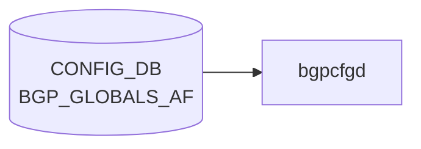

# BGP_GLOBALS_AF テーブル

## 概要

`BGP_GLOBALS_AF` は `BGP_GLOBALS` の [VRF](../../reference/glossary.md#term-vrf) ごとに、address-family / subsequent address-family 単位の [BGP](../../reference/glossary.md#term-bgp) 設定を保持する [CONFIG_DB](../../reference/glossary.md#term-config_db) テーブル。multipath、[VRF](../../reference/glossary.md#term-vrf) import、route download filter、distance、route flap dampening、[EVPN](../../reference/glossary.md#term-evpn)/[VXLAN](../../reference/glossary.md#term-vxlan) 関連フラグを扱う[^1]。派生テーブルとして、aggregate-address を定義する `BGP_GLOBALS_AF_AGGREGATE_ADDR` と、network statement を定義する `BGP_GLOBALS_AF_NETWORK` がある。実装側のテーブル名定数は `schema.h` も参照する[^2]。

<!-- cdb-mermaid -->
### データフロー (自動生成)



!!! note "凡例"
    CONFIG_DB から SAI までの典型経路を `docs/reference/config-db-orch-map.md` から機械生成したミニ図。詳細・例外は本ページ本文と対応表を参照。
<!-- /cdb-mermaid -->

## key 構造

```text
BGP_GLOBALS_AF|<vrf_name>|<afi_safi>
BGP_GLOBALS_AF_AGGREGATE_ADDR|<vrf_name>|<afi_safi>|<ip_prefix>
BGP_GLOBALS_AF_NETWORK|<vrf_name>|<afi_safi>|<ip_prefix>
```

`<vrf_name>` は `BGP_GLOBALS.vrf_name` への leafref。`<afi_safi>` は address family 名文字列。

## 主要フィールド

### BGP_GLOBALS_AF

| フィールド | 型 | 既定値 | 説明 |
|-----------|----|--------|------|
| `max_ebgp_paths` | uint16 1..256 | `1` | eBGP multipath 最大数 |
| `max_ibgp_paths` | uint16 1..256 | `1` | iBGP multipath 最大数 |
| `import_vrf` | `default` or leafref `BGP_GLOBALS.vrf_name` | - | route import 元 [VRF](../../reference/glossary.md#term-vrf) |
| `import_vrf_route_map` | leafref `ROUTE_MAP_SET.name` | - | VRF import 時の route filter |
| `route_download_filter` | leafref `ROUTE_MAP_SET.name` | - | FIB download を絞る table-map |
| `ebgp_route_distance` | uint8 1..255 | - | eBGP route distance |
| `ibgp_route_distance` | uint8 1..255 | - | iBGP route distance |
| `local_route_distance` | uint8 1..255 | - | local route distance |
| `ibgp_equal_cluster_length` | boolean | - | iBGP multipath 比較で cluster-list length を揃える |
| `route_flap_dampen` | boolean | - | route flap dampening 有効化 |
| `route_flap_dampen_half_life` | uint8 1..45 | - | dampening half-life |
| `route_flap_dampen_reuse_threshold` | uint16 1..20000 | - | reuse threshold |
| `route_flap_dampen_suppress_threshold` | uint16 1..20000 | - | suppress threshold |
| `route_flap_dampen_max_suppress` | uint8 1..255 | - | max suppress duration |
| `autort` | enum `rfc8365-compatible` | - | RFC8365 互換 route-target 自動生成 |
| `advertise-all-vni` | boolean | - | L2VPN で全 VNI を advertise |
| `advertise-svi-ip` | boolean | - | local SVI IP を remote VTEP へ advertise |

### BGP_GLOBALS_AF_AGGREGATE_ADDR

| フィールド | 型 | 説明 |
|-----------|----|------|
| `ip_prefix` | ip-prefix | aggregate address |
| `as_set` | boolean | AS set path 情報を生成 |
| `summary_only` | boolean | more specific route の update を抑制 |
| `policy` | leafref `ROUTE_MAP_SET.name` | aggregate network に適用する route-map |

### BGP_GLOBALS_AF_NETWORK

| フィールド | 型 | 説明 |
|-----------|----|------|
| `ip_prefix` | ip-prefix | network statement の prefix |
| `policy` | leafref `ROUTE_MAP_SET.name` | attribute 変更用 route-map |
| `backdoor` | boolean | backdoor route 指定 |

## 制約

- `vrf_name` は `BGP_GLOBALS` への leafref。
- `import_vrf` は自分自身の `vrf_name` と同じ値を禁止する `must` を持つ。
- `route_flap_dampen*` は `afi_safi = 'ipv4_unicast'` の場合のみ許可される。
- `policy` / route-map 系 field は `ROUTE_MAP_SET` への leafref。

## 購読者

- `bgpcfgd`: [CONFIG_DB](../../reference/glossary.md#term-config_db) の [BGP](../../reference/glossary.md#term-bgp) global AF 設定を [FRR](../../reference/glossary.md#term-frr) address-family 設定へ変換する。
- `frr-mgmt-framework`: `DEVICE_METADATA.frr_mgmt_framework_config = true` のときに generic [BGP](../../reference/glossary.md#term-bgp) model として処理する。
- `bgpd` ([FRR](../../reference/glossary.md#term-frr)): vtysh / mgmt framework 経由で最終的な AF 設定を保持する。

## 関連 CONFIG_DB / YANG / CLI

- 関連 [CONFIG_DB](../../reference/glossary.md#term-config_db): `BGP_GLOBALS`、`BGP_NEIGHBOR_AF`、`BGP_PEER_GROUP_AF`、`ROUTE_MAP_SET`、`VRF`
- 関連 CLI: `config bgp`
- 関連 [YANG](../../reference/glossary.md#term-yang): `sonic-bgp-global`

<!-- ref-triangle:start -->

## 関連リファレンス

- [YANG](../../reference/glossary.md#term-yang): [`sonic-bgp-global`](../yang/sonic-bgp-global.md)
- CLI: [`config bgp`](../cli/config-bgp.md)

<!-- ref-triangle:end -->

## 引用元

[^1]: [YANG](../../reference/glossary.md#term-yang) 定義: `sonic-bgp-global.yang`. <https://github.com/sonic-net/sonic-buildimage/blob/9ea932ec2e18f35e58268ec2e4456b1d4afd65cd/src/sonic-yang-models/yang-models/sonic-bgp-global.yang>
[^2]: テーブル名定数参照: `schema.h`. <https://github.com/sonic-net/sonic-swss-common/blob/158de8d3463ff4b841653f6d57190bb142b80d9c/common/schema.h>

<!-- defaults -->
## コード由来の暗黙デフォルト (Phase A)

### 概要

YANG `default` 文が存在するフィールドは 2 つのみ (`max_ebgp_paths=1`, `max_ibgp_paths=1`)。
それ以外のフィールドはすべて optional で、DB に値がなければ FRR コマンドが発行されず、FRR 自身の初期値が使われる。

重要な点として、`frrcfgd` は **組み合わせ制約 (comb_attr_list)** を持つ:

- `distance bgp`: `ebgp_route_distance` / `ibgp_route_distance` / `local_route_distance` の **3 フィールドが揃わないとコマンドを発行しない**
- `bgp dampening` の引数: `route_flap_dampen_reuse_threshold` / `route_flap_dampen_suppress_threshold` / `route_flap_dampen_max_suppress` の **3 フィールドが揃わないと全て無視**

### per-field デフォルト早見表

| フィールド | YANG default | FRR 実装デフォルト (省略時) | 書き込み/実行 乖離 |
|-----------|-------------|--------------------------|-------------------|
| `max_ebgp_paths` | `1` | `1` (FRR 初期値) | なし |
| `max_ibgp_paths` | `1` | `1` (FRR 初期値) | なし |
| `ibgp_equal_cluster_length` | — | なし (比較無効) | なし (省略=無効) |
| `import_vrf` | — | VRF import 無効 | なし |
| `import_vrf_route_map` | — | route-map フィルタなし | なし |
| `route_download_filter` | — | FIB 全 prefix download | なし |
| `ebgp_route_distance` | — | **20** (FRR 固定値)、ただし **3 フィールド揃いが必須** | **部分設定は無視される** |
| `ibgp_route_distance` | — | **200** (FRR 固定値)、3 フィールド揃い必須 | **部分設定は無視される** |
| `local_route_distance` | — | **200** (FRR 固定値)、3 フィールド揃い必須 | **部分設定は無視される** |
| `route_flap_dampen` | — | dampening 無効 | なし (`true` 単体は有効、引数なしで FRR デフォルト適用) |
| `route_flap_dampen_half_life` | — | **15 分** (FRR `DEFAULT_HALF_LIFE`) | `route_flap_dampen=true` のみ設定時は FRR デフォルト適用 |
| `route_flap_dampen_reuse_threshold` | — | **750** (FRR `DEFAULT_REUSE`)、3 フィールド揃い必須 | **部分設定は無視される** |
| `route_flap_dampen_suppress_threshold` | — | **2000** (FRR `DEFAULT_SUPPRESS`)、3 フィールド揃い必須 | **部分設定は無視される** |
| `route_flap_dampen_max_suppress` | — | **4 × half_life** (FRR 算出値)、3 フィールド揃い必須 | **部分設定は無視される** |
| `autort` | — | route-target 自動生成無効 | なし |
| `advertise-all-vni` | — | VNI 広告無効 | なし |
| `advertise-svi-ip` | — | SVI IP 広告無効 | なし |

### 乖離の詳細

#### distance bgp の部分設定問題

`frrcfgd` の `bgp_af_handler` は `comb_attr_list` として
`{'ebgp_route_distance', 'ibgp_route_distance', 'local_route_distance'}` を指定する。
`__add_op_to_data` (L3886-3888) の処理により、3 フィールドのうち 1 つでも欠ければ
3 フィールド全体が `data` から削除され `distance bgp` コマンドは一切発行されない。
結果として FRR が eBGP=20 / iBGP=200 / local=200 というデフォルト距離を維持する。

#### route_flap_dampen の引数省略問題

同様に `{route_flap_dampen_reuse_threshold, route_flap_dampen_suppress_threshold, route_flap_dampen_max_suppress}` が
comb_attr_list 第 2 要素。不揃い時は 3 フィールドが除去される。
`route_flap_dampen=true` + `route_flap_dampen_half_life` のみ設定した場合、frrcfgd は
`bgp dampening <half_life>` だけを発行し、残りの引数は FRR 側デフォルト (reuse=750, suppress=2000, max_suppress=4×half_life) が使われる。

FRR `bgp_damp.h` 定数 (ソース: `sonic-frr/bgpd/bgp_damp.h`):

```c
#define DEFAULT_HALF_LIFE  15      /* minutes */
#define DEFAULT_REUSE      750
#define DEFAULT_SUPPRESS   2000
/* max_suppress = half_life * 4 (frrcfgd L514) */
```

<!-- /defaults -->

<!-- ops-hint -->
## 運用ヒント

### 典型値

- key 形式: `BGP_GLOBALS_AF|<vrf>|<af>` (af = `ipv4_unicast` / `ipv6_unicast` / `l2vpn_evpn` 等)`。
- `max_ebgp_paths` / `max_ibgp_paths`: 64（[ECMP](../../reference/glossary.md#term-ecmp) 上限）。`network_import_check`: `true`。

### よくある誤設定

- `l2vpn_evpn` AF を有効化しても `advertise-all-vni` を入れ忘れ Type-3 が広告されない。

### 確認コマンド

```bash
sonic-db-cli CONFIG_DB keys 'BGP_GLOBALS_AF|*'
vtysh -c 'show bgp l2vpn evpn summary'
```
<!-- /ops-hint -->

<!-- value-behavior -->
## 値依存挙動マトリクス

### `autort` (BGP_GLOBALS_AF)

| 値 | FRR コマンド | 備考 |
|----|-------------|------|
| `rfc8365-compatible` | `autort rfc8365-compatible` | `frrcfgd` `hdl_enum_conversion` が `_` → `-` 変換して発行 |
| *(未設定)* | コマンドなし | EVPN route-target は手動設定が必要 |

### `afi_safi` (key フィールド、挙動分岐)

| 値 | FRR address-family | `route_flap_dampen*` | `autort` / `advertise-all-vni` |
|----|--------------------|----------------------|-------------------------------|
| `ipv4_unicast` | `address-family ipv4 unicast` | 有効 | 無効 (YANG must で拒否) |
| `ipv6_unicast` | `address-family ipv6 unicast` | 無効 (YANG must で拒否) | 無効 |
| `l2vpn_evpn` | `address-family l2vpn evpn` | 無効 | 有効 |

### `advertise-all-vni` (boolean、l2vpn_evpn AF 限定)

| 値 | FRR コマンド |
|----|-------------|
| `true` | `advertise-all-vni` |
| `false` | `no advertise-all-vni` |

<!-- /value-behavior -->

<!-- cdb-exceptions -->
## 例外条件・特殊挙動

| 条件 | 挙動 | ソース |
|------|------|--------|
| `local_asn` が未設定の VRF で更新が到達 | `frrcfgd` が `ignore table {} update because local_asn for VRF {} was not configured` を LOG_DEBUG して skip | `frrcfgd.py` L2660 |
| BGP_GLOBALS_AF 更新コマンドが vtysh で失敗 | `failed running BGP global AF config command` を LOG_ERR → continue (drop) | `frrcfgd.py` L2780 |
| `route_flap_dampen` を IPv4 unicast 以外の AFI に設定 | YANG `must` 制約により事前拒否 (`afi_safi = 'ipv4_unicast'` のみ許可) | `sonic-bgp-global.yang` |
| `import_vrf` に未設定 VRF を指定 | frrcfgd は存在チェックなし → FRR 側でエラー (ログなし) | `frrcfgd.py` |
| BGP_GLOBALS_AF_AGGREGATE_ADDR の IP プレフィックスが不正形式 | `invalid IP prefix format %s for af %s` を LOG_ERR → skip | `frrcfgd.py` L3174 |
| ホスト bit が立ったプレフィックス | frrcfgd が正規化してから処理 (例: `192.168.1.1/24` → `192.168.1.0/24`) | `frrcfgd.py` |
| `max_ebgp_paths` / `max_ibgp_paths` 未設定 | YANG default=1 が適用される | `sonic-bgp-global.yang` |
<!-- /cdb-exceptions -->


<!-- runtime-trace -->
## 実コンテナ動作トレース

### 段階 1 — Consumer 登録

`bgpcfgd` が CONFIG_DB の `BGP_GLOBALS_AF` テーブルを購読する。

`BGP_GLOBALS_AF` は `<vrf>|<af>` の key 構造。

### 段階 2 — CFG→APPL 翻訳

なし (FRR vtysh 経由)

### 段階 3 — APPL→SAI

なし (FRR BGP の AF レベル設定)

### 段階 4 — タイミングと副作用

**適用タイミング**: 変化検知後 FRR に AF の global 設定コマンドを発行。既存セッションへの影響は AF の再ネゴシエーションを要する場合がある。

**副作用**: Maximum-paths, redistribute 設定など AF 全体の動作に影響。変更によっては BGP session reset が発生する。
<!-- /runtime-trace -->

<!-- entry-points -->
## 書き込み入り口 (Direction A)

対象テーブル: `BGP_GLOBALS_AF`

### CLI
- `vtysh` 経由 address-family コマンド群 (bgpcfgd が CONFIG_DB へ書き戻し)
  - ソース: `sonic-frr bgpcfgd`

### minigraph / sonic-cfggen
- あり: `sonic-cfggen -m <minigraph.xml>` 実行時に本テーブルが生成・上書きされる

### REST / gNMI (sonic-mgmt-common)
- sonic-mgmt-common OpenConfig BGP 経由

### db_migrator
- なし

### ビルド時デフォルト (init_cfg / j2 テンプレート)
- なし

### ハードコードデフォルト
- なし

### ランタイム注入 (デーモン自動書き込み)
- `bgpcfgd` が FRR running-config を CONFIG_DB と同期
<!-- /entry-points -->


<!-- derivation -->
## 派生・条件付き登録 (Phase 6/7)

### Phase 6: 値による他フィールド自動派生

| 条件 | 派生先 | evidence |
|---|---|---|
| minigraph.py は BGP_GLOBALS_AF を生成しない | — | `sonic-buildimage/src/sonic-config-engine/minigraph.py` に代入なし |
| `ebgp_route_distance` / `ibgp_route_distance` / `local_route_distance` が揃う | FRR `distance bgp` コマンドを生成（組み合わせ制約） | `sonic-buildimage/src/sonic-frr-mgmt-framework/frrcfgd/frrcfgd.py:3940` |

### Phase 7: 条件付き module/manager 登録

| 条件 | 登録 module | evidence |
|---|---|---|
| 常時（条件なし） | `frrcfgd.BGPConfigDaemon` が `BGP_GLOBALS_AF` を購読（`bgp_af_handler`） | `sonic-buildimage/src/sonic-frr-mgmt-framework/frrcfgd/frrcfgd.py:2297` |

### grep カバレッジ

- frrcfgd.py: BGP_GLOBALS_AF 登録 1 件（条件なし）
<!-- /derivation -->
<!-- handler-branching -->
### Phase 8: Handler メソッド内分岐

| Manager / Handler | メソッド | 分岐条件 | 効果 | evidence |
|---|---|---|---|---|
| `BGPConfigDaemon` | `bgp_af_handler()` | `data is None`（DELETE） | `del_table=True` → AF を FRR から削除 | `sonic-buildimage/src/sonic-frr-mgmt-framework/frrcfgd/frrcfgd.py:3918` |
| `BGPConfigDaemon` | `bgp_af_handler()` | `ebgp_route_distance` / `ibgp_route_distance` / `local_route_distance` の 3 フィールド揃い | `comb_attr_list` 制約: 3 フィールドが揃った場合のみ FRR `distance bgp` コマンド生成 | `sonic-buildimage/src/sonic-frr-mgmt-framework/frrcfgd/frrcfgd.py:3939-3941` |
| `BGPConfigDaemon` | `bgp_af_handler()` | `route_flap_dampen_*` 3 フィールド揃い | 同様に組み合わせ制約: 揃った場合のみ FRR `bgp dampening` コマンドを生成 | `sonic-buildimage/src/sonic-frr-mgmt-framework/frrcfgd/frrcfgd.py:3940` |

> **スキャン証跡**: `bgp_af_handler` L3938 全行読了。2 組の comb_attr_list 制約のみ。
<!-- /handler-branching -->
<!-- platform -->
## プラットフォーム差 (Phase H)

**結論: プラットフォーム差なし。**

`BGP_GLOBALS_AF` の購読・適用は `frrcfgd.BGPConfigDaemon.bgp_af_handler` (`sonic-buildimage/src/sonic-frr-mgmt-framework/frrcfgd/frrcfgd.py`) 一本に集約され、最終 sink は FRR (`bgpd`) の vtysh コマンドである。SAI / ASIC SDK / platform driver には到達しない純制御プレーン経路のため、ASIC 種別・hwsku・multi-asic / VOQ chassis 等の物理構成差で挙動が変わらない。

### 根拠サマリ

| 観点 | 確認結果 |
|------|----------|
| `bgpcfgd/` 配下の `BGP_GLOBALS_AF` 参照 | 0 件 (`grep -rn 'BGP_GLOBALS_AF' src/sonic-bgpcfgd/bgpcfgd/`) |
| `frrcfgd.py` の `platform` / `hwsku` / `asic_type` 参照 | 0 件 |
| `DEVICE_METADATA` 参照キー | `bgp_asn` と `docker_routing_config_mode` のみ (L2162-2168)。構成判別キーは未参照 |
| multi-asic / VOQ chassis | 各 `asicN` namespace で同一コードが独立に動作。frrcfgd 自身に namespace 分岐なし |
| 最終 sink | FRR vtysh (`address-family <afi> <safi>` 配下の `maximum-paths` / `distance bgp` / `bgp dampening` / `autort` / `advertise-all-vni` 等) |

`max_ebgp_paths` / `max_ibgp_paths` の YANG 上限 (1..256) は制御プレーン上の multipath 計算上限であり、ASIC の ECMP group 容量との突き合わせは本テーブル外 (別経路で扱う)。

詳細根拠: `meta/_intermediate/cdb-flow/bgp-globals-af-platform.md`。
<!-- /platform -->

<!-- glossary-links-injected: 803f36c2634d -->
