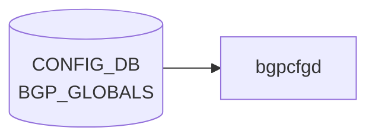

# BGP_GLOBALS テーブル

## 概要

[VRF](../../reference/glossary.md#term-vrf) 単位の [BGP](../../reference/glossary.md#term-bgp) 全体パラメータ（router-id、local AS、graceful restart、route reflector、bestpath 比較ルール、confederation、keepalive/holdtime、max-med、max delay 等）を保持する[^1]。`bgpcfgd` または `frr-mgmt-framework` が読み出し、[FRR](../../reference/glossary.md#term-frr) の `router bgp <asn> vrf <vrf>` ブロックに反映する。`BGP_GLOBALS_AF` / `BGP_GLOBALS_AF_AGGREGATE_ADDR` / `BGP_GLOBALS_AF_NETWORK` がアドレスファミリ依存の設定を持つ。

<!-- cdb-mermaid -->
### データフロー (自動生成)



!!! note "凡例"
    CONFIG_DB から SAI までの典型経路を `docs/reference/config-db-orch-map.md` から機械生成したミニ図。詳細・例外は本ページ本文と対応表を参照。
<!-- /cdb-mermaid -->

## key 構造

```text
BGP_GLOBALS|<vrf_name>
```

`<vrf_name>` は `default` または `VRF.name` への leafref（union）。

## フィールド一覧 (BGP_GLOBALS)

| フィールド | 型 | デフォルト | 説明 |
|-----------|----|-----------|------|
| `router_id` | ipv4-address | - | [BGP](../../reference/glossary.md#term-bgp) router-id |
| `local_asn` | uint32 (1..2^32-1) | - | local AS |
| `always_compare_med` | boolean | - | 異なる隣接からの MED を比較 |
| `load_balance_mp_relax` | boolean | - | multipath-relax (AS path 異なる [ECMP](../../reference/glossary.md#term-ecmp) 許容) |
| `graceful_restart_enable` | boolean | - | GR 有効化 |
| `gr_preserve_fw_state` | boolean | - | F-bit 設定 |
| `gr_restart_time` | uint16 (1..3600) | - | restart timer |
| `gr_stale_routes_time` | uint16 (1..3600) | - | stale-path holding |
| `external_compare_router_id` | boolean | - | EBGP 経路で router-id 比較 |
| `ignore_as_path_length` | boolean | - | as-path 長を無視 |
| `log_nbr_state_changes` | boolean | - | 隣接 up/down log |
| `rr_cluster_id` | string | - | RR cluster ID |
| `rr_allow_out_policy` | boolean | - | RR 反射経路への out-policy 許可 |
| `disable_ebgp_connected_rt_check` | boolean | - | EBGP nexthop connected check 無効化 |
| `fast_external_failover` | boolean | - | 直結 EBGP リンクダウン即時リセット |
| `network_import_check` | boolean | - | network が IGP に存在することを確認 |
| `graceful_shutdown` | boolean | - | graceful shutdown |
| `rr_clnt_to_clnt_reflection` | boolean | - | client-to-client reflection |
| `max_dynamic_neighbors` | uint16 (1..5000) | - | dynamic neighbor 上限 |
| `read_quanta` / `write_quanta` | uint8 (1..10) | - | I/O サイクルあたりパケット数 |
| `coalesce_time` | uint32 | - | subgroup coalesce timer [ms] |
| `route_map_process_delay` | uint16 (0..600) | - | route-map 変更後の遅延 [s] |
| `deterministic_med` / `med_confed` / `med_missing_as_worst` | boolean | - | MED 比較バリエーション |
| `compare_confed_as_path` | boolean | - | confederation set/seq を含めて長さ比較 |
| `as_path_mp_as_set` | boolean | - | multipath aggregate に AS_SET 付与 |
| `default_ipv4_unicast` | boolean | - | peer に IPv4 unicast を既定で activate |
| `default_local_preference` | uint32 | - | 既定 local-preference |
| `default_show_hostname` | boolean | - | dump で hostname 表示 |
| `default_shutdown` | boolean | - | 新規 peer に shutdown を既定適用 |
| `default_subgroup_pkt_queue_max` | uint8 (20..100) | - | subgroup queue 上限 |
| `max_med_time` | uint32 (5..86400) | - | startup max-med 期間 [s] |
| `max_med_val` | uint32 | - | startup max-med 値 |
| `max_med_admin` | boolean | - | admin max-med 有効化 |
| `max_med_admin_val` | uint32 | - | admin max-med 値 |
| `max_delay` | uint16 (0..3600) | - | 起動後 best-path 計算最大遅延 |
| `establish_wait` | uint16 (0..3600) | - | establish 待機時間 |
| `confed_id` | uint32 | - | confederation AS |
| `confed_peers` | leaf-list uint32 | - | confederation peer ASes |
| `keepalive` | uint16 | - | keepalive [s] |
| `holdtime` | uint16 | - | holdtime [s] |

## 関連サブテーブル

- `BGP_GLOBALS_AF` (key: `vrf_name`, `afi_safi`)
    - `max_ebgp_paths` / `max_ibgp_paths` (1..256, default 1)
    - `import_vrf` / `import_vrf_route_map` / `route_download_filter`
    - `ebgp_route_distance` / `ibgp_route_distance` / `local_route_distance` (1..255)
    - `ibgp_equal_cluster_length`
    - `route_flap_dampen` 系 (IPv4 unicast 限定の `must`)
    - `autort` (rfc8365-compatible)、`advertise-all-vni`、`advertise-svi-ip`
- `BGP_GLOBALS_AF_AGGREGATE_ADDR` (key: `vrf_name`, `afi_safi`, `ip_prefix`)
    - `as_set` / `summary_only` / `policy`
- `BGP_GLOBALS_AF_NETWORK` (key: `vrf_name`, `afi_safi`, `ip_prefix`)
    - `policy` / `backdoor`

## 購読者

- `bgpcfgd` / `frr-mgmt-framework`: [CONFIG_DB](../../reference/glossary.md#term-config_db) → vtysh / [FRR](../../reference/glossary.md#term-frr) config に変換
- `bgpd` ([FRR](../../reference/glossary.md#term-frr))

## 関連 CONFIG_DB / YANG / CLI

- 関連 [CONFIG_DB](../../reference/glossary.md#term-config_db): `BGP_NEIGHBOR`、`BGP_DEVICE_GLOBAL`、`BGP_AGGREGATE_ADDRESS`、`VRF`、`ROUTE_MAP_SET`
- 関連 CLI: [`config bgp`](../cli/config-bgp.md)
- 関連 [YANG](../../reference/glossary.md#term-yang): `sonic-bgp-global`

<!-- ref-triangle:start -->

## 関連リファレンス

- [YANG](../../reference/glossary.md#term-yang): [`sonic-bgp-global`](../yang/sonic-bgp-global.md)
- CLI: [`config bgp`](../cli/config-bgp.md)

<!-- ref-triangle:end -->

## 引用元

[^1]: [YANG](../../reference/glossary.md#term-yang) 定義: `sonic-bgp-global.yang`. <https://github.com/sonic-net/sonic-buildimage/blob/9ea932ec2e18f35e58268ec2e4456b1d4afd65cd/src/sonic-yang-models/yang-models/sonic-bgp-global.yang>

## 関連ページ
- [HLD: FRR-BGP Unified Mgmt Framework](../../routing/sonic-frr-bgp-extended-unified-configuration-management-framework.md)
- [CLI: config bgp](../cli/config-bgp.md)
- [YANG: sonic-bgp-global](../yang/sonic-bgp-global.md)

<!-- ops-hint -->
## 運用ヒント

### 典型値

- key 形式: `BGP_GLOBALS|<vrf>` (`default` または `Vrf<name>`)。
- `local_asn`: 自身の AS。
- `router_id`: Loopback0 の IP。
- `load_balance_mp_relax`: `true`（マルチパスを緩和）。

### よくある誤設定

- `router_id` を未設定にすると最初に up した IF の IP が選ばれ、運用で値がブレる。明示するのが鉄則。
- `local_asn` を後から変更すると全 neighbor が一旦落ちる。メンテ窓で実施。

### 確認コマンド

```bash
sonic-db-cli CONFIG_DB hgetall 'BGP_GLOBALS|default'
show ip bgp summary
vtysh -c 'show running-config bgpd'
```
<!-- /ops-hint -->

<!-- value-behavior -->
## 値依存挙動マトリクス

このテーブルは boolean / uint / string フィールドのみで enum フィールドはない。

### `vrf_name` (key、挙動分岐)

| 値 | FRR コマンド形式 |
|----|----------------|
| `default` | `router bgp <local_asn>` |
| 任意の VRF 名 | `router bgp <local_asn> vrf <vrf_name>` |

### 代表的 boolean フィールドの FRR マッピング

| フィールド | `true` 時の FRR コマンド |
|------------|------------------------|
| `graceful_restart_enable` | `bgp graceful-restart` |
| `log_nbr_state_changes` | `bgp log-neighbor-changes` |
| `fast_external_failover` | `bgp fast-external-failover` |
| `graceful_shutdown` | `bgp graceful-shutdown` |
| `load_balance_mp_relax` | `bgp bestpath as-path multipath-relax` |
| `always_compare_med` | `bgp always-compare-med` |
| `deterministic_med` | `bgp deterministic-med` |
| `network_import_check` | `bgp network import-check` |

<!-- /value-behavior -->

<!-- cdb-exceptions -->
## 例外条件・特殊挙動

| 条件 | 挙動 | ソース |
|------|------|--------|
| `local_asn` が未設定の VRF で BGP_GLOBALS 以外のテーブル更新が到達 | frrcfgd が LOG_DEBUG して skip。BGP_GLOBALS 自体に `local_asn` が含まれる場合のみ続行 | `frrcfgd.py` L2660 |
| 非 default VRF が未設定のまま参照 | `non-default VRF {} was not configured` を LOG_ERR → skip | `frrcfgd.py` L2451 |
| Jinja2 テンプレートレンダリング失敗 (bgpcfgd) | `log_err` して `return True` (処理済み扱い = 再試行なし) | `managers_bgp.py` |
| `frr-mgmt-framework` と `bgpcfgd` の並存 | 両方が同テーブルを購読する環境では二重処理に注意 (通常はどちらか一方のみ稼働) | `main.py` L87 |
<!-- /cdb-exceptions -->


<!-- runtime-trace -->
## 実コンテナ動作トレース

### 段階 1 — Consumer 登録

`bgpcfgd` が CONFIG_DB の `BGP_GLOBALS` テーブルを購読する。

`BGP_GLOBALS` は `<vrf>` の key 構造。

### 段階 2 — CFG→APPL 翻訳

なし (FRR vtysh 経由)

### 段階 3 — APPL→SAI

なし (FRR BGP グローバル設定)

### 段階 4 — タイミングと副作用

**適用タイミング**: 変化検知後 FRR に `router bgp <asn>` 等のグローバルコマンドを発行。AS 番号変更は BGP session reset を引き起こす。

**副作用**: AS 番号・Router ID 変更は全 BGP ピアとの session リセットを引き起こす。graceful-restart 設定変更は次回ネゴシエーション時に有効。
<!-- /runtime-trace -->

<!-- glossary-links-injected: 3c93d6c0b6a4 -->
