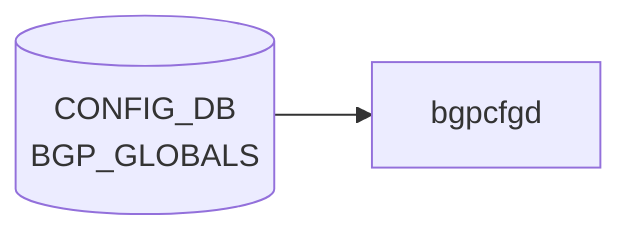

# BGP_GLOBALS テーブル

## 概要

[VRF](../../reference/glossary.md#term-vrf) 単位の [BGP](../../reference/glossary.md#term-bgp) 全体パラメータ（router-id、local AS、graceful restart、route reflector、bestpath 比較ルール、confederation、keepalive/holdtime、max-med、max delay 等）を保持する[^1]。`bgpcfgd` または `frr-mgmt-framework` が読み出し、[FRR](../../reference/glossary.md#term-frr) の `router bgp <asn> vrf <vrf>` ブロックに反映する。`BGP_GLOBALS_AF` / `BGP_GLOBALS_AF_AGGREGATE_ADDR` / `BGP_GLOBALS_AF_NETWORK` がアドレスファミリ依存の設定を持つ。

<!-- cdb-mermaid -->
### データフロー (自動生成)



!!! note "凡例"
    CONFIG_DB から SAI までの典型経路を `docs/reference/config-db-orch-map.md` から機械生成したミニ図。詳細・例外は本ページ本文と対応表を参照。
<!-- /cdb-mermaid -->

## key 構造

```text
BGP_GLOBALS|<vrf_name>
```

`<vrf_name>` は `default` または `VRF.name` への leafref（union）。

## フィールド一覧 (BGP_GLOBALS)

| フィールド | 型 | デフォルト | 説明 |
|-----------|----|-----------|------|
| `router_id` | ipv4-address | - | [BGP](../../reference/glossary.md#term-bgp) router-id |
| `local_asn` | uint32 (1..2^32-1) | - | local AS |
| `always_compare_med` | boolean | - | 異なる隣接からの MED を比較 |
| `load_balance_mp_relax` | boolean | - | multipath-relax (AS path 異なる [ECMP](../../reference/glossary.md#term-ecmp) 許容) |
| `graceful_restart_enable` | boolean | - | GR 有効化 |
| `gr_preserve_fw_state` | boolean | - | F-bit 設定 |
| `gr_restart_time` | uint16 (1..3600) | - | restart timer |
| `gr_stale_routes_time` | uint16 (1..3600) | - | stale-path holding |
| `external_compare_router_id` | boolean | - | EBGP 経路で router-id 比較 |
| `ignore_as_path_length` | boolean | - | as-path 長を無視 |
| `log_nbr_state_changes` | boolean | - | 隣接 up/down log |
| `rr_cluster_id` | string | - | RR cluster ID |
| `rr_allow_out_policy` | boolean | - | RR 反射経路への out-policy 許可 |
| `disable_ebgp_connected_rt_check` | boolean | - | EBGP nexthop connected check 無効化 |
| `fast_external_failover` | boolean | - | 直結 EBGP リンクダウン即時リセット |
| `network_import_check` | boolean | - | network が IGP に存在することを確認 |
| `graceful_shutdown` | boolean | - | graceful shutdown |
| `rr_clnt_to_clnt_reflection` | boolean | - | client-to-client reflection |
| `max_dynamic_neighbors` | uint16 (1..5000) | - | dynamic neighbor 上限 |
| `read_quanta` / `write_quanta` | uint8 (1..10) | - | I/O サイクルあたりパケット数 |
| `coalesce_time` | uint32 | - | subgroup coalesce timer [ms] |
| `route_map_process_delay` | uint16 (0..600) | - | route-map 変更後の遅延 [s] |
| `deterministic_med` / `med_confed` / `med_missing_as_worst` | boolean | - | MED 比較バリエーション |
| `compare_confed_as_path` | boolean | - | confederation set/seq を含めて長さ比較 |
| `as_path_mp_as_set` | boolean | - | multipath aggregate に AS_SET 付与 |
| `default_ipv4_unicast` | boolean | - | peer に IPv4 unicast を既定で activate |
| `default_local_preference` | uint32 | - | 既定 local-preference |
| `default_show_hostname` | boolean | - | dump で hostname 表示 |
| `default_shutdown` | boolean | - | 新規 peer に shutdown を既定適用 |
| `default_subgroup_pkt_queue_max` | uint8 (20..100) | - | subgroup queue 上限 |
| `max_med_time` | uint32 (5..86400) | - | startup max-med 期間 [s] |
| `max_med_val` | uint32 | - | startup max-med 値 |
| `max_med_admin` | boolean | - | admin max-med 有効化 |
| `max_med_admin_val` | uint32 | - | admin max-med 値 |
| `max_delay` | uint16 (0..3600) | - | 起動後 best-path 計算最大遅延 |
| `establish_wait` | uint16 (0..3600) | - | establish 待機時間 |
| `confed_id` | uint32 | - | confederation AS |
| `confed_peers` | leaf-list uint32 | - | confederation peer ASes |
| `keepalive` | uint16 | - | keepalive [s] |
| `holdtime` | uint16 | - | holdtime [s] |

## 関連サブテーブル

- `BGP_GLOBALS_AF` (key: `vrf_name`, `afi_safi`)
    - `max_ebgp_paths` / `max_ibgp_paths` (1..256, default 1)
    - `import_vrf` / `import_vrf_route_map` / `route_download_filter`
    - `ebgp_route_distance` / `ibgp_route_distance` / `local_route_distance` (1..255)
    - `ibgp_equal_cluster_length`
    - `route_flap_dampen` 系 (IPv4 unicast 限定の `must`)
    - `autort` (rfc8365-compatible)、`advertise-all-vni`、`advertise-svi-ip`
- `BGP_GLOBALS_AF_AGGREGATE_ADDR` (key: `vrf_name`, `afi_safi`, `ip_prefix`)
    - `as_set` / `summary_only` / `policy`
- `BGP_GLOBALS_AF_NETWORK` (key: `vrf_name`, `afi_safi`, `ip_prefix`)
    - `policy` / `backdoor`

## 購読者

- `bgpcfgd` / `frr-mgmt-framework`: [CONFIG_DB](../../reference/glossary.md#term-config_db) → [vtysh](../../reference/glossary.md#term-vtysh) / [FRR](../../reference/glossary.md#term-frr) config に変換
- `bgpd` ([FRR](../../reference/glossary.md#term-frr))

## 関連 CONFIG_DB / YANG / CLI

- 関連 [CONFIG_DB](../../reference/glossary.md#term-config_db): `BGP_NEIGHBOR`、`BGP_DEVICE_GLOBAL`、`BGP_AGGREGATE_ADDRESS`、`VRF`、`ROUTE_MAP_SET`
- 関連 CLI: [`config bgp`](../cli/config-bgp.md)
- 関連 [YANG](../../reference/glossary.md#term-yang): `sonic-bgp-global`

<!-- ref-triangle:start -->

## 関連リファレンス

- [YANG](../../reference/glossary.md#term-yang): [`sonic-bgp-global`](../yang/sonic-bgp-global.md)
- CLI: [`config bgp`](../cli/config-bgp.md)

<!-- ref-triangle:end -->

## 引用元

[^1]: [YANG](../../reference/glossary.md#term-yang) 定義: `sonic-bgp-global.yang`. <https://github.com/sonic-net/sonic-buildimage/blob/9ea932ec2e18f35e58268ec2e4456b1d4afd65cd/src/sonic-yang-models/yang-models/sonic-bgp-global.yang>

## 関連ページ
- [HLD: FRR-BGP Unified Mgmt Framework](../../routing/sonic-frr-bgp-extended-unified-configuration-management-framework.md)
- [CLI: config bgp](../cli/config-bgp.md)
- [YANG: sonic-bgp-global](../yang/sonic-bgp-global.md)

<!-- ops-hint -->
## 運用ヒント

### 典型値

- key 形式: `BGP_GLOBALS|<vrf>` (`default` または `Vrf<name>`)。
- `local_asn`: 自身の AS。
- `router_id`: Loopback0 の IP。
- `load_balance_mp_relax`: `true`（マルチパスを緩和）。

### よくある誤設定

- `router_id` を未設定にすると最初に up した IF の IP が選ばれ、運用で値がブレる。明示するのが鉄則。
- `local_asn` を後から変更すると全 neighbor が一旦落ちる。メンテ窓で実施。

### 確認コマンド

```bash
sonic-db-cli CONFIG_DB hgetall 'BGP_GLOBALS|default'
show ip bgp summary
vtysh -c 'show running-config bgpd'
```
<!-- /ops-hint -->

<!-- value-behavior -->
## 値依存挙動マトリクス

このテーブルは boolean / uint / string フィールドのみで enum フィールドはない。

### `vrf_name` (key、挙動分岐)

| 値 | FRR コマンド形式 |
|----|----------------|
| `default` | `router bgp <local_asn>` |
| 任意の [VRF](../../reference/glossary.md#term-vrf) 名 | `router bgp <local_asn> vrf <vrf_name>` |

### 代表的 boolean フィールドの FRR マッピング

| フィールド | `true` 時の FRR コマンド |
|------------|------------------------|
| `graceful_restart_enable` | `bgp graceful-restart` |
| `log_nbr_state_changes` | `bgp log-neighbor-changes` |
| `fast_external_failover` | `bgp fast-external-failover` |
| `graceful_shutdown` | `bgp graceful-shutdown` |
| `load_balance_mp_relax` | `bgp bestpath as-path multipath-relax` |
| `always_compare_med` | `bgp always-compare-med` |
| `deterministic_med` | `bgp deterministic-med` |
| `network_import_check` | `bgp network import-check` |

<!-- /value-behavior -->

<!-- cdb-exceptions -->
## 例外条件・特殊挙動

| 条件 | 挙動 | ソース |
|------|------|--------|
| `local_asn` が未設定の [VRF](../../reference/glossary.md#term-vrf) で BGP_GLOBALS 以外のテーブル更新が到達 | frrcfgd が LOG_DEBUG して skip。BGP_GLOBALS 自体に `local_asn` が含まれる場合のみ続行 | `frrcfgd.py` L2660 |
| 非 default VRF が未設定のまま参照 | `non-default VRF {} was not configured` を LOG_ERR → skip | `frrcfgd.py` L2451 |
| Jinja2 テンプレートレンダリング失敗 ([bgpcfgd](../../reference/glossary.md#term-bgpcfgd)) | `log_err` して `return True` (処理済み扱い = 再試行なし) | `managers_bgp.py` |
| `frr-mgmt-framework` と `bgpcfgd` の並存 | 両方が同テーブルを購読する環境では二重処理に注意 (通常はどちらか一方のみ稼働) | `main.py` L87 |
<!-- /cdb-exceptions -->


<!-- runtime-trace -->
## 実コンテナ動作トレース

### 段階 1 — Consumer 登録

`bgpcfgd` が [CONFIG_DB](../../reference/glossary.md#term-config_db) の `BGP_GLOBALS` テーブルを購読する。

`BGP_GLOBALS` は `<vrf>` の key 構造。

### 段階 2 — CFG→APPL 翻訳

なし (FRR [vtysh](../../reference/glossary.md#term-vtysh) 経由)

### 段階 3 — APPL→SAI

なし (FRR [BGP](../../reference/glossary.md#term-bgp) グローバル設定)

### 段階 4 — タイミングと副作用

**適用タイミング**: 変化検知後 FRR に `router bgp <asn>` 等のグローバルコマンドを発行。AS 番号変更は BGP session reset を引き起こす。

**副作用**: AS 番号・Router ID 変更は全 BGP ピアとの session リセットを引き起こす。graceful-restart 設定変更は次回ネゴシエーション時に有効。
<!-- /runtime-trace -->

<!-- entry-points -->
## 書き込み入り口 (Direction A)

対象テーブル: `BGP_GLOBALS`

### CLI
- `config bgp graceful-restart enable/disable`
- `vtysh` 経由 [bgpcfgd](../../reference/glossary.md#term-bgpcfgd) が多くのグローバル設定を書き戻し
  - ソース: `sonic-utilities/config/main.py, sonic-frr bgpcfgd`

### minigraph / sonic-cfggen
- あり: `sonic-cfggen -m <minigraph.xml>` 実行時に本テーブルが生成・上書きされる

### REST / gNMI (sonic-mgmt-common)
- [sonic-mgmt](../../reference/glossary.md#term-sonic-mgmt)-common OpenConfig BGP global 経由

### db_migrator
- なし

### ビルド時デフォルト (init_cfg / j2 テンプレート)
- なし

### ハードコードデフォルト
- なし

### ランタイム注入 (デーモン自動書き込み)
- `bgpcfgd` が FRR running-config を読み CONFIG_DB と同期
<!-- /entry-points -->


<!-- derivation -->
## 派生・条件付き登録 (Phase 6/7)

### Phase 6: 値による他フィールド自動派生

| 条件 | 派生先 | evidence |
|---|---|---|
| minigraph.py は BGP_GLOBALS を直接生成しない | — | `sonic-buildimage/src/sonic-config-engine/minigraph.py:2273` (BGP_NEIGHBOR のみ) |
| frrcfgd が FRR running-config を読み込み CONFIG_DB と同期 | BGP_GLOBALS の各フィールドを上書き | `sonic-buildimage/src/sonic-frr-mgmt-framework/frrcfgd/frrcfgd.py:2094-2140` |

### Phase 7: 条件付き module/manager 登録

| 条件 | 登録 module | evidence |
|---|---|---|
| 常時（条件なし） | `frrcfgd.BGPConfigDaemon` が `BGP_GLOBALS` を購読 | `sonic-buildimage/src/sonic-frr-mgmt-framework/frrcfgd/frrcfgd.py:2293-2295` |

### grep カバレッジ

- frrcfgd.py 3000+ 行、BGP_GLOBALS handler 登録: 1 件（条件なし）
- minigraph.py: BGP_GLOBALS への直接代入: 0 件
<!-- /derivation -->
<!-- handler-branching -->
### Phase 8: Handler メソッド内分岐

| Manager / Handler | メソッド | 分岐条件 | 効果 | evidence |
|---|---|---|---|---|
| `BGPConfigDaemon` | `bgp_global_handler()` | `data is None`（DELETE） | `del_table=True` → FRR に `no router bgp` 相当を送出 | `sonic-buildimage/src/sonic-frr-mgmt-framework/frrcfgd/frrcfgd.py:3918` |
| `BGPConfigDaemon` | `bgp_global_handler()` | `data` が `keepalive` と `holdtime` を共に含む | `comb_attr_list` 制約により両フィールドがセットでのみ FRR コマンドを生成 | `sonic-buildimage/src/sonic-frr-mgmt-framework/frrcfgd/frrcfgd.py:3937` |

> **スキャン証跡**: `bgp_table_handler_common()` L3910 全行読了。BGP_GLOBALS 固有の追加分岐なし。keepalive/holdtime の組み合わせ制約のみ。
<!-- /handler-branching -->

<!-- defaults -->
## Phase A: コード由来の暗黙デフォルト

YANG `sonic-bgp-global.yang` の `BGP_GLOBALS_LIST` 本体には `default` 文を持つリーフが**ゼロ**（全フィールド optional）。以下は frrcfgd (`global_key_map` + Jinja2 テンプレート) のコードから判明した実行時 fallback。

### FRR 組み込みデフォルトが暗黙適用されるフィールド

| フィールド | CONFIG_DB 未設定時の動作 | FRR 組み込みデフォルト | evidence |
|-----------|----------------------|---------------------|---------|
| `fast_external_failover` | frrcfgd は何も送出しない | **有効 (true)** | `global_key_map` の `['true','false',True]` — 第3要素 `True` は DELETE 時に「FRR デフォルトの有効状態に戻す」ことを示す。J2 テンプレート L33 も `== 'false'` 時のみ `no bgp fast-external-failover` を発行 (`frrcfgd.py:1798`, `bgpd.conf.db.j2:33`) |
| `rr_clnt_to_clnt_reflection` | frrcfgd は何も送出しない | **有効 (true)** | 同上パターン。J2 テンプレート L64 も `== 'false'` 時のみ `no bgp client-to-client reflection` を発行 (`frrcfgd.py:1801`, `bgpd.conf.db.j2:64`) |

### 書き込み時デフォルト vs 実行時 fallback の乖離

| フィールド | J2 テンプレート ([bgpcfgd](../../reference/glossary.md#term-bgpcfgd)) の動作 | frrcfgd key_map の動作 | 乖離 |
|-----------|-------------------------------|----------------------|------|
| `default_ipv4_unicast` | 未設定時も `else` 節で `no bgp default ipv4-unicast` を発行 → **実質 false** | `['true','false']` — 未設定なら何も送出しない | **あり**: bgpcfgd 経由では未設定 = 無効扱いになる (`bgpd.conf.db.j2:46-50`) |

### 複合制約: 両フィールドが揃わないと FRR コマンド未生成

| フィールドセット | 制約 | 効果 | evidence |
|----------------|------|------|---------|
| `keepalive` + `holdtime` | `comb_attr_list={'keepalive','holdtime'}` — 片方のみでは集合全体を除去 | FRR タイマー未更新。両方セット時のみ `timers bgp <k> <h>` 発行 | `frrcfgd.py:3936, 1820` |
| `max_delay` (必須) + `establish_wait` (optional) | `max_delay` がトリガー。`establish_wait` は存在すれば追記 | `max_delay` なしで `establish_wait` 単独は無意味 | `frrcfgd.py:1817`, `bgpd.conf.db.j2:76-83` |
| `max_med_time` (必須) + `max_med_val` (optional) | `max_med_time` がトリガー | startup max-med は `max_med_time` が必須 | `frrcfgd.py:1816`, `bgpd.conf.db.j2:84-91` |
| `max_med_admin` (必須 `true`) + `max_med_admin_val` (optional) | `max_med_admin == 'true'` がトリガー | admin max-med は `max_med_admin` が必須 | `frrcfgd.py:1821` |

### YANG デフォルトが存在するフィールド（サブテーブル）

| テーブル | フィールド | YANG default | evidence |
|---------|-----------|-------------|---------|
| `BGP_GLOBALS_AF` | `max_ebgp_paths` | **1** | `sonic-bgp-global.yang:345` |
| `BGP_GLOBALS_AF` | `max_ibgp_paths` | **1** | `sonic-bgp-global.yang:354` |

> **スキャン証跡**: `frrcfgd.py` `global_key_map` L1784-1821 全行読了、`get_command_cmn()` L374-413 全行読了、`bgpd.conf.db.j2` 全行読了、`sonic-bgp-global.yang` 全行読了。
<!-- /defaults -->
<!-- ordering -->
## 書込み順依存 (Phase B)

BGP_GLOBALS は `frrcfgd`（`BGPConfigDaemon`）が CONFIG_DB を購読して FRR [vtysh](../../reference/glossary.md#term-vtysh) に反映する。以下の書き込み順序・制約を守ること。

### 依存関係サマリ

| # | 依存関係 | 方向 | 緩和策 |
|---|----------|------|--------|
| 1 | `local_asn` を同一 SET に含む → 他フィールドも同時反映 | **必須** (単独 SET では残フィールドを skip) | なし |
| 2 | `BGP_GLOBALS\|<vrf>` (`local_asn`) → `BGP_GLOBALS_AF` 等サブテーブル | **強制先行** (`local_asn` 未確立なら全 skip) | なし |
| 3 | `default` VRF: `DEVICE_METADATA.bgp_asn` が代替 ASN 源 | 代替パス | `DEVICE_METADATA` を先行設定 |
| 4 | `VRF\|<vrf>` → `BGP_GLOBALS\|<vrf>` → サブテーブル (非 default VRF) | **強制先行** | なし |
| 5 | `local_asn` 変更: `DEL BGP_GLOBALS` → 再 SET | **必須** (UPDATE 不可) | メンテ窓で実施 |
| 6 | `keepalive` + `holdtime` を同一 SET に含む | **必須** (片方のみは無効) | 両フィールドをセットで投入 |
| 7 | サブテーブル DEL → `BGP_GLOBALS` DEL | **推奨** (CONFIG_DB 整合性) | FRR 側は VRF ごと削除するが DB 残留の恐れ |

### 詳細

**`local_asn` 必須 (依存 #1、#2)**

`__update_bgp()` (`frrcfgd.py:2685-2727`) は `BGP_GLOBALS` の SET を受信すると最初に `local_asn` を処理して `self.bgp_asn[vrf]` に登録する。その後 `__get_vrf_asn(vrf)` が None を返す場合（`local_asn` が SET に含まれず、かつ未登録）は `continue` でスキップされる。

```
BGP_GLOBALS|<vrf>  ← local_asn を含む SET が必須
  ↓ (local_asn 登録後に続行)
BGP_GLOBALS_AF|<vrf>|<af>
BGP_GLOBALS_AF_AGGREGATE_ADDR|<vrf>|<af>|<prefix>
BGP_GLOBALS_AF_NETWORK|<vrf>|<af>|<prefix>
BGP_GLOBALS_LISTEN_PREFIX|<vrf>|<prefix>
```

**`default` VRF の代替パス (依存 #3)**

`default` VRF に限り、`DEVICE_METADATA|localhost|bgp_asn` が設定されていれば `BGP_GLOBALS|default` に `local_asn` が未設定でも他フィールド処理が継続される (`frrcfgd.py:2162-2166, 2442-2447`)。

**非 default VRF の VRF 先行必須 (依存 #4)**

VRF インスタンスを使う場合は `VRF|<vrf>` を CONFIG_DB に書いてから `BGP_GLOBALS|<vrf>` を書くこと (`frrcfgd.py:2449-2451`)。

**`local_asn` 変更不可 (依存 #5)**

既に設定済みの `local_asn` を UPDATE で変更しようとすると `'local_asn could not be modified'` の LOG_ERR が記録され変更が無視される (`frrcfgd.py:2694-2696`)。変更する場合は `DEL BGP_GLOBALS|<vrf>` でインスタンス全体を削除し、新しい `local_asn` で再度 SET する。

**`keepalive` / `holdtime` の組み合わせ制約 (依存 #6)**

`bgp_global_handler()` は `comb_attr_list=[{'keepalive', 'holdtime'}]` を指定しており、片方のみが含まれると集合全体が除外され `timers bgp <k> <h>` コマンドが生成されない (`frrcfgd.py:3935-3936`)。

<!-- /ordering -->
<!-- cross-refs -->
## 暗黙テーブル参照 (Phase C)

BGP_GLOBALS ハンドラが実装上参照する、YANG leafref 以外の暗黙依存。

### YANG 明示 leafref

| フィールド | leafref 先 |
|-----------|-----------|
| `vrf_name` (BGP_GLOBALS_LIST) | union: `"default"` 固定 または `VRF.VRF_LIST.name` |
| `vrf_name` (BGP_GLOBALS_AF_LIST など) | `BGP_GLOBALS.BGP_GLOBALS_LIST.vrf_name` |
| `import_vrf` (BGP_GLOBALS_AF_LIST) | `BGP_GLOBALS.BGP_GLOBALS_LIST.vrf_name`（自 VRF 以外） |

### 暗黙参照

| 参照先テーブル / フィールド | 参照元 | 意味 |
|---------------------------|--------|------|
| `DEVICE_METADATA\|localhost\|bgp_asn` | `frrcfgd.py:2162-2166, 2445-2446` | `default` VRF で `BGP_GLOBALS.local_asn` 未設定時のフォールバック。`metadata_handler` が変更を購読する |
| `DEVICE_METADATA\|localhost\|docker_routing_config_mode` | `frrcfgd.py:2167-2170` | `"unified"` モードのみ BGP_GLOBALS を vtysh でプログラムする。`separated` では挙動が異なる |
| `VRF`（`vni` フィールド） | `frrcfgd.py:2271-2273, 2413-2440` | BGP_GLOBALS の vrf_name に対応する VRF の VNI マッピングを [zebra](../../reference/glossary.md#term-zebra) に連携する |
| `ROUTE_REDISTRIBUTE`（同 VRF） | `frrcfgd.py:2704` | `local_asn` 新規設定時に同 VRF の redistribution を強制再適用する |
| `BGP_NEIGHBOR` / `BGP_NEIGHBOR_AF`（同 VRF） | `frrcfgd.py:2849-2853` | `local_asn` 確定後に pending の neighbor / neighbor-AF を再適用する |
| `BGP_GLOBALS_EVPN_VNI` / `BGP_GLOBALS_EVPN_RT` / `BGP_GLOBALS_EVPN_VNI_RT` | `frrcfgd.py:2100-2103, 2659` | VRF-based テーブルとして `local_asn` の存在確認を共有する。未設定なら skip |
<!-- /cross-refs -->

<!-- platform -->
## プラットフォーム差異

BGP_GLOBALS 本体のフィールド処理（router-id / local_asn / graceful-restart 等）に**プラットフォーム固有分岐はない**。`frrcfgd.py` および `bgpd.conf.db.j2` ともに chassis / switch_role / multi-asic に依存する条件分岐を持たない（grep 0 ヒット確認）。以下の隣接機能がプラットフォーム種別によって挙動を変える。

### chassis 環境: ChassisAppDbMgr の条件起動

| 環境 | 動作 |
|------|------|
| 非 chassis | `ChassisAppDbMgr` 未登録。`CHASSIS_APP_DB` を購読しない |
| chassis | `device_info.is_chassis() == True` のとき `ChassisAppDbMgr` が追加登録される。スーパーバイザの `CHASSIS_APP_DB.BGP_DEVICE_GLOBAL|STATE.tsa_enabled` を監視し、line card の TSA 状態と連動 |

TSA は `BGP_DEVICE_GLOBAL` テーブルを経由して BGP peer-group の route-map として適用される。BGP_GLOBALS フィールドを直接書き換えない。`get_chassis_tsa_status()` は非 chassis 環境では即座に `"false"` を返す（`managers_device_global.py:241`）。

### switch_role による IDF isolation スキップ

`DEVICE_METADATA|localhost|type` で取得した `switch_role` が `SpineRouter` / `LowerSpineRouter` / `UpperSpineRouter` 以外の場合、`downstream_isolate_unisolate()` は即 `return True` してスキップする（`managers_device_global.py:260-261`）。`LeafRouter` / `ToRRouter` / 未設定では IDF isolation が動作しない。BGP_GLOBALS 本体フィールドへの影響はない。

### switch_type / subtype による AsPath Manager 限定起動

`DEVICE_METADATA|localhost|type == "SpineRouter"` かつ `subtype == "UpstreamLC"`、または `type == "UpperSpineRouter"` の場合のみ `AsPathMgr` が追加される（`bgpcfgd/main.py:122-130`）。AS_PATH ポリシー操作のみを担い、BGP_GLOBALS テーブルとの直接相互作用はない。

### multi-asic 構成

multi-asic 環境では各 [ASIC](../../reference/glossary.md#term-asic) コンテナ（`bgp0`, `bgp1` ...）が独立して `bgpcfgd` を起動し、対応 [ASIC](../../reference/glossary.md#term-asic) namespace の CONFIG_DB に接続する。`bgpcfgd` 内に `is_multi_asic()` / `is_multi_npu()` の呼び出しは存在しない（全ディレクトリ grep 0 ヒット）。multi-asic 対応はコンテナ多重起動で実現され、BGP_GLOBALS 処理ロジック自体は単一 CONFIG_DB 前提のまま変わらない。

### VOQ chassis: BGP_VOQ_CHASSIS_NEIGHBOR

`BGPPeerMgrBase` は `BGP_VOQ_CHASSIS_NEIGHBOR` を常時登録する（条件なし）。[VOQ](../../reference/glossary.md#term-voq) chassis 以外ではこのテーブルにデータが入らないため実質 no-op。BGP_GLOBALS 本体処理への影響はない。

> **スキャン証跡**: `frrcfgd.py` / `bgpd.conf.db.j2` に `chassis|tsa|switch_role|switch_type|multi_asic|voq` で grep 0 ヒット。`bgpcfgd/` 全体で `is_multi_asic` 0 ヒット（テストファイル除く）。`managers_device_global.py` に `is_chassis` 1 ヒット（TSA status 取得のみ）、`switch_role` 3 ヒット（IDF/AsPath 制御のみ）を確認。
<!-- /platform -->

<!-- constants -->
## ハードコード定数 (Phase E)

### FRR コマンド literal (`global_key_map`)

`frrcfgd.py` の `global_key_map` (L1784-1821) に記述された、BGP_GLOBALS フィールドから生成される FRR vtysh コマンド雛形。

| フィールド | 生成される FRR コマンド | evidence |
|-----------|----------------------|---------|
| `router_id` | `bgp router-id <ip>` | `frrcfgd.py:1784` |
| `always_compare_med` | `bgp always-compare-med` | `frrcfgd.py:1787` |
| `external_compare_router_id` | `bgp bestpath compare-routerid` | `frrcfgd.py:1788` |
| `ignore_as_path_length` | `bgp bestpath as-path ignore` | `frrcfgd.py:1789` |
| `graceful_restart_enable` | `bgp graceful-restart` | `frrcfgd.py:1790` |
| `gr_restart_time` | `bgp graceful-restart restart-time <秒>` | `frrcfgd.py:1791` |
| `gr_stale_routes_time` | `bgp graceful-restart stalepath-time <秒>` | `frrcfgd.py:1792` |
| `gr_preserve_fw_state` | `bgp graceful-restart preserve-fw-state` | `frrcfgd.py:1793` |
| `log_nbr_state_changes` | `bgp log-neighbor-changes` | `frrcfgd.py:1794` |
| `rr_cluster_id` | `bgp cluster-id <id>` | `frrcfgd.py:1795` |
| `fast_external_failover` | `bgp fast-external-failover` (false 時は `no bgp fast-external-failover`) | `frrcfgd.py:1798` |
| `network_import_check` | `bgp network import-check` | `frrcfgd.py:1799` |
| `graceful_shutdown` | `bgp graceful-shutdown` | `frrcfgd.py:1800` |
| `rr_clnt_to_clnt_reflection` | `bgp client-to-client reflection` (false 時は `no bgp client-to-client reflection`) | `frrcfgd.py:1801` |
| `max_dynamic_neighbors` | `bgp listen limit <n>` | `frrcfgd.py:1802` |
| `coalesce_time` | `coalesce-time <ms>` | `frrcfgd.py:1805` |
| `route_map_process_delay` | `bgp route-map delay-timer <秒>` | `frrcfgd.py:1806` |
| `deterministic_med` | `bgp deterministic-med` | `frrcfgd.py:1807` |
| `default_local_preference` | `bgp default local-preference <n>` | `frrcfgd.py:1812` |
| `max_med_time` + `max_med_val` | `bgp max-med on-startup <t> <v>` | `frrcfgd.py:1816` |
| `max_delay` [+ `establish_wait`] | `update-delay <t> [<w>]` | `frrcfgd.py:1817` |
| `confed_id` | `bgp confederation identifier <asn>` | `frrcfgd.py:1818` |
| `keepalive` + `holdtime` | `timers bgp <k> <h>` (両フィールド必須) | `frrcfgd.py:1820` |

### FRR 組み込み既定値 (CONFIG_DB 未設定時に FRR が使用する値)

[SONiC](../../reference/glossary.md#term-sonic) は `BGP_GLOBALS` フィールドが未設定の場合、FRR 自身のハードコード値をそのまま使用する。

| タイマー/パラメータ | FRR 定数名 | standard モード値 | datacenter モード値 | evidence |
|-------------------|-----------|-----------------|-------------------|---------|
| keepalive | `BGP_DEFAULT_KEEPALIVE` | **60 秒** | **3 秒** | `sonic-frr/defaults.h:44,31` / `bgpd.h:1401` |
| holdtime | `BGP_DEFAULT_HOLDTIME` | **180 秒** | **9 秒** | `sonic-frr/defaults.h:43,30` / `bgpd.h:1400` |
| connect-retry | `BGP_DEFAULT_CONNECT_RETRY` | **120 秒** | **10 秒** | `sonic-frr/defaults.h:42,29` / `bgpd.h:1404` |
| graceful-restart restart-time | `BGP_DEFAULT_RESTART_TIME` | **120 秒** | **120 秒** | `sonic-frr/bgpd/bgpd.h:1417` |
| graceful-restart stalepath-time | `BGP_DEFAULT_STALEPATH_TIME` | **360 秒** | **360 秒** | `sonic-frr/bgpd/bgpd.h:1418` |
| local-preference | `BGP_DEFAULT_LOCAL_PREF` | **100** | **100** | `sonic-frr/bgpd/bgpd.h:1407` |
| graceful-shutdown local-pref | `BGP_GSHUT_LOCAL_PREF` | **0** | **0** | `sonic-frr/bgpd/bgpd.h:1411` |
| subgroup pkt queue max | `BGP_DEFAULT_SUBGROUP_PKT_QUEUE_MAX` | **40** | **40** | `sonic-frr/bgpd/bgpd.h:1414` |
| dynamic neighbors limit | `BGP_DYNAMIC_NEIGHBORS_LIMIT_DEFAULT` | **100** | **100** | `sonic-frr/bgpd/bgpd.h:1431` |

> **注記**: standard / datacenter モードの切り替えは FRR ビルド時の `--enable-datacenter` フラグで決定される（`sonic-frr/defaults.h`）。[SONiC](../../reference/glossary.md#term-sonic) の debian build rules に明示記載なし。keepalive/holdtime を明示設定しない場合、実際の動作値はビルド設定に依存する。

### router-id 自動選択

| 状態 | 動作 |
|------|------|
| `router_id` 未設定 | FRR が起動時に最初に up した IF の IP を自動選択（運用でブレる可能性あり） |
| `router_id` 設定済み | `bgp router-id <ip>` を vtysh 経由で発行（`frrcfgd.py:1784`） |

### local_asn 設定時の固定コマンド

新規 BGP インスタンス生成時、`frrcfgd` は `local_asn` を書き込んだ直後に以下を**ハードコードで**実行する:

```
vtysh -c "configure terminal" -c "router bgp <asn> vrf <vrf>" -c "no bgp default ipv4-unicast"
```

これにより、BGP_GLOBALS に `default_ipv4_unicast` フィールドが設定されていなくても、**デフォルトで IPv4 unicast は無効化**される（`frrcfgd.py:2700`）。

> **スキャン証跡**: `frrcfgd.py` L1784-1821 (`global_key_map` 全行), L2700 (`no bgp default ipv4-unicast`), L2716, L3935-3936 確認。`bgpd.conf.db.j2` 全行確認。`sonic-frr/defaults.h` + `bgpd/bgpd.h` L1397-1434 確認。詳細は `meta/_intermediate/cdb-flow/bgp-globals-constants.md` 参照。
<!-- /constants -->

<!-- side-effects -->
## 副次 DB 書込 (Phase F)

**[STATE_DB](../../reference/glossary.md#term-state_db) / [COUNTERS_DB](../../reference/glossary.md#term-counters_db) への副次書込: なし**

`BGP_GLOBALS` の変更を処理する `frrcfgd.BGPConfigDaemon.bgp_global_handler()`（`frrcfgd.py:3935`）および `bgpcfgd` の全 manager は、**[STATE_DB](../../reference/glossary.md#term-state_db) / [COUNTERS_DB](../../reference/glossary.md#term-counters_db) / [APPL_DB](../../reference/glossary.md#term-appl_db) への書込を行わない**。出力先は FRR vtysh（プロセス内設定）のみ。

### 根拠

| 検索対象 | 結果 |
|---------|------|
| `frrcfgd.py` 全体で `STATE_DB` / `COUNTERS_DB` / `DBConnector` を検索 | ヒット 0 — `frrcfgd` は CONFIG_DB Connector のみ使用 |
| `bgpcfgd/managers_bgp.py:update_state_db()` の呼び出し元 | `BGP_NEIGHBOR` / `BGP_NEIGHBOR_AF` ハンドラのみ（`managers_bgp.py:239,353,443,487`）。BGP_GLOBALS ハンドラからの呼び出しなし |
| `bgpcfgd/main.py` の Manager 登録 | BGP_GLOBALS 対応 Manager なし（bgpcfgd は BGP_GLOBALS を直接購読しない） |

### 隣接テーブルの副次書込（BGP_GLOBALS とは無関係）

BGP_GLOBALS 以外のテーブルが起因する [STATE_DB](../../reference/glossary.md#term-state_db) 書込が同一プロセス内に存在するが、BGP_GLOBALS の SET/DEL では起動されない。

| トリガー CONFIG_DB テーブル | STATE_DB 書込先 | 担当 Manager |
|---------------------------|----------------|--------------|
| `BGP_NEIGHBOR` / `BGP_NEIGHBOR_AF` | `BGP_PEER_CONFIGURED_TABLE` | `BGPPeerMgrBase.update_state_db()` |
| `BGP_AGGREGATE_ADDRESS` | `BGP_AGGREGATE_ADDRESS` (STATE_DB) | `AggregateAddressMgr` |
| `BGP_INTERFACE` | `STATE_INTERFACE_TABLE_NAME` | `ZebraSetSrc` |

> **スキャン証跡**: `frrcfgd.py` 全 3000+ 行、`bgpcfgd/` 全 .py を `STATE_DB`, `COUNTERS_DB`, `hset`, `.set(`, `update_state_db` で検索。BGP_GLOBALS handler と STATE_DB の接点ゼロを確認（`meta/_intermediate/cdb-flow/bgp-globals-side.md` 参照）。
<!-- /side-effects -->

<!-- pubsub -->
## 通信メカニズム (Phase G)

### 購読構成: 二重購読（frrcfgd + bgpcfgd）

`BGP_GLOBALS` は **2 つのデーモンが独立して購読**するが、通常は排他的にどちらか一方のみが稼働する（`frrcfgd.py` コメント L87 参照）。

| 購読者 | 購読 API | 通信方式 | ハンドラ |
|--------|---------|---------|---------|
| `frrcfgd` (`sonic-frr-mgmt-framework`) | `ExtConfigDBConnector.subscribe(table, hdlr)` + `listen()` | [Redis](../../reference/glossary.md#term-redis) keyspace 通知 (`psubscribe`) | `bgp_global_handler` |
| `bgpcfgd` | **購読しない** | — | — |

`bgpcfgd` は `BGP_GLOBALS` を `bgpcfgd/main.py` に登録しない（BGP_NEIGHBOR / BGP_MONITORS 等のみ担当）。BGP_GLOBALS の実質的な購読者は `frrcfgd` のみ。

### frrcfgd の購読方式: Redis keyspace 通知

`frrcfgd` は `swsscommon.ConfigDBConnector` を継承した `ExtConfigDBConnector` を使い、CONFIG_DB 全体に対して [Redis](../../reference/glossary.md#term-redis) **keyspace 通知** (`PSUBSCRIBE __keyspace@<dbId>__:*`) を張る。`SubscriberStateTable`（channel ベース `PUBLISH/SUBSCRIBE`）は使用しない。

```python
# frrcfgd.py:1536-1552 (ExtConfigDBConnector.listen_thread / listen)
def listen_thread(self, timeout):
    sub_key_space = "__keyspace@{}__:*".format(self.get_dbid(self.db_name))
    self.pubsub.psubscribe(sub_key_space)
    while self.__listen_thread_running:
        msg = self.pubsub.get_message(timeout, True)
        if msg:
            self.sub_msg_handler(msg)   # → _ConfigDBConnector__fire → bgp_global_handler
```

- 通知ペイロードは操作名 (`hset` / `del`) のみ。値は `client.hgetall(key)` で再取得 (`frrcfgd.py:1527`)。
- `BGP_GLOBALS` → `bgp_global_handler` のマッピングは `table_handler_list` で定義 (`frrcfgd.py:2296`)。

### データフロー (keyspace → FRR)

```
CONFIG_DB hset 'BGP_GLOBALS|default' local_asn 65000
  ↓ Redis keyspace PUBLISH "__keyspace@4__:BGP_GLOBALS|default" "hset"
  ↓ ExtConfigDBConnector.listen_thread() (frrcfgd.py:1536)
  ↓ client.hgetall(key) → raw_to_typed() → __fire("BGP_GLOBALS", "default", data)
  ↓ bgp_global_handler → bgp_message キュー → __update_bgp()
  ↓ vtysh: configure terminal / router bgp 65000
```

DEL (`data is None`) では `del_table=True` が設定され `no router bgp <asn>` 相当を FRR に送出する (`frrcfgd.py:3918`)。

### 起動時 config replay

`subscribe_all()` 前に `config_db.get_table('BGP_GLOBALS')` で全エントリを一括取得し初期設定を replay する (`frrcfgd.py:2175`)。`config_mode == "unified"` のときのみ vtysh への実際の設定適用が行われる。

> 詳細根拠: `meta/_intermediate/cdb-flow/bgp-globals-pubsub.md`
<!-- /pubsub -->

<!-- failure -->
## Phase D: 失敗挙動マトリクス

ソース: `sonic-net/sonic-buildimage/src/sonic-frr-mgmt-framework/frrcfgd/frrcfgd.py`

### SET 処理における失敗経路

| 失敗条件 | 検出箇所 | 結果 | ログ出力 | evidence |
|---|---|---|---|---|
| `local_asn` が未設定の VRF に対し BGP_GLOBALS 以外のテーブル（AF・NEIGHBOR 等）の更新が到達 | `bgp_global_handler()` L2659 | `continue` で silent drop。FRR コマンド一切未発行 | LOG_DEBUG (`'ignore table {} update because local_asn for VRF {} was not configured'`) | `frrcfgd.py:2659-2662` |
| BGP_GLOBALS SET に `local_asn` が含まれないまま非 default VRF を初回設定 | `bgp_global_handler()` L2713 | `continue` で処理スキップ | LOG_ERR (`'local ASN for VRF {} was not configured'`) | `frrcfgd.py:2712-2715` |
| 既設定 `local_asn` への UPDATE 操作 | `bgp_global_handler()` L2694-2696 | `prog_asn = False` → ASN 変更なし。FRR には旧 ASN が維持される | LOG_ERR (`'local_asn could not be modified'`) | `frrcfgd.py:2694-2696` |
| `local_asn` SET 後の vtysh コマンドが失敗 | `bgp_global_handler()` L2706-2707 | `self.bgp_asn[vrf]` に登録されない → 後続 SET も全 skip | LOG_ERR (`'failed to set local_asn {} to VRF {}'`) | `frrcfgd.py:2706-2707` |
| `key_map.run_command()` が False を返す（グローバル設定コマンド失敗） | `bgp_global_handler()` L2725-2727 | `continue` で以降フィールドをスキップ | LOG_ERR (`'failed running BGP global config command'`) | `frrcfgd.py:2725-2727` |
| SRV6 locator 設定コマンド失敗 | `bgp_global_handler()` L2722-2724 | `continue` で処理スキップ。他フィールドも適用されない | LOG_ERR (`'failed running SRV6 POLICY config command'`) | `frrcfgd.py:2722-2724` |
| `bgpd_client` 経由の vtysh コマンド送信が socket エラー | `BgpdClientMgr.__proc_command()` L263-265 | `(False, None)` 返却。LOG_ERR 出力 | LOG_ERR (`'failed to send command to frr daemon: {}'`) | `frrcfgd.py:263-265` |
| 起動時 bgpd ソケット (`/run/frr/bgpd.vty`) 接続が 100 回超えて失敗 | `BgpdClientMgr.__create_frr_client()` L194-198 | `return False` → `RuntimeError` で frrcfgd 起動失敗 | LOG_ERR (`'re-tried too many times, give up'`) | `frrcfgd.py:194-198, 222-223` |
| 起動時 daemon 初期 `enable` コマンドが非ゼロ終了 | `BgpdClientMgr.__create_frr_client()` L214-216 | `RuntimeError` で frrcfgd 起動失敗 | LOG_ERR (`'enable command failed: ret_code={}'`) | `frrcfgd.py:214-216` |
| subprocess 版 vtysh が非ゼロ終了コードで返す | `g_run_command()` L59-62 | `return False`。呼び出し元 handler がスキップ | LOG_ERR (`'[bgp cfgd] command execution returned {}. Command: {}'`) | `frrcfgd.py:59-62` |
| non-default VRF が `VRF` テーブルに未登録の状態で BGP_GLOBALS 更新 | `bgp_table_handler_common()` L2451 | LOG_ERR 出力後 skip | LOG_ERR (`'non-default VRF {} was not configured'`) | `frrcfgd.py:2451` |

### DEL 処理における失敗経路

| 失敗条件 | 検出箇所 | 結果 | ログ出力 | evidence |
|---|---|---|---|---|
| `local_asn` DEL 時の vtysh `no router bgp` コマンドが失敗 | `__delete_vrf_asn()` L2462 | LOG_ERR 出力。以降の VRF 更新は全 skip | LOG_ERR (`'failed to delete local_asn for VRF {}'`) | `frrcfgd.py:2462` |
| bgpd ソケット経由の DEL コマンド送信中に `socket.timeout` (120 s) | `BgpdClientMgr.__get_reply()` L160-161 | LOG_ERR 出力。FRR に届いていない可能性 | LOG_ERR (`'socket reading timeout'`) | `frrcfgd.py:160-161` |

### retry 挙動

| シナリオ | retry 上限 | 間隔 | 上限超過時 |
|---|---|---|---|
| 起動時 FRR daemon ソケット接続失敗 | 100 回 | 2 秒 | `RuntimeError` → frrcfgd プロセス終了 |
| CONFIG_DB 通知ループ内のコマンド失敗 | **なし** | — | `continue` でスキップ・次イベント待機 |

> **補足**: SET/DEL コマンドが一度 FRR に失敗すると frrcfgd は再送しない。次回 CONFIG_DB 変化イベント（同フィールドの再書き込み等）まで未反映状態が持続する。

<!-- /failure -->

<!-- glossary-links-injected: 257cfdedbe7d -->
