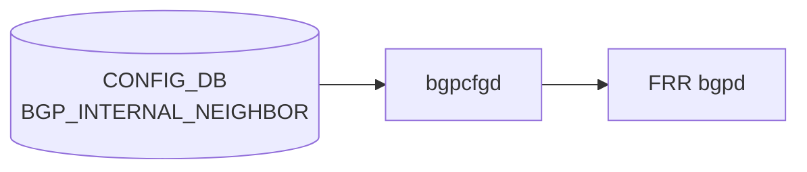

# BGP_INTERNAL_NEIGHBOR テーブル

## 概要

[マルチ ASIC](../../reference/glossary.md#term-multi-asic) プラットフォームにおける ASIC 間内部 iBGP セッションを [CONFIG_DB](../../reference/glossary.md#term-config_db) で定義するテーブル。同一物理筐体内の複数 ASIC が iBGP で経路を交換するために使用する。`bgpcfgd` (`docker-fpm-frr` 内) が読み出して Jinja2 テンプレート (`bgpd/templates/internal/`) 経由で [FRR](../../reference/glossary.md#term-frr) (`bgpd`) に反映する[^1]。

通常の `BGP_NEIGHBOR` との主要な差異:

- iBGP のみ（ASN は DEVICE_METADATA の `bgp_asn` と一致することが YANG `must` で強制）
- `holdtime`/`keepalive`/`nhopself` は CONFIG_DB 値を **無視**し、テンプレートがハードコード値を適用
- `sub_role` / `switch_type` によってルートマップ・next-hop-self が自動付与される

<!-- cdb-mermaid -->
### データフロー (自動生成)



!!! note "凡例"
    CONFIG_DB から FRR までの典型経路を示す。詳細・例外は本ページ本文を参照。
<!-- /cdb-mermaid -->

## key 構造

```text
BGP_INTERNAL_NEIGHBOR|<neighbor>
BGP_INTERNAL_NEIGHBOR|<vrf_name>|<neighbor>
```

`<neighbor>` は内部 ASIC の IP アドレス（IPv4 または IPv6）。

## フィールド一覧

`sonic-bgp-common.yang` の `sonic-bgp-cmn-neigh` grouping を `uses` する。`BGP_NEIGHBOR` の `sonic-bgp-cmn` とは **別の grouping**（フィールドが少ない簡略版）であることに注意。

| フィールド | 型 | YANG default | bgpcfgd 実装挙動 |
|-----------|----|-------------|-----------------|
| `neighbor` (key) | inet:ip-address | — | YANG `must` で DEVICE_METADATA の `bgp_asn` 参照 |
| `asn` | uint32 0..4294967295 | なし | YANG `must` で DEVICE_METADATA `bgp_asn` と一致を強制 |
| `local_addr` | inet:ip-address | なし (mandatory) | YANG mandatory true; bgpcfgd は欠如時 warn のみで処理続行（乖離） |
| `name` | string | なし | optional; 欠如時は neighbor アドレスを tag として使用 |
| `holdtime` | uint16 | なし | **dead field** — テンプレートが `timers 3 10` をハードコードで上書き |
| `keepalive` | uint16 | なし | **dead field** — テンプレートが `timers 3 10` をハードコードで上書き |
| `nhopself` | uint8 0..1 | なし | **dead field** — sub_role/switch_type でプラットフォーム依存に上書き |
| `rrclient` | uint8 0..1 | なし | 有効 field: `!= 0` のとき `route-reflector-client` を生成 |
| `admin_status` | `up`/`down` | なし | minigraph 生成時は常に `up`; ランタイム更新も唯一サポートされるフィールド |

## ハードコードデフォルトと dead field

`instance.conf.j2` が CONFIG_DB の値に関わらず以下をハードコードする:

```text
neighbor <addr> timers 3 10        # keepalive=3, holdtime=10 (CONFIG_DB 値無視)
neighbor <addr> timers connect 10  # conn_retry 相当 (CONFIG_DB 値無視)
```

`peer-group.conf.j2` が常時適用する設定（フィールド値依存なし）:

```text
neighbor INTERNAL_PEER_V4 soft-reconfiguration inbound
neighbor INTERNAL_PEER_V4 allowas-in 1
neighbor INTERNAL_PEER_V4 send-community
neighbor INTERNAL_PEER_V4 route-map FROM_BGP_INTERNAL_PEER_V4 in
neighbor INTERNAL_PEER_V4 route-map TO_BGP_INTERNAL_PEER_V4 out
```

## プラットフォーム依存挙動

`DEVICE_METADATA.sub_role` および `switch_type` の値によって FRR 設定が自動分岐する:

| 条件 | 自動適用される設定 | テンプレート |
|------|------------------|------------|
| `sub_role == 'BackEnd'` | ピアグループ単位で `route-reflector-client` 付与 | `peer-group.conf.j2` |
| `sub_role == 'BackEnd'` または `switch_type == 'chassis-packet'` | 個別 neighbor に `next-hop-self force` | `instance.conf.j2` |
| `switch_type == 'chassis-packet'` | `update-source Loopback4096` + `ttl-security hops 1` | `peer-group.conf.j2` |
| `sub_role == 'BackEnd'` | `FROM_BGP_INTERNAL_PEER_V4` に `set originator-id <Loopback4096 or bgp_router_id>` | `policies.conf.j2` |
| `switch_type == 'chassis-packet'` | community-list + tag + local-preference によるルーティングポリシー | `policies.conf.j2` |

## YANG-実装 Discrepancy

| フィールド | YANG 定義 | bgpcfgd 実装 | 乖離種別 |
|-----------|----------|-------------|---------|
| `holdtime` | uint16（YANG default なし） | テンプレートで完全無視、`timers 3 10` ハードコード | dead field |
| `keepalive` | uint16（YANG default なし） | テンプレートで完全無視、`timers 3 10` ハードコード | dead field |
| `nhopself` | uint8 0..1 | テンプレートで完全無視、sub_role/switch_type で代替 | dead field + プラットフォーム依存乖離 |
| `local_addr` | mandatory true（YANG refine） | bgpcfgd は欠如時 `log_warn` のみで処理続行 | YANG-実装 discrepancy |

## 制約

- `asn`: YANG `must` で DEVICE_METADATA の `bgp_asn` と一致かつ `>= 1`。iBGP 専用テーブル
- `local_addr`: YANG `mandatory true` + neighbor と同一 AF（IPv4-IPv4 or IPv6-IPv6）であること
- minigraph 生成時: ASN 未設定 or 0 のエントリは `filter_bad_asn()` でサイレント除外

## 購読者

- `bgpcfgd` (`docker-fpm-frr` 内、`BGPPeerMgrBase(peer_type="internal")`):
  - `check_neig_meta=False`（DEVICE_NEIGHBOR_METADATA チェックなし）
  - `check_deployment_id` は constants 設定次第
  - peer_type `internal` のみ Loopback4096 依存を追加 (`managers_bgp.py` L146)
- `sonic-py-common.multi_asic`: `is_bgp_session_internal()` で参照（マルチ ASIC 判定用）

<!-- defaults -->
## コード由来の暗黙デフォルト

### フィールドデフォルト一覧

| フィールド | YANG default | コード fallback / ハードコード | dead? | 乖離種別 |
|-----------|-------------|-------------------------------|-------|---------|
| `asn` | なし | minigraph: ASN 欠落エントリは filter_bad_asn() で除外（silent drop） | — | — |
| `local_addr` | mandatory（YANG） | bgpcfgd: 欠如時 warn のみで続行 | — | YANG-実装 discrepancy |
| `holdtime` | なし | instance.conf.j2: `timers 3 10` ハードコード（CONFIG_DB 値無視） | dead field | dead field |
| `keepalive` | なし | instance.conf.j2: `timers 3 10` ハードコード（CONFIG_DB 値無視） | dead field | dead field |
| `nhopself` | なし | テンプレートで完全無視。sub_role/switch_type が next-hop-self force を制御 | dead field | dead field + プラットフォーム依存 |
| `rrclient` | なし | 0 相当（欠如時 `int != 0` が False → route-reflector-client なし） | — | — |
| `admin_status` | なし | minigraph: 内部セッションは常に `'up'`（ハードコード） | — | — |
| `name` | なし | 欠如時は neighbor アドレスを tag として使用 | — | — |
| timers connect | （フィールドなし） | instance.conf.j2 が `timers connect 10` をハードコード | — | ハードコード |
| soft-reconfiguration inbound | （フィールドなし） | peer-group.conf.j2 が常時付与 | — | ハードコード |
| allowas-in 1 | （フィールドなし） | peer-group.conf.j2 が常時付与 | — | ハードコード |
| send-community | （フィールドなし） | peer-group.conf.j2 が常時付与 | — | ハードコード |

### 重要な暗黙挙動

1. **holdtime/keepalive は CONFIG_DB 値が無効**: minigraph が `holdtime=180, keepalive=60` を書き込んでも bgpcfgd テンプレートが `timers 3 10` で上書きするため、オペレーターが CONFIG_DB を変更しても実際の FRR タイマーは変わらない。

2. **nhopself は dead field**: minigraph が `nhopself=1/0` を書き込んでも bgpcfgd は読まない。next-hop-self は `sub_role` と `switch_type` によって自動決定される。

3. **local_addr 欠如時の silent warn**: YANG は mandatory だが bgpcfgd は warn を出して続行する。ただし interface 解決ができなければ peer 追加は延期（書込み順依存）。

4. **admin_status は常に 'up'（minigraph 生成時）**: 内部 BGP セッションを手動で `down` にする実用的なパスは minigraph 以外からの直接 CONFIG_DB 書き込みのみ。

5. **YANG-実装 discrepancy（local_addr mandatory）**: YANG バリデーターは `local_addr` 欠如を拒否するが、bgpcfgd ランタイムは欠如のまま処理を進める。YANG バリデーションを通過しないエントリが CONFIG_DB に直接書き込まれた場合の動作は未定義。

### スキャン証跡

- `instance.conf.j2` 34 行全行精読: timers ハードコード、nhopself 参照なし確認
- `peer-group.conf.j2` 36 行全行精読: soft-reconfiguration/allowas-in/send-community 常時付与確認
- `managers_bgp.py` 598 行全行精読: local_addr warn only、check_neig_meta=False 確認
- `minigraph.py` L1297-1430: filter_bad_asn、admin_status='up' ハードコード確認
<!-- /defaults -->

## 関連 CONFIG_DB / YANG / CLI

- 関連 CONFIG_DB: `BGP_NEIGHBOR`、`BGP_VOQ_CHASSIS_NEIGHBOR`、`DEVICE_METADATA`
- 関連 YANG: `sonic-bgp-internal-neighbor`、`sonic-bgp-common`
- 関連 CLI: マルチ ASIC 環境では `show ip bgp summary` / `vtysh -c 'show bgp neighbor'`

<!-- ordering -->
## 書込み順依存（CONFIG_DB への投入順序）

`BGP_INTERNAL_NEIGHBOR` エントリを CONFIG_DB に書き込む際、以下の順序依存が `bgpcfgd` の実装（`managers_bgp.py`）および `frrcfgd.py` から検出されている。

### 1. DEVICE_METADATA 先行必須

`BGPPeerMgrBase` は `deps` リストに `DEVICE_METADATA|localhost.bgp_asn` と `DEVICE_METADATA|localhost.type` を登録する（`managers_bgp.py` L118-120）。これらが未充足の間はテーブルイベント自体がハンドラに届かない。さらに `add_peer()` は `bgp_asn` を直接参照する（L192）。

**順序依存**: `DEVICE_METADATA|localhost.bgp_asn` と `.type` は `BGP_INTERNAL_NEIGHBOR` より先行して CONFIG_DB に存在しなければならない。

### 2. BGP_GLOBALS.local_asn 先行必須（FRR レイヤ）

`frrcfgd` は `BGP_GLOBALS.local_asn` 受信時に `router bgp <ASN>` インスタンスを FRR bgpd に生成する（`frrcfgd.py` L2700-2703）。`local_asn` が未設定の VRF に対する BGP 設定はすべてスキップされる（L2659-2662）。`bgpcfgd` テンプレートが生成する FRR コマンドも `router bgp <ASN>` コンテキスト内で実行されるため、FRR 側に該当 ASN のインスタンスが先に存在していることが前提となる。

**推奨順序**: `BGP_GLOBALS|default.local_asn` → `BGP_INTERNAL_NEIGHBOR`

### 3. PORT / PORTCHANNEL / INTERFACE 先行必須（local_addr 解決）

`add_peer()` はフィールド `local_addr` に対応するインターフェースを `get_local_interface()` で解決する（`managers_bgp.py` L198-201）。`LOCAL.interfaces` スロットに対応エントリが未登録の場合は `return False`（再試行待ち）となり、peer 確立が延期される。deps にも `("LOCAL", "local_addresses", "")` と `("LOCAL", "interfaces", "")` が含まれる（L124-125）。

**順序依存**: `BGP_INTERNAL_NEIGHBOR.local_addr` が指す IP アドレスに対応する `INTERFACE` / `PORTCHANNEL_INTERFACE` / `LOOPBACK_INTERFACE` エントリが先行していること。

### 4. Loopback0 / Loopback4096 先行必須

- **Loopback0**（L121）: deps 宣言。`add_peer()` は Loopback0 の IPv4 アドレスを取得できず、かつ `DEVICE_METADATA.bgp_router_id` も未設定の場合は `return False`（L184-189）。
- **Loopback4096**（L145-146）: `peer_type == 'internal'` 専用の deps。`policies.conf.j2` L7 でも `originator-id` 設定のため参照される（`sub_role == 'BackEnd'` 時）。

**順序依存**: `LOOPBACK_INTERFACE|Loopback0|<IPv4>` および `LOOPBACK_INTERFACE|Loopback4096|<IPv4>` が `BGP_INTERNAL_NEIGHBOR` エントリより先行していること（マルチ ASIC 環境では minigraph が自動生成する）。

### 5. bgpcfgd ハンドラ起動順（post_dependencies_init）

`BGPPeerMgrBase` は `post_dependencies_init_complete = False` で初期化される（L101）。deps（DEVICE_METADATA, Loopback0, Loopback4096）が充足された後の最初の `set_handler` 呼び出し時に `post_dependencies_init()` が実行され、追加 loopback リストを拡張する（L181-182, L245-268）。この一回性初期化は最初の `add_peer()` 前に完了する。

### 6. bgpd ソケット待ち（frrcfgd 起動時）

`frrcfgd` は起動時に `/run/frr/bgpd.vty` 等の FRR デーモンソケットに接続するまで最大 100 回 × 2秒 = 200秒 リトライする（`frrcfgd.py` L183-200）。bgpd ソケットが存在しない間は、frrcfgd・bgpcfgd とも FRR への設定投入を開始できない。コンテナ起動直後の数秒間は CONFIG_DB にエントリが存在しても FRR への反映が遅延する。

### 順序依存サマリ

| # | 先行必須エントリ | 影響 | 緩和策 |
|---|----------------|------|--------|
| 1 | `DEVICE_METADATA|localhost.bgp_asn` / `.type` | deps 未充足でイベント保留 | minigraph が同時書き込み |
| 2 | `BGP_GLOBALS|default.local_asn`（FRR レイヤ） | bgpd router インスタンス未生成 | frrcfgd が通常先行処理 |
| 3 | `INTERFACE` / `PORTCHANNEL_INTERFACE`（local_addr 対応） | `return False` で再試行待ち | runtime は自動再試行 |
| 4 | `LOOPBACK_INTERFACE|Loopback0` / `Loopback4096` | deps 未充足・`return False` | minigraph が自動生成 |
| 5 | deps 充足 → post_dependencies_init | 最初の add_peer 前に一回実行 | deps 充足後に自動実行 |
| 6 | bgpd ソケット存在 | frrcfgd/bgpcfgd が設定投入不可 | docker-fpm-frr 起動シーケンスで保証 |

<!-- /ordering -->

<!-- platform -->
## プラットフォーム差異 (Phase H)

### 対象プラットフォーム

`BGP_INTERNAL_NEIGHBOR` テーブルは **multi-ASIC** プラットフォームおよび **chassis-packet** スイッチ専用である。シングル ASIC 非 chassis 機器では minigraph パーサがこのテーブルに一切エントリを生成しない。

`VOQ chassis` 向け iBGP は **別テーブル** `BGP_VOQ_CHASSIS_NEIGHBOR` を使用し、本テーブルには入らない（minigraph.py L1345-1347）。

### minigraph.py によるテーブル振り分け

`parse_cpg()` (minigraph.py L1297) が `BGPSession` ごとにテーブルを決定する:

| 振り分け条件 | 宛先テーブル | admin_status | evidence |
|---|---|---|---|
| `<ChassisInternal>` == `"chassis-packet"` または BgpGroup Start/End が `CHASSIS_CARD_PACKET` | `BGP_INTERNAL_NEIGHBOR` | `'up'`（強制） | `minigraph.py:1341-1350` |
| 両端が同一 `local_devices` 内（FrontEnd/BackEnd ASIC ペア） | `BGP_INTERNAL_NEIGHBOR` | `'up'`（強制） | `minigraph.py:1351-1353` |
| `<ChassisInternal>` == `"voq"` または BgpGroup が `CHASSIS_CARD_VOQ` | `BGP_VOQ_CHASSIS_NEIGHBOR` | `'up'` | `minigraph.py:1345-1347` |
| それ以外（外部 eBGP / 通常 iBGP） | `BGP_NEIGHBOR` | `None`（未設定） | `minigraph.py:1354-1356` |

multi-ASIC 機器では `enable_internal_bgp_session()` (L1888-1901) が FrontEnd/BackEnd ペアの `admin_status` を `'up'` に上書きする。

### bgpd/templates/internal/policies.conf.j2 の 3 分岐

`policies.conf.j2` は `DEVICE_METADATA.localhost.sub_role` および `switch_type` に応じて 3 分岐する:

| 分岐条件 | 生成される FRR 設定 | evidence |
|---|---|---|
| `sub_role == 'BackEnd'`（multi-ASIC BackEnd ASIC） | `FROM_BGP_INTERNAL_PEER_V4/V6` に `set originator-id`（`bgp_router_id` または Loopback4096 IP） | `internal/policies.conf.j2:8-27` |
| `switch_type == 'chassis-packet'`（chassis-packet スイッチ） | community-list 定義 + `FROM/TO_BGP_INTERNAL_PEER_V4/V6` に community tag・delete 操作。`subtype` によりさらに分岐 | `internal/policies.conf.j2:28-93` |
| それ以外（multi-ASIC FrontEnd など） | `FROM_BGP_INTERNAL_PEER_V6 permit 1` の `set ipv6 next-hop prefer-global` のみ | `internal/policies.conf.j2:94-97` |

#### chassis-packet における subtype 二次分岐

| subtype 値 | `FROM_BGP_INTERNAL_PEER_V4/V6 permit 3/4` の挙動 |
|---|---|
| `DownstreamLC` | fallback community を **delete のみ**（`set tag` なし） |
| その他（`UpstreamLC` 等） | fallback community を delete + `set tag route_eligible_for_fallback_to_default_tag` |

### managers_bgp.py の内部 peer 固有分岐

| 条件 | 効果 | evidence |
|---|---|---|
| `peer_type == 'internal'`（BGP_INTERNAL_NEIGHBOR のみ） | `Loopback4096` を依存として deps に追加 | `managers_bgp.py:145-146` |
| `check_neig_meta=False`（固定） | `DEVICE_NEIGHBOR_METADATA` に依存しない | `bgpcfgd/main.py:88` |

他 peer_type（`general`・`voq_chassis`・`monitors` 等）は `Loopback4096` 依存を持たない。

### frrcfgd.py（frr-mgmt-framework パス）— 非対応

`frrcfgd.py` は `BGP_INTERNAL_NEIGHBOR` を購読しない。`bgpcfgd` 専用パスのみで処理される。`DEVICE_METADATA.frr_mgmt_framework_config=true` の構成でも内部 iBGP は `bgpcfgd` が担当する。

**根拠**: `sonic-buildimage/src/sonic-frr-mgmt-framework/frrcfgd/frrcfgd.py` 全体を `BGP_INTERNAL_NEIGHBOR` / `internal_neighbor` キーワードでスキャンしたが一致なし。

### VOQ chassis（BGP_VOQ_CHASSIS_NEIGHBOR）との差異

| 属性 | BGP_INTERNAL_NEIGHBOR | BGP_VOQ_CHASSIS_NEIGHBOR |
|---|---|---|
| テンプレートディレクトリ | `bgpd/templates/internal/` | `bgpd/templates/voq_chassis/` |
| route-map 名 | `FROM/TO_BGP_INTERNAL_PEER_V4/V6` | `FROM/TO_VOQ_CHASSIS_V4/V6_PEER` |
| subtype 分岐 | `DownstreamLC` vs その他（permit で tag 有無） | `UpstreamLC` vs その他（**deny** vs permit で逆） |
| Loopback 依存 | `Loopback4096`（managers_bgp.py deps に追加） | `Loopback4096` 依存なし |
| 生成プラットフォーム | chassis-packet / multi-ASIC | VOQ chassis |

<!-- /platform -->

<!-- ref-triangle:start -->

## 関連リファレンス

- YANG: `sonic-bgp-internal-neighbor` / `sonic-bgp-common`
- CONFIG_DB: [BGP_NEIGHBOR](bgp-neighbor.md)

<!-- ref-triangle:end -->

## 引用元

[^1]: YANG 定義: `sonic-bgp-internal-neighbor.yang`. <https://github.com/sonic-net/sonic-buildimage/blob/master/src/sonic-yang-models/yang-models/sonic-bgp-internal-neighbor.yang>; 実装: `bgpcfgd/managers_bgp.py`、`bgpd/templates/internal/`

<!-- ops-hint -->
## 運用ヒント

### 典型値（minigraph 生成時）

```json
"BGP_INTERNAL_NEIGHBOR": {
  "10.0.0.1": {
    "asn": "65001",
    "holdtime": "180",
    "keepalive": "60",
    "local_addr": "10.0.0.2",
    "name": "ASIC0",
    "nhopself": "0",
    "rrclient": "0",
    "admin_status": "up"
  }
}
```

### 注意: holdtime/keepalive は実際には効かない

上記の `holdtime: 180`, `keepalive: 60` は minigraph が書き込むが、`bgpcfgd` テンプレートが `timers 3 10` をハードコードで上書きするため FRR に反映されない。

### 確認コマンド

```bash
sonic-db-cli CONFIG_DB hgetall 'BGP_INTERNAL_NEIGHBOR|10.0.0.1'
show ip bgp summary
vtysh -c 'show bgp neighbor 10.0.0.1'
```
<!-- /ops-hint -->
