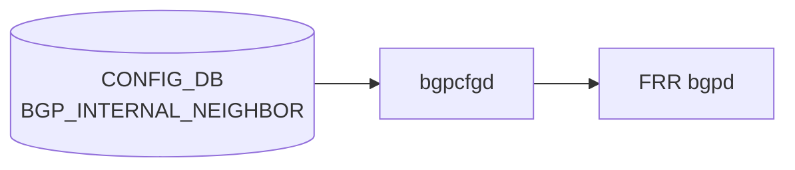

# BGP_INTERNAL_NEIGHBOR テーブル

## 概要

[マルチ ASIC](../../reference/glossary.md#term-multi-asic) プラットフォームにおける [ASIC](../../reference/glossary.md#term-asic) 間内部 iBGP セッションを [CONFIG_DB](../../reference/glossary.md#term-config_db) で定義するテーブル。同一物理筐体内の複数 [ASIC](../../reference/glossary.md#term-asic) が iBGP で経路を交換するために使用する。`bgpcfgd` (`docker-fpm-frr` 内) が読み出して Jinja2 テンプレート (`bgpd/templates/internal/`) 経由で [FRR](../../reference/glossary.md#term-frr) (`bgpd`) に反映する[^1]。

通常の `BGP_NEIGHBOR` との主要な差異:

- iBGP のみ（ASN は [DEVICE_METADATA](../../reference/glossary.md#term-device_metadata) の `bgp_asn` と一致することが [YANG](../../reference/glossary.md#term-yang) `must` で強制）
- `holdtime`/`keepalive`/`nhopself` は [CONFIG_DB](../../reference/glossary.md#term-config_db) 値を **無視**し、テンプレートがハードコード値を適用
- `sub_role` / `switch_type` によってルートマップ・next-hop-self が自動付与される

<!-- cdb-mermaid -->
### データフロー (自動生成)



!!! note "凡例"
    CONFIG_DB から FRR までの典型経路を示す。詳細・例外は本ページ本文を参照。
<!-- /cdb-mermaid -->

## key 構造

```text
BGP_INTERNAL_NEIGHBOR|<neighbor>
BGP_INTERNAL_NEIGHBOR|<vrf_name>|<neighbor>
```

`<neighbor>` は内部 [ASIC](../../reference/glossary.md#term-asic) の IP アドレス（IPv4 または IPv6）。

## フィールド一覧

`sonic-bgp-common.yang` の `sonic-bgp-cmn-neigh` grouping を `uses` する。`BGP_NEIGHBOR` の `sonic-bgp-cmn` とは **別の grouping**（フィールドが少ない簡略版）であることに注意。

| フィールド | 型 | [YANG](../../reference/glossary.md#term-yang) default | [bgpcfgd](../../reference/glossary.md#term-bgpcfgd) 実装挙動 |
|-----------|----|-------------|-----------------|
| `neighbor` (key) | inet:ip-address | — | [YANG](../../reference/glossary.md#term-yang) `must` で [DEVICE_METADATA](../../reference/glossary.md#term-device_metadata) の `bgp_asn` 参照 |
| `asn` | uint32 0..4294967295 | なし | YANG `must` で [DEVICE_METADATA](../../reference/glossary.md#term-device_metadata) `bgp_asn` と一致を強制 |
| `local_addr` | inet:ip-address | なし (mandatory) | YANG mandatory true; [bgpcfgd](../../reference/glossary.md#term-bgpcfgd) は欠如時 warn のみで処理続行（乖離） |
| `name` | string | なし | optional; 欠如時は neighbor アドレスを tag として使用 |
| `holdtime` | uint16 | なし | **dead field** — テンプレートが `timers 3 10` をハードコードで上書き |
| `keepalive` | uint16 | なし | **dead field** — テンプレートが `timers 3 10` をハードコードで上書き |
| `nhopself` | uint8 0..1 | なし | **dead field** — sub_role/switch_type でプラットフォーム依存に上書き |
| `rrclient` | uint8 0..1 | なし | 有効 field: `!= 0` のとき `route-reflector-client` を生成 |
| `admin_status` | `up`/`down` | なし | minigraph 生成時は常に `up`; ランタイム更新も唯一サポートされるフィールド |

## ハードコードデフォルトと dead field

`instance.conf.j2` が [CONFIG_DB](../../reference/glossary.md#term-config_db) の値に関わらず以下をハードコードする:

```text
neighbor <addr> timers 3 10        # keepalive=3, holdtime=10 (CONFIG_DB 値無視)
neighbor <addr> timers connect 10  # conn_retry 相当 (CONFIG_DB 値無視)
```

`peer-group.conf.j2` が常時適用する設定（フィールド値依存なし）:

```text
neighbor INTERNAL_PEER_V4 soft-reconfiguration inbound
neighbor INTERNAL_PEER_V4 allowas-in 1
neighbor INTERNAL_PEER_V4 send-community
neighbor INTERNAL_PEER_V4 route-map FROM_BGP_INTERNAL_PEER_V4 in
neighbor INTERNAL_PEER_V4 route-map TO_BGP_INTERNAL_PEER_V4 out
```

## プラットフォーム依存挙動

`DEVICE_METADATA.sub_role` および `switch_type` の値によって [FRR](../../reference/glossary.md#term-frr) 設定が自動分岐する:

| 条件 | 自動適用される設定 | テンプレート |
|------|------------------|------------|
| `sub_role == 'BackEnd'` | ピアグループ単位で `route-reflector-client` 付与 | `peer-group.conf.j2` |
| `sub_role == 'BackEnd'` または `switch_type == 'chassis-packet'` | 個別 neighbor に `next-hop-self force` | `instance.conf.j2` |
| `switch_type == 'chassis-packet'` | `update-source Loopback4096` + `ttl-security hops 1` | `peer-group.conf.j2` |
| `sub_role == 'BackEnd'` | `FROM_BGP_INTERNAL_PEER_V4` に `set originator-id <Loopback4096 or bgp_router_id>` | `policies.conf.j2` |
| `switch_type == 'chassis-packet'` | community-list + tag + local-preference によるルーティングポリシー | `policies.conf.j2` |

## YANG-実装 Discrepancy

| フィールド | YANG 定義 | [bgpcfgd](../../reference/glossary.md#term-bgpcfgd) 実装 | 乖離種別 |
|-----------|----------|-------------|---------|
| `holdtime` | uint16（YANG default なし） | テンプレートで完全無視、`timers 3 10` ハードコード | dead field |
| `keepalive` | uint16（YANG default なし） | テンプレートで完全無視、`timers 3 10` ハードコード | dead field |
| `nhopself` | uint8 0..1 | テンプレートで完全無視、sub_role/switch_type で代替 | dead field + プラットフォーム依存乖離 |
| `local_addr` | mandatory true（YANG refine） | bgpcfgd は欠如時 `log_warn` のみで処理続行 | YANG-実装 discrepancy |

## 制約

- `asn`: YANG `must` で DEVICE_METADATA の `bgp_asn` と一致かつ `>= 1`。iBGP 専用テーブル
- `local_addr`: YANG `mandatory true` + neighbor と同一 AF（IPv4-IPv4 or IPv6-IPv6）であること
- minigraph 生成時: ASN 未設定 or 0 のエントリは `filter_bad_asn()` でサイレント除外

## 購読者

- `bgpcfgd` (`docker-fpm-frr` 内、`BGPPeerMgrBase(peer_type="internal")`):
  - `check_neig_meta=False`（DEVICE_NEIGHBOR_METADATA チェックなし）
  - `check_deployment_id` は constants 設定次第
  - peer_type `internal` のみ Loopback4096 依存を追加 (`managers_bgp.py` L146)
- `sonic-py-common.multi_asic`: `is_bgp_session_internal()` で参照（マルチ ASIC 判定用）

<!-- defaults -->
## コード由来の暗黙デフォルト

### フィールドデフォルト一覧

| フィールド | YANG default | コード fallback / ハードコード | dead? | 乖離種別 |
|-----------|-------------|-------------------------------|-------|---------|
| `asn` | なし | minigraph: ASN 欠落エントリは filter_bad_asn() で除外（silent drop） | — | — |
| `local_addr` | mandatory（YANG） | bgpcfgd: 欠如時 warn のみで続行 | — | YANG-実装 discrepancy |
| `holdtime` | なし | instance.conf.j2: `timers 3 10` ハードコード（CONFIG_DB 値無視） | dead field | dead field |
| `keepalive` | なし | instance.conf.j2: `timers 3 10` ハードコード（CONFIG_DB 値無視） | dead field | dead field |
| `nhopself` | なし | テンプレートで完全無視。sub_role/switch_type が next-hop-self force を制御 | dead field | dead field + プラットフォーム依存 |
| `rrclient` | なし | 0 相当（欠如時 `int != 0` が False → route-reflector-client なし） | — | — |
| `admin_status` | なし | minigraph: 内部セッションは常に `'up'`（ハードコード） | — | — |
| `name` | なし | 欠如時は neighbor アドレスを tag として使用 | — | — |
| timers connect | （フィールドなし） | instance.conf.j2 が `timers connect 10` をハードコード | — | ハードコード |
| soft-reconfiguration inbound | （フィールドなし） | peer-group.conf.j2 が常時付与 | — | ハードコード |
| allowas-in 1 | （フィールドなし） | peer-group.conf.j2 が常時付与 | — | ハードコード |
| send-community | （フィールドなし） | peer-group.conf.j2 が常時付与 | — | ハードコード |

### 重要な暗黙挙動

1. **holdtime/keepalive は CONFIG_DB 値が無効**: minigraph が `holdtime=180, keepalive=60` を書き込んでも bgpcfgd テンプレートが `timers 3 10` で上書きするため、オペレーターが CONFIG_DB を変更しても実際の [FRR](../../reference/glossary.md#term-frr) タイマーは変わらない。

2. **nhopself は dead field**: minigraph が `nhopself=1/0` を書き込んでも bgpcfgd は読まない。next-hop-self は `sub_role` と `switch_type` によって自動決定される。

3. **local_addr 欠如時の silent warn**: YANG は mandatory だが bgpcfgd は warn を出して続行する。ただし interface 解決ができなければ peer 追加は延期（書込み順依存）。

4. **admin_status は常に 'up'（minigraph 生成時）**: 内部 [BGP](../../reference/glossary.md#term-bgp) セッションを手動で `down` にする実用的なパスは minigraph 以外からの直接 CONFIG_DB 書き込みのみ。

5. **YANG-実装 discrepancy（local_addr mandatory）**: YANG バリデーターは `local_addr` 欠如を拒否するが、bgpcfgd ランタイムは欠如のまま処理を進める。YANG バリデーションを通過しないエントリが CONFIG_DB に直接書き込まれた場合の動作は未定義。

### スキャン証跡

- `instance.conf.j2` 34 行全行精読: timers ハードコード、nhopself 参照なし確認
- `peer-group.conf.j2` 36 行全行精読: soft-reconfiguration/allowas-in/send-community 常時付与確認
- `managers_bgp.py` 598 行全行精読: local_addr warn only、check_neig_meta=False 確認
- `minigraph.py` L1297-1430: filter_bad_asn、admin_status='up' ハードコード確認
<!-- /defaults -->

## 関連 CONFIG_DB / YANG / CLI

- 関連 CONFIG_DB: `BGP_NEIGHBOR`、`BGP_VOQ_CHASSIS_NEIGHBOR`、`DEVICE_METADATA`
- 関連 YANG: `sonic-bgp-internal-neighbor`、`sonic-bgp-common`
- 関連 CLI: マルチ ASIC 環境では `show ip bgp summary` / `vtysh -c 'show bgp neighbor'`

<!-- constants -->
## ハードコード定数 (Phase E)

### タイマー固定値（`internal/instance.conf.j2`）

CONFIG_DB の `holdtime` / `keepalive` フィールドは **dead field**。テンプレートが以下をハードコードで適用する:

| FRR 設定 | ハードコード値 | CONFIG_DB フィールド | evidence |
|---------|-------------|-------------------|---------|
| `neighbor <addr> timers <keepalive> <holdtime>` | keepalive=`3`秒、holdtime=`10`秒 | `keepalive`/`holdtime`（無視） | `internal/instance.conf.j2:6` |
| `neighbor <addr> timers connect <retry>` | connect-retry=`10`秒 | （フィールドなし） | `internal/instance.conf.j2:7` |

### peer-group 名定数（`internal/peer-group.conf.j2`）

| 定数 | 値 | evidence |
|-----|-----|---------|
| IPv4 internal peer-group 名 | `INTERNAL_PEER_V4` | `peer-group.conf.j2:4` |
| IPv6 internal peer-group 名 | `INTERNAL_PEER_V6` | `peer-group.conf.j2:5` |

### peer-group 固定設定（CONFIG_DB 値非依存）

| 設定 | ハードコード値 | 適用条件 | evidence |
|-----|-------------|---------|---------|
| `allowas-in` | `1` | 常時（IPv4/IPv6 両 AF） | `peer-group.conf.j2:15,29` |
| `soft-reconfiguration` | `inbound` | 常時 | `peer-group.conf.j2:14,28` |
| `send-community` | — | 常時 | `peer-group.conf.j2:18,32` |
| `ttl-security hops` | `1` | `switch_type == 'chassis-packet'` 時のみ | `peer-group.conf.j2:8,22` |

### route-map 名定数（`internal/policies.conf.j2`）

| 定数 | 値 | 使用箇所 | evidence |
|-----|-----|---------|---------|
| IPv4 inbound route-map | `FROM_BGP_INTERNAL_PEER_V4` | peer-group の `route-map ... in`、policies 全分岐 | `peer-group.conf.j2:16`、`policies.conf.j2:9,32,37,43,47,99` |
| IPv4 outbound route-map | `TO_BGP_INTERNAL_PEER_V4` | peer-group の `route-map ... out` | `peer-group.conf.j2:17`、`policies.conf.j2:78,82,103` |
| IPv6 inbound route-map | `FROM_BGP_INTERNAL_PEER_V6` | 同上 IPv6 | `peer-group.conf.j2:30`、`policies.conf.j2:16,20,53,57,62,68,72,93,101` |
| IPv6 outbound route-map | `TO_BGP_INTERNAL_PEER_V6` | 同上 IPv6 | `peer-group.conf.j2:31`、`policies.conf.j2:85,89,105` |

### chassis-packet 向け community / tag 定数（`policies.conf.j2`、`constants.bgp.*`）

`switch_type == 'chassis-packet'` の場合のみ参照される設定注入定数。

| 定数キー | テスト参照値 | 用途 | evidence |
|---------|------------|------|---------|
| `constants.bgp.internal_community` | `12345:556` | `DEVICE_INTERNAL_COMMUNITY` community-list。`TO_BGP_INTERNAL_PEER` で tag 付与 | `policies.conf.j2:34`、`param_chasiss_packet.json:9` |
| `constants.bgp.internal_fallback_community` | `1111:2222` | `DEVICE_INTERNAL_FALLBACK_COMMUNITY` community-list。フォールバック経路識別 | `policies.conf.j2:35`、`param_chasiss_packet.json:15` |
| `constants.bgp.local_anchor_route_community` | `12345:555` | `LOCAL_ANCHOR_ROUTE_COMMUNITY`。`TO_BGP_INTERNAL_PEER deny 15` で deny 判定 | `policies.conf.j2:36`、`param_chasiss_packet.json:16` |
| `constants.bgp.internal_community_match_tag` | `101` | `FROM_BGP_INTERNAL_PEER permit 1/2` での `set tag` | `policies.conf.j2:40,58`、`param_chasiss_packet.json:13` |
| `constants.bgp.route_eligible_for_fallback_to_default_tag` | `203` | `FROM_BGP_INTERNAL_PEER permit 3/4`（非 DownstreamLC）での `set tag` | `policies.conf.j2:50,70`、`param_chasiss_packet.json:14` |
| NO_EXPORT route local-preference | `80` | `NO_EXPORT` community 一致時の `set local-preference 80` | `policies.conf.j2:45,65` |

<!-- /constants -->

<!-- ordering -->
## 書込み順依存（CONFIG_DB への投入順序）

`BGP_INTERNAL_NEIGHBOR` エントリを CONFIG_DB に書き込む際、以下の順序依存が `bgpcfgd` の実装（`managers_bgp.py`）および `frrcfgd.py` から検出されている。

### 1. DEVICE_METADATA 先行必須

`BGPPeerMgrBase` は `deps` リストに `DEVICE_METADATA|localhost.bgp_asn` と `DEVICE_METADATA|localhost.type` を登録する（`managers_bgp.py` L118-120）。これらが未充足の間はテーブルイベント自体がハンドラに届かない。さらに `add_peer()` は `bgp_asn` を直接参照する（L192）。

**順序依存**: `DEVICE_METADATA|localhost.bgp_asn` と `.type` は `BGP_INTERNAL_NEIGHBOR` より先行して CONFIG_DB に存在しなければならない。

### 2. BGP_GLOBALS.local_asn 先行必須（FRR レイヤ）

`frrcfgd` は `BGP_GLOBALS.local_asn` 受信時に `router bgp <ASN>` インスタンスを FRR bgpd に生成する（`frrcfgd.py` L2700-2703）。`local_asn` が未設定の [VRF](../../reference/glossary.md#term-vrf) に対する [BGP](../../reference/glossary.md#term-bgp) 設定はすべてスキップされる（L2659-2662）。`bgpcfgd` テンプレートが生成する FRR コマンドも `router bgp <ASN>` コンテキスト内で実行されるため、FRR 側に該当 ASN のインスタンスが先に存在していることが前提となる。

**推奨順序**: `BGP_GLOBALS|default.local_asn` → `BGP_INTERNAL_NEIGHBOR`

### 3. PORT / PORTCHANNEL / INTERFACE 先行必須（local_addr 解決）

`add_peer()` はフィールド `local_addr` に対応するインターフェースを `get_local_interface()` で解決する（`managers_bgp.py` L198-201）。`LOCAL.interfaces` スロットに対応エントリが未登録の場合は `return False`（再試行待ち）となり、peer 確立が延期される。deps にも `("LOCAL", "local_addresses", "")` と `("LOCAL", "interfaces", "")` が含まれる（L124-125）。

**順序依存**: `BGP_INTERNAL_NEIGHBOR.local_addr` が指す IP アドレスに対応する `INTERFACE` / `PORTCHANNEL_INTERFACE` / `LOOPBACK_INTERFACE` エントリが先行していること。

### 4. Loopback0 / Loopback4096 先行必須

- **Loopback0**（L121）: deps 宣言。`add_peer()` は Loopback0 の IPv4 アドレスを取得できず、かつ `DEVICE_METADATA.bgp_router_id` も未設定の場合は `return False`（L184-189）。
- **Loopback4096**（L145-146）: `peer_type == 'internal'` 専用の deps。`policies.conf.j2` L7 でも `originator-id` 設定のため参照される（`sub_role == 'BackEnd'` 時）。

**順序依存**: `LOOPBACK_INTERFACE|Loopback0|<IPv4>` および `LOOPBACK_INTERFACE|Loopback4096|<IPv4>` が `BGP_INTERNAL_NEIGHBOR` エントリより先行していること（マルチ ASIC 環境では minigraph が自動生成する）。

### 5. bgpcfgd ハンドラ起動順（post_dependencies_init）

`BGPPeerMgrBase` は `post_dependencies_init_complete = False` で初期化される（L101）。deps（DEVICE_METADATA, Loopback0, Loopback4096）が充足された後の最初の `set_handler` 呼び出し時に `post_dependencies_init()` が実行され、追加 loopback リストを拡張する（L181-182, L245-268）。この一回性初期化は最初の `add_peer()` 前に完了する。

### 6. bgpd ソケット待ち（frrcfgd 起動時）

`frrcfgd` は起動時に `/run/frr/bgpd.vty` 等の FRR デーモンソケットに接続するまで最大 100 回 × 2秒 = 200秒 リトライする（`frrcfgd.py` L183-200）。bgpd ソケットが存在しない間は、frrcfgd・bgpcfgd とも FRR への設定投入を開始できない。コンテナ起動直後の数秒間は CONFIG_DB にエントリが存在しても FRR への反映が遅延する。

### 順序依存サマリ

| # | 先行必須エントリ | 影響 | 緩和策 |
|---|----------------|------|--------|
| 1 | `DEVICE_METADATA|localhost.bgp_asn` / `.type` | deps 未充足でイベント保留 | minigraph が同時書き込み |
| 2 | `BGP_GLOBALS|default.local_asn`（FRR レイヤ） | bgpd router インスタンス未生成 | frrcfgd が通常先行処理 |
| 3 | `INTERFACE` / `PORTCHANNEL_INTERFACE`（local_addr 対応） | `return False` で再試行待ち | runtime は自動再試行 |
| 4 | `LOOPBACK_INTERFACE|Loopback0` / `Loopback4096` | deps 未充足・`return False` | minigraph が自動生成 |
| 5 | deps 充足 → post_dependencies_init | 最初の add_peer 前に一回実行 | deps 充足後に自動実行 |
| 6 | bgpd ソケット存在 | frrcfgd/bgpcfgd が設定投入不可 | docker-fpm-frr 起動シーケンスで保証 |

<!-- /ordering -->

<!-- cross-refs -->
## 暗黙参照 — Phase C (cross-table refs)

> **調査根拠**: `managers_bgp.py`、`frrcfgd.py`、`policies.conf.j2`（internal）全行精読 (2026-05-16)
> 詳細証跡: `meta/_intermediate/cdb-flow/bgp-internal-neighbor-cross-refs.md`

`BGP_INTERNAL_NEIGHBOR` テーブルは YANG leafref が最小限だが、実行時に以下のテーブルを暗黙参照する。

| 参照先 | DB | 参照方向 | YANG leafref | 実装上の必須度 | 証拠 |
|---|---|---|---|---|---|
| `DEVICE_METADATA\|localhost.bgp_asn` | CONFIG_DB | 読み取り (ASN 検証・bgp_asn 取得) | なし | 必須 (deps 宣言) | managers_bgp.py L119, L192 |
| `DEVICE_METADATA\|localhost.type` | CONFIG_DB | 読み取り (check_deployment_id 判定) | なし | 必須 (deps 宣言) | managers_bgp.py L120 |
| `DEVICE_METADATA\|localhost.sub_role` | CONFIG_DB | 読み取り (peer-group / route-map 分岐) | なし | プラットフォーム依存 | policies.conf.j2 L8, peer-group.conf.j2 |
| `DEVICE_METADATA\|localhost.switch_type` | CONFIG_DB | 読み取り (chassis-packet 分岐) | なし | プラットフォーム依存 | policies.conf.j2 L26, peer-group.conf.j2 |
| `DEVICE_METADATA\|localhost.bgp_router_id` | CONFIG_DB | 読み取り (originator-id fallback) | なし | 省略可 (Loopback4096 が代替) | policies.conf.j2 L10-11, L21-22 |
| `BGP_GLOBALS\|<vrf>.local_asn` | CONFIG_DB | 読み取り (router bgp インスタンス生成) | なし | 実質必須 (FRR レイヤ) | frrcfgd.py L2700-2703, L2659-2662 |
| `LOOPBACK_INTERFACE\|Loopback0` | CONFIG_DB | 読み取り (router_id / local_addr 解決) | なし | 必須 (deps 宣言) | managers_bgp.py L121, L216 |
| `LOOPBACK_INTERFACE\|Loopback4096` | CONFIG_DB | 読み取り (originator-id / update-source) | なし | internal 専用 deps | managers_bgp.py L146, policies.conf.j2 L7 |
| `INTERFACE` / `PORTCHANNEL_INTERFACE` | CONFIG_DB | 読み取り (local_addr インターフェース解決) | なし | local_addr が必要な場合は必須 | managers_bgp.py L198-201, deps L124-125 |
| `ROUTE_MAP\|FROM_BGP_INTERNAL_PEER_V4` | CONFIG_DB / FRR | 書き込み (frrcfgd が生成) | なし | ハードコード参照 | policies.conf.j2 L9, 32, 99 |
| `ROUTE_MAP\|TO_BGP_INTERNAL_PEER_V4` | CONFIG_DB / FRR | 書き込み (frrcfgd が生成) | なし | ハードコード参照 | policies.conf.j2 L78, 103 |
| `BGP_PEER_GROUP\|INTERNAL_PEER_V4` | CONFIG_DB / FRR | 書き込み (peer-group.conf.j2 が生成) | なし | ハードコード参照 | peer-group.conf.j2 全体 |

### DEVICE_METADATA — 多目的暗黙参照

`managers_bgp.py` は `deps` リスト（L119-120）に `DEVICE_METADATA|localhost.bgp_asn` と `DEVICE_METADATA|localhost.type` を登録する。これらが CONFIG_DB に存在しない間はテーブルイベント自体がハンドラに届かない。さらに `add_peer()` は `bgp_asn` を直接読み取り（L192）、テンプレート展開時は `CONFIG_DB__DEVICE_METADATA` を辞書全体として渡す（L205）。

`policies.conf.j2` は `DEVICE_METADATA['localhost']['sub_role']` と `switch_type` を分岐条件として使用する（L8, L26）。`bgp_router_id` フィールドは `originator-id` のプライマリソースで、未設定時は Loopback4096 の IPv4 アドレスにフォールバックする（L10-13）。

### BGP_GLOBALS — FRR レイヤの前提条件

`frrcfgd.py` は `BGP_GLOBALS|<vrf>.local_asn` を受信した時点で `router bgp <ASN>` インスタンスを FRR bgpd に生成する（L2700-2703）。`local_asn` が設定されていない [VRF](../../reference/glossary.md#term-vrf) への [BGP](../../reference/glossary.md#term-bgp) 設定は `vrf_tables` チェック（L2659-2662）でスキップされる。`bgpcfgd` テンプレートが生成する FRR コマンドも `router bgp <ASN>` コンテキスト内で実行されるため、**FRR 側に BGP インスタンスが先に存在していることが前提**。YANG leafref はないが実質的な必須依存。

### PORT / PORTCHANNEL_INTERFACE / INTERFACE — local_addr 解決

`add_peer()` は `local_addr` フィールドを解決するため `get_local_interface()` を呼び出し（L198-201）、`LOCAL.interfaces` と `LOCAL.local_addresses` スロットを参照する（deps L124-125）。対応エントリが未登録の場合は `return False` となり peer 確立が自動再試行待ちになる。YANG leafref はないが、`local_addr` を使用する限り INTERFACE / PORTCHANNEL_INTERFACE が先行して存在する必要がある。

### Loopback0 / Loopback4096 — iBGP 専用依存

- **Loopback0**: deps 宣言（L121）。`add_peer()` は Loopback0 の IPv4 アドレスを取得し、`bgp_router_id` 未設定時の router-id として使用（L184-189）。取得できず `bgp_router_id` も未設定なら `return False`。
- **Loopback4096**: `peer_type == 'internal'` 専用の deps（L146）。`policies.conf.j2` L7 で `get_ipv4_loopback_address(CONFIG_DB__LOOPBACK_INTERFACE, "Loopback4096")` を直接参照し、`sub_role == 'BackEnd'` 時の `originator-id` に使用。`switch_type == 'chassis-packet'` 時の `update-source Loopback4096` でも参照される。

### ROUTE_MAP / BGP_PEER_GROUP — frrcfgd / テンプレートが自動生成

`FROM_BGP_INTERNAL_PEER_V4`、`TO_BGP_INTERNAL_PEER_V4`（および V6 版）は `policies.conf.j2` が FRR に直接生成するルートマップ。`INTERNAL_PEER_V4` / `INTERNAL_PEER_V6` は `peer-group.conf.j2` が生成するピアグループ。いずれも CONFIG_DB の `ROUTE_MAP` / `BGP_PEER_GROUP` テーブルへの YANG leafref はなく、テンプレート側がハードコードした名称で FRR に注入する。`frrcfgd.py` L81-90 で `BGP_GLOBALS`・`ROUTE_MAP`・`BGP_PEER_GROUP` は `bgpd` デーモン宛テーブルとして登録されており、frrcfgd 経由の設定と bgpcfgd テンプレート経由の設定が同一 FRR インスタンスに並存する。

### SAI 参照

なし。`bgpcfgd` / `frrcfgd` は CONFIG_DB → FRR（ユーザー空間ルーティングデーモン）への経路であり、[SAI](../../reference/glossary.md#term-sai)/ASIC に直接触れない。[APPL_DB](../../reference/glossary.md#term-appl_db) への中継もない。
<!-- /cross-refs -->

<!-- pubsub -->
## 通信メカニズム (Phase G)

### Redis 購読方式

`BGP_INTERNAL_NEIGHBOR` テーブルへの変更通知は、`bgpcfgd` (`docker-fpm-frr` 内) の `Runner` クラスが **`swsscommon.SubscriberStateTable`** を使って受信する。`Runner.add_manager()` が `BGPPeerMgrBase` (peer_type=`"internal"`) を受け取ると、`SubscriberStateTable(conn, "BGP_INTERNAL_NEIGHBOR")` を生成して [Redis](../../reference/glossary.md#term-redis) keyspace 通知を購読する (`runner.py:47-51`)。`frrcfgd` はこのテーブルを購読しない（`table_handler_list` に `BGP_INTERNAL_NEIGHBOR` が含まれないことを確認済み）。

| 購読者 | 購読 API | 購読テーブル | ハンドラ |
|--------|---------|------------|---------|
| `bgpcfgd` (`BGPPeerMgrBase` peer_type=`internal`) | `swsscommon.SubscriberStateTable` | `BGP_INTERNAL_NEIGHBOR` | `BGPPeerMgrBase.handler` → `add_peer()` / `del_peer()` |
| `frrcfgd` | `ExtConfigDBConnector.subscribe()` (pubsub) | （購読しない） | — |

### keyspace 通知 → ハンドラ呼び出しの流れ

```
CONFIG_DB へ書込 (HSET "BGP_INTERNAL_NEIGHBOR|10.0.0.1" asn 65001 ...)
  ↓ Redis keyspace: PUBLISH "__keyspace@4__:BGP_INTERNAL_NEIGHBOR|10.0.0.1"  "hset"
SubscriberStateTable 内部バッファにイベント蓄積
  ↓ Runner.run() → selector.select(1000ms) がシグナルを検出
subscriber.pop() → (key="10.0.0.1", op="SET", fvs={asn:65001, ...})
  ↓ BGPPeerMgrBase.handler(key, "SET", fvs)
managers_bgp.py: deps 充足チェック → add_peer() / update_peer()
  ↓ Jinja2 テンプレート (bgpd/templates/internal/*.conf.j2) 展開
  ↓ cfg_manager.commit() → FRR bgpd へ設定コマンド投入
```

- `op == "SET"` → `add_peer()` / `update_peer()`、`op == "DEL"` → `del_peer()` に分岐。
- `Runner.SELECT_TIMEOUT = 1000 ms`（epoll 相当の待機）。イベントなしは `TIMEOUT` で次ループへ。
- 全サブスクライバのイベント処理完了後に `cfg_manager.commit()` を一括実行 (`runner.py:71`)。
- 起動時は deps (`DEVICE_METADATA.bgp_asn`、`Loopback0`、`Loopback4096`) 充足まで `BGP_INTERNAL_NEIGHBOR` イベントが保留される (`managers_bgp.py:118-146`)。

### frrcfgd の非購読（確認済み）

`frrcfgd` は `ExtConfigDBConnector.listen_thread()` でデータベース全体の keyspace (`__keyspace@<dbId>__:*`) を `psubscribe` するが、`sub_msg_handler` 内の `table in self.handlers` チェックにより `BGP_INTERNAL_NEIGHBOR` はスキップされる。`DEVICE_METADATA.frr_mgmt_framework_config=true` 構成でも内部 iBGP は常に `bgpcfgd` 専用パスで処理される。

> **Evidence**: `bgpcfgd/runner.py:23-73` (Runner クラス全体)、`bgpcfgd/main.py:88,134-136` (BGP_INTERNAL_NEIGHBOR 登録)、`bgpcfgd/managers_bgp.py:87-182` (BGPPeerMgrBase 初期化・deps)、`frrcfgd/frrcfgd.py:1536-1543` (ExtConfigDBConnector.listen_thread)、`frrcfgd/frrcfgd.py:2293-2338` (table_handler_list — BGP_INTERNAL_NEIGHBOR 不在確認)、`frrcfgd/frrcfgd.py:2359-2361` (subscribe_all); 詳細分析 `meta/_intermediate/cdb-flow/bgp-internal-neighbor-pubsub.md`
<!-- /pubsub -->

<!-- side-effects -->
## 副次 DB 書込 (Phase F)

`BGPPeerMgrBase`（`peer_type="internal"`）は CONFIG_DB `BGP_INTERNAL_NEIGHBOR` の
set/del を受けて **[STATE_DB](../../reference/glossary.md#term-state_db) `BGP_PEER_CONFIGURED_TABLE`** に副次書込を行う。
[COUNTERS_DB](../../reference/glossary.md#term-counters_db) / APPL_STATE_DB / [ASIC_DB](../../reference/glossary.md#term-asic_db) への直接書込は無い。
FRR bgpd への反映は `cfg_mgr.push()` 経由の [vtysh](../../reference/glossary.md#term-vtysh) push のみ。

| 副次 DB | テーブル / フィールド | 発火タイミング | コード根拠 |
|---|---|---|---|
| [STATE_DB](../../reference/glossary.md#term-state_db) | `BGP_PEER_CONFIGURED_TABLE\|<nbr>` (vrf=default) または `\|<vrf>\|<nbr>` | `add_peer()` 成功後 → `SET` (全フィールド) | `managers_bgp.py:239` |
| [STATE_DB](../../reference/glossary.md#term-state_db) | 同上 | `apply_admin_status()` 成功後 → `SET` | `managers_bgp.py:353` |
| STATE_DB | 同上 | `del_handler()` 成功後 → `DEL` | `managers_bgp.py:487` |
| [COUNTERS_DB](../../reference/glossary.md#term-counters_db) | — | 書込なし | `managers_bgp.py` に `COUNTERS_DB` 参照なし |

`frrcfgd.py`（frr-mgmt-framework パス）は `BGP_INTERNAL_NEIGHBOR` を購読しないため副次書込なし（全体スキャンで一致なし）。

詳細スキャン結果: `meta/_intermediate/cdb-flow/bgp-internal-neighbor-side.md`
<!-- /side-effects -->

<!-- platform -->
## プラットフォーム差異 (Phase H)

### 対象プラットフォーム

`BGP_INTERNAL_NEIGHBOR` テーブルは **multi-ASIC** プラットフォームおよび **chassis-packet** スイッチ専用である。シングル ASIC 非 chassis 機器では minigraph パーサがこのテーブルに一切エントリを生成しない。

`VOQ chassis` 向け iBGP は **別テーブル** `BGP_VOQ_CHASSIS_NEIGHBOR` を使用し、本テーブルには入らない（minigraph.py L1345-1347）。

### minigraph.py によるテーブル振り分け

`parse_cpg()` (minigraph.py L1297) が `BGPSession` ごとにテーブルを決定する:

| 振り分け条件 | 宛先テーブル | admin_status | evidence |
|---|---|---|---|
| `<ChassisInternal>` == `"chassis-packet"` または BgpGroup Start/End が `CHASSIS_CARD_PACKET` | `BGP_INTERNAL_NEIGHBOR` | `'up'`（強制） | `minigraph.py:1341-1350` |
| 両端が同一 `local_devices` 内（FrontEnd/BackEnd ASIC ペア） | `BGP_INTERNAL_NEIGHBOR` | `'up'`（強制） | `minigraph.py:1351-1353` |
| `<ChassisInternal>` == `"voq"` または BgpGroup が `CHASSIS_CARD_VOQ` | `BGP_VOQ_CHASSIS_NEIGHBOR` | `'up'` | `minigraph.py:1345-1347` |
| それ以外（外部 eBGP / 通常 iBGP） | `BGP_NEIGHBOR` | `None`（未設定） | `minigraph.py:1354-1356` |

multi-ASIC 機器では `enable_internal_bgp_session()` (L1888-1901) が FrontEnd/BackEnd ペアの `admin_status` を `'up'` に上書きする。

### bgpd/templates/internal/policies.conf.j2 の 3 分岐

`policies.conf.j2` は `DEVICE_METADATA.localhost.sub_role` および `switch_type` に応じて 3 分岐する:

| 分岐条件 | 生成される FRR 設定 | evidence |
|---|---|---|
| `sub_role == 'BackEnd'`（multi-ASIC BackEnd ASIC） | `FROM_BGP_INTERNAL_PEER_V4/V6` に `set originator-id`（`bgp_router_id` または Loopback4096 IP） | `internal/policies.conf.j2:8-27` |
| `switch_type == 'chassis-packet'`（chassis-packet スイッチ） | community-list 定義 + `FROM/TO_BGP_INTERNAL_PEER_V4/V6` に community tag・delete 操作。`subtype` によりさらに分岐 | `internal/policies.conf.j2:28-93` |
| それ以外（multi-ASIC FrontEnd など） | `FROM_BGP_INTERNAL_PEER_V6 permit 1` の `set ipv6 next-hop prefer-global` のみ | `internal/policies.conf.j2:94-97` |

#### chassis-packet における subtype 二次分岐

| subtype 値 | `FROM_BGP_INTERNAL_PEER_V4/V6 permit 3/4` の挙動 |
|---|---|
| `DownstreamLC` | fallback community を **delete のみ**（`set tag` なし） |
| その他（`UpstreamLC` 等） | fallback community を delete + `set tag route_eligible_for_fallback_to_default_tag` |

### managers_bgp.py の内部 peer 固有分岐

| 条件 | 効果 | evidence |
|---|---|---|
| `peer_type == 'internal'`（BGP_INTERNAL_NEIGHBOR のみ） | `Loopback4096` を依存として deps に追加 | `managers_bgp.py:145-146` |
| `check_neig_meta=False`（固定） | `DEVICE_NEIGHBOR_METADATA` に依存しない | `bgpcfgd/main.py:88` |

他 peer_type（`general`・`voq_chassis`・`monitors` 等）は `Loopback4096` 依存を持たない。

### frrcfgd.py（frr-mgmt-framework パス）— 非対応

`frrcfgd.py` は `BGP_INTERNAL_NEIGHBOR` を購読しない。`bgpcfgd` 専用パスのみで処理される。`DEVICE_METADATA.frr_mgmt_framework_config=true` の構成でも内部 iBGP は `bgpcfgd` が担当する。

**根拠**: `sonic-buildimage/src/sonic-frr-mgmt-framework/frrcfgd/frrcfgd.py` 全体を `BGP_INTERNAL_NEIGHBOR` / `internal_neighbor` キーワードでスキャンしたが一致なし。

### VOQ chassis（BGP_VOQ_CHASSIS_NEIGHBOR）との差異

| 属性 | BGP_INTERNAL_NEIGHBOR | BGP_VOQ_CHASSIS_NEIGHBOR |
|---|---|---|
| テンプレートディレクトリ | `bgpd/templates/internal/` | `bgpd/templates/voq_chassis/` |
| route-map 名 | `FROM/TO_BGP_INTERNAL_PEER_V4/V6` | `FROM/TO_VOQ_CHASSIS_V4/V6_PEER` |
| subtype 分岐 | `DownstreamLC` vs その他（permit で tag 有無） | `UpstreamLC` vs その他（**deny** vs permit で逆） |
| Loopback 依存 | `Loopback4096`（managers_bgp.py deps に追加） | `Loopback4096` 依存なし |
| 生成プラットフォーム | chassis-packet / multi-ASIC | [VOQ](../../reference/glossary.md#term-voq) chassis |

<!-- /platform -->

<!-- failure -->
## 失敗挙動

`bgpcfgd` (`managers_bgp.py`) および `frrcfgd.py` から検出された失敗経路を示す。

### SET 処理における失敗経路

| 失敗条件 | 検出箇所 | 結果 | ログ出力 |
|---|---|---|---|
| `DEVICE_METADATA\|localhost.bgp_asn` / `.type` が未存在 | deps フレームワーク L118-120 | SET イベント全件が保留（deps 未充足）。FRR への設定投入ゼロ | なし（内部保留） |
| `Loopback0` IPv4 未設定 かつ `bgp_router_id` も未設定 | `add_peer()` L184-189 | `return False` → 再試行待ち。自動回復あり | `log_warn("... ipv4 address is not presented yet and bgp_router_id not configured")` |
| `Loopback4096` が CONFIG_DB に未存在（`peer_type == 'internal'` 専用 dep） | deps フレームワーク L145-146 | 全 `BGP_INTERNAL_NEIGHBOR` イベントが保留。Loopback4096 が登録されるまで peer 追加ゼロ | なし |
| `local_addr` フィールド欠如 | `add_peer()` L194-196 | `log_warn` 後に処理続行（YANG mandatory 違反をランタイムは無視） | `log_warn("Peer %s. Missing attribute 'local_addr'")` |
| `local_addr` に対応するインターフェースが `LOCAL.interfaces` に未登録 | `add_peer()` L198-202 | `return False` → 再試行待ち。インターフェース登録後に自動回復 | `log_debug("Peer '%s' with local address '%s' wait for the corresponding interface to be set")` |
| `instance.conf.j2` テンプレートレンダリング失敗（`jinja2.TemplateError`） | `add_peer()` L229-234 | `log_err` 後 **`return True`**（再試行なし・FRR に peer 未追加の silent drop） | `log_err("Peer '(%s\|%s)'. Error in rendering the template for 'SET' command '%s'")` |
| `policies.conf.j2` レンダリング時 `sub_role`/`switch_type` キー欠如 | `BGPPeerGroupMgr.update_policy()` L47-50 | `log_err` → `return False`。peer-group 設定が FRR に未反映 | `log_err("Can't render policy template name: '%s': %s")` |
| `sub_role == 'BackEnd'` かつ `Loopback4096` に IPv4 なし | `policies.conf.j2` L7-13 | `originator-id` 行が生成されない（テンプレート内サイレントスキップ）。ルートリフレクタ機能が劣化 | なし |
| `BGP_GLOBALS\|<vrf>.local_asn` が frrcfgd 処理前に未設定 | `frrcfgd.py` L2659-2662 | frrcfgd が当該 [VRF](../../reference/glossary.md#term-vrf) の全テーブル更新をスキップ。FRR bgpd インスタンス未生成のまま bgpcfgd 出力も無視 | `syslog LOG_DEBUG("ignore table {} update because local_asn for VRF {} was not configured")` |
| `/run/frr/bgpd.vty` ソケット接続が 100 回リトライ後も失敗 | `frrcfgd.py` L183-198 `__create_frr_client()` | `RuntimeError` → frrcfgd プロセスがクラッシュ・再起動ループ。最大待ち時間 200 秒 | `syslog LOG_ERR("re-tried too many times, give up")` + `LOG_ERR("failed to create socket to FRR daemon")` |
| [vtysh](../../reference/glossary.md#term-vtysh) コマンド失敗（bgp_asn 設定時） | `frrcfgd.py` L2701, 2706-2707 | `LOG_ERR` 後 `self.bgp_asn[vrf]` 未更新。後続イベントも local_asn 未設定としてスキップされ続ける | `syslog LOG_ERR("failed to set local_asn %s to VRF %s")` |

### DEL 処理における失敗経路

| 失敗条件 | 検出箇所 | 結果 | ログ出力 |
|---|---|---|---|
| `self.peers` セットに未登録の peer を DEL（二重 DEL など） | `del_handler()` L452-454 | `log_warn` 後即 `return`。FRR コマンド送信なし | `log_warn("Peer '(%s\|%s)' has not been found")` |
| `delete` テンプレートレンダリング失敗 | `del_handler()` L480-484 | `log_err` 後も不定 `cmd` で `apply_op` を呼び出す可能性。FRR コマンドが不正になるリスク | `log_err("Peer '(%s\|%s)'. Error in rendering the template for 'DEL' command '%s'")` |
| `apply_op()` が FRR push 失敗 | `del_handler()` L485-491 | `log_err` 後 peer が `self.peers` から削除されない。次 SET 時に `update_peer()` 分岐（`admin_status` のみ処理可能）に入る | `log_err("Peer '(%s\|%s)' hasn't been removed")` |

### 重要な失敗パターン補足

1. **`return True` の罠（テンプレートエラー時）**: `instance.conf.j2` レンダリングエラー時に `return True` を返すため、bgpcfgd はイベントを「処理済み」とみなし再試行しない。FRR に peer が追加されないまま silent drop される。`return False` と異なり自動回復がない。

2. **deps 保留は無音**: `DEVICE_METADATA.bgp_asn` / `Loopback0` / `Loopback4096` のいずれかが未存在の間は、`BGP_INTERNAL_NEIGHBOR` へのすべての SET/DEL がフレームワーク内部で保留される。syslog にも出力されないため運用者には「何も起きていない」ように見える。

3. **frrcfgd の bgpd ソケット待ち**: コンテナ起動直後の最大 200 秒間、frrcfgd は `/run/frr/bgpd.vty` 接続待ちのブロック状態になる。この間は CONFIG_DB の変更が FRR に反映されない。

4. **Loopback4096 が `BackEnd` で二重の役割**: deps として peer 確立を保留させる役割（L146）と、`policies.conf.j2:7` で `originator-id` 取得に使う役割の両方を持つ。IPv4 アドレス未割り当ての場合、deps は充足されても originator-id がサイレントスキップされる点に注意。

<!-- /failure -->

<!-- ref-triangle:start -->

## 関連リファレンス

- YANG: `sonic-bgp-internal-neighbor` / `sonic-bgp-common`
- CONFIG_DB: [BGP_NEIGHBOR](bgp-neighbor.md)

<!-- ref-triangle:end -->

## 引用元

[^1]: YANG 定義: `sonic-bgp-internal-neighbor.yang`. <https://github.com/sonic-net/sonic-buildimage/blob/master/src/sonic-yang-models/yang-models/sonic-bgp-internal-neighbor.yang>; 実装: `bgpcfgd/managers_bgp.py`、`bgpd/templates/internal/`

<!-- ops-hint -->
## 運用ヒント

### 典型値（minigraph 生成時）

```json
"BGP_INTERNAL_NEIGHBOR": {
  "10.0.0.1": {
    "asn": "65001",
    "holdtime": "180",
    "keepalive": "60",
    "local_addr": "10.0.0.2",
    "name": "ASIC0",
    "nhopself": "0",
    "rrclient": "0",
    "admin_status": "up"
  }
}
```

### 注意: holdtime/keepalive は実際には効かない

上記の `holdtime: 180`, `keepalive: 60` は minigraph が書き込むが、`bgpcfgd` テンプレートが `timers 3 10` をハードコードで上書きするため FRR に反映されない。

### 確認コマンド

```bash
sonic-db-cli CONFIG_DB hgetall 'BGP_INTERNAL_NEIGHBOR|10.0.0.1'
show ip bgp summary
vtysh -c 'show bgp neighbor 10.0.0.1'
```
<!-- /ops-hint -->

<!-- glossary-links-injected: 8ed5928fd3e2 -->
